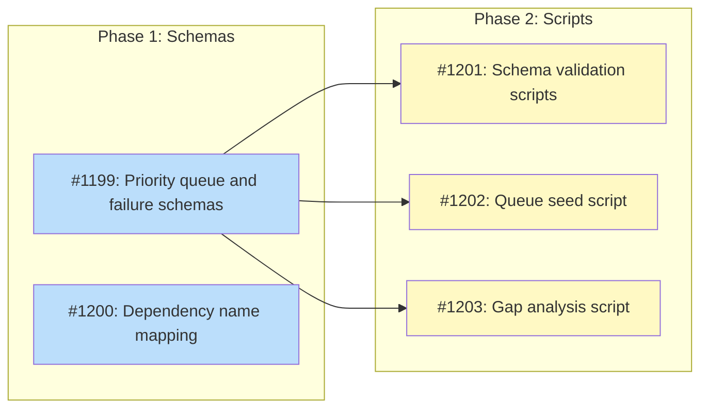

# DESIGN: Priority Queue and Failure Record Schemas

## Status

Planned

## Implementation Issues

### Milestone: [M50: Visibility Infrastructure Schemas](https://github.com/tsukumogami/tsuku/milestone/57)

| Issue | Title | Dependencies | Tier |
|-------|-------|--------------|------|
| [#1199](https://github.com/tsukumogami/tsuku/issues/1199) | feat(data): add priority queue and failure record schemas | None | testable |
| [#1200](https://github.com/tsukumogami/tsuku/issues/1200) | feat(data): add dependency name mapping structure | None | simple |
| [#1201](https://github.com/tsukumogami/tsuku/issues/1201) | feat(scripts): add schema validation scripts | [#1199](https://github.com/tsukumogami/tsuku/issues/1199) | testable |
| [#1202](https://github.com/tsukumogami/tsuku/issues/1202) | feat(scripts): add queue seed script for Homebrew | [#1199](https://github.com/tsukumogami/tsuku/issues/1199) | testable |
| [#1203](https://github.com/tsukumogami/tsuku/issues/1203) | feat(scripts): add gap analysis script | [#1199](https://github.com/tsukumogami/tsuku/issues/1199) | testable |

### Dependency Graph



**Legend**: Green = done, Blue = ready, Yellow = blocked, Purple = needs-design

## Upstream Design Reference

This design implements Phase 0 (Visibility Infrastructure) of [DESIGN-registry-scale-strategy.md](./DESIGN-registry-scale-strategy.md).

**Relevant sections:**
- Phase 0: Visibility Infrastructure
- Required Tactical Design: DESIGN-priority-queue.md

## Context and Problem Statement

The registry scale strategy requires automated batch generation to scale from 155 recipes to 10,000+. Before this automation can safely operate, the system needs visibility infrastructure - structured data formats that answer:

1. **What should we generate?** The priority queue determines which packages to process and in what order. Without it, batch generation has no input.

2. **What went wrong?** When deterministic generation fails (10-15% of Homebrew formulas), failure records capture why. This data drives gap analysis and enables automatic retry when dependencies become available.

Currently, neither schema exists. The strategic design specifies Phase 0 must deliver `data/priority-queue.json` and `data/failure-schema.json` before any batch generation begins.

**Schema acceptance criteria**: The schemas are complete when:
1. CI can parse and validate queue entries without manual intervention
2. Gap analysis can query "packages blocked by dependency X" from failure data
3. Both schemas have explicit version fields enabling future migrations

### Why Now

Phase 0 of the registry scale strategy explicitly requires these schemas before Phase 1 (Homebrew builder refactoring) can produce meaningful failure data. Downstream designs (#1188 Homebrew deterministic mode, #1189 batch pipeline) depend on these formats.

### Scope

**In scope:**
- Package entity schema for priority queue
- Failure record schema with per-environment tracking
- Schema versioning for future migrations
- Scoring algorithm for cross-ecosystem popularity normalization
- Static file format specification (JSON structure, file locations)

**Out of scope:**
- Backend storage migration (D1, R2) - handled in Phase 2
- Failure analysis query API - covered by DESIGN-batch-failure-analysis.md (#1190)
- Re-queue triggers and automation - Phase 2+
- Operator dashboards and visualization

## Decision Drivers

- **Schema versioning required**: Schemas will evolve; migrations must be possible without data loss
- **Static files initially**: Phase 0-1 uses JSON files in the repo; Phase 2 migrates to D1
- **Cross-ecosystem normalization**: npm downloads, crates.io downloads, and GitHub stars have vastly different scales
- **Per-environment tracking**: A package may fail on darwin but succeed on linux-glibc
- **Downstream dependencies**: #1188 needs failure category field; #1189 needs queue file format
- **Gap analysis enablement**: Must answer "which dependencies block the most popular packages?"
- **Simplicity preferred**: Start simple, add complexity only when needed

### Assumptions

These assumptions inform all options:

1. **Package IDs are globally unique**: Format is `{source}:{name}` (e.g., `homebrew:ripgrep`, `cargo:serde`)
2. **Popularity data availability varies**: npm and crates.io have download counts; Go relies on GitHub stars; some sources may have no popularity data
3. **Failures are package-level, not version-level**: We track whether a package fails, not which version
4. **Dependency names require mapping**: `blocked_by` stores tsuku recipe names, requiring a mapping from ecosystem dep names (e.g., Homebrew `libpng` → tsuku `libpng`)
5. **Per-environment tracking is always used**: Even environment-agnostic failures (e.g., "no bottles available") are stored per-environment for consistency

## Considered Options

This design addresses three independent decisions:

### Decision 1: Priority Queue Structure

How should the priority queue be organized?

#### Option 1A: Single Flat File

All packages in one `data/priority-queue.json` file as a flat array:

```json
{
  "schema_version": 1,
  "packages": [
    {"name": "ripgrep", "source": "homebrew", "score": 95, "status": "pending"},
    {"name": "serde", "source": "cargo", "score": 92, "status": "pending"}
  ]
}
```

**Pros:**
- Simple to query (load once, iterate)
- Easy to see full queue state
- Atomic updates via file replacement

**Cons:**
- File grows large as queue scales (10K+ packages)
- Full file rewrite for any update
- Merge conflicts when multiple ecosystems add packages

#### Option 1B: Per-Ecosystem Files

Separate files per ecosystem (`data/queue/homebrew.json`, `data/queue/cargo.json`):

```json
{
  "schema_version": 1,
  "ecosystem": "homebrew",
  "packages": [
    {"name": "ripgrep", "score": 95, "status": "pending"}
  ]
}
```

**Pros:**
- Independent updates per ecosystem
- Smaller files, faster I/O
- Parallelizable ecosystem processing

**Cons:**
- Cross-ecosystem ordering requires aggregation
- More files to manage
- Global priority requires reading all files

#### Option 1C: Hybrid (Index + Detail Files)

A global index file with scores plus per-ecosystem detail files:

```
data/queue/index.json       # Global ordered list with scores only
data/queue/homebrew.json    # Full package details for Homebrew
data/queue/cargo.json       # Full package details for Cargo
```

**Pros:**
- Fast global ordering (small index file)
- Detailed data available when needed
- Independent ecosystem updates
- Failure isolation (corrupt detail file doesn't break index)

**Cons:**
- Two-level indirection for full package data
- Index must stay in sync with detail files
- More complex update logic

### Decision 2: Popularity Scoring Algorithm

How to normalize popularity across ecosystems with vastly different scales?

#### Option 2A: Percentile-Based Scoring

Convert raw metrics to percentile within each ecosystem, then weight:

```
score = 0.4 * downloads_percentile + 0.3 * stars_percentile + 0.3 * dependents_percentile
```

**Pros:**
- Inherently normalized (0-100 range)
- Handles ecosystem scale differences automatically
- Intuitive interpretation ("top 10% of Homebrew formulas")

**Cons:**
- Requires full ecosystem data to compute percentiles
- New packages have unstable scores until dataset stabilizes
- Loses magnitude information (top 1% vs top 0.1%)

#### Option 2B: Log-Scale Normalization

Apply log transformation and scale to common range:

```
normalized = log10(raw + 1) / log10(ecosystem_max + 1) * 100
```

**Pros:**
- Preserves relative magnitude within ecosystem
- Can compute without full ecosystem data
- Handles zero values gracefully

**Cons:**
- Cross-ecosystem comparison still arbitrary
- Requires knowing ecosystem maximum
- Less intuitive score interpretation

#### Option 2C: Tiered Classification

Classify packages into tiers rather than continuous scores:

```
tier 1 (critical): Top 100 most-requested tools (manual curation)
tier 2 (popular): >10K weekly downloads or >1K GitHub stars
tier 3 (standard): Everything else
```

**Pros:**
- Simple to understand and maintain
- Allows manual override for important tools
- No complex normalization math

**Cons:**
- Coarse ordering within tiers
- Arbitrary tier boundaries
- Doesn't capture full popularity gradient

### Decision 3: Failure Record Granularity

How detailed should failure records be?

#### Option 3A: Latest Result Only

Track only the most recent failure per package per environment:

```json
{
  "package": "imagemagick",
  "environment": "linux-glibc",
  "category": "missing_dep",
  "blocked_by": ["libpng", "libjpeg"],
  "timestamp": "2026-01-27T10:00:00Z"
}
```

**Pros:**
- Minimal storage
- Simple queries
- Only actionable data retained

**Cons:**
- Loses history (was this flaky or consistent?)
- Can't detect patterns over time
- No retry count tracking

#### Option 3B: Full History (Append-Only)

Store every attempt as new record in JSONL file:

```jsonl
{"package": "imagemagick", "env": "linux-glibc", "category": "missing_dep", "blocked_by": ["libpng"], "ts": "2026-01-20T..."}
{"package": "imagemagick", "env": "linux-glibc", "category": "missing_dep", "blocked_by": ["libpng", "libjpeg"], "ts": "2026-01-27T..."}
```

**Pros:**
- Full history for debugging
- Can detect flaky failures
- Append-only is merge-friendly

**Cons:**
- Growth proportional to attempts (bounded by retry policy)
- Requires aggregation for current state
- More complex gap analysis queries

Note: At 10K packages × 5 environments × 10 attempts = 500K records, each ~200 bytes, total is ~100MB - well within D1's 10GB limit and reasonable for static files.

#### Option 3C: Aggregated with Retry Count

Track latest result plus metadata about history:

```json
{
  "package": "imagemagick",
  "environment": "linux-glibc",
  "category": "missing_dep",
  "blocked_by": ["libpng", "libjpeg"],
  "first_seen": "2026-01-20T10:00:00Z",
  "last_attempt": "2026-01-27T10:00:00Z",
  "attempt_count": 3
}
```

**Pros:**
- Bounded storage (one record per package/env)
- Tracks persistence of failures
- Simpler queries than full history

**Cons:**
- Loses detailed history
- More complex update logic (read-modify-write)
- Can't detect changing failure reasons

### Evaluation Against Decision Drivers

| Decision | Driver: Versioning | Driver: Simplicity | Driver: Gap Analysis | Driver: Per-Env |
|----------|-------------------|-------------------|---------------------|-----------------|
| 1A: Single file | Good | Good | Good | N/A |
| 1B: Per-ecosystem | Good | Fair | Fair | N/A |
| 1C: Hybrid | Good | Fair | Good | N/A |
| 2A: Percentile | N/A | Fair | Good | N/A |
| 2B: Log-scale | N/A | Fair | Good | N/A |
| 2C: Tiered | N/A | Good | Fair | N/A |
| 3A: Latest only | Good | Good | Good | Good |
| 3B: Full history | Good | Poor | Fair | Good |
| 3C: Aggregated | Good | Fair | Good | Good |

### Uncertainties

- **Percentile stability**: Percentile scores will shift as more packages are added. Impact on queue ordering is unknown.
- **Gap analysis query patterns**: The exact queries needed for "which deps block most packages" aren't fully specified. Option 3A may be sufficient, or we may need 3C's retry count.
- **Scale at 10K packages**: Single file (1A) may hit performance limits. Need to test with realistic data volumes.

## Decision Outcome

**Chosen: 1A (Single Flat File) + 2C (Tiered Classification) + 3A (Latest Result Only)**

Start with the simplest viable approach for Phase 0, prioritizing schema correctness over optimization. The strategic design emphasizes "start simple, add complexity only when needed."

### Summary

| Decision | Chosen | Rationale |
|----------|--------|-----------|
| Queue Structure | 1A: Single File | Strategic design specifies `data/priority-queue.json`; complexity of multi-file isn't justified at initial scale |
| Scoring | 2C: Tiered | Human-readable, allows manual curation for high-impact tools, avoids normalization complexity |
| Failure Granularity | 3A: Latest Only | Satisfies gap analysis requirements; history tracking can be added in Phase 2 D1 migration |

### Rationale

**1A: Single Flat File** was chosen because:
- Strategic design specifies a single `data/priority-queue.json` file
- At Phase 0 scale (100-500 packages), file size is not a concern
- Atomic file updates avoid sync complexity of multi-file approaches
- Migration to per-ecosystem files (1B) or D1 is straightforward if needed

**2C: Tiered Classification** was chosen because:
- The strategic design already defines "Day 1 Batch" of 20 high-impact tools (tier 1)
- Tier boundaries are explicit and adjustable without algorithm changes
- Cross-ecosystem normalization is avoided entirely
- Human operators can easily understand and override priorities

**3A: Latest Result Only** was chosen because:
- Gap analysis ("packages blocked by X") only needs current state
- Flakiness detection isn't a Phase 0 requirement
- Phase 2 D1 migration can add history tracking if needed
- Simpler failure records mean simpler downstream consumers (#1188, #1189)

### Alternatives Rejected

- **1B (Per-Ecosystem Files)**: Adds complexity without benefit at Phase 0 scale. Global ordering across ecosystems is a primary use case.
- **1C (Hybrid)**: Two-level indirection is over-engineering for Phase 0. If we need this, Phase 2 D1 migration handles it better.
- **2A (Percentile)**: Requires full ecosystem data upfront; unstable scores as packages are added.
- **2B (Log-Scale)**: Still requires cross-ecosystem weighting; less intuitive than tiers.
- **3B (Full History)**: Overkill for Phase 0; can add in D1 migration if flakiness detection becomes important.
- **3C (Aggregated)**: Adds retry count complexity without clear Phase 0 use case.

### Trade-offs Accepted

By choosing the simplest options, we accept:

1. **Limited scalability**: Single file (1A) may need migration at 10K+ packages
2. **Coarse ordering**: Tiered scoring (2C) doesn't distinguish within tiers
3. **No history**: Latest-only failures (3A) can't detect flaky patterns

These are acceptable because:
- Phase 0 target is 100-500 packages, well within single-file limits
- Tier 1 (curated) + Tier 2 (popularity threshold) covers the high-value packages
- Flakiness detection is explicitly out of scope until Phase 2

## Solution Architecture

### Overview

The visibility infrastructure consists of two JSON files in the repository:

```
data/
├── priority-queue.json    # Packages to generate, ordered by tier + name
└── failures/
    ├── homebrew-linux-glibc.json
    ├── homebrew-darwin-arm64.json
    └── ...                # One file per ecosystem-environment combination
```

The priority queue drives batch generation input. Failure files capture generation results for gap analysis.

### Priority Queue Schema

```json
{
  "schema_version": 1,
  "updated_at": "2026-01-27T10:00:00Z",
  "tiers": {
    "1": "Critical - manually curated high-impact tools",
    "2": "Popular - >10K weekly downloads or >1K GitHub stars",
    "3": "Standard - all other packages"
  },
  "packages": [
    {
      "id": "homebrew:ripgrep",
      "source": "homebrew",
      "name": "ripgrep",
      "tier": 1,
      "status": "pending",
      "added_at": "2026-01-20T10:00:00Z",
      "metadata": {
        "formula": "ripgrep",
        "tap": "homebrew/core"
      }
    }
  ]
}
```

**Field definitions:**

| Field | Type | Description |
|-------|------|-------------|
| `id` | string | Globally unique: `{source}:{name}` |
| `source` | string | Ecosystem builder name: `homebrew`, `cargo`, `npm`, etc. |
| `name` | string | Package name within ecosystem |
| `tier` | int | Priority tier: 1 (highest) to 3 (lowest) |
| `status` | string | `pending`, `in_progress`, `success`, `failed`, `skipped` |
| `added_at` | string | ISO 8601 timestamp when added to queue |
| `metadata` | object | Source-specific data (optional) |

**Status transitions:**

```
pending → in_progress → success
                      → failed (creates failure record)
                      → skipped (e.g., missing deps, deferred)
```

### Failure Record Schema

Per-ecosystem-environment files (e.g., `data/failures/homebrew-linux-glibc.json`):

```json
{
  "schema_version": 1,
  "ecosystem": "homebrew",
  "environment": "linux-glibc",
  "updated_at": "2026-01-27T10:00:00Z",
  "failures": [
    {
      "package_id": "homebrew:imagemagick",
      "category": "missing_dep",
      "blocked_by": ["libpng", "libjpeg"],
      "message": "Depends on libpng which is not in tsuku registry",
      "timestamp": "2026-01-27T10:00:00Z"
    }
  ]
}
```

**Failure categories:**

| Category | Description | Re-queueable |
|----------|-------------|--------------|
| `missing_dep` | Requires tsuku recipe that doesn't exist | Yes, when dep added |
| `no_bottles` | No pre-built binaries for this platform | No |
| `build_from_source` | Requires compilation, not deterministic | No |
| `complex_archive` | Archive structure too complex for deterministic extraction | No |
| `api_error` | Ecosystem API returned error | Yes, retry later |
| `validation_failed` | Recipe generated but failed validation | Manual review |

**The `blocked_by` field** contains tsuku recipe names (not ecosystem dep names). A mapping from Homebrew dep names to tsuku recipe names is required:

```json
{
  "homebrew": {
    "libpng": "libpng",
    "jpeg": "libjpeg-turbo",
    "sqlite3": "sqlite"
  }
}
```

This mapping is maintained in `data/dep-mapping.json` and validated:
- Each mapping entry must reference an existing tsuku recipe or be marked `"pending"`
- Mappings are code-reviewed (supply chain control point)
- Batch pipeline validates `blocked_by` entries against this mapping

### Data Flow

```
┌─────────────────┐
│ Seed Script     │ Populates initial queue from Homebrew API
└────────┬────────┘
         │
         ▼
┌─────────────────┐
│ priority-queue  │ Source of truth for what to generate
│     .json       │
└────────┬────────┘
         │ Batch CI reads queue
         ▼
┌─────────────────┐
│ Batch Pipeline  │ (#1189) Generates recipes, records failures
│ (CI Workflow)   │
└────────┬────────┘
         │
    ┌────┴────┐
    │         │
    ▼         ▼
┌────────┐  ┌─────────────┐
│ Recipe │  │ failures/   │
│ PRs    │  │ *.json      │
└────────┘  └──────┬──────┘
                   │
                   ▼
            ┌─────────────┐
            │ Gap Analysis│ "Which deps block most packages?"
            │ Scripts     │
            └─────────────┘
```

## Implementation Approach

### Step 1: Schema Definition Files

Create JSON schema files for validation:

- `data/schemas/priority-queue.schema.json`
- `data/schemas/failure-record.schema.json`

These enable CI validation of data files.

### Step 2: Seed Script

Script to populate initial queue from Homebrew formulas:

```bash
./scripts/seed-queue.sh --source homebrew --limit 100
```

The script:
1. Fetches formula metadata from Homebrew API
2. Assigns tiers based on download counts
3. Writes to `data/priority-queue.json`

### Step 3: Validation Scripts

Add CI checks:

- `./scripts/validate-queue.sh` - Validates queue against schema
- `./scripts/validate-failures.sh` - Validates failure files against schema

### Step 4: Gap Analysis Script

Script to query failure data:

```bash
./scripts/gap-analysis.sh --blocked-by libpng
# Output: Packages blocked by libpng, sorted by tier
```

## Consequences

### Positive

- **Immediate downstream enablement**: #1188 and #1189 can consume these schemas immediately
- **Human-readable data**: JSON files are inspectable without tooling
- **Git-friendly**: Changes are diffable, auditable, and reversible
- **Migration-ready**: Schema version field enables future D1 migration

### Negative

- **Single-file bottleneck**: All queue updates modify one file
- **No real-time queries**: Gap analysis requires loading entire failure dataset
- **Manual tier assignment**: Tier 1 requires human curation

### Mitigations

- **Bottleneck**: Phase 0-1 scale (100-500 packages) is manageable; Phase 2 D1 migration addresses this
- **Query performance**: At expected scale (~10K failure records), loading all data is sub-second
- **Manual curation**: Tier 1 is intentionally small (20-100 tools); automation handles Tier 2-3

## Security Considerations

### Download Verification

**Deferred to downstream** - This design defines data schemas stored in the repository. The schemas themselves don't download external artifacts. However, the seed script fetches package metadata from ecosystem APIs (Homebrew, crates.io), and the batch pipeline (#1189) downloads binaries for validation.

- Seed script: Fetches public metadata only (no binaries); API responses are not cryptographically verified
- Batch pipeline (#1189): Must validate downloaded binaries via checksums/signatures (documented in that design)

### Execution Isolation

**Minimal scope** - The priority queue and failure record files are data files, not executable code. Scripts that read/write these files:

- **Seed script**: Fetches from external APIs; should run in CI (sandboxed) rather than developer machines
- **Validation scripts**: Read-only; no isolation concerns
- **Gap analysis**: Read-only; no isolation concerns

No scripts require elevated privileges. The seed script is the only component with network access to external APIs.

### Supply Chain Risks

**Partially applicable** - The priority queue is seeded from ecosystem APIs (Homebrew, crates.io, etc.):

| Risk | Description |
|------|-------------|
| **Malicious package injection** | An attacker could add a malicious package name to an ecosystem, which would then be added to the priority queue |
| **Dependency name squatting** | The `blocked_by` field could reference a malicious package if an attacker registers a recipe matching a common library name |

**Mitigations:**

| Risk | Mitigation | Residual Risk |
|------|------------|---------------|
| Malicious package injection | Tier 1 is manually curated; Tier 2-3 packages go through validation before recipe merge | Automated queue seeding could add malicious package names, but recipe generation has its own validation |
| Dependency name squatting | Recipe PRs require review before merge; `blocked_by` references are validated against existing recipes | First-mover advantage for attackers if no review process for library recipes |

**Recommendation**: When implementing re-queue triggers (Phase 2), verify that `blocked_by` entries match legitimate tsuku recipes before re-queuing.

### User Data Exposure

**Minimal exposure** - The schemas contain:

- Package names (public information from ecosystems)
- Tier assignments (derived from public popularity data)
- Failure messages (generated by tsuku, may include package names and dependency names)

**No user-specific data** is stored in these files. The schemas do not track which users requested which packages or any installation telemetry.

**Privacy note**: If future designs add "requested by user" tracking to the priority queue, that would require additional privacy analysis.

### Summary

| Dimension | Status | Notes |
|-----------|--------|-------|
| Download Verification | Deferred | Seed script fetches metadata; binary validation in #1189 |
| Execution Isolation | Minimal scope | Seed script runs in CI sandbox |
| Supply Chain | Partially applicable | Mitigated by review process and mapping validation |
| User Data | Minimal exposure | Public data only |

