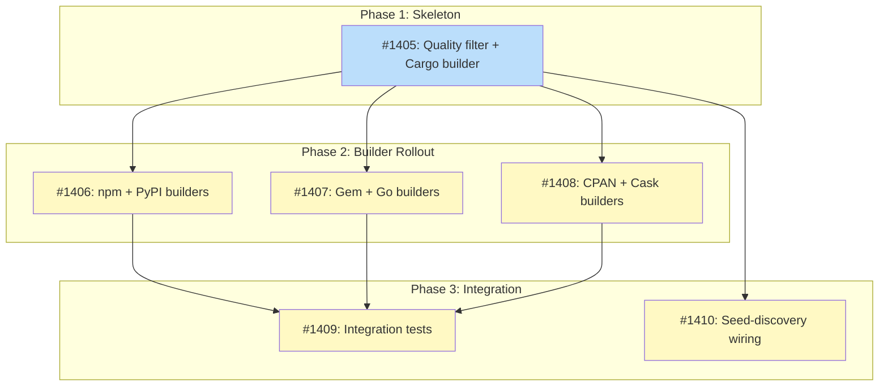

# DESIGN: Probe Quality Filtering

## Status

Planned

## Implementation Issues

### Milestone: [Probe Quality Filtering](https://github.com/tsukumogami/tsuku/milestone/66)

| Issue | Dependencies | Tier |
|-------|--------------|------|
| [#1405: add quality filter with RegistryEntry schema extension and Cargo builder](https://github.com/tsukumogami/tsuku/issues/1405) | [#1365](https://github.com/tsukumogami/tsuku/issues/1365) | testable |
| _Walking skeleton: extends RegistryEntry with quality metadata fields, changes Probe() to return RegistryEntry, creates QualityFilter with per-registry thresholds, wires it into the resolver, and proves the full path with the Cargo builder. Also updates the remaining 6 builders with stub Probe() implementations so the codebase compiles._ | | |
| [#1406: add quality metadata to npm and PyPI builders](https://github.com/tsukumogami/tsuku/issues/1406) | [#1405](https://github.com/tsukumogami/tsuku/issues/1405) | testable |
| _Updates the npm and PyPI builders to populate quality metadata in RegistryEntry. npm adds a parallel downloads API fetch; PyPI parses releases dict length and project URLs._ | | |
| [#1407: add quality metadata to Gem and Go builders](https://github.com/tsukumogami/tsuku/issues/1407) | [#1405](https://github.com/tsukumogami/tsuku/issues/1405) | testable |
| _Updates the RubyGems and Go builders. Gem adds a parallel version count fetch and parses downloads from the main endpoint. Go adds a parallel /@v/list fetch for version count and parses Origin.URL._ | | |
| [#1408: add quality metadata to CPAN and Cask builders](https://github.com/tsukumogami/tsuku/issues/1408) | [#1405](https://github.com/tsukumogami/tsuku/issues/1405) | testable |
| _Updates the MetaCPAN builder to fetch river metrics from the distribution endpoint, and the Cask builder to check deprecated/disabled flags. Completes the builder rollout._ | | |
| [#1409: add integration tests for quality filtering](https://github.com/tsukumogami/tsuku/issues/1409) | [#1406](https://github.com/tsukumogami/tsuku/issues/1406), [#1407](https://github.com/tsukumogami/tsuku/issues/1407), [#1408](https://github.com/tsukumogami/tsuku/issues/1408) | testable |
| _End-to-end integration tests with realistic squatter scenarios (prettier, httpie). Validates that the filter plus priority ranking resolves tools to the correct registry._ | | |
| [#1410: wire QualityFilter into seed-discovery pipeline](https://github.com/tsukumogami/tsuku/issues/1410) | [#1405](https://github.com/tsukumogami/tsuku/issues/1405), [#1364](https://github.com/tsukumogami/tsuku/issues/1364) | testable |
| _Wires the same QualityFilter into the seed-discovery tool so batch-seeded entries pass through the same thresholds as runtime probes. Ensures consistent quality across all discovery paths._ | | |

### Dependency Graph



**Legend**: Green = done, Blue = ready, Yellow = blocked, Purple = needs-design

## Upstream Design Reference

This design addresses a gap discovered during implementation of [DESIGN-ecosystem-probe.md](DESIGN-ecosystem-probe.md). That design assumed registry APIs don't expose download counts, but research shows at least crates.io and RubyGems do. This design also intersects with the discovery registry seeding process described in [DESIGN-discovery-resolver.md](DESIGN-discovery-resolver.md) and the batch pipeline described in [DESIGN-registry-scale-strategy.md](DESIGN-registry-scale-strategy.md).

**Key architectural insight**: The discovery JSON files (`recipes/discovery/`) are already the universal interface for tool resolution. The batch seeding pipeline produces them, the `RegistryLookup` resolver consumes them, and LLM discovery will eventually produce them dynamically. Rather than building a parallel `ProbeResult` struct with quality fields, this design extends the `RegistryEntry` schema so the ecosystem probe produces the same record format. Quality filtering then operates on `RegistryEntry` regardless of where the record came from.

## Context and Problem Statement

The ecosystem probe is the second stage of tsuku's discovery resolver chain. It queries seven package registries in parallel and returns the highest-priority match. The probe was implemented in issues #1383-#1386 and is now live.

The problem: every `Probe()` implementation only checks whether a name exists on the registry. It doesn't evaluate whether the package is real, maintained, or capable of delivering a working tool. Name squatting is widespread across package registries. Almost every common tool name is claimed on crates.io, npm, and pypi by placeholder packages that contain no meaningful code.

This produces wrong results in practice. `tsuku create prettier` resolves to a crates.io squatter (87 recent downloads, 3 versions, max v0.1.5) instead of npm where prettier actually lives. `tsuku create httpie` resolves to crates.io instead of pypi. The static priority ranking makes this worse: crates.io has priority 2, so its squatters beat pypi (priority 3) and npm (priority 4) every time.

The parent design (DESIGN-ecosystem-probe) explicitly stated that "none of the seven ecosystem APIs expose downloads in their standard endpoints." This turns out to be wrong. crates.io returns `recent_downloads` and `downloads` directly in its `/api/v1/crates/{name}` response. RubyGems returns `downloads` and `version_downloads`. npm has a separate downloads API. The data is there; we just aren't parsing it.

The same problem affects discovery registry seeding. When populating the offline registry from ecosystem data, we need to distinguish real packages from squatters.

The discovery JSON files in `recipes/discovery/` already represent resolved tool-to-registry mappings. The `seed-discovery` pipeline produces them by querying registry APIs and enriching entries with metadata. The `RegistryLookup` resolver consumes them at runtime. When LLM discovery is implemented, it will produce the same format dynamically. This makes `RegistryEntry` the natural place to add quality signals: each ecosystem probe can produce a `RegistryEntry` enriched with quality metadata, and the filter operates on that common shape. No parallel structs, no adapter code, and the seeding pipeline gets the same filter for free.

### Scope

**In scope:**
- Extending the `RegistryEntry` schema with quality metadata fields (downloads, version_count, has_repository)
- Updating each builder's `Probe()` to return a `RegistryEntry` instead of a `ProbeResult`, populated with quality metadata from existing API responses
- Adding a `QualityFilter` that operates on `RegistryEntry` to reject squatters
- Sharing the filter between the runtime ecosystem probe and the discovery registry seeding pipeline
- Adding secondary API calls where needed: npm (downloads), RubyGems (version count), Go (version list), MetaCPAN (river metrics). Each runs in parallel with the primary fetch.

**Out of scope:**
- Changing the static priority ranking system (that's a separate concern)
- Adding PyPI download stats from pypistats.org (rate-limited third-party API; version count is sufficient for initial filtering)
- User-facing configuration of quality thresholds
- Changes to the LLM discovery stage

## Decision Drivers

- **Correctness over speed**: A wrong answer is worse than no answer. Prettier must not resolve to crates.io.
- **No extra latency where possible**: Quality data should come from the same API response Probe() already fetches.
- **Registry-specific signals**: Each registry exposes different metadata. The solution must handle heterogeneous signals.
- **Reusability**: The discovery registry seeding pipeline faces the same filtering problem.
- **Fail-open for unknowns**: If a registry doesn't expose quality signals, don't block its results. Prefer false positives from signal-poor registries over false negatives.

## Considered Options

### Decision 1: Where to filter and what data shape to use

The quality check could happen inside each builder's `Probe()` method, in the ecosystem probe resolver, or in a standalone component. Separately, the quality metadata could live in the existing `ProbeResult` struct or in the `RegistryEntry` schema that the discovery system already uses.

#### Chosen: Shared QualityFilter operating on RegistryEntry

Extract filtering into a `QualityFilter` type in the `discover` package. Each builder's `Probe()` returns a `RegistryEntry` with quality metadata populated. The ecosystem probe resolver and the registry seeding pipeline both call `QualityFilter.Accept(builderName, entry)` to decide whether a result is trustworthy.

This keeps Probe() simple (fetch and return data) and puts policy in one place. Using `RegistryEntry` as the data shape means the ecosystem probe produces the same format as the batch seeding pipeline and the registry lookup stage. There's no separate `ProbeResult` struct to maintain or map between.

#### Alternatives Considered

**Extend ProbeResult with quality fields**: Add `VersionCount`, `HasRepository`, `Downloads` to the existing `ProbeResult` struct in the builders package. The `QualityFilter` would operate on `ProbeResult`. Rejected because this creates a parallel struct that duplicates fields already present (or planned) in `RegistryEntry`. The ecosystem probe would need to convert `ProbeResult` → `RegistryEntry` at some point anyway to produce a `DiscoveryResult`. Better to produce `RegistryEntry` directly.

**Filter inside each Probe()**: Each builder would apply its own quality check and return `Exists: false` for low-quality packages. Rejected because it scatters policy across 7 files, makes thresholds hard to find, and prevents the seeding pipeline from applying different thresholds than the runtime probe.

**Filter only in the resolver**: Put quality checks directly in `EcosystemProbe.Resolve()`. Rejected because the seeding pipeline would need to duplicate the logic or import the `discover` package.

**Curated tool-to-registry mapping**: Maintain a JSON file mapping well-known tool names to their canonical registry. Rejected because the discovery registry already serves this role. Quality filtering is the general solution for the long tail of tools not in the mapping.

### Decision 2: What metadata to collect

Registries expose different quality signals. We need to decide what to parse and add to `RegistryEntry`.

#### Chosen: Downloads + version count + repository URL

Extend `RegistryEntry` with three new fields: `Downloads`, `VersionCount`, and `HasRepository`. These signals are available on most registries from the standard endpoint, don't require extra API calls (except npm downloads), and together distinguish squatters from real packages reliably.

For npm specifically, make a parallel request to `api.npmjs.org/downloads/point/last-week/{name}` since the registry endpoint doesn't include downloads. This adds one extra HTTP call but npm's downloads API is fast and the signal is the single most discriminating factor.

#### Alternatives Considered

**Downloads only**: Only use download counts. Rejected because PyPI and Go don't expose downloads, leaving those registries without any filtering. Version count and repository presence are available everywhere.

**Full metadata extraction**: Parse descriptions, classifiers, maintainer lists, and readme content to build a richer signal. Rejected because it adds complexity and fragility for marginal benefit. Download count + version count handles the 95% case. If needed later, `RegistryEntry` can be extended with additional fields.

### Decision 3: How to set thresholds

Quality thresholds need to distinguish "definitely a squatter" from "possibly legitimate."

#### Chosen: Per-registry minimum thresholds with conservative defaults

Define minimum acceptable values per registry. A package must pass at least one threshold to be accepted. Defaults are intentionally low to avoid false negatives:

- crates.io: `recent_downloads >= 100` OR `version_count >= 5` (both from standard `/api/v1/crates/{name}` response: `crate.recent_downloads`, `crate.num_versions`)
- npm: `weekly_downloads >= 100` OR `version_count >= 5` (downloads from `api.npmjs.org/downloads/point/last-week/{name}`; version count from `Object.keys(versions).length` in registry response)
- RubyGems: `downloads >= 1000` OR `version_count >= 5` (downloads from `downloads` field in `/api/v1/gems/{name}.json`; version count from separate `/api/v1/versions/{name}.json` array length)
- PyPI: `version_count >= 3` (from `len(releases)` in `/pypi/{name}/json`; download fields return -1 in standard API; pypistats.org has downloads but adds rate-limited third-party dependency)
- MetaCPAN: `river_total >= 1` OR `version_count >= 3` (`river.total` from `/v1/distribution/{name}` endpoint, requires separate call from existing `/v1/release/{name}`)
- Go: `version_count >= 3` (from `/@v/list` endpoint line count; domain-based naming prevents exact-name squatting but not typosquatting; no download metrics available)
- Cask: no threshold (curated by Homebrew maintainers); check `deprecated` and `disabled` flags to reject removed or unsafe casks

Packages that fail all thresholds for their registry are rejected. The thresholds live in the `QualityFilter` as a config map, making them easy to tune.

#### Alternatives Considered

**Single universal threshold**: One download count for all registries. Rejected because registries have wildly different scales (RubyGems total downloads vs npm weekly downloads vs crates.io recent downloads) and some don't expose downloads at all.

**Relative scoring**: Score packages on a 0-100 scale and reject below a cutoff. Rejected as overengineered for the current problem. We don't need to rank packages by quality; we need to reject obvious squatters. A simple threshold does that.

### Uncertainties

- The exact threshold values are educated guesses. We may need to adjust them after testing against more tool names. The design makes thresholds easy to change.
- npm's downloads API adds latency to the probe. If it's too slow (>500ms), we could drop it and rely on version count alone. The API could also rate-limit us; if that happens, we fall back to version count gracefully.
- Some legitimate but very new packages might have low download counts. The `version_count >= 5` fallback helps, but genuinely new projects with few versions will be filtered out. This is acceptable since such projects are unlikely to be what users mean when they type a common tool name.
- Download counts can be artificially inflated. A motivated attacker could farm ~100 downloads for under $50, passing our thresholds. The filter stops casual squatters, not sophisticated supply-chain attacks. Defense against motivated attackers belongs in a separate verification layer (e.g., checksum validation, signature verification at install time).
- The download timeframes differ across registries: crates.io `recent_downloads` covers 90 days, npm weekly downloads cover 7 days, RubyGems `downloads` is all-time. A threshold of 100 means different things for each. This is handled by having per-registry thresholds rather than a universal number.

## Decision Outcome

**Chosen: QualityFilter on RegistryEntry with per-registry thresholds using downloads, version count, and repository presence**

### Summary

Each builder's `Probe()` method gets updated to return a `RegistryEntry` (instead of a `ProbeResult`) with quality metadata populated from the API response it already fetches. The `RegistryEntry` schema gains `Downloads`, `VersionCount`, and `HasRepository` fields. For npm, `Probe()` makes an additional parallel request to the npm downloads API.

The ecosystem probe resolver passes each `RegistryEntry` through a `QualityFilter` before including it in the candidate list. The filter applies per-registry minimum thresholds: a package must meet at least one threshold (e.g., `recent_downloads >= 100` OR `version_count >= 5`) to be accepted. Packages that fail all thresholds are silently dropped, just like non-existent packages.

The `QualityFilter` is a standalone type that takes a builder name and a `RegistryEntry` as input and returns accept/reject. Because the ecosystem probe now produces `RegistryEntry` records (the same format the seeding pipeline and registry lookup use), the filter works identically in both contexts without conversion or adapter code.

Cask is exempt from quality thresholds because Homebrew maintainers review all casks before inclusion. However, Probe() should check the `deprecated` and `disabled` flags and reject disabled casks. Go module paths are domain-based, which prevents exact-name squatting on legitimate domains (you can't publish `github.com/cli/cli` without GitHub org access). However, typosquatting remains possible (e.g., `github.com/boltdb-go/bolt` targeting `github.com/boltdb/bolt`). Since Go has no download metrics, we apply a lightweight `version_count >= 3` check via the `/@v/list` endpoint to filter placeholder modules.

### Rationale

Downloads and version count together cover the signal gap across all registries. Crates.io and RubyGems have downloads in their standard response. npm needs one extra call but it's worth the latency. PyPI and MetaCPAN lack downloads but expose version count and dependency metrics respectively. The per-registry threshold approach handles this heterogeneity without pretending the registries are uniform.

Using `RegistryEntry` as the data shape (rather than extending `ProbeResult`) aligns with tsuku's existing architecture. The discovery JSON files are already the interface between tool resolution and recipe creation. The seeding pipeline produces `RegistryEntry` records, the registry lookup consumes them, and LLM discovery will produce them. Making the ecosystem probe output the same format closes the loop: every path through the discovery system produces the same record, and the `QualityFilter` works on that common shape.

### Trade-offs Accepted

- **npm gets an extra HTTP call**: The npm registry endpoint doesn't include downloads, so Probe() makes a parallel request to the downloads API. This adds ~100-200ms but the signal is too valuable to skip.
- **New packages may be filtered**: A brand-new legitimate project with <100 downloads and <5 versions will be rejected. This is acceptable because users typing a common name (prettier, httpie) expect the well-known tool, not a new project with the same name.
- **No PyPI download filtering**: PyPI's standard JSON API returns -1 for all download fields. pypistats.org provides download stats via a separate API, but it's rate-limited (5 req/sec, 30 req/min) and adds a third-party dependency. We rely on version count alone for now, which is weaker. A PyPI squatter with 3+ empty releases would slip through. This is rare enough to accept; pypistats.org integration can be added later if needed.

## Solution Architecture

### Overview

The change touches three layers: the builder Probe() methods (data collection), a new QualityFilter type (policy), and the ecosystem probe resolver (enforcement). The central architectural choice is that Probe() now returns a `RegistryEntry` instead of a `ProbeResult`, making the ecosystem probe produce the same record format used throughout the discovery system.

### RegistryEntry schema extension

The existing `RegistryEntry` struct gains quality metadata fields:

```go
type RegistryEntry struct {
    Builder        string `json:"builder"`
    Source         string `json:"source"`
    Binary         string `json:"binary,omitempty"`
    Description    string `json:"description,omitempty"`
    Homepage       string `json:"homepage,omitempty"`
    Repo           string `json:"repo,omitempty"`
    Disambiguation bool   `json:"disambiguation,omitempty"`

    // Quality metadata (populated by Probe(), used by QualityFilter)
    Downloads      int    `json:"downloads,omitempty"`       // Recent/monthly downloads (0 if unavailable)
    VersionCount   int    `json:"version_count,omitempty"`   // Number of published versions
    HasRepository  bool   `json:"has_repository,omitempty"`  // Whether a source repository URL is set
}
```

These fields are `omitempty` so they don't appear in existing discovery JSON files that don't have quality data. The seeding pipeline can optionally populate them during enrichment, and the runtime probe always populates them.

### Probe() signature change

`Probe()` returns a `*discover.RegistryEntry` instead of `*builders.ProbeResult`:

```go
type EcosystemProber interface {
    SessionBuilder
    Probe(ctx context.Context, name string) (*discover.RegistryEntry, error)
}
```

This eliminates the `ProbeResult` struct. The `Exists` field is no longer needed (a nil return indicates the package doesn't exist). The `Age` field (only used by Go, currently unused by any consumer) is dropped; version count is a better signal.

### QualityFilter

```go
// QualityFilter decides whether a discovery entry is trustworthy enough to use.
type QualityFilter struct {
    thresholds map[string]QualityThreshold
}

type QualityThreshold struct {
    MinDownloads    int  // Minimum downloads to accept (0 = don't check)
    MinVersionCount int  // Minimum version count to accept (0 = don't check)
    Exempt          bool // Skip filtering entirely (e.g., cask)
}

// Accept returns true if the entry meets minimum quality for the given builder.
// The reason string explains why a package was rejected (empty if accepted).
func (f *QualityFilter) Accept(builderName string, entry *RegistryEntry) (ok bool, reason string)
```

A package is accepted if the builder is exempt, or if it meets at least one non-zero threshold. If all applicable thresholds are set and the package fails all of them, it's rejected.

### Data flow

```
Probe()  →  RegistryEntry (with quality metadata)
                ↓
         EcosystemProbe.Resolve()
                ↓
         QualityFilter.Accept()  →  reject (with reason) / accept
                ↓
         Priority ranking (unchanged)
                ↓
         DiscoveryResult (wraps the RegistryEntry)
```

The same flow works for the seeding pipeline:

```
Registry API  →  RegistryEntry (with quality metadata)
                      ↓
               QualityFilter.Accept()  →  reject / accept
                      ↓
               Write to recipes/discovery/{path}.json
```

### Builder changes per registry

| Builder | New fields populated | Source | Extra API call |
|---------|---------------------|--------|---------------|
| Cargo | Downloads, VersionCount, HasRepository | `crate.recent_downloads`, `crate.num_versions`, `crate.repository` | No |
| PyPI | VersionCount, HasRepository | `len(releases)`, `info.project_urls` | No |
| npm | Downloads, VersionCount, HasRepository | `api.npmjs.org/downloads/point/last-week/{name}` + `len(versions)` + `repository` | Yes (downloads) |
| Gem | Downloads, VersionCount, HasRepository | `downloads` + `/api/v1/versions/{name}.json` array length + `source_code_uri` | Yes (version count) |
| Go | VersionCount, HasRepository | `/@v/list` line count, `Origin.URL` from `/@latest` | Yes (version list) |
| CPAN | Downloads (river), HasRepository | `/v1/distribution/{name}` for `river.total` + `repository` | Yes (distribution) |
| Cask | (exempt from quality thresholds; check deprecated/disabled flags) | `deprecated`, `disabled` from `formulae.brew.sh/api/cask/{name}.json` | No |

### Parallel secondary fetches

Four registries need a secondary API call to collect quality metadata. Each runs in a goroutine alongside the primary fetch, sharing the same context timeout. If the secondary call fails, the missing field stays at its zero value and the filter falls back to whatever signals are available.

| Builder | Secondary call | Purpose | Fallback on failure |
|---------|---------------|---------|---------------------|
| npm | `api.npmjs.org/downloads/point/last-week/{name}` | Weekly download count | Version count only |
| Gem | `/api/v1/versions/{name}.json` | Version count (array length) | Downloads only |
| Go | `proxy.golang.org/{module}/@v/list` | Version count (line count) | No filtering (exempt) |
| CPAN | `fastapi.metacpan.org/v1/distribution/{name}` | River metrics (`river.total`) | Version count only |

The remaining registries (Cargo, PyPI, Cask) get all needed signals from their primary endpoint.

## API Investigation Results

Each registry's API was investigated to verify that the proposed quality signals are actually available. Full investigation reports are in `wip/research/explore_registry_*.md`. Key findings per registry:

**crates.io**: The standard `/api/v1/crates/{name}` response includes `crate.recent_downloads` (90-day window), `crate.num_versions`, `crate.repository`, and `crate.created_at`. The response also includes an undocumented `linecounts.total_code_lines` field per version that could serve as an additional signal (the `prettier` squatter has 3 lines of Rust code vs ripgrep's 11,041). No extra API call needed. Requires User-Agent header (already implemented).

**npm**: The registry endpoint (`registry.npmjs.org/{name}`) returns version count (keys of `versions` object), repository URL, maintainer count, and timestamps (`time.created`, `time.modified`), but no download stats. Downloads come from `api.npmjs.org/downloads/point/last-week/{name}` (separate call). Rate limit: 1,000 req/hour unauthenticated. No bulk download endpoint exists.

**RubyGems**: The main endpoint (`/api/v1/gems/{name}.json`) returns `downloads` (all-time total) and `source_code_uri`, but no version count or version list. Version count requires a separate call to `/api/v1/versions/{name}.json` (returns array, count via length). Quirk: non-existent gems return HTTP 200 with plain text "This rubygem could not be found." (not JSON 404).

**PyPI**: The standard JSON API (`/pypi/{name}/json`) returns version count via `len(releases)` and repository URLs via `info.project_urls`, but download fields (`info.downloads.last_day` etc.) always return -1. Download stats exist via the third-party pypistats.org API (rate-limited: 5/sec, 30/min), but we defer that integration. Additional signals available: `info.classifiers` (development status), `info.author`, `last_serial` (activity indicator).

**Go**: The proxy at `proxy.golang.org` returns version and timestamp from `/{module}/@latest`, plus an `Origin.URL` field (currently unparsed) for repository presence. Version count comes from `/{module}/@v/list` (plain text, one version per line). No download metrics exist anywhere in the Go ecosystem. The proxy has an undocumented malware detection feature that returns "SECURITY ERROR" for known malicious packages. Typosquatting is a real attack vector (multiple incidents in 2025).

**MetaCPAN**: The existing `/v1/release/{name}` endpoint provides version and author info but no quality metrics. River metrics (`river.total`, `river.immediate`, `river.bucket`) are only available from the separate `/v1/distribution/{name}` endpoint. MetaCPAN has no download counts; river metrics (downstream dependency counts) serve as the primary quality signal. Minimal rate limits ("be polite" policy).

**Cask**: The `formulae.brew.sh/api/cask/{name}.json` endpoint includes `analytics.install` data (30d, 90d, 365d counts), plus `deprecated` and `disabled` boolean flags. All official casks go through PR review by Homebrew maintainers, confirming the curation assumption. The deprecated/disabled flags should be checked even though quality thresholds are exempt.

## Implementation Approach

### Phase 1: RegistryEntry extension, QualityFilter, and one builder

- Extend `RegistryEntry` with `Downloads`, `VersionCount`, and `HasRepository` fields
- Change the `EcosystemProber` interface so `Probe()` returns `*discover.RegistryEntry` instead of `*builders.ProbeResult`
- Remove the `ProbeResult` struct from `internal/builders/probe.go`
- Update the Cargo builder's `Probe()` to return a `RegistryEntry` with quality metadata populated (crates.io has the richest signals, so it's the best proof-of-concept)
- Create `QualityFilter` type in `discover` package with per-registry thresholds
- Wire the filter into `EcosystemProbe.Resolve()` between match collection and priority sorting
- Add unit tests for the filter and the Cargo builder's metadata extraction
- Validate end-to-end: `prettier` should no longer resolve to crates.io

### Phase 2: Remaining builder Probe() updates

- Update the remaining 6 builders to return `RegistryEntry` from `Probe()`:
  - PyPI: parse `releases` dict length and `info.project_urls` (no extra call)
  - npm: add parallel downloads fetch to `api.npmjs.org`, parse `versions` object length (1 extra call)
  - Gem: add parallel `/api/v1/versions/{name}.json` fetch for version count, parse `downloads` from main endpoint (1 extra call)
  - Go: add parallel `/@v/list` fetch for version count, parse `Origin.URL` for repository (1 extra call)
  - CPAN: add parallel `/v1/distribution/{name}` fetch for `river.total` and `repository` (1 extra call)
  - Cask: parse `deprecated` and `disabled` flags, reject disabled casks in Probe()
- Add unit tests per builder verifying metadata extraction

### Phase 3: Integration testing and seeding pipeline

- Add integration tests with realistic squatter scenarios (prettier, httpie)
- Verify the filter + priority ranking produces correct results end-to-end
- Wire `QualityFilter` into the `seed-discovery` pipeline so seeded entries are filtered with the same thresholds
- Log rejected packages with reason for debugging
- Manual testing with `tsuku create` for known false-positive cases

## Security Considerations

### Download Verification

Not applicable. This design doesn't change how binaries are downloaded or verified. It only affects which registry a tool name resolves to.

### Execution Isolation

The quality filter itself is a pure data comparison with no new execution paths. However, its correctness indirectly determines which binary users install. A filter that accepts a malicious squatter package leads to executing untrusted code. This risk is mitigated by the conservative thresholds and by tsuku's existing install-time protections (sandbox mode, checksum verification). The filter is a defense-in-depth layer, not the sole guard.

### Supply Chain Risks

This design directly mitigates a supply chain risk. Name-squatted packages on registries could contain malicious code. By filtering out low-quality matches, we reduce the chance of tsuku directing users to install a squatter package instead of the tool they intended.

The mitigation isn't perfect. A well-crafted squatter with artificially inflated downloads could still pass the filter. But the current state (no filtering at all) is strictly worse. The thresholds make casual squatting ineffective, which covers the vast majority of cases.

### User Data Exposure

The npm downloads API call is new external traffic. It sends the package name to `api.npmjs.org`, which is the same domain npm already uses. No user-identifying information is transmitted beyond what the existing Probe() calls already send (package name + IP address).

More broadly, the ecosystem probe sends the tool name to all seven registries in parallel. This means each registry learns that someone is looking for a given tool name. This is inherent to the existing probe design, not new to this change. The privacy model remains: tool names are sent, but no user-identifying data beyond IP address.

## Consequences

### Positive

- Tools resolve to the correct registry. `prettier` → npm, `httpie` → pypi.
- The quality filter operates on `RegistryEntry`, so it works identically for the runtime probe and the seeding pipeline with no adapter code.
- `RegistryEntry` now carries quality metadata that future features (e.g., confidence scoring, disambiguation ranking) can build on.
- The ecosystem probe produces the same data shape as every other path through the discovery system, simplifying the architecture.

### Negative

- npm Probe() gets slower by ~100-200ms due to the parallel downloads API call.
- Genuinely new packages with few downloads/versions will be filtered out until they gain traction.
- Threshold values are heuristic. Edge cases will require tuning.

### Mitigations

- npm downloads call is parallel with the registry fetch, so it only adds latency if the downloads API is slower than the registry (unlikely).
- The version count fallback (`>= 5`) catches packages that are well-established but niche (low downloads, many versions).
- Thresholds are defined in a config map and easy to adjust without code changes to the filter logic.
