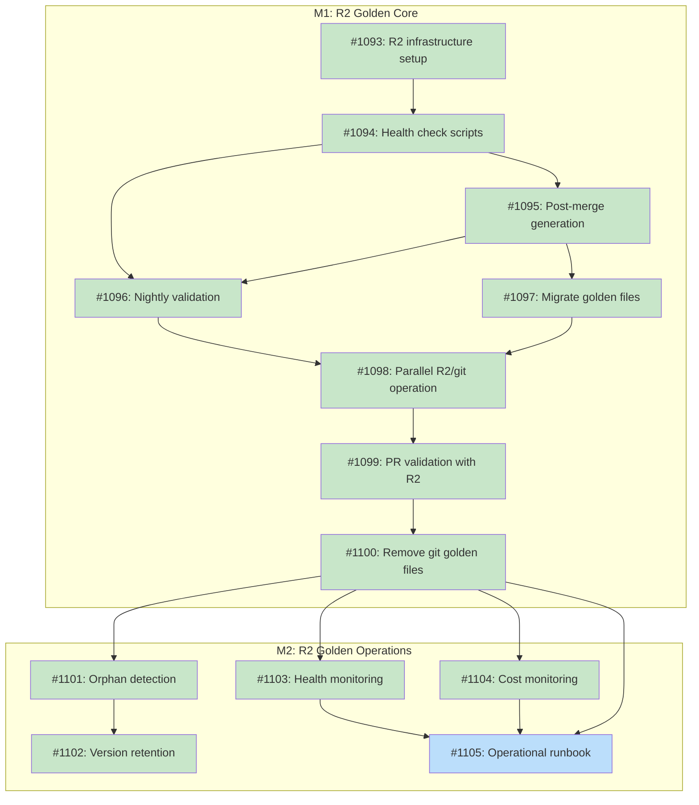

# R2 Storage for Registry Golden Files

## Status

**Planned**

## Implementation Issues

### Milestone: [R2 Golden Core](https://github.com/tsukumogami/tsuku/milestone/45)

| Issue | Title | Dependencies | Tier |
|-------|-------|--------------|------|
| [#1093](https://github.com/tsukumogami/tsuku/issues/1093) | docs: create R2 golden storage infrastructure setup guide | None | simple |
| [#1094](https://github.com/tsukumogami/tsuku/issues/1094) | ci: add R2 health check and helper scripts | [#1093](https://github.com/tsukumogami/tsuku/issues/1093) | testable |
| [#1095](https://github.com/tsukumogami/tsuku/issues/1095) | ci: add post-merge golden file generation workflow | [#1094](https://github.com/tsukumogami/tsuku/issues/1094) | testable |
| [#1096](https://github.com/tsukumogami/tsuku/issues/1096) | ci: integrate R2 golden files into nightly validation | [#1094](https://github.com/tsukumogami/tsuku/issues/1094), [#1095](https://github.com/tsukumogami/tsuku/issues/1095) | testable |
| [#1097](https://github.com/tsukumogami/tsuku/issues/1097) | ci: migrate existing golden files to R2 | [#1095](https://github.com/tsukumogami/tsuku/issues/1095) | testable |
| [#1098](https://github.com/tsukumogami/tsuku/issues/1098) | ci: enable parallel R2 and git golden file operation | [#1096](https://github.com/tsukumogami/tsuku/issues/1096), [#1097](https://github.com/tsukumogami/tsuku/issues/1097) | testable |
| [#1099](https://github.com/tsukumogami/tsuku/issues/1099) | ci: update PR validation to use R2 golden files | [#1098](https://github.com/tsukumogami/tsuku/issues/1098) | testable |
| [#1100](https://github.com/tsukumogami/tsuku/issues/1100) | chore: remove git-based registry golden files | [#1099](https://github.com/tsukumogami/tsuku/issues/1099) | simple |

### Milestone: [R2 Golden Operations](https://github.com/tsukumogami/tsuku/milestone/46)

| Issue | Title | Dependencies | Tier |
|-------|-------|--------------|------|
| [#1101](https://github.com/tsukumogami/tsuku/issues/1101) | ci: add orphan detection for R2 golden files | [#1100](https://github.com/tsukumogami/tsuku/issues/1100) | testable |
| [#1102](https://github.com/tsukumogami/tsuku/issues/1102) | ci: add version retention and cleanup workflow | [#1101](https://github.com/tsukumogami/tsuku/issues/1101) | testable |
| [#1103](https://github.com/tsukumogami/tsuku/issues/1103) | ci: add R2 health monitoring workflow | [#1100](https://github.com/tsukumogami/tsuku/issues/1100) | testable |
| [#1104](https://github.com/tsukumogami/tsuku/issues/1104) | ci: add R2 cost monitoring alerts | [#1100](https://github.com/tsukumogami/tsuku/issues/1100) | testable |
| [#1105](https://github.com/tsukumogami/tsuku/issues/1105) | docs: create R2 golden files operational runbook | [#1100](https://github.com/tsukumogami/tsuku/issues/1100), [#1103](https://github.com/tsukumogami/tsuku/issues/1103), [#1104](https://github.com/tsukumogami/tsuku/issues/1104) | simple |

### Dependency Graph



**Legend**: Green = done, Blue = ready, Yellow = blocked, Purple = needs-design

## Upstream Design Reference

This design implements Stage 7 of [DESIGN-recipe-registry-separation.md](./DESIGN-recipe-registry-separation.md).

**Relevant decisions from upstream:**
- Decision 5B: Cloudflare R2 for registry golden files (selected over git storage and no-golden-files options)
- R2 resilience requirements: health check, git fallback, graceful degradation, monitoring

## Context and Problem Statement

Golden files are JSON snapshots of resolved installation plans. Each recipe produces one golden file per supported platform (typically linux-amd64, darwin-amd64, darwin-arm64), and these files are used to:

1. **Validate plan generation**: Detect regressions when code changes affect plan output
2. **Enable `--pin-from`**: Provide previous plans for deterministic version resolution
3. **Test execution**: Verify that generated plans install correctly

With 155 registry recipes and 418 golden files, the current storage uses ~6.5MB. At 10K recipes with similar platform coverage (~2.7 files per recipe averaging ~16KB each), the projected size reaches ~420MB in the working tree alone. Git history compounds this: every upstream version bump changes checksums and URLs, adding commit overhead that accumulates indefinitely.

Beyond storage size, several operational challenges emerge at scale:

**Generation and Publishing**
- Who generates golden files for new recipes? Contributors? CI? Maintainers?
- When are updates triggered? On merge? On version release? On demand?
- How are concurrent merges handled when multiple PRs touch different recipes?
- What happens when generation fails mid-batch?

**Version and Cleanup Management**
- How many versions per recipe are retained? Just latest, or recent N?
- How are orphaned files detected and removed when recipes are deleted or platforms dropped?
- How is consistency maintained between recipe definitions and golden files?

**Testing Efficiency**
- How do you validate 27K files nightly without excessive CI costs?
- Can validation be parallelized effectively? What's the limiting factor?
- How do you prioritize: validate everything, sample randomly, or use change-based heuristics?

**Failure Handling**
- What happens when R2 is unavailable during CI runs?
- How do you recover from corrupted uploads?
- What's the blast radius of a partial failure?

The upstream design selected Cloudflare R2 for its scalability and existing infrastructure (telemetry worker uses Cloudflare). This design must specify the complete lifecycle for that storage backend.

### Scope

**In scope:**
- R2 bucket structure and naming conventions
- Upload workflow (trigger, concurrency, verification)
- Download workflow (CI integration, caching, batching)
- Authentication (GitHub Actions OIDC, credential management)
- Reliability (health checks, fallback cache, graceful degradation)
- Cleanup automation (orphaned file detection, retention policy)
- Migration from git to R2
- Cost monitoring and alerting

**Out of scope:**
- Embedded recipe golden files (remain in git)
- Recipe signing or content verification (future enhancement)
- Multi-region replication (single bucket sufficient for CI)
- User-facing golden file access (internal CI only)

## Decision Drivers

Drivers are ordered by priority (highest first):

1. **Scalability** (Critical): Must handle 10K+ recipes without linear growth in repo size or clone time
2. **CI Reliability** (Critical): Workflows must not fail due to transient storage issues; fallback required
3. **Graceful Degradation** (High): Storage unavailability must skip validation, not block development
4. **Automation** (High): Generation, upload, and cleanup must be fully automated after initial setup
5. **Cost Efficiency** (Medium): Stay within Cloudflare's 10GB free tier initially; cost ceiling of $50/month acceptable
6. **Testing Efficiency** (Medium): Nightly validation must complete within reasonable time (< 2 hours)
7. **Security** (Medium): Credentials must follow principle of least privilege; audit trail required
8. **Developer Experience** (Medium): Contributors should be able to debug golden file issues without special tooling
9. **Operational Simplicity** (Low): Infrastructure maintainable by small team without dedicated ops
10. **Migration Safety** (Low): Rollback capability required during transition period

## Implementation Context

Research findings from specialist analysis across infrastructure, CI patterns, security, automation, testing efficiency, failure modes, data lifecycle, and scalability.

### Current Metrics

| Metric | Value |
|--------|-------|
| Registry recipes | 155 |
| Golden files | 418 |
| Total storage | 5.1 MB (6.6 MB with metadata) |
| Files per recipe | 3.0 average |
| File size | 12 KB average |

### Projected Scale

| Scale | Recipes | Golden Files | Storage | Git History/Year |
|-------|---------|--------------|---------|------------------|
| Current | 155 | 418 | 5 MB | 12 MB |
| 1K | 1,000 | 3,000 | 33 MB | 88 MB |
| 5K | 5,000 | 15,000 | 165 MB | 440 MB |
| 10K | 10,000 | 30,000 | 330 MB | 880 MB |

### R2 Platform Capabilities

**Pricing (Standard Storage):**
- Storage: $0.015/GB/month (10 GB free)
- Class A ops (PUT, LIST): $4.50/million (1M free)
- Class B ops (GET, HEAD): $0.36/million (10M free)
- Egress: Free

**At 30K files with 100 CI runs/month:** Costs remain within free tier.

**Limits:**
- No global rate limit on custom domains
- Concurrent writes to same key return HTTP 429
- Object size: 5TB max (5GB without multipart)

**Authentication:** Cloudflare does NOT support GitHub Actions OIDC. Must use API tokens stored as GitHub Secrets with quarterly rotation.

### Current CI Architecture

The codebase has well-designed validation workflows:

1. **validate-golden-recipes.yml**: PR trigger on recipe changes, validates changed recipes only
2. **validate-golden-execution.yml**: PR trigger on golden changes, executes plans to verify installation
3. **validate-golden-code.yml**: PR trigger on code changes, validates embedded recipes
4. **nightly-registry-validation.yml**: Daily at 2 AM UTC, full registry validation + sample execution

Current model requires PR authors to commit golden files pre-merge. CI validates but does not generate.

### Key Constraints Discovered

**Breaking points:**
- Git performance degrades at 1GB repo size
- GitHub Actions matrix limit: 256 jobs
- GitHub API rate limit: 5000/hour authenticated
- macOS runner costs: 10x Linux

**Platform combinations:**
- Standard: 3 (darwin-amd64, darwin-arm64, linux-amd64)
- With linux families: 7 (adds debian, rhel, arch, alpine, suse)
- With linux-arm64: 8+

**Version retention:**
- Current: 2 versions per recipe (latest + 1 prior)
- At 10K recipes with 5 versions: 150K files, 1.8 GB

### Operational Requirements

**Generation triggers needed:**
1. Recipe merge (post-merge, not pre-merge)
2. Code changes affecting plan generation
3. Manual dispatch for specific recipes
4. Weekly version detection for upstream updates

**Cleanup mechanisms:**
1. Orphan detection for deleted recipes
2. Platform cleanup when recipe drops support
3. Version pruning based on retention policy
4. Graceful handling of partial failures

**Resilience requirements:**
1. Health check before validation starts
2. Two-tier degradation: R2 available → validate, R2 unavailable → skip + create issue
3. Automatic issue creation when validation is skipped

## Considered Options

### Option 1: Full R2 Migration with CI-Generated Golden Files

Golden files are generated by CI on merge rather than committed by PR authors. R2 becomes the sole source of truth for registry golden files.

**Approach:**
- PR validation uses temporary artifacts (not committed)
- Post-merge workflow generates on all platforms and uploads to R2
- Nightly validation downloads from R2
- Git fallback cache synchronized weekly

**Pros:**
- Eliminates git bloat entirely for registry golden files
- No friction for contributors (don't need to generate locally)
- Cross-platform generation handled automatically
- Clean separation between git (recipes) and R2 (artifacts)

**Cons:**
- R2 becomes critical infrastructure (mitigated by fallback)
- No PR review of golden file changes
- Credential management complexity (quarterly rotation)
- 6-phase migration required
- Vendor lock-in: Cloudflare-specific credential management and billing
- Observability gap: Git provides natural change history; R2 requires explicit logging
- Development friction: Contributors can't easily inspect golden files locally when debugging

### Option 2: Git LFS for Golden Files

Store golden files in Git LFS instead of main repository, keeping the current generation workflow.

**Approach:**
- Migrate existing golden files to LFS tracking
- PR authors continue to commit golden files
- LFS lazy-fetches reduce clone times
- CI pulls LFS objects during validation

**Pros:**
- Minimal workflow changes for contributors
- Git history and PR review preserved
- Simpler credential management (GitHub native)
- Incremental migration possible

**Cons:**
- LFS bandwidth limits (1 GB/month free, then $5/50 GB)
- Still counts toward repo limits (soft)
- LFS object fetching adds CI time (~30s-1min)
- Does not scale well beyond 5K recipes

### Option 3: Hybrid Archive (Git Recent + R2 Archive)

Keep latest version in git for review, archive older versions to R2.

**Approach:**
- Latest 1-2 versions per recipe in git
- Older versions archived to R2 after 30 days
- CI can fetch archived versions on-demand
- PR review preserved for recent changes

**Pros:**
- PR review workflow preserved
- Git stays smaller (bounded growth)
- Full history available via R2
- Gradual transition possible

**Cons:**
- Complex dual-system maintenance
- Unclear ownership (which system is authoritative?)
- Archive synchronization complexity
- Does not address 10K scale working tree size

### Option 4: On-Demand Generation (No Persistent Storage)

Generate golden files at validation time. Store nothing except exclusions and metadata.

**Approach:**
- Validation computes golden files fresh each run
- Compare against pinned constraints, not stored files
- Caching layer reduces redundant generation
- No persistent golden file storage

**Pros:**
- Zero storage overhead
- Always current (no staleness)
- Simpler conceptual model
- No migration needed
- Could be combined with caching for hybrid approach

**Cons:**
- Significant CI compute costs at scale (~80-160 runner-hours/validation for 10K recipes at 30s/recipe)
- External API calls during CI (version resolution, checksum fetching)
- Slower PR feedback (minutes vs seconds for comparison)
- Network flakiness affects validation reliability
- Requires robust caching infrastructure to be cost-effective

Note: With aggressive parallelization (10 runners) and caching, validation could complete in 8-16 hours. Cost estimate assumes ~$100-200/month at scale, making this viable but not optimal compared to storage-based approaches.

### Options Not Considered in Detail

**Sparse Golden Files**: Store only checksums and metadata rather than full plans (~80% size reduction). Rejected because `--pin-from` requires full plans for constraint extraction.

**Sharded Git Repositories**: Split golden files across multiple repos by letter prefix. Rejected as it adds repository management complexity without addressing the fundamental git history growth problem.

## Options Comparison

| Driver | Option 1 (R2 Full) | Option 2 (LFS) | Option 3 (Hybrid) | Option 4 (On-Demand) |
|--------|-------------------|----------------|-------------------|---------------------|
| **Scalability** | Excellent | Fair | Good | Poor (compute) |
| **CI Reliability** | Good (with fallback) | Good | Good | Poor (flaky) |
| **Automation** | Excellent | Fair | Fair | Excellent |
| **Cost Efficiency** | Excellent (free tier) | Good ($5-30/mo) | Good | Fair ($100-200/mo) |
| **Testing Efficiency** | Good | Good | Good | Poor |
| **Security** | Fair (token rotation) | Good (native) | Fair | Good |
| **Graceful Degradation** | Excellent | N/A | Good | Poor |
| **Migration Safety** | Good (phased) | Fair | Fair | Excellent |
| **Operational Simplicity** | Fair | Excellent | Poor | Good |

### Uncertainties

- **Cloudflare OIDC timeline**: May become available, reducing credential management burden
- **macOS runner availability**: Self-hosted vs GitHub-hosted affects cost projections
- **Actual cache hit rates**: Validation caching effectiveness unknown until implemented
- **Fallback cache size at scale**: Compression ratios may vary with recipe complexity
- **Version detection accuracy**: Weekly polling may miss rapid release cycles

### Assumptions

This design is built on the following assumptions. Changes to these could invalidate the selected approach:

1. **Cloudflare R2 pricing stability**: Free tier and pricing will remain comparable to current levels. Cost ceiling of $50/month is acceptable; reconsider at $100/month.

2. **GitHub Actions runner access**: GitHub-hosted runners can reliably access Cloudflare R2 with acceptable latency (<2s). Enterprise firewall configurations won't block egress.

3. **Golden file format stability**: The JSON schema for golden files will evolve gradually with backwards compatibility. Mass schema migrations are not anticipated.

4. **Internal CI only**: This design serves internal CI validation. External contributor or third-party access to golden files is not required.

5. **macOS runner availability**: darwin-amd64 and darwin-arm64 GitHub runners will be available for generation. If unavailable during a run, generation can be deferred to the next successful run.

6. **Deterministic generation**: Golden files generated from the same recipe at the same point in time should be identical. Non-determinism would break the caching and validation model.

7. **Concurrency tolerance**: Last-write-wins is acceptable for concurrent uploads since golden files are deterministic. Two uploads of the same recipe version will produce identical content.

## Decision Outcome

**Chosen option: Option 1 - Full R2 Migration with CI-Generated Golden Files**

R2 storage with CI-generated golden files best addresses the critical decision drivers (scalability and CI reliability) while staying within cost constraints and providing robust fallback mechanisms.

### Rationale

This option was chosen because:

- **Scalability (Critical)**: Eliminates git bloat entirely. R2 handles 10K+ recipes without repo size or clone time impact.
- **CI Reliability (Critical)**: Two-tier degradation (R2 → Skip) ensures validation never blocks development.
- **Graceful Degradation (High)**: When R2 is unavailable, validation is skipped with automatic issue creation. Given R2's 99.99% uptime SLA (~52 min/year downtime), complex fallback infrastructure is not justified.
- **Automation (High)**: Post-merge generation removes contributor friction and ensures cross-platform coverage.
- **Cost Efficiency (Medium)**: Free tier covers projected usage; cost ceiling of $50/month is well under budget.

Alternatives were rejected because:

- **Option 2 (Git LFS)**: Does not scale beyond 5K recipes. LFS still counts toward repo limits and adds bandwidth costs without addressing the fundamental history growth problem.
- **Option 3 (Hybrid)**: Dual-system complexity is not justified when Option 1 provides clean separation with fallback for resilience.
- **Option 4 (On-Demand)**: Compute costs ($100-200/month) and validation time (8-16 hours) are suboptimal compared to storage-based approaches, though it remains viable as a future optimization.

### Trade-offs Accepted

By choosing this option, we accept:

1. **No PR review of golden file changes**: Changes are generated post-merge, not reviewed as part of the PR. Mitigated by: recipe changes are reviewed; golden files are deterministic outputs.

2. **Vendor lock-in to Cloudflare**: R2 uses S3 API, but credential management is Cloudflare-specific. Mitigated by: S3-compatible storage makes migration feasible; existing Cloudflare relationship (telemetry worker) reduces operational burden.

3. **Credential management complexity**: Quarterly token rotation required since Cloudflare doesn't support OIDC. Mitigated by: documented SOP; environment-based secret scoping; rotation can be automated.

4. **Development friction for debugging**: Contributors can't `git diff` golden files locally. Mitigated by: CLI tooling can fetch from R2 for debugging; fallback cache provides recent snapshots.

5. **6-phase migration**: Phased rollout adds short-term complexity. Mitigated by: each phase is independently reversible; parallel operation during transition.

These trade-offs are acceptable because the scalability and reliability benefits far outweigh the operational overhead, and mitigations address the most impactful concerns.

## Solution Architecture

### Overview

Registry golden files are stored in a Cloudflare R2 bucket with CI-triggered generation, three-tier fallback for resilience, and automated lifecycle management. The architecture separates concerns: git stores recipes (source of truth), R2 stores artifacts (generated outputs), and a compressed git-based fallback cache provides resilience.

### Components

```
┌─────────────────────────────────────────────────────────────────────────┐
│                           GitHub Repository                              │
│  ┌──────────────────────────────┐  ┌──────────────────────────────────┐ │
│  │  recipes/                    │  │ internal/recipe/recipes/         │ │
│  │  (registry recipes)          │  │ (embedded recipes + git golden)  │ │
│  └──────────────────────────────┘  └──────────────────────────────────┘ │
└─────────────────────────────────────────────────────────────────────────┘
                               │
                               ▼
┌─────────────────────────────────────────────────────────────────────────┐
│                        GitHub Actions Workflows                          │
│                                                                          │
│  ┌────────────────────────────┐  ┌────────────────────────────────────┐ │
│  │ Post-Merge Generation      │  │ Nightly Validation                 │ │
│  │ (3 platforms → R2)         │  │ (health check → download → test)   │ │
│  └────────────┬───────────────┘  └─────────────────┬──────────────────┘ │
│               │                                    │                    │
└───────────────┼────────────────────────────────────┼────────────────────┘
                │                                    │
                ▼                                    ▼
┌─────────────────────────────────────────────────────────────────────────┐
│                        Cloudflare R2 Bucket                              │
│  ┌─────────────────────────────────────────────────────────────────────┐│
│  │ Bucket: tsuku-golden-registry                                       ││
│  │                                                                      ││
│  │ plans/                                                               ││
│  │   embedded/go/v1.25.5/darwin-arm64.json                             ││
│  │   a/ack/v3.9.0/linux-amd64.json                                     ││
│  │   f/fzf/v0.60.0/darwin-arm64.json                                   ││
│  │   ...                                                                ││
│  │ health/ping.json  (sentinel for health checks)                       ││
│  │ manifest.json     (index with timestamps)                            ││
│  └─────────────────────────────────────────────────────────────────────┘│
└─────────────────────────────────────────────────────────────────────────┘
```

### Key Interfaces

**R2 Object Key Convention:**
```
plans/{category}/{recipe}/v{version}/{platform}.json

Examples:
- plans/a/ack/v3.9.0/darwin-arm64.json
- plans/embedded/go/v1.25.5/linux-amd64.json
- plans/f/fzf/v0.60.0/linux-debian-amd64.json
```

**Object Metadata:**
```json
{
  "x-tsuku-recipe-hash": "sha256:abc123...",
  "x-tsuku-generated-at": "2026-01-24T10:00:00Z",
  "x-tsuku-format-version": "3",
  "x-tsuku-generator-version": "0.15.0"
}
```

**Manifest Structure:**
```json
{
  "version": 1,
  "generated_at": "2026-01-24T00:00:00Z",
  "files": {
    "a/ack/v3.9.0/darwin-arm64.json": {
      "sha256": "...",
      "size": 15234,
      "generated_at": "2026-01-24T02:00:00Z"
    }
  }
}
```

**Health Check Contract:**
- Endpoint: HEAD request to `health/ping.json`
- Timeout: 5 seconds
- Success: HTTP 200 with latency < 2000ms
- Degraded: HTTP 200 with latency >= 2000ms
- Failure: Any other response or timeout

### Data Flow

**Post-Merge Generation:**
```
1. Recipe merged to main
   │
   ▼
2. Post-merge workflow triggered
   │
   ├──► [linux runner] Generate linux-amd64, linux-family variants
   ├──► [macos-14] Generate darwin-arm64
   └──► [macos-15-intel] Generate darwin-amd64
   │
   ▼
3. Collect artifacts, upload to R2
   │
   ▼
4. Verify uploads with read-back check
   │
   ▼
5. Update manifest.json
```

**Nightly Validation:**
```
1. Run health check (HEAD request to health/ping.json)
   │
   ├── Success (HTTP 200, latency < 2000ms)
   │   │
   │   ▼
   │   Download golden files from R2
   │   │
   │   ▼
   │   Run validation against downloaded files
   │   │
   │   ▼
   │   Report results, create issue on validation failure
   │
   └── Failure (timeout, error, or latency >= 2000ms)
       │
       ▼
       Skip validation
       │
       ▼
       Create GitHub issue: "Nightly validation skipped - R2 unavailable"
```

## Implementation Approach

### Phase 1: R2 Infrastructure (Foundation)

**Deliverables:**
- R2 bucket creation and configuration
- API token setup (read-only, read-write)
- GitHub Secrets configuration
- Health check script (`scripts/r2-health-check.sh`)
- Upload/download helper scripts

**Dependencies:** None

### Phase 2: Post-Merge Generation Workflow

**Deliverables:**
- `publish-golden-to-r2.yml` workflow with dual triggers:
  - Automatic: on push to main when `recipes/**/*.toml` changes
  - Manual: `workflow_dispatch` with `recipes` input (comma-separated list)
- Cross-platform generation matrix (linux, darwin-arm64, darwin-amd64)
- Upload with verification (read-back checksum comparison)
- Manifest update logic
- `force` option to regenerate even if version already exists

**Manual trigger usage:**
```bash
# Single recipe
gh workflow run publish-golden-to-r2.yml -f recipes=fzf

# Multiple recipes
gh workflow run publish-golden-to-r2.yml -f recipes="fzf,ripgrep,bat"

# Force regeneration
gh workflow run publish-golden-to-r2.yml -f recipes=fzf -f force=true
```

**Dependencies:** Phase 1

### Phase 3: Validation Integration

**Deliverables:**
- Modify `nightly-registry-validation.yml` to download from R2
- Add health check before validation (5s timeout, 2000ms latency threshold)
- Two-tier degradation logic (R2 available → validate, R2 unavailable → skip + issue)
- Clear logging when validation is skipped

**Dependencies:** Phase 1, Phase 2

### Phase 4: Migration

**Deliverables:**
- Initial bulk upload of existing golden files
- Parallel operation period (git + R2)
- PR validation workflow updates
- Removal of git-based registry golden files

**Dependencies:** Phases 1-3

### Phase 5: Cleanup Automation

**Deliverables:**
- Orphan detection script
- Version retention enforcement
- Soft delete with quarantine
- Cleanup workflow

**Dependencies:** Phase 4

### Phase 6: Monitoring

**Deliverables:**
- Periodic health check workflow
- Cost monitoring alerts
- Degradation issue tracking
- Operational runbook

**Dependencies:** Phase 4

## Security Considerations

### Credential Management

R2 access requires API tokens stored as GitHub Secrets since Cloudflare does not support GitHub Actions OIDC.

**Token Configuration:**

| Token | Permission | Scope | Usage |
|-------|------------|-------|-------|
| `R2_ACCESS_KEY_ID_READONLY` | Object Read | tsuku-golden-registry bucket | Nightly validation, fallback sync |
| `R2_SECRET_ACCESS_KEY_READONLY` | Object Read | tsuku-golden-registry bucket | Nightly validation, fallback sync |
| `R2_ACCESS_KEY_ID_WRITE` | Object Read & Write | tsuku-golden-registry bucket | Post-merge upload, cleanup |
| `R2_SECRET_ACCESS_KEY_WRITE` | Object Read & Write | tsuku-golden-registry bucket | Post-merge upload, cleanup |

**Access Control:**
- Read-only tokens used for validation workflows (no environment protection needed)
- Write tokens protected by GitHub Environment `registry-write` requiring reviewer approval and main branch only
- Tokens scoped to single bucket, not account-wide

**Rotation Schedule:**
- Quarterly rotation (every 90 days)
- Documented SOP with verification step before revoking old token
- Rotation logged in security audit trail

### Download Verification

Golden files downloaded from R2 are JSON artifacts used for CI validation, not executable binaries.

**Verification approach:**
- SHA256 checksums stored in object metadata (`x-tsuku-recipe-hash`)
- Manifest contains file checksums for bulk verification
- Content-MD5 header verified on upload

**Failure handling:**
- Checksum mismatch triggers re-download
- Persistent mismatch creates GitHub issue and uses fallback cache
- Corrupted files are quarantined, not used for validation

**Not applicable to this design:**
- Signature verification: Golden files are internal CI artifacts, not user-facing. Signing would add complexity without proportionate benefit since the threat model is R2 corruption, not interception.

### Execution Isolation

Golden files are not executed. They are JSON data used for plan comparison.

**File system access:**
- Read from R2 bucket (CI workflow only)
- Write to workflow artifacts directory
- No access to user home directories or system paths

**Network access:**
- HTTPS to Cloudflare R2 endpoint
- No other network access required

**Privilege escalation:**
- No elevated privileges required
- Runs in GitHub Actions runner sandbox
- No sudo or root access

### Supply Chain Risks

**Source trust model:**
- R2 bucket is under project control (Cloudflare account owned by maintainers)
- Write access requires main branch merge (code review gate)
- Generation happens in controlled CI environment

**Authenticity verification:**
- Object metadata includes recipe hash at generation time
- Manifest provides audit trail of all uploads
- Recipe changes trigger regeneration (any tampering would be overwritten)

**Upstream compromise scenarios:**

| Scenario | Impact | Mitigation |
|----------|--------|------------|
| R2 bucket compromise | Attacker could serve malicious golden files | Validation compares against freshly generated plans; mismatch detection |
| GitHub Actions compromise | Attacker could upload arbitrary files | Write token environment protection; required reviewers |
| Cloudflare account compromise | Full bucket access | Quarterly credential rotation; audit logging |
| Credential leak | Unauthorized writes | Immediate rotation SOP; environment scoping limits blast radius |

**Residual risk:** A sophisticated attacker with both GitHub and Cloudflare access could theoretically serve malicious golden files that match freshly generated plans (by also compromising the recipe or generation code). This is mitigated by code review requirements for recipe and code changes.

**Workflow supply chain protection:**
- All GitHub Actions in generation and validation workflows must be pinned to specific commit SHAs, not version tags, to prevent supply chain attacks via action hijacking
- Golden file content must never be interpolated into shell commands
- JSON parsing uses safe, non-evaluating parsers (Go's `encoding/json`)

### User Data Exposure

**Local data accessed:**
- None. This feature operates entirely within CI workflows.
- No user file system access.
- No access to `$TSUKU_HOME` or installed tools.

**Data sent externally:**
- Golden file content (JSON plans) uploaded to R2
- Plans contain: tool names, versions, download URLs, checksums
- No personally identifiable information
- No telemetry or usage data

**Privacy implications:**
- Golden files are artifacts of public recipes
- No private data exposure risk
- R2 bucket is private (not publicly accessible)

### Security Mitigations Summary

| Risk | Mitigation | Residual Risk |
|------|------------|---------------|
| Credential leak | Environment protection; scoped tokens; quarterly rotation | Short window between leak and detection |
| R2 bucket tampering | Checksum verification; manifest audit trail; regeneration overwrites | Sophisticated attack against generation pipeline |
| GitHub Actions compromise | Write environment requires reviewer approval | Compromised reviewer account |
| Cloudflare outage/corruption | Two-tier degradation skips validation + creates issue; R2 has 99.99% uptime (~52 min/year) | Validation skipped during rare outages |
| Stale credentials after personnel change | Documented rotation SOP; tokens tied to account not individuals | Delayed rotation |

## Consequences

### Positive

- **Scalability achieved**: 10K+ recipes without repo bloat
- **Faster clones**: No large golden file directory to fetch
- **Simplified contribution**: No need to generate golden files locally
- **Cross-platform coverage**: Automatic generation on all platforms
- **Resilient validation**: Two-tier degradation prevents development blocks

### Negative

- **Infrastructure dependency**: R2 becomes critical infrastructure
- **Credential overhead**: Quarterly token rotation required
- **Debugging friction**: Can't inspect golden files with `git diff`
- **Migration complexity**: 6-phase rollout with parallel operation
- **Observability gap**: Need explicit logging for change tracking

### Mitigations

| Negative Consequence | Mitigation |
|---------------------|------------|
| R2 dependency | Two-tier degradation (skip + issue); R2 has 99.99% uptime SLA |
| Credential overhead | Documented SOP; potential future OIDC support |
| Debugging friction | CLI tooling to fetch from R2; fallback cache accessible |
| Migration complexity | Phased approach with per-phase rollback capability |
| Observability gap | Object metadata with timestamps; manifest tracking |

