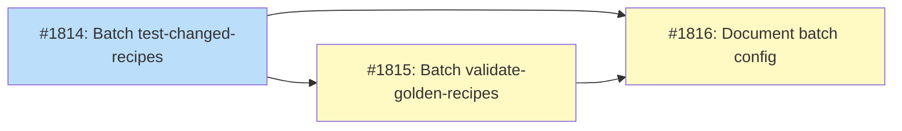

# DESIGN: Recipe CI Batching

## Status

Planned

## Implementation Issues

### Milestone: [recipe-ci-batching](https://github.com/tsukumogami/tsuku/milestone/91)

| Issue | Dependencies | Tier |
|-------|--------------|------|
| [#1814: ci(test-recipes): batch Linux per-recipe jobs in test-changed-recipes](https://github.com/tsukumogami/tsuku/issues/1814) | None | testable |
| _Creates `.github/ci-batch-config.json` and converts the `test-linux` job from per-recipe to per-batch matrix. Establishes the inner-loop pattern (TSUKU_HOME isolation, download cache sharing, failure accumulation) that the next issue reuses._ | | |
| [#1815: ci(golden-recipes): batch per-recipe jobs in validate-golden-recipes](https://github.com/tsukumogami/tsuku/issues/1815) | [#1814](https://github.com/tsukumogami/tsuku/issues/1814) | testable |
| _Applies the same batching pattern to `validate-golden-recipes.yml`, handling its different matrix shape (`recipe`/`category` vs `tool`/`path`) and updating the cache key strategy for batched jobs._ | | |
| [#1816: docs(ci): document batch size configuration and tuning](https://github.com/tsukumogami/tsuku/issues/1816) | [#1814](https://github.com/tsukumogami/tsuku/issues/1814), [#1815](https://github.com/tsukumogami/tsuku/issues/1815) | simple |
| _Documents the config file format, `workflow_dispatch` override, and tuning guidance. Notes the follow-up work for `validate-golden-execution.yml` per-recipe jobs._ | | |

### Dependency Graph



**Legend**: Green = done, Blue = ready, Yellow = blocked, Purple = needs-design, Orange = tracks-design

## Context and Problem Statement

Several recipe-triggered CI workflows generate one GitHub Actions job per changed recipe. When a PR modifies N recipes, workflows like `test-changed-recipes.yml` and `validate-golden-recipes.yml` each spawn N independent runners. Every runner checks out the repo, sets up Go, builds tsuku from source, then tests a single recipe before terminating. PR #1770 produced 153 per-recipe jobs out of 264 total checks.

The per-recipe model worked when PRs typically changed 1-5 recipes. It falls apart for larger changes. A registry-wide refactor touching 100+ recipes would spawn hundreds of jobs, each paying ~30-45 seconds of cold-start overhead (checkout, Go setup, `go build`) before touching its one recipe. GitHub Actions queues them in parallel, but runner availability limits actual concurrency, so the PR author waits for a long tail of queued-then-running jobs.

The problem is specific to Linux testing. macOS testing in `test-changed-recipes.yml` already uses an aggregated pattern: a single runner builds tsuku once and loops through all changed recipes sequentially. Container-family testing in `validate-golden-execution.yml` similarly batches by distribution family. Only the Linux per-recipe matrix hasn't been converted.

This matters now because tsuku's recipe registry is growing (324+ recipes) and changes increasingly touch recipes in bulk: schema migrations, metadata additions, builder upgrades, and dependency updates. CI should handle those PRs without generating a job per recipe.

### Scope

**In scope:**
- Batching per-recipe matrix jobs in `test-changed-recipes.yml` (Linux path)
- Batching per-recipe matrix jobs in `validate-golden-recipes.yml`
- Dynamic batch sizing so the approach scales from 1 recipe to 300+
- Preserving per-recipe failure reporting within batched jobs

**Out of scope:**
- Merging or eliminating workflows (separate concern)
- Changing macOS aggregation (already works)
- Changing container-family batching in `validate-golden-execution.yml` (already works)
- Per-recipe jobs in `validate-golden-execution.yml` (`validate-coverage`, `execute-registry-linux`, `validate-linux`) -- these have the same problem but different matrix shapes and should be batched in a follow-up
- Build artifact caching across workflows (complementary optimization that eliminates per-job Go build overhead, worth pursuing independently)

## Decision Drivers

- **Scale to hundreds**: A PR changing 200 recipes should produce O(20) jobs, not O(200)
- **Preserve failure granularity**: When a recipe fails, CI must clearly identify which one
- **Reuse proven patterns**: macOS aggregation and container-family batching already work; extend, don't reinvent
- **Bound job duration**: No single job should run longer than ~15 minutes to avoid stale feedback
- **Minimize detection changes**: The existing matrix detection logic (git diff, platform filtering, exclusion lists) is well-tested; batch assignment should layer on top of it
- **Handle mixed recipe types**: Some recipes are fast (~10s), others are slow (~2min). Batching should tolerate this variance

## Considered Options

### Decision 1: Batch Assignment Strategy

The core question is how to split N detected recipes into M batches for parallel execution. The detection job already produces a JSON array of changed recipes. The question is what happens between detection and execution.

The strategy needs to handle both small PRs (1-5 recipes, where overhead matters less) and large PRs (50-300 recipes, where job count is the bottleneck). It also needs to produce a GitHub Actions matrix that can be consumed by `fromJSON()`.

#### Chosen: Ceiling-division batching with configurable batch size

The detection job takes the list of N recipes and splits them into ceil(N / BATCH_SIZE) groups. Each group becomes one matrix entry containing a JSON array of recipes. Batch sizes are configured in a JSON config file (`.github/ci-batch-config.json` or similar) alongside the existing `test-matrix.json`, making them easy to review and change without touching workflow YAML. Workflows read their batch sizes from this file in the detection job. A `workflow_dispatch` input provides an override for manual runs, useful for experimenting with different sizes. A guard clause clamps all values to the range 1-50.

For a PR with 70 recipes and BATCH_SIZE=15: ceil(70/15) = 5 jobs, each handling 13-15 recipes. For a PR with 3 recipes: ceil(3/15) = 1 job handling all 3.

The detection job splits the recipe array into batches using jq (see Solution Architecture for the full implementation).

Each batch job receives its `recipes` array as a matrix variable, builds tsuku once, then loops through them.

#### Alternatives Considered

**Time-estimated batching**: Assign recipes to batches based on estimated execution time (fast recipes grouped together, slow ones separated). Rejected because we don't have reliable per-recipe timing data, and the variance within recipe types is large enough that estimates would be stale quickly. The added complexity of maintaining a timing database isn't worth it when ceiling-division already bounds job count and duration reasonably.

**Single-job aggregation (no matrix)**: Run all recipes in one job, like macOS does. Rejected because it doesn't parallelize at all. A 200-recipe PR would run sequentially for 30+ minutes in a single job. This works for macOS where we have 1-2 runners anyway, but Linux can use more parallelism.

**`max-parallel` throttling**: Keep the existing per-recipe matrix but set `strategy.max-parallel` to limit concurrent jobs. Rejected because it doesn't address the root cause: each job still pays the full cold-start overhead. With 200 recipes and `max-parallel: 20`, you'd run 10 waves of 20 jobs, each building tsuku from scratch. Total CI time is the same or worse than batching.

### Decision 2: Failure Reporting Within Batched Jobs

When a batched job runs 15 recipes and recipe #7 fails, the CI output needs to make clear which recipe failed, what the error was, and whether subsequent recipes also had problems. The current per-recipe model gets this for free since each job name is the recipe name. Batched jobs need an equivalent.

#### Chosen: GitHub Actions grouping with exit-code accumulation

Each recipe runs inside a `::group::Testing <recipe-name>` block. Failures are caught and accumulated in a failure list. After all recipes in the batch run, the job reports a summary and exits non-zero if any recipe failed. This is the exact pattern used by the macOS aggregated job in `test-changed-recipes.yml`.

```bash
FAILED=""
for recipe in $(echo "$RECIPES" | jq -r '.[].path'); do
  tool=$(echo "$recipe" | xargs basename -s .toml)
  echo "::group::Testing $tool"
  if ! ./tsuku install --force --recipe "$recipe"; then
    echo "::error::Failed: $tool"
    FAILED="$FAILED $tool"
  fi
  echo "::endgroup::"
done

if [ -n "$FAILED" ]; then
  echo "::error::Failed recipes:$FAILED"
  exit 1
fi
```

The job name includes the batch range for identification: `Linux (batch 1/5)` or similar.

#### Alternatives Considered

**Nested composite actions**: Wrap each recipe test in a composite action that reports status independently. Rejected because GitHub Actions composite actions can't dynamically generate annotations with the same clarity as inline grouping, and the added indirection makes the workflow harder to debug.

### Decision 3: Platform-Specific Batching

`validate-golden-execution.yml` tests recipes across Linux distribution families (debian, rhel, alpine, suse, arch). Each family runs in a separate container image, so the batching dimension is recipes-per-family, not just recipes-per-runner. The question is whether batching applies uniformly across all platforms.

#### Chosen: Batch at the recipe level with per-platform batch sizes, keep platform dimension orthogonal

For workflows that test across platforms or families, the matrix has two dimensions: batch and platform. The batch size is configurable per platform, since some platforms are significantly slower than others. For example, alpine source builds might use a batch size of 5 while ubuntu-latest uses 15. This keeps job durations roughly even across platforms despite different per-recipe execution times.

The detection job accepts a batch size map (platform -> size) and splits recipes into per-platform batches accordingly. For workflows with a single Linux target, there's just one batch size. For multi-family workflows, each family gets its own batch count:

```
ubuntu-latest: ceil(N / 15) batches
alpine:        ceil(N / 5) batches
rhel:          ceil(N / 10) batches
```

The batch size map is a workflow-level variable with sensible defaults, tunable as CI timing data reveals which platforms are slower. The detection job outputs per-platform batch arrays; the matrix uses `include` to generate batch x platform combinations.

#### Alternatives Considered

**Uniform batch size across all platforms**: Use the same batch size everywhere. Simpler, but leads to either alpine jobs running too long (if sized for ubuntu) or ubuntu jobs being unnecessarily split (if sized for alpine). Per-platform sizing adds a small configuration surface but directly addresses the variance in platform speed.

## Decision Outcome

**Chosen: Ceiling-division batching + per-platform batch sizes + grouping-based failure reporting**

### Summary

The detection job in each workflow takes its existing recipe list and splits it into fixed-size batches using ceiling division. The default batch size is 15 recipes, configurable via a workflow input. Each batch becomes one matrix entry containing a JSON array of recipe objects. The execution job builds tsuku once, then loops through its assigned recipes with `::group::` annotations for log clarity and exit-code accumulation for failure reporting.

For multi-platform workflows, the batch dimension is crossed with the platform dimension. Each platform gets its own batch size to account for speed differences (e.g., 15 for ubuntu, 5 for alpine). A workflow that tests 60 recipes across 5 families with varying batch sizes produces a manageable number of jobs instead of 60 * 5 = 300. Each job runs all its batch's recipes on one platform.

Failure handling preserves per-recipe granularity: each recipe runs in a named group, failures produce `::error::` annotations with the recipe name, and the job exits non-zero after running all recipes in the batch (not fail-fast). The job name includes the batch index (`Linux (batch 1/4)`) so authors can correlate failures across the GitHub Actions UI.

The approach extends to `validate-golden-recipes.yml` with even less complexity, since golden file validation doesn't require platform matrices. There, the entire batch of recipes validates in a single job on ubuntu-latest.

For single-recipe PRs, the behavior is unchanged: one recipe, one batch, one job. The overhead is identical to the current model. The scaling benefit kicks in at the threshold where N > BATCH_SIZE.

### Rationale

Ceiling-division batching is the simplest strategy that bounds job count. It doesn't require per-recipe timing data, doesn't change the detection logic, and produces predictable matrix sizes. The batch size of 15 is a conservative starting point: it caps a 300-recipe PR at 20 jobs per workflow while keeping individual jobs under 10 minutes (assuming ~30s average per recipe). The current `test-linux` timeout of 15 minutes gives headroom for batches with a few slow recipes (e.g., 3 recipes at 2 minutes each + 12 at 30 seconds = 12 minutes). If CI timing data reveals that 15 recipes regularly approach the timeout, the batch size can be reduced without code changes.

The grouping-based failure reporting is already proven in the macOS path. Adopting it for Linux batches means less new code and consistent behavior across platforms.

Keeping the platform dimension orthogonal avoids entangling batch logic with platform selection. The detection job splits recipes into batches independently for each platform, using per-platform batch sizes to account for speed differences. The workflow matrix handles the cross-product. Per-platform sizing adds a small configuration surface, but it directly addresses the real-world variance where alpine builds take 3-5x longer than ubuntu.

## Solution Architecture

### Overview

The change affects the detection jobs and execution jobs in two workflows. No new files are created; existing workflow YAML is modified.

### Detection Job Changes

Each workflow's detection job adds a batching step after the existing recipe detection:

```
Existing: detect changed recipes -> output JSON array
New:      detect changed recipes -> split into batches -> output JSON array of batch objects
```

The batch object structure:

```json
[
  {"batch_id": 0, "recipes": [{"tool": "ripgrep", "path": "recipes/r/ripgrep.toml"}, ...]},
  {"batch_id": 1, "recipes": [{"tool": "fd", "path": "recipes/f/fd.toml"}, ...]},
]
```

### Execution Job Changes

The matrix variable changes from iterating over individual recipes to iterating over batches. Each batch job:

1. Checks out repo (once)
2. Sets up Go (once)
3. Builds tsuku (once)
4. For each recipe in the batch:
   a. Creates isolated `TSUKU_HOME` (like macOS pattern)
   b. Symlinks shared download cache
   c. Runs the test inside `::group::`
   d. Accumulates failures
5. Reports summary and exits

### Workflow-Specific Details

**`test-changed-recipes.yml`:**
- Detection job: Add batch splitting after platform detection
- `test-linux` job: Replace `matrix.recipe` with `matrix.batch`, add inner loop
- `test-macos` job: No changes (already aggregated)
- Job naming: `Linux (batch ${{ matrix.batch.batch_id + 1 }}/${{ needs.matrix.outputs.batch_count }})`

**`validate-golden-recipes.yml`:**
- Detection job: Add batch splitting after recipe detection
- `validate-golden` job: Replace `matrix.item` with `matrix.batch`, add inner loop
- Inner loop calls `validate-golden.sh` per recipe with appropriate env vars
- Job naming: `Validate (batch ${{ matrix.batch.batch_id + 1 }}/${{ needs.detect-changes.outputs.batch_count }})`

### Batch Splitting Implementation

A shared shell function (or inline jq) performs the splitting:

```bash
batch_recipes() {
  local recipes="$1"
  local batch_size="${2:-15}"
  echo "$recipes" | jq -c --argjson bs "$batch_size" '
    . as $all |
    [range(0; length; $bs)] |
    to_entries |
    map({
      batch_id: .key,
      recipes: $all[.value:.value + $bs]
    })
  '
}
```

### Batch Size Configuration

Batch sizes live in a JSON config file at the repo root:

```json
{
  "batch_sizes": {
    "test-changed-recipes": {
      "linux": 15
    },
    "validate-golden-recipes": {
      "default": 20
    },
    "validate-golden-execution": {
      "ubuntu": 15,
      "alpine": 5,
      "rhel": 10,
      "suse": 10,
      "arch": 8
    }
  }
}
```

Workflows read their batch sizes in the detection job:

```bash
BATCH_SIZE=$(jq -r '.batch_sizes["test-changed-recipes"].linux // 15' .github/ci-batch-config.json)
```

For `workflow_dispatch`, an optional `batch_size_override` input takes precedence over the config file when provided. This lets contributors experiment with different sizes on manual runs without committing config changes.

For multi-platform workflows, the detection job calls `batch_recipes` once per platform with the appropriate batch size from the config.

The detection job outputs:
- `batches`: JSON array of batch objects (for single-platform workflows)
- `batch_count`: Number of batches (for job naming)
- `has_recipes`: Boolean (existing, unchanged)
- For multi-platform workflows: per-platform batch arrays and counts

## Implementation Approach

### Phase 1: Batch `test-changed-recipes.yml` Linux jobs

This workflow has the highest job count per PR and the most straightforward structure. The macOS aggregation pattern provides a template.

- Modify detection job to add batch splitting
- Convert `test-linux` job from per-recipe matrix to per-batch matrix
- Add inner loop with `TSUKU_HOME` isolation and download cache sharing
- Add failure accumulation and summary reporting
- Update job naming to include batch index
- Test with a multi-recipe PR to verify batching and failure reporting

### Phase 2: Batch `validate-golden-recipes.yml`

Same pattern as Phase 1 but simpler: no platform detection, no macOS handling, and golden validation is faster than recipe installation.

- Modify detection job to add batch splitting
- Convert `validate-golden` job from per-recipe matrix to per-batch matrix
- Add inner loop calling `validate-golden.sh` per recipe
- Test with a multi-recipe PR

### Phase 3: Tune and document

- Verify batch size of 15 produces reasonable job durations for typical PRs
- Adjust if needed based on CI timing data
- Document the batch size parameter and how to tune it

## Security Considerations

### Download Verification

Not applicable. This design changes how CI jobs are grouped, not how recipes are downloaded or verified. The same `tsuku install` command runs with the same verification logic; only the number of invocations per runner changes.

### Execution Isolation

Each recipe in a batch gets its own `TSUKU_HOME` directory (following the macOS pattern). Recipes don't share installed binaries or state between them within a batch. This is the same isolation model already used for macOS aggregated testing.

One consideration: if a recipe modifies global state outside `TSUKU_HOME` (e.g., writes to `/tmp` or modifies system paths), subsequent recipes in the batch could be affected. This risk already exists in the macOS aggregated path and hasn't been a problem because `tsuku install` is scoped to `TSUKU_HOME`. More importantly, all recipes in a batch come from the same PR, so the PR author already controls every recipe being tested. Cross-recipe interference within a batch doesn't grant capabilities beyond what the author already has.

### Supply Chain Risks

Not applicable. This design doesn't change where recipes come from or how they're validated. The supply chain is identical: recipes are read from the PR branch, and tools are downloaded from the sources specified in those recipes. The CI workflows just group them differently on the runner.

### User Data Exposure

Not applicable. CI workflows don't access user data. The runners are ephemeral GitHub-hosted machines that are destroyed after each workflow run. Batching multiple recipes on one runner doesn't change the data exposure profile since all recipes in a PR are already visible to anyone who can view the PR.

## Consequences

### Positive

- **Dramatic job count reduction**: A 200-recipe PR drops from ~400 per-recipe jobs (across two workflows) to ~28 batched jobs. This reduces queue pressure, speeds up overall CI completion time, and lowers Actions billing.
- **Faster feedback for large PRs**: Instead of waiting for 200 runners to become available and each complete its cold start, 14 runners each handle 15 recipes. Wall-clock time for the batch is dominated by the actual work rather than per-job overhead.
- **Proven pattern**: Extends the macOS aggregation model that's been running reliably since `test-changed-recipes.yml` was created.
- **Small change surface**: Only two workflow files are modified. No Go code changes, no new scripts, no infrastructure changes.

### Negative

- **Coarser job-level visibility**: Instead of "ripgrep: pass, fd: fail, bat: pass" as separate check entries, failures appear inside a batched job's logs. Authors need to expand the job to see which recipe failed.
- **Batch tail effect**: If one recipe in a batch is slow, the entire batch waits. With per-recipe jobs, fast recipes finish independently. In practice, most recipes install in under 30 seconds, so this is minor.
- **Retry granularity**: Re-running a failed batch re-runs all recipes in that batch, not just the failed one. This wastes some time on re-testing recipes that already passed.

### Mitigations

- Per-recipe `::group::` annotations and `::error::` annotations ensure the GitHub Actions UI highlights exactly which recipe failed, even within a batched job. The existing macOS path demonstrates this works well.
- Batch size of 15 limits the blast radius of the tail effect: even if one recipe takes 2 minutes, the batch overhead is bounded.
- For retry granularity, the cost of re-running 14 passing recipes (~7 minutes) is small compared to the cold-start cost of 15 separate re-runs.
