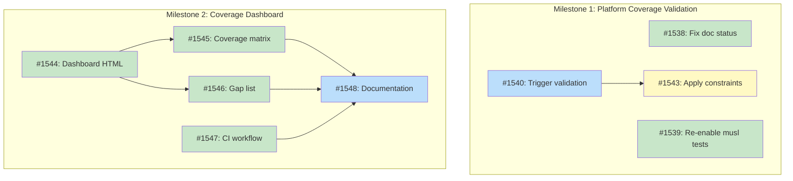

# Recipe Coverage Visibility System

## Status

**Planned**

## Implementation Issues

This design is being implemented through 9 issues across 2 sequential milestones.

### Milestone: [Platform Coverage Validation](https://github.com/tsukumogami/tsuku/milestone/71)

| Issue | Dependencies | Tier |
|-------|--------------|------|
| ~~[#1538: fix(docs): update design doc status from Proposed to Accepted](https://github.com/tsukumogami/tsuku/issues/1538)~~ | ~~None~~ | ~~simple~~ |
| ~~_Fixes status inconsistency where frontmatter shows "Accepted" but body text shows "Proposed". Ensures both match the current "Planned" status after issues are created._~~ | | |
| ~~[#1539: feat(tests): re-enable integration-tests.yml musl dlopen tests](https://github.com/tsukumogami/tsuku/issues/1539)~~ | ~~None~~ | ~~testable~~ |
| ~~_Uncomments the library-dlopen-musl job with continue-on-error flag, maintaining visibility into musl test failures while allowing CI to pass. Tracks known gaps until #1092 adds musl library support._~~ | | |
| [#1540: feat(workflows): trigger validate-all-recipes workflow and add platform constraints](https://github.com/tsukumogami/tsuku/issues/1540) | None | testable |
| _Manually triggers the validation workflow across all 11 platforms to identify which recipes fail where. First run reviews failures, second run with auto_constrain creates a PR with platform constraints._ | | |
| [#1543: feat(recipes): apply platform constraints from validation results](https://github.com/tsukumogami/tsuku/issues/1543) | [#1540](https://github.com/tsukumogami/tsuku/issues/1540) | testable |
| _Reviews and merges the auto-generated PR from #1540, ensuring constraints accurately reflect test results. This establishes honest platform declarations before building the coverage dashboard._ | | |

### Milestone: [Coverage Dashboard](https://github.com/tsukumogami/tsuku/milestone/72)

| Issue | Dependencies | Tier |
|-------|--------------|------|
| ~~[#1544: feat(website): create coverage dashboard HTML structure](https://github.com/tsukumogami/tsuku/issues/1544)~~ | ~~None~~ | ~~testable~~ |
| ~~_Creates website/coverage/index.html with container divs for three views: coverage matrix (recipes × platforms), gap list (missing platforms), and category breakdown (libraries vs tools). Follows website/pipeline pattern._~~ | | |
| ~~[#1545: feat(website): implement coverage matrix visualization](https://github.com/tsukumogami/tsuku/issues/1545)~~ | ~~[#1544](https://github.com/tsukumogami/tsuku/issues/1544)~~ | ~~testable~~ |
| ~~_Adds JavaScript to load coverage.json and render sortable/filterable table showing platform support. Uses vanilla JS with template literals, matching the pipeline dashboard approach._~~ | | |
| ~~[#1546: feat(website): implement gap list and category breakdown](https://github.com/tsukumogami/tsuku/issues/1546)~~ | ~~[#1544](https://github.com/tsukumogami/tsuku/issues/1544)~~ | ~~testable~~ |
| ~~_Implements the remaining two dashboard views: gap list highlighting recipes missing musl/architecture support, and category breakdown showing coverage statistics split by recipe type._~~ | | |
| ~~[#1547: feat(ci): add workflow to regenerate coverage.json on recipe changes](https://github.com/tsukumogami/tsuku/issues/1547)~~ | ~~None~~ | ~~testable~~ |
| ~~_Creates GitHub Actions workflow that runs cmd/coverage-analytics when recipes/ changes, automatically committing updated coverage.json to main. Uses the push-to-main pattern with retry logic._~~ | | |
| [#1548: docs(website): add coverage dashboard documentation](https://github.com/tsukumogami/tsuku/issues/1548) | [#1544](https://github.com/tsukumogami/tsuku/issues/1544), [#1545](https://github.com/tsukumogami/tsuku/issues/1545), [#1546](https://github.com/tsukumogami/tsuku/issues/1546), [#1547](https://github.com/tsukumogami/tsuku/issues/1547) | simple |
| _Documents the complete dashboard for contributors: how views work, how to regenerate coverage.json manually, how to interpret platform support data, and how the CI automation keeps it fresh._ | | |

### Dependency Graph



**Legend**: Green = done, Blue = ready, Yellow = blocked, Purple = needs-design

### Work Sequencing

**Completed** (6 issues):
- ~~#1538~~ (doc fix) ✓
- ~~#1539~~ (musl tests) ✓
- ~~#1544~~ (dashboard HTML) ✓
- ~~#1545~~ (coverage matrix) ✓
- ~~#1546~~ (gap list and category breakdown) ✓
- ~~#1547~~ (CI workflow) ✓

**Can start immediately** (2 issues):
- #1540 (validation trigger - requires PR merge first)
- #1548 (dashboard documentation - all dashboard work complete)

**Milestone ordering**: Complete Milestone 1 before starting Milestone 2 for accurate coverage data.

**Related Designs:**
- [DESIGN-platform-compatibility-verification.md](./current/DESIGN-platform-compatibility-verification.md) - M47: Infrastructure for platform compatibility

**Related Infrastructure:**
- `internal/recipe/coverage.go` - Existing coverage analysis
- `.github/workflows/test-changed-recipes.yml` - Tests recipes on declared platforms
- `testdata/golden/execution-exclusions.json` - Tracks test exclusions with issue URLs

## Context and Problem Statement

### Existing Infrastructure

Tsuku already has comprehensive platform coverage infrastructure:

1. **Coverage Analysis**: `internal/recipe/coverage.go` analyzes recipes for glibc/musl/darwin support
   - `AnalyzeRecipeCoverage()` checks step `when` clauses
   - Generates errors for libraries missing musl (unless explicitly constrained via `supported_libc`)
   - Generates warnings for tools depending on libraries without musl

2. **Platform Testing**: `.github/workflows/test-changed-recipes.yml` validates recipes
   - Reads `supported_os`, `supported_arch`, `supported_libc` from recipe metadata
   - Tests recipes on Linux and macOS based on declared support
   - Skips library recipes (type = "library") and system dependencies

3. **Exclusion Tracking**: `testdata/golden/execution-exclusions.json`
   - Documents recipes excluded from testing
   - Links to issue URLs explaining blockers
   - Tracks reasons (toolchain version drift, upstream limitations, etc.)

### The M47 Gap

M47 delivered this infrastructure but **zero of 13 library recipes** were migrated to use it. Coverage analysis would flag them, tests would validate them, but the migration work never happened.

**Affected libraries** (all glibc-only):
libcurl, openssl, zlib, brotli, ncurses, readline, libyaml, sqlite, libffi, gmp, libxml2, libxslt, libiconv

### The Missing Piece: Visibility

The infrastructure works, but we can't see:
- Which recipes support which platforms (coverage matrix)
- Why recipes don't support certain platforms (beyond exclusions.json)
- The M47 gap (0/13 libraries have musl)
- Coverage trends over time

**Example**: Running `AnalyzeRecipeCoverage()` on libcurl would show:
```go
CoverageReport{
  Recipe: "libcurl",
  HasGlibc: true,
  HasMusl: false,  // GAP!
  HasDarwin: true,
  SupportedLibc: [],
  Errors: ["library recipe 'libcurl' has no musl path..."],
}
```

But this analysis isn't exposed anywhere users or maintainers can see it.

## Decision Drivers

1. **Build on existing infrastructure** - Reuse coverage.go, test workflows, exclusions.json
2. **Close M47 gap** - Systematic workflow for migrating 13 library recipes
3. **Provide visibility** - Dashboard showing coverage across all dimensions
4. **No new enforcement** - Tests already validate, just need visibility
5. **Follow existing patterns** - Match website/pipeline architecture
6. **Integrate with testing** - Show which recipes are tested on which platforms

## Considered Options

### Decision 1: Where to Add Visibility

How should coverage data be exposed - extend pipeline dashboard, create separate tool, or add to tsuku CLI?

#### Chosen: Separate Tool + Static Website

Create `cmd/coverage-analytics` tool (matches `cmd/queue-analytics`) that:
- Runs `coverage.AnalyzeRecipeCoverage()` on all recipes
- Reads execution-exclusions.json for blocker context
- Generates `website/coverage/coverage.json`
- Deployed at tsuku.dev/coverage (static HTML + JS)

This matches the existing pipeline dashboard pattern:
```
internal/coverage/      ← Already exists!
cmd/coverage-analytics/ ← New: generates JSON
website/coverage/       ← New: static visualization
```

#### Alternatives Considered

**Extend Pipeline Dashboard**: Add coverage tab to website/pipeline/
Rejected because pipeline dashboard tracks batch generation (homebrew → recipes), while recipe coverage is orthogonal. Separate concerns deserve separate dashboards.

**Add to tsuku CLI**: `tsuku coverage` command showing gaps
Rejected because coverage is build-time analysis, not runtime functionality. Users installing tsuku don't need coverage reports. This is for maintainers and contributors.

**Expand execution-exclusions.json**: Add coverage data to existing file
Rejected because exclusions.json is for test exclusions specifically. Full coverage matrix (265 recipes × platforms) doesn't fit that schema.

### Decision 2: What Data to Expose

Should we show just gaps, full coverage matrix, or something in between?

#### Chosen: Full Coverage Matrix with Gap Focus

Generate comprehensive report showing:
1. **Coverage matrix**: All recipes × platforms (glibc, musl, darwin)
2. **Gap details**: Which recipes lack which platforms, with reasons
3. **Category breakdown**: Libraries vs tools (libraries have stricter requirements)
4. **Exclusion integration**: Show blockers from execution-exclusions.json
5. **M47 focus**: Highlight the 13 libraries without musl

This provides both high-level overview and drill-down detail.

#### Alternatives Considered

**Gaps Only**: Show only recipes with coverage issues
Rejected because it doesn't show what's working. Need both positive and negative visibility.

**Test Results Only**: Show which recipes pass tests on which platforms
Rejected because tests only run on platforms recipes claim to support. Doesn't show what platforms recipes DON'T support.

**Separate M47 Report**: Special-case the library migration
Rejected because M47 gap is one instance of broader coverage tracking. Solve the general problem.

### Decision 3: M47 Migration Approach

How should the 13 library recipes be migrated - all at once, individually, or in batches?

#### Chosen: Batch Migration with Testing

Migrate in 3 batches using existing test infrastructure:

**Batch 1 (critical)**: openssl, zlib, libcurl
**Batch 2 (common)**: ncurses, readline, sqlite, brotli
**Batch 3 (remaining)**: libyaml, libffi, gmp, libxml2, libxslt, libiconv

Process per batch:
1. Add musl steps to recipes (apk packages for Alpine)
2. test-changed-recipes.yml validates on Linux
3. If Alpine test fails → investigate, potentially add to execution-exclusions.json with reason
4. Merge when tests pass

**libiconv special case**: musl has built-in iconv, add note to recipe explaining this.

#### Alternatives Considered

**All at Once**: Single PR with 13 migrations
Rejected because if one fails, entire PR blocks. Test feedback is less clear.

**One by One**: 13 separate PRs
Rejected because it's tedious for nearly identical changes. Batch balances risk and efficiency.

**Skip Testing**: Add musl steps, assume they work
Rejected because that's how we got the M47 gap. Existing test infrastructure must validate.

## Decision Outcome

**Chosen: Full Visibility + Batch Migration** (1 + 2 + 3)

### Summary

We're building a visibility layer on existing infrastructure. The `cmd/coverage-analytics` tool runs `coverage.AnalyzeRecipeCoverage()` on all 265 recipes, reads execution-exclusions.json for context, and generates coverage.json. A static website at tsuku.dev/coverage visualizes the data with matrix views, gap lists, and category breakdowns.

The M47 gap gets closed through systematic batch migration: 3 batches of library recipes adding Alpine/musl support via system packages (apk). Each batch tested using existing test-changed-recipes.yml workflow before merge.

No new enforcement needed - coverage.go already flags gaps, tests already validate. We're just making the analysis results visible and completing the M47 migration work.

### Rationale

Building on existing infrastructure rather than creating new systems. Coverage analysis exists (coverage.go), tests validate (test-changed-recipes.yml), exclusions track blockers (execution-exclusions.json) - we just need to make results visible.

Separate tool + website matches the pipeline dashboard pattern and keeps concerns separated. Recipe coverage is orthogonal to batch generation. Full coverage matrix provides both overview and detail. Batch migration uses existing test infrastructure to validate work.

Alternative of extending pipeline dashboard was rejected because they're different concerns. Alternative of CLI commands was rejected because coverage is build-time analysis. Alternative of all-at-once migration was rejected as too risky.

## Solution Architecture

### System Overview

```
┌─────────────────────────────────────────────────────────────────┐
│              Recipe Coverage Visibility System                   │
└─────────────────────────────────────────────────────────────────┘
                              │
           ┌──────────────────┼──────────────────┐
           │                  │                  │
           ▼                  ▼                  ▼
┌──────────────────┐  ┌──────────────────┐  ┌──────────────────┐
│ Existing         │  │ New: Coverage    │  │ New: Website     │
│ Infrastructure   │  │ Analytics Tool   │  │ Visualization    │
│                  │  │                  │  │                  │
│ • coverage.go    │─▶│ • Runs analysis  │─▶│ • Matrix view    │
│ • test workflows │  │ • Reads          │  │ • Gap list       │
│ • exclusions.json│─▶│   exclusions     │  │ • Category       │
│ • recipe metadata│─▶│ • Generates JSON │  │   breakdown      │
└──────────────────┘  └──────────────────┘  └──────────────────┘
```

**Data Flow:**
1. coverage-analytics reads all recipes from recipes/ directory
2. Runs coverage.AnalyzeRecipeCoverage() on each recipe
3. Reads execution-exclusions.json for blocker context
4. Generates website/coverage/coverage.json
5. Static website loads JSON and renders visualizations

### Coverage Data Model

**Generated JSON** (`website/coverage/coverage.json`):

```json
{
  "generated_at": "2026-02-06T12:00:00Z",
  "total_recipes": 265,
  "summary": {
    "by_platform": {
      "glibc": {"supported": 265, "total": 265, "pct": 100.0},
      "musl": {"supported": 252, "total": 265, "pct": 95.1},
      "darwin": {"supported": 250, "total": 265, "pct": 94.3}
    },
    "by_category": {
      "library": {"total": 13, "musl_support": 0, "glibc_support": 13},
      "tool": {"total": 252, "musl_support": 252, "glibc_support": 252}
    }
  },
  "recipes": [
    {
      "name": "libcurl",
      "type": "library",
      "platforms": {
        "glibc": true,
        "musl": false,
        "darwin": true
      },
      "gaps": ["musl"],
      "errors": ["library recipe 'libcurl' has no musl path and no explicit constraint"],
      "warnings": [],
      "exclusions": []
    }
  ],
  "exclusions": [
    {
      "recipe": "git",
      "issue": "https://github.com/tsukumogami/tsuku/issues/953",
      "reason": "compile_from_source toolchain version drift (macOS build failures)"
    }
  ]
}
```

### Integration with Existing Infrastructure

**Recipe Metadata** (already exists):
```toml
[metadata]
name = "libcurl"
type = "library"
supported_os = ["linux", "darwin"]  # Defaults to all if omitted
supported_libc = ["glibc"]          # Explicit constraint: glibc only

[[step]]
action = "install_homebrew_package"
package = "libcurl"
when = { libc = ["glibc"] }

# NEW: Add for M47 migration
[[step]]
action = "install_system_package"
apk = ["curl-dev"]
when = { libc = ["musl"] }
```

**Test Workflow Integration** (already works):
- test-changed-recipes.yml reads `supported_os`, `supported_arch`, `supported_libc`
- Tests recipe on appropriate platforms
- After M47 migration, libcurl tests on both glibc and musl

## Implementation Approach

### Component 1: Coverage Analytics Tool

**Location**: `cmd/coverage-analytics/main.go`

**Functionality**:
```go
func main() {
    recipesDir := flag.String("recipes", "recipes/", "recipes directory")
    exclusionsFile := flag.String("exclusions", "testdata/golden/execution-exclusions.json", "exclusions file")
    output := flag.String("output", "website/coverage/coverage.json", "output file")

    // Load all recipes
    recipes := loadAllRecipes(*recipesDir)

    // Load exclusions for context
    exclusions := loadExclusions(*exclusionsFile)

    // Analyze each recipe using existing coverage.go
    var reports []CoverageReport
    for _, recipe := range recipes {
        report := coverage.AnalyzeRecipeCoverage(recipe)
        reports = append(reports, report)
    }

    // Generate JSON
    writeJSON(*output, reports, exclusions)
}
```

**Usage**:
```bash
# Generate coverage report (run by CI or manually)
go run ./cmd/coverage-analytics \
  --recipes recipes/ \
  --exclusions testdata/golden/execution-exclusions.json \
  --output website/coverage/coverage.json
```

### Component 2: Static Website

**Location**: `website/coverage/index.html`

**Views**:

1. **Coverage Matrix** (recipes × platforms):
```
                glibc   musl   darwin
libcurl         ✓       ✗      ✓
openssl         ✓       ✗      ✓
serve           ✓       ✓      ✓
gh              ✓       ✓      ✓
```

2. **Gap List** (recipes with missing platforms):
```
13 recipes missing musl support:
• libcurl [library] → No musl step (add apk: curl-dev)
• openssl [library] → No musl step (add apk: openssl-dev)
...

10 recipes excluded from testing:
• git → Toolchain version drift (issue #953)
• curl → Homebrew detection issue (issue #879)
```

3. **Category Breakdown**:
```
Libraries:   0% musl (0/13)  ⚠️ M47 gap
Tools:     100% musl (252/252)
```

**Implementation**:
- Vanilla JS loading coverage.json
- CSS from website/assets/style.css
- Matches website/pipeline/ pattern

### Component 3: M47 Library Migration

**Goal**: Migrate 13 library recipes to support musl.

**Process**:

1. **Identify Alpine packages**:
   - libcurl → curl-dev
   - openssl → openssl-dev
   - zlib → zlib-dev
   - brotli → brotli-dev
   - ncurses → ncurses-dev
   - readline → readline-dev
   - libyaml → yaml-dev
   - sqlite → sqlite-dev
   - libffi → libffi-dev
   - gmp → gmp-dev
   - libxml2 → libxml2-dev
   - libxslt → libxslt-dev
   - libiconv → (built-in, add note)

2. **Migration template**:
```toml
# Existing glibc step
[[step]]
action = "install_homebrew_package"
package = "libcurl"
when = { libc = ["glibc"] }

# NEW: musl step
[[step]]
action = "install_system_package"
apk = ["curl-dev"]
when = { libc = ["musl"] }
```

3. **Testing** (existing infrastructure):
   - test-changed-recipes.yml automatically tests on Linux
   - If recipe declares musl support, tests validate on Alpine-compatible environment
   - Failures → either fix recipe or add to execution-exclusions.json with reason

4. **Validation**:
```bash
# After migration, run coverage analysis
go run ./cmd/coverage-analytics

# Check that libraries now show musl support
jq '.recipes[] | select(.type == "library" and .platforms.musl == false)' \
  website/coverage/coverage.json
# Should return empty (all libraries have musl)
```

## Required Tactical Designs

| Design | Target Repo | Purpose |
|--------|-------------|---------|
| DESIGN-coverage-analytics-tool.md | tsuku | cmd/coverage-analytics implementation |
| DESIGN-coverage-website.md | tsuku | website/coverage/ static HTML/JS |
| DESIGN-m47-library-migration.md | tsuku | Systematic migration of 13 libraries |
| DESIGN-coverage-integration.md | tsuku | CI integration (generate JSON on push) |

## Security Considerations

### Download Verification

Not applicable - coverage-analytics analyzes existing recipe files, doesn't download binaries.

### Execution Isolation

The tool parses TOML and evaluates metadata but doesn't execute recipe steps. Read-only analysis.

Risk: Maliciously crafted TOML could exploit parser.
Mitigation: Use established TOML parser (BurntSushi/toml), don't eval content.

### Supply Chain Risks

**Risk**: Coverage data could be manipulated to hide gaps.
**Mitigation**: coverage.json generated from source recipes in CI, committed to git (tamper-evident).

**Risk**: execution-exclusions.json could have fake reasons.
**Mitigation**: Code review required for exclusions, must link to real issue URLs.

### User Data Exposure

Coverage website shows which recipes support which platforms - public information about recipe capabilities. No sensitive data.

## Consequences

### Positive

1. **Closes M47 gap** - Systematic migration of 13 library recipes
2. **Provides visibility** - Dashboard shows coverage across all recipes
3. **Builds on existing** - Reuses coverage.go, tests, exclusions
4. **No new enforcement** - Tests already validate, just expose results
5. **Scales naturally** - Adding new platforms (BSD, ARM) extends existing patterns
6. **Public transparency** - External users see platform support

### Negative

1. **Maintenance burden** - coverage.json needs regeneration when recipes change
2. **Manual migration** - 13 recipes need individual updates and testing
3. **Static snapshot** - Coverage data reflects last analysis run
4. **Limited attribution** - Doesn't show who/when added platform support

### Neutral

1. **CI integration needed** - Should coverage.json be regenerated on every push?
2. **Exclusions vs constraints** - Two mechanisms for "not supported" (supported_libc vs execution-exclusions.json)
3. **Test coverage != platform support** - Recipe might claim musl support but fail tests

## References

- [M47 Design: Platform Compatibility Verification](./current/DESIGN-platform-compatibility-verification.md)
- `internal/recipe/coverage.go` - Existing coverage analysis
- `.github/workflows/test-changed-recipes.yml` - Recipe testing workflow
- `testdata/golden/execution-exclusions.json` - Test exclusions
