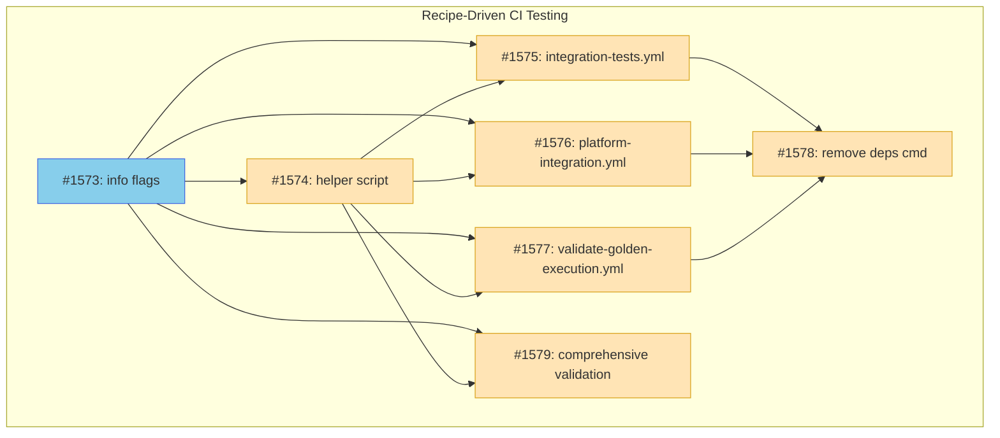

# Recipe-Driven CI Testing

## Status

**Planned**

## Implementation Issues

### Milestone: [Recipe-Driven CI Testing](https://github.com/tsukumogami/tsuku/milestone/74)

| Issue | Dependencies | Tier |
|-------|--------------|------|
| [#1573: feat(info): add deps-only and system flags for recipe dependency extraction](https://github.com/tsukumogami/tsuku/issues/1573) | None | testable |
| _Creates the shared extraction library in internal/executor/system_deps.go and extends the info command with --deps-only, --system, and --family flags. This is the foundation that all other issues depend on._ | | |
| [#1574: ci: create workflow helper script for recipe-driven package installation](https://github.com/tsukumogami/tsuku/issues/1574) | [#1573](https://github.com/tsukumogami/tsuku/issues/1573) | simple |
| _Adds .github/scripts/install-recipe-deps.sh, a portable script that uses the info command to install recipe dependencies for any Linux family. Provides a consistent pattern for workflow migrations._ | | |
| [#1575: ci: migrate integration-tests.yml to use recipe-driven deps](https://github.com/tsukumogami/tsuku/issues/1575) | [#1573](https://github.com/tsukumogami/tsuku/issues/1573), [#1574](https://github.com/tsukumogami/tsuku/issues/1574) | testable |
| _Updates the library-dlopen-musl job to use the new info command instead of the prototype deps command. First workflow migration that validates the pattern works in CI._ | | |
| [#1576: ci: migrate platform-integration.yml to use recipe-driven deps](https://github.com/tsukumogami/tsuku/issues/1576) | [#1573](https://github.com/tsukumogami/tsuku/issues/1573), [#1574](https://github.com/tsukumogami/tsuku/issues/1574) | testable |
| _Replaces hardcoded package lists in the integration and integration-arm64-musl jobs. Uses the helper script to install only recipe-declared packages on Alpine containers._ | | |
| [#1577: ci: migrate validate-golden-execution.yml to use recipe-driven deps](https://github.com/tsukumogami/tsuku/issues/1577) | [#1573](https://github.com/tsukumogami/tsuku/issues/1573), [#1574](https://github.com/tsukumogami/tsuku/issues/1574) | testable |
| _Updates validate-linux-containers job to use recipe-driven deps. Extends to other families beyond Alpine when needed._ | | |
| [#1578: refactor: remove prototype tsuku deps command](https://github.com/tsukumogami/tsuku/issues/1578) | [#1575](https://github.com/tsukumogami/tsuku/issues/1575), [#1576](https://github.com/tsukumogami/tsuku/issues/1576), [#1577](https://github.com/tsukumogami/tsuku/issues/1577) | simple |
| _Deletes deps.go and deps_test.go, removes command registration. Safe to do after all workflows have migrated to the info command._ | | |
| [#1579: ci: add comprehensive recipe validation against slim containers](https://github.com/tsukumogami/tsuku/issues/1579) | [#1573](https://github.com/tsukumogami/tsuku/issues/1573), [#1574](https://github.com/tsukumogami/tsuku/issues/1574) | critical |
| _Creates the final validation workflow that tests ALL recipes (embedded and registry) against minimal container images. Ensures under-declared dependencies are caught before they affect users._ | | |

### Dependency Graph



**Legend**: Green = done, Blue = ready, Yellow = blocked, Purple = needs-design

## Context and Problem Statement

GHA integration tests for musl/Alpine use hardcoded package lists:

```yaml
run: apk add --no-cache curl gcc musl-dev bash git
```

But recipes declare different packages via `apk_install` actions:

```toml
[[steps]]
action = "apk_install"
packages = ["zlib-dev"]
when = { os = ["linux"], libc = ["musl"] }
```

This creates two problems:

1. **False positives**: Tests pass when packages are pre-installed, even if recipes don't declare them
2. **User failures**: Users on Alpine get errors because recipes under-declare dependencies

Issue #1570 exposed this gap when the `library-dlopen-musl` job failed for `zlib` and `libyaml` with "missing system packages" errors. The recipes correctly declared `zlib-dev` and `yaml-dev`, but the workflow only installed generic build dependencies.

The root cause is that CI doesn't validate recipes correctly declare their system dependencies. The existing `--sandbox` mode derives container configuration from recipes, but GHA workflows bypass this entirely with manual package lists.

### Scope

**In scope:**
- Extend `tsuku info` with flags to extract system package requirements
- Platform-aware transitive dependency resolution
- Shared extraction library for info command and sandbox mode
- GHA workflow changes to use recipe-driven package installation
- Multi-family support (alpine, debian, rhel, arch, suse)
- Validate ALL recipes (embedded + `recipes/`) against slim containers
- Fix recipes that under-declare system dependencies
- Use slimmest container images for each family

**Out of scope:**
- New CLI commands (reuse existing `info`)
- Changes to sandbox mode internals (beyond sharing extraction code)
- New testing frameworks
- Changes to recipe format

## Decision Drivers

- **Validate declarations**: Tests must fail if recipes under-declare dependencies
- **Complete coverage**: Transitive dependencies must be included
- **Reuse existing infrastructure**: `info` already has transitive resolution
- **Consistent UX**: Follow established patterns (`--metadata-only` → `--deps-only`)
- **Platform-aware**: Dependencies can be declared in platform-filtered steps
- **Multi-family**: Support all five Linux families consistently
- **CI agnostic**: Solution should work with any CI system, not just GHA

## Considered Options

### Decision 1: Command Structure

Should we create a new `tsuku deps` command or extend `tsuku info`?

#### Chosen: Extend `tsuku info`

Add `--deps-only`, `--system`, and `--family` flags to the existing `info` command.

**How it works:**

```bash
# Get tsuku dependencies (recipe names) - current behavior
tsuku info curl
# Shows: Install Dependencies: openssl, zlib

# Get only dependencies, skip metadata
tsuku info --deps-only curl
# Output: openssl
#         zlib

# Get system packages for Alpine
tsuku info --deps-only --system --family alpine curl
# Output: openssl-dev
#         zlib-dev

# JSON format for scripting
tsuku info --deps-only --system --family alpine --json curl
# Output: {"packages":["openssl-dev","zlib-dev"],"family":"alpine"}

# Use in CI workflows
apk add $(tsuku info --deps-only --system --family alpine curl)
```

**Why this is better than a new command:**

1. **`info` already resolves transitive dependencies**: Lines 90-100 of `info.go` call `ResolveTransitive()` to get the full dependency tree. We reuse this instead of duplicating it.

2. **Symmetrical flags**: `--deps-only` pairs naturally with existing `--metadata-only`:
   - `tsuku info curl` - everything
   - `tsuku info --metadata-only curl` - skip deps
   - `tsuku info --deps-only curl` - skip metadata

3. **JSON output exists**: `--json` already works and is used by automation. Adding `--deps-only` just changes what's in the JSON.

4. **Less CLI surface area**: No new command to document and maintain.

#### Alternatives Considered

**New `tsuku deps` command**: Create a separate command for dependency extraction.

Rejected because:
- Duplicates transitive resolution that `info` already has
- Adds CLI surface area
- The verbosity difference (`--deps-only` adds one flag) is negligible
- "Conceptual purity" (info = introspection, deps = extraction) is a weak argument

**Extend `tsuku check-deps`**: Add system package extraction to the validation command.

Rejected because `check-deps` is about validation (pass/fail), not extraction. Different purpose.

### Decision 2: Platform-Aware Transitive Resolution

Dependencies can be declared in steps with platform filters. How should transitive resolution handle this?

#### Chosen: Pass Target to ResolveTransitive

The target platform must be passed to `ResolveTransitiveForPlatform()` so it only includes dependencies from steps matching the target.

**The problem:**

```toml
# curl.toml
[[steps]]
action = "homebrew"
formula = "zlib"
when = { os = ["linux"], libc = ["glibc"] }  # Only on glibc

[[steps]]
action = "apk_install"
packages = ["zlib-dev"]
when = { os = ["linux"], libc = ["musl"] }  # Only on musl
```

When resolving for Alpine (musl):
- The `homebrew` step declares a tsuku dependency on `zlib` recipe - but this step doesn't apply to musl
- The `apk_install` step is a system package, not a tsuku dependency
- Without platform filtering, we'd incorrectly include `zlib` in the dependency tree

**The solution:**

```
tsuku info --deps-only --system --family alpine curl

1. Build target: --family alpine → linux/amd64, alpine, musl
2. ResolveTransitiveForPlatform(ctx, loader, deps, "curl", target)
   → Filters steps by target BEFORE extracting dependencies
   → Returns only dependencies from matching steps
3. For each recipe in tree: ExtractSystemPackages(recipe, target)
4. Deduplicate and output
```

**Backwards compatibility:**

If `--family` is not provided, use the current system as the target:
- On Ubuntu: resolves for debian/glibc
- On Alpine: resolves for alpine/musl
- On macOS: resolves for darwin

This matches current `tsuku info` behavior where dependencies shown are relevant to YOUR system.

### Decision 3: Code Reuse with Sandbox

Both `tsuku info` (with new flags) and sandbox mode extract system packages from recipes. How should they share code?

#### Chosen: Shared Extraction Library in internal/executor

Create `internal/executor/system_deps.go` with extraction functions that both consumers use.

```go
// Core extraction from steps (used by both)
func ExtractSystemPackagesFromSteps(steps []recipe.Step) (
    packages map[string][]string,
    repositories []SystemRepository,
)

// High-level wrapper for CLI
func ExtractSystemPackagesList(r *recipe.Recipe, target platform.Target) []string

// Helper using SystemAction interface
func IsSystemAction(step recipe.Step) bool
```

**Benefits:**
- Single source of truth for extraction logic
- ~66 LOC reduction from eliminating duplication
- Leverages existing `SystemAction` interface for type-safe detection
- Places code alongside related `FilterStepsByTarget()` function

### Decision 4: Output Format

How should `--deps-only` output dependencies?

#### Chosen: Shell-friendly text default with JSON option

```bash
# Plain text (default) - one package per line
tsuku info --deps-only --system --family alpine curl
openssl-dev
zlib-dev

# JSON for programmatic use
tsuku info --deps-only --system --family alpine --json curl
{"packages": ["openssl-dev", "zlib-dev"], "family": "alpine"}
```

**Text output** is one-per-line for easy shell consumption:
```bash
apk add $(tsuku info --deps-only --system --family alpine curl)
```

**JSON output** uses the existing `--json` flag, consistent with other `info` modes.

## Decision Outcome

**Chosen: Extend `tsuku info` with platform-aware dependency extraction**

### Summary

Add three flags to `tsuku info`:
- `--deps-only`: Output only dependencies, skip metadata (mutually exclusive with `--metadata-only`)
- `--system`: Extract system packages instead of tsuku recipe names
- `--family`: Target Linux family for cross-platform queries (defaults to current system)

The implementation reuses existing `ResolveTransitiveForPlatform()` infrastructure, passing the target platform so dependencies from platform-filtered steps are correctly resolved.

**Data flow:**

```
tsuku info --deps-only --system --family alpine curl

Recipe (curl.toml)
    │
    ▼
Build target: alpine → linux/amd64, alpine, musl
    │
    ▼
ResolveTransitiveForPlatform(ctx, loader, deps, "curl", target)
    │
    ├─ Filter curl's steps by target
    ├─ Extract dependencies from matching steps only
    ├─ Recursively resolve each dependency with same target
    │
    ▼
[curl, openssl] (zlib excluded - its homebrew step doesn't match musl)
    │
    ▼
For each recipe: ExtractSystemPackages(recipe, target)
    │
    ▼
["openssl-dev"] (deduplicated)
    │
    ▼
Output:
openssl-dev
```

**GHA workflows change from:**

```yaml
run: apk add --no-cache curl gcc musl-dev bash git zlib-dev yaml-dev
```

**To:**

```yaml
run: |
  DEPS=$(./tsuku info --deps-only --system --family alpine ${{ matrix.library }})
  if [ -n "$DEPS" ]; then
    apk add --no-cache $DEPS
  fi
```

### Rationale

This approach is preferred over a new `tsuku deps` command because:

1. **Reuses existing infrastructure**: `info` already calls `ResolveTransitive()` for transitive dependency resolution. We extend it rather than duplicate it.

2. **Consistent UX**: `--deps-only` is symmetrical with `--metadata-only`. Users familiar with one will understand the other.

3. **Less surface area**: No new command to document, test, and maintain.

4. **Platform-aware by design**: Passing the target to `ResolveTransitiveForPlatform()` ensures correct resolution when dependencies are declared in platform-filtered steps.

## Solution Architecture

### Component 1: Extended `tsuku info` Command

**Location**: `cmd/tsuku/info.go`

**New flags:**
- `--deps-only`: Output only dependencies (mutually exclusive with `--metadata-only`)
- `--system`: Extract system packages instead of recipe names
- `--family`: Target Linux family (alpine, debian, rhel, arch, suse)

**Modified flow:**

```go
func runInfo(cmd *cobra.Command, args []string) {
    depsOnly, _ := cmd.Flags().GetBool("deps-only")
    system, _ := cmd.Flags().GetBool("system")
    family, _ := cmd.Flags().GetString("family")

    // Build target from --family or current system
    target := buildTargetFromFamily(family) // defaults to runtime platform

    // Resolve transitive dependencies with platform filtering
    resolvedDeps, err := actions.ResolveTransitiveForPlatform(
        ctx, loader, directDeps, toolName, target, false)

    if depsOnly {
        if system {
            // Extract system packages from each recipe in the tree
            packages := extractSystemPackagesFromTree(resolvedDeps, target)
            outputPackages(packages, jsonOutput)
        } else {
            // Output recipe names (existing behavior, just filtered)
            outputRecipeNames(resolvedDeps, jsonOutput)
        }
        return
    }

    // ... existing info output logic ...
}
```

### Component 2: Shared Extraction Library

**Location**: `internal/executor/system_deps.go`

```go
// ExtractSystemPackagesFromSteps extracts system deps from filtered steps
func ExtractSystemPackagesFromSteps(steps []recipe.Step) *SystemDeps

// ExtractSystemPackagesRecursive extracts from all recipes in dependency tree
func ExtractSystemPackagesRecursive(
    ctx context.Context,
    loader recipe.Loader,
    recipes []string,
    target platform.Target,
) ([]string, error)

// IsSystemAction checks if a step is a system dependency action
func IsSystemAction(step recipe.Step) bool
```

**Consumers:**
- `cmd/tsuku/info.go` - CLI command (new `--deps-only --system` mode)
- `internal/sandbox/packages.go` - Container configuration

### Component 3: Workflow Helper Script

**Location**: `.github/scripts/install-recipe-deps.sh`

```bash
#!/bin/bash
set -e

FAMILY="${1:?Family required}"
RECIPE="${2:?Recipe required}"
TSUKU="${3:-./tsuku}"

DEPS=$("$TSUKU" info --deps-only --system --family "$FAMILY" "$RECIPE")
[ -z "$DEPS" ] && exit 0

case "$FAMILY" in
  alpine)  apk add --no-cache $DEPS ;;
  debian)  apt-get install -y --no-install-recommends $DEPS ;;
  rhel)    dnf install -y --setopt=install_weak_deps=False $DEPS ;;
  arch)    pacman -S --noconfirm $DEPS ;;
  suse)    zypper -n install $DEPS ;;
esac
```

## Implementation Approach

### Phase 1: Shared Extraction Library

**Files created:**
- `internal/executor/system_deps.go` (~80 LOC)
- `internal/executor/system_deps_test.go` (~100 LOC)

**Files modified:**
- `internal/sandbox/packages.go` - Use shared extraction

### Phase 2: Extend `tsuku info`

**Files modified:**
- `cmd/tsuku/info.go` - Add `--deps-only`, `--system`, `--family` flags
- `cmd/tsuku/info_test.go` - Add tests for new modes

**Key changes:**
- Add flag definitions in `init()`
- Modify `runInfo()` to handle `--deps-only` mode
- Pass target to `ResolveTransitiveForPlatform()`
- Add `extractSystemPackagesFromTree()` helper

### Phase 3: Workflow Helper Script and Migrations

**Files created:**
- `.github/scripts/install-recipe-deps.sh` (~30 LOC)

**Workflow migrations required:**

| Workflow | Job | Current Hardcoded Packages | Migration |
|----------|-----|---------------------------|-----------|
| `integration-tests.yml` | `library-dlopen-musl` | Uses `tsuku deps` (prototype) | Update to `tsuku info --deps-only --system` |
| `platform-integration.yml` | `integration` (Alpine) | `zlib-dev yaml-dev libgcc` | Replace with helper script |
| `platform-integration.yml` | `integration-arm64-musl` | `zlib-dev yaml-dev libgcc` | Replace with helper script |
| `validate-golden-execution.yml` | `validate-linux-containers` | `libstdc++ yaml-dev openssl-dev` (Alpine) | Replace with helper script |

**Detailed changes per workflow:**

**integration-tests.yml** (`library-dlopen-musl`):
```yaml
# Current (prototype with tsuku deps)
DEPS=$(./tsuku deps --system --family alpine ${{ matrix.library }})

# After
DEPS=$(./tsuku info --deps-only --system --family alpine ${{ matrix.library }})
```

**platform-integration.yml** (`integration` and `integration-arm64-musl`):
```yaml
# Before
apk add --no-cache curl bash zlib-dev yaml-dev libgcc

# After
apk add --no-cache curl bash  # bootstrap only
./.github/scripts/install-recipe-deps.sh alpine ${{ matrix.library }}
```

**validate-golden-execution.yml** (`validate-linux-containers`):
```yaml
# Before
if [ "$FAMILY" = "alpine" ]; then
  apk add --no-cache libstdc++ yaml-dev openssl-dev
fi

# After
./.github/scripts/install-recipe-deps.sh "$FAMILY" "$RECIPE"
```

### Phase 4: Remove `tsuku deps` Command

**Files deleted:**
- `cmd/tsuku/deps.go`
- `cmd/tsuku/deps_test.go`

**Files modified:**
- `cmd/tsuku/main.go` - Remove `depsCmd` registration

### Phase 5: Comprehensive Recipe Validation

Validate ALL recipes against slim containers to catch under-declaration. This phase will likely expose recipes that depend on packages commonly pre-installed in developer environments but not declared.

**Container images (slimmest available per family):**

| Family | Image | Size | Notes |
|--------|-------|------|-------|
| alpine | `alpine:3.21` | ~8MB | Minimal, musl libc |
| debian | `debian:bookworm-slim` | ~75MB | No recommended packages |
| rhel | `fedora:41-minimal` | ~100MB | DNF microdnf variant |
| arch | `archlinux:base` | ~150MB | Base without base-devel |
| suse | `opensuse/tumbleweed` | ~100MB | Rolling release base |

**Validation workflow:**

```yaml
validate-all-recipes:
  strategy:
    matrix:
      family: [alpine, debian, rhel, arch, suse]
      recipe: [... all recipes ...]
  container:
    image: ${{ matrix.family-image }}
  steps:
    - name: Bootstrap
      run: |
        # Install only Go and git for building tsuku
        case "${{ matrix.family }}" in
          alpine) apk add --no-cache go git ;;
          debian) apt-get update && apt-get install -y golang git ;;
          # ... etc
        esac

    - name: Build tsuku
      run: go build -o tsuku ./cmd/tsuku

    - name: Install recipe deps
      run: ./.github/scripts/install-recipe-deps.sh ${{ matrix.family }} ${{ matrix.recipe }}

    - name: Validate recipe
      run: ./tsuku install --dry-run ${{ matrix.recipe }}
```

**Expected recipe fixes:**

Running against slim containers will expose under-declared dependencies. Common patterns to fix:

1. **Build tools**: Recipes may assume `gcc`, `make`, or `pkg-config` are available
2. **SSL libraries**: Many recipes need `openssl-dev` or equivalent
3. **Compression**: `zlib-dev`, `xz-dev` often assumed but not declared
4. **Runtime libraries**: `libstdc++`, `libgcc` for C++ binaries

Each failure triggers a recipe fix, ensuring the registry is complete.

**Files created:**
- `.github/workflows/validate-all-recipes.yml`

**Files modified:**
- Multiple recipes under `recipes/` - add missing system dependency declarations

## Security Considerations

### Download Verification

Not applicable. The command only extracts package names from recipes—it doesn't download anything. Package installation happens via system package managers with their own verification.

### Execution Isolation

The `info` command is read-only. It loads recipes, filters steps, and outputs text. No execution, no privilege escalation, no system modification.

### Supply Chain Risks

Package installation happens via `apk add`/`apt install`/etc., not via tsuku. System package managers have GPG-signed packages. This design doesn't change the trust model.

### User Data Exposure

No data access or transmission. The command reads recipe files and outputs package names.

## Consequences

### Positive

- **Reuses existing infrastructure**: No duplication of transitive resolution logic
- **Consistent UX**: `--deps-only` mirrors `--metadata-only` pattern
- **Platform-aware**: Correctly handles dependencies in platform-filtered steps
- **Complete validation**: Recursive extraction catches under-declaration at any level
- **Code reuse**: Shared extraction library serves both info and sandbox
- **Multi-family**: All five Linux families supported consistently

### Negative

- **Flag complexity**: `--deps-only --system --family alpine` is verbose (but clear)
- **Workflow updates needed**: Multiple workflows need migration to new pattern
- **Bootstrap dependency**: Need Go installed to build tsuku before using the command
- **Recipe fixes required**: Comprehensive validation will expose under-declared dependencies in existing recipes

### Migration

The current `tsuku deps` command in PR #1572 will be removed and replaced with `tsuku info --deps-only --system`. Workflows updated to use the new syntax.

### Expected Recipe Fixes

Running all recipes against slim containers will surface under-declared dependencies. This is expected and desired—fixing these ensures users on minimal systems don't encounter failures that CI missed. The number of fixes depends on how many recipes currently rely on packages that happen to be pre-installed in typical development environments.
