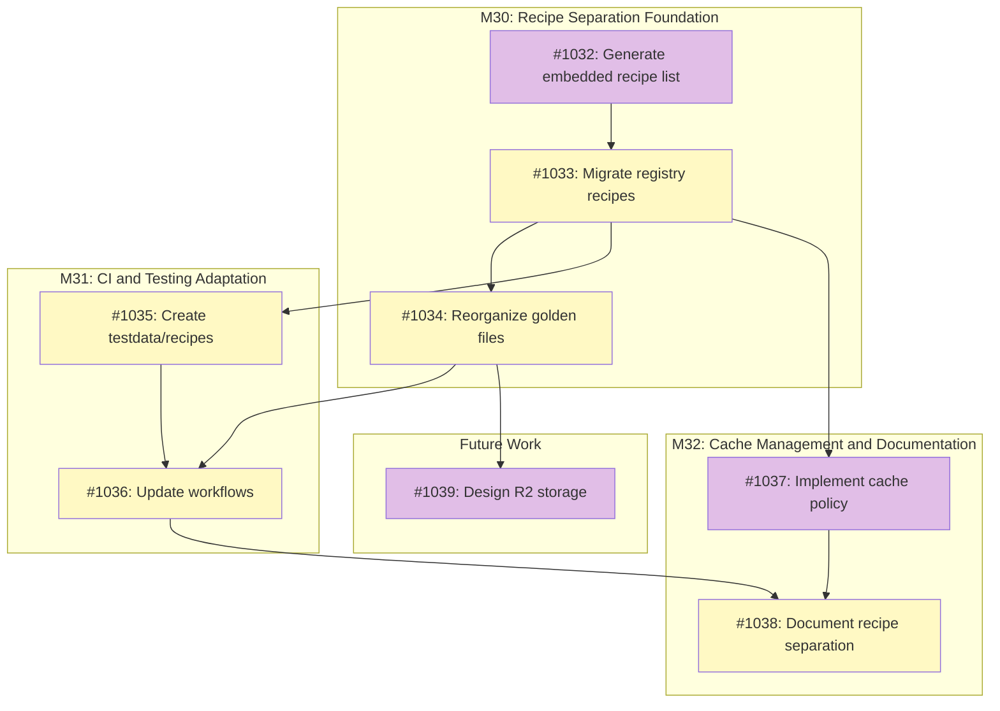

# Recipe Registry Separation

## Status

**Planned**

## Implementation Issues

### Milestone: [M30 - Recipe Separation Foundation](https://github.com/tsukumogami/tsuku/milestone/40)

| Issue | Title | Dependencies | Tier |
|-------|-------|--------------|------|
| [#1032](https://github.com/tsukumogami/tsuku/issues/1032) | Generate embedded recipe list with dependency analysis | None | critical |
| [#1033](https://github.com/tsukumogami/tsuku/issues/1033) | Migrate registry recipes to recipes/ directory | [#1032](https://github.com/tsukumogami/tsuku/issues/1032) | testable |
| [#1034](https://github.com/tsukumogami/tsuku/issues/1034) | Reorganize golden files into embedded/registry directories | [#1033](https://github.com/tsukumogami/tsuku/issues/1033) | testable |

### Milestone: [M31 - CI and Testing Adaptation](https://github.com/tsukumogami/tsuku/milestone/41)

| Issue | Title | Dependencies | Tier |
|-------|-------|--------------|------|
| [#1035](https://github.com/tsukumogami/tsuku/issues/1035) | Create testdata/recipes for integration test coverage | [#1033](https://github.com/tsukumogami/tsuku/issues/1033) | testable |
| [#1036](https://github.com/tsukumogami/tsuku/issues/1036) | Update workflows for split recipe structure | [#1034](https://github.com/tsukumogami/tsuku/issues/1034), [#1035](https://github.com/tsukumogami/tsuku/issues/1035) | testable |

### Milestone: [M32 - Cache Management and Documentation](https://github.com/tsukumogami/tsuku/milestone/42)

| Issue | Title | Dependencies | Tier |
|-------|-------|--------------|------|
| [#1037](https://github.com/tsukumogami/tsuku/issues/1037) | Implement registry recipe cache policy | [#1033](https://github.com/tsukumogami/tsuku/issues/1033) | testable |
| [#1038](https://github.com/tsukumogami/tsuku/issues/1038) | Document recipe separation for contributors | [#1036](https://github.com/tsukumogami/tsuku/issues/1036), [#1037](https://github.com/tsukumogami/tsuku/issues/1037) | simple |

### Future Work

| Issue | Title | Dependencies | Tier |
|-------|-------|--------------|------|
| [#1039](https://github.com/tsukumogami/tsuku/issues/1039) | Design R2 storage for registry golden files | [#1034](https://github.com/tsukumogami/tsuku/issues/1034) | critical |

### Dependency Graph



**Legend**: Green = done, Blue = ready, Yellow = blocked, Purple = needs-design

## Context and Problem Statement

Tsuku currently embeds all 171 recipes directly in the CLI binary via Go's `//go:embed` directive. This was a practical choice for early development: recipes are always available, installation works offline, and there's no registry infrastructure to maintain.

As tsuku matures, this approach creates problems:

1. **Binary bloat**: Every recipe adds to binary size, regardless of whether users need it
2. **Update coupling**: Recipe improvements require a new CLI release
3. **CI burden**: All recipes receive the same testing rigor, even rarely-used ones
4. **Maintenance friction**: Contributors must rebuild the CLI to test recipe changes

However, the CLI depends on certain recipes to function. Actions like `go_install`, `cargo_build`, and `homebrew` require tools (Go, Rust, patchelf) that tsuku itself must install. These recipes must remain embedded to ensure tsuku can bootstrap its own dependencies.

### Scope

**In scope:**
- Defining criteria for embedded vs registry recipes
- Moving registry recipes to `recipes/` directory at repo root
- Updating the loader to fetch registry recipes from registry
- Restructuring CI to differentiate testing levels
- Updating golden file testing strategy for registry recipes

**Out of scope:**
- Version pinning or lockfile features
- Recipe signing or verification (future enhancement)
- Multiple registry support
- Recipe deprecation workflows

## Decision Drivers

- **Bootstrap reliability**: CLI must always install action dependencies without network access to recipe registry
- **Binary size**: Smaller binaries mean faster downloads and less disk usage
- **Recipe agility**: Registry recipes should update without waiting for CLI releases
- **CI efficiency**: Embedded recipes warrant exhaustive testing; registry recipes need lighter validation
- **Backwards compatibility**: Existing workflows must continue working
- **Contributor experience**: Recipe development shouldn't require rebuilding the CLI

## Implementation Context

### Current Architecture

**Embedding mechanism** (`internal/recipe/embedded.go:13`):
```go
//go:embed recipes/*/*.toml
var embeddedRecipes embed.FS
```

**Loader priority chain** (`internal/recipe/loader.go:73-115`):
1. In-memory cache
2. Local recipes (`$TSUKU_HOME/recipes/`)
3. Embedded recipes
4. Registry (GitHub raw fetch, cached to `$TSUKU_HOME/registry/`)

The loader already supports fetching non-embedded recipes from the registry. The infrastructure exists; it just isn't used because all recipes are embedded.

### Embedded Recipe Analysis

Actions that depend on tsuku-managed tools:

| Action | Required Tool |
|--------|--------------|
| `go_install`, `go_build` | go |
| `cargo_install`, `cargo_build` | rust |
| `npm_install`, `npm_exec` | nodejs |
| `pip_install`, `pipx_install` | python-standalone |
| `gem_install`, `gem_exec` | ruby |
| `cpan_install` | perl |
| `homebrew_relocate`, `meson_build` | patchelf (Linux) |
| `configure_make`, `cmake_build`, `meson_build` | make, zig, pkg-config |
| `cmake_build` | cmake |
| `meson_build` | meson, ninja |

Transitive dependencies (libraries):
- `ruby` depends on `libyaml`
- `curl` depends on `openssl`, `zlib`

**Note:** `nix-portable` is auto-bootstrapped by the CLI (not a recipe). The nix_install and nix_realize actions download it directly with hardcoded SHA256 checksums. This is a special case that doesn't follow normal recipe patterns.

**Important:** The current `Dependencies()` infrastructure has known gaps. For example, `homebrew` has a TODO (#644) noting that composite actions don't automatically aggregate primitive dependencies. The build-time analysis must account for these gaps.

Estimated embedded recipes: 15-20 (language toolchains + build tools + their dependencies). This estimate needs validation via actual dependency graph analysis during implementation.

### Current Testing Architecture

Tsuku uses four complementary workflows that trigger under different conditions:

**Functional testing (`test-changed-recipes.yml`):**
- Triggers when: Recipe files change (`internal/recipe/recipes/**/*.toml`)
- Tests: Only the changed recipes (not all recipes)
- Actions: Installs recipes on Linux (per-recipe parallel) and macOS (aggregated)
- Filters: Skips library recipes, system dependencies, and execution-excluded recipes

**Plan validation (`validate-golden-recipes.yml`):**
- Triggers when: Recipe files change
- Tests: Only the changed recipes
- Actions: Regenerates plans with `--pin-from` and compares to golden files
- Validates: Recipe has golden files for all supported platforms (or exclusions)

**Code validation (`validate-golden-code.yml`):**
- Triggers when: Critical plan generation code changes (35 files)
- Tests: ALL recipes with golden files (full suite)
- Actions: Compares all golden files against regenerated plans
- Critical files include: `eval.go`, `plan_generator.go`, action decomposers, version providers, recipe parser

**Execution validation (`validate-golden-execution.yml`):**
- Triggers when: Golden plan files change (`testdata/golden/plans/**/*.json`)
- Tests: Changed golden files only
- Actions: Runs `tsuku install --plan <golden-file>` to verify installation

**Key insight:** Only code changes trigger full recipe validation. Recipe changes only test the changed recipe. This means a registry recipe can break without CI catching it if the breakage comes from external factors (download URL changes, version drift).

**Integration testing (`test.yml` via `test-matrix.json`):**

Separate from golden file validation, `test-matrix.json` defines feature coverage tests that actually install tools:

| CI Context | Tests | Trigger |
|------------|-------|---------|
| `ci.linux` | 11 tests | Every PR |
| `ci.macos` | 5 tests | Every PR |
| `ci.scheduled` | 5 slow tests | Nightly only |

These tests ensure specific actions work (npm_install, cargo_install, gem_install, etc.) by installing real tools. The recipes used are NOT necessarily action dependencies - they're just good test cases for those features.

**Feature coverage by tier:**
- **Tier 1-2**: github_archive, download_archive (toolchain recipes like golang, nodejs, rust)
- **Tier 3**: nix_install (hello-nix)
- **Tier 4**: tap, cask (macOS-specific)
- **Tier 5**: npm_install, pipx_install, cargo_install, gem_install, cpan_install, go_install (using recipes like netlify-cli, ruff, cargo-audit, bundler, ack, gofumpt)

**Important:** Tier 5 recipes (netlify-cli, cargo-audit, bundler, etc.) test action implementations but are NOT action dependencies. After separation, these could become registry recipes, but integration tests still need them available.

**Three exclusion files:**
- `exclusions.json`: Platform-specific exclusions (~50 entries) - "can't generate golden file for this platform"
- `execution-exclusions.json`: Recipe-wide execution exclusions (10 entries) - "can't reliably execute in CI"
- `code-validation-exclusions.json`: Code validation exclusions (7 entries) - "golden file is stale"

## Considered Options

### Decision 1: Recipe Categorization Method

How do we identify which recipes should be embedded?

#### Option 1A: Explicit Metadata Flag

Add an `embedded = true` field to recipe metadata:

```toml
[metadata]
name = "go"
embedded = true
```

**Pros:**
- Simple, explicit, easy to understand
- Contributors can see and reason about embedding status
- No magic or implicit behavior

**Cons:**
- Manual maintenance burden
- Risk of forgetting to mark a transitive dependency as embedded
- Doesn't automatically update when action dependencies change

#### Option 1B: Computed from Action Dependencies

Build-time script analyzes action implementations, extracts `Dependencies()` returns, and computes transitive closure automatically.

**Pros:**
- Always accurate: derived from actual code
- No manual maintenance
- Updates automatically when action dependencies change

**Cons:**
- More complex build process
- Requires parsing Go code or maintaining a separate registry
- Harder for contributors to predict what's embedded

#### Option 1C: Hybrid Approach

Compute the set automatically, but allow explicit overrides via metadata:
- `embedded = true` forces a recipe to be embedded
- `embedded = false` forces a recipe to be registry (override computed status)

**Pros:**
- Best of both approaches
- Automatic detection with escape hatch
- Can handle edge cases the automation misses

**Cons:**
- More complex to understand
- Two sources of truth (computed + overrides)

### Decision 2: Directory Structure

Where do embedded and registry recipes live?

#### Option 2A: Current Location Split

- Embedded: `internal/recipe/recipes/` (unchanged, embedded)
- Registry: `recipes/` at repo root (new, not embedded)

**Pros:**
- Minimal changes to existing embed directive
- Clear separation in directory structure
- `recipes/` matches monorepo documentation

**Cons:**
- Moving a recipe from registry to embedded requires moving files
- Creates a boundary that needs clear criteria for when recipes should move

#### Option 2B: Single Directory with Build Filter

All recipes in `recipes/`. Build process filters which to embed based on computed criticality.

**Pros:**
- Single location for all recipes
- No file moves when criticality changes
- Simpler directory structure

**Cons:**
- More complex build process
- Harder to see at a glance what's embedded
- Embed directive can't use dynamic filtering directly

### Decision 3: Testing Strategy

How should testing differ between embedded and registry recipes?

**Current behavior reminder:**
- Recipe changes: Only that recipe is tested (plan + execution)
- Code changes (35 files): ALL recipes' golden files are validated (plan comparison only)
- Golden file changes: Changed files are executed

The question is: what should change when we split recipes into categories?

#### Option 3A: Broader Triggers for Embedded, Unchanged for Registry

Embedded recipes get tested whenever ANY embedded recipe OR plan-critical code changes. Registry recipes keep current behavior (only tested when that recipe changes).

**Pros:**
- Embedded recipes are always validated together as a unit
- Registry recipe PRs stay fast
- No change to registry recipe testing on their own PRs

**Cons:**
- Defining which code affects which recipe category adds complexity
- Doesn't address registry recipe drift (broken by external factors)

#### Option 3B: Current Triggers, Split Execution Scope

Keep current triggers, but when code changes occur:
- Embedded recipes: Full execution validation (plan + install)
- Registry recipes: Plan validation only (no execution)

**Pros:**
- Same trigger logic, just different execution scope
- Embedded recipes always fully validated
- Registry recipes still get plan validation on code changes

**Cons:**
- Registry recipes may have broken downloads undetected
- Still runs plan validation for all 150+ registry recipes on code changes

#### Option 3C: Split Golden Files with Nightly Registry Execution

Split golden file directories by category. On code changes, only validate embedded recipes. Registry recipes validated only when changed, with nightly full execution run.

**Pros:**
- Code changes run much faster (15-20 embedded vs 150+ registry)
- Registry recipe changes still tested (plan + execution)
- Nightly catches external breakage within 24 hours

**Cons:**
- Registry recipe breakage from code changes not caught until nightly
- Requires splitting golden file directory structure
- More complex CI workflow logic

### Decision 4: Integration Test Recipe Handling

Integration tests (`test-matrix.json`) need specific recipes to test action implementations. Some tier 5 test recipes (netlify-cli, cargo-audit, bundler) are NOT action dependencies but ARE required for feature coverage testing.

#### Option 4A: Keep Test Recipes Embedded

Any recipe referenced in `test-matrix.json` stays in `internal/recipe/recipes/` even if it's not an action dependency.

**Pros:**
- Integration tests always work (recipes embedded)
- No changes to test.yml workflow
- Simple mental model: "test recipe = embedded"

**Cons:**
- Inflates embedded recipe count (adds ~10 more recipes)
- Blurs the "action dependency" definition of embedded
- Test recipes can't be updated without CLI release

#### Option 4B: Use testdata/recipes/ for Test Variants

Create test-specific recipe variants in `testdata/recipes/` that are always embedded, separate from the production recipe registry.

**Pros:**
- Clean separation of concerns
- Test recipes can be simplified versions
- Production recipes can move to registry
- Already have precedent (waypoint-tap uses testdata/recipes/)

**Cons:**
- Two copies of some recipes to maintain
- Test recipes could drift from production
- More complex recipe structure

#### Option 4C: Ensure test.yml Fetches Registry Recipes

Update test.yml to fetch registry recipes before running integration tests, ensuring they're available regardless of embedding.

**Pros:**
- Clean separation: embedded = action dependencies only
- Integration tests work with registry recipes
- No recipe duplication

**Cons:**
- Integration tests depend on network/registry
- Slower CI (fetch step before test)
- Registry outage could break all integration tests

### Evaluation Against Decision Drivers

| Driver | 1A (Explicit) | 1B (Computed) | 1C (Hybrid) |
|--------|--------------|--------------|-------------|
| Bootstrap reliability | Fair | Good | Good |
| Maintenance burden | Poor | Good | Good |
| Contributor clarity | Good | Poor | Fair |

| Driver | 2A (Split Dirs) | 2B (Build Filter) |
|--------|-----------------|-------------------|
| Contributor clarity | Good | Fair |
| Build complexity | Good | Poor |
| Migration ease | Good | Fair |

| Driver | 3A (Broader Triggers) | 3B (Split Execution) | 3C (Split Golden + Nightly) |
|--------|----------------------|---------------------|------------------------------|
| CI efficiency | Fair | Fair | Good |
| Regression detection | Good (embedded) / Poor (registry) | Good (embedded) / Fair (registry) | Good (embedded) / Fair (registry) |
| Simplicity | Poor | Good | Fair |

| Driver | 4A (Keep Test Embedded) | 4B (testdata/recipes) | 4C (Fetch Registry) |
|--------|------------------------|----------------------|---------------------|
| CI reliability | Good | Good | Fair |
| Maintenance burden | Fair | Poor | Good |
| Separation of concerns | Poor | Good | Good |

### Decision 5: Registry Golden File Storage

At 10K registry recipes with ~2.4 golden files each (~24K files, ~380MB), storing golden files in git creates unsustainable repo bloat. Git history compounds this - every version bump changes URLs/checksums.

However, golden files can't be reduced to hashes alone: the `--pin-from` flag requires the full previous plan to extract ecosystem-specific lock information for deterministic regeneration.

#### Option 5A: Full Golden Files in Git

Store all registry golden files in `testdata/golden/plans/registry/` like embedded recipes.

**Pros:**
- Simple, consistent with embedded recipes
- Full git history for debugging

**Cons:**
- ~380MB for 10K recipes, plus history overhead
- Slow clones, large diffs on version bumps
- Doesn't scale

#### Option 5B: External Storage (Cloudflare R2)

Store registry golden files in Cloudflare R2. Only latest version, no history.

**Pros:**
- Scales to 10K+ recipes without repo bloat
- 10GB free tier, cheap beyond
- Existing Cloudflare infrastructure (telemetry worker)
- No git history overhead

**Cons:**
- External dependency for CI
- Needs upload/download workflow
- Requires its own tactical design

#### Option 5C: No Golden Files for Registry

Only validate "plan generation succeeds", not "plan matches expectation".

**Pros:**
- Zero storage
- Simplest implementation

**Cons:**
- Can't detect plan generation regressions
- Loses determinism validation
- Lower quality assurance for registry recipes

| Driver | 5A (Git Storage) | 5B (R2 External) | 5C (No Golden) |
|--------|-----------------|------------------|----------------|
| Scalability | Poor | Good | Good |
| Regression detection | Good | Good | Poor |
| CI complexity | Low | Medium | Low |
| Infrastructure dependency | None | Cloudflare | None |

**Note:** Option 5B requires a separate tactical design for R2 bucket structure, upload/download workflows, and cache invalidation.

### Uncertainties

- **Binary size impact**: The 15-20 estimate needs validation. Implementation should measure baseline binary size and compare after separation.
- **Version drift**: How do we handle registry recipe updates that conflict with installed versions?

### Review Feedback Integration

Based on reviews from Release, DevOps, Platform, and DX engineers, the following gaps were identified and decisions made:

**Gap 1: Registry Recipe Breakage Detection (24-Hour Blind Spot)**

All reviewers flagged that code changes could break registry recipes without detection until nightly runs.

**Decision:** Registry recipe PRs MUST pass execution validation before merge, not just plan validation. Nightly runs are for catching *external* drift (URL changes, version rot), not *internal* breakage from code changes.

**Gap 2: Network Failure Handling Undefined**

Reviewers asked: What happens when GitHub is unavailable and cache is expired?

**Decision:** Implement stale cache fallback with warning:
1. Fetch from GitHub → success: return fresh, cache with timestamp
2. Fetch timeout (30s) → check local cache
3. Cache exists → return with warning "Recipe may be stale (cached X hours ago)"
4. Cache missing → fail with "No network and no cached recipe"

**Gap 3: Embedded Recipe List Unvalidated**

The 15-20 estimate relies on manual analysis. Dependencies() infrastructure has known gaps (#644).

**Decision:** BEFORE Stage 1, generate definitive embedded recipe list via build-time dependency analysis. Create `EMBEDDED_RECIPES.md` with explicit list and dependency rationale. Add CI validation that alerts when action dependencies change.

**Gap 4: R2 Single Point of Failure**

R2 outage would break all nightly validation with no fallback.

**Decision:** R2 tactical design MUST include:
- Health check before nightly validation starts
- Git-based fallback cache (compressed last-known-good golden files)
- Graceful degradation (skip validation with issue creation on R2 failure)
- Monitoring and alerting for R2 availability

**Gap 5: Cache Size Unbounded**

No limits on `$TSUKU_HOME/registry/` growth.

**Decision:** Implement LRU cache with 500MB default limit. Add `tsuku cache-cleanup` subcommand. Warn when approaching limit.

**Gap 6: Error Messages Undefined**

Product and DevRel reviewers flagged that network failure error messages are unspecified. First impressions during failures determine whether users file helpful reports or abandon the tool.

**Decision:** Implementation issues MUST include error message templates for all failure modes:

| Failure Mode | Required Message Template |
|--------------|--------------------------|
| Network timeout, no cache | "Could not reach recipe registry. Check your internet connection." |
| Recipe doesn't exist | "No recipe found for '{name}'. Run `tsuku search {name}` to find similar recipes." |
| GitHub rate limited | "Recipe registry temporarily unavailable (rate limited). Try again in a few minutes." |
| Stale cache used | "Using cached recipe (last updated {X} hours ago). Run `tsuku update-registry` to refresh." |
| Recipe parse error | "Recipe '{name}' has syntax errors. This has been reported to maintainers." |

Each implementation issue touching user-facing errors must specify the exact message text.

## Decision Outcome

**Chosen: Location-based categorization (2A) + Split golden files with nightly registry execution (3C) + testdata/recipes for integration tests (4B) + Cloudflare R2 for registry golden files (5B)**

### Summary

Recipe category is determined by directory location: `internal/recipe/recipes/` = embedded, `recipes/` = registry (fetched from registry). Embedded golden files stay in git; registry golden files are stored in Cloudflare R2 (no history, just latest). Code changes only validate embedded recipes. Registry recipes are fully tested when changed, with nightly runs catching external breakage. Integration tests use `testdata/recipes/` for feature coverage recipes that aren't action dependencies.

### Rationale

**Location-based categorization chosen because:**
- **Maximum simplicity**: No metadata field to maintain, no computed analysis to debug
- **Explicit by action**: Moving a recipe file IS the act of changing its criticality
- **Clear contributor understanding**: Directory location is unambiguous
- **Aligns with existing loader priority**: The embed directive already uses directory paths

**Split golden files + nightly testing (3C) chosen because:**
- **CI efficiency**: Code changes only validate 15-20 embedded recipes instead of 170+
- **Registry recipes still fully tested when changed**: Plan validation AND execution on that recipe's PR
- **Nightly catches external drift**: Download URL changes, version drift detected within 24 hours
- **Clear trigger logic**: Embedded = always validated on code changes; Registry = validated on their own changes + nightly

**testdata/recipes for integration tests (4B) chosen because:**
- **Clean separation**: Embedded recipes = action dependencies; test recipes = feature coverage
- **Existing precedent**: waypoint-tap already uses testdata/recipes/ pattern
- **CI reliability**: Test recipes are embedded, no network dependency for integration tests
- **Independent evolution**: Test recipes can be simplified versions focused on CI speed

**Cloudflare R2 for registry golden files (5B) chosen because:**
- **Scalability**: Supports 10K+ recipes without git repo bloat
- **Existing infrastructure**: Already have Cloudflare for telemetry worker
- **Cost effective**: 10GB free tier covers initial scale, cheap beyond
- **Full validation preserved**: Unlike hash-only, retains `--pin-from` capability

**Alternatives rejected:**

- **1A (Explicit metadata)**: Adds manual maintenance burden with risk of forgetting transitive dependencies
- **1B/1C (Computed from dependencies)**: Complex build process, harder to predict results, requires fixing Dependencies() infrastructure gaps (#644)
- **3A (Broader triggers)**: Doesn't address registry recipe drift; adds complexity defining code-recipe relationships
- **3B (Split execution)**: Still validates all 150+ registry recipes on code changes, slow CI
- **4A (Keep test recipes embedded)**: Inflates embedded count, blurs the "action dependency" definition
- **4C (Fetch registry)**: Makes integration tests depend on registry availability
- **5A (Git storage for registry golden files)**: ~380MB for 10K recipes plus history overhead, doesn't scale
- **5C (No golden files for registry)**: Loses plan generation regression detection, lower quality assurance

### Trade-offs Accepted

By choosing location-based categorization:
- Moving a recipe between categories requires moving files (accepted: this is an intentional friction)
- Embedded recipe list isn't automatically updated when action dependencies change (accepted: embedded recipes change rarely, manual review is appropriate)

By choosing split golden files + nightly:
- Registry recipe breakage from code changes not caught until nightly (accepted: code changes rarely break registry recipes, and nightly catches it)
- Registry recipe issues from external factors (URL changes) may go undetected for up to 24 hours (accepted: faster contributor feedback is worth this tradeoff)
- Requires splitting golden file directories and updating workflow triggers (accepted: one-time migration cost)

By choosing testdata/recipes for integration tests:
- Test recipes could drift from production recipes (accepted: test recipes focus on action coverage, not production quality)
- Two copies of some recipes (accepted: test versions are simplified, clear ownership boundary)
- More complex recipe structure to understand (accepted: well-documented in CONTRIBUTING.md)

By choosing Cloudflare R2 for registry golden files:
- External dependency for CI validation (accepted: Cloudflare has high availability, fallback to skip validation on outage)
- No git history for golden file changes (accepted: history not needed, only latest matters for validation)
- Requires separate tactical design for implementation (accepted: complexity warrants dedicated design)

## Solution Architecture

### Overview

The solution separates recipes into two directory locations:
- **Embedded recipes**: `internal/recipe/recipes/` (embedded via `//go:embed`)
- **Registry recipes**: `recipes/` at repo root (fetched from GitHub registry)

The loader's existing priority chain handles this naturally. No code changes are needed for the basic fetch mechanism - the separation is purely organizational.

### Directory Structure

```
tsuku/
├── internal/
│   └── recipe/
│       ├── embedded.go          # //go:embed recipes/*/*.toml
│       └── recipes/             # Embedded recipes (15-20)
│           ├── g/go.toml
│           ├── r/rust.toml
│           ├── n/nodejs.toml
│           └── ...
├── recipes/                     # Registry recipes (~150)
│   ├── a/actionlint.toml
│   ├── f/fzf.toml
│   └── ...
└── testdata/
    ├── recipes/                 # Integration test recipes (embedded)
    │   ├── netlify-cli.toml     # Tests npm_install action
    │   ├── ruff.toml            # Tests pipx_install action
    │   ├── cargo-audit.toml     # Tests cargo_install action
    │   ├── bundler.toml         # Tests gem_install action
    │   ├── ack.toml             # Tests cpan_install action
    │   ├── gofumpt.toml         # Tests go_install action
    │   └── waypoint-tap.toml    # Tests tap action (already exists)
    └── golden/
        ├── plans/
        │   └── embedded/        # Golden files for embedded recipes (in git)
        └── exclusions.json      # Updated with category awareness

# Registry golden files stored externally:
# Cloudflare R2: tsuku-golden-files bucket
#   └── registry/
#       └── {letter}/{recipe}/{version}-{platform}.json
```

**Three recipe locations:**
1. `internal/recipe/recipes/` - Embedded (action dependencies)
2. `recipes/` - Registry (production), fetched from registry
3. `testdata/recipes/` - Integration test recipes, embedded for CI reliability

**Two golden file locations:**
1. `testdata/golden/plans/embedded/` - In git, versioned
2. Cloudflare R2 bucket - Registry golden files, latest only, no history

### Loader Behavior

The existing loader (`internal/recipe/loader.go`) already supports this flow:

```
User requests recipe "fzf"
    ↓
1. Check in-memory cache → miss
    ↓
2. Check local recipes ($TSUKU_HOME/recipes/fzf.toml) → miss
    ↓
3. Check embedded recipes (internal/recipe/recipes/) → miss (fzf is registry)
    ↓
4. Fetch from registry (GitHub raw URL) → found
    ↓
5. Cache to $TSUKU_HOME/registry/f/fzf.toml
    ↓
6. Return recipe
```

For embedded recipes like "go":
```
User requests recipe "go"
    ↓
1-2. Cache/local checks → miss
    ↓
3. Check embedded recipes → found (go is embedded)
    ↓
4. Return recipe (no network needed)
```

### Registry URL Structure

Registry recipes are fetched from GitHub raw URLs:
```
https://raw.githubusercontent.com/tsukumogami/tsuku/main/recipes/{letter}/{name}.toml
```

This URL pattern needs updating from the current:
```
https://raw.githubusercontent.com/tsukumogami/tsuku/main/internal/recipe/recipes/{letter}/{name}.toml
```

### Golden File Organization

Golden files mirror the recipe structure:
```
testdata/golden/plans/
├── embedded/           # Full validation (plan + execution)
│   ├── g/go/
│   ├── r/rust/
│   └── ...
└── registry/          # Plan-only validation (nightly execution)
    ├── a/actionlint/
    ├── f/fzf/
    └── ...
```

### CI Workflow Changes

**Current workflows:**
| Workflow | Trigger | Scope |
|----------|---------|-------|
| `test-changed-recipes.yml` | Recipe files change | Changed recipes only |
| `validate-golden-recipes.yml` | Recipe files change | Changed recipes only |
| `validate-golden-code.yml` | 35 plan-critical code files change | ALL recipes |
| `validate-golden-execution.yml` | Golden files change | Changed golden files |

**Changes needed:**

1. **test-changed-recipes.yml** - Update path triggers:
   - Currently: `internal/recipe/recipes/**/*.toml`
   - Add: `recipes/**/*.toml` (registry recipes)
   - Behavior unchanged: tests changed recipes on their PRs

2. **validate-golden-recipes.yml** - Update path triggers:
   - Currently: `internal/recipe/recipes/**/*.toml`
   - Add: `recipes/**/*.toml`
   - Behavior unchanged: validates changed recipes have golden files

3. **validate-golden-code.yml** - Scope reduction (key change):
   - Currently: Validates ALL golden files when code changes
   - Change to: Only validate `testdata/golden/plans/embedded/**`
   - Rationale: Code changes rarely break registry recipes; nightly catches any drift

4. **validate-golden-execution.yml** - No change needed:
   - Already only executes changed golden files
   - Will naturally work with split directory structure

5. **nightly-registry-validation.yml** (new):
   - Cron: Daily at 2 AM UTC
   - Scope: All registry recipes (`testdata/golden/plans/registry/**`)
   - Actions: Full plan validation + execution
   - Reporting: Creates GitHub issue on failure

**Testing behavior by scenario:**

| Scenario | Embedded Recipes | Registry Recipes |
|----------|------------------|-------------------|
| Recipe file changes | Plan + Execution | Plan + Execution (required for merge) |
| Plan-critical code changes (35 files) | Plan validation | Not tested (caught by nightly) |
| Golden file changes | Execution | Execution |
| Nightly run | Not included | Full validation + Execution (external drift detection) |

**Important (from review feedback):** Registry recipe PRs MUST pass execution validation before merge, not just plan validation. This closes the "24-hour blind spot" where broken recipes could merge and affect users before nightly detection.

**Nightly purpose clarified:** Nightly runs catch *external* drift (URL changes, version rot, upstream breakage) - not internal breakage from code changes. If a registry recipe breaks from a code change, the recipe maintainer should add that recipe to their PR's test scope.

## Implementation Approach

### Stage 0: Embedded Recipe List Validation (Prerequisite)

**Goal:** Generate and validate the definitive embedded recipe list before any migration.

**Steps:**
1. Create build-time script to extract all `Dependencies()` returns from action code
2. Compute transitive closure of all action dependencies
3. Validate against known gaps (issue #644 for homebrew composite actions)
4. Generate `EMBEDDED_RECIPES.md` with:
   - Explicit list of all embedded recipes
   - Dependency graph showing why each is embedded
   - Which action(s) require each recipe
5. Add CI validation script: `verify-embedded-recipes.sh`
   - Alerts when action dependencies change
   - Fails if embedded recipe is missing from embedded directory

**Validation:** `EMBEDDED_RECIPES.md` exists with complete list. CI script passes.

**Blocking:** Stage 1 cannot proceed until this is complete.

### Stage 1: Recipe Migration

**Goal:** Move registry recipes to `recipes/` directory.

**Steps:**
1. Identify embedded recipes (action dependencies + transitive deps)
2. Move all other recipes from `internal/recipe/recipes/` to `recipes/`
3. Update embed directive if needed (should work unchanged)
4. Update registry URL in `internal/registry/registry.go`

**Validation:** All existing tests pass. `tsuku install <registry-recipe>` works via registry fetch.

### Stage 2: Golden File Reorganization

**Goal:** Separate golden files - embedded in git, registry in R2.

**Steps:**
1. Create `testdata/golden/plans/embedded/`
2. Move embedded recipe golden files to `embedded/` subdirectory
3. Update regeneration scripts to use new paths for embedded recipes
4. Update validation scripts to use new paths

**Note:** Registry golden files migration to R2 requires separate tactical design (see Stage 7).

**Validation:** Embedded golden file scripts work with new structure.

### Stage 3: Integration Test Recipe Setup

**Goal:** Create testdata/recipes/ for feature coverage testing.

**Steps:**
1. Create simplified test recipes for each package manager action:
   - `testdata/recipes/netlify-cli.toml` - tests npm_install
   - `testdata/recipes/ruff.toml` - tests pipx_install
   - `testdata/recipes/cargo-audit.toml` - tests cargo_install
   - `testdata/recipes/bundler.toml` - tests gem_install
   - `testdata/recipes/ack.toml` - tests cpan_install
   - `testdata/recipes/gofumpt.toml` - tests go_install

2. Update `test-matrix.json` to reference `testdata/recipes/` paths:
   ```json
   "npm_netlify-cli_basic": { "tool": "netlify-cli", "recipe": "testdata/recipes/netlify-cli.toml", ... }
   ```

3. Update `internal/recipe/embedded.go` to embed testdata/recipes:
   ```go
   //go:embed recipes/*/*.toml
   //go:embed ../../../testdata/recipes/*.toml
   var embeddedRecipes embed.FS
   ```

4. Verify integration tests still pass with new recipe paths

**Validation:** `go test ./...` passes. Integration tests use testdata/recipes/ and don't depend on registry recipes.

### Stage 4: CI Workflow Updates

**Goal:** Adjust workflow triggers and scope for the split structure.

**Steps:**
1. **test-changed-recipes.yml**: Add `recipes/**/*.toml` to path triggers (alongside existing `internal/recipe/recipes/**/*.toml`)

2. **validate-golden-recipes.yml**: Add `recipes/**/*.toml` to path triggers. Update script to detect recipe category from path and look in appropriate golden file directory.

3. **validate-golden-code.yml**: Change scope from all golden files to `testdata/golden/plans/embedded/**` only. This is the key optimization - code changes no longer validate 150+ registry recipes.

4. **validate-golden-execution.yml**: Update to handle both `embedded/` and `registry/` subdirectories in golden file detection.

5. **Create nightly-registry-validation.yml**:
   - Cron trigger: `0 2 * * *`
   - Runs `validate-all-golden.sh` for `testdata/golden/plans/registry/`
   - Executes all registry golden files
   - Creates GitHub issue on failure with list of broken recipes

6. Update exclusions.json: Add `category` field or split into `embedded-exclusions.json` and `registry-exclusions.json`

**Validation:**
- Code change PRs complete faster (only embedded recipes)
- Registry recipe change PRs still run full validation
- Nightly workflow runs and reports failures

### Stage 5: Cache Policy Implementation (Expanded per Review Feedback)

**Goal:** Implement cache TTL, invalidation, size limits, and network failure handling.

**Steps:**
1. Add fetch timestamp metadata alongside cached recipes
2. Implement 24-hour default TTL (configurable via `TSUKU_RECIPE_CACHE_TTL`)
3. Add `tsuku update-registry` command to force refresh all cached recipes
4. Add `--force` flag to `tsuku install` to bypass cache

**Network failure handling (from review):**
5. Implement stale cache fallback:
   - Fetch from GitHub with 30-second timeout
   - On timeout: check local cache, return with warning if exists
   - Log: "Recipe may be stale (cached X hours ago)"
   - If no cache: fail with "No network and no cached recipe available"

**Cache size management (from review):**
6. Implement LRU cache with 500MB default limit (configurable via `TSUKU_CACHE_SIZE_LIMIT`)
7. Add `tsuku cache-cleanup` subcommand for manual cleanup
8. Warn user when cache exceeds 80% of limit
9. Auto-evict least-recently-used recipes when limit exceeded

**Validation:**
- Cache expires after TTL, fresh recipes fetched
- Network failure falls back to stale cache with warning
- Cache size stays within limit

### Stage 6: Documentation and Migration Guide

**Goal:** Document the new structure for contributors.

**Steps:**
1. Update CONTRIBUTING.md with recipe category guidance:
   - Decision flowchart: "Should my recipe be embedded?"
   - Troubleshooting: "My recipe works locally but fails in CI"
   - Explain three directories (embedded, registry, testdata)
2. Reference EMBEDDED_RECIPES.md (created in Stage 0)
3. Document the nightly validation process and failure notification channels
4. Update troubleshooting for "recipe not found" errors (network issues)
5. Create incident response playbook for repository compromise

### Stage 7: Registry Golden File R2 Storage (Separate Design)

**Goal:** Implement Cloudflare R2 storage for registry golden files.

**This stage requires its own tactical design document covering:**
- R2 bucket structure and naming conventions
- Upload workflow (on registry recipe PR merge)
- Download workflow (for CI validation)
- Authentication and access control (GitHub Actions OIDC recommended)
- Cache headers and CDN behavior
- Migration of existing registry golden files to R2
- Cost monitoring and alerts

**Required from review feedback (R2 resilience):**
- Health check before nightly validation starts
- Git-based fallback cache (compressed last-known-good golden files in `.github/cache/`)
- Graceful degradation: if R2 unreachable, skip validation and create GitHub issue
- Monitoring: alert if R2 unavailable for >1 hour
- Access control: nightly workflow = READ-ONLY; sync workflow = WRITE
- Credential rotation SOP (quarterly)
- Audit logging for compliance

**Dependency:** Stages 0-4 can proceed independently. Stage 7 unblocks full registry recipe validation at scale.

**Validation:** Registry recipe PR workflow successfully uploads/downloads golden files from R2. R2 outage gracefully degrades to git fallback.

## Security Considerations

### Download Verification

**Embedded recipes** (embedded): Binary signature verification for downloaded artifacts remains unchanged. These recipes undergo full execution testing in CI.

**Registry recipes** (fetched): Recipe files themselves are fetched over HTTPS from GitHub. No additional signing is implemented in this design. The fetched recipe content is subject to GitHub's repository integrity guarantees.

**Future enhancement**: Recipe signing could add an integrity layer for registry recipes, verifying that fetched TOML matches a signed manifest.

### Execution Isolation

No change. All recipe steps execute with the same isolation model regardless of source. Users already trust recipe content when running `tsuku install`.

### Supply Chain Risks

**Embedded recipes**: Reviewed at PR time, compiled into binary. Attack surface is the PR review process. Changes are visible in git history and require PR approval.

**Registry recipes**: Fetched at runtime from GitHub. Attack surface expands to:
- GitHub account compromise
- Repository compromise
- Network MITM (mitigated by HTTPS)

**Mitigations:**
- The loader caches fetched recipes. Once cached, the same content is used until cache expires or user clears it.
- Users can pin specific recipe versions via local overrides in `$TSUKU_HOME/recipes/`.
- All recipe changes go through the same PR review process before reaching main branch.

**Cache poisoning risk**: If a cached recipe is malicious, it persists until cache invalidation. Stage 4 addresses this with:
- 24-hour default cache TTL with periodic refresh checks
- `tsuku update-registry` command to refresh all cached recipes
- `tsuku install --force` to bypass cache for specific recipe

**Account compromise recovery**: If the GitHub repository is compromised:
- Embedded recipes in released binaries are unaffected
- Registry recipes could be replaced with malicious versions
- Recovery requires: reverting malicious commits, notifying users to clear cache, potential emergency CLI release if embedded recipes affected

### User Data Exposure

No change. This design doesn't affect what data tsuku collects or transmits.

### Security Summary

| Risk | Mitigation | Residual Risk |
|------|------------|---------------|
| Malicious registry recipe | PR review, GitHub HTTPS, cache persistence | Compromised GitHub account could push malicious recipe |
| Cache poisoning | Cache-until-clear semantics, local override option | Stale malicious cache persists until explicit clear |
| Network unavailable | Embedded recipes always available, registry cached | First-time installs of registry recipes fail offline |
| Download tampering | HTTPS to GitHub, binary checksums in recipes | Recipe file itself has no signature |

## Consequences

### Positive

- Smaller CLI binary (estimated 30-50% recipe content reduction)
- Recipe updates ship independently of CLI releases
- CI runs faster for registry recipe changes
- Clear mental model: "embedded = CLI needs it to work"

### Negative

- Two categories to understand instead of one
- Registry recipes may be unavailable during network issues
- Additional infrastructure complexity (registry cache management)
- Split testing strategy is more complex

### Neutral

- Migration requires moving files and updating embed directive
- Documentation needs updating to explain the distinction
- Contributors need to understand when a recipe should be embedded
