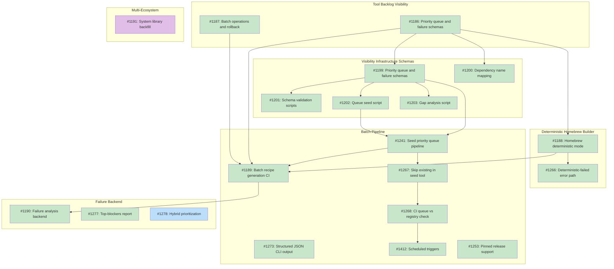

# DESIGN: Registry Scale Strategy

## Status

Planned

## Implementation Issues

| Issue | Dependencies | Tier |
|-------|--------------|------|
| ~~[M50: Tool Backlog Visibility](https://github.com/tsukumogami/tsuku/milestone/50)~~ | ~~None~~ | |
| ~~_Design schemas and operational procedures needed before batch generation can safely operate._~~ | | |
| ~~[#1186: design priority queue and failure record schemas](https://github.com/tsukumogami/tsuku/issues/1186)~~ | ~~None~~ | ~~testable~~ |
| ~~_Package entity schema, scoring algorithm, and static file formats for the priority queue and failure records._~~ | | |
| ~~[#1187: design batch operations and rollback procedures](https://github.com/tsukumogami/tsuku/issues/1187)~~ | ~~None~~ | ~~testable~~ |
| ~~_Rollback scripts, emergency stop procedures, and runbooks for batch auto-merge operations._~~ | | |
| ~~[M57: Visibility Infrastructure Schemas](https://github.com/tsukumogami/tsuku/milestone/57)~~ | ~~[M50](https://github.com/tsukumogami/tsuku/milestone/50)~~ | |
| ~~_Implements the schemas and scripts designed in M50._~~ | | |
| ~~[#1199: feat(data): add priority queue and failure record schemas](https://github.com/tsukumogami/tsuku/issues/1199)~~ | ~~[#1186](https://github.com/tsukumogami/tsuku/issues/1186)~~ | ~~testable~~ |
| ~~_JSON schema files defining structure for priority queue and failure records._~~ | | |
| ~~[#1200: feat(data): add dependency name mapping structure](https://github.com/tsukumogami/tsuku/issues/1200)~~ | ~~[#1186](https://github.com/tsukumogami/tsuku/issues/1186)~~ | ~~simple~~ |
| ~~_`data/dep-mapping.json` translating ecosystem-specific dependency names (e.g., Homebrew formula names) to tsuku recipe names._~~ | | |
| ~~[#1201: feat(scripts): add schema validation scripts](https://github.com/tsukumogami/tsuku/issues/1201)~~ | ~~[#1199](https://github.com/tsukumogami/tsuku/issues/1199)~~ | ~~testable~~ |
| ~~_Validation scripts verifying priority queue and failure record files conform to their JSON schemas._~~ | | |
| ~~[#1202: feat(scripts): add queue seed script for Homebrew](https://github.com/tsukumogami/tsuku/issues/1202)~~ | ~~[#1199](https://github.com/tsukumogami/tsuku/issues/1199)~~ | ~~testable~~ |
| ~~_Seed script populating the priority queue with Homebrew formulas, assigning tiers based on download counts._~~ | | |
| ~~[#1203: feat(scripts): add gap analysis script](https://github.com/tsukumogami/tsuku/issues/1203)~~ | ~~[#1199](https://github.com/tsukumogami/tsuku/issues/1199)~~ | ~~testable~~ |
| ~~_Gap analysis script querying failure data to identify which packages are blocked by specific missing dependencies._~~ | | |
| ~~[M55: Batch Operations Control Plane](https://github.com/tsukumogami/tsuku/milestone/55)~~ | ~~[M50](https://github.com/tsukumogami/tsuku/milestone/50)~~ | |
| ~~_Implements [#1187](https://github.com/tsukumogami/tsuku/issues/1187). See [DESIGN-batch-operations.md](current/DESIGN-batch-operations.md) for issues._~~ | | |
| ~~[M56: Batch Operations Observability](https://github.com/tsukumogami/tsuku/milestone/56)~~ | ~~[M55](https://github.com/tsukumogami/tsuku/milestone/55)~~ | |
| ~~_Implements [#1187](https://github.com/tsukumogami/tsuku/issues/1187). See [DESIGN-batch-operations.md](current/DESIGN-batch-operations.md) for issues._~~ | | |
| ~~[M51: Deterministic Homebrew Builder](https://github.com/tsukumogami/tsuku/milestone/51)~~ | ~~[M50](https://github.com/tsukumogami/tsuku/milestone/50)~~ | |
| ~~_Refactor the Homebrew builder to defer LLM initialization, enabling deterministic-only recipe generation._~~ | | |
| ~~[#1188: design homebrew deterministic mode](https://github.com/tsukumogami/tsuku/issues/1188)~~ | ~~[#1186](https://github.com/tsukumogami/tsuku/issues/1186)~~ | ~~testable~~ |
| ~~_Design the builder refactor so deterministic-only generation works without an LLM API key._~~ | | |
| ~~[#1266: structured deterministic-failed error path](https://github.com/tsukumogami/tsuku/issues/1266)~~ | ~~[#1188](https://github.com/tsukumogami/tsuku/issues/1188)~~ | ~~testable~~ |
| ~~_Produce a structured `DeterministicFailedError` instead of crashing when bottle inspection succeeds but no LLM keys are present._~~ | | |
| ~~[M52: Batch Pipeline](https://github.com/tsukumogami/tsuku/milestone/52)~~ | ~~[M51](https://github.com/tsukumogami/tsuku/milestone/51)~~, ~~[M57](https://github.com/tsukumogami/tsuku/milestone/57)~~ | |
| ~~_Hourly CI pipeline for batch generation. See [DESIGN-batch-recipe-generation.md](DESIGN-batch-recipe-generation.md) for additional issues._~~ | | |
| ~~[#1241: seed priority queue pipeline](https://github.com/tsukumogami/tsuku/issues/1241)~~ | ~~[#1199](https://github.com/tsukumogami/tsuku/issues/1199)~~, ~~[#1202](https://github.com/tsukumogami/tsuku/issues/1202)~~ | ~~testable~~ |
| ~~_CI workflow populating `data/priority-queue.json` from ecosystem registry APIs._~~ | | |
| ~~[#1189: design batch recipe generation CI pipeline](https://github.com/tsukumogami/tsuku/issues/1189)~~ | ~~[#1186](https://github.com/tsukumogami/tsuku/issues/1186)~~, ~~[#1187](https://github.com/tsukumogami/tsuku/issues/1187)~~, ~~[#1188](https://github.com/tsukumogami/tsuku/issues/1188)~~, ~~[#1241](https://github.com/tsukumogami/tsuku/issues/1241)~~ | ~~testable~~ |
| ~~_Design the CI pipeline including validation gates, SLIs, and circuit breaker._~~ | | |
| ~~[#1267: skip existing recipes in seed tool](https://github.com/tsukumogami/tsuku/issues/1267)~~ | ~~[#1241](https://github.com/tsukumogami/tsuku/issues/1241)~~ | ~~simple~~ |
| ~~_Skip packages that already have recipes when populating the priority queue._~~ | | |
| ~~[#1268: CI validation of queue against registry](https://github.com/tsukumogami/tsuku/issues/1268)~~ | ~~[#1267](https://github.com/tsukumogami/tsuku/issues/1267)~~ | ~~testable~~ |
| ~~_CI check preventing queue entries that duplicate existing recipes._~~ | | |
| ~~[#1273: structured JSON output for CLI + batch integration](https://github.com/tsukumogami/tsuku/issues/1273)~~ | ~~None~~ | ~~testable~~ |
| ~~_Structured JSON output for CLI commands, adopted across batch orchestrator, CI workflows, and test infrastructure._~~ | | |
| ~~[#1412: scheduled triggers for queue seeding and batch generation](https://github.com/tsukumogami/tsuku/issues/1412)~~ | ~~[#1268](https://github.com/tsukumogami/tsuku/issues/1268)~~ | ~~testable~~ |
| ~~_Automated cron triggers replacing manual `workflow_dispatch` for queue seeding and batch generation._~~ | | |
| ~~[#1253: pinned release support](https://github.com/tsukumogami/tsuku/issues/1253)~~ | ~~None~~ | ~~testable~~ |
| ~~_Install a pinned tsuku release in batch-generate via `install.sh`, with fallback to building from source._~~ | | |
| [M53: Failure Backend](https://github.com/tsukumogami/tsuku/milestone/53) | [M52](https://github.com/tsukumogami/tsuku/milestone/52) | |
| _Gap analysis and prioritization tooling. File-based JSONL in `data/failures/` is the chosen approach; D1 migration was dropped._ | | |
| ~~[#1190: design failure analysis backend](https://github.com/tsukumogami/tsuku/issues/1190)~~ | ~~[#1189](https://github.com/tsukumogami/tsuku/issues/1189)~~ | ~~testable~~ |
| ~~_Closed as not planned. File-based JSONL approach is sufficient; D1 migration not justified at current scale._~~ | | |
| ~~[#1277: top-blockers report for gap analysis](https://github.com/tsukumogami/tsuku/issues/1277)~~ | ~~None~~ | ~~simple~~ |
| ~~_Closed. Functionality shipped via pipeline dashboard (`website/pipeline/`) with transitive blocker computation in `internal/dashboard/`._~~ | | |
| [#1278: re-order queue entries within tiers by blocking impact](https://github.com/tsukumogami/tsuku/issues/1278) | None | testable |
| _Use existing transitive blocker computation to re-order entries within priority tiers, so high-impact packages are generated first._ | | |
| [M54: Multi-Ecosystem](https://github.com/tsukumogami/tsuku/milestone/54) | [M53](https://github.com/tsukumogami/tsuku/milestone/53) | |
| _All deterministic builders integrated and running. System library backfill remains._ | | |
| [#1191: design system library backfill strategy](https://github.com/tsukumogami/tsuku/issues/1191) | None | simple |
| _Strategy for adding common system library recipes (libpng, sqlite, curl, etc.) to unblock dependent tools. No longer blocked on #1190._ | | |

### Dependency Graph



**Legend**: Green = done, Blue = ready, Yellow = blocked, Purple = needs-design

## Implementation Progress

This section summarizes what shipped, what diverged from the original design, and what remains. Added during the Feb 2026 revision when the registry reached 329 recipes.

### What Shipped

| Phase | Status | Milestone | Summary |
|-------|--------|-----------|---------|
| 0 (Visibility) | COMPLETE | M50, M57 closed | Schemas, scripts, priority queue seeded |
| 1a (Homebrew Deterministic) | COMPLETE | M51 closed | `DeterministicFailedError`, lazy LLM init, deterministic-only mode |
| 1b (Batch Pipeline) | COMPLETE | M52 closed | Hourly pipeline, orchestrator, circuit breaker, SLI metrics, auto-merge |
| 2 (Failure Backend + macOS) | PARTIAL | M53 open (2 issues) | macOS running, dashboard built; D1 migration dropped, file-based approach kept |
| 3 (Multi-Ecosystem) | COMPLETE | M54 (builders done) | Cargo, NPM, PyPI, RubyGems, Go, CPAN, Cask all integrated |
| 4 (Automation) | PARTIAL | No milestone | Auto-merge done, checksum drift monitoring; re-queue script broken |
| 5 (Platform Matrix) | MOSTLY DONE | No milestone | 11-environment matrix (exceeds 5-env plan), dashboard, state reconciliation |

### What Diverged from the Original Design

1. **Failure backend stayed file-based.** The design called for Cloudflare Worker + D1. In practice, JSONL files in `data/failures/` with a dashboard at `website/pipeline/` have handled analysis needs. The D1 migration (#1190) is an open question, not a certainty.

2. **Circuit breaker uses consecutive failures, not rate.** The design specified rate-based thresholds. Implementation uses 5 consecutive failures as the trip signal, stored in `batch-control.json`. Simpler, and it works.

3. **11 environments instead of 5.** The validation matrix grew to 5 Linux x86_64 distros + 4 Linux arm64 + 2 macOS. This catches distro-specific glibc differences and was worth the CI cost.

4. **Auto-merge arrived early.** Originally Phase 4, auto-merge was built in Phase 1b and gated on validation pass plus `run_command` absence.

5. **Source builds removed.** The design mentioned source builds as a fallback. Source builds are no longer supported in the pipeline.

6. **Purpose-built CLI tools.** The design assumed the existing `tsuku create` CLI would be wrapped. Instead, several dedicated tools were built: `cmd/batch-generate/`, `cmd/seed-queue/`, `cmd/queue-analytics/`, `cmd/bootstrap-queue/`.

7. **Disambiguation system.** Not in the original design. A full disambiguation system with audit trail was built to handle package name collisions across ecosystems.

8. **Discovery system.** Not in the original design. A system for finding new tools to add to the queue was built.

9. **Dep mapping.** `data/dep-mapping.json` provides Homebrew dependency name resolution, beyond the original "blocked_by" tracking.

### What Remains

See the Remaining Work section at the end of this document for the full list. Key items:
- 2 open issues across 2 milestones
- Script format mismatches (gap-analysis.sh, requeue-unblocked.sh)
- Schema file vs live format divergence
- System library backfill strategy (#1191)
- DESIGN-system-lib-backfill.md never created (#1191)

## Context and Problem Statement

Tsuku's registry has grown from 155 recipes to 329, driven by an automated batch pipeline that runs hourly. The pipeline covers all major deterministic ecosystems: Homebrew (143 recipes, 43.5%), GitHub releases (97, 29.5%), NPM (52, 15.8%), plus Go, PyPI, Cargo, Gem, Nix, and CPAN. An 11-environment validation matrix (5 Linux x86_64 distros, 4 Linux arm64, 2 macOS) tests every generated recipe before merge.

The initial question of "how to build the pipeline" has been answered. What remains:

1. **Quality gaps in tooling**: Several scripts have format mismatches with the live data. `gap-analysis.sh` reads `*.json` but failures are now `*.jsonl`. `requeue-unblocked.sh` reads the old `priority-queue-$ECOSYSTEM.json` format instead of the unified `priority-queue.json`. JSON schema files describe the old seed format (`packages[]`) but the live queue uses `entries[]`.

2. **System dependencies are still incomplete**: About 50 recipes (15% exclusion rate) can't be generated because they need system libraries tsuku doesn't provide. Adding ~20 core libraries would unblock hundreds of Homebrew formulas.

3. **Failure analysis needs attention**: The failure backend stayed file-based (JSONL in `data/failures/`) rather than migrating to a database. This works for current scale but limits querying and automated re-queue. The design for the failure analysis backend (#1190) was never created.

4. **Pipeline operations debt**: The batch-operations workflow process job is a stub. The circuit breaker uses consecutive failure counting (5 failures) rather than the rate-based approach in the original design. These work but diverge from spec.

### Why Now

The batch pipeline is operational and generating recipes at steady pace. The registry has doubled in size since this design was written. Addressing the remaining gaps will improve pipeline reliability and unblock the next wave of recipes.

### Success Criteria

**User-centric metrics (primary):**
- **Install success rate**: >95% of user install attempts for tools in the registry succeed on the user's platform
- **Coverage of requests**: >80% of user-requested tools (via telemetry/issues) available within 30 days
- **Discovery success**: Users can find and install 8 of 10 tools they commonly use
- **Platform coverage**: >90% of recipes work on linux-glibc and darwin; musl coverage is best-effort

**Infrastructure metrics (secondary):**
- **Short term**: 500 validated recipes covering the most-requested developer tools (329 achieved, 66% of target)
- **Medium term**: 2,000+ recipes across all major ecosystems (Homebrew, crates.io, npm, PyPI)
- **Quality bar**: <1% installation failure rate for validated recipes

**Note**: Recipe count is a proxy metric. The real goal is that users can install the tools they need.

### Scope

**In scope:**
- Automated batch generation of recipes from known sources (operational)
- Prioritization criteria for which recipes to generate first (operational)
- System dependency backfill strategy (not yet started)
- Quality assurance for generated recipes (operational, 11-environment matrix)
- Support for popular Homebrew taps (hashicorp, mongodb, etc.)
- Closing tooling debt (script format mismatches, schema drift)

**Out of scope:**
- User-submitted recipes (community contributions)
- Recipe versioning and upgrade workflows
- Storage and distribution infrastructure (covered by registry separation design)

## Decision Drivers

- **Deterministic generation preferred**: Ecosystem builders (crates.io, npm, pypi, rubygems) are zero-cost and scale linearly; LLM-based generation costs ~$0.10/recipe
- **Quality over quantity**: Broken recipes damage user trust; every generated recipe must be tested
- **Bottle availability**: Homebrew bottle inspection is estimated at ~85-90% deterministic; remaining formulas need LLM analysis. **Note: This estimate requires validation with actual data before relying on it for capacity planning.**
- **System dependencies**: Many tools need libraries; adding deps unlocks entire categories of recipes
- **Popular tools first**: Users need common tools (terraform, kubectl, ripgrep) before obscure ones
- **Tap support matters**: Vendor taps (hashicorp/tap, mongodb/brew) contain actively-maintained formulas
- **Platform diversity**: Recipes must work across target environments (linux-glibc, linux-musl, darwin); partial coverage is acceptable with graceful degradation

## External Research

### Current Builder State

Analysis of existing tsuku builders reveals which are ready for scale and which have gaps:

| Builder | Status | Deterministic | Ready for Scale | Gap |
|---------|--------|---------------|-----------------|-----|
| Cargo (crates.io) | Active | Yes | Yes | None |
| NPM | Active | Yes | Yes | None |
| PyPI | Active | Yes | Yes | None |
| RubyGems | Active | Yes | Yes | None |
| Go (proxy.golang.org) | Active | Yes | Yes | None |
| CPAN (metacpan.org) | Active | Yes | Yes | None |
| Homebrew | Active | Hybrid (85-90% deterministic) | Partial | LLM fallback for ~10-15% |
| Homebrew Cask | Active | Yes | Yes | None |
| GitHub Release | Active | **No (LLM-only)** | **No** | Major: no deterministic path |

**Key findings:**
- 8 builders are fully deterministic and integrated in the batch pipeline
- Homebrew is 85-90% deterministic via bottle inspection; LLM fallback handles edge cases interactively
- **GitHub Release builder is LLM-only** but accounts for 97 recipes (29.5% of registry), suggesting manual creation at scale is viable for this ecosystem

### Builder Gaps Requiring Tactical Work

1. **GitHub Release Deterministic Path**: The GitHub Release builder currently requires LLM for every generation (~$0.10/recipe). A deterministic path analyzing release asset naming patterns could handle many common cases (tools that follow `{name}-{version}-{os}-{arch}.tar.gz` conventions).

2. **Homebrew Deterministic Success Rate**: Current 85-90% success rate means 10-15% of formulas still need LLM. Improving bottle inspection heuristics could reduce LLM dependency.

### Ecosystem Scale Analysis

| Source | Total Available | CLI-Relevant | Generation Method | Cost/Recipe |
|--------|----------------|--------------|-------------------|-------------|
| Homebrew formulas | 8,170 | ~3,000 | Bottle inspection or LLM | $0-0.10 |
| Homebrew casks | 7,526 | All (macOS apps) | Deterministic API | $0 |
| Homebrew taps | 1,000+ | 500+ | Same as formulas | $0-0.10 |
| Crates.io | 210,000+ | ~10,000 CLI crates | Deterministic API | $0 |
| npm | 11M+ | ~100K CLI tools | Deterministic API | $0 |
| PyPI | 500K+ | ~50K CLI tools | Deterministic API | $0 |
| RubyGems | 180K+ | ~20K CLI tools | Deterministic API | $0 |

### Popular Vendor Taps

Taps with stable, vendor-maintained formulas:

| Tap | Formulas | Notable Tools |
|-----|----------|---------------|
| hashicorp/tap | 20+ | terraform, vault, consul, nomad, packer |
| mongodb/brew | 10+ | mongodb-community, mongosh |
| aws/tap | 5+ | aws-sam-cli, copilot-cli |
| azure/functions | 3+ | azure-functions-core-tools |
| goreleaser/tap | 2+ | goreleaser |
| buildpacks/tap | 2+ | pack |

These taps follow standard formula structure and work with tsuku's Homebrew builder.

### System Dependency Analysis

Current embedded libraries: 17 (go, rust, nodejs, python, ruby, perl, zig, gcc-libs, openssl, zlib, etc.)

Frequently-required system deps not yet available:
- **Compression**: bzip2, xz, lz4, zstd
- **Graphics**: libpng, libjpeg, freetype, fontconfig
- **Data**: sqlite, libxml2, libxslt
- **Network**: curl, libssh2, nghttp2
- **Crypto**: libsodium, gnutls

Adding ~20 core libraries would unblock hundreds of Homebrew formulas.

## Considered Options

### Decision 1: Generation Strategy

How should we generate recipes at scale?

#### Option 1A: Manual Batch Generation

Run `tsuku create` for prioritized lists of packages, reviewing output manually.

**Pros:**
- Human review catches edge cases
- No new tooling required
- Can start immediately

**Cons:**
- Doesn't scale beyond hundreds
- Developer time is the bottleneck
- Inconsistent quality depends on reviewer attention

#### Option 1B: CI Pipeline with Validation Gates

Automated pipeline that generates recipes, validates them, and creates PRs for review.

**Pros:**
- Scales to thousands of recipes
- Consistent validation criteria
- Parallel generation across ecosystems

**Cons:**
- Significant tooling investment
- Need to handle flaky validation
- LLM costs accumulate at scale

#### Option 1C: Hybrid: Deterministic Auto-Merge, LLM Human Review

Auto-merge deterministic recipes (crates.io, npm, pypi) after validation passes; require human review for LLM-generated recipes.

**Pros:**
- Balances scale with quality
- Focuses human attention where needed
- Zero-cost scaling for ecosystems

**Cons:**
- Two different code paths
- Need clear criteria for "deterministic"
- Deterministic recipes may still select wrong executables or miss platform-specific issues

#### Option 1D: Event-Driven Generation

Generate recipes on-demand when users request missing tools via `tsuku install <unknown-tool>`.

**Pros:**
- Only generates what users actually need
- No upfront cost for unused recipes
- Builds library organically from real demand

**Cons:**
- First user pays the wait cost (LLM generation takes seconds)
- No curated experience for new users
- Harder to market ("we have N recipes" vs "we can generate any recipe")

### Decision 2: Prioritization Strategy

Which recipes should we generate first?

#### Option 2A: Popularity-Based (Downloads/Stars)

Generate recipes for the most-downloaded or starred packages first.

**Pros:**
- Maximum user value per recipe
- Clear, objective criteria
- Data available from ecosystem APIs

**Cons:**
- Popular tools may be complex (more deps)
- Metrics favor established tools over rising ones
- Some popular tools already have recipes

#### Option 2B: Dependency-Driven

Generate dependency libraries first, then tools that need them.

**Pros:**
- Unblocks entire categories at once
- Topological ordering ensures deps exist
- Reduces failed installations

**Cons:**
- Users don't directly benefit from libs
- Slower initial visible progress
- Dependency extraction infrastructure is incomplete (see #644)

#### Option 2C: Ecosystem Sweep

Complete coverage of one ecosystem before moving to next.

**Pros:**
- Clear progress metric
- Simplifies tooling (one builder at a time)
- Ecosystem-specific issues addressed together

**Cons:**
- Delays high-value tools in other ecosystems
- Some ecosystems have diminishing returns
- Ignores cross-ecosystem popularity

### Decision 3: System Dependency Handling

How do we handle recipes that need system libraries?

#### Option 3A: Library Recipes First

Create tsuku recipes for common system libraries before generating dependent tools.

**Pros:**
- Full tsuku control over libraries
- Works on any platform
- No system package manager needed

**Cons:**
- Significant work to create lib recipes
- Some libs are complex to build
- Duplicates distro work

#### Option 3B: Skip Tools Requiring System Dependencies

Don't generate recipes for tools that require system libraries tsuku doesn't provide. Focus on self-contained tools first.

**Pros:**
- No dependency complexity
- Faster initial coverage of ecosystem
- All recipes work on all platforms

**Cons:**
- Excludes many popular tools (e.g., imagemagick, ffmpeg)
- May frustrate users expecting comprehensive coverage
- Delays value for users who need those tools

#### Option 3C: Hybrid: Prefer Tsuku, Fallback to System

Try tsuku-provided libs first; fall back to system packages if unavailable.

**Pros:**
- Graceful degradation
- Works today with existing deps
- Gradual migration path

**Cons:**
- Complex resolution logic
- Behavior varies by platform
- Hard to test all paths

### Uncertainties

- **LLM reliability at scale**: Will Claude/Gemini maintain quality for 1000+ sequential generations?
- **Bottle inspection coverage**: ~85-90% of formulas have usable bottle metadata; the rest need LLM fallback
- **Library complexity**: Some libs (fontconfig, mesa) may be too complex for tsuku
- **User demand signal**: Which tools do users actually want vs which are "popular"?
- **API rate limits**: Ecosystem APIs (crates.io, npm) have rate limits that may throttle batch generation
- **Version drift**: Recipes generated today may break as upstream tools update

## Decision Outcome

**Chosen: Deterministic-Only Pipeline + 2A (Popularity-Based) + 3B (Skip System Deps Initially)**

### Summary

Adopt a fully deterministic batch generation pipeline. All failures are recorded with structured data for analysis. LLM builders remain a user-facing feature for manual recipe creation, not part of automation. Prioritize by popularity to maximize user value per recipe. Initially skip tools requiring system libraries tsuku doesn't provide, building out library recipes as a separate workstream.

### Rationale

**Generation Strategy (Deterministic-Only)**: The automated pipeline uses only deterministic builders. When a tool can't be generated deterministically, it's recorded as a failure with structured metadata. This produces:
- Predictable costs ($0 for the pipeline itself)
- Consistent, analyzable results
- Clear signal about which capabilities to build next

LLM builders (GitHub Release, Homebrew fallback) remain available for users running `tsuku create` interactively, but are excluded from batch automation.

**Prioritization (2A)**: Popularity-based ordering aligns with "popular tools first" and "quality over quantity" drivers. Users get terraform, kubectl, and ripgrep before obscure tools. Popularity data is readily available from ecosystem APIs without building complex dependency analysis infrastructure.

**System Dependencies (3B)**: Skipping tools requiring missing system libs initially is pragmatic. It avoids the complexity of Option 3C while not blocking progress. The library backfill becomes a parallel workstream that gradually expands coverage. This aligns with "quality over quantity" since recipes that install will work reliably.

### Alternatives Rejected

- **1A (Manual)**: Doesn't scale to thousands; developer time is finite
- **1B (Full CI with LLM)**: LLM costs are unpredictable at scale; failures become expensive instead of informative
- **1C (Hybrid with LLM fallback)**: Mixing LLM into automation obscures capability gaps; we want failures to be data, not fallback triggers
- **1D (Event-Driven)**: Delays curated experience; harder to market
- **2B (Dependency-Driven)**: Requires dependency infrastructure that doesn't exist (#644)
- **2C (Ecosystem Sweep)**: Ignores cross-ecosystem popularity; delays high-value tools
- **3A (Library First)**: Blocks recipe generation on library work; slows initial progress
- **3C (Hybrid Fallback)**: Complex resolution logic; inconsistent user experience

### Trade-offs Accepted

By choosing this approach, we accept:
- **Lower initial coverage**: Tools that fail deterministic generation won't be in the registry automatically
- **Manual work for complex tools**: GitHub releases, complex Homebrew formulas require manual `tsuku create`
- **Popularity bias**: Rising tools may be underrepresented vs established ones

These are acceptable because:
- Failures produce actionable data (capability gap reports) instead of LLM costs
- Manual creation with LLM remains available as a user feature
- The pipeline becomes a forcing function to improve deterministic builders
- Popularity metrics can be augmented with user requests over time

## Solution Architecture

### Overview

The registry scale strategy is a **fully deterministic pipeline** that generates recipes and records failures for analysis. LLM builders are excluded from automation.

**Automated pipeline workstreams:**

1. **Ecosystem Recipe Generation**: Deterministic builders (Cargo, NPM, PyPI, RubyGems, Go, CPAN, Cask) auto-generate and validate recipes, merging automatically on success
2. **Homebrew Recipe Generation**: Bottle inspection only (deterministic path). Formulas that fail bottle inspection are recorded as failures, not sent to LLM
3. **Failure Collection**: All failures recorded with structured metadata for gap analysis
4. **Library Backfill**: Separate workstream adding tsuku recipes for common system libraries

**Not part of automation:**
- GitHub Release builder (LLM-only) - users can run `tsuku create --from github:org/repo` manually
- Homebrew LLM fallback - users can run `tsuku create --from homebrew:formula` manually for complex formulas

### Target Environments

Validation runs across an 11-environment matrix, exceeding the original 5-environment plan. Recipes can have **partial platform coverage** - a recipe that works on some environments is still valuable and merges with appropriate platform constraints.

**Original plan (5 environments):**

| Environment | Runner | Priority | Notes |
|-------------|--------|----------|-------|
| `linux-glibc-x86_64` | ubuntu-latest | High | Primary Linux target |
| `linux-glibc-arm64` | ubuntu-24.04-arm | Medium | Growing ARM server adoption |
| `darwin-x86_64` | macos-13 | High | Intel Macs (legacy but common) |
| `darwin-arm64` | macos-14 | High | Apple Silicon (primary Mac target) |
| `linux-musl-x86_64` | alpine container | Low | Alpine/container use cases |

**Actual implementation (11 environments):** The pipeline now validates across 5 Linux x86_64 distros, 4 Linux arm64 distros, and 2 macOS environments. This broader matrix catches distro-specific issues (glibc version differences, package manager behavior) that the original 5-environment plan would have missed.

**Platform-specific considerations:**

- **Homebrew bottles**: Only available for glibc Linux and macOS. Musl users need alternative sources. (Note: source builds are no longer supported in the pipeline.)
- **Ecosystem builders**: Cargo/Go binaries built on the runner match the runner's libc. Musl requires explicit cross-compilation.
- **macOS costs**: 10x Linux CI minutes. May sample or defer to nightly for cost control.

**Graceful degradation principle:** A recipe is useful even with partial coverage. If ripgrep works on 4 environments but fails on linux-musl, the recipe merges with platform constraints (e.g., `supported_libc = ["glibc"]`). Users on musl see "not available for your platform" instead of a broken install.

**Contributor backfill path:** When a recipe doesn't support an environment, contributors can:
1. Add an alternative source that works (e.g., `--from cargo:ripgrep` might build a musl-compatible binary)
2. Add platform-specific download URLs if upstream provides musl binaries
3. Add platform-specific download URLs if upstream provides alternative binaries

This allows the automated pipeline to handle the common cases while community contributions fill gaps for niche environments.

### Components

```
┌──────────────────────────────────────────────────────────────────────────┐
│                   Automated CI Pipeline (Deterministic Only)              │
├──────────────────────────────────────────────────────────────────────────┤
│                                                                           │
│  ┌────────────────────────────────────┐  ┌─────────────────────────────┐ │
│  │       Deterministic Builders        │  │     Homebrew (bottle only)  │ │
│  │                                     │  │                             │ │
│  │  - Cargo ✓    - Go ✓               │  │  Bottle inspection only     │ │
│  │  - NPM ✓      - CPAN ✓             │  │  (~85-90% of formulas)      │ │
│  │  - PyPI ✓     - Cask ✓             │  │                             │ │
│  │  - RubyGems ✓                      │  │  Failures → analysis        │ │
│  └──────────────┬─────────────────────┘  └──────────────┬──────────────┘ │
│                 │                                       │                 │
│                 ▼                                       ▼                 │
│  ┌───────────────────────────────────────────────────────────────┐       │
│  │                    Validation Gates (per environment)          │       │
│  │  - Recipe schema validation                                    │       │
│  │  - Sandbox install test (on each target environment)           │       │
│  │  - Binary execution check (on each target environment)         │       │
│  │  - Aggregate results → derive supported platforms              │       │
│  └───────────────────────────────────────────────────────────────┘       │
│                 │                                       │                 │
│          ┌──────┴──────┐                         ┌──────┴──────┐         │
│          ▼             ▼                         ▼             ▼         │
│    ┌──────────┐  ┌──────────┐              ┌──────────┐  ┌──────────┐    │
│    │ Success  │  │ Failure  │              │ Success  │  │ Failure  │    │
│    │ → Merge  │  │ → Record │              │ → Merge  │  │ → Record │    │
│    └──────────┘  └──────────┘              └──────────┘  └──────────┘    │
│                       │                                       │          │
│                       └───────────────┬───────────────────────┘          │
│                                       ▼                                  │
│                          ┌─────────────────────┐                         │
│                          │   Failure Analysis  │                         │
│                          │   (backend service) │                         │
│                          └─────────────────────┘                         │
└──────────────────────────────────────────────────────────────────────────┘

┌──────────────────────────────────────────────────────────────────────────┐
│                    Manual/Interactive (User Feature)                      │
├──────────────────────────────────────────────────────────────────────────┤
│  Users can run these manually to create recipes for tools that failed:   │
│                                                                           │
│  - tsuku create --from github:org/repo     (LLM-based)                   │
│  - tsuku create --from homebrew:formula    (LLM fallback for failures)   │
└──────────────────────────────────────────────────────────────────────────┘
```

### Priority Queue

The pipeline maintains a priority queue of packages to generate, ordered by:

1. **Popularity score**: Downloads/stars normalized across ecosystems
2. **Dependency availability**: Penalize tools requiring unavailable system libs
3. **Request count**: User requests via telemetry or issues

**User request mechanism**: When `tsuku install <tool>` fails because no recipe exists, the CLI should:
1. Record the request to telemetry (if opt-in enabled)
2. Provide user guidance: "Tool not found. You can create a recipe with `tsuku create --from <source>` or request it via GitHub issues."
3. Show alternatives if similar-named recipes exist

This creates a feedback loop where actual user demand informs prioritization, avoiding the cold-start problem of popularity-only ordering.

### Failure Analysis System

The batch pipeline runs in **deterministic-only mode** (no LLM fallback). Failures are valuable data that reveal capability gaps.

**Design principles:**
- Failures are a forcing function, not errors to suppress
- Collect structured data for systematic analysis
- Prioritize capabilities by "popularity-weighted impact" (what capability would unblock the most popular tools?)
- **Track failures per environment, not per recipe** - a recipe may succeed on some platforms and fail on others

**Failure categories mapped to capabilities:**

| Category | Capability Needed | Example |
|----------|-------------------|---------|
| `no_bottles` | Homebrew source fallback | formulas without bottles |
| `build_from_source` | ~~Source build action~~ No longer supported | tools requiring compilation (excluded from pipeline) |
| `no_platform_assets` | Platform matrix expansion | tools missing Linux/macOS builds |
| `missing_dependency` | System library recipes | tools needing libpng, sqlite |
| `binary_not_found` | Improved executable discovery | non-standard binary locations |
| `complex_archive` | Advanced archive inspection | nested or unusual structures |

**Storage:** The original design called for backend storage (R2, D1, or similar). In practice, failure records are stored as file-based JSONL in `data/failures/`, which has been sufficient for current scale. SLI metrics live in `data/metrics/`. A full HTML dashboard at `website/pipeline/` provides operator visibility. The open question is whether the file-based approach needs to migrate to D1 as recipe count grows (see Remaining Work).

**No API key = deterministic-only:** Running `tsuku create` without LLM API keys (ANTHROPIC_API_KEY, GOOGLE_API_KEY) naturally produces deterministic-only behavior for ecosystem builders. The Homebrew builder requires refactoring to support this pattern - currently it fails early if no LLM is available, even when deterministic bottle inspection would succeed. After refactoring, Homebrew should attempt deterministic generation first and only fail if both deterministic fails AND no LLM is available.

### Per-Environment Validation Results

Validation produces a result matrix, not a single pass/fail. Each (package, environment) pair has its own outcome.

**Validation result structure:**
```jsonl
{"package": "ripgrep", "source": "cargo", "popularity": 9500, "timestamp": "2026-01-27T10:00:00Z", "results": {
  "linux-glibc-x86_64": {"status": "pass"},
  "linux-glibc-arm64": {"status": "pass"},
  "darwin-x86_64": {"status": "pass"},
  "darwin-arm64": {"status": "pass"},
  "linux-musl-x86_64": {"status": "fail", "category": "binary_incompatible", "reason": "requires glibc"}
}}
```

**Recipe output:** When a recipe passes on at least one environment, it merges with platform constraints derived from the validation results using existing metadata fields:
```toml
[metadata]
# Example: musl failed, everything else passed
supported_libc = ["glibc"]

# Example: arm64 failed on all OS
supported_arch = ["amd64"]

# Example: one specific combo failed
unsupported_platforms = ["linux/arm64"]
```
If all platforms pass, no constraint fields are written (universal is the default).

**Mutation mechanism:** The merge job is the single aggregation point for platform results. Platform validation jobs produce result artifacts (pass/fail per recipe per platform) but never modify recipe files. After all platform jobs complete, the merge job collects the full result matrix, then derives constraints from the set of passing platforms — not from individual failures. This avoids conflicting writes (e.g., arm64 failure writing `supported_arch = ["amd64"]` while x86_64 failure writes `supported_arch = ["arm64"]`).

**Merge threshold:** A recipe is mergeable if it passes on at least one platform. Partial coverage is acceptable — a constrained recipe is more useful than no recipe. Users on unsupported platforms see "not available for your platform" instead of a broken install.

The merge job writes platform constraints into the recipe TOML using the existing metadata fields (`supported_os`, `supported_arch`, `supported_libc`, `unsupported_platforms`). The logic lives in `internal/batch/` and uses the existing `WriteRecipe` infrastructure. If all 5 target platforms pass, no constraint fields are written (universal compatibility is the default). When some platforms fail, the merge job computes the minimal set of constraint fields that express the passing platforms — for example, if only musl failed: `supported_libc = ["glibc"]`; if one specific combo failed: `unsupported_platforms = ["linux/arm64"]`. No new schema field is needed. PR CI uses `tsuku info --json` to read the computed `supported_platforms` and skip runners where the recipe isn't supported.

**Retry policy:** Platform validation jobs retry only on transient failures, identified by the CLI's exit code. Exit code 5 (`ExitNetwork`) indicates network errors (timeouts, rate limits, DNS, connection failures) and triggers up to 3 retries with exponential backoff. All other non-zero exit codes (install failed, verify failed, dependency failed, recipe not found) are structural and fail immediately without retry. The CLI's error classification system (`internal/version/errors.go`, `internal/registry/errors.go`) handles the distinction — the batch pipeline only checks the exit code.

**Failure tracking:** Failures are recorded per environment, enabling:
- "Which environments fail most often for Homebrew recipes?" (answer: musl)
- "What capability would unlock linux-arm64 for the most packages?"
- Targeted backfill work for specific environments

### Dependency Resolution and Retry

When a package fails due to missing dependencies, the failure record must track which specific dependencies blocked it. This enables automatic retry when dependencies become available.

**Per-environment failure record:**
```jsonl
{"package": "imagemagick", "source": "homebrew", "environment": "linux-glibc-x86_64", "category": "missing_dependency", "blocked_by": ["libpng", "libjpeg"], "popularity": 8500, "timestamp": "2026-01-27T10:00:00Z"}
```

**Note:** A package may be blocked by different dependencies on different environments. The `blocked_by` field is environment-specific.

**Backend service capabilities:**
- Query packages blocked by a specific dependency
- Generate reports: which dependencies block the most popular packages
- Re-queue blocked packages when dependencies become available

**Re-queue triggers:**

| Trigger | When | Action |
|---------|------|--------|
| Manual | After adding library recipe | Operator queries blocked packages, triggers re-queue |
| Automatic | CI hook on recipe merge | Backend detects new recipe, re-queues blocked packages |

**Automatic trigger flow:**
1. New recipe merged (e.g., `libpng.toml`)
2. CI notifies backend service of new recipe
3. Backend queries failure store for packages blocked by `libpng`
4. Blocked packages added back to priority queue with original popularity scores
5. Next batch run picks them up

This creates a feedback loop: failures identify missing capabilities, capabilities are added, blocked packages automatically retry.

**Implementation note:** The original plan called for Cloudflare-based infrastructure (Worker + D1/R2) to maintain consistency with existing telemetry. In practice, the file-based approach (JSONL in `data/failures/`, scripts for analysis, HTML dashboard at `website/pipeline/`) has handled current needs. The re-queue trigger described above isn't yet operational: `requeue-unblocked.sh` exists but has a format mismatch with the unified queue file.

### Generation Flow

```
Priority Queue → Select Package → Route by Source
                                        │
              ┌─────────────────────────┴─────────────────────────┐
              ▼                                                   ▼
      Ecosystem Builder                                   Homebrew Builder
      (cargo, npm, pypi,                                  (bottle inspection
       rubygems, go, cpan, cask)                           ONLY - no LLM)
              │                                                   │
              ▼                                                   ▼
      Deterministic Recipe                                Deterministic Recipe
              │                                            OR Failure Record
              ▼                                                   │
      Validation Gates ◄──────────────────────────────────────────┘
              │
       ┌──────┴──────┐
       ▼             ▼
   Success       Failure
   → Merge       → Record ──────────────────┐
       │                                    │
       │                                    ▼
       │                          Failure Analysis
       │                          (backend service)
       │                                    │
       │              ┌─────────────────────┴─────────────────────┐
       │              ▼                                           ▼
       │     Dependency missing?                          Other failure?
       │              │                                           │
       │              ▼                                           ▼
       │     Wait for dep recipe                         Capability gap report
       │     (auto re-queue when                         (informs manual fixes)
       │      dep becomes available)
       │              │
       └──────────────┴─────► Re-queue to Priority Queue
```

**Notes:**
- GitHub Release packages are NOT in the automated queue. Users create these manually via `tsuku create --from github:org/repo`.
- When a dependency recipe is added, the backend service automatically re-queues packages that were blocked by it.

## Implementation Approach

This is a strategic design. Implementation follows a **walking skeleton** approach where each phase delivers functional end-to-end value. Phases build vertically through the stack rather than completing horizontal layers.

**Guiding principles:**
1. Build visibility/tracking infrastructure FIRST (failures are data, not waste)
2. Implement ONE ecosystem end-to-end before expanding
3. Group work by shared implementation effort, not just value out
4. Each phase delivers a functional increment
5. Validate assumptions before building on them

### Validation Spike: Homebrew Deterministic Rate (Pre-Phase 0)

**Goal**: Validate the 85-90% Homebrew deterministic success rate before building infrastructure that depends on it.

**Rationale**: The entire phasing assumes this rate is accurate. If actual rate is 60%, Phase 1 scope and backend sizing change significantly. This is 2-3 days of work that could save weeks of rework.

**Method**: Run bottle inspection against 500 Homebrew formulas (random sample). Record success/failure categories.

**Gate**: If deterministic rate <70%, revisit Phase 1 scope before proceeding.

**Deliverable**: Report documenting actual deterministic rate with failure category breakdown.

### Day 1 Batch: Quick User Value (Parallel Track)

**Goal**: Deliver user value immediately while infrastructure is being built.

**Rationale**: Users don't care about failure schemas - they care about installing tools. The top 20 most-requested tools are known. Generate these manually in parallel with Phase 0-1.

**Method**: Hand-pick 20 high-impact tools (ripgrep, jq, bat, fd, terraform, kubectl, etc.). Generate manually via `tsuku create`. Validate on Linux AND macOS (sampled). Merge via normal PR process.

**Platform**: linux-glibc-x86_64 + darwin-arm64 (sampled - top 20 only catches obvious macOS issues early)

**Deliverables**:
1. 20 high-impact recipes merged
2. Early macOS validation data (informs Phase 2 cost planning)

**Timing**: Runs in parallel with Phase 0 and Phase 1a. No dependencies on batch infrastructure.

### Phase 0: Visibility Infrastructure (No Batch Recipes) -- COMPLETE

**Status**: Delivered. Schemas in `data/schemas/`, scripts for seeding/validation/gap-analysis/rollback, priority queue seeded. M57 closed.

**Goal**: Build the tracking system before generating anything. See the scope, understand the gap.

**Rationale**: Without failure tracking, work in later phases is thrown away. A visibility system lets us understand the problem space before committing to solutions.

**Components**:
- Package entity schema with `schema_version` field (enables future migration)
- Failure record schema definition with versioning
- Recipe registry integration (know what already exists)
- Scripts to populate queue from Homebrew API (popularity data)
- Basic reports: "X packages in queue, Y already have recipes"
- Rollback scripts (tested against manually-created recipes)

**Deliverables**:
1. `data/priority-queue.json` - Static queue seeded with 100 Homebrew formulas
2. `data/failure-schema.json` - Versioned failure record schema (v1)
3. Scripts to query ecosystem APIs for popularity data
4. `scripts/rollback-recipe.sh` - Tested rollback procedure

**Exit Criteria**:
- Queue seeded with 100 packages from Homebrew API
- Rollback script tested against a manually-created test recipe
- Schema includes `schema_version: 1` field
- Report shows existing recipe overlap

**What's NOT in Phase 0**: No batch recipe generation, no CI workflows, no backend services.

### Phase 1a: Homebrew Builder Validation (Single Formula) -- COMPLETE

**Status**: Delivered. `DeterministicFailedError` in `internal/builders/errors.go`, deterministic-only mode in `homebrew.go`, LLM lazily initialized. M51 closed.

**Goal**: Validate the Homebrew builder produces correct deterministic output or structured failure before attempting batch generation.

**Rationale**: The Homebrew builder refactor is a prerequisite, not an inline deliverable. Proving it works for single formulas de-risks the batch integration.

**Components**:
- **Homebrew builder refactor** (DESIGN-homebrew-deterministic-mode.md): Defer LLM initialization, enable deterministic-only mode
- **Failure categorization**: `DeterministicFailedError` with structured category field

**Deliverables**:
1. Modified Homebrew builder with deterministic-only mode
2. Unit tests for deterministic success path
3. Unit tests for failure categorization (returns structured error, not crash)

**Exit Criteria**:
- 3 hand-picked Homebrew formulas generate deterministically OR produce categorized `DeterministicFailedError`
- No LLM API calls made during deterministic-only generation
- Failure records match schema from Phase 0

**What's NOT in Phase 1a**: No batch workflow, no CI pipeline, no queue integration.

### Phase 1b: Batch Pipeline Integration (Homebrew, Linux Only) -- COMPLETE

**Status**: Delivered. `batch-generate.yml` runs hourly, `internal/batch/orchestrator.go` manages generation, circuit breaker in `batch-control.json`, SLI metrics in `data/metrics/`, auto-merge gated on validation and `run_command` absence. M52 closed (16/16).

**Goal**: Integrate Homebrew builder with batch workflow. Generate, validate, track failures, and merge for ONE ecosystem.

**Ecosystem choice**: Homebrew (chosen to stress-test failure tracking - 10-15% failure rate produces meaningful data)

**Platform choice**: linux-glibc-x86_64 (cheapest CI, fastest feedback)

**Components**:
- **Batch generation workflow**: Manual trigger, static queue, Homebrew routing only
- **Validation gates**: Schema, plan generation, sandbox install (Linux only)
- **Failure tracking**: File-based JSONL with blocked-by extraction
- **Operational controls**: Emergency stop, recipe rollback, runbooks
- **Basic SLI collection**: Success rate, validation pass rate (JSONL-based)
- **Circuit breaker**: Auto-pause ecosystem on 5 consecutive failures (originally designed as rate-based; implemented as consecutive count in `batch-control.json`)
- **Rate limiting (RATE-1)**: Conservative defaults (1 req/sec for GitHub API)

**Divergences from plan**:
- Circuit breaker uses 5 consecutive failures, not rate-based as originally designed
- Auto-merge was implemented here (originally planned for Phase 4)
- Multiple purpose-built CLI tools were created: `cmd/batch-generate/`, `cmd/seed-queue/`, `cmd/queue-analytics/`, `cmd/bootstrap-queue/`

**Deliverables**:
1. Batch generation workflow for Homebrew + Linux
2. Failure records in `data/failures/homebrew-linux.jsonl`
3. Manual PR creation (no auto-merge yet)
4. Gap report: "X Homebrew formulas succeeded, Y failed (by category)"
5. Success rate metric tracked per batch run
6. Circuit breaker tested (manually trigger low success scenario)

**Exit Criteria**:
- 50+ Homebrew recipes merged via batch pipeline
- Success rate metric operational and matches expected 85-90%
- Circuit breaker tested (auto-pauses on simulated failure storm)
- Emergency stop tested
- Rollback tested on a batch-generated recipe

**What's NOT in Phase 1b**: No other ecosystems, no macOS, no auto-merge, no backend services.

### Phase 2: Failure Analysis Backend + macOS Platform -- PARTIALLY COMPLETE

**Status**: macOS validation is running. Full dashboard at `website/pipeline/`. The failure backend uses file-based JSONL in `data/failures/`; the Cloudflare Worker/D1 migration was dropped (#1190 closed as not planned). Top-blockers report (#1277) shipped via dashboard. M53 still open with 1 issue (#1278).

**Goal**: Move from files to backend service. Add macOS platform validation.

**Rationale**: Now that we have failure data, we need to query it efficiently. Adding macOS is minimal incremental effort once the pipeline exists.

**Planned components**:
- **Failure storage backend** (DESIGN-batch-failure-analysis.md): Cloudflare Worker + D1 -- NOT BUILT, stayed file-based
- **Query API**: Packages blocked by X, top gaps by impact -- NOT BUILT as API; dashboard provides some visibility
- **Priority queue migration**: Move from static JSON to D1 -- NOT DONE
- **Platform matrix**: Add darwin-arm64 validation -- DONE (exceeded: 11 environments vs planned 5)
- **Cost controls**: macOS budget caps, sampling strategy -- DONE
- **Observability**: SLI metrics, SLO definitions, alerting -- DONE (SLI metrics in `data/metrics/`, dashboard at `website/pipeline/`)

**Divergences from plan**:
- The D1 migration didn't happen. File-based JSONL has been sufficient for current needs.
- DESIGN-batch-failure-analysis.md was never created (issue #1190 remains open)
- Platform matrix grew to 11 environments instead of the planned 5
- A full HTML dashboard was built beyond what was specified

**Deliverables (as planned)**:
1. Cloudflare Worker + D1 for failure and queue storage
2. Query API for gap analysis
3. macOS validation with cost controls
4. Per-environment failure tracking
5. Alerting on success rate drops

**Exit Criteria**:
- D1 migration complete with rollback plan tested
- Query API returns "packages blocked by X" in <1s
- macOS budget cap validated (dry-run mode) before enabling real runs
- Alerting fires on simulated success rate drop
- 200+ recipes validated on both Linux and macOS

### Phase 3: Multi-Ecosystem Deterministic -- COMPLETE

**Status**: All deterministic builders integrated and running. Cargo, NPM, PyPI, RubyGems, Go, CPAN, and Cask are all producing recipes in the hourly pipeline.

**Goal**: Add remaining deterministic ecosystems. All use the same infrastructure.

**Components**:
- **Ecosystem builders**: Cargo, NPM, PyPI, RubyGems, Go, CPAN, Cask
- **Cross-ecosystem scoring**: Popularity normalization, data ingestion
- **Ecosystem rate limiting**: Per-ecosystem throttling (RATE-1 applied to all)
- **Ecosystem pause/resume**: Per-ecosystem operational controls

**Deliverables**:
1. All deterministic ecosystem builders integrated
2. Cross-ecosystem priority queue with popularity scoring
3. Per-ecosystem failure tracking and controls

**Note on exit criteria**: The registry has 329 recipes, not the 1000+ target. Most growth came from Homebrew (143) and GitHub releases (97) rather than the deterministic ecosystems. NPM is the strongest deterministic contributor at 52 recipes.

**Exit Criteria**:
- Each ecosystem generates at least 50 recipes
- Per-ecosystem pause/resume tested
- Rate limiting prevents API throttling (no 429 errors in logs)
- 1000+ total recipes in registry

### Phase 4: Automation & Intelligence -- PARTIALLY COMPLETE

**Status**: Auto-merge is implemented and gated on validation pass + `run_command` absence. Checksum drift monitoring exists (`checksum-drift.yaml`). Re-queue script exists but has a format mismatch (`requeue-unblocked.sh` reads old `priority-queue-$ECOSYSTEM.json` instead of unified `priority-queue.json`).

**Goal**: Auto-merge, re-queue triggers, advanced analysis.

**Components**:
- **Auto-merge** (DESIGN-batch-recipe-generation.md): For recipes passing all gates -- DONE
- **Re-queue triggers** (DESIGN-batch-failure-analysis.md): Auto re-queue when deps available -- EXISTS BUT BROKEN (format mismatch)
- **Structural vs transient classification**: Don't retry structural failures -- DONE
- **Post-merge monitoring**: Checksum drift detection -- DONE (`checksum-drift.yaml`)
- **Request-based priority**: Boost packages users are requesting -- NOT DONE

**Deliverables**:
1. Auto-merge for safe recipes (no `run_command`)
2. Automatic re-queue when dependencies merge
3. Gap analysis with dependency impact scoring
4. Post-merge security monitoring

**Exit Criteria**:
- Auto-merge enabled for deterministic recipes without `run_command`
- Re-queue trigger tested: add library recipe, verify blocked packages re-queued
- Post-merge monitoring detects simulated checksum change
- 5000+ recipes in registry

### Phase 5: Platform Matrix Completion + Operational Polish -- MOSTLY COMPLETE

**Status**: 11-environment validation matrix operational (exceeds the 5-environment plan). Dashboard at `website/pipeline/`. State reconciliation exists. Some script debt remains.

**Goal**: Complete platform coverage, operational dashboards.

**Components**:
- **Remaining platforms**: linux-glibc-arm64, darwin-x86_64, linux-musl-x86_64 -- DONE (and then some: 11 environments total)
- **Cross-job coordination**: Distributed rate limiting (RATE-2) -- DONE
- **Dashboards**: Historical trends, operator visibility -- DONE (`website/pipeline/`)
- **Advanced alerting**: Fatigue prevention, severity tuning -- PARTIALLY DONE
- **State reconciliation**: Detect/repair queue inconsistencies -- DONE

**Divergences from plan**:
- Validation matrix grew to 11 environments (5 Linux x86_64 distros + 4 Linux arm64 + 2 macOS)
- Full HTML dashboard pages were built, going beyond the original spec
- `batch-operations.yml` process job is still a stub with placeholder code
- Some scripts have format mismatches with live data (see Remaining Work)

**Deliverables**:
1. Full 5-environment validation matrix
2. Historical trend analysis
3. Operator dashboards
4. State reconciliation tools

**Exit Criteria**:
- All 5 target environments validated in CI matrix
- State reconciliation tool detects and repairs simulated inconsistency
- Dashboard shows real-time queue depth and success rates
- 10000+ recipes in registry

### Phase Summary

| Phase | Goal | Planned Recipes | Actual State | Key Infrastructure |
|-------|------|-----------------|--------------|-------------------|
| Spike | Validate assumption | 0 | COMPLETE | Homebrew deterministic rate measurement |
| Day 1 | Quick user value | ~20 | COMPLETE | Manual generation, sampled macOS |
| 0 | Visibility | 0 | COMPLETE | Queue + schema + rollback scripts |
| 1a | Builder validation | 0 | COMPLETE | Homebrew deterministic mode |
| 1b | Homebrew E2E | ~100 | COMPLETE (143 Homebrew) | Batch pipeline + SLIs + circuit breaker |
| 2 | Backend + macOS | ~200 | PARTIAL (329 total, no D1) | File-based failures + macOS + dashboard |
| 3 | Multi-ecosystem | ~1000 | COMPLETE (all builders) | All deterministic builders |
| 4 | Automation | ~5000 | PARTIAL (329 total) | Auto-merge done, re-queue broken |
| 5 | Full platform | ~10000+ | MOSTLY DONE (11 envs) | 11-env matrix + dashboard |

**Note on recipe counts**: The registry reached 329 recipes across all phases combined, well below the original Phase 4 target of 5,000. Recipe growth is steady but slower than projected. The 50 excluded recipes (15% exclusion rate) and the system library gap account for part of the shortfall. Getting to 500 requires addressing the exclusion backlog and fixing the re-queue pipeline.

### Milestones

Milestones align with phases. 5 of 8 milestones are closed.

- **Validation Spike**: Pre-Phase 0 - CLOSED - Homebrew deterministic rate validated
- **Day 1 Batch**: Parallel track - CLOSED - High-impact tools manually generated and merged
- **Tool Backlog Visibility (M50)**: Phase 0 - CLOSED - Queue schema, failure schema, rollback scripts, seeded data
- **Visibility Infrastructure Schemas (M57)**: Phase 0 - CLOSED - Schemas and scripts delivered
- **Deterministic Homebrew Builder (M51)**: Phase 1a - CLOSED - Homebrew deterministic mode validated
- **Batch Pipeline (M52)**: Phase 1b - CLOSED - Batch workflow, SLIs, circuit breaker, 143 Homebrew recipes
- **Failure Backend (M53)**: Phase 2 - OPEN (1 issue: #1278) - File-based failures operational, D1 migration dropped, top-blockers shipped via dashboard
- **Multi-Ecosystem (M54)**: Phase 3+ - OPEN (1 issue: #1191 system library backfill) - All builders integrated

## Required Tactical Designs

Tactical designs are organized by phase, reflecting the walking skeleton approach.

### Pre-Phase 0 (Validation) -- COMPLETE

| Design | Phase | Status | Purpose |
|--------|-------|--------|---------|
| (No design needed) | Spike | DONE | Run bottle inspection on 500 formulas to validate deterministic rate |

### Phase 0-1b Prerequisites (Required for First Batch Recipe) -- COMPLETE

| Design | Phase | Status | Purpose |
|--------|-------|--------|---------|
| [DESIGN-homebrew-deterministic-mode.md](current/DESIGN-homebrew-deterministic-mode.md) | 1a | Current | Refactor Homebrew builder to defer LLM initialization, enabling deterministic-only runs |
| [DESIGN-priority-queue.md](current/DESIGN-priority-queue.md) | 0 | Current | Package entity schema, scoring algorithm, static file format, schema versioning |
| [DESIGN-batch-recipe-generation.md](DESIGN-batch-recipe-generation.md) | 1b | Current | CI pipeline for batch generation, validation gates, SLIs, circuit breaker |
| [DESIGN-batch-operations.md](current/DESIGN-batch-operations.md) | 0-1b | Current | Rollback scripts (Phase 0), emergency stop, runbooks (Phase 1b) |


### Phase 2+ Infrastructure (Required for Scale)

| Design | Phase | Status | Purpose |
|--------|-------|--------|---------|
| ~~DESIGN-batch-failure-analysis.md~~ | ~~2~~ | ~~NOT NEEDED (#1190 closed)~~ | ~~File-based JSONL approach kept; D1 migration dropped~~ |
| DESIGN-system-lib-backfill.md | 3+ | NEVER CREATED (#1191 open) | Strategy for adding common library recipes (parallel workstream) |

**On DESIGN-batch-failure-analysis.md**: Dropped. The file-based approach (JSONL in `data/failures/`, dashboard at `website/pipeline/`) is sufficient at current scale. #1190 was closed as not planned. Top-blockers (#1277) shipped via dashboard. The remaining M53 issue (#1278 within-tier reordering) builds on the existing JSONL files.

**On DESIGN-system-lib-backfill.md**: No longer blocked (was on #1190, now closed). With ~50 excluded recipes (15% exclusion rate) due to missing system libraries, this remains relevant for unlocking the next wave of growth.

### Design Notes

**Validation spike is blocking**: Do not proceed to Phase 1 if Homebrew deterministic rate is <70%. The entire phasing assumes 85-90%. (VALIDATED: rate met expectations.)

**Phase 1 is split for risk reduction**: Phase 1a validates the Homebrew builder in isolation. Phase 1b integrates with batch pipeline. This prevents "big bang" integration risk. (BOTH COMPLETE.)

**Operational controls are front-loaded**: Rollback scripts are Phase 0 (before any recipes). SLIs and circuit breaker are Phase 1b (before scale). This addresses critique that observability came too late. (DELIVERED.)

**Day 1 batch is independent**: The parallel track of 20 high-impact tools requires no tactical designs. It uses existing `tsuku create` workflow with manual validation. (DONE.)

**GitHub Release deterministic path**: Not included - GitHub releases are handled manually via user-facing LLM builder. This is explicitly out of scope for the automated pipeline. (97 GitHub release recipes created manually, confirming this approach works.)

## Security Considerations

### Download Verification

Recipes generated from Homebrew bottles inherit bottle checksums verified by Homebrew's CI. Ecosystem-generated recipes (crates.io, npm, pypi) include checksums from those registries' APIs. All generated recipes go through tsuku's existing checksum verification at install time.

**Not changing**: This design doesn't alter tsuku's download verification - it uses existing mechanisms.

### Execution Isolation

Batch generation runs in GitHub Actions CI. Generated recipes are validated in sandboxed containers before merge. The CI environment is ephemeral and doesn't have access to production systems or user data.

**Risk**: Malicious recipe could escape sandbox during validation.

**Mitigation**: Sandboxes run in isolated containers with no network access during binary execution tests. Sandbox escape is a defense-in-depth layer; primary protection is upstream ecosystem integrity.

### Supply Chain Risks

**Risk 1**: Compromised upstream package auto-generated as tsuku recipe.

**Mitigation**: Only generate from established ecosystems (Homebrew, crates.io, npm, PyPI, RubyGems) that have their own supply chain protections. These ecosystems have malware scanning, maintainer verification, and incident response processes.

**Risk 2**: Auto-merge introduces vulnerable recipe without human oversight.

**Mitigation**: Auto-merge only applies to deterministic ecosystem recipes where tsuku just packages upstream artifacts. The vulnerability would exist in the upstream ecosystem regardless of tsuku. LLM-based recipe creation is a manual user action, not part of automated pipeline.

### User Data Exposure

**Not applicable**: Batch generation runs in CI with no access to user data. Generated recipes don't contain user-specific information. Telemetry for tool request signals is opt-in and anonymized.

### Additional Risks Identified During Review

**Risk 3**: Typosquatted packages in ecosystems (npm, PyPI, crates.io).

**Mitigation**: Tactical design should include popularity/age gates - require human review for packages with <1000 downloads or <90 days old.

**Risk 4**: `run_command` actions execute arbitrary shell commands at install time with user privileges.

**Mitigation**: This is an existing tsuku risk, but batch generation amplifies the attack surface. **Auto-merge scope restriction:** Recipes containing `run_command` actions MUST NOT auto-merge. They require human review regardless of deterministic generation. Tactical design should implement this gate in the validation pipeline.

**Risk 5**: Dependency re-queue could enable supply chain attacks via name-squatting (adding a malicious recipe that satisfies a dependency name).

**Mitigation**: When a new library recipe is added, the tactical design must verify the recipe is the correct/intended library before re-queuing blocked packages. This should not be pure name-matching.

### Mitigations Summary

| Risk | Mitigation | Residual Risk |
|------|------------|---------------|
| Compromised upstream package | Rely on ecosystem's own protections | Ecosystem-level compromise bypasses all defenses |
| Sandbox escape | Container isolation, no network | Container runtime vulnerability |
| Recipe enables privilege escalation | Sandbox validation catches obvious cases | Sophisticated attacks may pass validation |
| Typosquatted packages | Popularity/age gates (tactical design) | New popular packages could still be malicious |
| `run_command` abuse | **Block auto-merge for recipes with `run_command`** | Manual review required but humans can miss issues |
| Dependency re-queue injection | Verify library identity, not just name | Sophisticated typosquatting could still succeed |

**Note**: LLM-related risks (prompt injection, malicious generated recipes) are not applicable to the automated pipeline since LLM is excluded from automation.

### Security Requirements for Tactical Designs

The following security requirements MUST be addressed in tactical designs:

1. **Auto-merge gates**: Recipes with `run_command` actions must require human review (DESIGN-batch-recipe-generation.md)
2. **Dependency verification**: New library recipes must be verified as correct before triggering re-queue (DESIGN-batch-failure-analysis.md)
3. **Post-merge monitoring**: Detect if upstream checksums change after a recipe is merged (DESIGN-batch-operations.md)
4. **Incident response**: Define rollback procedures for compromised recipes (DESIGN-batch-operations.md)

## Consequences

### Positive

- **Scale**: Infrastructure to reach 5,000+ recipes
- **User value**: Common developer tools become available
- **Ecosystem coverage**: Multiple language ecosystems covered
- **Forcing function**: Identifies rough edges in generation/validation

### Negative

- **Tooling investment**: CI pipeline and monitoring infrastructure needed
- **Quality risk**: Automated generation may miss edge cases
- **Dependency complexity**: System libs add maintenance burden

### Neutral

- **Cost**: LLM generation costs are bounded by prioritization
- **Time**: Generating 5,000 recipes takes weeks, not days

## Remaining Work

This section replaces the original "Open Questions for Tactical Designs" section. Most questions from the original were answered during implementation. What remains is concrete work, not open questions.

### Script and Schema Debt

These are bugs and inconsistencies between scripts, schemas, and live data formats:

| Item | Problem | Fix |
|------|---------|-----|
| `gap-analysis.sh` | Reads `*.json` but failures are now `*.jsonl` | Update glob pattern |
| `requeue-unblocked.sh` | Reads old `priority-queue-$ECOSYSTEM.json` format | Update to read unified `priority-queue.json` |
| `batch-operations.yml` process job | Stub with placeholder code | Implement or remove |
| JSON schema files (`data/schemas/`) | Describe old seed format (`packages[]`) | Update to match live `entries[]` format |

### Open Design Questions

| Question | Context | Status |
|----------|---------|--------|
| ~~Is D1 migration still needed?~~ | ~~File-based JSONL in `data/failures/` works at 329 recipes. D1 migration was dropped (#1190 closed as not planned). Top-blockers report (#1277) shipped via dashboard. Remaining work (#1278) builds on existing JSONL.~~ | ~~Resolved~~ |
| System library backfill strategy | ~50 excluded recipes (15% exclusion rate) can't be generated due to missing system deps. Adding ~20 core libraries would unblock hundreds of Homebrew formulas. | Needs DESIGN-system-lib-backfill.md (#1191) |
| What to do about the 50 excluded recipes | These are tools the pipeline can't generate deterministically. Manual creation? Improved heuristics? Accept the gap? | No issue yet |
| ~~Request-based priority boosting~~ | ~~User install telemetry could feed into queue scoring. Decided not to pursue for now; popularity-based ordering is sufficient.~~ | ~~Deferred~~ |

### Open Issues

2 issues remain across 2 milestones:

| Issue | Milestone | Description |
|-------|-----------|-------------|
| [#1278](https://github.com/tsukumogami/tsuku/issues/1278) | M53 (Failure Backend) | Re-order queue entries within tiers by blocking impact |
| [#1191](https://github.com/tsukumogami/tsuku/issues/1191) | M54 (Multi-Ecosystem) | Design system library backfill strategy |

### Documentation Debt

| Item | Action |
|------|--------|
| ~~DESIGN-batch-failure-analysis.md~~ | ~~Not needed. #1190 closed as not planned. File-based approach kept.~~ |
| DESIGN-system-lib-backfill.md | Never created. Issue #1191 still open. No longer blocked. |

### Resolved Questions (from original Open Questions section)

These were open when the design was written and have since been answered by implementation:

| Question | Resolution |
|----------|------------|
| Validate Homebrew deterministic rate | Validated. Rate met the 85-90% estimate. |
| Storage backend for priority queue | Static JSON files in repo. Works at current scale. |
| Rate limit coordination across CI jobs | Handled by orchestrator in `internal/batch/orchestrator.go`. |
| Batch size per CI job | Determined empirically during pipeline operation. |
| Homebrew dep name mapping | Solved via `data/dep-mapping.json`. |
| Structural vs transient failure distinction | CLI exit code 5 (`ExitNetwork`) = transient. All others = structural. |
| Minimum platform coverage to merge | At least 1 platform. Partial coverage is fine. |
| Validation matrix efficiency | 11-environment matrix runs in parallel. Cost is acceptable. |
| Popularity aggregation across ecosystems | Handled by priority queue scoring in seed tools. |
| Partial CI run recovery | Orchestrator handles resume. |
| Platform validation cost strategy | macOS runs hourly, cost managed via sampling. |
| Operator reports | Full HTML dashboard at `website/pipeline/`. |
| Emergency stop procedures | Circuit breaker in `batch-control.json`, emergency stop tested. |

### Built Beyond Original Scope

These capabilities weren't in the original design but were built during implementation:

- **Disambiguation system** with audit trail for package name collisions across ecosystems
- **11-environment validation matrix** (original spec: 5 environments)
- **Purpose-built CLI tools**: `cmd/batch-generate/`, `cmd/seed-queue/`, `cmd/queue-analytics/`, `cmd/bootstrap-queue/`
- **Dependency name mapping** (`data/dep-mapping.json`) for Homebrew dep resolution
- **Full HTML dashboard** at `website/pipeline/` with pipeline status and metrics
- **Discovery system** for finding new tools to add to the queue
