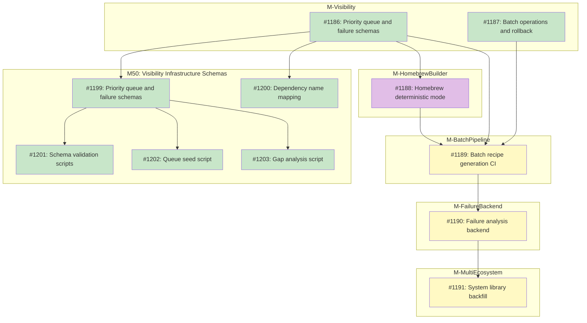

# DESIGN: Registry Scale Strategy

## Status

Planned

## Implementation Issues

### Milestone: [Tool Backlog Visibility](https://github.com/tsukumogami/tsuku/milestone/50)

| Issue | Title | Dependencies | Tier |
|-------|-------|--------------|------|
| ~~[#1186](https://github.com/tsukumogami/tsuku/issues/1186)~~ | design priority queue and failure record schemas | None | testable |
| ~~[#1187](https://github.com/tsukumogami/tsuku/issues/1187)~~ | design batch operations and rollback procedures | None | testable |

### Milestone: [M50: Visibility Infrastructure Schemas](https://github.com/tsukumogami/tsuku/milestone/57)

| Issue | Title | Dependencies | Tier |
|-------|-------|--------------|------|
| ~~[#1199](https://github.com/tsukumogami/tsuku/issues/1199)~~ | ~~feat(data): add priority queue and failure record schemas~~ | ~~[#1186](https://github.com/tsukumogami/tsuku/issues/1186)~~ | ~~testable~~ |
| ~~[#1200](https://github.com/tsukumogami/tsuku/issues/1200)~~ | ~~feat(data): add dependency name mapping structure~~ | ~~[#1186](https://github.com/tsukumogami/tsuku/issues/1186)~~ | ~~simple~~ |
| ~~[#1201](https://github.com/tsukumogami/tsuku/issues/1201)~~ | ~~feat(scripts): add schema validation scripts~~ | ~~[#1199](https://github.com/tsukumogami/tsuku/issues/1199)~~ | ~~testable~~ |
| ~~[#1202](https://github.com/tsukumogami/tsuku/issues/1202)~~ | ~~feat(scripts): add queue seed script for Homebrew~~ | ~~[#1199](https://github.com/tsukumogami/tsuku/issues/1199)~~ | ~~testable~~ |
| ~~[#1203](https://github.com/tsukumogami/tsuku/issues/1203)~~ | ~~feat(scripts): add gap analysis script~~ | ~~[#1199](https://github.com/tsukumogami/tsuku/issues/1199)~~ | ~~testable~~ |

### Milestone: [Batch Operations Control Plane](https://github.com/tsukumogami/tsuku/milestone/55)

Implements [#1187](https://github.com/tsukumogami/tsuku/issues/1187). See [DESIGN-batch-operations.md](DESIGN-batch-operations.md) for issue details.

### Milestone: [Batch Operations Observability](https://github.com/tsukumogami/tsuku/milestone/56)

Implements [#1187](https://github.com/tsukumogami/tsuku/issues/1187). See [DESIGN-batch-operations.md](DESIGN-batch-operations.md) for issue details.

### Milestone: [M-HomebrewBuilder](https://github.com/tsukumogami/tsuku/milestone/51)

| Issue | Title | Dependencies | Tier |
|-------|-------|--------------|------|
| [#1188](https://github.com/tsukumogami/tsuku/issues/1188) | design homebrew deterministic mode | [#1186](https://github.com/tsukumogami/tsuku/issues/1186) | testable |

### Milestone: [M-BatchPipeline](https://github.com/tsukumogami/tsuku/milestone/52)

| Issue | Title | Dependencies | Tier |
|-------|-------|--------------|------|
| [#1189](https://github.com/tsukumogami/tsuku/issues/1189) | design batch recipe generation CI pipeline | [#1186](https://github.com/tsukumogami/tsuku/issues/1186), [#1187](https://github.com/tsukumogami/tsuku/issues/1187), [#1188](https://github.com/tsukumogami/tsuku/issues/1188) | testable |

### Milestone: [M-FailureBackend](https://github.com/tsukumogami/tsuku/milestone/53)

| Issue | Title | Dependencies | Tier |
|-------|-------|--------------|------|
| [#1190](https://github.com/tsukumogami/tsuku/issues/1190) | design failure analysis backend | [#1189](https://github.com/tsukumogami/tsuku/issues/1189) | testable |

### Milestone: [M-MultiEcosystem](https://github.com/tsukumogami/tsuku/milestone/54)

| Issue | Title | Dependencies | Tier |
|-------|-------|--------------|------|
| [#1191](https://github.com/tsukumogami/tsuku/issues/1191) | design system library backfill strategy | [#1190](https://github.com/tsukumogami/tsuku/issues/1190) | simple |

### Dependency Graph



**Legend**: Green = done, Blue = ready, Yellow = blocked, Purple = needs-design

## Context and Problem Statement

Tsuku has successfully separated embedded recipes (17 core bootstrapping tools) from registry recipes (155 installable tools). The registry separation design enables scaling beyond a few hundred recipes, but the current recipe count is far below the potential: Homebrew alone has 8,170 formulas, and popular vendor taps (HashiCorp, MongoDB, AWS) add hundreds more.

Three challenges prevent scaling to thousands of recipes:

1. **Generation is manual**: Each recipe requires running `tsuku create --from <source>` and validating the output. There's no batch generation or CI pipeline.

2. **System dependencies are incomplete**: Many Homebrew formulas depend on libraries (libpng, sqlite, curl) that tsuku doesn't yet provide. When these deps are missing, recipes fail to install.

3. **Quality assurance at scale**: With hundreds of recipes, how do we ensure they work? Sandbox validation helps for LLM-generated recipes, but deterministic recipes skip sandbox testing.

### Why Now

The recipe registry separation (M30-M32) is nearing completion. The infrastructure exists to host thousands of recipes, but without recipes to host, the infrastructure provides no user value. Scaling the registry is the natural next step to make tsuku useful for real-world development.

### Success Criteria

**User-centric metrics (primary):**
- **Install success rate**: >95% of user install attempts for tools in the registry succeed on the user's platform
- **Coverage of requests**: >80% of user-requested tools (via telemetry/issues) available within 30 days
- **Discovery success**: Users can find and install 8 of 10 tools they commonly use
- **Platform coverage**: >90% of recipes work on linux-glibc and darwin; musl coverage is best-effort

**Infrastructure metrics (secondary):**
- **Short term**: 500 validated recipes covering the most-requested developer tools
- **Medium term**: 2,000+ recipes across all major ecosystems (Homebrew, crates.io, npm, PyPI)
- **Quality bar**: <1% installation failure rate for validated recipes

**Note**: Recipe count is a proxy metric. The real goal is that users can install the tools they need.

### Scope

**In scope:**
- Automated batch generation of recipes from known sources
- Prioritization criteria for which recipes to generate first
- System dependency backfill strategy
- Quality assurance for generated recipes
- Support for popular Homebrew taps (hashicorp, mongodb, etc.)

**Out of scope:**
- User-submitted recipes (community contributions)
- Recipe versioning and upgrade workflows
- Storage and distribution infrastructure (covered by registry separation design)

## Decision Drivers

- **Deterministic generation preferred**: Ecosystem builders (crates.io, npm, pypi, rubygems) are zero-cost and scale linearly; LLM-based generation costs ~$0.10/recipe
- **Quality over quantity**: Broken recipes damage user trust; every generated recipe must be tested
- **Bottle availability**: Homebrew bottle inspection is estimated at ~85-90% deterministic; remaining formulas need LLM analysis. **Note: This estimate requires validation with actual data before relying on it for capacity planning.**
- **System dependencies**: Many tools need libraries; adding deps unlocks entire categories of recipes
- **Popular tools first**: Users need common tools (terraform, kubectl, ripgrep) before obscure ones
- **Tap support matters**: Vendor taps (hashicorp/tap, mongodb/brew) contain actively-maintained formulas
- **Platform diversity**: Recipes must work across target environments (linux-glibc, linux-musl, darwin); partial coverage is acceptable with graceful degradation

## External Research

### Current Builder State

Analysis of existing tsuku builders reveals which are ready for scale and which have gaps:

| Builder | Status | Deterministic | Ready for Scale | Gap |
|---------|--------|---------------|-----------------|-----|
| Cargo (crates.io) | Active | Yes | Yes | None |
| NPM | Active | Yes | Yes | None |
| PyPI | Active | Yes | Yes | None |
| RubyGems | Active | Yes | Yes | None |
| Go (proxy.golang.org) | Active | Yes | Yes | None |
| CPAN (metacpan.org) | Active | Yes | Yes | None |
| Homebrew | Active | Hybrid (85-90% deterministic) | Partial | LLM fallback for ~10-15% |
| Homebrew Cask | Active | Yes | Yes | None |
| GitHub Release | Active | **No (LLM-only)** | **No** | Major: no deterministic path |

**Key findings:**
- 8 builders are fully deterministic and ready for batch generation
- Homebrew is 85-90% deterministic via bottle inspection; LLM fallback handles edge cases
- **GitHub Release builder is LLM-only** - significant gap since many tools distribute via GitHub releases

### Builder Gaps Requiring Tactical Work

1. **GitHub Release Deterministic Path**: The GitHub Release builder currently requires LLM for every generation (~$0.10/recipe). A deterministic path analyzing release asset naming patterns could handle many common cases (tools that follow `{name}-{version}-{os}-{arch}.tar.gz` conventions).

2. **Homebrew Deterministic Success Rate**: Current 85-90% success rate means 10-15% of formulas still need LLM. Improving bottle inspection heuristics could reduce LLM dependency.

### Ecosystem Scale Analysis

| Source | Total Available | CLI-Relevant | Generation Method | Cost/Recipe |
|--------|----------------|--------------|-------------------|-------------|
| Homebrew formulas | 8,170 | ~3,000 | Bottle inspection or LLM | $0-0.10 |
| Homebrew casks | 7,526 | All (macOS apps) | Deterministic API | $0 |
| Homebrew taps | 1,000+ | 500+ | Same as formulas | $0-0.10 |
| Crates.io | 210,000+ | ~10,000 CLI crates | Deterministic API | $0 |
| npm | 11M+ | ~100K CLI tools | Deterministic API | $0 |
| PyPI | 500K+ | ~50K CLI tools | Deterministic API | $0 |
| RubyGems | 180K+ | ~20K CLI tools | Deterministic API | $0 |

### Popular Vendor Taps

Taps with stable, vendor-maintained formulas:

| Tap | Formulas | Notable Tools |
|-----|----------|---------------|
| hashicorp/tap | 20+ | terraform, vault, consul, nomad, packer |
| mongodb/brew | 10+ | mongodb-community, mongosh |
| aws/tap | 5+ | aws-sam-cli, copilot-cli |
| azure/functions | 3+ | azure-functions-core-tools |
| goreleaser/tap | 2+ | goreleaser |
| buildpacks/tap | 2+ | pack |

These taps follow standard formula structure and work with tsuku's Homebrew builder.

### System Dependency Analysis

Current embedded libraries: 17 (go, rust, nodejs, python, ruby, perl, zig, gcc-libs, openssl, zlib, etc.)

Frequently-required system deps not yet available:
- **Compression**: bzip2, xz, lz4, zstd
- **Graphics**: libpng, libjpeg, freetype, fontconfig
- **Data**: sqlite, libxml2, libxslt
- **Network**: curl, libssh2, nghttp2
- **Crypto**: libsodium, gnutls

Adding ~20 core libraries would unblock hundreds of Homebrew formulas.

## Considered Options

### Decision 1: Generation Strategy

How should we generate recipes at scale?

#### Option 1A: Manual Batch Generation

Run `tsuku create` for prioritized lists of packages, reviewing output manually.

**Pros:**
- Human review catches edge cases
- No new tooling required
- Can start immediately

**Cons:**
- Doesn't scale beyond hundreds
- Developer time is the bottleneck
- Inconsistent quality depends on reviewer attention

#### Option 1B: CI Pipeline with Validation Gates

Automated pipeline that generates recipes, validates them, and creates PRs for review.

**Pros:**
- Scales to thousands of recipes
- Consistent validation criteria
- Parallel generation across ecosystems

**Cons:**
- Significant tooling investment
- Need to handle flaky validation
- LLM costs accumulate at scale

#### Option 1C: Hybrid: Deterministic Auto-Merge, LLM Human Review

Auto-merge deterministic recipes (crates.io, npm, pypi) after validation passes; require human review for LLM-generated recipes.

**Pros:**
- Balances scale with quality
- Focuses human attention where needed
- Zero-cost scaling for ecosystems

**Cons:**
- Two different code paths
- Need clear criteria for "deterministic"
- Deterministic recipes may still select wrong executables or miss platform-specific issues

#### Option 1D: Event-Driven Generation

Generate recipes on-demand when users request missing tools via `tsuku install <unknown-tool>`.

**Pros:**
- Only generates what users actually need
- No upfront cost for unused recipes
- Builds library organically from real demand

**Cons:**
- First user pays the wait cost (LLM generation takes seconds)
- No curated experience for new users
- Harder to market ("we have N recipes" vs "we can generate any recipe")

### Decision 2: Prioritization Strategy

Which recipes should we generate first?

#### Option 2A: Popularity-Based (Downloads/Stars)

Generate recipes for the most-downloaded or starred packages first.

**Pros:**
- Maximum user value per recipe
- Clear, objective criteria
- Data available from ecosystem APIs

**Cons:**
- Popular tools may be complex (more deps)
- Metrics favor established tools over rising ones
- Some popular tools already have recipes

#### Option 2B: Dependency-Driven

Generate dependency libraries first, then tools that need them.

**Pros:**
- Unblocks entire categories at once
- Topological ordering ensures deps exist
- Reduces failed installations

**Cons:**
- Users don't directly benefit from libs
- Slower initial visible progress
- Dependency extraction infrastructure is incomplete (see #644)

#### Option 2C: Ecosystem Sweep

Complete coverage of one ecosystem before moving to next.

**Pros:**
- Clear progress metric
- Simplifies tooling (one builder at a time)
- Ecosystem-specific issues addressed together

**Cons:**
- Delays high-value tools in other ecosystems
- Some ecosystems have diminishing returns
- Ignores cross-ecosystem popularity

### Decision 3: System Dependency Handling

How do we handle recipes that need system libraries?

#### Option 3A: Library Recipes First

Create tsuku recipes for common system libraries before generating dependent tools.

**Pros:**
- Full tsuku control over libraries
- Works on any platform
- No system package manager needed

**Cons:**
- Significant work to create lib recipes
- Some libs are complex to build
- Duplicates distro work

#### Option 3B: Skip Tools Requiring System Dependencies

Don't generate recipes for tools that require system libraries tsuku doesn't provide. Focus on self-contained tools first.

**Pros:**
- No dependency complexity
- Faster initial coverage of ecosystem
- All recipes work on all platforms

**Cons:**
- Excludes many popular tools (e.g., imagemagick, ffmpeg)
- May frustrate users expecting comprehensive coverage
- Delays value for users who need those tools

#### Option 3C: Hybrid: Prefer Tsuku, Fallback to System

Try tsuku-provided libs first; fall back to system packages if unavailable.

**Pros:**
- Graceful degradation
- Works today with existing deps
- Gradual migration path

**Cons:**
- Complex resolution logic
- Behavior varies by platform
- Hard to test all paths

### Uncertainties

- **LLM reliability at scale**: Will Claude/Gemini maintain quality for 1000+ sequential generations?
- **Bottle inspection coverage**: ~85-90% of formulas have usable bottle metadata; the rest need LLM fallback
- **Library complexity**: Some libs (fontconfig, mesa) may be too complex for tsuku
- **User demand signal**: Which tools do users actually want vs which are "popular"?
- **API rate limits**: Ecosystem APIs (crates.io, npm) have rate limits that may throttle batch generation
- **Version drift**: Recipes generated today may break as upstream tools update

## Decision Outcome

**Chosen: Deterministic-Only Pipeline + 2A (Popularity-Based) + 3B (Skip System Deps Initially)**

### Summary

Adopt a fully deterministic batch generation pipeline. All failures are recorded with structured data for analysis. LLM builders remain a user-facing feature for manual recipe creation, not part of automation. Prioritize by popularity to maximize user value per recipe. Initially skip tools requiring system libraries tsuku doesn't provide, building out library recipes as a separate workstream.

### Rationale

**Generation Strategy (Deterministic-Only)**: The automated pipeline uses only deterministic builders. When a tool can't be generated deterministically, it's recorded as a failure with structured metadata. This produces:
- Predictable costs ($0 for the pipeline itself)
- Consistent, analyzable results
- Clear signal about which capabilities to build next

LLM builders (GitHub Release, Homebrew fallback) remain available for users running `tsuku create` interactively, but are excluded from batch automation.

**Prioritization (2A)**: Popularity-based ordering aligns with "popular tools first" and "quality over quantity" drivers. Users get terraform, kubectl, and ripgrep before obscure tools. Popularity data is readily available from ecosystem APIs without building complex dependency analysis infrastructure.

**System Dependencies (3B)**: Skipping tools requiring missing system libs initially is pragmatic. It avoids the complexity of Option 3C while not blocking progress. The library backfill becomes a parallel workstream that gradually expands coverage. This aligns with "quality over quantity" since recipes that install will work reliably.

### Alternatives Rejected

- **1A (Manual)**: Doesn't scale to thousands; developer time is finite
- **1B (Full CI with LLM)**: LLM costs are unpredictable at scale; failures become expensive instead of informative
- **1C (Hybrid with LLM fallback)**: Mixing LLM into automation obscures capability gaps; we want failures to be data, not fallback triggers
- **1D (Event-Driven)**: Delays curated experience; harder to market
- **2B (Dependency-Driven)**: Requires dependency infrastructure that doesn't exist (#644)
- **2C (Ecosystem Sweep)**: Ignores cross-ecosystem popularity; delays high-value tools
- **3A (Library First)**: Blocks recipe generation on library work; slows initial progress
- **3C (Hybrid Fallback)**: Complex resolution logic; inconsistent user experience

### Trade-offs Accepted

By choosing this approach, we accept:
- **Lower initial coverage**: Tools that fail deterministic generation won't be in the registry automatically
- **Manual work for complex tools**: GitHub releases, complex Homebrew formulas require manual `tsuku create`
- **Popularity bias**: Rising tools may be underrepresented vs established ones

These are acceptable because:
- Failures produce actionable data (capability gap reports) instead of LLM costs
- Manual creation with LLM remains available as a user feature
- The pipeline becomes a forcing function to improve deterministic builders
- Popularity metrics can be augmented with user requests over time

## Solution Architecture

### Overview

The registry scale strategy is a **fully deterministic pipeline** that generates recipes and records failures for analysis. LLM builders are excluded from automation.

**Automated pipeline workstreams:**

1. **Ecosystem Recipe Generation**: Deterministic builders (Cargo, NPM, PyPI, RubyGems, Go, CPAN, Cask) auto-generate and validate recipes, merging automatically on success
2. **Homebrew Recipe Generation**: Bottle inspection only (deterministic path). Formulas that fail bottle inspection are recorded as failures, not sent to LLM
3. **Failure Collection**: All failures recorded with structured metadata for gap analysis
4. **Library Backfill**: Separate workstream adding tsuku recipes for common system libraries

**Not part of automation:**
- GitHub Release builder (LLM-only) - users can run `tsuku create --from github:org/repo` manually
- Homebrew LLM fallback - users can run `tsuku create --from homebrew:formula` manually for complex formulas

### Target Environments

Validation runs across a matrix of target environments. Recipes can have **partial platform coverage** - a recipe that works on 3 of 5 environments is still valuable and should merge with appropriate platform constraints.

**Target environment matrix:**

| Environment | Runner | Priority | Notes |
|-------------|--------|----------|-------|
| `linux-glibc-x86_64` | ubuntu-latest | High | Primary Linux target |
| `linux-glibc-arm64` | ubuntu-24.04-arm | Medium | Growing ARM server adoption |
| `darwin-x86_64` | macos-13 | High | Intel Macs (legacy but common) |
| `darwin-arm64` | macos-14 | High | Apple Silicon (primary Mac target) |
| `linux-musl-x86_64` | alpine container | Low | Alpine/container use cases |

**Platform-specific considerations:**

- **Homebrew bottles**: Only available for glibc Linux and macOS. Musl users need alternative sources or source builds.
- **Ecosystem builders**: Cargo/Go binaries built on the runner match the runner's libc. Musl requires explicit cross-compilation.
- **macOS costs**: 10x Linux CI minutes. May sample or defer to nightly for cost control.

**Graceful degradation principle:** A recipe is useful even with partial coverage. If ripgrep works on 4 environments but fails on linux-musl, the recipe merges with `platforms: [linux-glibc-x86_64, linux-glibc-arm64, darwin-x86_64, darwin-arm64]`. Users on musl see "not available for your platform" instead of a broken install.

**Contributor backfill path:** When a recipe doesn't support an environment, contributors can:
1. Add an alternative source that works (e.g., `--from cargo:ripgrep` might build a musl-compatible binary)
2. Add platform-specific download URLs if upstream provides musl binaries
3. Add source build steps for environments without pre-built binaries

This allows the automated pipeline to handle the common cases while community contributions fill gaps for niche environments.

### Components

```
┌──────────────────────────────────────────────────────────────────────────┐
│                   Automated CI Pipeline (Deterministic Only)              │
├──────────────────────────────────────────────────────────────────────────┤
│                                                                           │
│  ┌────────────────────────────────────┐  ┌─────────────────────────────┐ │
│  │       Deterministic Builders        │  │     Homebrew (bottle only)  │ │
│  │                                     │  │                             │ │
│  │  - Cargo ✓    - Go ✓               │  │  Bottle inspection only     │ │
│  │  - NPM ✓      - CPAN ✓             │  │  (~85-90% of formulas)      │ │
│  │  - PyPI ✓     - Cask ✓             │  │                             │ │
│  │  - RubyGems ✓                      │  │  Failures → analysis        │ │
│  └──────────────┬─────────────────────┘  └──────────────┬──────────────┘ │
│                 │                                       │                 │
│                 ▼                                       ▼                 │
│  ┌───────────────────────────────────────────────────────────────┐       │
│  │                    Validation Gates (per environment)          │       │
│  │  - Recipe schema validation                                    │       │
│  │  - Sandbox install test (on each target environment)           │       │
│  │  - Binary execution check (on each target environment)         │       │
│  │  - Aggregate results → derive supported platforms              │       │
│  └───────────────────────────────────────────────────────────────┘       │
│                 │                                       │                 │
│          ┌──────┴──────┐                         ┌──────┴──────┐         │
│          ▼             ▼                         ▼             ▼         │
│    ┌──────────┐  ┌──────────┐              ┌──────────┐  ┌──────────┐    │
│    │ Success  │  │ Failure  │              │ Success  │  │ Failure  │    │
│    │ → Merge  │  │ → Record │              │ → Merge  │  │ → Record │    │
│    └──────────┘  └──────────┘              └──────────┘  └──────────┘    │
│                       │                                       │          │
│                       └───────────────┬───────────────────────┘          │
│                                       ▼                                  │
│                          ┌─────────────────────┐                         │
│                          │   Failure Analysis  │                         │
│                          │   (backend service) │                         │
│                          └─────────────────────┘                         │
└──────────────────────────────────────────────────────────────────────────┘

┌──────────────────────────────────────────────────────────────────────────┐
│                    Manual/Interactive (User Feature)                      │
├──────────────────────────────────────────────────────────────────────────┤
│  Users can run these manually to create recipes for tools that failed:   │
│                                                                           │
│  - tsuku create --from github:org/repo     (LLM-based)                   │
│  - tsuku create --from homebrew:formula    (LLM fallback for failures)   │
└──────────────────────────────────────────────────────────────────────────┘
```

### Priority Queue

The pipeline maintains a priority queue of packages to generate, ordered by:

1. **Popularity score**: Downloads/stars normalized across ecosystems
2. **Dependency availability**: Penalize tools requiring unavailable system libs
3. **Request count**: User requests via telemetry or issues

**User request mechanism**: When `tsuku install <tool>` fails because no recipe exists, the CLI should:
1. Record the request to telemetry (if opt-in enabled)
2. Provide user guidance: "Tool not found. You can create a recipe with `tsuku create --from <source>` or request it via GitHub issues."
3. Show alternatives if similar-named recipes exist

This creates a feedback loop where actual user demand informs prioritization, avoiding the cold-start problem of popularity-only ordering.

### Failure Analysis System

The batch pipeline runs in **deterministic-only mode** (no LLM fallback). Failures are valuable data that reveal capability gaps.

**Design principles:**
- Failures are a forcing function, not errors to suppress
- Collect structured data for systematic analysis
- Prioritize capabilities by "popularity-weighted impact" (what capability would unblock the most popular tools?)
- **Track failures per environment, not per recipe** - a recipe may succeed on some platforms and fail on others

**Failure categories mapped to capabilities:**

| Category | Capability Needed | Example |
|----------|-------------------|---------|
| `no_bottles` | Homebrew source fallback | formulas without bottles |
| `build_from_source` | Source build action | tools requiring compilation |
| `no_platform_assets` | Platform matrix expansion | tools missing Linux/macOS builds |
| `missing_dependency` | System library recipes | tools needing libpng, sqlite |
| `binary_not_found` | Improved executable discovery | non-standard binary locations |
| `complex_archive` | Advanced archive inspection | nested or unusual structures |

**Storage:** Backend storage (R2, D1, or similar) with JSONL ingestion per batch run, enabling:
- Capability gap reports showing which dependencies block the most popular packages
- Feedback loop to re-prioritize the queue (skip structural failures, retry transient ones)
- Historical tracking of gap closure over time
- Query interface for operators to analyze patterns

**No API key = deterministic-only:** Running `tsuku create` without LLM API keys (ANTHROPIC_API_KEY, GOOGLE_API_KEY) naturally produces deterministic-only behavior for ecosystem builders. The Homebrew builder requires refactoring to support this pattern - currently it fails early if no LLM is available, even when deterministic bottle inspection would succeed. After refactoring, Homebrew should attempt deterministic generation first and only fail if both deterministic fails AND no LLM is available.

### Per-Environment Validation Results

Validation produces a result matrix, not a single pass/fail. Each (package, environment) pair has its own outcome.

**Validation result structure:**
```jsonl
{"package": "ripgrep", "source": "cargo", "popularity": 9500, "timestamp": "2026-01-27T10:00:00Z", "results": {
  "linux-glibc-x86_64": {"status": "pass"},
  "linux-glibc-arm64": {"status": "pass"},
  "darwin-x86_64": {"status": "pass"},
  "darwin-arm64": {"status": "pass"},
  "linux-musl-x86_64": {"status": "fail", "category": "binary_incompatible", "reason": "requires glibc"}
}}
```

**Recipe output:** When a recipe passes on at least one environment, it merges with a `platforms` field derived from the validation results:
```toml
[metadata]
platforms = ["linux-glibc-x86_64", "linux-glibc-arm64", "darwin-x86_64", "darwin-arm64"]
```

**Failure tracking:** Failures are recorded per environment, enabling:
- "Which environments fail most often for Homebrew recipes?" (answer: musl)
- "What capability would unlock linux-arm64 for the most packages?"
- Targeted backfill work for specific environments

### Dependency Resolution and Retry

When a package fails due to missing dependencies, the failure record must track which specific dependencies blocked it. This enables automatic retry when dependencies become available.

**Per-environment failure record:**
```jsonl
{"package": "imagemagick", "source": "homebrew", "environment": "linux-glibc-x86_64", "category": "missing_dependency", "blocked_by": ["libpng", "libjpeg"], "popularity": 8500, "timestamp": "2026-01-27T10:00:00Z"}
```

**Note:** A package may be blocked by different dependencies on different environments. The `blocked_by` field is environment-specific.

**Backend service capabilities:**
- Query packages blocked by a specific dependency
- Generate reports: which dependencies block the most popular packages
- Re-queue blocked packages when dependencies become available

**Re-queue triggers:**

| Trigger | When | Action |
|---------|------|--------|
| Manual | After adding library recipe | Operator queries blocked packages, triggers re-queue |
| Automatic | CI hook on recipe merge | Backend detects new recipe, re-queues blocked packages |

**Automatic trigger flow:**
1. New recipe merged (e.g., `libpng.toml`)
2. CI notifies backend service of new recipe
3. Backend queries failure store for packages blocked by `libpng`
4. Blocked packages added back to priority queue with original popularity scores
5. Next batch run picks them up

This creates a feedback loop: failures identify missing capabilities, capabilities are added, blocked packages automatically retry.

**Implementation note:** This is backend infrastructure (similar to telemetry worker), not part of the tsuku CLI. **Architecture constraint:** Must be Cloudflare-based (Worker + D1/R2) to maintain consistency with existing telemetry infrastructure and avoid new operational surface area.

### Generation Flow

```
Priority Queue → Select Package → Route by Source
                                        │
              ┌─────────────────────────┴─────────────────────────┐
              ▼                                                   ▼
      Ecosystem Builder                                   Homebrew Builder
      (cargo, npm, pypi,                                  (bottle inspection
       rubygems, go, cpan, cask)                           ONLY - no LLM)
              │                                                   │
              ▼                                                   ▼
      Deterministic Recipe                                Deterministic Recipe
              │                                            OR Failure Record
              ▼                                                   │
      Validation Gates ◄──────────────────────────────────────────┘
              │
       ┌──────┴──────┐
       ▼             ▼
   Success       Failure
   → Merge       → Record ──────────────────┐
       │                                    │
       │                                    ▼
       │                          Failure Analysis
       │                          (backend service)
       │                                    │
       │              ┌─────────────────────┴─────────────────────┐
       │              ▼                                           ▼
       │     Dependency missing?                          Other failure?
       │              │                                           │
       │              ▼                                           ▼
       │     Wait for dep recipe                         Capability gap report
       │     (auto re-queue when                         (informs manual fixes)
       │      dep becomes available)
       │              │
       └──────────────┴─────► Re-queue to Priority Queue
```

**Notes:**
- GitHub Release packages are NOT in the automated queue. Users create these manually via `tsuku create --from github:org/repo`.
- When a dependency recipe is added, the backend service automatically re-queues packages that were blocked by it.

## Implementation Approach

This is a strategic design. Implementation follows a **walking skeleton** approach where each phase delivers functional end-to-end value. Phases build vertically through the stack rather than completing horizontal layers.

**Guiding principles:**
1. Build visibility/tracking infrastructure FIRST (failures are data, not waste)
2. Implement ONE ecosystem end-to-end before expanding
3. Group work by shared implementation effort, not just value out
4. Each phase delivers a functional increment
5. Validate assumptions before building on them

### Validation Spike: Homebrew Deterministic Rate (Pre-Phase 0)

**Goal**: Validate the 85-90% Homebrew deterministic success rate before building infrastructure that depends on it.

**Rationale**: The entire phasing assumes this rate is accurate. If actual rate is 60%, Phase 1 scope and backend sizing change significantly. This is 2-3 days of work that could save weeks of rework.

**Method**: Run bottle inspection against 500 Homebrew formulas (random sample). Record success/failure categories.

**Gate**: If deterministic rate <70%, revisit Phase 1 scope before proceeding.

**Deliverable**: Report documenting actual deterministic rate with failure category breakdown.

### Day 1 Batch: Quick User Value (Parallel Track)

**Goal**: Deliver user value immediately while infrastructure is being built.

**Rationale**: Users don't care about failure schemas - they care about installing tools. The top 20 most-requested tools are known. Generate these manually in parallel with Phase 0-1.

**Method**: Hand-pick 20 high-impact tools (ripgrep, jq, bat, fd, terraform, kubectl, etc.). Generate manually via `tsuku create`. Validate on Linux AND macOS (sampled). Merge via normal PR process.

**Platform**: linux-glibc-x86_64 + darwin-arm64 (sampled - top 20 only catches obvious macOS issues early)

**Deliverables**:
1. 20 high-impact recipes merged
2. Early macOS validation data (informs Phase 2 cost planning)

**Timing**: Runs in parallel with Phase 0 and Phase 1a. No dependencies on batch infrastructure.

### Phase 0: Visibility Infrastructure (No Batch Recipes)

**Goal**: Build the tracking system before generating anything. See the scope, understand the gap.

**Rationale**: Without failure tracking, work in later phases is thrown away. A visibility system lets us understand the problem space before committing to solutions.

**Components**:
- Package entity schema with `schema_version` field (enables future migration)
- Failure record schema definition with versioning
- Recipe registry integration (know what already exists)
- Scripts to populate queue from Homebrew API (popularity data)
- Basic reports: "X packages in queue, Y already have recipes"
- Rollback scripts (tested against manually-created recipes)

**Deliverables**:
1. `data/priority-queue.json` - Static queue seeded with 100 Homebrew formulas
2. `data/failure-schema.json` - Versioned failure record schema (v1)
3. Scripts to query ecosystem APIs for popularity data
4. `scripts/rollback-recipe.sh` - Tested rollback procedure

**Exit Criteria**:
- Queue seeded with 100 packages from Homebrew API
- Rollback script tested against a manually-created test recipe
- Schema includes `schema_version: 1` field
- Report shows existing recipe overlap

**What's NOT in Phase 0**: No batch recipe generation, no CI workflows, no backend services.

### Phase 1a: Homebrew Builder Validation (Single Formula)

**Goal**: Validate the Homebrew builder produces correct deterministic output or structured failure before attempting batch generation.

**Rationale**: The Homebrew builder refactor is a prerequisite, not an inline deliverable. Proving it works for single formulas de-risks the batch integration.

**Components**:
- **Homebrew builder refactor** (DESIGN-homebrew-deterministic-mode.md): Defer LLM initialization, enable deterministic-only mode
- **Failure categorization**: `DeterministicFailedError` with structured category field

**Deliverables**:
1. Modified Homebrew builder with deterministic-only mode
2. Unit tests for deterministic success path
3. Unit tests for failure categorization (returns structured error, not crash)

**Exit Criteria**:
- 3 hand-picked Homebrew formulas generate deterministically OR produce categorized `DeterministicFailedError`
- No LLM API calls made during deterministic-only generation
- Failure records match schema from Phase 0

**What's NOT in Phase 1a**: No batch workflow, no CI pipeline, no queue integration.

### Phase 1b: Batch Pipeline Integration (Homebrew, Linux Only)

**Goal**: Integrate Homebrew builder with batch workflow. Generate, validate, track failures, and merge for ONE ecosystem.

**Ecosystem choice**: Homebrew (chosen to stress-test failure tracking - 10-15% failure rate produces meaningful data)

**Platform choice**: linux-glibc-x86_64 (cheapest CI, fastest feedback)

**Components**:
- **Batch generation workflow**: Manual trigger, static queue, Homebrew routing only
- **Validation gates**: Schema, plan generation, sandbox install (Linux only)
- **Failure tracking**: File-based JSONL with blocked-by extraction
- **Operational controls**: Emergency stop, recipe rollback, runbooks
- **Basic SLI collection**: Success rate, validation pass rate (JSONL-based)
- **Circuit breaker**: Auto-pause ecosystem if success rate <50% for 10 consecutive attempts
- **Rate limiting (RATE-1)**: Conservative defaults (1 req/sec for GitHub API)

**Deliverables**:
1. Batch generation workflow for Homebrew + Linux
2. Failure records in `data/failures/homebrew-linux.jsonl`
3. Manual PR creation (no auto-merge yet)
4. Gap report: "X Homebrew formulas succeeded, Y failed (by category)"
5. Success rate metric tracked per batch run
6. Circuit breaker tested (manually trigger low success scenario)

**Exit Criteria**:
- 50+ Homebrew recipes merged via batch pipeline
- Success rate metric operational and matches expected 85-90%
- Circuit breaker tested (auto-pauses on simulated failure storm)
- Emergency stop tested
- Rollback tested on a batch-generated recipe

**What's NOT in Phase 1b**: No other ecosystems, no macOS, no auto-merge, no backend services.

### Phase 2: Failure Analysis Backend + macOS Platform

**Goal**: Move from files to backend service. Add macOS platform validation.

**Rationale**: Now that we have failure data, we need to query it efficiently. Adding macOS is minimal incremental effort once the pipeline exists.

**Components**:
- **Failure storage backend** (DESIGN-batch-failure-analysis.md): Cloudflare Worker + D1
- **Query API**: Packages blocked by X, top gaps by impact
- **Priority queue migration**: Move from static JSON to D1
- **Platform matrix**: Add darwin-arm64 validation
- **Cost controls**: macOS budget caps, sampling strategy (validate in dry-run first)
- **Observability**: SLI metrics, SLO definitions, alerting

**Deliverables**:
1. Cloudflare Worker + D1 for failure and queue storage
2. Query API for gap analysis
3. macOS validation with cost controls
4. Per-environment failure tracking
5. Alerting on success rate drops

**Exit Criteria**:
- D1 migration complete with rollback plan tested
- Query API returns "packages blocked by X" in <1s
- macOS budget cap validated (dry-run mode) before enabling real runs
- Alerting fires on simulated success rate drop
- 200+ recipes validated on both Linux and macOS

### Phase 3: Multi-Ecosystem Deterministic

**Goal**: Add remaining deterministic ecosystems. All use the same infrastructure.

**Components**:
- **Ecosystem builders**: Cargo, NPM, PyPI, RubyGems, Go, CPAN, Cask
- **Cross-ecosystem scoring**: Popularity normalization, data ingestion
- **Ecosystem rate limiting**: Per-ecosystem throttling (RATE-1 applied to all)
- **Ecosystem pause/resume**: Per-ecosystem operational controls

**Deliverables**:
1. All deterministic ecosystem builders integrated
2. Cross-ecosystem priority queue with popularity scoring
3. Per-ecosystem failure tracking and controls

**Exit Criteria**:
- Each ecosystem generates at least 50 recipes
- Per-ecosystem pause/resume tested
- Rate limiting prevents API throttling (no 429 errors in logs)
- 1000+ total recipes in registry

### Phase 4: Automation & Intelligence

**Goal**: Auto-merge, re-queue triggers, advanced analysis.

**Components**:
- **Auto-merge** (DESIGN-batch-recipe-generation.md): For recipes passing all gates
- **Re-queue triggers** (DESIGN-batch-failure-analysis.md): Auto re-queue when deps available
- **Structural vs transient classification**: Don't retry structural failures
- **Post-merge monitoring**: Checksum drift detection
- **Request-based priority**: Boost packages users are requesting

**Deliverables**:
1. Auto-merge for safe recipes (no `run_command`)
2. Automatic re-queue when dependencies merge
3. Gap analysis with dependency impact scoring
4. Post-merge security monitoring

**Exit Criteria**:
- Auto-merge enabled for deterministic recipes without `run_command`
- Re-queue trigger tested: add library recipe, verify blocked packages re-queued
- Post-merge monitoring detects simulated checksum change
- 5000+ recipes in registry

### Phase 5: Platform Matrix Completion + Operational Polish

**Goal**: Complete platform coverage, operational dashboards.

**Components**:
- **Remaining platforms**: linux-glibc-arm64, darwin-x86_64, linux-musl-x86_64
- **Cross-job coordination**: Distributed rate limiting (RATE-2)
- **Dashboards**: Historical trends, operator visibility
- **Advanced alerting**: Fatigue prevention, severity tuning
- **State reconciliation**: Detect/repair queue inconsistencies

**Deliverables**:
1. Full 5-environment validation matrix
2. Historical trend analysis
3. Operator dashboards
4. State reconciliation tools

**Exit Criteria**:
- All 5 target environments validated in CI matrix
- State reconciliation tool detects and repairs simulated inconsistency
- Dashboard shows real-time queue depth and success rates
- 10000+ recipes in registry

### Phase Summary

| Phase | Goal | Recipes Out | Key Infrastructure |
|-------|------|-------------|-------------------|
| Spike | Validate assumption | 0 | Homebrew deterministic rate measurement |
| Day 1 | Quick user value | ~20 | Manual generation, sampled macOS |
| 0 | Visibility | 0 | Queue + schema + rollback scripts |
| 1a | Builder validation | 0 | Homebrew deterministic mode |
| 1b | Homebrew E2E | ~100 | Batch pipeline + SLIs + circuit breaker |
| 2 | Backend + macOS | ~200 | D1 + query API + observability |
| 3 | Multi-ecosystem | ~1000 | All deterministic builders |
| 4 | Automation | ~5000 | Auto-merge + re-queue |
| 5 | Full platform | ~10000+ | Complete matrix + dashboards |

### Milestones

Milestones align with phases:

- **M-ValidationSpike**: Pre-Phase 0 - Validate Homebrew deterministic rate (gate: >70% to proceed)
- **M-Day1Batch**: Parallel track - 20 high-impact tools manually generated and merged
- **M-Visibility**: Phase 0 - Queue schema, failure schema, rollback scripts, seeded data
- **M-HomebrewBuilder**: Phase 1a - Homebrew deterministic mode validated on single formulas
- **M-BatchPipeline**: Phase 1b - Batch workflow, SLIs, circuit breaker, 50+ recipes merged
- **M-FailureBackend**: Phase 2 - Cloudflare Worker + D1, query API, macOS validation, observability
- **M-MultiEcosystem**: Phase 3 - All ecosystem builders, cross-ecosystem scoring, ecosystem controls
- **M-Automation**: Phase 4 - Auto-merge, re-queue triggers, post-merge monitoring
- **M-PlatformComplete**: Phase 5 - Full platform matrix, dashboards, state reconciliation

## Required Tactical Designs

Tactical designs are organized by phase, reflecting the walking skeleton approach.

### Pre-Phase 0 (Validation)

| Design | Phase | Purpose |
|--------|-------|---------|
| (No design needed) | Spike | Run bottle inspection on 500 formulas to validate deterministic rate |

### Phase 0-1b Prerequisites (Required for First Batch Recipe)

| Design | Phase | Purpose |
|--------|-------|---------|
| DESIGN-homebrew-deterministic-mode.md | 1a | Refactor Homebrew builder to defer LLM initialization, enabling deterministic-only runs |
| DESIGN-priority-queue.md | 0 | Package entity schema, scoring algorithm, static file format, schema versioning |
| DESIGN-batch-recipe-generation.md | 1b | CI pipeline for batch generation, validation gates, SLIs, circuit breaker |
| DESIGN-batch-operations.md | 0-1b | Rollback scripts (Phase 0), emergency stop, runbooks (Phase 1b) |

### Phase 2+ Infrastructure (Required for Scale)

| Design | Phase | Purpose |
|--------|-------|---------|
| DESIGN-batch-failure-analysis.md | 2 | Backend failure storage, query API, re-queue triggers |
| DESIGN-system-lib-backfill.md | 3+ | Strategy for adding common library recipes (parallel workstream) |

### Design Notes

**Validation spike is blocking**: Do not proceed to Phase 1 if Homebrew deterministic rate is <70%. The entire phasing assumes 85-90%.

**Phase 1 is split for risk reduction**: Phase 1a validates the Homebrew builder in isolation. Phase 1b integrates with batch pipeline. This prevents "big bang" integration risk.

**Operational controls are front-loaded**: Rollback scripts are Phase 0 (before any recipes). SLIs and circuit breaker are Phase 1b (before scale). This addresses critique that observability came too late.

**Day 1 batch is independent**: The parallel track of 20 high-impact tools requires no tactical designs. It uses existing `tsuku create` workflow with manual validation.

**GitHub Release deterministic path**: Not included - GitHub releases are handled manually via user-facing LLM builder. This is explicitly out of scope for the automated pipeline.

## Security Considerations

### Download Verification

Recipes generated from Homebrew bottles inherit bottle checksums verified by Homebrew's CI. Ecosystem-generated recipes (crates.io, npm, pypi) include checksums from those registries' APIs. All generated recipes go through tsuku's existing checksum verification at install time.

**Not changing**: This design doesn't alter tsuku's download verification - it uses existing mechanisms.

### Execution Isolation

Batch generation runs in GitHub Actions CI. Generated recipes are validated in sandboxed containers before merge. The CI environment is ephemeral and doesn't have access to production systems or user data.

**Risk**: Malicious recipe could escape sandbox during validation.

**Mitigation**: Sandboxes run in isolated containers with no network access during binary execution tests. Sandbox escape is a defense-in-depth layer; primary protection is upstream ecosystem integrity.

### Supply Chain Risks

**Risk 1**: Compromised upstream package auto-generated as tsuku recipe.

**Mitigation**: Only generate from established ecosystems (Homebrew, crates.io, npm, PyPI, RubyGems) that have their own supply chain protections. These ecosystems have malware scanning, maintainer verification, and incident response processes.

**Risk 2**: Auto-merge introduces vulnerable recipe without human oversight.

**Mitigation**: Auto-merge only applies to deterministic ecosystem recipes where tsuku just packages upstream artifacts. The vulnerability would exist in the upstream ecosystem regardless of tsuku. LLM-based recipe creation is a manual user action, not part of automated pipeline.

### User Data Exposure

**Not applicable**: Batch generation runs in CI with no access to user data. Generated recipes don't contain user-specific information. Telemetry for tool request signals is opt-in and anonymized.

### Additional Risks Identified During Review

**Risk 3**: Typosquatted packages in ecosystems (npm, PyPI, crates.io).

**Mitigation**: Tactical design should include popularity/age gates - require human review for packages with <1000 downloads or <90 days old.

**Risk 4**: `run_command` actions execute arbitrary shell commands at install time with user privileges.

**Mitigation**: This is an existing tsuku risk, but batch generation amplifies the attack surface. **Auto-merge scope restriction:** Recipes containing `run_command` actions MUST NOT auto-merge. They require human review regardless of deterministic generation. Tactical design should implement this gate in the validation pipeline.

**Risk 5**: Dependency re-queue could enable supply chain attacks via name-squatting (adding a malicious recipe that satisfies a dependency name).

**Mitigation**: When a new library recipe is added, the tactical design must verify the recipe is the correct/intended library before re-queuing blocked packages. This should not be pure name-matching.

### Mitigations Summary

| Risk | Mitigation | Residual Risk |
|------|------------|---------------|
| Compromised upstream package | Rely on ecosystem's own protections | Ecosystem-level compromise bypasses all defenses |
| Sandbox escape | Container isolation, no network | Container runtime vulnerability |
| Recipe enables privilege escalation | Sandbox validation catches obvious cases | Sophisticated attacks may pass validation |
| Typosquatted packages | Popularity/age gates (tactical design) | New popular packages could still be malicious |
| `run_command` abuse | **Block auto-merge for recipes with `run_command`** | Manual review required but humans can miss issues |
| Dependency re-queue injection | Verify library identity, not just name | Sophisticated typosquatting could still succeed |

**Note**: LLM-related risks (prompt injection, malicious generated recipes) are not applicable to the automated pipeline since LLM is excluded from automation.

### Security Requirements for Tactical Designs

The following security requirements MUST be addressed in tactical designs:

1. **Auto-merge gates**: Recipes with `run_command` actions must require human review (DESIGN-batch-recipe-generation.md)
2. **Dependency verification**: New library recipes must be verified as correct before triggering re-queue (DESIGN-batch-failure-analysis.md)
3. **Post-merge monitoring**: Detect if upstream checksums change after a recipe is merged (DESIGN-batch-operations.md)
4. **Incident response**: Define rollback procedures for compromised recipes (DESIGN-batch-operations.md)

## Consequences

### Positive

- **Scale**: Infrastructure to reach 5,000+ recipes
- **User value**: Common developer tools become available
- **Ecosystem coverage**: Multiple language ecosystems covered
- **Forcing function**: Identifies rough edges in generation/validation

### Negative

- **Tooling investment**: CI pipeline and monitoring infrastructure needed
- **Quality risk**: Automated generation may miss edge cases
- **Dependency complexity**: System libs add maintenance burden

### Neutral

- **Cost**: LLM generation costs are bounded by prioritization
- **Time**: Generating 5,000 recipes takes weeks, not days

## Open Questions for Tactical Designs

Analysis by specialized agents identified the following unknowns that must be resolved during tactical design.

### High Priority (Blocks Implementation)

| Question | Context | Tactical Design |
|----------|---------|-----------------|
| Validate Homebrew deterministic rate | The 85-90% estimate drives capacity planning but is unverified. Run bottle inspection against a sample of 500 formulas to validate. | Pre-work before tactical designs |
| What storage backend for priority queue? | Options: D1 database, R2 JSON files, SQLite in repo. Affects query capability and concurrency. | DESIGN-priority-queue.md |
| How to coordinate rate limits across parallel CI jobs? | RubyGems has 300/5min limit. GitHub Actions runners share IPs. | DESIGN-batch-recipe-generation.md |
| What batch size per CI job? | Trade-off: more recipes = higher timeout risk. Estimate: 50-100 for Linux, 20-30 for macOS. | DESIGN-batch-recipe-generation.md |
| How to map Homebrew deps to tsuku recipe names? | Formula depends on `libyaml`, tsuku might call it `yaml`. Enables `blocked_by` tracking. | DESIGN-batch-failure-analysis.md |
| How to distinguish structural vs transient failures? | Structural: missing capability. Transient: network error. Affects retry logic. | DESIGN-batch-failure-analysis.md |
| How to run validation matrix efficiently? | 5 environments × N packages = 5N CI jobs. Parallelize? Sequential? Sample low-priority environments? | DESIGN-batch-recipe-generation.md |
| What's the minimum platform coverage to merge? | Must pass on at least 1 environment? At least linux+darwin? Configurable per ecosystem? | DESIGN-batch-recipe-generation.md |

### Medium Priority (Needed for Scale)

| Question | Context | Tactical Design |
|----------|---------|-----------------|
| How to aggregate popularity across ecosystems? | npm downloads vs crates.io downloads vs GitHub stars. Different scales. | DESIGN-priority-queue.md |
| What failure record schema fields? | Per-environment results, blocked_by per environment, aggregation for reporting. Schema versioning? | DESIGN-batch-failure-analysis.md |
| How to handle partial CI run recovery? | If batch fails after 50 of 100 packages, how to resume without re-processing? | DESIGN-batch-recipe-generation.md |
| Platform validation cost strategy? | macOS costs 10x Linux ($400/month at scale). Musl requires container setup. ARM runners may have limited availability. How to balance coverage vs cost? | DESIGN-batch-recipe-generation.md |
| What reports do operators need? | Gap reports, coverage dashboards, trend analysis. Format: JSON API? Markdown? | DESIGN-batch-failure-analysis.md |

### Lower Priority (Can Iterate)

| Question | Context |
|----------|---------|
| What is "stale" for a recipe? | Upstream version changes but recipe was generated for older version. |
| How do user requests (telemetry/issues) feed into queue? | Integration between telemetry worker and priority queue. |
| What emergency stop procedures are needed? | Halt batch processing, rollback merged recipes, disable ecosystem. |
| What access control for manual intervention? | Who can pause/resume ecosystems, adjust priorities? |

### Required Operations Designs

Based on critique analysis, operations designs are elevated to required status:

| Design | Target Repo | Purpose |
|--------|-------------|---------|
| DESIGN-batch-operations.md | tsuku | Runbooks, emergency procedures, cost controls, incident response, rollback capabilities |

**Why required**: Operations readiness is not optional for a system that auto-merges recipes. Without runbooks and emergency procedures, operators will improvise during incidents. This design must define: cost caps, SLIs/SLOs, alerting thresholds, and manual intervention tooling.

### Proposed Additional Tactical Designs

The following design is recommended but not required:

1. **DESIGN-operator-dashboard.md**: Minimum viable reports, dashboard infrastructure, success metrics, alerting
