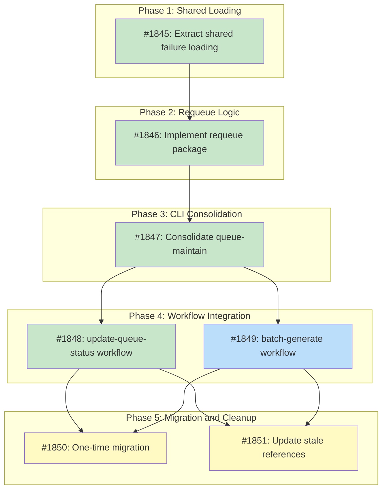

# Requeue Blocked Packages on Recipe Merge

## Status

Planned

Ref #1825

## Implementation Issues

### Milestone: [requeue-on-recipe-merge](https://github.com/tsukumogami/tsuku/milestone/95)

| Issue | Dependencies | Tier |
|-------|--------------|------|
| ~~[#1845: refactor(blocker): extract shared failure loading from reorder package](https://github.com/tsukumogami/tsuku/issues/1845)~~ | ~~None~~ | ~~testable~~ |
| ~~_Move `loadBlockerMap()` and `loadBlockersFromFile()` to `internal/blocker/`, making the failure JSONL loading available to both requeue and reorder. Fixes the 64KB scanner buffer limit during extraction._~~ | | |
| ~~[#1846: feat(requeue): implement requeue package for unblocking queue entries](https://github.com/tsukumogami/tsuku/issues/1846)~~ | ~~[#1845](https://github.com/tsukumogami/tsuku/issues/1845)~~ | ~~testable~~ |
| ~~_Create `internal/requeue/` with the core logic: build a resolved-names set from "success" entries, check each blocked entry's blockers against it, flip to "pending" when all are resolved. Operates on the in-memory queue without I/O._~~ | | |
| ~~[#1847: refactor(cli): consolidate reorder-queue into queue-maintain with requeue](https://github.com/tsukumogami/tsuku/issues/1847)~~ | ~~[#1846](https://github.com/tsukumogami/tsuku/issues/1846)~~ | ~~testable~~ |
| ~~_Rename `cmd/reorder-queue/` to `cmd/queue-maintain/` and wire both requeue and reorder into a single binary. Changes `reorder.Run()` to accept the queue directly for the single-load pattern._~~ | | |
| ~~[#1848: chore(ci): add queue-maintain to update-queue-status workflow](https://github.com/tsukumogami/tsuku/issues/1848)~~ | ~~[#1847](https://github.com/tsukumogami/tsuku/issues/1847)~~ | ~~testable~~ |
| ~~_Extend `update-queue-status.yml` to build and run queue-maintain after marking merged recipes as "success". Produces a second commit that requeues unblocked packages and reorders the queue._~~ | | |
| [#1849: chore(ci): replace requeue-unblocked.sh in batch-generate workflow](https://github.com/tsukumogami/tsuku/issues/1849) | [#1847](https://github.com/tsukumogami/tsuku/issues/1847) | testable |
| _Swap the two `requeue-unblocked.sh` calls in `batch-generate.yml` for queue-maintain, remove the dead `.packages[]` queue update code from the PR step, narrow `git add` to exclude `data/queues/`, and delete the script._ | | |
| [#1850: chore(batch): re-queue all blocked entries for satisfies migration](https://github.com/tsukumogami/tsuku/issues/1850) | [#1848](https://github.com/tsukumogami/tsuku/issues/1848), [#1849](https://github.com/tsukumogami/tsuku/issues/1849) | simple |
| _One-time jq migration that flips all blocked entries to "pending", forcing retries through the satisfies-aware recipe loader to clear stale ecosystem name mismatches._ | | |
| [#1851: docs: update stale references after queue-maintain migration](https://github.com/tsukumogami/tsuku/issues/1851) | [#1848](https://github.com/tsukumogami/tsuku/issues/1848), [#1849](https://github.com/tsukumogami/tsuku/issues/1849) | simple |
| _Update the format mismatch references in `DESIGN-registry-scale-strategy.md`, fix the stale `isValidDependencyName` comment in `orchestrator.go`, and verify the legacy per-ecosystem queue has no remaining consumers._ | | |

### Dependency Graph



**Legend**: Green = done, Blue = ready, Yellow = blocked, Purple = needs-design, Orange = tracks-design

## Context and Problem Statement

The batch pipeline marks packages as "blocked" when their dependencies don't have recipes yet. These blocked entries sit in the unified priority queue until `scripts/requeue-unblocked.sh` runs to check whether the missing recipes have since appeared. But that script only executes during scheduled batch generation runs (roughly hourly), so there's a latency gap: after a PR adds the missing recipe, affected packages stay blocked until the next batch cycle.

For example, PR #1801 added recipes for `gmp` and `openssl@3` (two top blockers). Packages like `aarch64-elf-gcc`, `aarch64-elf-gdb`, and `afflib` remained stuck as "blocked" on the pipeline dashboard for hours after the merge.

The problem is compounded by two issues:

1. **Schema mismatch**: `requeue-unblocked.sh` reads the legacy per-ecosystem queue format (`priority-queue-$ECOSYSTEM.json` with `.packages[]` and `.id`), while the dashboard and `update-queue-status.yml` operate on the unified queue (`priority-queue.json` with `.entries[]` and `.name`). The script can't operate on the unified queue without changes.

2. **Multiple queue writers**: Both `batch-generate.yml` (in its PR creation step) and `update-queue-status.yml` write to `priority-queue.json` with separate concurrency groups (`queue-operations` vs `queue-operations-status-update`). Since the queue is a single JSON blob, concurrent modifications produce git conflicts that `git rebase` can't auto-resolve.

Meanwhile, PR #1820 added `cmd/reorder-queue/`, a Go CLI that reorders queue entries within each priority level by transitive blocking impact. Reordering should run after requeuing (newly unblocked packages need correct placement), and both tools read the same inputs: the unified queue and the failure JSONL directory.

### Scope

**In scope:**
- Consolidating requeue + reorder into a single Go tool (`cmd/queue-maintain/`)
- Making `update-queue-status.yml` the sole owner of queue state on main
- Removing queue writes from `batch-generate.yml`'s PR creation step
- Replacing `requeue-unblocked.sh` calls in `batch-generate.yml` with the new tool
- Retiring `scripts/requeue-unblocked.sh`

**Out of scope:**
- Retiring the per-ecosystem queue format entirely (separate cleanup)
- Restructuring `batch-generate.yml`'s generate/merge job logic
- Dashboard rendering changes

## Decision Drivers

- **Eliminate latency gap**: blocked packages should unblock within minutes of the dependency recipe merging, not hours
- **Fix the format mismatch**: the requeue logic needs to work with the unified queue format
- **Avoid duplication**: `internal/reorder/` already loads failure JSONL and computes blocker maps; requeue logic shouldn't reimplement this
- **Keep it simple**: `update-queue-status.yml` already triggers on recipe merges and has commit/push infrastructure
- **Single writer**: only one workflow should own `priority-queue.json` on main to eliminate concurrent write conflicts

## Implementation Context

### Existing Patterns

**`internal/reorder/reorder.go`**: Loads unified queue via `batch.LoadUnifiedQueue()`, loads failure JSONL via `loadBlockerMap()`, computes transitive blocking scores via `internal/blocker/`, saves via `batch.SaveUnifiedQueue()`. The requeue step needs the same data.

**`update-queue-status.yml`**: Triggers on `push` to `main` with `recipes/**` path filter. Detects changed recipes, finds their queue entries by name, flips status to "success", commits and pushes with retry logic. Uses a GitHub App token for authentication. Concurrency group: `queue-operations-status-update`.

**`batch-generate.yml`**: Calls `requeue-unblocked.sh` in two places (generate job line 125, merge job line 1006). Its PR creation step (lines 1109-1124) attempts to modify `priority-queue.json` to mark generated entries as success/failed, but this code uses `.packages[]` while the unified queue uses `.entries[]` -- the jq expressions silently select nothing and the queue is written unchanged. Concurrency group: `queue-operations`.

### Known Gaps

`DESIGN-registry-scale-strategy.md` documents the requeue format mismatch (lines 213, 754, 995, 1218) as a known quality gap. The concurrent-writer issue is implicitly present but not called out.

## Considered Options

### Decision 1: Implementation Language

The requeue script uses bash with jq to scan failure JSONL for `missing_dep` entries and check recipe existence. The reorder tool uses Go with typed structs, shared packages (`internal/blocker/`, `internal/batch/`), and proper error handling. Both consume the same data.

#### Chosen: Consolidate into Go

Rewrite the requeue logic in Go and combine it with the existing `cmd/reorder-queue/`. This reuses `internal/reorder/`'s failure loading (`loadBlockerMap`), `internal/blocker/`'s transitive computation, and `batch.LoadUnifiedQueue`/`SaveUnifiedQueue` for queue I/O. One binary, one load of the data, one write.

#### Alternatives Considered

**Fix the bash script**: Update `requeue-unblocked.sh` to read `.entries[]`/`.name` instead of `.packages[]`/`.id`. Quick fix but duplicates failure-loading logic that exists in Go, and we'd still need a separate workflow step to run reorder after requeue. Two tools reading the same files in sequence is fragile.

**New standalone Go CLI**: Create `cmd/requeue-unblocked/` as a separate binary. More modular, but since the two operations always run together and share inputs, this adds coordination complexity without benefit.

### Decision 2: CLI Structure

Requeue and reorder are logically sequential: first unblock packages whose dependencies are resolved, then reorder so the newly-unblocked entries are positioned correctly by blocking impact. They share the same inputs (unified queue + failure JSONL). The question is whether to expose them as subcommands or as a single operation.

#### Chosen: Single Command, Always Both

Rename `cmd/reorder-queue/` to `cmd/queue-maintain/`. Running it performs requeue followed by reorder in one pass. No subcommands needed. Add `--skip-requeue` and `--skip-reorder` flags for testing and debugging, but the default path runs both.

This matches how the tool is actually used: workflows don't need to run one without the other. A single command means a single workflow step, a single load of the data, and no risk of running them out of order.

#### Alternatives Considered

**Subcommands**: `queue-maintain requeue`, `queue-maintain reorder`, `queue-maintain all`. More flexible, but adds complexity for operations that should always happen together. If a caller runs `requeue` without `reorder`, the queue ordering is stale.

**Keep name, add flag**: Keep `cmd/reorder-queue`, add `--requeue` flag (default true). Minimal disruption but the binary name becomes misleading since it now does more than reorder.

### Decision 3: Recipe Existence Check

The requeue logic needs to know whether a blocker dependency's recipe now exists. The bash script checks the filesystem (`recipes/{first-letter}/{name}.toml`). But the Go tool already has the full queue loaded, and `update-queue-status.yml` marks merged recipes as "success" in the queue before our tool runs.

#### Chosen: Queue Status Check

A dependency is "resolved" if its name appears in the queue with status "success". The tool loads the full queue and builds a resolved-names set from all "success" entries. For each blocked entry, it checks whether all entries in its `blocked_by` list are in the resolved set. If so, it flips the entry from "blocked" to "pending".

The check is self-contained -- no filesystem access, no recipe loading. `update-queue-status.yml` marks recipes as "success" in the same workflow run before queue-maintain executes, so the queue already reflects the current state.

Embedded recipes (`internal/recipe/recipes/`) don't need special handling: `missing_dep` failures only fire when `tsuku install` can't find a recipe at install time, and embedded recipes are always found. No embedded recipe name appears in `blocked_by` arrays across the failure data.

**Name mismatch handling**: `blocked_by` names in failure records use ecosystem package names (e.g., `"openssl@3"`), which may differ from recipe names (e.g., `"openssl"`). PR #1824 introduced `satisfies` metadata that lets the recipe loader resolve these at install time. This means future batch runs won't produce `missing_dep` failures for names covered by satisfies mappings -- the problem is self-healing in new data. Existing failure records with stale `blocked_by` names will age out as new batch runs replace them. To accelerate this transition, a one-time migration step will re-queue all currently-blocked entries (see Implementation Approach, Phase 5).

#### Alternatives Considered

**Filesystem check**: Look for `recipes/{first-letter}/{name}.toml` or `internal/recipe/recipes/{name}.toml`. Same approach as the bash script. Requires recipe files in the checkout and couples the tool to the directory layout.

**Queue status with satisfies resolution**: Build a satisfies index from recipe metadata so names like `openssl@3` resolve to `openssl`. Rejected because the satisfies-aware loader (PR #1824) already prevents these mismatches from occurring in new failure data, making the resolution logic unnecessary ongoing complexity for a transient problem.

**Both checks**: Check queue status first, fall back to filesystem. Adds complexity for an edge case that doesn't exist in practice (see embedded recipe analysis above).

### Decision 4: Queue Write Ownership

Both `batch-generate.yml` and `update-queue-status.yml` currently write to `priority-queue.json`. They use separate concurrency groups (`queue-operations` vs `queue-operations-status-update`), so concurrent modifications can conflict. The queue is a single JSON blob -- `git rebase` can't auto-resolve conflicts between two independent jq transformations.

#### Chosen: Single Owner

Make `update-queue-status.yml` the sole writer of `priority-queue.json` to main. Remove the queue modification logic from `batch-generate.yml`'s PR creation step (lines 1109-1124 which mark generated entries as success/failed). When a batch PR merges, `update-queue-status.yml` triggers because `recipes/**` changed, and it handles marking those recipes as "success" in the queue.

This eliminates the concurrent-writer problem entirely: one workflow owns the file, so there's no possibility of conflicting writes. The queue reflects what's actually on main (recipe files exist) rather than what was proposed in a PR.

`batch-generate.yml` still calls queue-maintain in its generate and merge jobs for its own working tree (to make requeue/reorder decisions during batch processing), but those changes stay local to the batch run and go into the PR branch via `git add recipes/`. The unified queue changes are NOT included in the batch PR.

#### Alternatives Considered

**Shared concurrency group**: Make both workflows use the same group. Guarantees serialization but blocks recipe status updates for the entire batch run (30+ minutes). Defeats the purpose of fast unblocking.

**Extract queue commit job**: Split queue-writing into a shared job called by both workflows. More correct than today but adds significant workflow complexity. The single-owner pattern achieves the same safety with less machinery.

## Decision Outcome

**Chosen: 1 (Go) + 2 (single command) + 3 (queue status) + 4 (single owner)**

### Summary

We're replacing `scripts/requeue-unblocked.sh` and `cmd/reorder-queue/` with a single `cmd/queue-maintain/` Go CLI that performs both requeue and reorder in one pass. The tool loads the unified queue and failure JSONL data once, scans for blocked entries whose dependencies now have status "success" in the queue, flips them to "pending", then reorders all entries within each priority level by transitive blocking impact. It writes the result back to the unified queue file.

The workflow integration makes `update-queue-status.yml` the single owner of `priority-queue.json` on main. After marking merged recipes as "success" (its existing behavior), it builds and runs `queue-maintain`, which requeues any newly-unblockable packages and reorders the queue. The queue modifications from `batch-generate.yml`'s PR creation step are removed -- when batch PRs merge, `update-queue-status.yml` handles the queue state. `batch-generate.yml` still runs `queue-maintain` locally during its generate and merge jobs (replacing the current `requeue-unblocked.sh` calls), but those queue changes stay in the batch working tree and only the recipe files go into the batch PR.

The requeue logic checks recipe existence via queue status: a blocker is "resolved" if its name appears as a "success" entry in the queue. In `update-queue-status.yml`, the status-update step runs first and marks recipes as "success" before `queue-maintain` executes. In `batch-generate.yml`, the batch orchestrator marks generated recipes in its working tree before `queue-maintain` runs.

Some existing `blocked_by` entries use ecosystem package names (e.g., `"openssl@3"`) that differ from recipe names (e.g., `"openssl"`). The exact-match check won't catch these, but PR #1824's `satisfies` metadata means the recipe loader now resolves these names at install time. Future batch runs won't produce `missing_dep` failures for covered names, so the stale data ages out naturally. To accelerate this, a one-time migration step re-queues all currently-blocked entries so they get retried with the satisfies-aware loader.

### Rationale

Consolidating into Go removes the format mismatch (the shell script's legacy queue format) and eliminates code duplication (both requeue and reorder load the same failure data). The single-command design reflects reality: these operations are always sequential and share inputs, so running them as one avoids coordination overhead. The queue-status check for recipe existence keeps the tool self-contained since it already has the full queue loaded. Making `update-queue-status.yml` the single owner of the queue file on main eliminates the concurrent-writer problem that exists today between two workflows with separate concurrency groups. A one-time migration re-queues all currently-blocked entries to accelerate clearing stale `blocked_by` data that uses ecosystem names not yet covered by the exact-match check.

## Solution Architecture

### New Package: `internal/requeue/`

```go
// Package requeue flips blocked queue entries to pending when their
// missing dependency recipes have been resolved.
package requeue

type Result struct {
    Requeued  int      // Number of entries flipped from blocked to pending
    Remaining int      // Number of entries still blocked
    Details   []Change // Per-entry changes
}

type Change struct {
    Name       string   // Entry name
    ResolvedBy []string // Which blockers were resolved
}

// Run takes the already-loaded queue and failures directory path.
// It modifies the queue in place (caller controls I/O).
func Run(queue *batch.UnifiedQueue, failuresDir string) (*Result, error)
```

The `Run()` function:
1. Loads the blocker map via the shared function in `internal/blocker/`
2. Builds a reverse index: package-to-blockers (inverting the blocker-to-packages map from failure data)
3. Builds a set of "resolved" dependency names from entries in the queue with status "success"
4. For each blocked entry, looks up its blockers (from the reverse index) and checks each against the resolved set
5. If all blockers are resolved, flips status from "blocked" to "pending"
6. Modifies the queue in place, returns the result

### Modified Package: `internal/reorder/`

Extract `loadBlockerMap()` and `loadBlockersFromFile()` into `internal/blocker/` (which already hosts shared blocker computation) so both requeue and reorder can use them. Update `reorder.Run()` to accept `*batch.UnifiedQueue` directly instead of loading from disk, matching the requeue interface. Both packages operate on the same in-memory queue object, loaded once by the CLI.

Note: `loadBlockersFromFile()` uses `bufio.NewScanner` with the default 64KB line limit. Failure JSONL records can approach this limit for large batches. The extraction should increase the buffer: `scanner.Buffer(make([]byte, 0, 64*1024), 1<<20)` or switch to `json.NewDecoder`.

### Modified CLI: `cmd/queue-maintain/`

Rename from `cmd/reorder-queue/`. The main function:

```go
func main() {
    queueFile := flag.String("queue", "data/queues/priority-queue.json", "...")
    failuresDir := flag.String("failures-dir", "data/failures", "...")
    output := flag.String("output", "", "output path (default: overwrite queue)")
    dryRun := flag.Bool("dry-run", false, "...")
    jsonOutput := flag.Bool("json", false, "output as JSON")
    skipRequeue := flag.Bool("skip-requeue", false, "skip requeue step")
    skipReorder := flag.Bool("skip-reorder", false, "skip reorder step")
    flag.Parse()

    // Load queue once
    queue := batch.LoadUnifiedQueue(*queueFile)

    // Step 1: Requeue
    if !*skipRequeue {
        requeueResult := requeue.Run(queue, *failuresDir)
        // Apply requeue changes to queue
    }

    // Step 2: Reorder
    if !*skipReorder {
        reorderResult := reorder.Run(queue, *failuresDir)
        // Apply reorder to queue
    }

    // Write once
    batch.SaveUnifiedQueue(outputPath, queue)
}
```

### Workflow Changes

**`update-queue-status.yml`** -- add after the "Commit queue changes" step:

```yaml
- name: Build queue-maintain
  if: steps.detect.outputs.has_changes == 'true'
  run: go build -o queue-maintain ./cmd/queue-maintain

- name: Run queue maintenance
  if: steps.detect.outputs.has_changes == 'true'
  run: ./queue-maintain

- name: Commit maintenance changes
  if: steps.detect.outputs.has_changes == 'true'
  run: |
    git add data/queues/priority-queue.json
    if git diff --cached --quiet; then
      echo "No maintenance changes"
      exit 0
    fi
    git commit -m "chore(batch): requeue unblocked packages and reorder queue"
    # Push with existing retry logic
```

**`batch-generate.yml`** -- two changes:

1. Replace `./scripts/requeue-unblocked.sh` calls (lines 125 and 1006) with:
   ```yaml
   - name: Build and run queue maintenance
     run: |
       go build -o queue-maintain ./cmd/queue-maintain
       ./queue-maintain
   ```

2. Remove queue status updates from the PR creation step (lines 1109-1124). The batch PR should only include `recipes/` and supporting data files, not `data/queues/priority-queue.json`. Change `git add recipes/ data/ batch-control.json` to exclude the queue file:
   ```yaml
   git add recipes/ data/failures/ data/metrics/ batch-control.json
   ```

**`scripts/requeue-unblocked.sh`** -- delete.

## Implementation Approach

### Phase 1: Extract shared failure loading

Move `loadBlockerMap()` and `loadBlockersFromFile()` from `internal/reorder/` to `internal/blocker/` (which already hosts shared blocker computation). Update `internal/reorder/` to import from the new location. This is a pure refactor with no behavior change.

### Phase 2: Implement `internal/requeue/`

Write the requeue package. It uses the shared blocker map loading from Phase 1 and the queue status check. Test with the existing failure data and queue file.

### Phase 3: Create `cmd/queue-maintain/`

Rename `cmd/reorder-queue/` to `cmd/queue-maintain/`. Wire in both requeue and reorder, with `--skip-requeue` and `--skip-reorder` flags. The default runs both in sequence.

### Phase 4: Update workflows

1. Add queue-maintain build + run steps to `update-queue-status.yml`
2. Replace `requeue-unblocked.sh` calls in `batch-generate.yml` with queue-maintain
3. Remove queue status updates from batch-generate's PR creation step
4. Adjust `git add` in batch-generate to exclude the unified queue file
5. Delete `scripts/requeue-unblocked.sh`

### Phase 5: One-time migration -- re-queue blocked entries

Flip all currently-blocked entries in the unified queue to "pending". This forces the batch pipeline to retry them with the satisfies-aware recipe loader (PR #1824), which resolves ecosystem name mismatches (e.g., `openssl@3` -> `openssl`) at install time. Without this step, entries with stale `blocked_by` names would remain blocked until their old failure records age out naturally.

This is a one-time operation run manually or as part of the first deployment. Since the exact-match requeue logic can't resolve ecosystem name mismatches, the migration uses a direct jq transformation:

```bash
jq '(.entries[] | select(.status == "blocked")).status = "pending"' \
  data/queues/priority-queue.json > tmp.json && mv tmp.json data/queues/priority-queue.json
```

After the migration, the normal requeue logic (exact-match queue status check) handles all future cases correctly because the satisfies-aware loader prevents new `missing_dep` failures for covered ecosystem names.

### Phase 6: Cleanup and documentation

1. Update `DESIGN-registry-scale-strategy.md` to mark the format mismatch as resolved
2. Update the stale comment in `internal/batch/orchestrator.go` (line 543) that references `requeue-unblocked.sh` constructing file paths from dependency names -- the filesystem path rationale no longer applies after migration to queue-status checks
3. Verify nothing reads `priority-queue-homebrew.json` after `requeue-unblocked.sh` is deleted -- if the legacy queue has no remaining consumers, note it for future cleanup

## Security Considerations

### Download verification

Not applicable. This change doesn't download or verify binaries. It only modifies queue state (JSON files in the repository).

### Execution isolation

`queue-maintain` runs as a Go binary in GitHub Actions. It reads JSON files from the repository working tree and writes JSON back. No network access, no shell execution, no elevated permissions. The same security posture as the existing `cmd/reorder-queue/`.

### Supply chain risks

The tool operates on data files committed to the repository. The `blocked_by` values in failure records are populated by the batch orchestrator, which validates dependency names (rejects characters like `/`, `\`, `..`, `<`, `>` to prevent path traversal). Since the queue status check replaces the filesystem check, there's no longer a code path where blocker names are used to construct file paths -- reducing the attack surface compared to the current bash script.

### User data exposure

No user data is accessed or transmitted. The queue and failure data contain package names, ecosystem identifiers, and timestamps. No credentials, tokens, or personal information.

## Consequences

### Positive

- Blocked packages unblock within minutes of dependency recipe merge instead of waiting up to an hour
- Unified queue format used consistently across all tools (eliminates the legacy format mismatch)
- Single Go tool for queue maintenance reduces operational complexity
- Eliminating the concurrent-writer pattern prevents git conflicts between workflows
- Shared blocker map loading means one implementation to maintain

### Negative

- Queue state in batch PRs no longer reflects which recipes the batch successfully generated. The queue updates happen after PR merge via `update-queue-status.yml` instead. This means the batch PR diff won't show queue entry status changes, making it slightly harder to review batch results at a glance.
- Renaming `cmd/reorder-queue/` to `cmd/queue-maintain/` requires updating any documentation or scripts that reference the old name.
- The one-time migration (Phase 5) will flood the batch pipeline with retries for all currently-blocked entries. Most will succeed (dependencies now resolved via satisfies), but some may fail again and re-block. This is a temporary spike, not a permanent cost.
