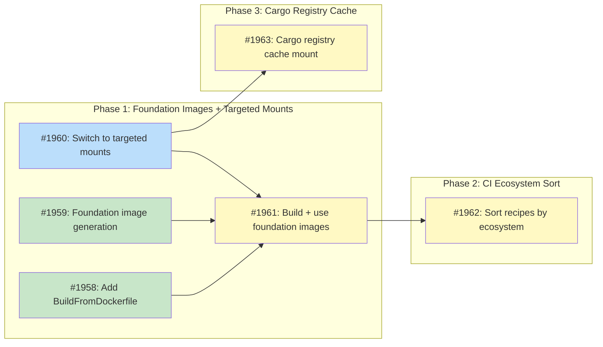

# DESIGN: Sandbox Build Cache

## Status

Planned

## Implementation Issues

### Milestone: [Sandbox Build Cache](https://github.com/tsukumogami/tsuku/milestone/105)

| Issue | Dependencies | Tier |
|-------|--------------|------|
| ~~[#1958: feat(validate): add BuildFromDockerfile to Runtime interface](https://github.com/tsukumogami/tsuku/issues/1958)~~ | ~~None~~ | ~~simple~~ |
| ~~_Adds `BuildFromDockerfile(ctx, imageName, contextDir)` to the `Runtime` interface with implementations in `dockerRuntime` and `podmanRuntime`. Unlike the existing `Build()` method which pipes Dockerfiles via stdin, this reads from a context directory so COPY instructions can reference local files._~~ | | |
| ~~[#1959: feat(sandbox): implement foundation image generation](https://github.com/tsukumogami/tsuku/issues/1959)~~ | ~~None~~ | ~~testable~~ |
| ~~_Creates `internal/sandbox/foundation.go` with pure functions: `FlattenDependencies` (DFS traversal, topological ordering, deduplication), `GenerateFoundationDockerfile` (interleaved COPY+RUN pairs per dependency), and `FoundationImageName` (content-hash based image tags). Each dependency's plan preserves its full subtree -- runtime skip logic handles deduplication._~~ | | |
| [#1960: refactor(sandbox): switch to targeted mounts](https://github.com/tsukumogami/tsuku/issues/1960) | None | critical |
| _Replaces the single broad `/workspace` mount with four targeted mounts (plan.json, sandbox.sh, download cache, output dir). The container's `$TSUKU_HOME` filesystem is no longer shadowed, which is what makes foundation image caching possible. Updates `buildSandboxScript()` and `readVerifyResults()` to use the new output directory. Applies unconditionally to all sandbox runs._ | | |
| [#1961: feat(sandbox): build and use foundation images in sandbox runs](https://github.com/tsukumogami/tsuku/issues/1961) | [#1958](https://github.com/tsukumogami/tsuku/issues/1958), [#1959](https://github.com/tsukumogami/tsuku/issues/1959), [#1960](https://github.com/tsukumogami/tsuku/issues/1960) | critical |
| _Wires the three foundation pieces together: calls `FlattenDependencies` on the plan, generates a Dockerfile, builds the foundation image via `BuildFromDockerfile` (or finds it cached via `ImageExists`), and uses it as the base image for the sandbox run. Includes integration test verifying that a sandbox run with a pre-built foundation image skips dependency installation._ | | |
| [#1962: ci(recipes): sort recipes by ecosystem before batching](https://github.com/tsukumogami/tsuku/issues/1962) | [#1961](https://github.com/tsukumogami/tsuku/issues/1961) | testable |
| _Classifies recipes by ecosystem (cargo_build -> rust, npm_install -> nodejs, etc.) and sorts by ecosystem before applying count-based batching in `test-recipe.yml`. Same-ecosystem recipes land in the same batch job, so foundation images are built once and reused. No change to batch sizes, matrix shape, or test steps._ | | |
| [#1963: feat(sandbox): add cargo registry cache mount](https://github.com/tsukumogami/tsuku/issues/1963) | [#1960](https://github.com/tsukumogami/tsuku/issues/1960) | testable |
| _Adds `WithCargoRegistryCacheDir()` option to `Executor` following the `WithDownloadCacheDir()` pattern. Mounts a shared cargo registry directory into the container so `cargo fetch` results are shared across Linux families within a single recipe run. The sandbox script injects a symlink from `$CARGO_HOME/registry` to the shared mount._ | | |

### Dependency Graph



**Legend**: Green = done, Blue = ready, Yellow = blocked, Purple = needs-design, Orange = tracks-design

## Context and Problem Statement

Tsuku's sandbox runs recipe installations inside isolated containers, one per Linux family. When a recipe uses `cargo_build`, each family container independently:

1. Installs the Rust toolchain (~2-3 minutes)
2. Runs `cargo fetch` to populate the cargo registry (~1-2 minutes)
3. Compiles the entire dependency tree (~10-40 minutes for heavy crates)

For 5 families, that's 5 independent Rust installations and 5 compilations. On CI, heavy crates frequently hit the 60-minute job timeout.

The sandbox currently caches at two levels:

- **Download cache**: Artifacts fetched once, shared across families via read-only volume mount
- **Container image cache**: Images keyed by hash of (base image + system packages), built once per unique package set

Neither level helps with what happens at runtime. The Rust toolchain, cargo registry, and compilation all happen inside ephemeral containers. There's no mechanism to reuse ecosystem setup across sandbox runs.

### How the sandbox works

The sandbox is always invoked with a pre-resolved plan. Even when a user runs `tsuku install --sandbox cargo-nextest` without providing a plan, tsuku generates the plan on the host first (resolving versions, downloading artifacts, computing checksums), then passes the resolved plan into the container. The container runs `tsuku install --plan plan.json --force` -- it never calls version providers or resolves anything.

The plan has a tree structure. `InstallationPlan.Dependencies` contains `DependencyPlan` entries, each with its own `Steps` and potentially nested `Dependencies`. For a cargo_build recipe, the plan typically looks like:

```
InstallationPlan (cargo-nextest v0.24.5)
  Dependencies:
    [0] DependencyPlan (rust v1.82.0)
         Steps: [download, extract, install_binaries, ...]
  Steps: [cargo_build ...]
```

This tree structure maps naturally to Docker image layers. Each dependency in the tree is work that could be cached and reused by other recipes that need the same dependency at the same version.

### Dependency categories

Tsuku has three dependency categories (`ActionDeps` in `actions/action.go`):

- **EvalTime**: Needed during plan generation (host-side, for `Decompose()`). Not relevant to container caching.
- **InstallTime**: Needed during execution. These become `DependencyPlan` entries in the plan tree. This is what should be cached as Docker layers.
- **Runtime**: Tracked but not installed by tsuku during installation. Not relevant here.

### Scope

**In scope:**
- Mapping InstallTime dependencies from the plan to Docker image layers
- Ecosystem-based recipe sorting in CI so foundation images are reused within batch jobs
- Dynamic operation on developer machines (no pre-built images or registry)
- Working with both Docker and Podman

**Out of scope:**
- Sharing compiled artifacts (.rlib files) across families
- Cross-architecture caching (x86_64 vs arm64)
- Changes to how `cargo_build.go` handles CARGO_HOME isolation
- Cross-job foundation image sharing (each CI job builds its own; cross-job caching can be added later via `docker save`/`docker load`)

## Decision Drivers

- **Ecosystem sorting**: Recipes that share the same ecosystem (rust, nodejs) should be adjacent in batches so the ecosystem is installed once per batch, not once per recipe
- **Docker-native**: Use Docker/Podman's layer caching rather than building a parallel cache system
- **Map plan structure to cache structure**: The plan already describes what needs to be installed. The caching mechanism should use this structure directly
- **Preserve family isolation**: Each family builds independently. No sharing of compiled artifacts between different libc environments
- **Works on developer machines too**: A developer running `tsuku install --sandbox` benefits from cached layers without any setup

## Research Findings

### Current Workspace Mount Strategy

The sandbox creates a temp directory on the host and mounts it at `/workspace` (`executor.go:309-313`). This single mount serves multiple purposes: passing `plan.json` and `sandbox.sh` into the container, providing a writable `TSUKU_HOME` at `/workspace/tsuku`, and receiving verification marker files back. The download cache is mounted separately at `/workspace/tsuku/cache/downloads` (read-only).

Because the mount covers all of `/workspace`, anything the Docker image contains at that path is hidden. This means pre-installed tools at `$TSUKU_HOME/tools/` would be shadowed. However, the host only needs a few specific files back from the container (two small verification markers). The installed tools themselves are never read by the host -- the sandbox is a validation mechanism, not an artifact producer. This means the broad mount is unnecessary.

### Docker Layer Caching Mechanics

Each `RUN` command in a Dockerfile creates a layer. Docker caches a layer when (parent layer + command text) haven't changed. Layers are position-sensitive: layer N is cached only if layers 0..N-1 are identical to a previous build. This means dependency ordering matters -- recipes must install dependencies in the same canonical order to maximize shared prefixes.

Both Docker and Podman support this layer caching natively. No BuildKit-specific features are needed.

### Plan Dependencies Are Self-Contained

Each `DependencyPlan` in the plan tree contains fully resolved `Steps` with concrete URLs, versions, and checksums, plus its own nested `Dependencies`. A DependencyPlan can be converted to a standalone `InstallationPlan` (preserving its dependency subtree) and passed to `tsuku install --plan`. Each plan file is complete and valid on its own -- tsuku will install the dependency and all of its transitive deps. The executor's skip logic (`os.Stat` on `$TSUKU_HOME/tools/{name}-{version}/`) means dependencies already installed by previous Docker layers are skipped automatically, so earlier layers handle the deduplication without any plan modification.

### Ecosystem Grouping Enables Layer Reuse

The primary use case is CI, where multiple recipes from the same ecosystem run on the same runner. When recipes are grouped by ecosystem (all cargo_build recipes together, all npm_install recipes together), every recipe in the group produces an identical foundation image. The first recipe builds it; subsequent recipes find it cached via `ImageExists()` and skip the build entirely.

The current recipe registry has ~27 cargo_build/cargo_install recipes and ~52 npm_install/npm_exec recipes. Within each group, most recipes share the same InstallTime dependency (rust or nodejs). A few have extra dependencies (e.g., cargo-audit needs `[rust, zig]`), which produce a different foundation image hash, but the common case is a single shared dep.

Since the tsuku binary is constant within a CI job and all same-ecosystem recipes produce identical plan JSON for their shared dependency, the COPY and RUN layers in the Dockerfile match exactly. Docker's layer caching means the foundation image is built once and reused by all subsequent recipes in the batch.

On GitHub Actions, the Docker layer cache is ephemeral per job. Foundation images are only shared between recipes within the same job, not across jobs. Phase 2 accounts for this by sorting recipes by ecosystem before batching, so same-ecosystem recipes land in the same job naturally.

## Considered Options

### Decision 1: How Should Plan Dependencies Map to Docker Layers?

The plan's `Dependencies` tree contains the work that repeats across recipes. We need to decide how to convert this tree into cacheable Docker image layers.

#### Chosen: One RUN command per dependency in topological order

Flatten the plan's dependency tree via DFS (leaves first, so transitive deps are installed before their dependents) and generate a Dockerfile where each dependency is a separate `RUN` command. Each dependency's plan file is complete -- it includes its own nested dependencies intact. The executor's existing skip logic (`os.Stat` on the tool directory) means transitive deps already installed by earlier layers are skipped automatically. Correctness doesn't depend on ordering; even if the order were wrong, tsuku would install the missing dep rather than fail. But topological order maximizes layer reuse by ensuring shared transitive deps appear as early as possible.

Generated Dockerfile for a recipe that needs Rust 1.82.0 (which itself depends on nothing):

```dockerfile
FROM tsuku/sandbox-cache:debian-{pkg_hash}
COPY tsuku /usr/local/bin/tsuku
ENV TSUKU_HOME=/workspace/tsuku
ENV PATH=/workspace/tsuku/bin:$PATH
COPY plans/dep-00-rust.json /tmp/plans/dep-00-rust.json
RUN tsuku install --plan /tmp/plans/dep-00-rust.json --force
RUN rm -rf /usr/local/bin/tsuku /tmp/plans
```

For a recipe that needs Rust and OpenSSL:

```dockerfile
FROM tsuku/sandbox-cache:debian-{pkg_hash}
COPY tsuku /usr/local/bin/tsuku
ENV TSUKU_HOME=/workspace/tsuku
ENV PATH=/workspace/tsuku/bin:$PATH
COPY plans/dep-00-openssl.json /tmp/plans/dep-00-openssl.json
RUN tsuku install --plan /tmp/plans/dep-00-openssl.json --force
COPY plans/dep-01-rust.json /tmp/plans/dep-01-rust.json
RUN tsuku install --plan /tmp/plans/dep-01-rust.json --force
RUN rm -rf /usr/local/bin/tsuku /tmp/plans
```

Each COPY + RUN pair is interleaved so that Docker's layer cache works per-dependency. COPY creates a layer keyed on the file's content checksum; RUN creates a layer keyed on the command text plus its parent layer. If the rust plan JSON is identical between recipes (same version, same URLs, same checksums), the rust COPY + RUN pair is cached and shared. A recipe with `[openssl, rust]` shares the openssl COPY + RUN prefix with any other recipe that starts with the same openssl dependency, even if subsequent dependencies differ.

Each `RUN` command runs `tsuku install --plan` with a complete plan file (including that dependency's own nested deps). The executor's skip logic (`os.Stat` on `$TSUKU_HOME/tools/{name}-{version}/`) automatically skips transitive deps already installed by previous layers, so each layer only does the work that's actually new. This path choice is explained in Decision 3.

#### Alternatives Considered

**Single foundation image with all deps**: Install all dependencies in one `RUN` command, producing a single foundation image per unique dependency set. Rejected because this prevents layer sharing between recipes with partially overlapping dependency sets. Recipe A needing `[rust]` and recipe B needing `[openssl, rust]` would produce two separate images with no shared layers.

**Docker commit after runtime installation**: Run the plan's dependencies inside a container, then `docker commit` to snapshot the state. Rejected because `runtime.Run()` passes `--rm` (containers are cleaned up automatically), requiring a new container lifecycle. The Dockerfile approach reuses existing `runtime.Build()` infrastructure. Commit-based images are also not reproducible from a Dockerfile.

**BuildKit cache mounts**: Use `RUN --mount=type=cache` for persistent directories across builds. Rejected because Podman support is inconsistent, cache mounts are scoped to a single BuildKit instance (not shared across CI runners), and their contents aren't included in `--cache-from`/`--cache-to` exports.

### Decision 2: How Should Dependencies Be Ordered?

Docker layer caching is position-sensitive. Layer N is cached only if layers 0..N-1 match. The order in which we install dependencies determines which recipes share layers.

#### Chosen: Topological order (DFS, leaves first)

Walk the dependency tree depth-first, emitting leaves before their parents. This guarantees transitive deps are installed before the tools that need them, and maximizes layer prefix sharing between recipes with overlapping dependency subtrees.

Within a single depth level, sort siblings alphabetically for determinism. If rust depends on llvm, the order is `[llvm, rust]` -- llvm first because it's a leaf, not because of alphabetical order (though both happen to agree here). If two deps are independent (no parent-child relationship), alphabetical tiebreaking ensures consistent ordering.

For the most common case (single ecosystem dep like "rust"), all cargo_build recipes produce identical Dockerfiles and share all layers. Correctness doesn't depend on ordering -- tsuku's skip logic handles any order -- but topological order means earlier layers are never wasted.

#### Alternatives Considered

**Alphabetical ordering**: Sort dependencies alphabetically by name. Simpler to reason about, but doesn't respect the dependency graph. If dependency A needs dependency Z, alphabetical order installs A first -- A's steps could fail if they need Z on PATH. While tsuku's skip logic means correctness is recoverable (A's complete plan includes Z, so tsuku would install Z inline), this defeats the purpose of separate layers by hiding transitive deps inside a parent's RUN command rather than giving them their own cached layer.

**Frequency-based ordering**: Sort by how frequently each dependency appears across all recipes (most common first). Rejected because it requires global knowledge of all recipes and changes as the recipe registry grows.

### Decision 3: How Should the Container Exchange Files with the Host?

The sandbox needs to pass files into the container (plan JSON, entrypoint script) and get results back (verification markers). It also provides a download cache. The current implementation mounts a single host directory at `/workspace`, which covers all of these but also shadows the entire `/workspace` path in the container image. This matters for caching: any toolchain pre-installed in the image at `$TSUKU_HOME=/workspace/tsuku` is hidden by the mount.

The core question is whether to keep the broad mount (and work around the shadowing) or switch to targeted mounts (and let the container's filesystem serve as `$TSUKU_HOME`).

#### Chosen: Targeted mounts

Replace the single `/workspace` mount with individual mounts for each file the host needs to exchange:

| Host file | Container path | Mode |
|-----------|---------------|------|
| `plan.json` | `/workspace/plan.json` | read-only |
| `sandbox.sh` | `/workspace/sandbox.sh` | read-only |
| download cache dir | `/workspace/tsuku/cache/downloads` | read-only |
| output dir | `/workspace/output` | read-write |

The container's own filesystem at `/workspace/tsuku/` is not mounted over. The foundation image installs tools to `TSUKU_HOME=/workspace/tsuku` during `docker build`, and those files persist into the sandbox run. The plan executor's existing skip logic (`os.Stat` on `$TSUKU_HOME/tools/{name}-{version}/`) finds pre-installed tools natively -- no symlinks, no alternate paths.

The output directory mount is a new convention. The sandbox script writes verification markers to `/workspace/output/` instead of `/workspace/`. The host reads them from the corresponding host directory after the container exits.

The download cache remains read-only, matching the current behavior. Plan generation on the host pre-fetches all artifacts. The container reads from the cache but doesn't write to it.

This approach requires changing `Executor.Sandbox()` to construct multiple mounts instead of one, and updating `buildSandboxScript()` to write markers to `/workspace/output/`. The `readVerifyResults()` method reads from the new host-side output directory.

Targeted mounts apply unconditionally, regardless of whether a foundation image exists. When a recipe has no InstallTime dependencies, the sandbox still uses targeted mounts -- the container's `$TSUKU_HOME` is simply empty and the script creates the directory structure with `mkdir -p`. One mount strategy for all cases avoids conditional code paths.

#### Alternatives Considered

**Full workspace mount with symlink bridge**: Keep the current single mount at `/workspace`. Install dependencies at `/opt/ecosystem/` during `docker build` to avoid shadowing. At sandbox runtime, create symlinks from `/workspace/tsuku/tools/*` to `/opt/ecosystem/tools/*` before running the plan. Rejected because it introduces a second `TSUKU_HOME`-like directory structure, requires a symlink bridge step in every sandbox run, and adds complexity to the sandbox script. The bridge must also handle `state.json` consistency (each Docker layer writes to `/opt/ecosystem/state.json`, which is separate from the workspace's `state.json`).

**Full workspace mount with executor modification**: Keep the current single mount, install deps at `/opt/ecosystem/`, and modify the plan executor to check both `$TSUKU_HOME/tools/` and `/opt/ecosystem/tools/` when looking for pre-installed dependencies. Rejected because it couples the executor (a general-purpose component) to the sandbox's container filesystem layout. The executor shouldn't know about `/opt/ecosystem/`.

**Volume-mounted toolchain from host**: Install the toolchain to a host directory and mount it into the container at the same path. Rejected because it requires maintaining a host-side toolchain installation per family, and the host filesystem becomes the cache instead of the Docker image store. Cleanup semantics change (host files survive `docker system prune`), and concurrent access from parallel family runs needs coordination.

**Overlay mount on $TSUKU_HOME**: Use Docker/Podman `--mount type=overlay` to overlay a host tmpdir on the image's `/workspace/tsuku`, allowing both the image's pre-installed tools and runtime writes to coexist. Rejected because overlay mounts require kernel overlay filesystem support, have restrictions in rootless Podman configurations, and are not uniformly available across the Docker/Podman versions tsuku targets. Targeted file-level mounts work with any container runtime.

## Decision Outcome

**Chosen: Per-dependency Docker layers with targeted mounts**

### Summary

Each InstallTime dependency in the plan becomes a separate `RUN` command in a generated Dockerfile, sorted alphabetically. The Dockerfile installs dependencies to `TSUKU_HOME=/workspace/tsuku` -- the same path the sandbox uses at runtime. Docker's native layer caching handles cross-recipe reuse: two recipes that both need Rust 1.82.0 on debian share the exact same Rust layer.

The sandbox mount strategy changes from a single broad `/workspace` mount to targeted mounts for specific files. The host mounts `plan.json` (read-only), `sandbox.sh` (read-only), the download cache (read-write), and a small output directory for verification markers (read-write). The container's filesystem at `/workspace/tsuku/` is not mounted over, so tools pre-installed by Docker layers are visible to the plan executor. The executor's existing skip logic (`os.Stat` on `$TSUKU_HOME/tools/{name}-{version}/`) finds them natively.

This eliminates the need for alternate install paths, symlink bridges, or executor modifications. The foundation image and the sandbox run share the same `TSUKU_HOME` path and the same skip mechanism. The only changes to the sandbox are: (1) how mounts are constructed and (2) where verification markers are written.

The primary target is CI. When recipes are grouped by ecosystem (all cargo_build recipes in one batch), the first recipe builds the foundation image (~2-3 minutes for Rust) and every subsequent recipe in the batch reuses it instantly. For a batch of 5 cargo_build recipes across 5 families, this saves ~50 minutes of redundant Rust installations (5 recipes x 5 families x 2 min each, minus the one-time 5 x 2 min initial build).

Developer machines benefit too. The first `tsuku install --sandbox cargo-nextest` builds the Rust layer. Every subsequent cargo_build sandbox run that needs the same Rust version finds it cached. No pre-built images, no registry, no external infrastructure.

The speedup targets toolchain installation and registry fetching. Compilation time (10-40 min per family) remains unaddressed -- each family still compiles independently.

### Rationale

Docker already solves the "don't redo identical work" problem through layer caching. Instead of building a parallel caching system, we generate Dockerfiles that expose the plan's dependency structure as Docker layers.

Targeted mounts make this work cleanly. The broad workspace mount was originally a convenience -- one mount to pass everything in and out. But it created a conflict: the mount shadows the image's filesystem, forcing pre-installed tools into a separate path with a bridge mechanism. By mounting only the specific files the host needs to exchange, the container's `$TSUKU_HOME` lives on its own filesystem where Docker layers can persist content naturally. The executor doesn't need to know about caching at all.

Sorting recipes by ecosystem before batching ensures same-ecosystem recipes land in the same batch job. Since the tsuku binary and dependency plans are identical for same-ecosystem recipes, the Dockerfiles match exactly and Docker's layer cache handles the rest.

## Solution Architecture

### Overview

```
Plan Generation (host)
    |
    v
Extract Dependencies from plan.Dependencies
    |
    v
Flatten + Sort + Generate Standalone Plans
    |
    v
Generate Dockerfile (one RUN per dep, TSUKU_HOME=/workspace/tsuku)
    |
    v
docker build (layer caching handles reuse)
    |
    v
Foundation Image (deps pre-installed at /workspace/tsuku/)
    |
    v
Sandbox Execution (targeted mounts + recipe plan)
    |
    v
Recipe Build Output
```

### Dependency Extraction and Flattening

The plan's `Dependencies` field is a tree of `DependencyPlan` entries. The extraction process:

1. **DFS traversal**: Walk the tree depth-first (leaves first), collecting all dependencies
2. **Deduplication**: If the same tool appears multiple times (shared transitive dep), keep the first occurrence
3. **Sibling sort**: Within the same depth level, sort siblings alphabetically for determinism
4. **Convert**: Each `DependencyPlan` becomes a standalone `InstallationPlan` JSON, preserving its nested `Dependencies` subtree intact. Each plan file is complete and valid -- tsuku can install it independently. The executor's skip logic deduplicates at runtime by checking whether each tool directory already exists from a previous layer
5. **Normalize**: Strip non-deterministic fields (`generated_at` timestamps) from the plan JSON. Docker caches layers based on COPY content, so the plan JSON must be identical across runs for the same logical dependency. If timestamps differ, Docker rebuilds the layer unnecessarily

### Dockerfile Generation

The generated Dockerfile for a debian recipe needing Rust:

```dockerfile
FROM tsuku/sandbox-cache:debian-{pkg_hash}
COPY tsuku /usr/local/bin/tsuku
ENV TSUKU_HOME=/workspace/tsuku
ENV PATH=/workspace/tsuku/bin:$PATH
COPY plans/dep-00-rust.json /tmp/plans/dep-00-rust.json
RUN tsuku install --plan /tmp/plans/dep-00-rust.json --force
RUN rm -rf /usr/local/bin/tsuku /tmp/plans
```

Each dependency gets an interleaved COPY + RUN pair. The COPY layer is keyed on the individual file's content, not the entire `plans/` directory, so adding or removing other dependencies doesn't invalidate earlier COPY + RUN pairs.

The build context directory contains:
```
context/
  Dockerfile
  tsuku              (binary, from host)
  plans/
    dep-00-rust.json (complete plan for rust, including its own deps)
```

Note: `TSUKU_HOME=/workspace/tsuku` matches the path the sandbox uses at runtime. Because the sandbox uses targeted mounts (not a broad mount at `/workspace`), the container's filesystem at this path is preserved from the Docker image layers.

### state.json Consistency

Each `RUN tsuku install --plan` in the Dockerfile writes dependency entries to `$TSUKU_HOME/state.json`. Since Docker layers are sequential, each layer reads the cumulative state from prior layers and appends its entry. The final foundation image contains a `state.json` with entries for all pre-installed dependencies.

At sandbox runtime, the recipe's `tsuku install --plan plan.json --force` reads this `state.json`, finds the dependency entries, and extends it with the recipe's own entry. The sandbox script must not initialize an empty `state.json` or create the `$TSUKU_HOME` directory structure with `mkdir -p` when a foundation image is present -- doing so would clobber the image's accumulated state. The script should only create the directory structure when `$TSUKU_HOME/tools` doesn't already exist.

### Image Naming

Foundation images are tagged for quick existence checks:

```
tsuku/sandbox-foundation:{family}-{hash16}
```

The hash is computed from the generated Dockerfile content (which encodes the full dependency chain). If the Dockerfile is identical, the image tag is identical. This serves as a fast lookup before running `docker build`.

### Targeted Mount Structure

The sandbox constructs these mounts instead of the current single workspace mount:

```go
Mounts: []validate.Mount{
    {Source: planPath,   Target: "/workspace/plan.json",                ReadOnly: true},
    {Source: scriptPath, Target: "/workspace/sandbox.sh",               ReadOnly: true},
    {Source: cacheDir,   Target: "/workspace/tsuku/cache/downloads",    ReadOnly: true},
    {Source: outputDir,  Target: "/workspace/output",                   ReadOnly: false},
},
```

The container's `/workspace/tsuku/tools/`, `/workspace/tsuku/bin/`, and `/workspace/tsuku/state.json` come from the Docker image layers. They're not mounted over.

### Sandbox Script Changes

The sandbox script changes are minimal. The `mkdir -p` setup lines become unnecessary (the foundation image already created the directory structure). Verification markers write to `/workspace/output/` instead of `/workspace/`:

```sh
#!/bin/sh
set -e

# Add TSUKU_HOME/bin to PATH for dependency binaries
export PATH=/workspace/tsuku/bin:$PATH

# Run tsuku install with pre-generated plan
tsuku install --plan /workspace/plan.json --force

# Run verify command and capture results
set +e
export PATH="$TSUKU_HOME/bin:$TSUKU_HOME/tools/current:$PATH"
<verify_command> > /workspace/output/verify.output 2>&1
echo $? > /workspace/output/verify.exit
```

When there's no foundation image (recipe has no InstallTime deps), the container's `/workspace/tsuku/` is empty. The script creates the directory structure conditionally:

```sh
# Create TSUKU_HOME structure if not provided by foundation image
if [ ! -d /workspace/tsuku/tools ]; then
  mkdir -p /workspace/tsuku/recipes /workspace/tsuku/bin /workspace/tsuku/tools
fi
```

This handles both cases with one code path -- targeted mounts are always used, and directory initialization is the only conditional.

### Key Interfaces

```go
// foundation.go (internal/sandbox/)

// FlatDep represents a flattened dependency with its complete plan.
type FlatDep struct {
    Tool    string                      // e.g., "rust"
    Version string                      // e.g., "1.82.0"
    Plan    *executor.InstallationPlan  // complete plan (preserves nested deps)
}

// FlattenDependencies extracts and flattens the dependency tree from a plan.
// Returns dependencies in topological order (leaves first, alphabetical
// tiebreaking within siblings). Each plan preserves its dependency subtree
// intact -- deduplication happens at runtime via the executor's skip logic.
// Strips non-deterministic fields (generated_at) from plans.
func FlattenDependencies(plan *executor.InstallationPlan) []FlatDep

// GenerateFoundationDockerfile creates a Dockerfile for the dependency chain.
func GenerateFoundationDockerfile(packageImage string, deps []FlatDep) string

// FoundationImageName returns the image tag based on Dockerfile content hash.
func FoundationImageName(family string, dockerfile string) string

// BuildFoundationImage builds the foundation image if it doesn't exist.
// Creates a temp build context with the tsuku binary and dependency plans,
// then calls runtime.BuildFromDockerfile().
func (e *Executor) BuildFoundationImage(
    ctx context.Context,
    runtime validate.Runtime,
    packageImage string,
    family string,
    deps []FlatDep,
) (string, error)
```

```go
// runtime.go (internal/validate/) -- additive interface extension

// BuildFromDockerfile builds an image from a Dockerfile in the given context
// directory. The contextDir must contain a Dockerfile and any files referenced
// by COPY instructions. Existing Build() method is unchanged.
BuildFromDockerfile(ctx context.Context, imageName string, contextDir string) error
```

### Data Flow

1. Plan generation on host resolves all versions and produces `InstallationPlan`
2. `FlattenDependencies(plan)` extracts the dependency tree into a topologically ordered flat list (each entry preserves its own dependency subtree)
3. If no deps, skip foundation image build (use package image directly with targeted mounts)
4. `GenerateFoundationDockerfile()` creates the Dockerfile with per-dep RUN commands
5. `FoundationImageName()` hashes the Dockerfile to produce the image tag
6. `runtime.ImageExists()` checks if the image is cached
7. If not cached, `BuildFoundationImage()` creates build context and calls `runtime.Build()`
8. Docker layer caching means only new/changed dependencies are actually built
9. Sandbox constructs targeted mounts (plan, script, cache, output) instead of broad workspace mount
10. Plan executor finds deps at `$TSUKU_HOME/tools/` in the container filesystem, skips reinstallation

## Implementation Approach

### Phase 1: Targeted Mounts and Foundation Images

Two coupled changes: switch to targeted mounts and build foundation images from plan dependencies.

- Create `internal/sandbox/foundation.go` with `FlattenDependencies`, `GenerateFoundationDockerfile`, `FoundationImageName`, `BuildFoundationImage`
- `FlattenDependencies` does DFS traversal of `plan.Dependencies` (leaves first, alphabetical tiebreaking), deduplicates, converts each to a complete `InstallationPlan` JSON preserving its dependency subtree. Runtime deduplication via the executor's skip logic handles overlap between layers
- `GenerateFoundationDockerfile` produces the Dockerfile with interleaved COPY + RUN pairs per dependency (not bulk `COPY plans/`), so Docker's layer cache works per-dependency. Foundation image builds use default Docker network access (required for downloading toolchains during RUN commands)
- Add `BuildFromDockerfile(ctx, imageName, contextDir string) error` to the `Runtime` interface (additive -- existing `Build()` unchanged). Foundation images provide a temp directory containing the Dockerfile, tsuku binary, and plan files as the build context
- Refactor `Executor.Sandbox()` mount construction: use targeted mounts unconditionally (with or without foundation image). When plan has dependencies, build and use foundation image; when plan has no dependencies, use the base package image with targeted mounts
- Update `buildSandboxScript()`: write verification markers to `/workspace/output/` instead of `/workspace/`; emit `mkdir -p` for TSUKU_HOME structure only when `/workspace/tsuku/tools` doesn't already exist (i.e., no foundation image)
- Update `readVerifyResults()` to read from the output directory mount
- Unit tests for dependency flattening, Dockerfile generation, image naming
- Integration test: build foundation image for a recipe with Rust dep, verify that the sandbox run skips Rust installation

### Phase 2: CI Ecosystem Sort

Sort recipes by ecosystem before batching so same-ecosystem recipes land in the same batch naturally.

**Current flow** (after PR #1863): The build step detects changed recipes and splits them into batches by count -- 3 per batch for Linux (5 families in parallel per recipe), 20 per batch for macOS (no containers). Each Linux batch job runs recipes sequentially with families in parallel. Batches are formed without regard to what ecosystem each recipe belongs to.

**Key constraint**: On GitHub Actions, the Docker layer cache is local to the runner and ephemeral per job. Matrix jobs don't share Docker daemons. Foundation images are only reused between recipes within the same batch job. Within a batch, recipes run sequentially (the outer loop waits for all families before starting the next recipe), so there's no build race condition -- recipe 2 always finds recipe 1's foundation images fully built.

**New flow**: Classify each recipe by ecosystem, sort by ecosystem, then apply the existing count-based batching. No structural change to the matrix shape or test step.

1. **Classify**: For each changed recipe, extract the primary ecosystem from the TOML's action types:
   - `cargo_build` or `cargo_install` → rust
   - `npm_install` or `npm_exec` → nodejs
   - `go_build` or `go_install` → go
   - `pipx_install` → python
   - `gem_install` → ruby
   - everything else → none (download-only, no ecosystem dep)

   Classification uses a simple grep on the TOML file for the first `action = "..."` line. No deep TOML parsing needed.

2. **Sort and batch**: Sort recipes by ecosystem, then apply the existing `range(0; length; batch_size)` split. Same-ecosystem recipes cluster into the same batches naturally. Recipes at ecosystem boundaries may share a batch with a different ecosystem -- this is fine, each just builds its own foundation image with no wasted work.

   Example with 8 changed recipes (batch size 3):
   - After sort: [cargo-audit, b3sum, mdbook, serve, prettier, esbuild, fzf, just]
   - Batch 1: cargo-audit, b3sum, mdbook (all rust -- foundation image built once, reused twice)
   - Batch 2: serve, prettier, esbuild (all nodejs -- foundation image built once, reused twice)
   - Batch 3: fzf, just (no ecosystem -- no foundation image needed)

3. **Run**: Unchanged. The test step runs recipes sequentially with families in parallel. Foundation image caching happens inside tsuku's `Executor.Sandbox()`.

Specific changes to `test-recipe.yml`:
- Add an `.ecosystem` field to each recipe entry during detection (grep the TOML for action types)
- Add `sort_by(.ecosystem)` before the existing jq batching logic
- No change to batch sizes, matrix output shape, or test steps
- macOS jobs are unaffected (no containers, no foundation images)

### Phase 3: Cargo Registry Cache

Share cargo registry content across families within a single host.

- Add `WithCargoRegistryCacheDir()` option to `Executor`
- Mount cargo registry cache directory into the container (read-write)
- Update `buildDeterministicCargoEnv()` to symlink `CARGO_HOME/registry` to shared mount when available
- Test registry sharing across families

Phase 1 is the core mechanism. Phase 2 is a small CI change (sort + classify) that turns the mechanism into actual time savings. Phase 3 adds incremental improvement for cargo-specific recipes.

## Security Considerations

### Download Verification

Foundation images contain toolchains installed by tsuku via `tsuku install --plan`. The plan includes checksums computed during host-side plan generation. The same verification logic runs inside the Dockerfile's RUN command as in any normal tsuku installation. Docker layers cache the verified result.

### Execution Isolation

Foundation images run in the same container isolation as current sandbox images. The security boundary (network restrictions, resource limits) is unchanged. Toolchains are baked into the image at `$TSUKU_HOME`, not mounted from the host.

The targeted mount approach reduces the writable surface compared to the current broad mount. The plan, script, and download cache are all mounted read-only (matching the current cache behavior). The only writable mount is the output directory -- a small, dedicated surface for verification markers only. This is a stricter posture than the current broad read-write `/workspace` mount.

The cargo registry mount (Phase 2) is read-write. Mitigation: scoped to a single recipe's multi-family run, and cargo verifies checksums on read.

### Supply Chain Risks

Foundation images are built locally using `runtime.Build()` with generated Dockerfiles. They don't introduce new external dependencies. The tsuku binary is copied into the build context temporarily and removed in the final layer.

The plan JSON files copied into the build context contain URLs and checksums. These are generated by the host-side plan generation, which is the same code path used for non-sandbox installations. A compromised plan could cause tsuku to install a malicious toolchain, but this risk is identical to the current non-cached sandbox flow.

### User Data Exposure

Not applicable. Foundation images contain ecosystem toolchains (compiler binaries, standard libraries). No user-specific data is stored. Environment variables set via `ExtraEnv` in `SandboxRequirements` are applied at sandbox runtime, not during foundation image construction, so credentials don't leak into cached layers.

## Consequences

### Positive

- Toolchain installation happens once per family per version, cached as Docker layers. Subsequent recipes that need the same toolchain start instantly
- Cross-recipe sharing is automatic via Docker's layer caching -- no explicit cache management
- Works dynamically on developer machines with no setup beyond having Docker/Podman
- The plan structure (which already contains the dependency tree) drives the caching -- no parallel bookkeeping
- Generalizes to any ecosystem: npm_install with Node.js, gem_install with Ruby, etc.
- CI batches recipes by ecosystem, so foundation images are built once per batch and reused by all subsequent recipes
- Targeted mounts reduce the writable surface area compared to the current broad workspace mount
- No symlink bridges or alternate install paths -- the executor's existing skip logic works natively

### Negative

- Foundation images consume disk space (~500MB per ecosystem per family). With 5 families and 2 ecosystems, that's ~5GB. Mitigation: stale images pruned when versions change; `docker system prune` for manual cleanup
- Adding `BuildFromDockerfile()` to the `Runtime` interface requires implementation in both `podmanRuntime` and `dockerRuntime`. Mitigation: additive method, existing `Build()` unchanged
- Three image levels (base, package, foundation) increase sandbox executor complexity. Mitigation: foundation images are opt-in; recipes without InstallTime deps see no change
- Targeted mounts require refactoring the existing workspace mount code. The mount strategy applies unconditionally, so all sandbox runs change (not just those with foundation images)
- Compilation time (10-40 min per family) remains unaddressed. The savings target toolchain installation and setup, not the build itself
- Layer ordering is position-sensitive: changing the sort order invalidates all cached layers. Mitigation: alphabetical sort is stable and unlikely to change

### Mitigations

| Risk | Mitigation |
|------|------------|
| Disk usage | Prune stale images; `docker system prune` |
| Foundation image loss | Rebuilt on demand; only costs time |
| Sort order change | Alphabetical is stable; no planned changes |
| Executor complexity | Opt-in; no-op without InstallTime deps |
| Runtime compatibility | Uses Dockerfile-based builds; no BuildKit features |
| Mount refactor risk | Unconditional targeted mounts; single code path for all sandbox runs |
