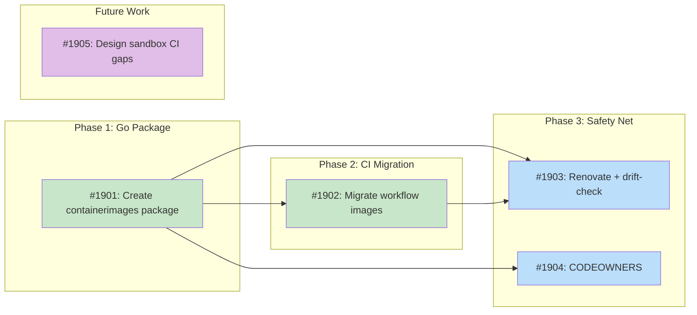

# DESIGN: Sandbox Image Unification

## Status

Planned

## Implementation Issues

### Milestone: [Sandbox Image Unification](https://github.com/tsukumogami/tsuku/milestone/100)

| Issue | Dependencies | Tier |
|-------|--------------|------|
| ~~[#1901: refactor(sandbox): create containerimages package and centralized config](https://github.com/tsukumogami/tsuku/issues/1901)~~ | ~~None~~ | ~~testable~~ |
| ~~_Creates `container-images.json` at the repo root and a new `internal/containerimages/` Go package that embeds it via `go:embed`. Replaces the hardcoded `familyToBaseImage` map and `DefaultSandboxImage` constant, fixing the alpine and suse drift in the process._~~ | | |
| ~~[#1902: ci: migrate workflow container images to centralized config](https://github.com/tsukumogami/tsuku/issues/1902)~~ | ~~[#1901](https://github.com/tsukumogami/tsuku/issues/1901)~~ | ~~testable~~ |
| ~~_With the JSON file from #1901 in place, updates six CI workflows and one test script to read image references via `jq` instead of hardcoding them. Handles three consumption patterns: bash arrays, matrix blocks, and inline docker run commands._~~ | | |
| [#1903: ci: add Renovate config and drift-check CI job](https://github.com/tsukumogami/tsuku/issues/1903) | [#1901](https://github.com/tsukumogami/tsuku/issues/1901), [#1902](https://github.com/tsukumogami/tsuku/issues/1902) | testable |
| _Adds a `renovate.json` with a regex custom manager for automated image version bumps and a CI drift-check job that catches both stale embedded copies and hardcoded image regressions. This is the safety net that keeps the centralization from #1901 and #1902 intact over time._ | | |
| [#1904: chore: add container-images.json to CODEOWNERS](https://github.com/tsukumogami/tsuku/issues/1904) | [#1901](https://github.com/tsukumogami/tsuku/issues/1901) | simple |
| _Protects the centralized config file with the same review requirements as workflow files, mitigating the supply chain risk of a single edit redirecting all container consumers at once._ | | |
| [#1905: docs(sandbox): design sandbox CI integration gaps](https://github.com/tsukumogami/tsuku/issues/1905) | None | simple |
| _Independent design exploration for the three critical gaps (no post-install verification, no env passthrough, no structured results) that prevent replacing CI docker calls with `--sandbox`. This is future work that builds on the unification foundation._ | | |

### Dependency Graph



**Legend**: Green = done, Blue = ready, Yellow = blocked, Purple = needs-design, Orange = tracks-design

## Context and Problem Statement

Tsuku's sandbox system and CI workflows both need container images for each supported Linux family (debian, rhel, arch, alpine, suse). These image references are currently scattered across three independent locations:

1. **Go source** (`internal/sandbox/container_spec.go`): The `familyToBaseImage` map defines images for sandbox testing. Additionally, `requirements.go` hardcodes `DefaultSandboxImage` (`debian:bookworm-slim`) and `SourceBuildSandboxImage` (`ubuntu:22.04`) as fallback images when no target family is specified.
2. **CI workflows** (`.github/workflows/*.yml`): At least 8 workflow files reference container images directly in YAML.
3. **Test scripts** (`test/scripts/test-checksum-pinning.sh`): Shell scripts contain their own family-to-image mappings.

These definitions have already drifted. The Go source specifies `alpine:3.19` and `opensuse/leap:15`, while CI workflows use `alpine:3.21` and `opensuse/tumbleweed`. The test script uses `fedora:39` while everything else uses `fedora:41`. There's no mechanism to detect this drift, and each location must be updated independently.

This matters now because PR #1886 added `--target-family` support to the sandbox, which means sandbox testing depends on the correctness of `familyToBaseImage`. If those images don't match what CI validates against, sandbox results won't reflect real CI behavior.

The broader question is whether `tsuku install --sandbox` can replace direct docker calls in CI entirely, which would eliminate the duplication at its root. If not, we need a way to keep the two in sync.

### Scope

**In scope:**
- Unifying container image version declarations into a single source of truth
- Evaluating whether `--sandbox` can replace CI docker usage
- Enabling automated version updates via Dependabot or Renovate
- Updating `familyToBaseImage` to match current CI images

**Out of scope:**
- macOS testing (not container-based)
- Adding new Linux family support
- Changing which container images are used (e.g., switching from Fedora to RHEL proper)
- The `--linux-family` vs `--target-family` flag naming inconsistency (separate UX issue)
- The `ubuntu:24.04` PPA override in `container_spec.go` (conditional logic that selects Ubuntu when PPA repositories are detected; this is a debian-family build variant, not a family-level image mapping)
- Container image digest pinning (tracked separately in issue #799)

## Decision Drivers

- **Single source of truth**: Image versions must be declared once and consumed everywhere
- **Automated updates**: Dependabot or Renovate should be able to propose version bumps without manual intervention
- **Sandbox parity**: Sandbox testing must use the same images that CI validates against
- **Minimal disruption**: The solution shouldn't require rewriting every CI workflow
- **Correctness over convenience**: If sandbox can't fully replace CI docker calls, don't force it
- **Maintainability**: Future image version bumps should be a single-file change

## Research Findings

### Can Sandbox Replace CI Docker Calls?

An audit of all container image usage across `.github/workflows/` found 22 active container usages across 11 workflows. They break down as:

| Category | Count | Replaceable by --sandbox |
|----------|-------|--------------------------|
| Recipe validation | 12 | 10 fully, 2 partially |
| Build/compile (Rust musl) | 4 | 0 |
| Sandbox infrastructure testing | 3 | 0 |
| Other (image builds, Go tests) | 3 | 0 |

The 12 recipe validation usages all follow the same pattern: start a distro container, install curl/ca-certificates, run `tsuku install --force --recipe <path>`, check the exit code. This is exactly what `--sandbox` does.

But sandbox has three critical gaps that prevent it from replacing CI docker calls today:

1. **No post-install verification.** CI runs `verify-tool.sh` (does the tool execute?) and `verify-binary.sh` (is the binary properly linked?). Sandbox only checks that `tsuku install --plan` exits 0. A recipe could install a broken binary and sandbox would report success.

2. **No environment variable passthrough.** CI passes `GITHUB_TOKEN` (for API rate limits) and `TSUKU_REGISTRY_URL` (for testing PR-branch recipes) into containers. Sandbox hardcodes a fixed set of env vars with no way to add more.

3. **No structured result reporting.** CI produces JSON result files and GitHub step summaries with per-platform status tables. Sandbox returns a Go struct with pass/fail, stdout, and stderr. Any CI workflow using sandbox would need to rebuild all batching, retry, and reporting logic externally.

Additional gaps include no retry logic for transient failures, no multi-recipe batching, and no timeout customization per recipe. The full analysis is in `wip/research/explore_sandbox-capabilities.md`.

**Conclusion: Sandbox is not ready to replace CI docker calls.** The three critical gaps require meaningful sandbox feature work before migration is practical. Addressing them is worthwhile long-term, but it's a separate multi-issue effort.

### Automated Image Updates

Dependabot can update `FROM` directives in Dockerfiles and `docker-compose.yml` files, but it cannot update container image references in:
- GitHub Actions workflow `container:` or `services:` blocks
- Go source code (string constants)
- Arbitrary JSON/TOML/YAML config files
- Shell scripts

This rules out Dependabot for our use case. The image references we need to update live in Go source and workflow YAML, neither of which Dependabot understands.

Renovate's regex custom manager can match and update container image versions in any file type using named capture groups. For example, it can parse `"alpine:3.19"` in a Go map and propose a PR bumping it to `3.21`. But this requires writing custom regex patterns and configuring Renovate (which isn't currently set up for this repo).

A simpler alternative: extract image versions into a single config file that both Go code and CI workflows read. This file is easy to parse with any tool, including Dependabot (if the file is a Dockerfile-like format) or Renovate (with a simple regex). It also means a human updating versions only needs to change one file.

### Current Image Drift

| Family | Go source (`familyToBaseImage`) | CI workflows | Test scripts |
|--------|---------------------------------|-------------|--------------|
| debian | `debian:bookworm-slim` | `debian:bookworm-slim` | `debian:bookworm-slim` |
| rhel | `fedora:41` | `fedora:41` | `fedora:39` |
| arch | `archlinux:base` | `archlinux:base` | N/A |
| alpine | `alpine:3.19` | `alpine:3.21` | `alpine:3.19` |
| suse | `opensuse/leap:15` | `opensuse/tumbleweed` | `opensuse/tumbleweed` |

## Considered Options

### Decision 1: Where Should Container Images Be Defined?

The core problem is that image versions are declared in multiple places with no coupling between them. We need to decide where the single source of truth lives and how consumers read it.

The constraints are: Go code needs the mapping at compile time or runtime, CI workflows need it at job definition time (YAML matrix) or inside script steps, and test scripts need it at runtime. The solution must work for all three consumers without adding significant complexity.

#### Chosen: JSON config file read by Go at compile time and CI at runtime

Create a `container-images.json` file at the repo root that maps family names to container images:

```json
{
  "debian": "debian:bookworm-slim",
  "rhel": "fedora:41",
  "arch": "archlinux:base",
  "alpine": "alpine:3.21",
  "suse": "opensuse/tumbleweed"
}
```

Go code embeds and parses this file at compile time, replacing the hardcoded `familyToBaseImage` map. Since `go:embed` can only access files within the embedding package's directory tree, a small `internal/containerimages/` package owns a copy of the file and exports the parsed map. A `go generate` directive or build-time copy step keeps the embedded copy in sync with the repo root file. CI workflows read the root file with `jq` in script steps. Test scripts use `jq` the same way.

This gives a single file that's trivial to parse in any language, easy for Renovate to match with a regex, and visible at the repo root where contributors will notice it.

#### Alternatives Considered

**Go source as the source of truth with Renovate regex matching.** Keep `familyToBaseImage` in Go and configure Renovate to parse and update the Go map directly using `// renovate: datasource=docker` comment annotations. Rejected because it means CI workflows must either read Go source at runtime (brittle parsing) or continue hardcoding their own values (defeating the purpose). Renovate would update Go but not the 8+ workflow files.

**Dockerfile with FROM directives as the source of truth.** Create a dummy Dockerfile with `FROM alpine:3.21 AS alpine` etc., which Dependabot can natively update. Go and CI parse this file. Rejected because parsing Dockerfile syntax is more complex than JSON, the file's purpose would be confusing to contributors, and Dependabot would propose PRs with diffs that look like they're changing a build step when they're actually changing test configuration.

**Replace all CI docker calls with --sandbox.** Eliminate the duplication by migrating CI to use `tsuku install --sandbox --target-family <family>` everywhere. Rejected because sandbox lacks post-install verification, environment variable passthrough, and structured result reporting. These gaps mean CI would lose the ability to verify that installed tools actually work, hit GitHub API rate limits during version resolution, and lose per-platform result summaries. This is the right long-term direction, but premature today.

### Decision 2: How Should Automated Updates Work?

Once we have a single config file, we need a mechanism to detect when upstream images publish new tags and propose version bumps. The options differ in setup cost and ongoing maintenance.

#### Chosen: Renovate regex custom manager

Configure Renovate to parse `container-images.json` using a regex custom manager:

```json
{
  "customManagers": [
    {
      "customType": "regex",
      "managerFilePatterns": ["container-images.json"],
      "matchStrings": [
        "\"(?<depName>[a-z][a-z0-9./-]+):\\s*(?<currentValue>[a-z0-9][a-z0-9._-]+)\""
      ],
      "datasourceTemplate": "docker"
    }
  ]
}
```

Renovate will propose PRs when new image tags are available (e.g., `alpine:3.21` to `alpine:3.22`). Since all consumers read from `container-images.json`, a single PR updates everything.

#### Alternatives Considered

**Dependabot with a proxy Dockerfile.** Create a Dockerfile that Dependabot can parse, then have a CI step that syncs the Dockerfile versions to JSON. Rejected because it adds an indirect layer (Dockerfile exists only to feed Dependabot), requires a sync step that can itself drift, and Dependabot's Docker ecosystem doesn't understand rolling releases like `opensuse/tumbleweed`.

**Manual updates with a CI drift check.** Skip automated updates entirely. Instead, add a CI job that compares all image references across the codebase and fails if any differ from `container-images.json`. Rejected as the primary approach because it only catches drift after someone introduces it, rather than proactively proposing updates. However, the CI drift check is valuable as a safety net regardless of which automated update mechanism is chosen.

### Decision 3: How Should CI Workflows Consume the Config?

CI workflows currently hardcode images in two patterns: YAML `include` matrices (where the image is a matrix parameter) and inline `docker run` commands in script steps. Both need to read from the config file.

#### Chosen: jq extraction in workflow scripts

Workflows read `container-images.json` with `jq` at the start of jobs that need container images:

```yaml
- name: Load container images
  id: images
  run: |
    echo "debian=$(jq -r '.debian' container-images.json)" >> "$GITHUB_OUTPUT"
    echo "rhel=$(jq -r '.rhel' container-images.json)" >> "$GITHUB_OUTPUT"
    # ... etc
```

For matrix strategies, a setup job reads the file and outputs the image list, which downstream jobs reference via `needs.setup.outputs`.

For inline `docker run` commands, the step reads the variable directly:

```yaml
- run: |
    IMAGE=$(jq -r '.alpine' container-images.json)
    docker run --rm "$IMAGE" sh -c '...'
```

#### Alternatives Considered

**Shell variable file (source-able).** Create `container-images.env` with `ALPINE_IMAGE=alpine:3.21` etc. Workflows source it. Rejected because `.env` files can't be easily read from Go without a parser, and the format doesn't support Renovate's docker datasource matching as cleanly as JSON (Renovate's regex would need to match shell variable syntax).

**GitHub Actions reusable workflow with image inputs.** Create a reusable workflow that accepts family names and resolves images internally. Callers pass family names, not images. Rejected because it would require restructuring every workflow that uses containers, and reusable workflows have limitations around matrix strategies and job containers.

## Decision Outcome

**Chosen: 1A + 2A + 3A**

### Summary

A `container-images.json` file at the repo root becomes the single source of truth for all Linux family container images. A new `internal/containerimages/` package embeds and exports the parsed family-to-image map. The sandbox code imports this package instead of maintaining its own hardcoded `familyToBaseImage` map. The `DefaultSandboxImage` constant in `requirements.go` is replaced by a lookup into this map (the `debian` entry). `SourceBuildSandboxImage` (`ubuntu:22.04`) stays as a hardcoded constant since it's a debian-family build variant for source compilation, not a family-level image. CI workflows read the root file with `jq` in setup steps, populating GitHub Actions outputs that downstream steps and jobs reference. Test scripts use `jq` the same way.

Renovate is configured with a regex custom manager that parses the JSON file's `"image:tag"` patterns against Docker Hub's registry. When a new image tag is available, Renovate proposes a single-file PR that updates the version everywhere at once. Since all consumers read from the same file, there's no sync step and no possibility of drift.

The existing `familyToBaseImage` map in `container_spec.go` is replaced by an import from `internal/containerimages/`. The `DefaultSandboxImage` constant in `requirements.go` becomes a function call (`containerimages.DefaultImage()`) that returns the `debian` entry. `SourceBuildSandboxImage` stays as a constant since it's a build variant, not a family mapping. The usage pattern doesn't change for callers; only where family images are defined does. CI workflows need targeted updates to their image reference patterns, but the actual container commands (install, verify, test) stay the same. The migration is straightforward: create the config file, create the Go package, update the sandbox imports, update workflows to read from JSON, and add Renovate config.

### Rationale

This combination works because JSON is the lowest-common-denominator format that every consumer can parse: Go has `encoding/json` in the standard library, `jq` is available on all GitHub Actions runners, and Renovate's regex can match JSON string patterns. Embedding the JSON via `go:embed` means no runtime file I/O or path resolution in the sandbox code, while `jq` in workflows means no custom tooling or complex shell parsing.

Renovate handles the proactive update side (proposing version bumps), and the single-file approach handles the drift prevention side (there's nothing to drift if there's only one source). The solution doesn't require Renovate to work correctly; manual edits to the JSON file are just as effective. Renovate is an optimization, not a dependency.

We explicitly chose not to force a sandbox migration. The research shows sandbox isn't ready, and trying to make it ready would be a much larger effort that distracts from the immediate drift problem. The config file approach works whether CI uses direct docker calls or --sandbox, so it doesn't close off the sandbox migration path for later.

## Solution Architecture

### Overview

The architecture has three layers: a config file (source of truth), a Go package (compile-time consumer), and CI scripts (runtime consumers). Data flows in one direction: from `container-images.json` outward to all consumers.

```
container-images.json (repo root)
    |
    ├── internal/containerimages/  (go:embed → parsed map)
    |       |
    |       ├── internal/sandbox/container_spec.go  (imports map)
    |       └── internal/sandbox/requirements.go    (imports default image)
    |
    ├── .github/workflows/*.yml  (jq reads at runtime)
    |
    └── test/scripts/*.sh  (jq reads at runtime)
```

### Components

**`container-images.json`** (repo root): Simple flat JSON object mapping family names to full image references. This is the only file that needs editing when updating image versions.

**`internal/containerimages/` package**: New Go package with three responsibilities:
1. Embed `container-images.json` via `go:embed`
2. Parse the JSON into a `map[string]string` on init
3. Export `ImageForFamily(family string) (string, bool)` and `DefaultImage() string`

The JSON file lives inside this package directory so `go:embed` can access it. The repo-root `container-images.json` is the canonical copy; a `//go:generate` directive copies it into the package directory before compilation. This is more reliable than a Makefile step because `go generate ./...` and `go test ./...` both trigger it, covering the direct `go` command paths that bypass `make`.

**Updated sandbox code**: `container_spec.go` replaces `familyToBaseImage` lookups with `containerimages.ImageForFamily()`. `requirements.go` replaces `DefaultSandboxImage` with `containerimages.DefaultImage()`. `SourceBuildSandboxImage` stays as a constant. No API changes for external callers of the sandbox package.

**Updated CI workflows**: Each workflow that references container images adds a step to read `container-images.json` with `jq`. The exact pattern depends on how the workflow uses images:
- Matrix-based workflows: A setup job reads the file and outputs family-to-image mappings
- Script-based workflows: Steps read the file inline with `jq -r '.family'`

**Renovate config** (`renovate.json`): Custom manager targeting `container-images.json` with a regex that extracts `depName` and `currentValue` from the JSON entries.

### Key Interfaces

The `internal/containerimages` package exports:

```go
// ImageForFamily returns the container image for a Linux family.
// Returns the image string and true if found, or empty string and false if the
// family is not configured.
func ImageForFamily(family string) (string, bool)

// DefaultImage returns the default sandbox image (the "debian" entry).
func DefaultImage() string
```

### Data Flow

1. Developer (or Renovate) edits `container-images.json` at the repo root
2. `go generate ./internal/containerimages/...` copies the root file into the package directory
3. `go build` or `make build` embeds the package-local copy into the binary at compile time
4. At runtime, `containerimages.ImageForFamily()` returns the image for a given family
5. CI workflows read the root file with `jq` at job start time
6. Test scripts read the root file with `jq` at script start time

All consumers read from the same version of the file. The embedded copy in Go is synced at build time; CI and scripts always read the root file directly.

## Implementation Approach

### Phase 1: Config File and Go Package

Create the config file and Go package, wire it into the sandbox code.

- Create `container-images.json` at repo root with current CI image versions (fixing the drift)
- Create `internal/containerimages/` package with `//go:generate` copy directive, `go:embed`, parsing, and exported functions (`ImageForFamily`, `DefaultImage`)
- Update `container_spec.go`: replace `familyToBaseImage` lookups with `containerimages.ImageForFamily()`
- Update `requirements.go`: replace `DefaultSandboxImage` with `containerimages.DefaultImage()` (keep `SourceBuildSandboxImage` as a constant)
- Update all tests that reference the old constants or map
- Add `container-images.json` to CODEOWNERS with the same protection as workflow files
- Run `go generate ./... && go test ./...` to verify nothing breaks

### Phase 2: CI Workflow Migration

Update workflows to read from the config file.

- Update `recipe-validation-core.yml`: read images from JSON in setup step
- Update `test-recipe.yml`: read images from JSON
- Update `batch-generate.yml`: read images from JSON
- Update `validate-golden-execution.yml`: read images from JSON
- Update `platform-integration.yml`: read images from JSON
- Update `release.yml`: read Alpine image from JSON
- Update `test/scripts/test-checksum-pinning.sh`: read images from JSON
- Verify each workflow still works by reviewing the generated commands

### Phase 3: Renovate Setup and Safety Net

Configure automated updates and add a drift-prevention CI check.

- Create `renovate.json` with the regex custom manager config
- Add a CI job that:
  - Verifies the embedded copy matches the root file (`go generate ./... && git diff --exit-code`)
  - Greps all workflow files, Go source, and shell scripts for hardcoded image references, failing if any are found outside `container-images.json`
- Document the config file in the repo README or contributing guide

Phases 1 and 2 can ship together or separately. Phase 1 alone fixes Go-side drift and is independently correct. Phase 2 eliminates CI-side drift. Shipping them together is simpler since both changes are small, but separating them reduces PR blast radius. Phase 3 can ship separately since Renovate setup is an operational concern independent of the code changes.

## Security Considerations

### Download Verification

This design doesn't change how container images are pulled. Images use the same mutable tag-based resolution as before (e.g., `alpine:3.21` resolves to whatever the latest build of that tag is). The design doesn't introduce digest pinning; that's tracked separately in issue #799. The residual risk from mutable tags is accepted for now: the same tag can point to different image contents over time, meaning "the same images" is approximate. This is the same risk that exists today.

### Execution Isolation

Not applicable. The sandbox execution model (container with mounted binary, plan, and cache) is unchanged. The same images run with the same isolation parameters. Moving the image string from a Go constant to a JSON file doesn't change what the container does.

### Supply Chain Risks

Centralizing image references in one file changes the blast radius of tampering. Today, compromising the Alpine image in Go source doesn't affect CI's Alpine validation (since they're independent). After this change, a single edit to `container-images.json` redirects sandbox, CI, and test scripts simultaneously. This is the tradeoff of centralization: it eliminates drift but amplifies the impact of a single compromised edit.

Mitigations:
- Add `container-images.json` to CODEOWNERS with the same review requirements as workflow files. This ensures the same humans who review workflow changes review image version changes.
- Renovate PRs that bump image versions go through the normal review process. CI runs tests against the proposed images before merge, catching obvious breakage.
- The Phase 3 CI drift-check job detects hardcoded image references that bypass the config file, preventing someone from silently reintroducing scattered definitions.

Residual risk: if an upstream registry is compromised and a malicious image is published under a legitimate tag, Renovate (or a human) could merge a version bump to that image. This risk exists today and isn't worsened by this design. Digest pinning (issue #799) would mitigate it.

### User Data Exposure

Not applicable. Container image names are not user data. The JSON file contains only public image references (e.g., `debian:bookworm-slim`) that are already visible in the Go source and YAML files. No user-specific data is accessed, stored, or transmitted.

## Consequences

### Positive

- Image versions are declared once, eliminating the drift that already exists between Go source, CI, and test scripts
- Version bumps become a single-file edit instead of coordinating changes across 10+ files
- Renovate can automate version bumps with a simple regex config
- The sandbox and CI are guaranteed to use the same images, making sandbox results meaningful
- The approach doesn't block future sandbox migration; when sandbox is ready to replace CI docker calls, it already reads from the same config

### Negative

- The `//go:generate` copy step adds a build-process dependency. If someone edits the root JSON but forgets to run `go generate`, the embedded copy will be stale. Mitigation: CI runs `go generate ./... && git diff --exit-code` to catch this, and the Makefile runs generate automatically.
- CI workflows become slightly more verbose (adding `jq` extraction steps). Mitigation: the patterns are simple and repetitive; a reusable action could reduce boilerplate later if needed.
- Renovate requires initial setup and ongoing maintenance (GitHub App installation, config file). Mitigation: Renovate is optional. The core design works with manual updates. Phase 3 can be deferred if Renovate setup is impractical.

### Mitigations

| Risk | Mitigation |
|------|------------|
| Embedded JSON copy gets stale | CI staleness check (`go generate && git diff --exit-code`); Makefile runs generate |
| Centralized tampering amplification | CODEOWNERS protection on `container-images.json` |
| Workflow verbosity from jq steps | Pattern is simple and consistent across workflows |
| Renovate setup overhead | Renovate is Phase 3 and optional; core design works without it |
| Hardcoded references sneak back in | CI drift-check job (Phase 3) greps for hardcoded images |
