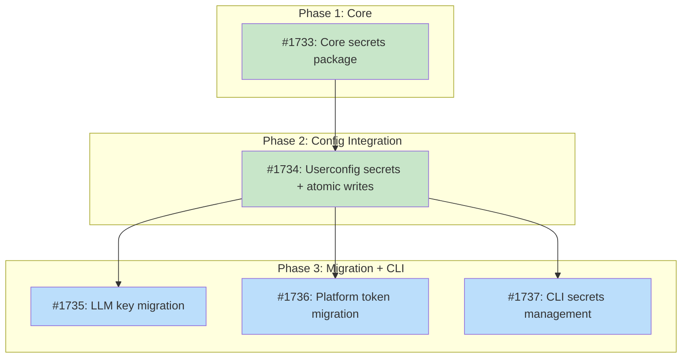

# Design Document: Secrets Manager

## Status

Planned

## Implementation Issues

### Milestone: [secrets-manager](https://github.com/tsukumogami/tsuku/milestone/86)

| Issue | Dependencies | Tier |
|-------|--------------|------|
| ~~[#1733: feat(secrets): add core secrets resolution package](https://github.com/tsukumogami/tsuku/issues/1733)~~ | ~~None~~ | ~~testable~~ |
| ~~_Creates the `internal/secrets` package with `Get()`, `IsSet()`, and `KnownKeys()` functions plus the `KeySpec` table mapping secret names to env var aliases. Resolves from env vars only; config file fallback is wired in #1734._~~ | | |
| ~~[#1734: feat(userconfig): add secrets section with atomic writes and 0600 permissions](https://github.com/tsukumogami/tsuku/issues/1734)~~ | ~~[#1733](https://github.com/tsukumogami/tsuku/issues/1733)~~ | ~~critical~~ |
| ~~_Extends `userconfig.Config` with a `Secrets` map, switches all config writes to atomic temp+rename with unconditional 0600 permissions, adds a permission warning on read, and wires `secrets.Get()` to fall through to config file on env var miss._~~ | | |
| [#1735: refactor(llm): migrate API key resolution to secrets package](https://github.com/tsukumogami/tsuku/issues/1735) | [#1734](https://github.com/tsukumogami/tsuku/issues/1734) | testable |
| _Replaces direct `os.Getenv()` calls in `claude.go`, `gemini.go`, and `factory.go` with `secrets.Get()` and `secrets.IsSet()`. Removes Gemini's manual two-variable fallback logic since the alias table handles it._ | | |
| [#1736: refactor: migrate platform tokens to secrets package](https://github.com/tsukumogami/tsuku/issues/1736) | [#1734](https://github.com/tsukumogami/tsuku/issues/1734) | testable |
| _Migrates `GITHUB_TOKEN`, `TAVILY_API_KEY`, and `BRAVE_API_KEY` access across discover, version, builders, and search packages. Updates error messages to mention both env var and config file options._ | | |
| [#1737: feat(cli): add secrets management to tsuku config](https://github.com/tsukumogami/tsuku/issues/1737) | [#1734](https://github.com/tsukumogami/tsuku/issues/1734) | testable |
| _Adds stdin-based secret input to `tsuku config set`, status-only display for `tsuku config get`, and a Secrets section in `tsuku config` output showing all known keys with set/not-set status._ | | |

### Dependency Graph



**Legend**: Green = done, Blue = ready, Yellow = blocked, Purple = needs-design, Orange = tracks-design

## Upstream Design Reference

This design implements the secrets management component described in [DESIGN-llm-builder-infrastructure.md](current/DESIGN-llm-builder-infrastructure.md), which specifies `internal/secrets/manager.go` as a Slice 4 deliverable.

**Relevant sections:**
- Secrets Manager: "Resolution order: env var, config file `[secrets]`, error"
- Slice 4 deliverable: "API key resolution with 0600 permission enforcement"

## Context and Problem Statement

Tsuku's LLM features require API keys for cloud providers (Anthropic, Google/Gemini). Today, each provider reads its key directly from `os.Getenv()` in its own constructor. This pattern has three problems.

First, there's no centralized resolution. The Claude provider checks `ANTHROPIC_API_KEY`, the Gemini provider checks both `GOOGLE_API_KEY` and `GEMINI_API_KEY`, and the discovery module checks `GITHUB_TOKEN`. Each call site handles missing keys differently, and error messages vary. Adding a new provider means duplicating the same env-var-check pattern in yet another file.

Second, environment variables are the only option. Some users prefer storing keys in a config file rather than managing shell exports or dotfiles. This is especially true for users who work across multiple terminals or use tools that don't inherit shell environment consistently.

Third, when a config file is eventually added, it needs permission enforcement. API keys stored in plaintext files must be readable only by the owning user (0600). The current `config.toml` infrastructure uses `os.Create()` with default umask, which typically produces 0644 files readable by anyone on the system.

### Scope

**In scope:**
- New `internal/secrets` package with centralized key resolution
- Resolution order: environment variable, then config file, then error
- `[secrets]` section in `$TSUKU_HOME/config.toml`
- Permission enforcement (0600) for config files containing secrets
- Refactoring existing `os.Getenv()` calls to use the new package (LLM providers, GitHub token, search API keys)
- `tsuku config` integration for setting/viewing secrets
- Support for keys with multiple env var aliases (e.g., `GOOGLE_API_KEY` / `GEMINI_API_KEY`)

**Out of scope:**
- External secret manager integration (keychain, 1Password, pass)
- Secret rotation or expiration
- Encryption at rest (beyond file permissions)
- Shared `$TSUKU_HOME` installations (multi-user). This design assumes single-user ownership of `$TSUKU_HOME`, which is the standard setup. Tightening permissions to 0600 would break shared installations; those users should use environment variables instead.

## Decision Drivers

- **Env vars take priority**: Follows 12-factor app conventions and existing user workflows
- **File permissions must be strict**: API keys in plaintext files need 0600 enforcement
- **Single resolution path**: All callers get keys through one interface, not ad-hoc env lookups
- **Minimal new dependencies**: Use existing TOML infrastructure (`BurntSushi/toml` already in use)
- **Config file optional**: Users who prefer env vars shouldn't need to create a config file
- **Consistent error guidance**: When a key is missing, tell the user both ways to set it

## Considered Options

### Decision 1: Secret Storage Location

Secrets need a persistent store alongside environment variables. The question is whether to put them in the existing `config.toml` or in a separate file. This matters because `config.toml` already exists with non-secret settings (telemetry, LLM preferences) and may have been created with permissive file modes. Mixing secrets into the same file means either tightening permissions on a file that didn't previously need them, or accepting that non-secret config inherits secret-level restrictions.

The upstream design specified a `[secrets]` section in `config.toml`, which is the simplest approach. But a separate secrets file avoids the permission tension entirely.

#### Chosen: `[secrets]` section in existing `config.toml`

Add a `[secrets]` TOML table to the existing config file. Always write `config.toml` with 0600 permissions, regardless of whether secrets are present. No user needs other-readable access to their tsuku config, and unconditional 0600 eliminates edge cases around detecting whether secrets are present. This keeps configuration in one place and matches what the upstream design specified.

The secrets manager reads `config.toml` through the existing `userconfig` infrastructure, adding a `Secrets map[string]string` field to the `Config` struct. The write path uses `os.OpenFile(..., 0600)` unconditionally.

Key mappings use a convention: the TOML key `anthropic_api_key` in `[secrets]` maps to the environment variable `ANTHROPIC_API_KEY` (uppercase with same name). For keys with multiple env var names (like Google's `GOOGLE_API_KEY` / `GEMINI_API_KEY`), the secrets manager maintains a small alias table so that looking up `google_api_key` also checks the `GEMINI_API_KEY` env var as a fallback. The alias table is defined in code, not in the config file.

#### Alternatives Considered

**Separate `$TSUKU_HOME/secrets.toml` file**: Store secrets in a dedicated file with 0600 permissions, keeping `config.toml` for non-sensitive settings.
Rejected because it adds a second config file users must manage, complicates the `tsuku config` CLI (which file does `tsuku config set` target?), and the upstream design explicitly specifies `config.toml [secrets]`. There's no permission tension since we write 0600 unconditionally.

**Encrypted file with passphrase**: Encrypt secrets at rest using a user-provided passphrase.
Rejected because it adds significant complexity (key derivation, passphrase prompting, error recovery for forgotten passphrases) for marginal benefit. File permissions are sufficient for a single-user tool, and users wanting stronger protection can use external secret managers (future work).

### Decision 2: Permission Enforcement Strategy

When `config.toml` gains a `[secrets]` section, the file needs 0600 permissions. But existing installations may already have a `config.toml` created with default permissions (typically 0644). The question is what to do when the manager detects an existing file with overly permissive modes.

This matters because silently tightening permissions could surprise users who've set up specific file access patterns, while refusing to read is disruptive for an otherwise working setup.

#### Chosen: Always write 0600, warn on permissive reads

Always write `config.toml` with 0600 permissions, unconditionally. Don't try to detect whether secrets are present; there's no user-facing reason for `config.toml` to be world-readable, and making permission enforcement unconditional eliminates edge cases. On read, if the file has permissions wider than 0600, log a warning ("config.toml has permissions %o, will be tightened to 0600 on next write").

This approach is pragmatic: reads always succeed (so existing setups don't break), and the file gets tightened on the next write regardless of content. The warning gives users visibility.

#### Alternatives Considered

**Refuse to read permissive files**: Error if `config.toml` has permissions wider than 0600 when a `[secrets]` section exists.
Rejected because it would break existing setups that add secrets for the first time. The user sets a key via `tsuku config set secrets.anthropic_api_key ...`, but then the next read fails because the file was created earlier with 0644. This creates a frustrating workflow where users must manually `chmod` before the tool works.

**Always enforce 0600 on every read/write**: Tighten permissions on every file access, including reads.
Rejected because reads should be side-effect-free. Changing file permissions during a read operation violates the principle of least surprise. Enforcement on write is the natural place for mutations, and the warning on read gives users a heads-up without modifying anything underfoot.

## Decision Outcome

**Chosen: 1A + 2A**

### Summary

We're adding an `internal/secrets` package that provides a single `Get(name string) (string, error)` function for resolving API keys. Every call site that currently does `os.Getenv("SOME_API_KEY")` will switch to `secrets.Get("some_api_key")` instead. The resolution order is: check environment variable first, then check the `[secrets]` section in `$TSUKU_HOME/config.toml`, then return an error with guidance on both methods.

The package defines a `KeySpec` for each known secret, mapping it to one or more environment variable names. For example, `google_api_key` maps to `["GOOGLE_API_KEY", "GEMINI_API_KEY"]`, checked in order. Requesting an unregistered key returns an error. The config file side is simpler: the `[secrets]` table is a flat key-value map parsed from `config.toml` via the existing `userconfig` package.

File permissions are enforced unconditionally. `userconfig.Save()` always writes `config.toml` with `os.OpenFile(..., 0600)` and atomic writes (temp file + rename) to prevent mid-write corruption. On read, if the file has permissions wider than 0600, a warning is logged but reading proceeds normally.

The `tsuku config` CLI gets new commands: `tsuku config set secrets.anthropic_api_key` (no value argument) prompts for the value via stdin, avoiding shell history exposure. Piping is also supported: `echo sk-ant-... | tsuku config set secrets.anthropic_api_key`. `tsuku config get secrets.anthropic_api_key` shows `(set)` or `(not set)` without revealing the value. The existing `tsuku config` display will show status for all known secrets.

### Rationale

Using `config.toml` with a `[secrets]` section keeps the user-facing configuration in one file and aligns with the upstream design specification. Writing 0600 unconditionally (not just when secrets are present) eliminates conditional permission logic and is benign for a single-user tool. Atomic writes protect against mid-write corruption.

The alias table for multi-env-var keys (Google's two variable names) is the simplest way to handle the edge case without overcomplicating the mapping convention. Defining specs in code rather than configuration means the set of known secrets is versioned with the binary.

### Trade-offs Accepted

By choosing this option, we accept:
- `config.toml` always gets 0600 permissions, even if no secrets are stored yet
- The alias table is hardcoded, so adding new env var aliases requires a code change
- No encryption at rest; an attacker with the user's file access can read the keys
- Secret values must be entered via stdin, not command-line arguments

These are acceptable because tsuku assumes single-user `$TSUKU_HOME` ownership, alias changes coincide with new provider support anyway, file permissions match what tools like `~/.aws/credentials` and `~/.config/gh/hosts.yml` provide, and stdin-based input is the standard pattern for credential tools.

## Solution Architecture

### Overview

The secrets manager is a thin resolution layer between callers (LLM providers, discovery, search) and secret sources (environment variables, config file). It doesn't own storage. It reads from env vars directly and delegates config file access to the existing `userconfig` package.

### Components

```
┌─────────────┐     ┌──────────────────┐     ┌────────────────┐
│  LLM Factory│────▶│  secrets.Get()   │────▶│  os.Getenv()   │
│  Discovery  │     │                  │     └────────────────┘
│  Search     │     │  KeySpec table   │            │ miss
│  Config CLI │     │  (aliases, desc) │            ▼
└─────────────┘     └──────────────────┘     ┌────────────────┐
                            │                │  userconfig    │
                            │                │  .Load()       │
                            ▼                │  [secrets] map │
                     ┌──────────────────┐    └────────────────┘
                     │  Error with      │
                     │  guidance msg    │
                     └──────────────────┘
```

### Key Interfaces

**`internal/secrets/secrets.go`** -- the public API:

```go
// Get resolves a secret by name, checking env vars then config file.
// Returns the value or an error with guidance on how to set it.
func Get(name string) (string, error)

// IsSet checks whether a secret is available without returning its value.
func IsSet(name string) bool

// KnownKeys returns metadata for all registered secrets.
func KnownKeys() []KeyInfo

// KeyInfo describes a registered secret.
type KeyInfo struct {
    Name    string   // Config key name (e.g., "anthropic_api_key")
    EnvVars []string // Environment variables checked, in order
    Desc    string   // Human-readable description
}
```

**`internal/secrets/specs.go`** -- the key registry:

```go
// KeySpec defines how to resolve a specific secret.
type KeySpec struct {
    EnvVars []string // Env vars to check, in priority order
    Desc    string   // Description for error messages and CLI display
}

// Known secrets. Adding a new key is one line here.
var knownKeys = map[string]KeySpec{
    "anthropic_api_key": {
        EnvVars: []string{"ANTHROPIC_API_KEY"},
        Desc:    "Anthropic API key for Claude",
    },
    "google_api_key": {
        EnvVars: []string{"GOOGLE_API_KEY", "GEMINI_API_KEY"},
        Desc:    "Google API key for Gemini",
    },
    "github_token": {
        EnvVars: []string{"GITHUB_TOKEN"},
        Desc:    "GitHub personal access token",
    },
    "tavily_api_key": {
        EnvVars: []string{"TAVILY_API_KEY"},
        Desc:    "Tavily search API key",
    },
    "brave_api_key": {
        EnvVars: []string{"BRAVE_API_KEY"},
        Desc:    "Brave search API key",
    },
}
```

### Data Flow

**Config loading.** The secrets package loads `userconfig` lazily via `sync.Once` on the first `Get()` or `IsSet()` call. This avoids disk I/O until a secret is actually needed, and subsequent calls reuse the cached config. The `internal/secrets` package is a read-only resolution layer. All writes go through `userconfig` (via the CLI).

**Resolution on `Get("anthropic_api_key")`:**

1. Look up `"anthropic_api_key"` in `knownKeys` to get `KeySpec{EnvVars: ["ANTHROPIC_API_KEY"]}`
2. Check `os.Getenv("ANTHROPIC_API_KEY")`. If non-empty, return it.
3. Load userconfig (via `sync.Once`) and check `config.Secrets["anthropic_api_key"]`. If non-empty, return it.
4. Return error: `"anthropic_api_key not found. Set ANTHROPIC_API_KEY environment variable or add anthropic_api_key to [secrets] in $TSUKU_HOME/config.toml"`

**Resolution for unknown keys:** Returns an error immediately. All secrets tsuku needs are registered in `knownKeys` at compile time.

**Config file write path** (`tsuku config set secrets.anthropic_api_key`):

1. If no value on command line, read from stdin (prompt "Enter value for anthropic_api_key: " if terminal, raw read if piped)
2. `userconfig.Load()` reads existing config
3. Set `config.Secrets["anthropic_api_key"] = value`
4. Write to temp file with `os.OpenFile(tmpPath, os.O_CREATE|os.O_WRONLY, 0600)`
5. `os.Rename(tmpPath, configPath)` for atomic replacement

### Changes to Existing Code

**`internal/userconfig/userconfig.go`:**
- Add `Secrets map[string]string \`toml:"secrets"\`` field to `Config` struct
- Update `saveToPath()` to always use atomic writes with 0600 permissions
- Add permission check on read that logs a warning via `internal/log`
- Handle `secrets.*` key prefix in `Get()`/`Set()` by delegating to the `Secrets` map

**`internal/llm/claude.go`:**
- Replace `os.Getenv("ANTHROPIC_API_KEY")` with `secrets.Get("anthropic_api_key")`

**`internal/llm/gemini.go`:**
- Replace dual `os.Getenv("GOOGLE_API_KEY")` / `os.Getenv("GEMINI_API_KEY")` with `secrets.Get("google_api_key")`

**`internal/llm/factory.go`:**
- Replace env var checks with `secrets.IsSet()` for provider detection

**`internal/discover/llm_discovery.go`:**
- Replace `os.Getenv("GITHUB_TOKEN")` with `secrets.Get("github_token")`

**`internal/discover/validate.go`:**
- Replace `os.Getenv("GITHUB_TOKEN")` with `secrets.Get("github_token")`

**`internal/version/resolver.go`:**
- Replace `os.Getenv("GITHUB_TOKEN")` with `secrets.Get("github_token")`

**`internal/version/provider_tap.go`:**
- Replace `os.Getenv("GITHUB_TOKEN")` with `secrets.Get("github_token")`

**`internal/builders/github_release.go`:**
- Replace `os.Getenv("GITHUB_TOKEN")` with `secrets.Get("github_token")`

**`internal/search/factory.go`:**
- Replace `os.Getenv("TAVILY_API_KEY")` and `os.Getenv("BRAVE_API_KEY")` with `secrets.Get()`

**`cmd/tsuku/config.go`:**
- Add secret status display (show `(set)` / `(not set)` for each known key)
- Route `secrets.*` keys through the `[secrets]` section in get/set operations
- Read secret values from stdin when setting (not command-line args) to avoid shell history exposure

## Implementation Approach

### Phase 1: Core Package and Interface

Build `internal/secrets` with `Get()`, `IsSet()`, `KnownKeys()`, and the key spec table. Initially resolve from env vars only (no config file integration). This is useful on its own because it centralizes resolution and provides consistent error messages.

- Create `internal/secrets/secrets.go` and `internal/secrets/specs.go`
- Use `sync.Once` for lazy config loading
- Add tests for env var resolution, alias handling, unknown key rejection, error messages

### Phase 2: Config File Integration

Extend `userconfig.Config` with the `Secrets` map and update the write path for atomic writes with 0600 permissions.

- Add `Secrets map[string]string` to userconfig
- Change `saveToPath()` to always use atomic write (temp file + rename) with 0600
- Add permission checking on read with warning
- Wire `secrets.Get()` to fall through to userconfig on env var miss
- Add tests for config file resolution, permission enforcement, atomic writes

### Phase 3a: Internal Caller Migration

Replace scattered `os.Getenv()` calls with `secrets.Get()` / `secrets.IsSet()` in internal packages.

- Update `llm/claude.go`, `llm/gemini.go`, `llm/factory.go` for LLM API keys
- Update `discover/llm_discovery.go`, `discover/validate.go` for `GITHUB_TOKEN`
- Update `version/resolver.go`, `version/provider_tap.go` for `GITHUB_TOKEN`
- Update `builders/github_release.go` for `GITHUB_TOKEN`
- Update `search/factory.go` for `TAVILY_API_KEY`, `BRAVE_API_KEY`
- Update error messages in any `errmsg` or error templates that reference "Set GITHUB_TOKEN environment variable" to also mention config file
- Verify all existing tests still pass

### Phase 3b: CLI Integration

Update the `tsuku config` command for secret management.

- Add stdin/prompt reading for `tsuku config set secrets.*` (avoid shell history exposure)
- Show `(set)` / `(not set)` status for all known secrets in `tsuku config` display
- Route `secrets.*` prefix in `Get()`/`Set()` to the `Secrets` map via prefix matching

## Consequences

### Positive

- All API key resolution goes through one code path with consistent behavior
- Users get a config file option without losing env var support
- Error messages always tell users both ways to set a key
- Adding a new secret is a one-line addition to the specs table
- Config file permissions are enforced to prevent accidental exposure

### Negative

- `config.toml` always gets 0600 permissions, even without secrets (benign since it's single-user)
- `userconfig.Save()` becomes more complex (atomic writes, permission enforcement)
- The `knownKeys` table must be maintained as new providers are added
- Setting secrets via CLI requires stdin instead of command-line args (slight UX friction)

### Mitigations

- Unconditional 0600 is actually simpler than conditional logic and benign for single-user installations
- Atomic write logic is isolated and well-tested; the `userconfig` public API doesn't change
- Each new provider already requires a code change (new builder/provider); adding one line to `knownKeys` is trivial overhead
- Stdin-based input is standard for credential tools (`gh auth login`, `aws configure`) and supports piping for automation

## Security Considerations

### Download Verification

Not applicable. This feature doesn't download external artifacts. The secrets manager reads local environment variables and a local config file. No network requests are made during secret resolution.

### Execution Isolation

The secrets manager requires read access to `$TSUKU_HOME/config.toml` and write access when setting secrets via CLI. It also calls `os.Stat()` to check file permissions and `os.Chmod()` (indirectly via atomic write) to set 0600 on new files.

No elevated privileges are needed. All operations happen within the user's home directory with normal user permissions. The `os.Rename()` call for atomic writes requires that the temp file and target are on the same filesystem, which is guaranteed since both are under `$TSUKU_HOME`.

### Supply Chain Risks

Not directly applicable since this feature doesn't fetch external artifacts. However, the secrets it manages (API keys) are used by downstream features that do make external requests. Two risks:

**API key leakage via config file permissions.** The primary supply chain risk is that a config file with weak permissions exposes API keys to other users on the system. Mitigation: enforce 0600 on write, warn on read if permissions are too open.

**API key exposure in process environment.** Environment variables are visible to processes running as the same user (e.g., via `/proc/<pid>/environ` on Linux). This is inherent to env var-based secrets and not something this design changes. We document this as a known limitation and recommend config file storage for users concerned about it.

### User Data Exposure

The secrets manager handles API keys, which are sensitive credentials. Specific protections:

**No logging of secret values.** The `Get()` function returns values to callers but never logs them. Error messages reference key names, not values. The `tsuku config get secrets.*` command shows `(set)` or `(not set)`, never the actual key.

**No external transmission.** The secrets manager itself never sends data over the network. It's a local resolution layer. The callers (LLM providers, discovery) transmit keys in API requests, but that's their responsibility and unchanged by this design.

**Config file at rest.** Secrets stored in `config.toml` are plaintext. Protection relies entirely on file permissions (0600). This matches the approach of `~/.aws/credentials`, `~/.config/gh/hosts.yml`, and `~/.netrc`. Users wanting stronger protection should use environment variables sourced from a password manager or external secret store.

### Mitigations

| Risk | Mitigation | Residual Risk |
|------|------------|---------------|
| Config file readable by other users | 0600 enforcement on write, warning on read | Brief window between first secret write and permission tightening if file already existed |
| Secret values in process memory | Standard Go string handling; no pinning or wiping | API keys exist as Go strings in heap memory until GC collects them |
| Atomic write failure leaves temp file | Temp file created in same directory with 0600 | Partial write produces orphan temp file, not a corrupted config |
| Error messages leak key names | Key names (not values) appear in errors | Key names like "anthropic_api_key" are not themselves sensitive |
| Malicious recipe reads config file | Recipes run in sandboxed containers without access to `$TSUKU_HOME/config.toml` | A recipe with shell actions running outside sandbox could read the file; sandbox enforcement is the mitigation (separate design) |
| Secret values in shell history | Stdin-based input for `tsuku config set secrets.*` | Users who pipe values (`echo key \| tsuku config set ...`) still leave traces; this is documented |
