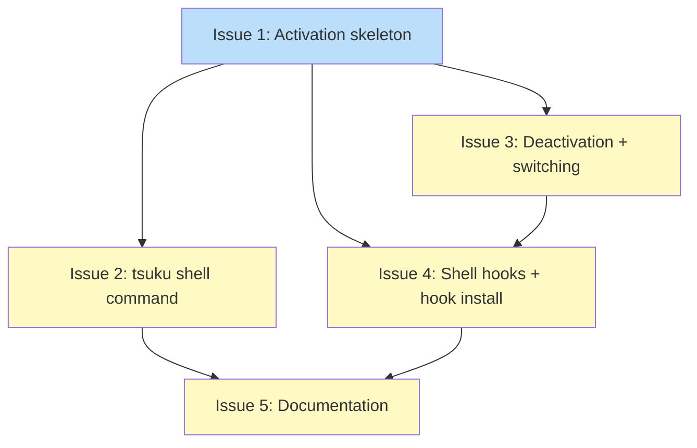

# DESIGN: Shell Environment Activation

## Status

Planned

## Implementation Issues

Implementation tracked in [PLAN: Shell Environment Activation](../plans/PLAN-shell-env-activation.md).

### Dependency Graph



**Legend**: Green = done, Blue = ready, Yellow = blocked

## Upstream Design Reference

Parent: [DESIGN: Shell Integration Building Blocks](DESIGN-shell-integration-building-blocks.md)
Block 5 in the six-block architecture. This design specifies dynamic PATH modification based on project configuration for per-directory tool version activation. Consumes the `ProjectConfig` interface from Block 4 (#1680, implemented in `internal/project`).

## Context and Problem Statement

Tsuku currently manages tool versions globally. `tsuku activate <tool> <version>` switches a symlink in `$TSUKU_HOME/tools/current/`, and `tsuku shellenv` adds that directory to PATH. This works for single-tool switching but doesn't handle the per-project use case: a developer working on project A needs Go 1.22, but project B needs Go 1.21. Switching between them requires manual `tsuku activate` calls every time they change directories.

With Block 4 implemented, projects can declare their tool requirements in `.tsuku.toml`. But the config is only consumed by `tsuku install` (batch install) -- there's no mechanism to automatically activate the right tool versions when entering a project directory.

Shell environment activation bridges this gap. When a developer enters a project directory (or runs `tsuku shell`), tsuku reads `.tsuku.toml` and modifies PATH to point to the project's declared tool versions instead of the global `tools/current/` symlinks. When they leave, PATH reverts.

### Scope

**In scope:**
- Activation mechanism (prompt hooks and explicit `tsuku shell` command)
- PATH modification strategy (prepending project tool paths)
- State tracking (env vars for directory and original PATH)
- Deactivation behavior (restoring original PATH on leaving project)
- Shell-specific implementations (bash, zsh, fish)
- Integration with existing `shellenv`, `activate`, and `hook install` commands
- `EnvActivator` interface specification

**Out of scope:**
- Auto-install during activation (Block 6, #2168)
- Environment variable management beyond PATH
- Windows support
- LLM integration

### Existing Infrastructure

- `tsuku shellenv` -- static `export PATH="$TSUKU_HOME/bin:$TSUKU_HOME/tools/current:$PATH"`
- `tsuku activate <tool> <version>` -- creates symlinks in `tools/current/`
- Shell hooks in `internal/hooks/` -- bash/zsh/fish for command-not-found only
- `tsuku hook install` -- appends source lines to shell config files
- `internal/project.LoadProjectConfig(startDir)` -- discovers and parses `.tsuku.toml`
- `internal/config.Config.ToolDir(name, version)` -- returns `$TSUKU_HOME/tools/{name}-{version}`

## Decision Drivers

- **Performance**: Shell hooks must complete in under 50ms per prompt; the fast path (no directory change) should be under 5ms
- **Correctness**: PATH must reflect the project's declared tools accurately; stale state is worse than no activation
- **Reversibility**: Deactivation must cleanly restore the original PATH without residue
- **Shell hooks are optional**: `tsuku shell` must work as an explicit alternative to prompt hooks
- **Compatibility**: Must coexist with existing `shellenv` output, `activate` command, and command-not-found hooks
- **Simplicity**: Prefer the simplest mechanism that delivers correct behavior
- **Cross-shell**: Must work on bash, zsh, and fish

## Considered Options

### Decision 1: Activation Mechanism

Tsuku needs to detect when a user enters a project directory and activate the right tool versions. The mechanism must fire reliably on directory changes, perform well on every prompt, and remain optional.

Three approaches exist in the ecosystem: prompt hooks (mise, direnv), cd wrappers, and shims (asdf). The key tension is between reliability (catching all directory changes) and simplicity (minimal shell integration).

Key assumptions:
- Fork+exec cost for `tsuku hook-env` stays under 5ms on modern Linux/macOS
- `.tsuku.toml` config lookup completes under 10ms
- Users accept a one-time `tsuku hook install` setup step for automatic activation

#### Chosen: Prompt Hook with Early-Exit Guard

Use a single prompt-based hook per shell (`PROMPT_COMMAND` for bash, `precmd` for zsh, `fish_prompt` event for fish) that calls `tsuku hook-env`. The hook-env command compares `$PWD` against a cached directory (`$_TSUKU_DIR`), exits immediately if unchanged, and only performs config lookup + PATH rewrite on actual directory changes.

The early-exit optimization means the per-prompt cost when the directory hasn't changed is: one fork+exec (~2-4ms), one string comparison, exit with empty stdout. The shell's `eval` of empty output is a no-op.

Hooks are opt-in, installed via `tsuku hook install --activate`. An explicit `tsuku shell` command provides identical activation logic without hooks.

#### Alternatives Considered

**cd/pushd/popd wrapper**: Wrap directory-changing builtins to trigger activation at the moment of change. Rejected because it misses directory changes from external sources (git worktree switches, subshells, CDPATH), cd wrapping conflicts with other tools (rvm, nvm), and fish doesn't have an equivalent mechanism. The prompt hook with early-exit has identical practical performance without the correctness gaps.

**Dual hooks (chpwd + precmd)**: Use zsh's `chpwd_functions` for immediate activation, plus `precmd` as a safety net. This is what mise does. Rejected because the added complexity (two hook points per shell, divergent implementations per shell) doesn't deliver meaningful benefit over a single prompt hook with early-exit. The sub-millisecond latency difference is imperceptible.

**Shim-based resolution (no hooks)**: Like asdf, use shim scripts that resolve versions per-invocation. Rejected because the per-invocation overhead (20-50ms per tool execution) violates the performance constraint, breaks `argv[0]` inspection for multi-call binaries, and confuses `which` output. Shims are better suited for Block 6 (project-aware exec wrapper).

### Decision 2: PATH Modification and State Tracking

When activation fires (directory changed, `.tsuku.toml` found), tsuku must modify PATH so project-declared tool versions shadow their global counterparts. When deactivation fires (leaving a project directory), PATH must revert cleanly.

The three sub-questions are coupled: the PATH strategy determines what state to track, and the state format determines how deactivation works. Modifying `tools/current/` symlinks is off the table -- those are shared filesystem state that would affect every terminal.

Key assumptions:
- Per-project state must be per-shell (env vars, not files)
- The number of project-declared tools is small enough (5-15, max 256) that PATH won't hit shell limits
- PATH modifications by other tools between activation and deactivation are rare

#### Chosen: Prepend Project Paths + Save/Restore Original PATH

When `hook-env` detects a directory change:

1. **Save the clean PATH.** If `_TSUKU_PREV_PATH` is unset (first activation), store current `PATH`. If already set (switching projects), use the stored value as base.
2. **Read `.tsuku.toml`.** Call `LoadProjectConfig($PWD)`.
3. **Resolve tool bin directories.** For each tool in config, compute `$TSUKU_HOME/tools/{name}-{version}/bin`. Skip tools whose version isn't installed.
4. **Build new PATH.** `{project-tool-bins}:{_TSUKU_PREV_PATH}`. Project bins go before everything, including `$TSUKU_HOME/bin` and `tools/current/`.
5. **Output shell commands.** `export PATH="..."`, `export _TSUKU_DIR="..."`, and on first activation `export _TSUKU_PREV_PATH="..."`.

On **deactivation** (no `.tsuku.toml` found): restore `PATH` from `_TSUKU_PREV_PATH`, unset both tracking variables.

On **project-to-project transition**: use `_TSUKU_PREV_PATH` as base (not current PATH), prepend new project's bins.

State variables:

| Variable | Purpose | Lifetime |
|----------|---------|----------|
| `_TSUKU_DIR` | Last-seen directory for early-exit guard | Set on activation, unset on deactivation |
| `_TSUKU_PREV_PATH` | Complete PATH before any project activation | Set on first activation, unset on deactivation |

#### Alternatives Considered

**Replace tools/current/ symlinks**: Avoid PATH modification by repointing symlinks to project versions. Rejected because symlinks are shared filesystem state -- changing them in one terminal affects every other terminal. Abnormal shell exit leaves symlinks pointing at wrong versions with no recovery.

**Prepend + surgical removal (stored entry list)**: Track which PATH entries tsuku added and filter them out on deactivation. More resilient to other tools modifying PATH mid-session. Rejected because the filtering logic (substring matching, duplicate handling, colon boundaries) adds complexity for a rare edge case.

**File-based state tracking**: Store activation state in `$TSUKU_HOME/active/{pid}.json`. Rejected because files can go stale on abnormal exit, require garbage collection, and add filesystem I/O to the hot path.

### Decision 3: Integration with Existing Shell Infrastructure

Tsuku has several shell integration touch-points: `shellenv` (static PATH), `activate` (per-tool symlinks), `hook install` (command-not-found hooks), and hook files (`internal/hooks/`). The new activation feature must work with all of them without breaking existing behavior.

Key assumptions:
- `tsuku hook-env` can complete in under 50ms
- Prompt hooks can be installed alongside command-not-found hooks without conflicts
- The marker-block pattern in `hook install` can support a second marker

#### Chosen: Hybrid -- New `tsuku shell` + Extended `hook install --activate`

Add new functionality through new commands and a flag, leaving existing commands unchanged:

| Component | Change |
|-----------|--------|
| `tsuku shellenv` | Unchanged. Static PATH. |
| `tsuku activate <tool> <version>` | Unchanged. Global symlinks. |
| `tsuku hook install` | Extended: `--activate` flag installs prompt hooks alongside command-not-found hooks |
| Shell hook files | New: activation hook scripts (tsuku-activate.{bash,zsh,fish}) |
| **New: `tsuku shell`** | User-facing command for explicit one-shot activation |
| **New: `tsuku hook-env`** | Internal subcommand called by prompt hooks, outputs activation/deactivation diff |

`tsuku shell` reads `.tsuku.toml` from the current directory and outputs shell code to set PATH. Usage: `eval $(tsuku shell)`. It's a one-shot command, not a hook.

`tsuku hook-env` is the optimized version called by prompt hooks. It checks `_TSUKU_DIR` for early exit and only emits output when PATH needs to change.

#### Alternatives Considered

**Extend shellenv with --activate**: Make `shellenv` directory-aware. Rejected because it breaks shellenv's contract of static, deterministic output. `shellenv` runs once at login, while activation runs per-prompt -- conflating these execution models confuses both the implementation and the user.

**activate --project mode**: Extend `activate` to read `.tsuku.toml`. Rejected because `activate` operates on the filesystem (symlinks), while project activation operates on shell state (PATH exports). Different mechanisms shouldn't share a command.

## Decision Outcome

**Chosen: Prompt hooks with early-exit, env-var state tracking, hybrid explicit/automatic activation**

### Summary

Shell environment activation adds three new commands: `tsuku shell` (explicit activation), `tsuku hook-env` (prompt hook entry point), and `tsuku hook install --activate` (opt-in prompt hook setup). Existing commands (`shellenv`, `activate`) are untouched.

When a user enters a project directory with `.tsuku.toml`, `hook-env` reads the config and prepends per-project tool bin paths to PATH. For a project declaring `go = "1.22"` and `node = "20.16.0"`, PATH becomes `$TSUKU_HOME/tools/go-1.22.5/bin:$TSUKU_HOME/tools/nodejs-20.16.0/bin:{original PATH}`. Tools declared in the project shadow their global counterparts; undeclared tools fall through to `tools/current/` as before.

State lives in two shell env vars: `_TSUKU_DIR` (last-seen directory, for early-exit) and `_TSUKU_PREV_PATH` (original PATH before activation, for clean deactivation). On deactivation (leaving a project directory), PATH restores exactly. On project-to-project transition, `_TSUKU_PREV_PATH` stays as the base while the new project's paths replace the old.

The prompt hook fires on every prompt but exits in under 5ms when the directory hasn't changed (fork+exec + string comparison, no filesystem I/O). On directory change, the full path costs ~10-15ms (config lookup + PATH construction). Both are well within the 50ms budget.

### Rationale

The three decisions form a coherent stack. Prompt hooks (D1) provide the trigger. Prepend + save/restore (D2) provides the mechanism. The hybrid integration (D3) provides the user interface. Each layer is the simplest correct option at its level.

Prompt hooks over cd-wrappers because they catch all directory changes. Prepend + full PATH save over surgical filtering because it's simpler and guarantees clean restoration. New commands over extending existing ones because the execution models are fundamentally different (per-prompt vs one-shot vs filesystem).

### Trade-offs Accepted

- **Fork+exec on every prompt**: Even with early-exit, each prompt pays ~2-4ms for spawning `tsuku hook-env`. This is acceptable (mise and direnv do the same) but not free.
- **PATH changes by other tools lost on deactivation**: If another tool modifies PATH while a project is active, deactivation restores the pre-activation PATH, losing those changes. Uncommon in practice.
- **Version must be installed**: Activation only works for already-installed versions. If `.tsuku.toml` declares `go = "1.22"` but Go 1.22 isn't installed, that tool is silently skipped. Block 6 (#2168) handles install-on-demand.

## Solution Architecture

### Overview

Shell environment activation adds a new `internal/shellenv` package that computes per-project PATH modifications, a `tsuku hook-env` subcommand for prompt hooks, a `tsuku shell` command for explicit activation, and updated hook scripts in `internal/hooks/`.

### Components

```
┌─────────────────────────────────────────────────────────────────┐
│                         User Shell                              │
│  ┌────────────────────┐    ┌────────────────────┐              │
│  │ Prompt hook        │    │ eval $(tsuku shell) │              │
│  │ (_tsuku_hook)      │    │ (explicit)          │              │
│  └────────┬───────────┘    └────────┬────────────┘              │
└───────────┼──────────────────────────┼──────────────────────────┘
            │                          │
            ▼                          ▼
┌───────────────────────┐    ┌────────────────────┐
│ tsuku hook-env <shell>│    │ tsuku shell         │
│ (fast-path check)     │    │ (one-shot)          │
└───────────┬───────────┘    └────────┬────────────┘
            │                          │
            ▼                          ▼
┌─────────────────────────────────────────────────────────────────┐
│                 internal/shellenv/activate.go                    │
│                                                                  │
│  ComputeActivation(cwd, prevPath, curDir)                       │
│    -> reads .tsuku.toml via project.LoadProjectConfig            │
│    -> resolves tool bin dirs via config.ToolDir                  │
│    -> returns ActivationResult{PATH, Dir, PrevPath, Exports}    │
│                                                                  │
│  FormatShellExports(result, shell)                              │
│    -> formats export/set statements for bash/zsh/fish            │
└─────────────────────────────────────────────────────────────────┘
            │                          │
            ▼                          ▼
┌──────────────────────┐    ┌──────────────────────┐
│ internal/project     │    │ internal/config      │
│ LoadProjectConfig    │    │ Config.ToolDir       │
│ (existing)           │    │ (existing)           │
└──────────────────────┘    └──────────────────────┘
```

### Key Interfaces

```go
package shellenv

// ActivationResult holds the computed PATH and state for shell export.
type ActivationResult struct {
    PATH     string   // new PATH value
    Dir      string   // project directory (for _TSUKU_DIR)
    PrevPath string   // original PATH to save (for _TSUKU_PREV_PATH)
    Active   bool     // true if a project is active, false if deactivating
    Skipped  []string // tools skipped (version not installed)
}

// ComputeActivation determines what PATH should be based on the
// current directory and previous activation state.
//
// cwd: current working directory
// prevPath: value of _TSUKU_PREV_PATH (empty if no prior activation)
// curDir: value of _TSUKU_DIR (empty if no prior activation)
//
// Returns nil if no change is needed (same directory).
func ComputeActivation(cwd, prevPath, curDir string) (*ActivationResult, error)

// FormatExports renders the ActivationResult as shell-specific
// export/unset statements.
func FormatExports(result *ActivationResult, shell string) string
```

**New CLI commands:**

```go
// cmd/tsuku/shell.go
// tsuku shell -- outputs activation shell code for current directory
var shellCmd = &cobra.Command{Use: "shell", ...}

// cmd/tsuku/hook_env.go
// tsuku hook-env <shell> -- prompt hook entry point with early-exit
var hookEnvCmd = &cobra.Command{Use: "hook-env", Hidden: true, ...}
```

**Updated hook files:**

```
internal/hooks/tsuku-activate.bash  -- prompt hook for bash
internal/hooks/tsuku-activate.zsh   -- prompt hook for zsh
internal/hooks/tsuku-activate.fish  -- prompt hook for fish
```

### Data Flow

**Flow 1: Automatic activation (prompt hook)**

```
1. User cds into project directory
2. Next prompt triggers _tsuku_hook
3. Hook calls: tsuku hook-env bash
4. hook-env reads $_TSUKU_DIR, compares with $PWD
5. If same: exit (no output, <5ms)
6. If different: call ComputeActivation(cwd, prevPath, curDir)
7. ComputeActivation calls LoadProjectConfig(cwd)
8. If .tsuku.toml found: resolve tool dirs, build PATH, return result
9. If no .tsuku.toml and was active: return deactivation result
10. hook-env calls FormatExports(result, "bash")
11. Hook evals the output: export PATH="...", export _TSUKU_DIR="..."
```

**Flow 2: Explicit activation (tsuku shell)**

```
1. User runs: eval $(tsuku shell)
2. shell command calls ComputeActivation(cwd, "", "")
3. Same resolution as above but always runs (no early-exit)
4. Outputs shell code to stdout
5. Shell evals it
```

**Flow 3: Deactivation (leaving project)**

```
1. User cds out of project (no .tsuku.toml in new location)
2. Prompt hook fires, hook-env detects directory change
3. ComputeActivation finds no config, sees _TSUKU_PREV_PATH is set
4. Returns: PATH=_TSUKU_PREV_PATH, Active=false
5. Output: export PATH="$original"; unset _TSUKU_DIR _TSUKU_PREV_PATH
```

## Implementation Approach

### Phase 1: Core Activation Logic (`internal/shellenv`)

Build `ComputeActivation` and `FormatExports`. Pure logic, no CLI integration.

Deliverables:
- `internal/shellenv/activate.go`: `ComputeActivation`, `FormatExports`, `ActivationResult`
- `internal/shellenv/activate_test.go`: Tests for activation, deactivation, project-to-project, skipped tools, early-exit

### Phase 2: CLI Commands

Add `tsuku shell` and `tsuku hook-env` commands.

Deliverables:
- `cmd/tsuku/shell.go`: Cobra command, calls `ComputeActivation` + `FormatExports`
- `cmd/tsuku/hook_env.go`: Hidden Cobra command with early-exit optimization
- Tests for both commands

### Phase 3: Shell Hook Scripts

Create activation hook scripts and extend `hook install`.

Deliverables:
- `internal/hooks/tsuku-activate.bash`: `_tsuku_hook` function on `PROMPT_COMMAND`
- `internal/hooks/tsuku-activate.zsh`: `_tsuku_hook` on `precmd_functions`
- `internal/hooks/tsuku-activate.fish`: `_tsuku_hook` on `fish_prompt` event
- `internal/hooks/embed.go`: updated to embed new hook files
- Updated `hook install` with `--activate` flag
- `internal/hook/install.go`: new marker block for activation hooks

### Phase 4: Documentation

Update CLI help and user-facing docs.

Deliverables:
- Help text for `tsuku shell`, `tsuku hook-env`, updated `tsuku hook install`
- Getting started guide updates

## Security Considerations

### PATH Manipulation Safety

The primary security surface is PATH modification. A malicious `.tsuku.toml` could reference tool names that, when resolved to `$TSUKU_HOME/tools/{name}-{version}/bin`, prepend unexpected directories to PATH. However, the resolution only produces paths within `$TSUKU_HOME/tools/`, which is a controlled directory. Path traversal in tool names is already guarded by the install pipeline's name validation.

**Mitigations:**
- Tool bin directories are always under `$TSUKU_HOME/tools/` -- no arbitrary path injection
- Activation only references already-installed tools; it doesn't trigger downloads
- The existing name validation in the install pipeline prevents path traversal characters in tool names

### Prompt Hook Safety

Shell hooks execute with user privileges on every prompt. The hooks invoke `tsuku hook-env` as a subprocess (not eval'd shell code), limiting the attack surface.

**Mitigations:**
- Hooks call `tsuku hook-env` as a subprocess, not via `eval` of untrusted content
- The hook-env output is structured (export/unset statements with validated values)
- Hook installation uses marker blocks for clean install/uninstall

### Untrusted Repository Config

Same concern as Block 4: cloning a repo with `.tsuku.toml` and running `tsuku hook install --activate` means the repo author influences your PATH. Unlike `tsuku install` (which requires explicit invocation), prompt hooks activate automatically on directory entry.

**Mitigations:**
- Prompt hooks are opt-in (`tsuku hook install --activate`), not default
- Activation only references installed tools -- it can't install new ones
- `TSUKU_CEILING_PATHS` prevents traversal into untrusted parent directories
- Tools that aren't installed are silently skipped, not fetched

### Mitigations Summary

| Risk | Severity | Mitigation | Residual Risk |
|------|----------|------------|---------------|
| PATH injection via malicious .tsuku.toml | Low | All paths constrained to $TSUKU_HOME/tools/, name validation | Tool names with unusual characters could construct unexpected paths |
| Auto-activation in cloned repos | Medium | Hooks are opt-in, only installed tools activate | User may not realize activation affects their PATH in untrusted repos |
| Prompt hook eval of hook-env output | Low | Structured output (export/unset only), subprocess invocation | If tsuku binary is compromised, hook-env output is arbitrary |
| _TSUKU_PREV_PATH tampering | Low | Graceful handling when variable is missing | User could inject malicious PATH via env var manipulation |

## Consequences

### Positive

- **Automatic per-project tool versions**: Developers get the right tool versions by entering the project directory. No manual switching.
- **Zero overhead when unused**: Users who don't install hooks see no change. `shellenv` behavior is identical.
- **Clean deactivation**: Leaving a project restores the exact pre-activation PATH.
- **Incremental adoption**: Users can start with `tsuku shell` (explicit) and upgrade to hooks when comfortable.

### Negative

- **Per-prompt fork+exec cost**: ~2-4ms on every prompt for hook-env invocation, even when the directory hasn't changed.
- **PATH changes lost on deactivation**: Other tools' PATH modifications during a project session are lost when deactivating.
- **Uninstalled versions silently skipped**: If `.tsuku.toml` declares a version that isn't installed, activation silently skips it rather than warning.

### Mitigations

- **Per-prompt cost**: The 2-4ms cost is consistent with mise and direnv. Benchmarking should confirm this during implementation.
- **PATH changes lost**: Document this behavior. If demand arises, the surgical-removal approach can be added later.
- **Silent skipping**: Print a warning to stderr when skipping uninstalled tools. This doesn't affect the fast path (no skips = no warning).
