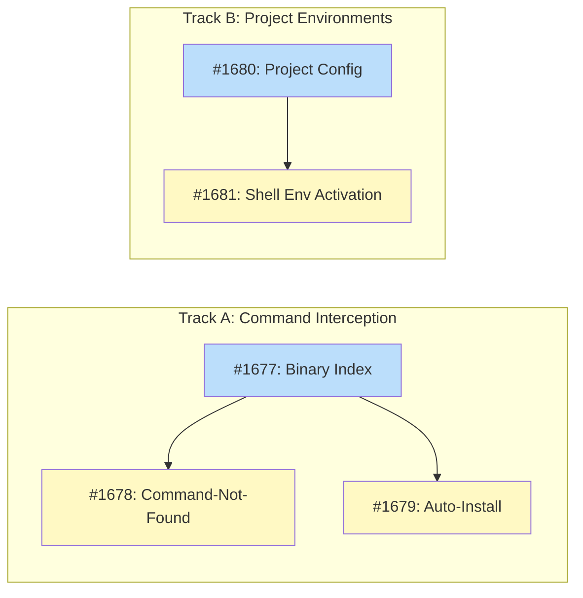

# DESIGN: Shell Integration Building Blocks

## Status

Planned

## Implementation Issues

### Milestone: [shell-integration-building-blocks](https://github.com/tsukumogami/tsuku/milestone/82)

| Issue | Dependencies | Tier |
|-------|--------------|------|
| [#1677: docs: design binary index (Block 1)](https://github.com/tsukumogami/tsuku/issues/1677) | None | testable |
| _Design the SQLite-backed index that maps command names to recipes. Defines the `BinaryIndex` interface, conflict resolution policy, and ~50ms lookup requirement. Foundation for all command-to-recipe lookups._ | | |
| [#1678: docs: design command-not-found handler (Block 2)](https://github.com/tsukumogami/tsuku/issues/1678) | [#1677](https://github.com/tsukumogami/tsuku/issues/1677) | testable |
| _Shell hooks for bash, zsh, and fish that intercept unknown commands. Specifies `tsuku suggest` output format, hook installation mechanism, and security analysis for shell injection prevention._ | | |
| [#1679: docs: design auto-install flow (Block 3)](https://github.com/tsukumogami/tsuku/issues/1679) | [#1677](https://github.com/tsukumogami/tsuku/issues/1677) | testable |
| _The `tsuku run` command that installs tools on first use. Defines suggest/confirm/auto modes, TTY detection for interactive prompts, and security considerations for auto-install consent._ | | |
| [#1680: docs: design project configuration (Block 4)](https://github.com/tsukumogami/tsuku/issues/1680) | None | testable |
| _Per-directory `.tsuku.toml` format specifying tool requirements. Defines the TOML schema, version constraint syntax, directory traversal behavior, and `LoadProjectConfig` interface._ | | |
| [#1681: docs: design shell environment activation (Block 5)](https://github.com/tsukumogami/tsuku/issues/1681) | [#1680](https://github.com/tsukumogami/tsuku/issues/1680) | testable |
| _Dynamic PATH modification based on current directory. Specifies activation via prompt hooks or `tsuku shell`, state tracking for active projects, and deactivation behavior._ | | |

### Dependency Graph



**Legend**: Green = done, Blue = ready, Yellow = blocked, Purple = needs-design

## Context and Problem Statement

Tsuku currently operates as an explicit package manager: users invoke `tsuku install <tool>` to install each tool they need. The install script sets up PATH automatically, but users must still know which tools to install. This model works but creates friction:

1. **Discovery burden**: Users must know which tool they need and its recipe name
2. **Manual installation**: Every tool requires an explicit install command
3. **No project-local environments**: Tools are global, with no per-directory version control

The vision is a fundamentally different UX where:
- Users type a command (e.g., `jq .foo data.json`)
- If `jq` isn't installed, tsuku intercepts the command
- Tsuku identifies which recipe provides `jq`
- Tsuku either auto-installs or prompts for confirmation
- The command runs seamlessly
- Optionally, LLM discovery helps find or create recipes for unknown commands

This vision requires several building blocks that don't exist today. This design identifies those building blocks so each can be designed and implemented independently.

### Scope

**In scope:**
- Identifying foundational capabilities required for shell integration
- Mapping dependencies between building blocks
- Defining interfaces between components
- Prioritizing which blocks enable the most value

**Out of scope:**
- Detailed design of each building block (separate designs)
- Implementation timeline or estimates
- Specific shell syntax or configuration format decisions

## Decision Drivers

- **Incremental value**: Each building block should be independently useful, not just a stepping stone
- **Minimal shell coupling**: Foundation should work without requiring shell hooks initially; "no hooks" is a first-class mode
- **Recipe backward compatibility**: Existing recipes must continue working
- **Performance**: Shell operations must complete in under 50ms to avoid perceptible delay
- **Extensibility**: Architecture should accommodate LLM discovery and other future features
- **Cross-platform**: Building blocks should work on Linux and macOS (Windows is out of scope)
- **Recipe metadata completeness**: Binary index accuracy depends on recipes declaring their binaries; this is a prerequisite

## Implementation Context

### External Patterns

Research into existing tools reveals consistent patterns:

**Shell Hook Mechanisms:**

| Tool | Hook Type | Performance |
|------|-----------|-------------|
| **mise** | Prompt hooks (`PROMPT_COMMAND`, `chpwd`) | ~4-10ms per prompt |
| **asdf** | Shim scripts in PATH | ~120ms per command (pre-Go) |
| **NixOS** | `command_not_found_handle` shell function | Fast (SQLite lookup) |

**Command-to-Package Mapping:**

| Approach | Used by | How it works |
|----------|---------|--------------|
| Pre-built database | NixOS | SQLite DB shipped with channel, maps binary→package |
| Post-install discovery | mise, asdf | Learn binaries after first install of any version |
| Explicit declaration | Homebrew, tsuku | Recipe declares which binaries it provides |

**Auto-Install Patterns:**

- **NixOS**: Suggests packages only; `comma` tool adds auto-install layer
- **mise**: Native auto-install (`auto_install = true`), requires one version installed first
- **asdf**: No native auto-install

### Existing Tsuku Patterns

**Binary Tracking** (already exists):
- Recipes declare binaries via `metadata.binaries` or action parameters
- `ExtractBinaries()` method analyzes recipes to determine provided commands
- `VersionState.Binaries` tracks which binaries each installed version provides
- Binary checksums stored for integrity verification

**Shell Integration** (partially exists):
- `tsuku shellenv` prints PATH configuration
- `tsuku activate <tool> <version>` switches versions via symlinks
- `$TSUKU_HOME/tools/current/{tool}` symlink structure for version activation

**Version Resolution** (mature):
- Pluggable `VersionResolver` interface
- Supports GitHub, npm, PyPI, Go modules, Homebrew, and more
- Per-version state with timestamps and plan references

### Conventions to Follow

- All paths derive from `$TSUKU_HOME` via `config.Config`
- Recipes use `[[steps]]` array with `action` and `params`
- State persistence in `state.json` with per-tool, per-version granularity
- Symlinks in `tools/current/{tool}` for version activation

### Research Summary

**What exists today:**
- Binary extraction from recipes
- Per-version binary tracking in state
- Basic shell PATH setup (`shellenv`)
- Version activation via symlinks

**What's missing for the vision:**
1. **Binary-to-recipe index**: No reverse lookup from command name to recipe
2. **Shell command interception**: No hook to catch missing commands
3. **Per-directory configuration**: No `.tsuku.toml` or equivalent
4. **Auto-install flow**: No mechanism to install on first use
5. **LLM recipe discovery**: No integration point for suggesting recipes

## Considered Options

This design identifies building blocks rather than implementation approaches. The key decision is how to structure and prioritize these blocks.

### Decision 1: Building Block Identification

The vision requires multiple capabilities that don't exist today. We must identify the minimal set of building blocks that enable the target UX while providing incremental value.

Based on the research, five building blocks are required. Each has independent value but also enables subsequent blocks.

#### Chosen: Five-Block Architecture

**Block 1: Binary Index**
A reverse lookup from command name to recipe(s) that provide it. This is the foundation for everything else.

- Input: Command name (e.g., `jq`)
- Output: List of recipes that provide that command
- Data source: Extract from all recipes in registry
- Storage: Local SQLite or JSON index, refreshed with registry updates
- Independent value: `tsuku which jq` → "jq is provided by recipe 'jq'"

**Block 2: Command-Not-Found Handler**
Shell hook that intercepts failed commands and delegates to tsuku.

- Mechanism: `command_not_found_handle` (bash), `command_not_found_handler` (zsh), `fish_command_not_found` (fish)
- Implementation: Shell function that calls `tsuku suggest <command>`
- Independent value: Helpful suggestions when a command isn't found
- Depends on: Block 1 (Binary Index)

**Block 3: Auto-Install Flow**
Interactive or automatic installation when a command is missing.

- Trigger: Command-not-found handler or explicit `tsuku run <command>`
- Modes: `suggest` (print instructions), `confirm` (prompt user), `auto` (install silently)
- Independent value: `tsuku run jq .foo data.json` installs jq if needed, then runs it
- Depends on: Block 1 (Binary Index)

**Block 4: Project Configuration**
Per-directory tool requirements via configuration file.

- File: `.tsuku.toml` or `tsuku.toml` in project root
- Content: Tool names and optional version constraints
- Behavior: `tsuku install` with no args installs all project tools
- Independent value: Reproducible tool environments for projects
- Depends on: None (but enhanced by Block 3)

**Block 5: Shell Environment Activation**
Dynamic PATH modification based on current directory.

- Mechanism: Prompt hook or explicit `tsuku shell` command
- Behavior: Reads project config, activates specified versions
- Independent value: Per-project tool versions without manual switching
- Depends on: Block 4 (Project Configuration)

#### Alternatives Considered

**Three-Block Architecture** (merge Blocks 2+3, merge Blocks 4+5):
Combine command-not-found handler with auto-install, and combine project config with shell activation.
Rejected because it reduces incremental value - users would need the full feature before getting any benefit.

**Six-Block Architecture** (split Binary Index into static and dynamic):
Separate pre-built index (from registry) from runtime discovery (from installed tools).
Rejected because the complexity isn't justified - a single index rebuilt on registry updates is sufficient.

### Decision 2: Block Dependencies and Priority

The blocks have natural dependencies that suggest implementation order. We need to choose whether to pursue strict sequential implementation or allow parallel development.

#### Chosen: Layered Implementation

```
Layer 0 (Foundation):    Block 1: Binary Index
                              │
Layer 1 (Interception):  Block 2: Command-Not-Found  ←──┐
                              │                          │
Layer 2 (Automation):    Block 3: Auto-Install ──────────┘

Layer 0 (Foundation):    Block 4: Project Configuration
                              │
Layer 1 (Activation):    Block 5: Shell Environment
```

Two independent tracks can proceed in parallel:
- **Track A**: Binary Index → Command-Not-Found → Auto-Install
- **Track B**: Project Configuration → Shell Environment

Track A and Track B converge when auto-install respects project configuration (installing project-specified versions). Block 3's detailed design should accept an optional `ProjectConfig` parameter to enable this integration.

#### Alternatives Considered

**Strict Sequential**: Implement all five blocks in a single sequence.
Rejected because Blocks 4 and 5 (project config) have no dependency on Blocks 1-3 (command interception). Parallel development is possible and faster.

**Feature-First**: Implement the full vision for one use case before expanding.
Rejected because it delays value delivery. Each block provides standalone utility.

### Decision 3: Binary Index Strategy

The binary index is foundational. We must decide how to build and maintain it.

#### Chosen: Registry-Derived Index

Build the index by analyzing all recipes in the registry:

1. On `tsuku update-registry`, also rebuild binary index
2. For each recipe, call `ExtractBinaries()` to get provided commands
3. Store mapping: `{command: [recipe1, recipe2, ...]}`
4. Handle conflicts gracefully (multiple recipes may provide same command)

Storage format: SQLite database at `$TSUKU_HOME/cache/binary-index.db`

```sql
CREATE TABLE binaries (
    command TEXT NOT NULL,
    recipe TEXT NOT NULL,
    binary_path TEXT,  -- e.g., "bin/jq" for disambiguation
    PRIMARY KEY (command, recipe)
);
CREATE INDEX idx_command ON binaries(command);
```

#### Alternatives Considered

**Runtime Discovery Only**: Build index from installed tools, like mise/asdf.
Rejected as primary strategy because it requires installing at least one version of a tool before tsuku knows what commands it provides. However, tsuku already tracks binaries post-install via `VersionState.Binaries`, so a hybrid approach (registry as primary, installed tools as supplement) could handle local/custom recipes. This is deferred to the detailed Block 1 design.

**Remote Index Service**: Fetch pre-built index from server.
Rejected because it adds infrastructure dependency. Local generation from registry is simpler and works offline.

### Uncertainties

- **Conflict resolution policy**: When multiple recipes provide the same command (e.g., both `vim` and `neovim` provide `vi`), how should tsuku choose? Options include prompting the user, preferring installed recipes, or using recipe metadata to indicate "canonical" providers. This policy must be defined in Block 1's detailed design.
- **Shell hook installation safety**: How to safely install/uninstall hooks in user's shell config without breaking existing setup? Must handle bash, zsh, and fish differences.
- **LLM integration point**: LLM discovery could be Block 6 or a cross-cutting enhancement. When binary index returns no results, LLM could suggest recipe creation. Interface TBD in future design.
- **Existing config format compatibility**: Should Block 4 support `.tool-versions` (asdf/mise format) in addition to `.tsuku.toml`? Increases adoption but adds complexity.

### Explicit Assumptions

- **Recipe binary metadata is complete**: The binary index's accuracy depends on recipes declaring their binaries. Recipes missing this metadata will not appear in lookups. A validation pass or migration may be needed.
- **Shell hooks are optional**: All features must work via explicit CLI invocation (`tsuku run`, `tsuku shell`). Shell hooks are a convenience layer, not a requirement.
- **Performance budget is 50ms**: Any shell-integrated operation must complete in under 50ms to avoid perceptible delay. This constrains the binary index implementation.

## Decision Outcome

**Chosen option: Five-Block Architecture with Parallel Tracks**

### Summary

The shell integration vision will be built from five independent building blocks, organized into two parallel implementation tracks. Track A (command interception) starts with a binary index that maps command names to recipes, then adds a command-not-found shell handler, and finally enables auto-install. Track B (project environments) starts with a project configuration file format, then adds shell environment activation based on the current directory. Each block provides standalone value while enabling the next.

The binary index is the foundation of Track A. It's built locally by scanning all recipes in the registry during `tsuku update-registry`, extracting binary names via the existing `ExtractBinaries()` method, and storing the command-to-recipe mapping in a SQLite database. Lookups must complete in under 50ms. When multiple recipes provide the same command, the detailed design will define conflict resolution (likely: prefer installed, then prompt). The index enables `tsuku which <command>` immediately, without requiring any shell integration.

Shell hooks are optional throughout. Every feature works via explicit CLI invocation: `tsuku run <cmd>` for auto-install, `tsuku shell` for environment activation. Users who want automatic interception can install shell hooks (`command_not_found_handle` for bash, `command_not_found_handler` for zsh, `fish_command_not_found` for fish), but this is a convenience layer. The architecture accommodates future LLM discovery by defining a clear fallback path: when the binary index returns no results, an LLM integration point can suggest recipe creation.

### Rationale

This approach directly addresses the decision drivers. Each block delivers incremental value (binary index enables `tsuku which`, project config enables `tsuku install` with no args) rather than requiring the full vision before users see benefit. Shell hooks remain optional, satisfying "minimal shell coupling." The registry-derived index means tsuku knows what commands a recipe provides before installation, unlike mise/asdf which require post-install discovery.

The parallel track structure emerged from dependency analysis: Track B (project config) has no technical dependency on Track A (command interception). They can proceed independently and converge later when auto-install respects project-specified versions. This maximizes development velocity without sacrificing architectural coherence.

### Trade-offs Accepted

By choosing this approach, we accept:

- **Recipe metadata must be complete**: Recipes without binary declarations won't appear in the index. This may require a validation pass across existing recipes.
- **Shell differences add complexity**: bash, zsh, and fish have different hook mechanisms. Each shell needs its own integration code in Block 2.
- **No remote index**: Building the index locally means the first `tsuku update-registry` after installation takes longer. We accept this to avoid infrastructure dependency.
- **Deferred LLM integration**: LLM discovery is explicitly out of scope for these five blocks. It can be added as Block 6 or a cross-cutting enhancement later.

These trade-offs are acceptable because recipe metadata completeness is already important for other features (verification), shell differences are bounded complexity, local index generation is a one-time cost per registry update, and LLM integration is genuinely separable from the core building blocks.

## Solution Architecture

### Overview

This design produces five building blocks, each with its own detailed design document. This section defines the interfaces between blocks and the data flows that connect them.

```
┌─────────────────────────────────────────────────────────────────────┐
│                           User Shell                                 │
│  ┌──────────────────┐    ┌──────────────────┐                       │
│  │ command_not_found│    │   prompt hook    │                       │
│  │     handler      │    │  (cd detection)  │                       │
│  └────────┬─────────┘    └────────┬─────────┘                       │
└───────────┼───────────────────────┼─────────────────────────────────┘
            │                       │
            ▼                       ▼
┌───────────────────┐    ┌───────────────────┐
│  tsuku suggest    │    │   tsuku shell     │
│  tsuku run <cmd>  │    │   tsuku activate  │
└────────┬──────────┘    └────────┬──────────┘
         │                        │
         ▼                        ▼
┌─────────────────────────────────────────────────────────────────────┐
│                         Tsuku Core                                   │
│                                                                      │
│  ┌──────────────┐     ┌──────────────┐     ┌──────────────┐        │
│  │ Binary Index │     │   Project    │     │   Install    │        │
│  │   (Block 1)  │◄────┤    Config    │     │   Manager    │        │
│  │              │     │   (Block 4)  │     │  (existing)  │        │
│  └──────┬───────┘     └──────────────┘     └──────┬───────┘        │
│         │                                          │                 │
│         ▼                                          ▼                 │
│  ┌──────────────┐                         ┌──────────────┐          │
│  │   Recipe     │                         │    State     │          │
│  │   Registry   │                         │  (state.json)│          │
│  │  (existing)  │                         │  (existing)  │          │
│  └──────────────┘                         └──────────────┘          │
└─────────────────────────────────────────────────────────────────────┘
```

### Key Interfaces

Each block exposes a well-defined interface. These interfaces are the contracts between blocks.

**Block 1: Binary Index**

```go
// BinaryIndex provides command-to-recipe lookup.
type BinaryIndex interface {
    // Lookup returns recipes that provide the given command.
    // Returns empty slice if no match found.
    Lookup(command string) ([]BinaryMatch, error)

    // Rebuild regenerates the index from the recipe registry.
    Rebuild(ctx context.Context) error
}

type BinaryMatch struct {
    Recipe     string // Recipe name (e.g., "jq")
    BinaryPath string // Path within tool (e.g., "bin/jq")
    Installed  bool   // Whether any version is installed
}
```

**Block 2: Command-Not-Found Handler**

Shell functions that invoke tsuku. No Go interface needed.

```bash
# bash: command_not_found_handle
command_not_found_handle() {
    tsuku suggest "$1"
    return 127
}

# zsh: command_not_found_handler
command_not_found_handler() {
    tsuku suggest "$1"
    return 127
}
```

**Block 3: Auto-Install Flow**

```go
// AutoInstaller handles install-on-demand.
type AutoInstaller interface {
    // Run installs the tool if needed, then executes the command.
    // mode: "suggest" (print only), "confirm" (prompt), "auto" (silent)
    Run(ctx context.Context, command string, args []string, mode string) error
}
```

**Block 4: Project Configuration**

```go
// ProjectConfig represents per-directory tool requirements.
type ProjectConfig struct {
    Tools map[string]ToolRequirement
}

type ToolRequirement struct {
    Version string // Optional version constraint (e.g., ">=1.0", "1.2.3")
}

// LoadProjectConfig finds and parses the nearest .tsuku.toml.
func LoadProjectConfig(startDir string) (*ProjectConfig, error)
```

**Block 5: Shell Environment Activation**

```go
// EnvActivator manages per-directory tool activation.
type EnvActivator interface {
    // Activate returns shell commands to activate the project environment.
    Activate(projectDir string) (string, error)

    // Deactivate returns shell commands to deactivate.
    Deactivate() (string, error)
}
```

### Data Flow

**Flow 1: Command Not Found → Suggestion**

```
1. User types unknown command (e.g., "jq")
2. Shell's command_not_found_handle invokes `tsuku suggest jq`
3. tsuku calls BinaryIndex.Lookup("jq")
4. Index returns [{Recipe: "jq", BinaryPath: "bin/jq", Installed: false}]
5. tsuku prints: "jq is provided by recipe 'jq'. Install with: tsuku install jq"
```

**Flow 2: Auto-Install and Run**

```
1. User runs `tsuku run jq .foo data.json`
2. AutoInstaller calls BinaryIndex.Lookup("jq")
3. If not installed, AutoInstaller calls InstallManager.Install("jq")
4. AutoInstaller executes `$TSUKU_HOME/tools/jq-{version}/bin/jq .foo data.json`
```

**Flow 3: Project Environment Activation**

```
1. User enters project directory with .tsuku.toml
2. Shell's prompt hook invokes `tsuku env` (or user runs `eval $(tsuku shell)`)
3. EnvActivator calls LoadProjectConfig(".")
4. For each tool in config, EnvActivator ensures version is installed
5. EnvActivator returns PATH modification pointing to project tool versions
6. Shell's PATH is updated
```

## Implementation Approach

Each block requires its own detailed design. This section outlines what each design must address.

### Block 1: Binary Index

**Scope**: Build, store, and query a command-to-recipe index.

**Key decisions for detailed design**:
- Storage format (SQLite recommended, ~50ms lookup requirement)
- Rebuild trigger (on `update-registry`, manual, both?)
- Conflict resolution policy (multiple recipes providing same command)
- Hybrid index (registry + installed tools for local/custom recipes)

**New CLI commands**: `tsuku which <command>`

**New files**: `internal/index/binary_index.go`, `$TSUKU_HOME/cache/binary-index.db`

### Block 2: Command-Not-Found Handler

**Scope**: Shell integration for intercepting missing commands.

**Key decisions for detailed design**:
- Installation mechanism (modify shell config vs source a file)
- Uninstallation safety
- Shell-specific implementations (bash, zsh, fish)
- Performance measurement

**New CLI commands**: `tsuku suggest <command>`, `tsuku hook install`, `tsuku hook uninstall`

**New files**: Shell hook scripts (shipped with tsuku or generated)

### Block 3: Auto-Install Flow

**Scope**: Install tools on first use, then execute.

**Key decisions for detailed design**:
- Mode selection (suggest/confirm/auto) - config setting vs flag
- Error handling (install fails, command fails)
- Integration with project config (use project-specified version if present)
- TTY detection for confirm mode

**New CLI commands**: `tsuku run <command> [args...]`

**Config additions**: `auto_install_mode` setting

### Block 4: Project Configuration

**Scope**: Per-directory tool requirements.

**Key decisions for detailed design**:
- File name and location (`.tsuku.toml` vs `tsuku.toml` vs both)
- Config format (TOML structure)
- Version constraint syntax
- `.tool-versions` compatibility (if any)
- Directory search behavior (current dir only vs parent traversal)

**New CLI commands**: `tsuku init` (create config), `tsuku install` (no args = project tools)

**New files**: `internal/project/config.go`

### Block 5: Shell Environment Activation

**Scope**: Activate project tool versions when entering directory.

**Key decisions for detailed design**:
- Activation mechanism (prompt hook vs explicit command)
- PATH modification strategy
- State tracking (which project is active)
- Deactivation behavior

**New CLI commands**: `tsuku shell` (print activation commands), `tsuku deactivate`

**Integration with shellenv**: May extend or replace existing `shellenv` command

## Consequences

### Positive

- **Incremental delivery**: Each block provides value immediately upon release
- **Reduced friction**: Users discover tools via commands, not recipe names
- **Reproducible projects**: Teams share tool requirements via config file
- **Optional complexity**: Users choose their integration level (CLI only → shell hooks)
- **Foundation for LLM**: Clear integration point for future LLM discovery

### Negative

- **Recipe metadata dependency**: Index accuracy depends on complete binary declarations
- **Multiple shell implementations**: bash, zsh, fish each need separate code
- **Learning curve**: Five new concepts for users to understand
- **Performance constraints**: 50ms budget limits implementation flexibility

### Mitigations

- **Recipe metadata**: Add CI validation for binary declarations; migration script for existing recipes
- **Shell implementations**: Start with bash/zsh, add fish later; share logic in tsuku binary
- **Learning curve**: Progressive disclosure - users can use just Block 1 (`tsuku which`) without understanding the rest
- **Performance**: SQLite with proper indexing; benchmark in CI

## Security Considerations

### Download Verification

**Not directly applicable to this design.** This design identifies building blocks; it does not add new download mechanisms. The actual downloading and verification happens through existing tsuku install flows, which already use checksum verification.

However, Block 3 (Auto-Install) introduces a new trigger for downloads. Security implications:
- Auto-install uses the same verification pipeline as manual install
- `confirm` mode (default) requires user consent before any download
- `auto` mode is opt-in and should warn users during setup
- No change to what gets downloaded, only when

### Execution Isolation

**Shell hooks execute with user privileges.** The command-not-found handler and prompt hooks run in the user's shell context with full user permissions.

Risks:
- **Malicious recipe execution**: If a recipe is compromised, auto-install could execute malicious code
- **Shell injection**: Improperly escaped command names could inject shell commands

Mitigations:
- Auto-install defaults to `confirm` mode, requiring explicit user consent
- Shell hooks invoke tsuku as a subprocess, not eval'd shell code
- Command names are passed as arguments, not interpolated into shell (use `--` to terminate option parsing)
- Existing recipe verification (checksums, signatures) applies to all installs
- Shell hooks should validate/sanitize environment variables (`TSUKU_HOME`, `TSUKU_REGISTRY_URL`) to prevent override attacks via `.envrc` or similar

### Supply Chain Risks

**Binary index integrity.** The binary index is derived from the recipe registry. If the registry is compromised, the index could map commands to malicious recipes.

Risks:
- **Registry poisoning**: Attacker adds recipe with common command name
- **Index manipulation**: Local index could be modified to redirect commands

Mitigations:
- Registry is fetched from trusted source with HTTPS
- Index is rebuilt from registry, not fetched directly
- Users still see install confirmation (in `confirm` mode)
- Existing recipe verification applies

**Project configuration trust.** `.tsuku.toml` files specify tool requirements. Cloning a malicious repository could trigger unwanted installs.

Mitigations:
- `tsuku install` (with no args) requires explicit invocation
- Shell environment activation (`tsuku shell`) does not auto-install
- Auto-install only triggers on command execution, not directory entry

### User Data Exposure

**No new data exposure.** This design does not add telemetry, external API calls, or data transmission beyond what tsuku already does.

Local data accessed:
- Recipe registry (already accessed by tsuku)
- Installed tool state (already accessed by tsuku)
- Project configuration files (new, but user-created and local)

No data is transmitted externally by these building blocks.

### Mitigations Summary

| Risk | Mitigation | Residual Risk |
|------|------------|---------------|
| Malicious auto-install | `confirm` mode default, explicit consent | User may enable `auto` mode without understanding implications. **Escalation:** `auto` mode detailed design should require additional friction to enable (e.g., allow-list of commands, explicit acknowledgment of risks, or removal of mode entirely). |
| Shell injection | Arguments passed to subprocess, not eval'd | Complex command names need thorough escaping review |
| Registry poisoning | HTTPS, rebuild from source, confirmation prompts | Compromised upstream remains a risk for all package managers |
| Malicious project config | No auto-install on clone, explicit invocation required | User may run `tsuku install` in untrusted repo |
| Index manipulation | Rebuild from registry, not external fetch | Local disk compromise would allow modification |

