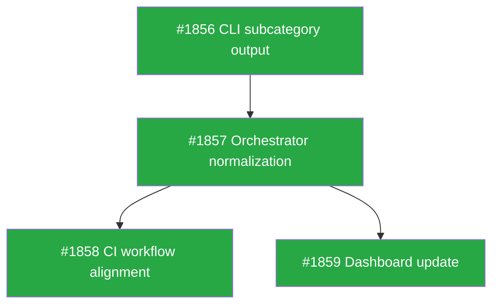

# DESIGN: Structured Error Subcategories

## Status

**Planned**

## Implementation Issues

### Milestone: [Structured Error Subcategories](https://github.com/tsukumogami/tsuku/milestone/96)

| Issue | Dependencies | Tier |
|-------|--------------|------|
| ~~[#1856: feat(cli): add subcategory to install error JSON output](https://github.com/tsukumogami/tsuku/issues/1856)~~ | ~~None~~ | ~~testable~~ |
| ~~_Extend `classifyInstallError()` to return a subcategory string alongside the exit code. Add `Subcategory` field to `installError` JSON struct. Maps typed errors (ErrTypeTimeout, ErrTypeDNS, etc.) to specific subcategory strings._~~ | | |
| ~~[#1857: feat(batch): normalize pipeline categories and add subcategory passthrough](https://github.com/tsukumogami/tsuku/issues/1857)~~ | ~~[#1856](https://github.com/tsukumogami/tsuku/issues/1856)~~ | ~~testable~~ |
| ~~_Update orchestrator's `categoryFromExitCode()` to canonical taxonomy. Fix `parseInstallJSON()` to derive pipeline categories from exit codes instead of trusting CLI strings. Add `Subcategory` field to `FailureRecord` and JSON schema._~~ | | |
| ~~[#1858: fix(ci): align batch workflow category names with canonical taxonomy](https://github.com/tsukumogami/tsuku/issues/1858)~~ | ~~[#1857](https://github.com/tsukumogami/tsuku/issues/1857)~~ | ~~simple~~ |
| ~~_Update the inline jq in `batch-generate.yml` to use canonical names: `generation_failed`, `network_error` instead of `deterministic`, `network`, `timeout`._~~ | | |
| ~~[#1859: feat(dashboard): read structured subcategories with category remap fallback](https://github.com/tsukumogami/tsuku/issues/1859)~~ | ~~[#1857](https://github.com/tsukumogami/tsuku/issues/1857)~~ | ~~testable~~ |
| ~~_Add subcategory passthrough to dashboard deserialization structs. Category remap translates old names on load. `extractSubcategory()` becomes conditional -- only called when structured subcategory is absent._~~ | | |



**Legend**: Green = done, Blue = ready, Yellow = blocked, Purple = needs-design

## Context and Problem Statement

Pipeline failure classification has two problems: inconsistent categories and fragile subcategories.

**Three producers, three taxonomies.** The same JSONL failure files are written by three different sources, each using its own category strings:

- The **CLI** (`install.go:categoryFromExitCode`) emits user-facing categories in `--json` output: `recipe_not_found`, `network_error`, `install_failed`, `missing_dep`.
- The **orchestrator** (`orchestrator.go:categoryFromExitCode`) maps exit codes to pipeline categories for the `generate()` path: `recipe_not_found`, `api_error`, `validation_failed`, `missing_dep`, `deterministic_insufficient`.
- The **CI workflow** (`batch-generate.yml:893`) uses inline `jq` with its own mapping: `missing_dep`, `network`, `timeout`, `deterministic`.

The `validate()` path adds a fourth variant: `parseInstallJSON()` trusts the CLI's category string directly, so validate-path records carry CLI categories (`network_error`, `install_failed`) while generate-path records carry orchestrator categories (`api_error`, `validation_failed`). The dashboard shows all of these side by side.

Current JSONL data confirms the mix. Per-recipe format records contain `deterministic`, `timeout`, `missing_dep` (from CI workflow jq). Legacy batch format records contain `deterministic_insufficient`, `validation_failed`, `recipe_not_found`, `missing_dep` (from orchestrator). Neither `network_error` nor `install_failed` (CLI categories) nor `api_error` appear in current data -- they would only show up from the validate path, which hasn't produced failures recently.

**Subcategories rely on text parsing.** The dashboard's `extractSubcategory()` classifies failures using substring matching on error messages. This produces false positives: `berkeley-db@5`'s `recipe_not_found` error gets subcategorized as `verify_pattern_mismatch` because its suggestion text contains "Verify the recipe name is correct." The existing observability design doc (DESIGN-dashboard-observability, Decision 2) acknowledges this and notes the CLI should add structured subcategory output.

These are the same problem: classification happens in too many places with no single source of truth.

### Scope

**In scope:**
- Defining one canonical pipeline category taxonomy
- Normalizing all three category producers to use it
- Adding a `subcategory` field to the CLI's `--json` error output
- Propagating the field through `FailureRecord` to JSONL files
- Updating the dashboard to prefer structured fields with heuristic fallback
- Backward compatibility with existing JSONL records

**Out of scope:**
- Modifying the human-readable error output (non-JSON stderr)
- Reworking the exit code system
- Removing heuristic parsing entirely (needed for old records)
- Refactoring error paths that bypass `handleInstallError()` (e.g., `tsuku verify` calls `exitWithCode()` directly)

## Decision Drivers

- **Consistency**: All JSONL records should use the same category vocabulary regardless of which path produced them
- **Accuracy**: Subcategories should be determined where the error context is richest, not inferred from text downstream
- **Separation of concerns**: Pipeline categories (what the operator sees) should be owned by the orchestrator; error detail (subcategories) should come from the CLI
- **Backward compatibility**: Existing JSONL records use various category strings and lack subcategories; the dashboard must handle them during transition

## Considered Options

### Decision 1: Who Owns Pipeline Categories

Three producers currently write categories into JSONL. Someone needs to be the authority.

#### Chosen: Orchestrator Owns Pipeline Categories

The orchestrator's `categoryFromExitCode()` becomes the single source of truth for pipeline categories. It already maps exit codes to categories that drive retry logic and circuit breaker thresholds (`api_error` triggers retries, `validation_failed` counts toward circuit breaker). These operational semantics make the orchestrator the natural owner.

Concretely:
- **`validate()` path**: `parseInstallJSON()` stops trusting the CLI's `category` field. It uses `categoryFromExitCode(result.ExitCode)` instead, while still extracting the CLI's subcategory.
- **`generate()` path**: Already uses the orchestrator's `categoryFromExitCode()`. No change needed.
- **CI workflow jq**: Updated to use the same category names as the orchestrator.
- **CLI `--json`**: Unchanged. The CLI's user-facing categories (`network_error`, `install_failed`) are a separate API for end users running `tsuku install --json`. The orchestrator translates at the boundary.

#### Alternatives Considered

**Unify CLI and orchestrator category names**: Make both `categoryFromExitCode()` functions return identical strings, eliminating the translation layer.
Rejected because the two functions serve different audiences with different needs. The CLI's categories describe what happened to the user (`recipe_not_found`, `network_error`). The orchestrator's categories drive pipeline operations (retry decisions, circuit breaker thresholds). Even with the canonical taxonomy, the orchestrator needs categories the CLI doesn't produce (`generation_failed`, `verify_failed`) and the CLI needs categories the pipeline doesn't use. Forcing them to share one function would mean either the CLI exposes pipeline internals or the pipeline loses operational granularity.

**Trust CLI categories in JSONL**: Keep `parseInstallJSON()` using the CLI's category as-is.
Rejected because this is the status quo, and it produces mixed categories in the same JSONL files. The dashboard shows `network_error` from the validate path alongside `api_error` from the generate path for the same class of failure.

### Decision 2: Where to Classify Subcategories

The subcategory provides the specific "why" within a category. The CLI has typed error information; the orchestrator has exit codes and output text; the dashboard only sees stored fields.

#### Chosen: CLI Produces Subcategories, Orchestrator Passes Through

Extend `classifyInstallError()` to return a subcategory string alongside the exit code. The orchestrator extracts it from the CLI's `--json` output via `parseInstallJSON()` and stores it in `FailureRecord`. The `generate()` path doesn't produce CLI subcategories; records from that path use the dashboard's heuristic fallback for bracketed tags.

The CLI is where `errors.As()` can distinguish `ErrTypeTimeout` from `ErrTypeDNS` from `ErrTypeTLS`. The orchestrator only sees exit code 5 for all of these.

#### Alternatives Considered

**Classify at the orchestrator level**: Have the orchestrator determine subcategories from exit codes and output parsing.
Rejected because the orchestrator can't distinguish between network error subtypes (they all exit 5). It would need to reparse error messages, which is the same fragile approach we're replacing.

**Keep heuristic parsing, make patterns more specific**: Continue with text matching but tighten patterns.
Rejected because each fix is reactive and the pattern list grows over time.

### Decision 3: How to Handle Backward Compatibility

Existing JSONL records use various category strings and lack subcategories. The dashboard needs to handle them during transition.

#### Chosen: Remap Old Categories, Fall Back on Heuristic Subcategories

For categories: the dashboard adds a small remap when loading records, translating old category strings to the canonical taxonomy (e.g., `network_error` -> `network_error` stays, `deterministic` -> `generation_failed`). This gives clean data immediately rather than waiting for records to age out.

For subcategories: check for the structured field first; if empty, run `extractSubcategory()` as a fallback. The heuristic code stays but gets exercised less over time.

#### Alternatives Considered

**Accept mixed categories during transition**: Let old and new category names coexist until old records age out via the 200-record cap.
Rejected because this means the dashboard shows the same failure type under different names for weeks. That's confusing for operators.

**Backfill old records**: Write a migration script to update existing JSONL files.
Rejected because JSONL files are committed to the repo and modified by CI workflows. A bulk migration creates merge conflict risk with in-flight batch runs.

## Decision Outcome

**Chosen: 1A + 2A + 3A**

### Summary

Define one canonical pipeline category taxonomy owned by the orchestrator. Normalize all three producers (orchestrator, CLI validate path, CI workflow) to use it. Add a `subcategory` field to the CLI's `--json` output, populated by extending `classifyInstallError()`. The orchestrator extracts subcategories from CLI JSON but always derives the pipeline category from its own `categoryFromExitCode()`. The dashboard reads both fields, with heuristic fallback for old records and a category remap for transitional data.

### Rationale

The classification mess comes from three producers independently deciding what to call the same failures. Fixing subcategories without fixing categories just layers precision on top of inconsistency. The orchestrator is the right owner for pipeline categories because it controls the operational semantics (retry, circuit breaker). The CLI is the right owner for subcategories because it has typed error information via `errors.As()`. Each component does the classification job it's best positioned for.

## Solution Architecture

### Overview

Four components change: the CLI (adds subcategory to `--json`), the orchestrator (enforces canonical categories, passes through subcategories), the CI workflow (adopts canonical category names), and the dashboard (reads structured fields with fallback).

### Canonical Pipeline Category Taxonomy

These are the categories as they appear in JSONL records and the dashboard. The orchestrator is the authority.

| Category | Exit Codes | Meaning | Operator response |
|----------|-----------|---------|-------------------|
| `recipe_not_found` | 3 | Source package doesn't exist | Remove from queue |
| `network_error` | 5 | Transient API/download failure | Retry later |
| `install_failed` | 6 | Recipe generated but installation fails | Fix the recipe |
| `verify_failed` | 7 | Installs but binary doesn't work | Fix verify pattern |
| `missing_dep` | 8 | Blocked on another recipe | Resolve dependency first |
| `generation_failed` | 9, other | Recipe generation couldn't produce a result | Investigate manually |

Changes from current orchestrator taxonomy:
- `api_error` renamed to `network_error` (clearer, and exit 5 covers DNS/TLS/timeout -- not just API calls)
- `validation_failed` split into `install_failed` (exit 6) and `verify_failed` (exit 7) -- these are different problems with different fixes
- `deterministic_insufficient` renamed to `generation_failed` (shorter, and the "deterministic only" constraint is a subcategory detail)

Changes from current CI workflow taxonomy:
- `deterministic` renamed to `generation_failed`
- `timeout` folded into `network_error` (timeout is a subcategory)
- `network` renamed to `network_error`

The CLI's user-facing categories in `--json` output (`network_error`, `install_failed`, etc.) are unchanged. They're a separate API for end users running `tsuku install --json`. The orchestrator translates at the boundary.

### Subcategory Taxonomy

Subcategories provide the specific "why" within each category. For the validate path, they come from the CLI's typed error information. For the generate path, they come from bracketed tags or heuristic matching in the dashboard.

**Under `network_error`:**

| Subcategory | Source | Meaning |
|-------------|--------|---------|
| `timeout` | CLI typed error or heuristic | Request timed out |
| `dns_error` | CLI typed error | DNS resolution failed |
| `tls_error` | CLI typed error | TLS handshake failed |
| `connection_error` | CLI typed error | Connection refused/reset |
| `rate_limited` | heuristic | Rate limit hit (429) |

**Under `generation_failed`:**

| Subcategory | Source | Meaning |
|-------------|--------|---------|
| `no_bottles` | bracketed tag | No prebuilt bottles available |
| `no_binaries` | bracketed tag | No executables found |
| `complex_archive` | bracketed tag | Archive structure not supported |
| `deterministic_only` | exit code 9 | Needs LLM, skipped by policy |

**Under `install_failed`:**

| Subcategory | Source | Meaning |
|-------------|--------|---------|
| *(empty)* | | No further breakdown from CLI yet |

**Under `verify_failed`:**

| Subcategory | Source | Meaning |
|-------------|--------|---------|
| `pattern_mismatch` | heuristic | Version output doesn't match pattern |

**Under `missing_dep` and `recipe_not_found`:**

No subcategories needed. `missing_dep` has the `blocked_by` field for detail. `recipe_not_found` is already specific.

### Data Flow

```
CLI: classifyInstallError(err) → (exitCode, subcategory)
  ↓
CLI: installError{Category, Subcategory, Message, ExitCode} → JSON stdout
  (Category = CLI's user-facing name, e.g., "network_error")
  (Subcategory = typed error detail, e.g., "timeout")
  ↓
Orchestrator (validate path):
  parseInstallJSON() → extracts subcategory + blockedBy from CLI JSON
  categoryFromExitCode(exitCode) → canonical pipeline category
  ↓
Orchestrator (generate path):
  categoryFromExitCode(exitCode) → canonical pipeline category
  subcategory left empty (dashboard heuristic handles it)
  ↓
FailureRecord{Category, Subcategory, BlockedBy, ...} → JSONL
  ↓
Dashboard: loadFailureDetailsFromFile()
  1. Read category from JSONL (remap old names if needed)
  2. if record.Subcategory != "" → use it
     else → extractSubcategory(category, message, exitCode)  [fallback]
```

### Key Changes

**`cmd/tsuku/install.go`**

```go
type installError struct {
    Status         string   `json:"status"`
    Category       string   `json:"category"`
    Subcategory    string   `json:"subcategory,omitempty"`  // NEW
    Message        string   `json:"message"`
    MissingRecipes []string `json:"missing_recipes"`
    ExitCode       int      `json:"exit_code"`
}
```

`classifyInstallError()` returns a subcategory alongside the exit code. The subcategory is derived from the same `errors.As()` checks already in place. `ErrTypeNotFound` maps to subcategory empty (the category `recipe_not_found` is specific enough). `ErrTypeTimeout` maps to `"timeout"`, `ErrTypeDNS` to `"dns_error"`, etc. The CLI's `categoryFromExitCode()` and user-facing category strings are unchanged.

**`internal/batch/orchestrator.go`**

`categoryFromExitCode()` updated to use the canonical taxonomy. `parseInstallJSON()` extracts the subcategory from CLI JSON but uses `categoryFromExitCode(result.ExitCode)` for the pipeline category instead of trusting the CLI's category string. The `generate()` path already uses `categoryFromExitCode()` -- it just gets the updated names.

**`internal/batch/results.go`**

`FailureRecord` gains a `Subcategory string` field. `WriteFailures()` includes it in JSONL output.

**`.github/workflows/batch-generate.yml`**

The inline `jq` category mapping (line 893) updated to use canonical names: `missing_dep`, `network_error`, `generation_failed`.

**`internal/dashboard/failures.go`**

`loadFailureDetailsFromFile()` reads the `subcategory` field from JSONL records. `loadFailureDetailRecords()` only calls `extractSubcategory()` when subcategory is empty after loading. A category remap handles old records during transition.

**`internal/dashboard/dashboard.go`**

`FailureRecord` and `PackageFailure` structs gain `Subcategory` fields so `json.Unmarshal` doesn't silently drop the new data.

**`data/schemas/failure-record.schema.json`**

Add `subcategory` as an optional property (the schema uses `additionalProperties: false`).

## Implementation Approach

### Phase 1: CLI Subcategory Output

Modify `classifyInstallError()` to return `(exitCode int, subcategory string)`. Update `handleInstallError()` to include the subcategory in the `installError` JSON struct. Add tests for the new subcategory values. The CLI's `categoryFromExitCode()` is unchanged -- it continues producing user-facing category names.

Files: `cmd/tsuku/install.go`

### Phase 2: Orchestrator Category Normalization + Subcategory Passthrough

Update the orchestrator's `categoryFromExitCode()` to use the canonical taxonomy (`network_error`, `install_failed`, `verify_failed`, `generation_failed` instead of `api_error`, `validation_failed`, `deterministic_insufficient`). Fix `parseInstallJSON()` to use `categoryFromExitCode(result.ExitCode)` for the pipeline category instead of trusting the CLI's category string, while extracting the subcategory from CLI JSON. Add `Subcategory` field to `FailureRecord`. Update `data/schemas/failure-record.schema.json`.

Files: `internal/batch/orchestrator.go`, `internal/batch/orchestrator_test.go`, `internal/batch/results.go`, `data/schemas/failure-record.schema.json`

### Phase 3: CI Workflow Alignment

Update the inline `jq` in `batch-generate.yml` to use canonical category names. The current mapping (`deterministic`, `network`, `timeout`) becomes (`generation_failed`, `network_error`, `network_error`).

Files: `.github/workflows/batch-generate.yml`

### Phase 4: Dashboard Update

Update dashboard deserialization structs (`FailureRecord`, `PackageFailure` in `dashboard.go`) to include `Subcategory`. Update `loadFailureDetailsFromFile()` to read the field from JSONL records. Add a category remap for old records (e.g., `deterministic` -> `generation_failed`, `api_error` -> `network_error`, `validation_failed` -> `install_failed`, `deterministic_insufficient` -> `generation_failed`). Change `loadFailureDetailRecords()` to only call `extractSubcategory()` when the loaded subcategory is empty. Update tests.

Files: `internal/dashboard/failures.go`, `internal/dashboard/failures_test.go`, `internal/dashboard/dashboard.go`

### Category Remap Table (for Phase 4)

Old records may contain these category strings. The dashboard remaps them on load:

| Old value | New canonical value | Source |
|-----------|-------------------|--------|
| `api_error` | `network_error` | orchestrator (generate path, legacy) |
| `validation_failed` | `install_failed` | orchestrator (generate path, legacy) |
| `deterministic_insufficient` | `generation_failed` | orchestrator (legacy batch format) |
| `deterministic` | `generation_failed` | CI workflow jq (per-recipe format) |
| `timeout` | `network_error` | CI workflow jq (per-recipe format) |
| `network` | `network_error` | CI workflow jq (per-recipe format) |
| `network_error` | `network_error` | CLI validate path (no change) |
| `install_failed` | `install_failed` | CLI validate path (no change) |
| `recipe_not_found` | `recipe_not_found` | all paths (no change) |
| `missing_dep` | `missing_dep` | all paths (no change) |

## Security Considerations

### Download Verification

Not applicable. This change modifies error classification metadata, not the download or verification pipeline. No artifacts are downloaded or verified differently.

### Execution Isolation

Not applicable. The subcategory field is a classification label added to JSON output. It doesn't change what the CLI executes or what permissions it requires.

### Supply Chain Risks

Subcategory values flow into JSONL records consumed by CI pipeline scripts (batch workflows, requeue scripts). The values must remain a closed enumeration of hardcoded strings derived from typed error checks. Deriving subcategories from error message text or user-controlled input would create an injection vector. This design moves in the right direction: CLI-level classification from typed errors is inherently a closed set, unlike the heuristic parsing it replaces (which operates on arbitrary message text that could contain crafted content from upstream APIs).

### User Data Exposure

The `--json` output gains a `subcategory` field. This contains the same kind of information already present in `category` and `exit_code`: a classification label derived from the error type. No new user data, file paths, or sensitive information is exposed. The `message` field (which can contain paths) is unchanged.

## Consequences

### Positive

- All JSONL records use one category vocabulary regardless of which path produced them
- Subcategory classification becomes authoritative rather than heuristic for the validate path
- False positives from text matching (like "Verify" in suggestion text) stop occurring for new records
- `validation_failed` splits into `install_failed` and `verify_failed`, giving operators actionable information instead of a catch-all
- Existing records continue to work via the remap + heuristic fallback

### Negative

- Two subcategory paths coexist until old records age out (structured field vs heuristic parsing)
- The `subcategory` field in `--json` output becomes a machine-readable API contract; changing values later would be a breaking change for consumers that parse it
- Category renames affect CI scripts that match on category strings (e.g., `requeue-unblocked.sh` matches `missing_dep`, `batch-generate.yml` jq matches exit codes). These need updating in the same change.

### Mitigations

- The heuristic fallback is already tested and working. It gets called less often as new records replace old ones.
- The `subcategory` field uses `omitempty`, so consumers that don't expect it are unaffected.
- The category remap in the dashboard handles the transition period. Scripts that match `missing_dep` or `recipe_not_found` are unaffected since those names don't change.
