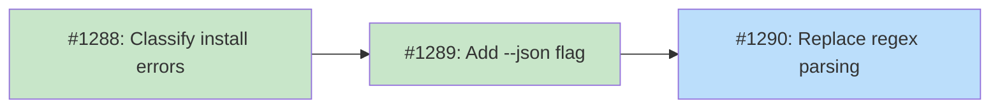

# DESIGN: Structured JSON Output for CLI Commands

## Status

Planned

## Implementation Issues

### Milestone: [Structured Install Output](https://github.com/tsukumogami/tsuku/milestone/58)

| Issue | Title | Dependencies | Tier |
|-------|-------|--------------|------|
| ~~[#1288](https://github.com/tsukumogami/tsuku/issues/1288)~~ | ~~classify install errors with typed exit codes~~ | ~~None~~ | ~~testable~~ |
| ~~[#1289](https://github.com/tsukumogami/tsuku/issues/1289)~~ | ~~add --json flag to tsuku install~~ | ~~[#1288](https://github.com/tsukumogami/tsuku/issues/1288)~~ | ~~testable~~ |
| [#1290](https://github.com/tsukumogami/tsuku/issues/1290) | replace regex error parsing with JSON | [#1289](https://github.com/tsukumogami/tsuku/issues/1289) | testable |

### Dependency Graph



**Legend**: Green = done, Blue = ready, Yellow = blocked, Purple = needs-design

## Context and Problem Statement

The `tsuku install` command exits with code 6 (`ExitInstallFailed`) for every failure, whether it's a missing recipe, a missing dependency, a network error, or an extraction failure. Exit code 8 (`ExitDependencyFailed`) exists but the install command never uses it.

This means programmatic consumers can't distinguish failure types from exit codes alone. The batch orchestrator works around this by parsing stderr text with a regex (`recipe (\S+) not found in registry`) in `classifyValidationFailure`. That function has a TODO explicitly asking for structured output (#1273).

Beyond the orchestrator, CI workflows like `test-changed-recipes.yml` can only check pass/fail. They can't distinguish a missing dependency (which might be fixable by installing another recipe first) from a broken recipe (which needs investigation).

### Scope

**In scope:**
- Fix exit code usage in `tsuku install` so different failure types use the correct code
- Add `--json` flag to `tsuku install` for structured error output
- Update batch orchestrator to drop regex parsing in favor of exit codes (and optionally JSON)

**Out of scope:**
- Adding `--json` to `tsuku create` (can be done separately, the orchestrator's `generate()` method already uses exit codes only)
- JSON output for success cases (`tsuku install` success output is minimal and doesn't need structure)
- Schema versioning (premature until there are external consumers beyond our own tooling)

## Decision Drivers

- The batch orchestrator is the primary consumer; it already maps exit codes via `categoryFromExitCode`
- Several commands already use `--json` with `printJSON()`, so the pattern is established
- The TODO at `orchestrator.go:260` explicitly requests this change
- Exit code fixes deliver most of the value with minimal effort; JSON adds detail on top

## Considered Options

### Option A: Fix Exit Codes Only

Classify errors in `tsuku install` and exit with the appropriate code (3 for missing recipe, 5 for network, 8 for missing dependency). Don't add JSON output.

**Pros:**
- Smallest change, focused on the highest-value fix
- The orchestrator's `categoryFromExitCode` already handles codes 3, 5, 6, 7, 8
- No new API surface to maintain

**Cons:**
- Exit codes can't carry detail (which specific dependencies are missing)
- The orchestrator still needs to parse stderr for `blockedBy` names
- Doesn't address the regex fragility, just reduces its scope

### Option B: Fix Exit Codes + Add `--json` to Install

Fix exit codes and add a `--json` flag to `tsuku install` that emits a structured error object on failure. The object includes the failure category, message, and any missing dependency names.

**Pros:**
- Exit codes handle basic classification, JSON provides detail
- Follows the established `--json` pattern (validate, plan, verify-deps)
- Orchestrator can drop `classifyValidationFailure` regex entirely
- Missing dependency names come from the struct, not regex

**Cons:**
- More work than Option A
- Need to define an error response shape (though it can start simple)

### Option C: Full JSON for Install + Create + All Consumers

Add `--json` to both `install` and `create`, define a schema, update the orchestrator, CI workflows, and test infrastructure to use JSON everywhere.

**Pros:**
- Most complete solution
- All consumers benefit

**Cons:**
- Large scope for a single change
- `create` already communicates fine via exit codes (the batch orchestrator's `generate()` doesn't parse output)
- CI workflows don't need JSON -- they just need pass/fail with better logging
- Risk of over-engineering the schema before real usage patterns emerge

## Decision Outcome

**Chosen: Option B (fix exit codes + `--json` for install)**

### Rationale

Exit code fixes are the highest-value change. The orchestrator's `categoryFromExitCode` already maps codes correctly -- the install command just isn't using them. Fixing that alone eliminates the need for regex-based category classification.

Adding `--json` to install handles the remaining regex use case: extracting specific missing dependency names for the `blockedBy` field. With both changes, `classifyValidationFailure` can be replaced entirely.

Option A was rejected because it leaves the `blockedBy` extraction dependent on regex. Option C was rejected because it bundles unrelated work (`create` JSON, CI changes, schema versioning) that doesn't have a pressing consumer.

### Trade-offs Accepted

- `--json` on install only covers error cases initially. Success output is a single line ("installed tool-1.0.0") that doesn't need structure yet. If success metadata becomes useful later, it can be added.
- No schema versioning. The JSON shape is an internal contract between the CLI and the batch orchestrator. If external tools start consuming it, versioning can be added then.

## Solution Architecture

### Overview

Two changes, each independently useful:

1. **Exit code fixes**: Classify errors in the install path and use the right exit code
2. **JSON error output**: `--json` flag emits structured error on failure

### Exit Code Classification

The install command currently calls `printError(err)` and exits with code 6. Instead, classify the error before exiting using typed error unwrapping where possible:

```go
func classifyInstallError(err error) int {
    // Use typed error unwrapping for registry errors
    var regErr *registry.RegistryError
    if errors.As(err, &regErr) {
        switch regErr.Type {
        case registry.ErrTypeNotFound:
            return ExitRecipeNotFound      // 3
        case registry.ErrTypeNetwork, registry.ErrTypeDNS,
             registry.ErrTypeTimeout, registry.ErrTypeConnection:
            return ExitNetwork             // 5
        }
    }
    // Fall back to string matching for dependency wrapper errors
    if strings.Contains(err.Error(), "failed to install dependency") {
        return ExitDependencyFailed    // 8
    }
    return ExitInstallFailed           // 6
}
```

The registry layer already produces `*registry.RegistryError` with typed classification (`ErrTypeNotFound`, `ErrTypeNetwork`, etc.) and these survive through the error chain via `%w` wrapping. String matching is only needed for the dependency wrapper pattern from `install_deps.go`, which uses `fmt.Errorf` without typed metadata.

### JSON Error Response

When `--json` is passed and the command fails, emit a JSON object to stdout before exiting:

```go
type InstallError struct {
    Status         string   `json:"status"`           // always "error"
    Category       string   `json:"category"`         // matches exit code meaning
    Message        string   `json:"message"`          // human-readable error
    MissingRecipes []string `json:"missing_recipes"`  // for category "missing_dep"
    ExitCode       int      `json:"exit_code"`        // the exit code being used
}
```

When `--json` is NOT passed, behavior is unchanged (human-readable stderr output).

The struct is defined in `cmd/tsuku/install.go`, not exported. It's a CLI presentation concern, not a library type.

### Batch Orchestrator Update

The orchestrator's `validate()` method currently calls `classifyValidationFailure(output)` which parses text with regex. After this change:

1. The exit code alone classifies the failure (code 8 = missing dep, code 6 = other)
2. If JSON output is used, parse the response for `missing_recipes` to populate `blockedBy`
3. Remove `reNotFoundInRegistry` regex and `classifyValidationFailure` function

The orchestrator adds `--json` to the `validate()` method's install args:

```go
args := []string{
    "install", "--force", "--recipe", recipePath, "--json",
}
```

On failure, parse the JSON from combined output to extract `missing_recipes`:

```go
var result struct {
    MissingRecipes []string `json:"missing_recipes"`
}
if err := json.Unmarshal(output, &result); err == nil && len(result.MissingRecipes) > 0 {
    return generateResult{
        Failure: FailureRecord{
            Category:  "missing_dep",
            BlockedBy: result.MissingRecipes,
            // ...
        },
    }
}
```

### Missing Recipe Extraction

The install command needs to extract missing recipe names from errors. The dependency installer already wraps errors with the dependency name (`"failed to install dependency '%s'"` at `install_deps.go:309`). For the JSON response, the install command collects these names:

```go
func extractMissingRecipes(err error) []string {
    msg := err.Error()
    var names []string
    seen := make(map[string]bool)
    // Match "recipe <name> not found in registry" from nested errors
    re := regexp.MustCompile(`recipe (\S+) not found in registry`)
    for _, m := range re.FindAllStringSubmatch(msg, -1) {
        if !seen[m[1]] {
            seen[m[1]] = true
            names = append(names, m[1])
        }
        if len(names) >= 100 {
            break
        }
    }
    return names
}
```

This regex lives in the CLI layer, not the orchestrator. The improvement is that the CLI extracts and structures the data once, and consumers read JSON instead of parsing stderr themselves. The regex is still string-based because dependency errors wrap multiple nested `RegistryError` values and extracting all recipe names requires scanning the full error text. A bounds cap of 100 prevents unbounded growth from malformed error chains.

## Implementation Approach

### Step 1: Exit Code Classification in Install

Add `classifyInstallError()` to `install.go`. Replace all `exitWithCode(ExitInstallFailed)` calls with `exitWithCode(classifyInstallError(err))`.

**Files:** `cmd/tsuku/install.go`

### Step 2: Add `--json` Flag and Error Response

Add `--json` flag to install command. On failure, if `--json` is set, emit `InstallError` struct via `printJSON()` to stdout. Extract missing recipe names from the error message.

**Files:** `cmd/tsuku/install.go`

### Step 3: Update Batch Orchestrator

Add `--json` to validate's install args. Parse JSON response for `missing_recipes`. Remove `classifyValidationFailure` and `reNotFoundInRegistry`.

**Files:** `internal/batch/orchestrator.go`, `internal/batch/orchestrator_test.go`

### Step 4: Tests and Automation Integration

**Unit tests:**
- `classifyInstallError` returns correct exit codes for different error types (typed `RegistryError` unwrapping and string fallback)
- JSON output includes `missing_recipes` when deps are missing
- Orchestrator parses JSON install output correctly
- Existing `TestClassifyValidationFailure` tests in `orchestrator_test.go` are replaced with JSON-based equivalents

**Files:** `cmd/tsuku/install_test.go`, `internal/batch/orchestrator_test.go`

**Existing test infrastructure impact:**
- `TestRun_validationFailureMissingDep` in `orchestrator_test.go` uses a fake shell script that emits stderr text matching the regex pattern. After this change, the fake script needs to emit JSON to stdout instead (or in addition), since the orchestrator will pass `--json` to install.
- `TestRun_withFakeBinary` and `TestRun_validationFailureGeneric` need their fake scripts updated to handle the `--json` flag (they can ignore it and return non-JSON output; the orchestrator should fall back gracefully when JSON parsing fails).
- The `test-changed-recipes.yml` CI workflow doesn't need changes — it uses exit codes only, and those get more accurate with this change.
- The batch orchestrator's `classifyValidationFailure` function and `reNotFoundInRegistry` regex are removed, along with their test (`TestClassifyValidationFailure`).

## Security Considerations

### Download Verification

Not applicable. This change affects error reporting, not how artifacts are downloaded or verified.

### Execution Isolation

Not applicable. No new execution paths. The `--json` flag changes output format, not what code runs.

### Supply Chain Risks

Not applicable. No changes to artifact sources or verification.

### User Data Exposure

The JSON error output includes recipe names and error messages. Recipe names are public (from the Homebrew registry). Error messages may include file paths from the user's system (e.g., `$TSUKU_HOME/tools/...`). These paths already appear in stderr output today. However, structured JSON is more likely to be logged, aggregated, or forwarded by CI systems than unstructured stderr text. Consumers should treat the JSON output with the same care as any log output that may contain local paths.

## Consequences

### Positive

- Batch orchestrator can classify failures without regex, using exit codes that the CLI already defines
- Missing dependency names come from structured JSON instead of text parsing
- `classifyValidationFailure` regex and `reNotFoundInRegistry` can be removed
- CI workflows get more informative exit codes (code 8 vs code 6) without any changes on their side
- Follows the established `--json` pattern from validate, plan, and verify-deps

### Negative

- `extractMissingRecipes` still uses regex on error text to collect dependency names. This moves the regex from the orchestrator to the CLI (where it's closer to the error source and tested in the same repo), but doesn't eliminate string parsing entirely. A future change could attach recipe names directly to the dependency error type.
- JSON output on failure adds a format contract that consumers depend on. Changes to the struct shape could break the orchestrator.

### Mitigations

- `classifyInstallError` matches on strings that come from code we control (`install_deps.go`, `registry.go`). Unlike the orchestrator's regex, these strings are in the same repo and changes would be caught by tests.
- The JSON struct is simple (5 fields) and internal. Adding fields is backward-compatible. Removing or renaming fields would break the orchestrator, but both live in the same repo so that's caught at compile time (or test time).
