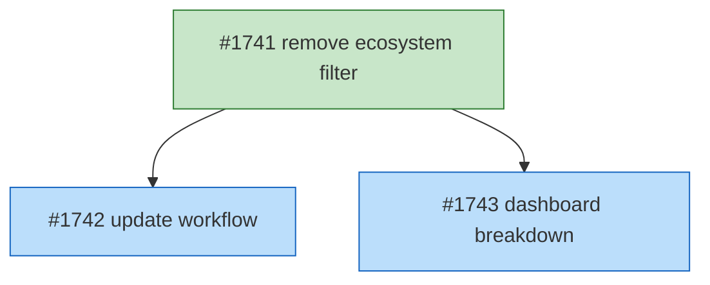

# DESIGN: Unified Batch Pipeline

## Status

Planned

## Implementation Issues

### Milestone: [unified-batch-pipeline](https://github.com/tsukumogami/tsuku/milestone/20)

| Issue | Dependencies | Tier |
|-------|--------------|------|
| ~~[#1741: refactor(batch): remove ecosystem filter and process all queue entries](https://github.com/tsukumogami/tsuku/issues/1741)~~ | None | testable |
| _Remove the ecosystem prefix filter from selectCandidates(), add per-entry rate limiting and circuit breaker checks, update BatchResult with per-ecosystem breakdown, update CLI entry point. This is the foundation that unblocks the other two issues._ | | |
| [#1742: ci(batch): update workflow for mixed-ecosystem batches](https://github.com/tsukumogami/tsuku/issues/1742) | [#1741](https://github.com/tsukumogami/tsuku/issues/1741) | testable |
| _Update the GitHub Actions workflow to remove the ECOSYSTEM env var default, drop the breaker preflight, read per-ecosystem results from batch-results.json, and fix PR creation for mixed batches._ | | |
| [#1743: feat(dashboard): show ecosystem breakdown per batch](https://github.com/tsukumogami/tsuku/issues/1743) | [#1741](https://github.com/tsukumogami/tsuku/issues/1741) | testable |
| _Update the dashboard Go code and HTML pages to show ecosystem breakdown per batch run, fix hardcoded homebrew assumptions, and add breaker-skip notes to the health panel._ | | |



**Legend**: Green = done, Blue = ready, Yellow = blocked, Purple = needs-design

## Upstream Design Reference

This design completes the batch generation changes described in [DESIGN-pipeline-dashboard-2.md](current/DESIGN-pipeline-dashboard-2.md).

**Relevant sections:**
- Decision 3: Unified Disambiguated Queue ("Replace per-ecosystem queues with a single unified queue")
- Decision Outcome: "Batch generation uses the source directly"
- Solution Architecture: Batch Generation Pipeline box says "[MODIFY] Read source from queue entry, not ecosystem flag"

The upstream design's intent was clear: the unified queue should make ecosystem filtering unnecessary. Issue #1699 implemented `pkg.Source` usage in `generate()` but left the ecosystem prefix filter in `selectCandidates()` and the workflow's `-ecosystem` flag intact.

## Context and Problem Statement

The batch recipe generation pipeline has been stalled for 10+ days. It runs hourly but generates zero new recipes. The dashboard at tsuku.dev/pipeline/ shows 189 consecutive runs with 0 packages generated.

**Root cause:** The orchestrator's `selectCandidates()` (line 158 of `internal/batch/orchestrator.go`) computes `prefix := o.cfg.Ecosystem + ":"` and only selects queue entries whose `Source` field starts with that prefix. The cron schedule defaults to `ecosystem: homebrew`. But Bootstrap Phase B re-routed 261 packages to non-homebrew sources (`github:`, `cargo:`, `npm:`, etc.), making them invisible to the hourly cron because they don't match `homebrew:`. The remaining homebrew-sourced entries (approximately 40) have all reached `failed` status with generation errors from earlier runs, so neither pool produces output.

**How it happened:** Issue #1699 ("orchestrator uses queue source directly") correctly updated `generate()` to pass `pkg.Source` directly to `tsuku create --from`. But its acceptance criteria didn't mention removing the ecosystem prefix filter in `selectCandidates()`, and the ecosystem concept wasn't cleaned up from the workflow either. The filter is a vestige of the pre-unified-queue design where packages were in per-ecosystem queues.

**Evidence from the upstream design:**
- "Replace per-ecosystem queues with a single unified queue" (Decision 3)
- "Multi-ecosystem coverage: Unified queue naturally includes packages from all ecosystems" (Consequences)
- "Batch generation uses the source directly: `tsuku create --from github:sharkdp/bat`" (Decision Outcome)

The ecosystem concept is threaded through six layers: orchestrator Config, CLI flags, workflow env vars, circuit breaker state, failure file naming, and dashboard rendering. All need updating.

### Scope

**In scope:**
- Remove ecosystem prefix filter from `selectCandidates()`
- Remove `Config.Ecosystem` field from orchestrator
- Update rate limiting to work per-entry instead of per-batch
- Update circuit breaker to work per-entry ecosystem
- Update `BatchResult` to handle mixed-ecosystem batches
- Update workflow to drop `-ecosystem` flag on cron
- Update dashboard to show ecosystem breakdown per batch
- Update failure file naming for mixed batches

**Out of scope:**
- Queue schema changes (the queue is already ecosystem-agnostic)
- Seeding workflow changes (operates independently)
- Adding new ecosystems
- Dashboard redesign (just adapting existing ecosystem rendering)

## Decision Drivers

1. **Minimal change**: Fix the pipeline with the smallest set of changes, don't rebuild it
2. **Preserve safety**: Rate limiting per ecosystem must continue working (different APIs have different rate limits)
3. **Preserve circuit breakers**: Ecosystem-level breaker state should prevent runaway failures against a single API
4. **Dashboard continuity**: Ecosystem stays as useful metadata for filtering and display
5. **No new CI costs**: Same hourly budget, same concurrency model
6. **Upstream alignment**: Complete the intent of DESIGN-pipeline-dashboard-2.md

## Considered Options

### Decision 1: How to Remove Ecosystem Filtering

The orchestrator currently receives a single ecosystem string via `Config.Ecosystem` and uses it to filter candidates, look up rate limits, generate batch IDs, and write failure files. The question is how to transition from "one ecosystem per batch" to "all ecosystems per batch" while preserving the per-ecosystem safety mechanisms.

#### Chosen: Remove Filter, Derive Ecosystem Per-Entry

Remove the `Config.Ecosystem` field entirely. In `selectCandidates()`, drop the prefix filter so all pending/failed entries are eligible. For rate limiting, look up the rate limit per entry using `entry.Ecosystem()` instead of once from config. For circuit breaker checks, query the breaker state per-entry and skip entries whose ecosystem's breaker is open.

The `QueueEntry.Ecosystem()` method already exists and extracts the ecosystem from the `Source` field. This change makes the orchestrator truly source-agnostic: it reads the unified queue and processes whatever's eligible.

**Key changes:**
- `selectCandidates()`: Remove `prefix` computation and `HasPrefix` check. Add per-entry circuit breaker check.
- `Run()`: Look up `ecosystemRateLimits[entry.Ecosystem()]` per iteration instead of once from config.
- `BatchResult.Ecosystem`: Replace with `Ecosystems []string` or derive from results.
- `generateBatchID()`: Use date-only format (e.g., `2026-02-17`) since ecosystem is no longer fixed.

#### Alternatives Considered

**Run 8 separate cron schedules**: Add a cron trigger per ecosystem (homebrew at :00, cargo at :07, npm at :15, etc.).
Rejected because it doesn't solve mixed-source batches (a package like `bat` with `source: "github:sharkdp/bat"` still won't match the homebrew schedule). It also multiplies CI costs by 8x and creates 8 separate PRs per hour instead of 1.

**Dispatch per ecosystem from a single cron**: Keep one cron entry but have it trigger N `workflow_dispatch` events, one per known ecosystem.
Rejected because it requires maintaining a list of known ecosystems and still can't handle entries whose source prefix doesn't match a predefined ecosystem. It also preserves the single-ecosystem-per-batch model with separate PRs per ecosystem, when the unified queue was specifically designed to eliminate per-ecosystem scheduling.

**Make ecosystem optional in Config**: Keep the field but treat empty string as "process all."
Rejected because it preserves a concept (batch-level ecosystem) that's fundamentally obsolete once the queue is unified. The unified queue already has per-entry source information; there's no batch-level ecosystem to configure. Removing the field is conceptually cleaner than making it optional.

### Decision 2: Circuit Breaker Granularity

The circuit breaker currently operates per-ecosystem: 5 consecutive homebrew failures trip the homebrew breaker. With mixed-ecosystem batches, a single batch might hit APIs from 4 different ecosystems. The question is whether circuit breakers should remain per-ecosystem or become global.

#### Chosen: Per-Ecosystem Breakers, Checked Per-Entry

Keep the existing per-ecosystem circuit breaker structure in `batch-control.json`. During candidate selection, check each entry's ecosystem against the breaker state and skip entries whose ecosystem's breaker is open. After batch completion, update breaker state per-ecosystem based on that ecosystem's results within the batch.

This means a batch can partially succeed: cargo entries process while homebrew entries are skipped because homebrew's breaker is open. The orchestrator tracks per-ecosystem outcomes and calls `update_breaker.sh` once per ecosystem that had entries in the batch.

#### Alternatives Considered

**Global circuit breaker**: One breaker for the entire batch. If any 5 failures occur, stop everything.
Rejected because ecosystem failures are independent. A cargo API outage shouldn't block homebrew processing. Per-ecosystem breakers isolate failures correctly.

**Remove circuit breakers entirely**: Rely on per-entry exponential backoff (which already exists via `next_retry_at`).
Rejected because backoff is per-package while circuit breakers protect against API-level outages. If crates.io is down, all cargo entries fail; the breaker prevents wasting CI minutes retrying all of them for the next hour.

### Decision 3: Dashboard Adaptation

The dashboard currently shows ecosystem as a per-batch attribute: each run has one ecosystem, the filter dropdown shows ecosystem values. With mixed batches, ecosystem becomes a per-package attribute within a run.

#### Chosen: Show Ecosystem Breakdown Per Batch

Batch runs gain an ecosystem summary (e.g., "3 homebrew, 5 cargo, 2 github") instead of a single ecosystem string. The runs list shows the primary (most common) ecosystem or "mixed". The run detail page shows per-ecosystem breakdown. The ecosystem filter on `runs.html` filters to batches that *include* the selected ecosystem rather than batches that *are* that ecosystem.

The `dashboard.json` schema changes:
- `runs[].ecosystem` (string) becomes `runs[].ecosystems` (object: `{"homebrew": 3, "cargo": 5, "github": 2}`)
- `health.ecosystems` stays as-is (per-ecosystem breaker state is still valid)
- `queue.packages[].ecosystem` stays as-is (derived from Source)

#### Alternatives Considered

**Keep single ecosystem on BatchResult, pick the dominant one**: Record the most common ecosystem per batch.
Rejected because it loses information. A batch with 5 cargo and 5 github entries would say "cargo" and hide the github failures from ecosystem filtering.

**Remove ecosystem from runs entirely**: Only show ecosystem on individual packages.
Rejected because operators want to see "this batch hit the cargo API heavily" at a glance. Ecosystem breakdown per batch is useful for diagnosing API issues.

## Decision Outcome

**Chosen: Remove filter + per-entry breakers + ecosystem breakdown**

### Summary

We're removing the ecosystem prefix filter from `selectCandidates()` so the orchestrator processes all eligible entries from the unified queue in a single batch. The `Config.Ecosystem` field goes away. Rate limits are looked up per-entry using `QueueEntry.Ecosystem()` and the existing `ecosystemRateLimits` map. Circuit breakers are checked per-entry during selection (skip entries whose ecosystem's breaker is open) and updated per-ecosystem after the batch completes.

The batch-generate CLI drops its `-ecosystem` flag. The workflow removes the `ECOSYSTEM` env var for cron runs, though manual dispatch can still target a specific ecosystem for debugging. Concurrency shifts from per-ecosystem groups to a single `queue-operations` group since there's now one batch at a time.

The `BatchResult` struct replaces its `Ecosystem string` field with `Ecosystems map[string]int` (entry counts) and `PerEcosystem map[string]EcosystemResult` (per-ecosystem success/failure breakdown). The orchestrator writes results to `data/batch-results.json` so the workflow can read per-ecosystem outcomes for breaker updates. Batch IDs become date-only (`2026-02-17`) instead of `2026-02-17-homebrew`. Failure files use the entry's ecosystem in the filename, so a single batch may produce multiple failure files (one per ecosystem that had failures). The `update_breaker.sh` script is called once per ecosystem that participated in the batch.

Dashboard changes are minimal: `runs[].ecosystem` becomes `runs[].ecosystems`, the runs table shows a breakdown badge, and the ecosystem filter matches batches containing the selected ecosystem. Everything else (circuit breaker badges, failure list ecosystem column, queue package ecosystem) remains unchanged since it's already derived from entry-level data.

### Rationale

The unified queue was designed to eliminate per-ecosystem batch scheduling. The `Source` field on each entry already contains the ecosystem prefix, and `QueueEntry.Ecosystem()` already extracts it. The only missing piece was that `selectCandidates()` filtered by prefix and the workflow passed a single ecosystem. Removing these two constraints makes the pipeline work as the upstream design intended.

Per-entry ecosystem handling preserves safety without batch-level ecosystem config. Rate limits and circuit breakers operate at the ecosystem level because that's where API constraints exist (crates.io has different rate limits than npm). A mixed batch respects all of them.

The dashboard adaptation is deliberately conservative. We're not redesigning the dashboard; we're changing one field from a string to an object. The filtering UX needs a small adjustment (match batches *containing* an ecosystem) but the overall structure stays the same.

**Assumptions:**
- Rate limiting is per-entry, not per-ecosystem-interval. In a mixed batch with interleaved ecosystems, consecutive requests to the same ecosystem API will be spaced by at least one other entry's rate limit sleep. Since all current rate limits are >= 1 second and the loop is sequential, no API gets hit more than once per second. This is adequate for current rate limits.
- Batch size (default 25) applies across all ecosystems. Priority ordering determines which entries make the cut, so a batch will naturally reflect the priority distribution across ecosystems rather than being dominated by any single one.
- The workflow's queue status update step (line 1118) references `priority-queue-$ECOSYSTEM.json`, a file that doesn't exist since the unified queue migration. This step is currently silently failing. Fixing this reference is a cleanup of an existing bug, not a behavior change.

## Solution Architecture

### Overview

```
                    Unified Queue (priority-queue.json)
                    ┌─────────────────────────────────┐
                    │ name: bat                        │
                    │ source: github:sharkdp/bat       │
                    │ name: jq                         │
                    │ source: homebrew:jq              │
                    │ name: rg                         │
                    │ source: cargo:ripgrep            │
                    └─────────────┬───────────────────┘
                                  │
                    ┌─────────────▼───────────────────┐
                    │   selectCandidates() [CHANGED]   │
                    │                                  │
                    │ - No ecosystem prefix filter     │
                    │ - Check per-entry breaker state   │
                    │ - Check priority, status, backoff │
                    └─────────────┬───────────────────┘
                                  │
                    ┌─────────────▼───────────────────┐
                    │        Run() loop [CHANGED]      │
                    │                                  │
                    │ For each candidate:              │
                    │   rate_limit = limits[eco]       │
                    │   tsuku create --from pkg.Source  │
                    │   track results per ecosystem    │
                    └─────────────┬───────────────────┘
                                  │
               ┌──────────────────┼──────────────────┐
               ▼                  ▼                  ▼
        homebrew results    cargo results    github results
        (failure file)      (failure file)   (failure file)
               │                  │                  │
               ▼                  ▼                  ▼
        update_breaker.sh   update_breaker.sh  update_breaker.sh
        (homebrew, fail)    (cargo, success)   (github, success)
```

### Key Interfaces

**Orchestrator Config (changed):**
```go
type Config struct {
    // Ecosystem field REMOVED
    BatchSize       int
    MaxTier         int
    QueuePath       string
    ControlFile     string            // path to batch-control.json (default: "batch-control.json")
    BinaryPath      string
    FailuresDir     string
    RecipesDir      string
    FilterEcosystem string            // optional: if set, only process this ecosystem (for manual dispatch)
    BreakerState    map[string]string // populated from ControlFile at startup
}
```

The orchestrator reads `batch-control.json` directly at startup (from `ControlFile` path, defaulting to the conventional location in the repo root). No new CLI flag is needed — the path is set in `main.go` the same way `QueuePath` is. The `FilterEcosystem` field supports manual dispatch debugging: when set, only entries matching that ecosystem are selected.

**BatchResult (changed):**
```go
type EcosystemResult struct {
    Total     int `json:"total"`
    Succeeded int `json:"succeeded"`
    Failed    int `json:"failed"`
}

type BatchResult struct {
    BatchID      string                       `json:"batch_id"`
    Ecosystems   map[string]int               `json:"ecosystems"`      // was: Ecosystem string
    PerEcosystem map[string]EcosystemResult   `json:"per_ecosystem"`   // per-ecosystem breakdown
    Total        int                          `json:"total"`
    Succeeded    int                          `json:"succeeded"`
    // ... rest unchanged
}
```

The orchestrator writes `BatchResult` as JSON to `data/batch-results.json` after completing a run. The workflow reads this file for per-ecosystem breaker updates and PR metadata.

**selectCandidates (changed):**
```go
func (o *Orchestrator) selectCandidates() []int {
    var candidates []int
    halfOpenCounts := make(map[string]int) // track entries per half-open ecosystem
    now := nowFunc()

    for i, entry := range o.queue.Entries {
        if entry.Status != StatusPending && entry.Status != StatusFailed {
            continue
        }
        eco := entry.Ecosystem()
        if o.cfg.FilterEcosystem != "" && eco != o.cfg.FilterEcosystem {
            continue
        }
        state := o.cfg.BreakerState[eco]
        if state == "open" {
            continue
        }
        if state == "half-open" && halfOpenCounts[eco] >= 1 {
            continue // limit half-open ecosystems to 1 probe entry
        }
        if entry.Priority > o.cfg.MaxTier {
            continue
        }
        if entry.NextRetryAt != nil && entry.NextRetryAt.After(now) {
            continue
        }
        candidates = append(candidates, i)
        if state == "half-open" {
            halfOpenCounts[eco]++
        }
    }
    // ... existing sort and batch size limit
    return candidates
}
```

**Rate limiting per-entry (changed):**
```go
const defaultRateLimit = 1 * time.Second

for i, idx := range candidates {
    pkg := &o.queue.Entries[idx]
    eco := pkg.Ecosystem()
    rateLimit := ecosystemRateLimits[eco]
    if rateLimit == 0 {
        rateLimit = defaultRateLimit // safe default for unknown/new ecosystems
    }
    if i > 0 {
        time.Sleep(rateLimit)
    }
    // ... generate, track results in perEcosystem map
}
```

The `ecosystemRateLimits` map needs a `github` entry (2 seconds, to stay well within GitHub API rate limits). A default of 1 second applies to any ecosystem not in the map, so new ecosystems are safe without code changes.

**Failure file grouping (changed):**

After the batch completes, failures are grouped by ecosystem and written to separate files:

```go
grouped := make(map[string][]FailureRecord)
for _, f := range result.Failures {
    eco := strings.SplitN(f.PackageID, ":", 2)[0]
    grouped[eco] = append(grouped[eco], f)
}
for eco, failures := range grouped {
    WriteFailures(o.cfg.FailuresDir, eco, failures)
}
```

### Data Flow

1. **Cron trigger** fires hourly (no ecosystem parameter)
2. **Orchestrator** loads unified queue and reads `batch-control.json` directly for breaker state
3. **Orchestrator** selects all eligible entries across ecosystems (skipping open/limited half-open)
4. **Generation loop** processes entries with per-ecosystem rate limiting
5. **Results** are grouped by ecosystem for failure files and breaker updates
6. **Workflow** calls `update_breaker.sh` once per ecosystem that had entries
7. **PR creation** uses date-based branch name (`batch/20260217-HHMMSS`)
8. **Dashboard update** triggers on data file changes, shows ecosystem breakdown

### Batch Control Flow Changes

**Workflow pre-flight (simplified):**
```yaml
# Before: shell checks single ecosystem breaker, exits early if open
# After: orchestrator reads batch-control.json directly, handles breaker logic per-entry
# The workflow no longer needs a breaker preflight step -- it just runs the binary
```

**Workflow post-batch:**
```yaml
# Before: update_breaker.sh "$ECOSYSTEM" "$OUTCOME"
# After: update per-ecosystem based on results
- name: Update circuit breakers
  run: |
    # Parse batch results for per-ecosystem outcomes
    for eco in $(jq -r '.ecosystems | keys[]' batch-results.json); do
      eco_succeeded=$(jq -r --arg e "$eco" '.per_ecosystem[$e].succeeded' batch-results.json)
      eco_total=$(jq -r --arg e "$eco" '.per_ecosystem[$e].total' batch-results.json)
      if [ "$eco_succeeded" -eq "$eco_total" ]; then
        ./scripts/update_breaker.sh "$eco" success
      else
        ./scripts/update_breaker.sh "$eco" failure
      fi
    done
```

## Implementation Approach

Phases 1 and 2 must ship together since the CLI and orchestrator changes are interdependent (removing `-ecosystem` requires the orchestrator to no longer expect `Config.Ecosystem`). Phase 3 can follow in a separate PR since the dashboard handles format mismatches gracefully.

### Phase 1: Orchestrator Changes (core)

Remove ecosystem filtering and make the orchestrator handle mixed batches:

1. Remove `Config.Ecosystem` field, add `Config.BreakerState`, `Config.ControlFile`, `Config.FilterEcosystem`
2. Update `selectCandidates()`: remove prefix filter, add per-entry breaker check with half-open limiting
3. Update `Run()`: per-entry rate limiting via `entry.Ecosystem()`, add default rate limit for unknown ecosystems
4. Add `github` to `ecosystemRateLimits` (2 seconds)
5. Update `BatchResult`: add `PerEcosystem map[string]EcosystemResult` for per-ecosystem breakdown
6. Update `generateBatchID()`: date-only format
7. Update `SaveResults()`: write `data/batch-results.json`, group failures by ecosystem
8. Update `Summary()`: show ecosystem breakdown in PR description
9. Update all tests in `orchestrator_test.go`

### Phase 2: CLI and Workflow Changes

Update the entry point and GitHub Actions workflow:

1. `cmd/batch-generate/main.go`: Remove `-ecosystem` flag, add optional `-filter-ecosystem` for manual dispatch debugging
2. `.github/workflows/batch-generate.yml`:
   - Remove `ECOSYSTEM` env var default for cron
   - Keep `ecosystem` input for manual dispatch (optional, passed as `-filter-ecosystem`)
   - Change concurrency group to `queue-operations` (single group)
   - Remove circuit breaker preflight (breaker checks now happen inside the orchestrator)
   - Update post-batch breaker updates: read `data/batch-results.json` for per-ecosystem outcomes
   - Update PR creation: drop ecosystem from branch name, PR title, labels
   - Fix queue file reference (line 1118 references legacy `priority-queue-$ECOSYSTEM.json` — this is an existing bug since the file doesn't exist; the unified queue is `priority-queue.json`)
3. `scripts/update_breaker.sh`: No changes needed (already takes ecosystem as argument)

### Phase 3: Dashboard Adaptation

Update dashboard data and rendering for mixed-ecosystem batches:

1. `internal/dashboard/dashboard.go`:
   - `RunSummary.Ecosystem` -> `RunSummary.Ecosystems map[string]int`
   - Update `parseMetrics()` to handle new format (with backward compat for old records)
   - Fix hardcoded `pkgID := "homebrew:" + record.Recipe` assumption (line 431)
   - `health.last_run` and `health.last_successful_run`: keep ecosystem info, derive from results
   - `internal/dashboard/failures.go`: Fix hardcoded `eco = "homebrew"` default (line 229)
2. `cmd/queue-analytics/main.go`: Regenerate dashboard.json with new schema
3. `website/pipeline/runs.html`: Show ecosystem breakdown instead of single value, update filter
4. `website/pipeline/run.html`: Show per-ecosystem results in batch detail
5. `website/pipeline/index.html`:
   - Update recent runs rendering for multi-ecosystem format
   - Health panel "Last Run" line: when entries were skipped due to breaker state, show a note (e.g., "5/10 succeeded, 3 homebrew skipped (breaker open)") so operators can distinguish partial success from flaky generation

## Security Considerations

### Download Verification

Not applicable. This design changes how queue entries are selected and how batch metadata is recorded. It doesn't change the download, extraction, or verification mechanisms in `tsuku create`. Binary verification (checksums, signature validation) operates at the recipe level, which is untouched.

### Execution Isolation

Not applicable. The batch pipeline already executes `tsuku create --from <source>` in a sandboxed container environment. This design doesn't change what gets executed or how; it only changes which entries are selected for processing. Execution isolation between entries within a batch relies on Docker container boundaries, which is unchanged. Permissions, container isolation, and platform validation remain identical.

### Supply Chain Risks

**Mixed-ecosystem batches increase exposure surface per run.** Previously, a single batch only hit one ecosystem's API. Now a batch might query homebrew, cargo, npm, and github APIs in a single run. If one ecosystem is compromised, the batch still produces recipes from that ecosystem.

**Mitigation:** This risk already existed when multiple ecosystem cron schedules were planned. The per-entry circuit breaker ensures that if an ecosystem starts producing anomalous results, the breaker trips after 5 failures and stops processing that ecosystem. The existing source validation in `tsuku create` (checksum verification, binary discovery, platform validation across 11 environments) catches corrupted or malicious artifacts.

The queue entries themselves have pre-resolved sources set during disambiguation, which includes security checks (version_count >= 3, has_repository link). This design doesn't change disambiguation logic. Queue entry integrity depends on repository access controls and PR review — direct pushes to the queue file would bypass this trust boundary.

**Ecosystem prefix validation:** The `QueueEntry.Ecosystem()` method extracts the prefix before the first colon in `Source` without sanitization. A malformed source like `../../etc:exploit` could cause path traversal in failure file writes. As a defense-in-depth measure, `QueueEntry.Validate()` should reject ecosystem prefixes containing path separators (`/`, `\`, `..`). The risk is low since queue entries are generated by trusted code, but validation at the data layer prevents issues if a malformed entry is introduced.

### User Data Exposure

Not applicable. The batch pipeline doesn't access user data. It reads queue entries (package names and sources), queries ecosystem APIs for artifact URLs, and produces TOML recipe files. No user-specific data is involved. The dashboard displays pipeline operational data (batch results, failure counts) which is already public at tsuku.dev/pipeline/.

## Consequences

### Positive

- **Pipeline unblocked**: 261 re-routed packages become processable immediately
- **Single batch model**: One hourly batch instead of potential 8 per-ecosystem batches
- **Simpler workflow**: No ecosystem parameter to manage, no per-ecosystem concurrency groups
- **Upstream alignment**: Completes the unified queue design from DESIGN-pipeline-dashboard-2.md
- **Automatic coverage**: Any new ecosystem sources added by the seeding workflow are automatically included

### Negative

- **Mixed-ecosystem PRs**: Batch PRs will contain recipes from multiple ecosystems, making review slightly harder
- **Backward incompatibility**: Old metrics records with `ecosystem: "homebrew"` need migration or backward-compat handling in the dashboard
- **Test rewrite**: `orchestrator_test.go` tests all assume single-ecosystem Config; most need updating

### Mitigations

- **Mixed PRs**: PR descriptions will include ecosystem breakdown. Recipes are already validated per-platform; the ecosystem of origin doesn't affect review.
- **Old metrics**: The dashboard parser handles both formats: `ecosystem` (string, old) and `ecosystems` (object, new). Old records render as `{"homebrew": N}`.
- **Test rewrite**: Tests become simpler since they don't need to set up ecosystem-specific scenarios. The removal of `Config.Ecosystem` means less test configuration.
