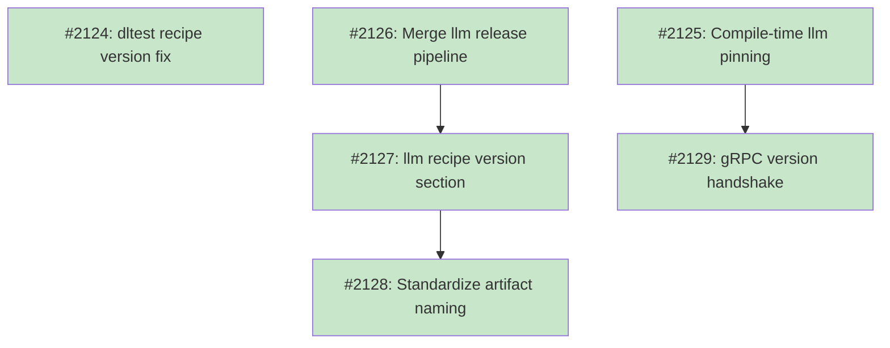

# DESIGN: Unified Release Versioning

## Status

Planned

## Context and Problem Statement

Tsuku ships three companion binaries that communicate via internal protocols: the Go CLI (main binary), tsuku-dltest (dlopen verification, invoked as subprocess), and tsuku-llm (LLM inference, gRPC daemon). These binaries are currently released through two independent pipelines with separate version namespaces.

The CLI and dltest already share a `v*` tag release via `release.yml`, producing 10 artifacts. The llm binary has a separate `llm-release.yml` triggered by `tsuku-llm-v*` tags -- but no such tags have ever been pushed, meaning the workflow has never run. The llm recipe currently points to a separate `tsukumogami/tsuku-llm` repo for version resolution.

This creates several problems:

1. **No version lockstep.** The CLI can run with any version of llm, risking protocol incompatibilities. Only dltest has compile-time version pinning with auto-reinstall.

2. **Inconsistent artifact naming.** The CLI uses GoReleaser's default (`tsuku-{os}-{arch}_{version}_{os}_{arch}`), dltest uses `tsuku-dltest-{os}-{arch}`, and llm uses `tsuku-llm-v{version}-{platform}`. The version-in-filename for CLI and llm is redundant since `github_file` already resolves within a tagged release.

3. **Recipe version resolution gap.** The llm recipe has no `[version]` section and falls back to InferredGitHubStrategy (priority 10), pulling from the wrong repo. Adding explicit version configuration would promote it to GitHubRepoStrategy (priority 90) and point it at the main repo's `v*` tags.

4. **No version constraint mechanism.** Dependencies in the recipe schema are version-agnostic string arrays. There's no way to express "this tool requires companion binaries at its own version."

Exploration across 8 research leads confirmed that the separate llm release has no consumers, the dltest version pinning pattern generalizes cleanly to llm, GPU build dependencies add ~10 minutes but parallelize fully, and artifact naming can be standardized without breaking existing users.

## Decision Drivers

- **Version safety:** Eliminate risk of running mismatched binary versions that share internal protocols (subprocess args for dltest, gRPC for llm)
- **Single release tag:** All artifacts should ship under one `v*` tag so a release is atomic
- **Recipe consistency:** Both companion recipes should resolve versions from the same source (`tsukumogami/tsuku` tags) using the same mechanism
- **Naming clarity:** Artifact filenames should follow a consistent pattern; version in filename is redundant given how `github_file` works
- **Pipeline simplicity:** One release workflow instead of two, with clear job dependency graph
- **GPU build constraints:** CUDA toolkit (5-8 min) and Vulkan SDK (3-5 min) add infrastructure but parallelize with cargo compilation; macOS Metal has zero setup overhead
- **Backward compatibility:** No external consumers of `tsuku-llm-v*` tags exist, making migration zero-risk
- **Backend suffix convention:** macOS omits GPU backend suffix (Metal is implicit); Linux includes cuda/vulkan to differentiate variants. This asymmetry is intentional and should be preserved.

## Considered Options

### Decision 1: Implementation strategy

**Context:** The unified release problem spans four dimensions (recipe resolution, version pinning, pipeline consolidation, artifact naming). These can be addressed all at once or incrementally.

**Chosen: Incremental Migration.**

Each dimension ships as an independent PR validated before the next begins. This gives the smallest blast radius per change and allows progressive validation across release cycles. If pipeline consolidation introduces a regression, it can be reverted without affecting version pinning work that already landed. Reviewers focus on one concern per PR instead of understanding all dimensions simultaneously.

The true implementation order accounts for dependencies between phases: dltest recipe fix first (works today), then llm version pinning (independent of pipeline), then pipeline merge (enables llm artifacts under `v*` tags), then llm recipe fix (depends on pipeline), then naming standardization.

*Alternative rejected: Full Consolidation.* Addresses all dimensions in 1-3 tightly-coupled PRs for an atomic transition with no intermediate inconsistency. Rejected because the high review burden and all-or-nothing rollback cost aren't justified -- the dimensions are separable enough that incremental delivery is cleaner. The naming-pipeline coupling (changing artifact names requires coordinated pipeline and recipe updates) is real but manageable within a single phase rather than requiring all phases to land together.

*Alternative rejected: Minimal (Pinning + Recipe Fix).* Solves the core safety problem with ~8 files changed. Rejected because keeping two workflows that both fire on `v*` tags introduces a release creation race condition (both try to create a GitHub release for the same tag). This fragility would need its own fix, and the naming inconsistency would remain as acknowledged-but-unaddressed debt. The incremental approach delivers version safety just as quickly (pinning is an early phase) while also committing to the full cleanup.

### Decision 2: Artifact naming convention

**Context:** Three different naming patterns exist across the binaries. The `github_file` action resolves assets within a tagged release, making version in filenames redundant.

**Chosen: No version in filenames.** Convention: `{tool}-{os}-{arch}[-{backend}]`.

Examples: `tsuku-linux-amd64`, `tsuku-dltest-linux-amd64`, `tsuku-llm-linux-amd64-cuda`. Backend suffix is asymmetric by design: omitted on macOS (Metal is the only option), included on Linux (cuda/vulkan differentiate variants). This matches how dltest already names its artifacts and aligns with how `github_file` resolves assets.

*Alternative rejected: Version in all filenames.* Format `{tool}-{version}-{os}-{arch}[-{backend}]`. More explicit but redundant since the release tag already identifies the version. Would require all recipes using `github_file` to include `{version}` in their asset patterns for tsuku's own binaries.

*Alternative rejected: Keep current mix.* Most fragile, requires recipes to handle heterogeneous patterns across the three binaries. Adds cognitive load for contributors.

### Decision 3: Version enforcement mechanism

**Context:** Only dltest has compile-time version pinning. llm accepts any installed version with no compatibility checking.

**Chosen: Compile-time ldflags pinning (same pattern as dltest) with optional gRPC handshake follow-up.**

Add `pinnedLlmVersion` to `internal/verify/version.go`, inject via `.goreleaser.yaml` ldflags, enforce in `addon/manager.go` with auto-reinstall on mismatch. Dev mode accepts any version; release mode requires exact match. A follow-up phase adds `addon_version` to the gRPC StatusResponse proto for runtime version visibility, improving diagnostic error messages.

*Alternative rejected: Recipe-level version constraints.* A new recipe field like `version_lock = "self"` would pin at install time. Rejected because it requires recipe schema changes for a special case (only companion binaries need this), and compile-time embedding is simpler and more reliable -- the constraint is guaranteed at build time rather than depending on install-time resolution.

## Decision Outcome

Unify tsuku's release versioning through an incremental migration in 5 phases:

1. **Recipe fix (dltest)** -- Add explicit `github_repo` to dltest recipe's `[version]` section
2. **Compile-time llm pinning** -- Extend dltest's ldflags pattern to llm with auto-reinstall
3. **Pipeline merge** -- Move llm builds into `release.yml`, extend finalize-release to 16+ artifacts, delete `llm-release.yml`
4. **Recipe fix (llm) + naming standardization** -- Update llm recipe to resolve from main repo, standardize all artifact names to `{tool}-{os}-{arch}[-{backend}]`
5. **gRPC version handshake** -- Add `addon_version` to StatusResponse proto for runtime diagnostics

Key properties:
- All three binaries ship under a single `v*` tag
- Version lockstep enforced at compile time (release mode requires exact match, dev mode permissive)
- Artifact naming follows `{tool}-{os}-{arch}[-{backend}]` with no version in filename
- Backend suffix is asymmetric: omitted on macOS (Metal implicit), included on Linux (cuda/vulkan)
- Each phase is independently deployable and validated before the next begins

## Solution Architecture

### Overview

Unified release versioning ensures all three tsuku binaries (CLI, dltest, llm) ship under a single `v*` tag with compile-time version enforcement. A single `release.yml` workflow builds all artifacts, and each companion binary's recipe resolves versions from `tsukumogami/tsuku` tags. The CLI enforces that companion binaries match its own version at runtime via ldflags-injected version variables.

### Components

**Release pipeline** (`release.yml`):
```
v* tag push
  ├─ release (GoReleaser) ─────────────────┐
  ├─ build-rust (dltest glibc, 4 platforms) ┼──→ integration-test ──→ finalize-release
  ├─ build-rust-musl (dltest musl, 2)       │
  └─ build-llm (6 platform matrix)  ───────┘
       ├─ darwin-arm64 (metal)
       ├─ darwin-amd64 (metal)
       ├─ linux-amd64-cuda
       ├─ linux-amd64-vulkan
       ├─ linux-arm64-cuda
       └─ linux-arm64-vulkan
```

All jobs run in parallel after the `release` job. `finalize-release` waits for all build jobs and `integration-test`, then verifies all 16+ artifacts are present before publishing the release.

**Version pinning** (`internal/verify/version.go`):
```go
var pinnedDltestVersion = "dev"  // existing
var pinnedLlmVersion = "dev"     // new
```

Both injected via `.goreleaser.yaml` ldflags. In release builds, these contain the release version (e.g., `0.6.0`). In dev builds, they default to `"dev"` which accepts any installed version.

**LLM version enforcement** (`internal/llm/addon/manager.go`):
```
EnsureAddon(ctx)
  ├─ Check TSUKU_LLM_BINARY env (skip if set)
  ├─ findInstalledBinary()
  ├─ [NEW] extractVersion(dirName) → compare with pinnedLlmVersion
  │   ├─ dev mode: accept any
  │   └─ release mode: mismatch → shutdownDaemon() → installViaRecipe(version) → restart
  ├─ installViaRecipe() (if not found)
  └─ cache and return path
```

**Recipe version resolution** (both `tsuku-dltest.toml` and `tsuku-llm.toml`):
```toml
[version]
github_repo = "tsukumogami/tsuku"
tag_prefix = "v"
```

Uses GitHubRepoStrategy (priority 90) to resolve versions from main repo tags, filtering by `v` prefix and stripping it (e.g., `v0.6.0` → `0.6.0`).

**Artifact naming convention**:
```
tsuku-{os}-{arch}                     # CLI (4 variants)
tsuku-dltest-{os}-{arch}[-musl]       # dltest (6 variants)
tsuku-llm-{os}-{arch}[-{backend}]     # llm (6 variants)
```

No version in filename. Backend suffix omitted on macOS (Metal implicit), included on Linux (cuda/vulkan).

### Key Interfaces

**Installer interface extension** (`internal/llm/addon/manager.go`):
```go
type Installer interface {
    InstallRecipe(ctx context.Context, recipeName string, gpuOverride string) error
    InstallRecipeVersion(ctx context.Context, recipeName string, version string, gpuOverride string) error  // new
}
```

The new `InstallRecipeVersion` method supports pinned version installation. The existing `InstallRecipe` remains for backward compatibility.

**GoReleaser archive naming** (`.goreleaser.yaml`):
```yaml
archives:
  - format: binary
    name_template: "{{ .Binary }}"
```

Overrides GoReleaser's default `{{ .Binary }}_{{ .Version }}_{{ .Os }}_{{ .Arch }}` template.

### Data Flow

Version flows from git tag through the entire system:

```
git tag v0.6.0
  → GoReleaser: .Version = "0.6.0"
    → ldflags: pinnedDltestVersion = "0.6.0", pinnedLlmVersion = "0.6.0"
    → binary name: tsuku-linux-amd64 (no version in name)
  → build-llm: VERSION = "0.6.0" (from GITHUB_REF_NAME)
    → cargo build: version injected into Cargo.toml
    → artifact name: tsuku-llm-linux-amd64-cuda (no version in name)
  → release assets: all 16+ artifacts attached to v0.6.0 tag
  → recipe resolution: [version] github_repo resolves "0.6.0" from v0.6.0 tag
  → github_file: downloads asset from v0.6.0 release by pattern match
  → runtime: CLI checks pinnedLlmVersion == installed directory version
```

## Implementation Approach

The six phases group into three batches based on dependency analysis. Phases within a batch can be developed and merged in parallel.

### Batch 1: Foundation (3 parallel PRs)

**Phase 1: dltest recipe fix**

Add `github_repo = "tsukumogami/tsuku"` to the existing `[version]` section in `recipes/t/tsuku-dltest.toml`. This promotes version resolution from InferredGitHubStrategy (priority 10) to GitHubRepoStrategy (priority 90), ensuring the recipe respects the `tag_prefix = "v"` configuration.

Deliverables:
- `recipes/t/tsuku-dltest.toml` (1 line added)

**Phase 2: llm compile-time pinning**

Extend the dltest version pinning pattern to llm. Add `pinnedLlmVersion` variable, inject via ldflags, enforce in the addon manager with daemon lifecycle handling.

Deliverables:
- `internal/verify/version.go` (add `pinnedLlmVersion` variable and accessor)
- `.goreleaser.yaml` (add ldflags entry)
- `internal/llm/addon/manager.go` (version check in `EnsureAddon`, daemon shutdown on mismatch)
- `internal/llm/addon/installer.go` or interface update (add version parameter)

**Phase 3: pipeline merge**

Move `llm-release.yml` build-llm matrix jobs into `release.yml`. Add GPU setup steps (CUDA toolkit, Vulkan SDK, protobuf). Extend `integration-test` to validate llm binaries. Extend `finalize-release` from 10 to 16+ expected artifacts. Delete `llm-release.yml`.

Deliverables:
- `.github/workflows/release.yml` (add build-llm job, extend integration-test and finalize-release)
- `.github/workflows/llm-release.yml` (delete)

### Batch 2: Integration (2 parallel PRs, after Batch 1)

**Phase 4: llm recipe fix**

Update `recipes/t/tsuku-llm.toml`: add `[version]` section pointing to main repo, change step `repo` fields from `tsukumogami/tsuku-llm` to `tsukumogami/tsuku`. Keep current asset patterns until naming standardization in Phase 5.

Deliverables:
- `recipes/t/tsuku-llm.toml` (version section + repo fields)

**Phase 6: gRPC version handshake**

Add `addon_version` field (field 6) to `StatusResponse` in `proto/llm.proto`. Update tsuku-llm to report its version. Add `EnsureVersionCompatible()` to `internal/llm/local.go` for runtime version checking with diagnostic error messages.

Deliverables:
- `proto/llm.proto` (add field)
- Generated Go proto files
- `internal/llm/local.go` (version check method)
- tsuku-llm server (version reporting in GetStatus)

### Batch 3: Naming (1 PR, after Batch 2)

**Phase 5: artifact naming standardization**

Update GoReleaser archive `name_template` to remove version suffix from CLI artifacts. Update llm build to remove version from artifact names. Update `finalize-release` expected artifact list. Update both recipes' asset patterns.

Deliverables:
- `.goreleaser.yaml` (add `name_template: "{{ .Binary }}"`)
- `.github/workflows/release.yml` (update artifact references in finalize-release and integration-test)
- `recipes/t/tsuku-llm.toml` (update asset patterns)
- llm build steps in release.yml (change output naming)

## Implementation Issues

### Milestone: [Unified Release Versioning](https://github.com/tsukumogami/tsuku/milestone/107)

| Issue | Dependencies | Tier |
|-------|--------------|------------|
| ~~[#2124: fix(recipes): add github_repo to dltest recipe for version resolution](https://github.com/tsukumogami/tsuku/issues/2124)~~ | ~~None~~ | ~~simple~~ |
| ~~_Add the missing `github_repo` field to the dltest recipe so version resolution works against the main repo's tags._~~ | | |
| ~~[#2125: feat(verify): add compile-time version pinning for tsuku-llm](https://github.com/tsukumogami/tsuku/issues/2125)~~ | ~~None~~ | ~~testable~~ |
| ~~_Pin the expected llm binary version at compile time so the CLI can detect mismatches and trigger auto-reinstall._~~ | | |
| ~~[#2126: feat(ci): merge llm release pipeline into unified release workflow](https://github.com/tsukumogami/tsuku/issues/2126)~~ | ~~None~~ | ~~testable~~ |
| ~~_Consolidate the separate llm release workflow into the main `release.yml`, building all three binaries under one tag._~~ | | |
| ~~[#2127: fix(recipes): add version section to llm recipe for unified tag resolution](https://github.com/tsukumogami/tsuku/issues/2127)~~ | ~~[#2126](https://github.com/tsukumogami/tsuku/issues/2126)~~ | ~~simple~~ |
| ~~_Point the llm recipe's version resolution at the main repo instead of the old tsuku-llm repo, now that releases are unified._~~ | | |
| ~~[#2128: refactor(release): standardize artifact naming to {tool}-{os}-{arch}](https://github.com/tsukumogami/tsuku/issues/2128)~~ | ~~[#2127](https://github.com/tsukumogami/tsuku/issues/2127)~~ | ~~testable~~ |
| ~~_Remove version suffixes from release artifact filenames and update GoReleaser templates, build steps, and recipe asset patterns._~~ | | |
| ~~[#2129: feat(llm): add gRPC version handshake for runtime version diagnostics](https://github.com/tsukumogami/tsuku/issues/2129)~~ | ~~[#2125](https://github.com/tsukumogami/tsuku/issues/2125)~~ | ~~testable~~ |
| ~~_Add an `addon_version` field to the gRPC StatusResponse so the CLI can verify the running daemon matches the expected version._~~ | | |

### Dependency Graph



**Legend**: Green = done, Blue = ready, Yellow = blocked

## Security Considerations

### Download Verification
Artifact naming changes must be coordinated with checksum generation and recipe asset patterns. If an asset pattern doesn't match the actual release asset name, the download fails in integration-test (blocking release). The `finalize-release` job generates `checksums.txt` after all artifacts are uploaded, so partial checksums aren't a risk. No change to the verification model -- the existing checksum-based download verification applies equally to renamed artifacts.

### Execution Isolation
Auto-reinstall on version mismatch (for both dltest and llm) invokes the recipe system, which downloads and installs binaries. This follows the same security model as manual `tsuku install` -- no privilege escalation, same download verification. The `Prompter` interface in `AddonManager` can gate auto-downloads with user confirmation.

### Supply Chain Risks
Consolidating all builds into one `release.yml` workflow doesn't change the trust boundary -- both workflows are in the same repository with the same access controls and branch protection rules. Changing the llm recipe's version resolution source from `tsukumogami/tsuku-llm` to `tsukumogami/tsuku` keeps the trust within the same GitHub organization.

### User Data Exposure
Not applicable. This design changes release infrastructure and version enforcement. The gRPC `addon_version` field in StatusResponse reports the binary version (not user data) and is only transmitted over a local Unix socket.

## Consequences

### Positive
- **Version safety**: Compile-time pinning eliminates the risk of running mismatched CLI/dltest/llm versions in release builds. Auto-reinstall handles upgrades transparently.
- **Atomic releases**: All artifacts ship under one `v*` tag. A release either has everything or nothing.
- **Simplified maintenance**: One release workflow instead of two. One version namespace instead of two.
- **Consistent naming**: All artifacts follow `{tool}-{os}-{arch}[-{backend}]`. No version duplication in filenames.
- **Incremental delivery**: Each batch can be validated in a release before the next lands. Problems are isolated to one dimension.

### Negative
- **Intermediate inconsistency**: Between batches, the system is in a mixed state (e.g., pinning exists but naming is still old). This is cosmetic but adds cognitive load.
- **Longer calendar time**: Three batches across multiple release cycles vs a single coordinated push. Version safety arrives in Batch 1 but naming cleanup waits until Batch 3.
- **Daemon lifecycle complexity**: LLM version mismatch handling requires shutting down a running daemon, reinstalling, and restarting. This is more complex than dltest's stateless subprocess pattern.
- **Installer interface change**: Adding a version parameter to the `Installer` interface affects all implementations and tests.

### Mitigations
- Intermediate inconsistency is harmless -- users never see it since the version-in-filename redundancy is transparent to them.
- Calendar time is acceptable because the core safety fix (version pinning) lands in Batch 1.
- Daemon lifecycle is a one-time implementation cost; the pattern is well-defined (shutdown, install, restart) and testable in isolation.
- Installer interface change is additive (new method alongside existing one) so no existing code breaks.
