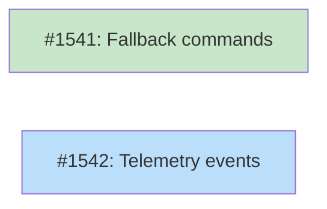

# DESIGN: Verification Self-Repair

## Status

Planned

## Implementation Issues

### Milestone: [Verification Self-Repair Completion](https://github.com/tsukumogami/tsuku/milestone/73)

| Issue | Dependencies | Tier |
|-------|--------------|------|
| ~~[#1541: feat(builders): add fallback command support for verification self-repair](https://github.com/tsukumogami/tsuku/issues/1541)~~ | None | testable |
| _Extends the existing output-detection self-repair to try `--help` and `-h` fallback commands when output analysis is inconclusive. This handles tools that don't produce clear help text with invalid flags._ | | |
| [#1542: feat(telemetry): add verify_self_repair event tracking](https://github.com/tsukumogami/tsuku/issues/1542) | None | simple |
| _Adds telemetry events to track self-repair frequency and method usage, enabling measurement of how often deterministic repair avoids LLM calls._ | | |

### Dependency Graph



**Legend**: Green = done, Blue = ready, Yellow = blocked, Purple = needs-design

## Context and Problem Statement

When recipe creation runs sandbox validation, the verification step (`verify.command`) often fails because most generated recipes default to `tool --version`. Not all CLI tools support `--version`, but most print help text when given invalid arguments—and this help text often contains patterns that enable deterministic repair without LLM fallback.

Currently:
- Recipes define verification in a `[verify]` section with `command`, `pattern`, `mode`, `exit_code`, `reason` fields
- During sandbox validation, if verification fails, the recipe fails validation
- LLM builders call `Session.Repair()` with failure details; deterministic builders return `RepairNotSupportedError`
- The `ParseValidationError` function (in `internal/validate/errors.go`) categorizes failures but doesn't distinguish "tool works but doesn't support --version" from actual failures

The problem: a working tool that rejects `--version` is indistinguishable from a broken installation. Both produce non-zero exit codes. But they have a key difference—the working tool usually outputs help text.

### Scope

**In scope:**
- Deterministic detection of recoverable verification failures
- Automatic adjustment of verify section (command, mode, exit_code, pattern)
- Integration with orchestrator validation loop
- Telemetry for tracking repair frequency and success rate

**Out of scope:**
- Other failure types (extraction, download, permission)
- Changes to recipe TOML format
- LLM-based verification repair (already exists)
- User-authored recipes (only applies to generated recipes)

## Decision Drivers

1. **Reduce LLM costs** - Each LLM repair call costs money and takes 5-10 seconds
2. **Decrease CI failures** - Batch recipe creation should be more reliable
3. **Maintain compatibility** - No changes to existing recipe format or verification semantics
4. **Handle diverse CLI conventions** - Tools use --version, -V, version, --help, or none of these
5. **Preserve explicit verification** - User-authored recipes with unusual patterns shouldn't be auto-modified
6. **Sandbox compatibility** - Must work without network access

## Considered Options

### Decision 1: Where to Insert Self-Repair Logic

The orchestrator (`internal/builders/orchestrator.go`) currently handles the generate → validate → repair cycle. When validation fails, it calls `Session.Repair()`. We need to decide where deterministic verification repair fits.

#### Chosen: Orchestrator Pre-Repair Phase

Add a verification self-repair step in `Orchestrator.Create()` between sandbox validation failure and `Session.Repair()` call. If the failure is a recoverable verification error (detected via output patterns), attempt deterministic repair before falling back to LLM.

The orchestrator already manages the repair loop (lines 158-209), so this is the natural integration point. The flow becomes:

1. Run sandbox validation
2. If validation fails, check if it's a verification failure
3. If verification failure detected, attempt self-repair
4. If self-repair succeeds, re-run validation
5. If self-repair fails or not applicable, proceed to `Session.Repair()`

This keeps the orchestrator as the single coordinator while adding a new capability. It works for all builders without requiring each to implement verification repair.

#### Alternatives Considered

**New VerificationRepairer component**: Create a standalone component that the orchestrator delegates to for verification-specific repairs.
Rejected because it adds abstraction without clear benefit—the logic is simple enough to live in the orchestrator, and a separate component would still need to integrate at the same orchestrator point.

**Extend ParseValidationError with repair logic**: Add repair capabilities to the existing error parser in `internal/validate/errors.go`.
Rejected because it mixes concerns—parsing should identify and categorize problems, not fix them. The parser already does its job well; repair logic belongs in the repair path.

### Decision 2: Verification Fallback Strategy

Different CLI tools support different flags. We need a strategy to find a working verification command when the default fails.

#### Chosen: Hybrid Detection

The strategy operates in two phases:

**Phase 1: Analyze failure output**

When verification fails (non-zero exit), examine stdout/stderr for help-text indicators:
- Contains `usage:` (case-insensitive)
- Contains the tool name
- Output is longer than typical error messages (>200 bytes)
- Exit code is 1 or 2 (common for "invalid argument" vs 127 for "not found")

If these patterns match, the tool is working—it just doesn't support the original flag. Create a repaired verify section with:
- `mode = "output"`
- `exit_code = <actual exit code>`
- `pattern = "usage:"` or tool name (regex-escaped if used in pattern)
- `reason = "verification repaired: tool does not support --version"`

**Phase 2: Try fallback commands (if Phase 1 inconclusive)**

If the output analysis is ambiguous (e.g., empty stderr, unusual exit code), try alternative verification commands in order:
1. `tool --help` - Nearly universal, 99%+ support
2. `tool -h` - Common short form

These commands run in the sandbox with the same environment as the original verification.

This hybrid approach minimizes wasted sandbox executions by being smart about the failure output first, while still handling ambiguous cases through fallbacks.

#### Alternatives Considered

**Fixed fallback hierarchy only**: Always try --version, then -V, then --help, then -h in sequence until one works.
Rejected because it wastes sandbox execution time. If the original `--version` failed with help output in stderr, we already know the tool works—running three more commands is unnecessary.

**Pattern detection only**: Only analyze failure output, never try additional commands.
Rejected because some failures are genuinely ambiguous. A tool might exit with code 1 and print nothing to stderr. Fallback commands help confirm the binary is functional.

### Decision 3: Recipe Modification Approach

When self-repair succeeds, we need to update the recipe with the working verification.

#### Chosen: Return Modified Recipe with Repair Metadata

Create a copy of the recipe with the fixed verify section. Track what was changed in `BuildResult.RepairMetadata` (new field):

```go
type RepairMetadata struct {
    Type        string // "verification_self_repair"
    Original    string // original verify.command
    Repaired    string // repaired verify.command
    Method      string // "output_detection" or "fallback_help"
    ExitCode    int    // detected exit code
}
```

This metadata enables:
- Telemetry reporting on repair frequency
- Debugging when repairs produce unexpected results
- Distinguishing "worked first time" from "needed repair"

The original recipe is not mutated; a new recipe object is returned. This preserves the separation between "what was generated" and "what actually works."

#### Alternatives Considered

**Mutate recipe in-place**: Directly modify the recipe object's verify section.
Rejected because it makes debugging harder—callers can't distinguish "original verify worked" from "repair fixed it." Also prevents tracking repair statistics.

**Return structured feedback for caller to apply**: Don't modify the recipe; return repair instructions that the caller applies.
Rejected because it pushes complexity to every caller of the orchestrator. The orchestrator should handle this internally and return a usable recipe.

## Decision Outcome

**Chosen: 1A + 2C + 3B**

### Summary

The orchestrator gains a verification self-repair capability that runs after sandbox validation fails but before calling LLM repair. When a verification failure is detected, the system first analyzes the failure output looking for help-text patterns that indicate the tool works but doesn't support the attempted flag. If such patterns are found, it adjusts the verify section to use `mode=output` with the detected exit code and a pattern like "usage:" that will match the help text. The repaired recipe is then re-validated in the sandbox.

If output analysis is inconclusive, the system tries fallback commands (`--help`, then `-h`) to find a working verification approach. When any repair succeeds, the original recipe is preserved and a copy with the repaired verify section is returned, along with `RepairMetadata` in the `BuildResult` that tracks what was changed and how.

This maintains compatibility with existing recipes while reducing LLM calls for the common case of tools that simply don't support `--version`. The repair is deterministic and fast—no API calls, just pattern matching and optionally running one or two fallback commands in the sandbox.

### Rationale

These decisions reinforce each other: the orchestrator placement ensures all builders benefit without duplication, the hybrid detection strategy avoids wasted work while handling edge cases, and the metadata approach enables measurement without losing information.

The key trade-off is complexity vs. coverage. A simpler approach (just try --help always) would work for 95% of cases but waste sandbox time. The hybrid approach adds detection logic but handles the common case optimally.

### Trade-offs Accepted

- **Added orchestrator complexity**: The orchestrator gains ~100 lines of repair logic. This is acceptable because the logic is self-contained and testable.
- **Pattern matching heuristics**: The detection relies on patterns that may have edge cases. Acceptable because false negatives (failing to detect a repairable case) just fall through to LLM repair, and false positives are caught by re-validation.
- **Limited to verification failures**: This doesn't help with extraction or download failures. Acceptable because verification is the most common failure mode for batch creation.

## Solution Architecture

### Overview

The verification self-repair system adds a deterministic repair layer to the orchestrator's validation loop. It intercepts verification failures, attempts pattern-based repair, and only falls back to LLM repair when deterministic repair fails.

### Components

```
┌─────────────────────────────────────────────────────────────────┐
│                         Orchestrator                            │
│  ┌─────────────┐    ┌──────────────────┐    ┌───────────────┐  │
│  │   Generate  │───▶│     Validate     │───▶│  Self-Repair  │  │
│  └─────────────┘    └──────────────────┘    └───────────────┘  │
│                              │                      │           │
│                              │ failed               │ success   │
│                              ▼                      ▼           │
│                     ┌──────────────────┐    ┌───────────────┐  │
│                     │   LLM Repair     │    │  Re-validate  │  │
│                     └──────────────────┘    └───────────────┘  │
└─────────────────────────────────────────────────────────────────┘
```

**New components:**

1. **VerifyFailureAnalyzer** (`internal/validate/verify_analyzer.go`)
   - Analyzes sandbox output for help-text patterns
   - Returns structured `VerifyFailureAnalysis` with detected patterns

2. **VerifyRepairer** (in `internal/builders/orchestrator.go`)
   - Uses analyzer to detect repairable failures
   - Generates repaired verify section
   - Optionally runs fallback commands

### Key Interfaces

```go
// internal/validate/verify_analyzer.go

// VerifyFailureAnalysis contains results from analyzing a verification failure.
type VerifyFailureAnalysis struct {
    Repairable     bool
    ToolName       string   // extracted from output if found
    ExitCode       int
    HasUsageText   bool     // contains "usage:" pattern
    HasToolName    bool     // output contains the tool name
    OutputLength   int
    SuggestedMode  string   // "output" or ""
    SuggestedPattern string // pattern to match
}

// AnalyzeVerifyFailure examines sandbox output to determine if the
// verification failure is repairable.
func AnalyzeVerifyFailure(
    stdout, stderr string,
    exitCode int,
    toolName string,
) *VerifyFailureAnalysis
```

```go
// internal/builders/orchestrator.go (additions)

// RepairMetadata tracks how a recipe was repaired.
type RepairMetadata struct {
    Type        string `json:"type"`
    Original    string `json:"original"`
    Repaired    string `json:"repaired"`
    Method      string `json:"method"`
    ExitCode    int    `json:"exit_code"`
}

// BuildResult additions
type BuildResult struct {
    // ... existing fields ...
    RepairMetadata *RepairMetadata `json:"repair_metadata,omitempty"`
}
```

### Data Flow

1. **Sandbox validation fails** with non-zero exit code
2. **Check entry conditions**: Skip self-repair if:
   - Exit code is 127 (command not found - binary missing)
   - Exit code is 0 (validation passed - shouldn't reach here)
   - Output is empty (nothing to analyze)
   Proceed if exit code is 1-2 (typical "invalid argument" codes)
3. **Analyze output**: Pass stdout, stderr, exit code to `AnalyzeVerifyFailure`
4. **If repairable**:
   - Clone recipe with modified verify section
   - Set `mode=output`, `exit_code=<detected>`, `pattern=<detected>`
   - Re-run sandbox validation
   - If passes: return repaired recipe with metadata
   - If fails: proceed to fallback
5. **Try fallbacks** (if Phase 1 inconclusive or failed):
   - Generate modified recipe with `--help` command
   - Run sandbox validation
   - If passes: return with metadata
   - Try `-h` if `--help` fails
6. **Fallback to LLM**: If all self-repair attempts fail, call `Session.Repair()`

## Implementation Approach

### Phase 1: Verify Failure Analyzer

Add detection logic for help-text patterns.

**Files:**
- `internal/validate/verify_analyzer.go` (new)
- `internal/validate/verify_analyzer_test.go` (new)

**Implementation:**
- Pattern matching for "usage:", tool name, output length
- Return structured analysis result
- No side effects, pure analysis

### Phase 2: Orchestrator Integration

Add self-repair step to validation loop.

**Files:**
- `internal/builders/orchestrator.go` (modify)
- `internal/builders/types.go` (add RepairMetadata)
- `internal/recipe/recipe.go` (add WithVerify helper)
- `internal/builders/orchestrator_test.go` (modify)

**Implementation:**
- Add `attemptVerifySelfRepair` method
- Insert before `Session.Repair()` call in `Create()`
- Add `Recipe.WithVerify(VerifySection)` helper for clean recipe cloning
- Track repairs in BuildResult

### Phase 3: Fallback Commands

Add fallback command execution when output analysis is inconclusive.

**Files:**
- `internal/builders/orchestrator.go` (modify)

**Implementation:**
- Clone recipe with modified verify command
- Run sandbox validation with fallback
- Try `--help`, then `-h`

### Phase 4: Telemetry

Add telemetry events for repair tracking.

**Files:**
- `internal/telemetry/events.go` (modify)
- `internal/builders/orchestrator.go` (modify)

**Implementation:**
- New `verify_self_repair` event type
- Track: tool name, repair method, success/failure, time saved

## Security Considerations

### Download Verification

**Not applicable** - This feature does not download external artifacts. It only analyzes and modifies the `verify` section of recipes. All downloads are handled by existing download actions which have their own verification.

### Execution Isolation

**Low impact** - The self-repair logic runs commands in the existing sandbox environment, which already isolates execution:
- Commands run in the same container as normal verification
- No new permissions required
- No access to host filesystem beyond existing mounts
- Fallback commands (`--help`, `-h`) are standard and low-risk

The only additional execution is running 1-2 fallback commands when output analysis is inconclusive. These run with the same isolation as the original verification command.

### Supply Chain Risks

**Not applicable** - This feature does not change where binaries come from or how they're obtained. It only changes how we verify that installed binaries work. The verification command itself (`--help` or `-h`) doesn't fetch external resources.

### User Data Exposure

**Minimal** - The self-repair logic:
- Reads: sandbox stdout/stderr (already captured for LLM repair)
- Writes: repair metadata to BuildResult (local only)
- Transmits: telemetry event (tool name, repair method) if telemetry enabled

No sensitive user data is accessed. The repair metadata contains only tool name and verification commands, which are already visible in recipes.

### Mitigations

| Risk | Mitigation | Residual Risk |
|------|------------|---------------|
| Malicious tool output tricks analyzer | Pattern matching is conservative; false negatives fall through to LLM | Minimal - worst case is unnecessary LLM call |
| Fallback command hangs | Sandbox already has timeout | None - existing mitigation applies |
| Repair produces working but wrong recipe | Re-validation in sandbox catches this | Minimal - same as any verification |

## Consequences

### Positive

- **Reduced LLM costs**: Batch recipe creation makes fewer LLM calls
- **Faster validation**: Deterministic repair is faster than LLM roundtrip
- **Higher CI success rate**: Fewer random failures from verification edge cases
- **Better observability**: Repair metadata enables tracking of common failures

### Negative

- **Orchestrator complexity**: ~100 lines of new repair logic
- **Heuristic edge cases**: Pattern matching may miss some cases or misidentify others
- **Limited scope**: Only helps verification failures, not other failure types

### Mitigations

- **Complexity**: Logic is isolated in clearly-named methods with good test coverage
- **Edge cases**: False negatives fall through to LLM; false positives caught by re-validation
- **Limited scope**: Verification is the most common batch creation failure; can extend to other types later
