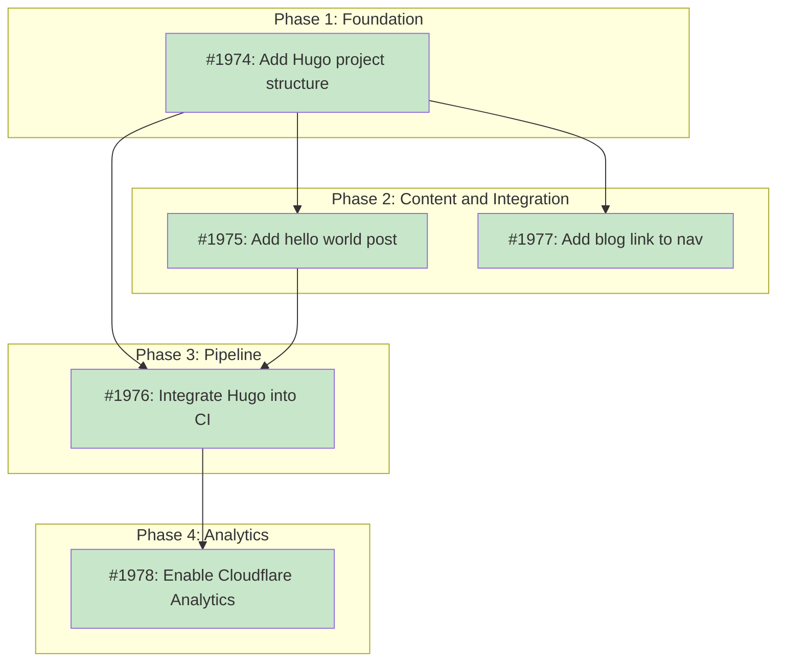

# DESIGN: Blog Infrastructure for tsuku.dev

## Status

Current

## Implementation Issues

### Milestone: [Blog Infrastructure for tsuku.dev](https://github.com/tsukumogami/tsuku/milestone/106)

| Issue | Dependencies | Tier |
|-------|--------------|------|
| ~~[#1974: Add Hugo project structure and templates](https://github.com/tsukumogami/tsuku/issues/1974)~~ | ~~None~~ | ~~testable~~ |
| ~~_Creates the Hugo project at `blog/` with `hugo.toml`, three layout templates (`baseof.html`, `single.html`, `list.html`), blog-specific CSS, OG default image, and gitignore entry. This is the foundation that all other blog work builds on._~~ | | |
| ~~[#1975: Add hello world validation post](https://github.com/tsukumogami/tsuku/issues/1975)~~ | ~~[#1974](https://github.com/tsukumogami/tsuku/issues/1974)~~ | ~~testable~~ |
| ~~_Adds the section index and first blog post with frontmatter that exercises CSS styles (headings, code blocks, inline code). Validates that Hugo rendering, template blocks, and OpenGraph tags work end-to-end._~~ | | |
| ~~[#1976: Integrate Hugo build into CI pipeline](https://github.com/tsukumogami/tsuku/issues/1976)~~ | ~~[#1974](https://github.com/tsukumogami/tsuku/issues/1974), [#1975](https://github.com/tsukumogami/tsuku/issues/1975)~~ | ~~testable~~ |
| ~~_Updates `deploy-website.yml` with Hugo install (checksum-verified `.deb`), blog build step, and `blog/**` path triggers. After this, pushing a markdown file to `blog/content/posts/` automatically builds and deploys the blog alongside the existing site._~~ | | |
| ~~[#1977: Add blog link to site navigation](https://github.com/tsukumogami/tsuku/issues/1977)~~ | ~~[#1974](https://github.com/tsukumogami/tsuku/issues/1974)~~ | ~~simple~~ |
| ~~_Adds "Blog" links to the nav and footer of user-facing pages (`index.html`, `recipes/`, `telemetry/`, `404.html`) so visitors can discover the blog from any page on tsuku.dev._~~ | | |
| ~~[#1978: Enable Cloudflare Web Analytics](https://github.com/tsukumogami/tsuku/issues/1978)~~ | ~~[#1976](https://github.com/tsukumogami/tsuku/issues/1976)~~ | ~~simple~~ |
| ~~_Enables Cloudflare Web Analytics on the tsuku.dev zone so we can see visitor metrics for the blog and existing pages. No code changes needed -- configured in the Cloudflare dashboard._~~ | | |

### Dependency Graph



**Legend**: Green = done, Blue = ready, Yellow = blocked, Purple = needs-design, Orange = tracks-design

## Upstream Design Reference

This design implements part of the launch strategy from the vision repo, which calls for publishing blog posts to tsuku.dev as part of a launch campaign. The upstream design requires blog infrastructure with OpenGraph support for LinkedIn sharing.

## Context and Problem Statement

tsuku.dev serves as the project's landing page and recipe browser. It's built entirely from hand-written static HTML with a shared CSS stylesheet, deployed to Cloudflare Pages via direct upload. There's no build system, no templating engine, and no markdown processing -- each page is a self-contained HTML file.

This works well for the current site, but it doesn't scale to blog content. Writing full HTML for each post is tedious and error-prone, discourages contributions, and makes it hard to maintain consistent styling across posts. Markdown is the natural format for technical blog posts, but converting markdown to HTML that matches the existing site requires some kind of build pipeline.

The site's deployment workflow (`deploy-website.yml`) already runs a Python script to generate `recipes.json` before uploading. Any blog build step needs to integrate with this existing flow without breaking the current pages. The site also uses a custom dark theme with CSS variables (`--bg`, `--text`, `--accent`, `--border`, `--code-bg`) and a system font stack that the blog templates must inherit.

Beyond the pipeline, each blog post needs OpenGraph meta tags for social sharing previews on platforms like LinkedIn. This metadata (title, description, image) should come from post frontmatter so authors don't need to touch HTML.

### Scope

**In scope:**
- Static site generator selection and integration
- Blog post template inheriting the existing CSS theme
- OpenGraph meta tags populated from markdown frontmatter
- Cloudflare Pages build configuration changes
- Blog index page listing posts in reverse chronological order
- A "hello world" post to validate the infrastructure end-to-end

**Out of scope:**
- RSS/Atom feed (can be added later)
- Comments or interactive features
- Changes to existing pages (landing, recipes, pipeline, coverage)
- Blog content strategy beyond the validation post

## Decision Drivers

- **Zero new runtime dependencies for readers**: The site must remain pure static HTML/CSS/JS after build
- **Minimal toolchain for authors**: Adding a post should mean committing a markdown file with frontmatter
- **CSS consistency**: Blog pages must use the same CSS variables and font stack as the rest of the site, without duplicating the stylesheet
- **Single binary preferred**: The current site has no Node.js, npm, or similar toolchain; introducing one adds maintenance burden
- **CI integration**: The build must run in GitHub Actions alongside the existing `recipes.json` generation
- **OpenGraph support**: Posts need title, description, and image meta tags for social sharing
- **Validation-first**: The initial delivery should include a hello world post proving the full pipeline works

## Considered Options

### Decision 1: Build Tool

The current site has no build step at all -- HTML files are deployed directly. Adding a blog means introducing some tool that converts markdown to HTML. The question is whether to use an established static site generator or write a custom build script.

The tool choice shapes everything downstream: how templates are authored, how the CI pipeline changes, what dependencies maintainers need, and how much code the project owns vs. delegates.

#### Chosen: Hugo

Hugo is a static site generator written in Go. It ships as a single binary with no runtime dependencies for basic use (no Node.js, no Ruby, no Python). It uses Go's `html/template` system for layouts and has built-in support for OpenGraph meta tags, RSS feeds, syntax highlighting, and content organization.

For the blog use case, Hugo offers:

- A `baseof.html` master template that defines the page shell (head, nav, footer), with `single.html` and `list.html` filling in content via block directives
- Built-in OpenGraph via `{{ template "_internal/opengraph.html" . }}`, which reads `title`, `description`, and `images` from post frontmatter
- YAML or TOML frontmatter support with predefined fields (`title`, `date`, `description`, `draft`, `images`, `slug`)
- Section-based content organization: files under `content/blog/` automatically get blog-specific templates
- A `static/` directory whose contents are copied verbatim to the output, allowing existing HTML pages to coexist with generated blog pages

Hugo's template system has a steep learning curve for complex sites, but for a blog with one post template and one index template, the surface area is small. The standard edition handles everything needed here; the extended edition (for Sass/SCSS) is unnecessary since the site uses plain CSS.

In CI, Hugo is installed by downloading the `.deb` package from GitHub releases with checksum verification -- no third-party action required:

```yaml
- name: Install Hugo
  env:
    HUGO_VERSION: "0.147.0"
  run: |
    wget -q -O /tmp/hugo.deb \
      https://github.com/gohugoio/hugo/releases/download/v${HUGO_VERSION}/hugo_${HUGO_VERSION}_linux-amd64.deb
    wget -q -O /tmp/hugo_checksums.txt \
      https://github.com/gohugoio/hugo/releases/download/v${HUGO_VERSION}/hugo_${HUGO_VERSION}_checksums.txt
    cd /tmp && grep "hugo_${HUGO_VERSION}_linux-amd64.deb" hugo_checksums.txt | sha256sum -c
    sudo dpkg -i /tmp/hugo.deb
```

The version is pinned explicitly in the workflow and the checksum is verified before installation.

#### Alternatives Considered

**Zola (Rust SSG)**: Single binary, Tera template engine (Jinja2-like), built-in Sass compiler. Rejected because Zola deletes and recreates its output directory on each build, requiring a post-build merge step to combine blog output with the existing site. It also lacks built-in OpenGraph templates, meaning more manual template work. Smaller community means fewer resources when debugging template issues.

**Custom Python script**: ~80-100 lines using `python-frontmatter` and `jinja2`, running alongside the existing `generate-registry.py`. Python is already in the CI workflow. Rejected because it requires maintaining custom code for features Hugo provides out of the box (index generation, OpenGraph tags, draft handling, date formatting). Every new blog feature (RSS, syntax highlighting, reading time) would need custom implementation rather than configuration.

**Custom Go tool**: ~200-225 lines using `goldmark` and `html/template`. Fits the monorepo naturally. Rejected for the same reason as the Python approach -- it trades Hugo's built-in features for full control that isn't needed here. The initial simplicity is offset by ongoing maintenance as blog requirements grow.

### Decision 2: Site Structure

The existing site deploys the `website/` directory directly to Cloudflare Pages. Introducing Hugo raises a structural question: should Hugo manage the entire site (moving existing pages into Hugo's `static/` directory), or should Hugo handle only the blog while the rest of the site stays as-is?

This matters because restructuring the whole site is a large migration with risk of breaking existing pages, while keeping Hugo scoped to the blog means coordinating two different content systems in one deployment.

#### Chosen: Hugo source outside website/, output into website/blog/

The Hugo project lives in `blog/` at the repository root, separate from the `website/` deployment directory. During CI, Hugo builds the blog and outputs directly into `website/blog/`. This matches the existing pattern where `scripts/generate-registry.py` lives outside `website/` and writes `recipes.json` into it.

The directory layout:

```
blog/                               # Hugo project (source, not deployed)
├── hugo.toml                       # Hugo config
├── content/
│   └── posts/
│       ├── _index.md               # Section index metadata
│       └── hello-world.md          # Blog posts (markdown)
├── layouts/
│   ├── _default/
│   │   ├── baseof.html             # Base template
│   │   └── single.html             # Post template
│   └── posts/
│       └── list.html               # Blog index template
└── static/                         # Empty (CSS comes from website/)

website/
├── index.html                      # Existing (unchanged)
├── assets/
│   ├── style.css                   # Existing (unchanged)
│   └── blog.css                    # Blog-specific styles (new)
├── recipes/                        # Existing (unchanged)
├── ...                             # All other existing pages
└── blog/                           # Generated by Hugo (gitignored)
    ├── index.html                  # Blog index
    └── posts/
        └── hello-world/
            └── index.html          # Individual post
```

Keeping Hugo source outside `website/` prevents raw source files (hugo.toml, markdown files, templates) from being deployed to Cloudflare Pages. The `website/blog/` directory is entirely generated and gitignored. This is the same source-outside-output pattern that `scripts/generate-registry.py` already uses.

Blog templates reference the shared stylesheet with an absolute path (`/assets/style.css`), so they inherit the same CSS variables and font stack without duplication.

**Local development note:** Running `hugo server` from `blog/` serves pages at `localhost:1313/blog/`, but the shared stylesheet at `/assets/style.css` won't resolve because Hugo's dev server only knows about its own `static/` directory. For local preview with styles, either symlink `website/assets/` into `blog/static/assets/` or use `python3 -m http.server` from the repo root after running `hugo --source blog --destination $PWD/website/blog`.

#### Alternatives Considered

**Hugo manages the entire site**: Move all existing HTML into Hugo's `static/` directory and let Hugo generate everything. Rejected because this is a large migration that touches every existing page for zero benefit. The existing pages are static HTML that works fine; there's no reason to route them through Hugo. It also means every site change requires understanding Hugo's directory conventions, raising the barrier for contributors who just want to edit an HTML page.

**Hugo source inside `website/blog/`**: Put the Hugo project (hugo.toml, content/, layouts/) directly inside the deployment directory and build in-place. Rejected because the entire `website/` directory is uploaded to Cloudflare Pages, which would make Hugo source files publicly accessible at URLs like `https://tsuku.dev/blog/hugo.toml`. It also creates a fragile gitignore situation where committed source and generated output coexist in the same directory.

**Hugo project at repo root**: Put Hugo's `hugo.toml` and `layouts/` at the repository root, treating the whole repo as a Hugo project. Rejected because tsuku is a Go monorepo and Hugo would conflict with Go's directory conventions. It would also entangle blog configuration with CLI code.

### Decision 3: OpenGraph Implementation

Each blog post needs meta tags for social sharing previews. The Open Graph protocol requires `og:title`, `og:description`, `og:url`, `og:type`, and optionally `og:image` in the page's `<head>`. The question is whether to use Hugo's built-in OpenGraph template or write custom meta tags in the template.

#### Chosen: Hugo's built-in OpenGraph template with custom fallbacks

Use Hugo's embedded `opengraph.html` partial as the base, which reads standard frontmatter fields:

| OG property | Hugo source |
|---|---|
| `og:title` | `.Title` |
| `og:description` | `.Description` or `.Summary` |
| `og:url` | `.Permalink` |
| `og:type` | `article` for posts, `website` for index |
| `og:image` | Frontmatter `images` array |
| `og:site_name` | Site title from `hugo.toml` |

The base template's `<head>` includes:

```html
{{ template "_internal/opengraph.html" . }}
```

For posts without an explicit `images` field, a site-level default image is configured in `hugo.toml`:

```toml
[params]
  images = ["https://tsuku.dev/assets/og-default.png"]
```

Post frontmatter can override with per-post images:

```yaml
---
title: "Hello, World"
description: "First post on the tsuku blog."
date: 2026-03-01
images:
  - https://tsuku.dev/assets/blog/hello-world.png
---
```

#### Alternatives Considered

**Fully custom OG tags in template**: Write `<meta property="og:*">` tags directly in the base template using Hugo variables. Rejected because Hugo's built-in template already handles the standard fields correctly, including edge cases like missing descriptions falling back to auto-generated summaries. Custom tags would duplicate this logic.

## Decision Outcome

**Chosen: Hugo scoped to blog + built-in OpenGraph**

### Summary

The blog infrastructure uses Hugo as a build tool, with source files in `blog/` at the repo root and generated output written to `website/blog/`. Hugo converts markdown posts into static HTML using templates that reference the site's shared CSS stylesheet at `/assets/style.css`. Blog-specific styles live in a separate `website/assets/blog.css` file that uses the existing CSS variables. The generated pages inherit the dark theme and font stack without duplicating the main stylesheet.

Authors write posts as markdown files in `blog/content/posts/` with YAML frontmatter containing `title`, `date`, `description`, and optionally `images`. Hugo generates individual post pages and a reverse-chronological index page. OpenGraph meta tags for social sharing come from Hugo's built-in template, which reads the frontmatter fields directly.

The CI pipeline adds two steps to `deploy-website.yml` before the Cloudflare Pages upload: install Hugo (via `.deb` from GitHub releases with a pinned version, checksum-verified), then run `hugo --source blog --destination $PWD/website/blog`. The Hugo source directory stays out of the `website/` deployment tree so raw templates and markdown aren't publicly accessible. The existing Python step for `recipes.json` runs unchanged. A blog build failure blocks the entire deployment, same as any other CI step -- this is intentional, since deploying stale blog content silently would be worse.

A hello world post ships with the initial implementation to validate the full pipeline: markdown authoring, template rendering, CSS integration, OpenGraph tags, CI build, and Cloudflare Pages deployment.

### Rationale

Hugo and the source-outside-output structure reinforce each other. Hugo's build writes directly into `website/blog/`, following the same pattern as `generate-registry.py` writing `recipes.json` into `website/`. The existing site doesn't need restructuring, and Hugo source files stay out of the deployment directory. Hugo's built-in OpenGraph and frontmatter support mean the templates stay small (one base layout, one post template, one index template) with no custom code for metadata extraction.

The alternative of a custom script would be simpler initially (~80-100 lines) but creates a maintenance surface that grows with each new feature. Hugo handles draft posts, date-based publishing, syntax highlighting, and RSS as configuration rather than code. Since tsuku is a Go project, Hugo (also Go) is a natural fit for the toolchain.

The trade-off is complexity: Hugo has a learning curve for its template system, and debugging template issues requires understanding Go's `text/template` syntax. For a blog with three templates, this is manageable. If the blog never grows beyond a handful of posts, a custom script would have been simpler. But the expected use case (ongoing technical posts) justifies the investment in a mature SSG.

## Solution Architecture

### Overview

The blog subsystem has two directories: `blog/` at the repo root (Hugo source) and `website/blog/` (generated output, gitignored). Hugo reads markdown from `blog/content/` and writes static HTML to `website/blog/` during CI. No changes to existing pages are needed.

### Components

```
blog/                                # Hugo project (committed source)
├── hugo.toml                        # Site configuration
├── content/
│   └── posts/
│       ├── _index.md                # Section index metadata
│       └── hello-world.md           # Blog posts
├── layouts/
│   ├── _default/
│   │   ├── baseof.html              # Page shell: <html>, <head>, nav, footer
│   │   └── single.html              # Individual post layout
│   └── posts/
│       └── list.html                # Blog index (reverse chronological)
└── static/                          # Empty (CSS comes from website/)

website/
├── assets/
│   ├── style.css                    # Shared site styles (unchanged)
│   └── blog.css                     # Blog-specific styles (new)
└── blog/                            # Generated output (gitignored)
```

### Hugo Configuration (`hugo.toml`)

```toml
baseURL = "https://tsuku.dev/blog/"
languageCode = "en-us"
title = "tsuku blog"

[params]
  description = "Technical posts about tsuku's design and development"
  images = ["https://tsuku.dev/assets/og-default.png"]
```

The `baseURL` includes `/blog/` so all generated links are correctly rooted under that path.

### Template Structure

**`baseof.html`** defines the page shell, matching the existing site's HTML structure:

```html
<!DOCTYPE html>
<html lang="en">
<head>
    <meta charset="UTF-8">
    <meta name="viewport" content="width=device-width, initial-scale=1.0">
    <meta name="description" content="{{ .Description | default .Site.Params.description }}">
    <title>{{ .Title }} - tsuku blog</title>
    <link rel="stylesheet" href="/assets/style.css">
    <link rel="stylesheet" href="/assets/blog.css">
    {{ template "_internal/opengraph.html" . }}
</head>
<body>
    <header>
        <nav>
            <a href="/" class="logo">tsuku</a>
            <a href="https://github.com/tsukumogami/tsuku" class="github-link" aria-label="GitHub">
                <!-- GitHub SVG icon -->
            </a>
        </nav>
    </header>
    <main>
        {{ block "main" . }}{{ end }}
    </main>
    <footer>
        <p>
            <a href="/telemetry">Privacy</a>
            <span class="sep">|</span>
            <a href="https://github.com/tsukumogami/tsuku">GitHub</a>
        </p>
    </footer>
</body>
</html>
```

**`single.html`** renders individual posts:

```html
{{ define "main" }}
<article class="blog-post">
    <h1>{{ .Title }}</h1>
    <time datetime="{{ .Date.Format "2006-01-02" }}">{{ .Date.Format "January 2, 2006" }}</time>
    <div class="post-content">
        {{ .Content }}
    </div>
    <a href="/blog/">Back to blog</a>
</article>
{{ end }}
```

**`list.html`** renders the blog index:

```html
{{ define "main" }}
<section class="blog-index">
    <h1>Blog</h1>
    {{ range .Pages }}
    <article class="blog-entry">
        <h2><a href="{{ .Permalink }}">{{ .Title }}</a></h2>
        <time datetime="{{ .Date.Format "2006-01-02" }}">{{ .Date.Format "January 2, 2006" }}</time>
        <p>{{ .Description | default .Summary }}</p>
    </article>
    {{ end }}
</section>
{{ end }}
```

### CSS Integration

Blog templates reference `/assets/style.css` via an absolute path. Since the blog output is merged into the `website/` directory before deployment, this resolves to the existing shared stylesheet. The blog pages inherit all CSS variables, the dark theme, and the system font stack.

Blog-specific styles (post typography, article layout) live in a separate `website/assets/blog.css` file. The base template references both stylesheets:

```html
<link rel="stylesheet" href="/assets/style.css">
<link rel="stylesheet" href="/assets/blog.css">
```

This keeps the shared stylesheet unchanged and avoids embedding styles in Hugo templates. The blog styles use the existing CSS variables:

```css
.blog-post { max-width: 800px; margin: 0 auto; padding: 2rem; }
.blog-post h1 { font-size: 2rem; margin-bottom: 0.5rem; }
.blog-post time { color: var(--text-muted); font-size: 0.9rem; }
.post-content { margin-top: 2rem; line-height: 1.8; }
.post-content h2 { margin-top: 2rem; margin-bottom: 1rem; }
.post-content code { font-family: "SF Mono", Consolas, monospace; background: var(--code-bg); padding: 0.15rem 0.4rem; border-radius: 4px; }
.post-content pre { background: var(--code-bg); border: 1px solid var(--border); border-radius: 6px; padding: 1.5rem; overflow-x: auto; }

.blog-index { max-width: 800px; margin: 0 auto; padding: 2rem; }
.blog-entry { padding: 1.5rem 0; border-bottom: 1px solid var(--border); }
.blog-entry h2 { font-size: 1.25rem; margin-bottom: 0.25rem; }
.blog-entry h2 a { color: var(--text); text-decoration: none; }
.blog-entry h2 a:hover { color: var(--accent); }
.blog-entry time { color: var(--text-muted); font-size: 0.85rem; }
.blog-entry p { color: var(--text-muted); margin-top: 0.5rem; }
```

### Post Frontmatter Convention

```yaml
---
title: "Post Title"
date: 2026-03-01
description: "One-line summary for OG and index page."
images:
  - https://tsuku.dev/assets/blog/post-image.png
draft: false
---
```

Required fields: `title`, `date`, `description`. Optional: `images` (for OG image override), `draft` (defaults to `false`).

### Data Flow

```
1. Author commits .md file to blog/content/posts/
2. Push to main triggers deploy-website.yml
3. CI installs Hugo (pinned version, checksum-verified)
4. CI runs hugo --source blog --destination $PWD/website/blog
5. CI generates recipes.json into website/ (existing step)
6. CI deploys website/ to Cloudflare Pages
```

### Hello World Validation Post

The initial implementation includes a post at `blog/content/posts/hello-world.md` with actual body content that exercises the CSS styles:

```markdown
---
title: "Hello, World"
date: 2026-03-01
description: "The tsuku blog is live. Here's what we'll be writing about."
---

Welcome to the tsuku blog. This is where we'll write about tsuku's design
decisions, architecture, and development process.

## What to expect

We'll cover topics like how tsuku resolves tool versions, how recipes work
under the hood, and the trade-offs behind key design choices.

Posts will include code examples:

    $ tsuku install jq
    Installed jq 1.7.1 successfully

And inline code like `tsuku list` or configuration snippets.

Stay tuned.
```

The body content validates that `{{ .Content }}` rendering works, headings get proper styling, code blocks use `var(--code-bg)`, and inline code gets the monospace font. This post validates the full pipeline: Hugo rendering, CSS integration, OpenGraph tags, CI build, and Cloudflare Pages deployment. After deployment, verify by checking:
- `https://tsuku.dev/blog/` shows the index with the hello world post
- `https://tsuku.dev/blog/posts/hello-world/` renders the post with the dark theme
- Social sharing preview works (test with LinkedIn's Post Inspector or OpenGraph debugger)

## Implementation Approach

### Phase 1: Hugo Project Setup

- Add `blog/` to `website/.gitignore` (generated output, alongside existing `recipes.json` entry)
- Create `blog/` directory at repo root with `hugo.toml`
- Create `blog/layouts/_default/baseof.html` matching the site's HTML structure
- Create `blog/layouts/_default/single.html` for post pages
- Create `blog/layouts/posts/list.html` for the blog index
- Create `website/assets/blog.css` with blog-specific styles using existing CSS variables
- Create a default OG image at `website/assets/og-default.png` (or placeholder) for social sharing fallback

### Phase 2: Content and Validation Post

- Create `blog/content/posts/_index.md` (section metadata)
- Create `blog/content/posts/hello-world.md` with frontmatter
- Test locally: `hugo --source blog --destination $PWD/website/blog` then serve `website/` with `python3 -m http.server`
- Verify CSS variables are inherited and the dark theme renders correctly

### Phase 3: CI Pipeline Integration

- Add `blog/**` to the `paths` triggers in `deploy-website.yml` so blog post changes trigger deployment
- Update `deploy-website.yml` to install Hugo (checksum-verified) and build the blog
- Add Hugo build step before the existing `recipes.json` generation
- Hugo outputs directly to `website/blog/` (using `$PWD/website/blog` absolute path for `--destination`)
- Pin Hugo version in the workflow

### Phase 4: Navigation and Links

- Add "Blog" link to the site's navigation (in existing pages that should link to the blog)
- Add `website/_redirects` entry if needed for blog URL routing
- Update footer links if appropriate

## Security Considerations

### Download Verification

Blog content is committed to the repository and doesn't involve external downloads. Hugo itself is installed in CI from GitHub's official release page using a pinned version URL. The `.deb` package is fetched over HTTPS from `github.com/gohugoio/hugo/releases/`.

The CI step verifies the Hugo download's checksum against the published `hugo_<version>_checksums.txt` file from the same release. Note that both files come from the same GitHub release, so this protects against download corruption and CDN issues but not against a compromised release (where an attacker controls both the binary and checksums). For stronger assurance, the implementer can hardcode the expected SHA-256 hash directly in the workflow file, so the trusted value lives in the repository rather than the release. The version is pinned explicitly and updated intentionally.

### Execution Isolation

Hugo runs only during CI builds, not on end-user machines. It reads markdown files from the repository and writes static HTML to a temporary directory. It has no network access requirements at runtime (all content is local), no privilege escalation, and no file system access beyond its input and output directories.

The generated blog is pure static HTML/CSS with no server-side execution. Readers' browsers load static files from Cloudflare's CDN, identical to how the existing site works.

**Same-origin constraint:** Blog pages at `tsuku.dev/blog/` share the same origin as the main site. The current site has no cookies, client-side state, or sensitive JavaScript, so there's no cross-page risk today. However, blog templates must not introduce third-party JavaScript without considering same-origin implications -- any script on a blog page can access cookies and DOM state from the entire `tsuku.dev` origin.

### Supply Chain Risks

Hugo is sourced from its official GitHub releases (`github.com/gohugoio/hugo`). The risk surface is:

- **Hugo binary compromise**: If the Hugo GitHub releases were compromised, malicious code could be injected into the CI build. Mitigation: pin the exact Hugo version in the workflow, verify the `.deb` checksum against the release's `hugo_<version>_checksums.txt` file, and review release notes before version bumps.
- **Template injection**: Hugo templates use Go's `html/template` package, which auto-escapes HTML by default. Blog post content is rendered through Hugo's markdown processor, which sanitizes output. User-supplied content in frontmatter fields (title, description) is escaped in template output.

No third-party Hugo themes or modules are used. All templates are authored locally in the repository.

### User Data Exposure

The blog is entirely static. No user data is collected, stored, or transmitted by the blog pages themselves. OpenGraph meta tags contain only the post's public metadata (title, description, URL, image). The existing site's telemetry and privacy policies are unaffected.

## Consequences

### Positive

- Authors can write blog posts in markdown and commit them directly -- no HTML authoring required
- Blog pages inherit the existing dark theme automatically via the shared stylesheet
- OpenGraph meta tags work out of the box for social sharing
- Hugo's draft support lets authors preview unpublished posts locally without deploying them
- The existing site is completely untouched -- zero risk of breaking current pages
- Hugo's Go-based toolchain aligns with the project's primary language

### Negative

- Hugo adds a new tool to the CI pipeline that must be version-managed
- A blog build failure blocks the entire site deployment (intentional -- silent stale content is worse)
- Contributors who want to modify blog templates need to learn Hugo's Go template syntax
- The blog build adds ~5-10 seconds to the deploy workflow
- Hugo's template lookup order and directory conventions can be confusing for newcomers
- Local development requires an extra step (Hugo build then serve `website/`) since `hugo server` can't resolve the shared stylesheet

### Mitigations

- Hugo version is pinned in the workflow and updated intentionally, not automatically
- Blog templates are minimal (3 files) and documented in the design doc, reducing the template learning curve
- Local dev workaround is documented: build to `website/blog/` then serve `website/` with any static server
