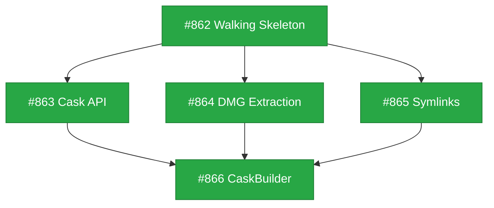

# Design: Homebrew Cask Support

## Status

Current

## Implementation Issues

| Issue | Title | Dependencies | Tier |
|-------|-------|--------------|------|
| [#862](https://github.com/tsukumogami/tsuku/issues/862) | feat(cask): add walking skeleton for cask support | None | testable |
| [#863](https://github.com/tsukumogami/tsuku/issues/863) | feat(version): implement full cask version provider | #862 | testable |
| [#864](https://github.com/tsukumogami/tsuku/issues/864) | feat(actions): add DMG extraction to app_bundle action | #862 | testable |
| [#865](https://github.com/tsukumogami/tsuku/issues/865) | feat(cask): add binary symlinks and applications integration | #862 | testable |
| [#866](https://github.com/tsukumogami/tsuku/issues/866) | feat(builder): add CaskBuilder for recipe generation | #863, #864, #865 | testable |



## Upstream Design Reference

This design extends [DESIGN-homebrew.md](designs/current/DESIGN-homebrew.md) which describes tsuku's Homebrew integration architecture for formula bottles.

**Relevant sections:**
- HomebrewBuilder architecture for recipe generation
- Security model for Homebrew bottle installation
- "Alternative: Manual Recipe Authoring" section mentions cask support as future work

## Context and Problem Statement

Homebrew Casks provide access to thousands of macOS GUI applications (Visual Studio Code, Firefox, Slack, etc.) that cannot be installed via Homebrew formulas. These are pre-built application bundles distributed as `.app`, `.pkg`, or `.dmg` files.

Currently, tsuku only supports Homebrew formulas through the `homebrew` action, which downloads and installs pre-built bottles from GHCR. Users who want GUI applications must either:
- Install them manually outside of tsuku's management
- Use Homebrew directly, defeating the purpose of tsuku's self-contained approach
- Create custom recipes with `download` + `extract` actions (tedious, no standard pattern)

This creates a gap in tsuku's coverage for macOS users who want a unified tool management experience.

### Ecosystem Scale

Homebrew Cask hosts thousands of applications. Most casks use `.app` bundle artifacts (simple copy to Applications), though a subset require `.pkg` installers with arbitrary scripts. The focus on `.app` artifacts covers the majority of developer-relevant applications.

### Why Casks Differ from Formulas

| Aspect | Formulas (Bottles) | Casks |
|--------|-------------------|-------|
| **Content** | CLI tools, libraries | GUI applications, fonts, plugins |
| **Distribution** | GHCR bottles with relocation | Direct downloads from vendors |
| **Build** | Compiled from source by Homebrew CI | Pre-built by application vendors |
| **Installation** | Extract to versioned directory | Move `.app` to Applications, run `.pkg` |
| **Platform** | macOS + Linux | macOS only |
| **Hooks** | Build-time (formula DSL) | Runtime (`preflight`/`postflight`) |

### Scope

**In scope:**
- Supporting `.app` bundle artifacts (the most common cask type)
- Supporting `binary` artifacts (CLI tools distributed via casks)
- Providing a `cask` action for recipes
- HomebrewBuilder extension to generate cask-based recipes

**Out of scope:**
- `.pkg` installer support (requires privileged execution, arbitrary scripts)
- `preflight`/`postflight` hook execution (security risk)
- macOS-specific artifacts like preference panes, Quick Look plugins
- Fonts and other specialized artifact types
- `zap` (deep cleanup) functionality

## Decision Drivers

- **Security**: Casks can contain arbitrary executables and pkg installers with scripts. Tsuku must maintain security guarantees.
- **Self-contained philosophy**: Users should not need system privileges or Homebrew installed.
- **macOS-only scope**: Unlike formulas, casks are fundamentally macOS-specific. This is acceptable for GUI applications.
- **Complexity budget**: Supporting all 15+ cask artifact types would significantly increase maintenance burden for limited benefit.
- **Verification**: Downloaded applications should be verified (checksum), but many vendors don't provide stable URLs or checksums.
- **User experience**: Recipe authoring should remain simple; cask-based recipes shouldn't require understanding Homebrew internals.

## Implementation Context

### Cask Distribution Model

Unlike formula bottles (which are centralized in GHCR), casks download directly from vendor CDNs:

| Cask | Source | Format |
|------|--------|--------|
| Firefox | `download-installer.cdn.mozilla.net` | DMG |
| VS Code | `update.code.visualstudio.com` | ZIP |
| Slack | `downloads.slack-edge.com` | DMG |
| iTerm2 | `iterm2.com` | ZIP |

The Homebrew Cask JSON API (`formulae.brew.sh/api/cask/{name}.json`) provides:
- Download URL (varies by architecture)
- SHA256 checksum (provided by most casks)
- Artifact types (app, binary, pkg, etc.)
- Dependencies and system requirements

### Existing Codebase Patterns

**Homebrew action decomposition:**
The `homebrew` action follows a deterministic decomposition pattern:
1. `download_file` - Fetch with checksum verification
2. `extract` - Unpack tarball
3. `homebrew_relocate` - Fix placeholders and RPATH

**Action registration:**
Actions are registered in `internal/actions/action.go` via `Register()` function.

**Platform handling:**
Platform-specific logic uses `WhenClause` in recipe steps and `getPlatformTag()` for runtime detection.

### Key Differences from Formula Support

| Aspect | Formula Bottles | Cask Applications |
|--------|----------------|-------------------|
| **Download source** | GHCR (authenticated) | Vendor CDN (public) |
| **Archive format** | tar.gz | DMG, ZIP, or PKG |
| **Relocation needed** | Yes (Homebrew placeholders) | No (self-contained bundles) |
| **Installation target** | `$TSUKU_HOME/tools` | `$TSUKU_HOME/apps` or symlink to `/Applications` |
| **Binary exposure** | Symlink in `$TSUKU_HOME/bin` | May include CLI tool symlinks |

## Considered Options

### Option 1: Dedicated `homebrew_cask` Action with Decomposition

Create a dedicated `homebrew_cask` action (named for consistency with the existing `homebrew` action) that follows the same decomposition pattern used by `homebrew`.

```toml
[[steps]]
action = "homebrew_cask"
cask = "visual-studio-code"
```

The action would implement `Decompose()` to break down into primitives:
1. `download_file` - URL and checksum from Cask API
2. `extract_dmg` or `extract` - New primitive for DMG handling, or ZIP extraction
3. `install_app_bundle` - New primitive for `.app` installation

This enables deterministic plan generation, download caching, and pre-flight verification - matching the existing `homebrew` action architecture.

**Pros:**
- Clean separation of concerns - cask logic doesn't pollute formula logic
- Can disable cask support entirely if security concerns arise
- Matches existing pattern (`homebrew` action is separate from `brew_install`)
- Enables security isolation and distinct audit logging
- Decomposition enables download caching and deterministic plans

**Cons:**
- Requires parallel infrastructure: `cask` version provider, potential `CaskBuilder`
- Testing overhead for both formula and cask paths
- Users must know which action to use for which Homebrew source
- HTTP client and verification code partially duplicated

### Option 2: Extend `homebrew` Action with Cask Flag

Rejected. While this would provide code reuse, it violates single responsibility principle. The existing `homebrew` action is ~500 lines focused on bottle handling. Adding cask support would double complexity with fundamentally different error modes (bottle-not-found vs CDN-down). Additionally, the codebase already has `brew_cask` as a system action, creating naming confusion.

### Option 3: Generic `app_bundle` Action (Standalone)

Create a generic `app_bundle` action that downloads and installs macOS `.app` bundles, without Homebrew-specific integration.

```toml
[[steps]]
action = "app_bundle"
url = "https://download-installer.cdn.mozilla.net/pub/firefox/releases/146.0.1/mac/en-US/Firefox%20146.0.1.dmg"
checksum = "sha256:1f153af0954e0e804cedfac185281a762cd6f270238687d8c7060d162435a1ff"
app_name = "Firefox.app"
```

**Pros:**
- Maximum flexibility - works with any macOS app, not just Homebrew casks
- No dependency on Homebrew ecosystem stability
- Recipe author has full control over download source
- Could coexist with `homebrew_cask` for non-Homebrew apps (JetBrains, Adobe)
- Simpler implementation (no API integration)

**Cons:**
- Recipe authors must manually maintain URLs and checksums (unless using a version provider)
- No automatic version updates via Homebrew version provider
- Loses the benefit of Homebrew's curation and vetting
- More error-prone for manual recipes (stale URLs, incorrect checksums)

### Option 4: Hybrid Approach (Cask Version Provider + Generic Action)

Combine the benefits of Options 1 and 3: use Homebrew Cask API for metadata (via version provider) with a generic `app_bundle` action for installation.

```toml
[metadata]
name = "visual-studio-code"

[version]
provider = "cask:visual-studio-code"  # Provides version, URL, checksum

[[steps]]
action = "app_bundle"
url = "{{version.url}}"
checksum = "{{version.checksum}}"
app_name = "Visual Studio Code.app"
binaries = ["Contents/Resources/app/bin/code"]
```

The `cask` version provider queries the Homebrew Cask API. During recipe evaluation, the version provider's metadata is resolved and injected into step parameters, replacing template placeholders. The `app_bundle` action then handles installation without Homebrew-specific knowledge.

**Pros:**
- Clean separation: metadata from Homebrew, installation generic
- Automatic version updates via cask API
- Same action works for non-Homebrew apps (just different version provider)
- Recipes are explicit about what gets installed (visible URL, app name)
- `app_bundle` action is simpler to implement and test

**Cons:**
- Recipes are more verbose than dedicated `homebrew_cask` action
- Template syntax adds complexity for recipe authors
- Version provider must handle architecture variations (Intel vs Apple Silicon)
- Two-step indirection may confuse debugging

### Option Comparison

| Factor | Option 1: Dedicated | Option 3: Generic | Option 4: Hybrid |
|--------|--------------------|--------------------|-------------------|
| **Separation of concerns** | Good | Excellent | Excellent |
| **Homebrew integration** | Full | None | Partial (metadata) |
| **Recipe authoring UX** | Excellent | Poor | Good |
| **Flexibility** | Homebrew only | Any app | Any app |
| **Implementation complexity** | High | Low | Medium |
| **Testing overhead** | High | Low | Medium |

### Installation Target Decision

Applications will be installed to `$TSUKU_HOME/apps/<name>-<version>.app` (fully managed by tsuku) with an optional symlink to `~/Applications/<name>.app` for integration with macOS Launchpad and Spotlight.

**Rationale:**
- `$TSUKU_HOME/apps` maintains self-contained philosophy (no sudo required)
- Version-suffixed directory enables multi-version support
- Symlink to `~/Applications` provides familiar macOS UX without requiring privileges
- `/Applications` (system) is out of scope - requires admin privileges

### DMG Handling Decision

DMG extraction will use `hdiutil` on macOS with fallback to `7z` for CI testing:

1. **Primary (macOS):** `hdiutil attach -nobrowse -readonly -mountpoint <tmp>` → copy `.app` → `hdiutil detach`
2. **Fallback (Linux CI):** `7z x <dmg>` for plan validation and golden file generation

**Rationale:**
- `hdiutil` is the native tool and handles all DMG variations reliably
- `-nobrowse -readonly` prevents Finder interference and license prompts
- `7z` fallback enables CI validation without macOS runners for basic tests

### Uncertainties

- **URL stability**: Vendor download URLs may change without warning. Homebrew's cask maintainers track these, but tsuku recipes could become stale.
- **Auto-update behavior**: Many GUI applications self-update. This could conflict with tsuku's version management. Users may need to disable auto-update in applications managed by tsuku.
- **Codesigning verification**: Whether to verify Apple codesigning (`codesign --verify`) is undecided. This adds security but increases complexity and may fail for legitimate unsigned apps.

## Decision Outcome

**Chosen option: Option 4 (Hybrid Approach - Cask Version Provider + Generic Action)**

This approach best balances the decision drivers by providing Homebrew integration for metadata while maintaining flexibility and simplicity in the installation action.

### Rationale

This option was chosen because:

- **Security**: The generic `app_bundle` action has a smaller surface area than a full `homebrew_cask` action. Metadata comes from Homebrew's curated API, but installation logic is simple and auditable.
- **Complexity budget**: Implementing a version provider is less complex than a full composite action with decomposition. The `app_bundle` action is straightforward (download → extract → copy).
- **Flexibility**: The same action works for non-Homebrew applications. JetBrains IDEs, Adobe tools, or any vendor-distributed app can use `app_bundle` with a different version provider or manual URL.
- **Self-contained philosophy**: No Homebrew installation required. The cask API is a public JSON endpoint.
- **User experience**: Recipes remain simple (one action) while still getting automatic version updates.

Alternatives were rejected because:

- **Option 1 (Dedicated `homebrew_cask` action)**: Higher implementation complexity for marginal UX benefit. The decomposition pattern adds testing overhead and the action would be Homebrew-specific, limiting reuse.
- **Option 2 (Extend `homebrew` action)**: Rejected early - violates single responsibility and creates maintenance burden.
- **Option 3 (Generic action only)**: Without a version provider, recipe authors must manually maintain URLs and checksums, which is error-prone and defeats the purpose of Homebrew integration.

### Trade-offs Accepted

By choosing this option, we accept:

- **Slightly verbose recipes**: Recipes explicitly specify URL/checksum templates rather than just a cask name
- **Template syntax complexity**: Recipe authors must understand `{{version.url}}` syntax
- **Two-component solution**: Requires both version provider and action (vs single action)

These are acceptable because:

- Recipe verbosity improves auditability - reviewers can see exactly what will be downloaded
- Template syntax is already used elsewhere in the codebase
- The two-component design enables maximum reuse and flexibility

## Solution Architecture

### Overview

The solution consists of two components that work together:

1. **`cask` Version Provider**: Queries Homebrew Cask JSON API to resolve version, download URL, and SHA256 checksum
2. **`app_bundle` Action**: Downloads, extracts, and installs macOS `.app` bundles

```
┌─────────────────────────────────────────────────────────────────┐
│                        Recipe (TOML)                            │
│                                                                 │
│  [version]                                                      │
│  provider = "cask:firefox"                                      │
│                                                                 │
│  [[steps]]                                                      │
│  action = "app_bundle"                                          │
│  url = "{{version.url}}"                                        │
│  checksum = "{{version.checksum}}"                              │
│  app_name = "Firefox.app"                                       │
└─────────────────────────────────────────────────────────────────┘
                              │
                              ▼
┌─────────────────────────────────────────────────────────────────┐
│                    Recipe Evaluation                            │
├─────────────────────────────────────────────────────────────────┤
│  1. Resolve version provider "cask:firefox"                     │
│     → GET https://formulae.brew.sh/api/cask/firefox.json        │
│     → Extract: version, url (arch-specific), sha256             │
│                                                                 │
│  2. Substitute templates in step params                         │
│     → url: "https://cdn.mozilla.net/.../Firefox%20146.0.1.dmg"  │
│     → checksum: "sha256:1f153af0954..."                         │
└─────────────────────────────────────────────────────────────────┘
                              │
                              ▼
┌─────────────────────────────────────────────────────────────────┐
│                    app_bundle Action                            │
├─────────────────────────────────────────────────────────────────┤
│  1. download_file: Fetch DMG/ZIP with checksum verification     │
│  2. extract: DMG via hdiutil, ZIP via standard extraction       │
│  3. copy: Move .app to $TSUKU_HOME/apps/<name>-<version>.app    │
│  4. symlink: Create ~/Applications/<name>.app (optional)        │
│  5. binaries: Symlink CLI tools to $TSUKU_HOME/bin (if any)     │
└─────────────────────────────────────────────────────────────────┘
```

### Components

#### Cask Version Provider

**File:** `internal/version/cask.go`

```go
type CaskProvider struct{}

func (p *CaskProvider) Name() string { return "cask" }

func (p *CaskProvider) Resolve(ctx context.Context, spec string) (*VersionInfo, error) {
    // spec is cask name, e.g., "firefox"
    // 1. Fetch https://formulae.brew.sh/api/cask/{spec}.json
    // 2. Parse response for version, URL (arch-aware), sha256
    // 3. Return VersionInfo with template-accessible fields
}

type VersionInfo struct {
    Version  string            // e.g., "146.0.1"
    URL      string            // Architecture-specific download URL
    Checksum string            // "sha256:..."
    Extra    map[string]string // app_name, binaries from artifacts
}
```

**Architecture Handling:**

The cask API provides architecture-specific URLs. The provider selects based on `runtime.GOARCH`:
- `arm64` → Use ARM64/Apple Silicon URL
- `amd64` → Use Intel/Universal URL

#### App Bundle Action

**File:** `internal/actions/app_bundle.go`

```go
type AppBundleAction struct{ BaseAction }

func (a *AppBundleAction) Name() string { return "app_bundle" }

func (a *AppBundleAction) Execute(ctx *ExecutionContext, params map[string]interface{}) error {
    url := params["url"].(string)
    checksum := params["checksum"].(string)
    appName := params["app_name"].(string)
    binaries, _ := params["binaries"].([]interface{}) // Optional CLI tools

    // 1. Download archive
    archivePath := filepath.Join(ctx.WorkDir, "download")
    if err := downloadWithChecksum(url, archivePath, checksum); err != nil {
        return err
    }

    // 2. Extract (DMG or ZIP based on extension/content)
    extractDir := filepath.Join(ctx.WorkDir, "extracted")
    if err := extractArchive(archivePath, extractDir); err != nil {
        return err
    }

    // 3. Find and copy .app bundle
    appPath := findAppBundle(extractDir, appName)
    destPath := filepath.Join(ctx.AppsDir, fmt.Sprintf("%s-%s.app", ctx.RecipeName, ctx.Version))
    if err := copyDir(appPath, destPath); err != nil {
        return err
    }

    // 4. Create symlink in ~/Applications (optional, based on config)
    if ctx.Config.CreateApplicationsSymlink {
        symlinkPath := filepath.Join(os.Getenv("HOME"), "Applications", appName)
        createSymlink(destPath, symlinkPath)
    }

    // 5. Create binary symlinks
    for _, bin := range binaries {
        binPath := filepath.Join(destPath, bin.(string))
        linkPath := filepath.Join(ctx.BinDir, filepath.Base(bin.(string)))
        createSymlink(binPath, linkPath)
    }

    return nil
}
```

**DMG Extraction:**

```go
func extractDMG(dmgPath, destDir string) error {
    // Create temporary mount point
    mountPoint, _ := os.MkdirTemp("", "tsuku-dmg-*")
    defer os.RemoveAll(mountPoint)

    // Mount DMG read-only without Finder interference
    cmd := exec.Command("hdiutil", "attach", dmgPath,
        "-nobrowse", "-readonly", "-mountpoint", mountPoint)
    if err := cmd.Run(); err != nil {
        return fmt.Errorf("failed to mount DMG: %w", err)
    }
    defer exec.Command("hdiutil", "detach", mountPoint, "-quiet").Run()

    // Copy .app bundle from mount to destination
    return copyAppFromMount(mountPoint, destDir)
}
```

### Key Interfaces

**Recipe Template Variables:**

The version provider populates these variables for template substitution:

| Variable | Description | Example |
|----------|-------------|---------|
| `{{version.version}}` | Resolved version string | `146.0.1` |
| `{{version.url}}` | Architecture-specific download URL | `https://cdn.mozilla.net/.../Firefox%20146.0.1.dmg` |
| `{{version.checksum}}` | SHA256 checksum | `sha256:1f153af0954...` |

**Action Parameters:**

| Parameter | Type | Required | Description |
|-----------|------|----------|-------------|
| `url` | string | Yes | Download URL (supports templates) |
| `checksum` | string | Yes | SHA256 checksum for verification |
| `app_name` | string | Yes | Name of `.app` bundle to install |
| `binaries` | []string | No | Paths to CLI tools within `.app` to symlink |
| `symlink_applications` | bool | No | Create `~/Applications` symlink (default: true) |

### Data Flow

1. **Recipe Loading**: Parse TOML, identify `cask:` version provider
2. **Version Resolution**: Call cask API, return `CaskVersionInfo` with version, URL, checksum
3. **Parameter Injection**: Recipe evaluation replaces `{{version.*}}` placeholders in step parameters with resolved values from `CaskVersionInfo`
4. **Action Execution**: `app_bundle` action receives concrete URL/checksum, downloads, extracts, installs
5. **State Update**: Record installed version in `state.json`

**Implementation Note:** The `{{version.url}}` syntax uses the same pattern as existing `{{version}}` substitution in verify commands. The version provider returns an extended `CaskVersionInfo` type (not the base `VersionInfo`) that includes URL and checksum fields. Recipe evaluation detects this extended type and enables dotted-path substitution.

## Implementation Approach

### Slice 1: Cask Version Provider and Template Infrastructure

Build the version provider and extend template substitution to support dotted paths.

- Implement `CaskProvider` in `internal/version/cask.go`
- Create `CaskVersionInfo` type extending base `VersionInfo` with URL, Checksum fields
- Query `formulae.brew.sh/api/cask/{name}.json`
- Handle architecture selection (arm64 vs x86_64)
- Handle missing checksum gracefully (some casks use `:no_check`)
- Extend recipe evaluation to support `{{version.url}}` dotted-path substitution
- Add `CaskSourceStrategy` to provider factory for `source = "cask"` recipes
- Add unit tests with mocked API responses
- Register provider in version provider registry

**Dependencies:** None (standalone component)

### Slice 2: App Bundle Action (Core)

Implement the basic action without DMG support.

- Add `AppsDir` field to `ExecutionContext` (parallel to `ToolsDir`, `LibsDir`)
- Ensure installer creates `$TSUKU_HOME/apps` directory
- Implement `AppBundleAction` in `internal/actions/app_bundle.go`
- Support ZIP extraction (simpler starting point)
- Copy `.app` to `$TSUKU_HOME/apps/<name>-<version>.app`
- Register action in action registry
- Add integration tests with ZIP-based cask (e.g., iTerm2)

**Dependencies:** Slice 1 (for version provider integration testing)

### Slice 3: DMG Extraction

Add DMG support for the majority of casks.

- Implement `extractDMG()` using `hdiutil` (macOS only)
- Auto-detect archive format (DMG vs ZIP) based on file magic/extension
- Handle edge cases (license agreements, custom layouts)
- Add integration tests with DMG-based cask (e.g., Firefox) on macOS CI runners
- Note: `7z` fallback for Linux CI is for plan validation only, not actual installation

**Dependencies:** Slice 2

### Slice 4: Binary Symlinks and Applications Integration

Complete the installation experience.

- Create symlinks in `$TSUKU_HOME/bin` for CLI tools
- Create optional symlink in `~/Applications`
- Handle version switching (update symlinks)
- Add `tsuku list --apps` support

**Dependencies:** Slice 3

### Slice 5: CaskBuilder (Optional)

Auto-generate recipes from cask metadata.

- Extend HomebrewBuilder or create CaskBuilder
- Query cask API, generate TOML recipe
- Detect `app` vs `binary` artifacts
- Validation similar to formula builder

**Dependencies:** Slices 1-4

## Consequences

### Positive

- **Unified tool management**: Users can manage GUI applications alongside CLI tools
- **Automatic updates**: Cask version provider enables `tsuku update` for apps
- **Flexibility**: `app_bundle` action works for any macOS app, not just Homebrew casks
- **Security**: Checksum verification for all downloads, clear audit trail
- **Self-contained**: No Homebrew installation required on user's machine

### Negative

- **macOS-only**: The `app_bundle` action only works on macOS (DMG/hdiutil dependency)
- **Recipe verbosity**: Cask recipes are more verbose than a hypothetical single-action approach
- **URL instability**: Vendor URLs change; recipes may break between Homebrew cask updates
- **Auto-update conflicts**: Apps that self-update may conflict with tsuku's version tracking

### Mitigations

- **macOS-only**: Document clearly in recipe metadata (`supported_os = ["darwin"]`). Use `when` clause to skip on Linux.
- **Recipe verbosity**: Provide CaskBuilder (Slice 5) to auto-generate recipes. Document template syntax clearly.
- **URL instability**: Recipes should use version provider (not hardcoded URLs) for automatic healing.
- **Auto-update conflicts**: Document best practice (disable in-app auto-update for tsuku-managed apps). Consider `app_bundle` option to block app self-update mechanisms.

## Security Considerations

### Download Verification

**How are downloaded artifacts validated?**

All downloads use SHA256 checksum verification:

1. **Checksum source**: The `cask` version provider retrieves checksums from Homebrew's Cask JSON API (`formulae.brew.sh/api/cask/{name}.json`). Homebrew maintainers verify and update these checksums.

2. **Verification process**: The `app_bundle` action verifies the downloaded file's SHA256 matches the expected checksum before extraction.

3. **Failure handling**: If verification fails, the installation aborts with a clear error message. No partial installation occurs.

4. **Missing checksums**: Some casks use `:no_check` (no checksum). In this case, the recipe validation will warn the user, and installation requires explicit `--allow-no-checksum` flag.

**What about signature verification?**

Unlike Homebrew bottles (signed by Homebrew CI), cask applications are signed by their vendors using Apple codesigning. Options:

- **Baseline**: Trust checksum verification (matches what Homebrew does)
- **Enhanced** (future): Optionally verify Apple codesigning with `codesign --verify`

The initial implementation uses checksum verification only, matching Homebrew's behavior.

### Execution Isolation

**What permissions does this feature require?**

- **File system access**: Write to `$TSUKU_HOME/apps` (user directory, no sudo)
- **Optional symlink**: Write to `~/Applications` (user directory, no sudo)
- **DMG mounting**: `hdiutil attach` requires read access to DMG file only
- **No privilege escalation**: The action explicitly excludes `.pkg` installers which would require sudo

**Network access:**

- Fetch cask metadata from `formulae.brew.sh` (read-only API)
- Download application from vendor CDN (URLs specified in recipe)
- No data sent to any server (no telemetry in app_bundle action)

**Privilege escalation risks:**

- **PKG exclusion**: The action does NOT support `.pkg` installers, which can contain scripts requiring admin privileges
- **Preflight/postflight exclusion**: No hook execution - only file operations
- **Application installation**: Apps installed to user-writable directories only

### Supply Chain Risks

**Where do artifacts come from?**

```
                    ┌─────────────────┐
                    │  Homebrew Cask  │
                    │   Maintainers   │
                    └────────┬────────┘
                             │ curate, verify checksums
                             ▼
┌─────────────────┐    ┌─────────────────┐
│   Application   │───▶│  formulae.brew  │
│     Vendor      │    │    .sh API      │
│  (Mozilla, MS)  │    └────────┬────────┘
└────────┬────────┘             │ metadata
         │                      │
         │ binary               ▼
         │              ┌─────────────────┐
         └─────────────▶│   tsuku cask    │
                        │   version       │
                        │   provider      │
                        └────────┬────────┘
                                 │ URL + checksum
                                 ▼
                        ┌─────────────────┐
                        │   app_bundle    │
                        │     action      │
                        └─────────────────┘
```

**Source trust model:**

1. **Homebrew Cask maintainers**: Trusted to verify application authenticity and update checksums. This is the same trust model as using `brew install --cask`.
2. **Application vendors**: Trusted to not ship malware (Mozilla, Microsoft, etc.). This is inherent in installing any application.
3. **Vendor CDN**: Trusted to serve authentic files. Mitigated by checksum verification.

**What if upstream is compromised?**

| Compromise Scenario | Impact | Mitigation |
|---------------------|--------|------------|
| Homebrew API compromised | Attacker could serve malicious URL/checksum | Monitor Homebrew security advisories. Rate-limit API calls. Checksums in recipes could override API. |
| Vendor CDN compromised | Attacker serves malicious file | Checksum verification fails (unless API also compromised). |
| Application vendor compromised | Malicious app with valid signature | No mitigation possible - inherent risk of installing any software. |

**URL Allowlist:**

Unlike formula bottles (all from `ghcr.io`), cask downloads come from arbitrary vendor CDNs. The action does NOT enforce an allowlist - users must trust the URLs specified in recipes.

**Recipe review**: Cask recipes should be reviewed before merging, with URL domain verification against expected vendor domains.

### User Data Exposure

**What user data does this feature access?**

- **Local data accessed**: File system paths (`$TSUKU_HOME`, `~/Applications`)
- **Application data**: None - the action only copies files, does not read application data

**What data is sent externally?**

- **To formulae.brew.sh**: Cask name (e.g., "firefox") for metadata lookup. No user-identifying information.
- **To vendor CDN**: Standard HTTP request. User-Agent header may identify tsuku.
- **No telemetry**: The `app_bundle` action does not send any data beyond the download request.

**Privacy implications:**

- Vendor CDN logs may record IP address and download activity
- This is equivalent to downloading the application manually from the vendor
- No additional privacy exposure compared to direct download

### Mitigations Summary

| Risk | Mitigation | Residual Risk |
|------|------------|---------------|
| Malicious download | SHA256 checksum verification | Homebrew API compromise could bypass |
| Privilege escalation | PKG/hooks excluded, user-directory only | None - no sudo operations |
| Vendor CDN compromise | Checksum verification | Checksum source (API) could also be compromised |
| Homebrew API compromise | Monitor advisories, recipe checksums override | Time window between compromise and detection |
| URL instability | Version provider auto-updates URLs | Brief breakage window |
| Missing checksums | Require `--allow-no-checksum` flag | User accepts risk explicitly |

### Security Recommendations

1. **Recipe review**: All cask recipes should be reviewed for URL authenticity before merging
2. **Checksum requirement**: Default to requiring checksums; `:no_check` casks need explicit opt-in
3. **Codesigning verification**: Consider adding optional `codesign --verify` in future enhancement
4. **Quarantine handling**: Downloaded apps will have macOS quarantine attribute by default (first-run Gatekeeper check)

