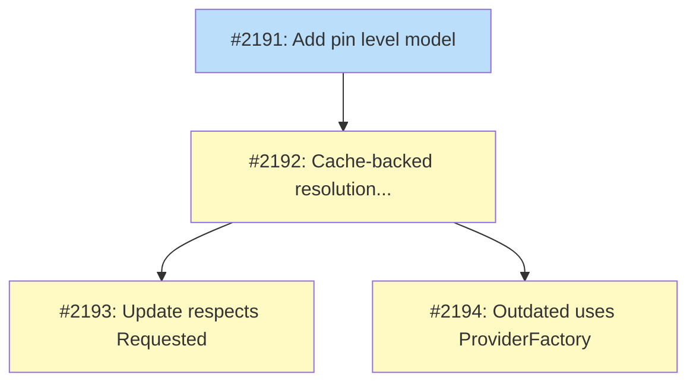

# DESIGN: Channel-aware version resolution

## Status

Current

## Implementation Issues

### Milestone: [Channel-aware version resolution](https://github.com/tsukumogami/tsuku/milestone/110)

| Issue | Dependencies | Tier |
|-------|--------------|------|
| [#2191: add pin level model](https://github.com/tsukumogami/tsuku/issues/2191) | None | testable |
| _Add PinLevel type and derivation functions (PinLevelFromRequested, VersionMatchesPin with dot-boundary matching, ValidateRequested). Pure functions with no external dependencies -- the foundation everything else builds on._ | | |
| [#2192: add cache-backed pin-aware resolution helper](https://github.com/tsukumogami/tsuku/issues/2192) | [#2191](https://github.com/tsukumogami/tsuku/issues/2191) | testable |
| _With the pin model in place, add ResolveWithinBoundary() that routes pin-aware queries through the cached ListVersions for VersionLister providers, falling back to ResolveVersion for resolver-only providers. Modifies CachedVersionLister.ResolveLatest() to derive from the cache._ | | |
| [#2193: respect Requested field version constraint](https://github.com/tsukumogami/tsuku/issues/2193) | [#2192](https://github.com/tsukumogami/tsuku/issues/2192) | testable |
| _Wire ResolveWithinBoundary into the update command. Reads Requested from state and passes it as the version constraint so `tsuku update node` after `install node@18` stays within 18.x.y._ | | |
| [#2194: use ProviderFactory for all version providers](https://github.com/tsukumogami/tsuku/issues/2194) | [#2192](https://github.com/tsukumogami/tsuku/issues/2192) | testable |
| _Replace hard-coded GitHub resolution in outdated with ProviderFactory + ResolveWithinBoundary. Covers all provider types. Excludes PinExact tools from output. Can parallelize with #2193._ | | |

### Dependency graph



**Legend**: Green = done, Blue = ready, Yellow = blocked, Purple = needs-design

## Context and Problem Statement

Tsuku stores the user's install-time version constraint in the `Requested` field of state.json (e.g., `tsuku install node@18` stores `Requested: "18"`), but `tsuku update` ignores it entirely. Running `tsuku update node` resolves to the absolute latest version from the provider, silently jumping from Node 18.x to Node 22.x. This breaks user expectations and makes any future auto-update system unsafe.

A second bug compounds the problem: `tsuku outdated` only checks tools sourced from GitHub releases. Tools installed from PyPI, npm, crates.io, RubyGems, Homebrew, and other providers are invisible to the outdated command, even though ProviderFactory already supports resolving versions from all of these sources.

This design establishes the version pinning model and fixes both commands. It's the foundation that Features 2-9 of the auto-update roadmap depend on.

## Decision Drivers

- **Backward compatibility**: The `Requested` field already exists in state.json. Any solution must work with existing installations without migration.
- **Simplicity**: Users already type version constraints naturally (`node@18`, `kubectl@1.29`). The model should match that intuition without new syntax.
- **Provider-agnostic**: Must work identically across all version provider types (GitHub, PyPI, npm, crates.io, etc.), despite differences in version numbering conventions.
- **Performance**: Version resolution is called during install, update, and outdated. Caching `ResolveLatest` results reduces redundant network calls.
- **Foundation for auto-update**: The pin-level model defined here will be reused by background checks (Feature 2), auto-apply (Feature 3), notifications (Feature 5), and outdated display (Feature 6).

## Considered Options

### Decision 1: Pin level representation

**Context:** The PRD decided (D2) that pin level should be inferred from the Requested field's version component count. The question is whether to keep this implicit or materialize it as a stored field.

Key assumptions:
- No user needs a pin level that contradicts their version component count. If wrong, an optional override can be added later without migration.
- Channel constraints (`@lts`) are a distinct pin type resolved dynamically, separate from numeric component-count logic.

#### Chosen: Implicit derivation (no schema change)

A pure function `PinLevelFromRequested(requested string) PinLevel` computes the pin level at runtime. The `PinLevel` type is a Go enum with values: `PinLatest`, `PinMajor`, `PinMinor`, `PinExact`, `PinChannel`. Rules:

| Requested | Pin Level | Update boundary |
|-----------|-----------|-----------------|
| `""` (empty) | PinLatest | Any newer version |
| `"20"` | PinMajor | Within 20.x.y |
| `"1.29"` | PinMinor | Within 1.29.z |
| `"1.29.3"` | PinExact | Never auto-updates |
| `"@lts"` | PinChannel | Dynamic, provider-specific |

No new fields in `VersionState`. No migration. CalVer versions like `"2024.01"` map to `PinMinor` (2 components), which is the accepted trade-off from PRD D2.

#### Alternatives considered

- **Explicit PinLevel field in state.json**: Add `PinLevel string` computed at install time. Rejected because it denormalizes state without benefit -- the derived value is always correct and cheap to compute. Creates sync risk if Requested changes but PinLevel doesn't get updated. Would require migration logic for all existing installations.
- **Structured constraint object**: Replace Requested with a JSON object containing raw input, pin level, and channel. Rejected as a breaking schema change incompatible with `.tsuku.toml`'s simple string model.

### Decision 2: Pin boundary enforcement

**Context:** Both `update` and `outdated` need pin-aware resolution. The ProviderFactory and VersionResolver interface already support what's needed -- every provider's `ResolveVersion(ctx, version)` does fuzzy prefix matching. The question is where to wire the branching logic.

Key assumptions:
- Named channel pins (`@lts`) are out of scope for this design. Numeric prefix pins are the target.
- All providers' `ResolveVersion()` handles prefix matching correctly (verified for npm, GitHub, RubyGems).

#### Chosen: Helper function (ResolveWithinBoundary)

A new function `ResolveWithinBoundary(ctx, provider, requested)` in the `version` package. For providers that implement `VersionLister`, it uses the cached version list + filter (benefiting from Decision 3's caching). For `VersionResolver`-only providers, it falls back to `provider.ResolveVersion(ctx, requested)` for fuzzy prefix matching. When `requested` is empty, it calls `provider.ResolveLatest(ctx)`.

Both `update.go` and `outdated.go` read the `Requested` field from state and pass it to this function. The outdated command also switches from hard-coded `res.ResolveGitHub()` calls to ProviderFactory.

#### Alternatives considered

- **Inline call-site logic**: If/else branching directly in update.go and outdated.go. Rejected because it duplicates logic across two commands (and any future commands needing pin awareness).
- **New interface method (ResolveLatestWithinConstraint)**: Forces changes to 15+ providers, all with nearly identical implementations delegating to ResolveVersion(). Cost disproportionate to benefit.
- **Post-hoc filter on ListVersions only**: Not all providers implement VersionLister. Would fail for CustomProvider (the only VersionResolver-only provider; FossilTimelineProvider implements VersionLister despite earlier assumptions).

### Decision 3: ResolveLatest caching

**Context:** CachedVersionLister caches ListVersions results but ResolveLatest passes through to the network every time. Pin-aware queries inherently need a version list to filter, making the ListVersions cache the natural data source.

Key assumptions:
- "First entry in sorted version list" is semantically equivalent to "latest release from API" for real-world providers.
- VersionResolver-only providers (CustomProvider is the only one; FossilTimelineProvider implements VersionLister) are rare enough to leave uncached for now.

#### Chosen: Derive latest from cached ListVersions

`CachedVersionLister.ResolveLatest()` returns the first entry from the cached version list instead of calling the underlying provider. Pin-aware queries filter the same cached list by constraint prefix. When the cache is cold, ListVersions is fetched (populating the cache), and the result is derived.

For VersionResolver-only providers, ResolveLatest continues to delegate to the underlying provider (network call).

Refresh() and `--force` clear the ListVersions cache, which implicitly invalidates derived results.

#### Alternatives considered

- **Separate resolution cache entries**: Stores ResolveLatest results in additional `<hash>_latest.json` files. Rejected because it doubles cache files per provider and creates two invalidation paths that must stay synchronized.
- **Separate CachedVersionResolver layer**: A new struct wrapping VersionResolver independently. Rejected for structural complexity with minimal benefit -- only two uncommon providers would use it.

## Decision Outcome

The three decisions form a coherent stack:

1. **Pin level is a runtime derivation** from the existing `Requested` string. No schema changes, no migration.
2. **A single helper function** routes pin-aware resolution through the cached version list (for most providers) or fuzzy prefix matching (for VersionResolver-only providers). Both `update` and `outdated` call through it.
3. **ResolveLatest derives from the ListVersions cache**, so pin-aware queries and unconstrained queries share the same cached data. No new cache files or key schemes.

The cross-validation between D2 and D3 identified that the helper function should prefer the cached-list-filter path (D3) over direct ResolveVersion calls (D2's initial approach) to get caching benefits. The reconciled design uses the cached list for VersionLister providers and falls back to ResolveVersion for VersionResolver-only providers (only CustomProvider in practice).

Note: `ListVersions` returns `[]string` (version strings), not `[]*VersionInfo`. When `ResolveWithinBoundary` finds the best matching version string from the cached list, it calls `provider.ResolveVersion(ctx, matchedVersion)` to get the full `*VersionInfo` with the Tag field needed downstream.

## Solution Architecture

### Overview

Three changes compose the solution: a pin-level derivation function, a version resolution helper, and a modification to the existing cache wrapper. No new packages, no new interfaces, no migration.

### Components

**`internal/install/pin.go`** (new file)
- `PinLevel` type (Go enum: `PinLatest`, `PinMajor`, `PinMinor`, `PinExact`, `PinChannel`)
- `PinLevelFromRequested(requested string) PinLevel` -- pure function, ~20 lines
- `VersionMatchesPin(version, requested string) bool` -- tests whether a version string falls within a pin boundary. Uses dot-boundary matching: `version == requested || strings.HasPrefix(version, requested+".")`. Raw prefix matching would cause `Requested: "1"` to match "10.0.0".
- `ValidateRequested(requested string) error` -- validates that a Requested string contains only expected characters (digits, dots, `@` prefix for channels). Defense-in-depth against malformed state.

**`internal/version/resolve.go`** (new file)
- `ResolveWithinBoundary(ctx, provider VersionResolver, requested string) (*VersionInfo, error)` -- the central resolution helper
- For `VersionLister` providers: loads cached list via `CachedVersionLister`, filters by pin constraint, returns highest match
- For `VersionResolver`-only providers: calls `provider.ResolveVersion(ctx, requested)` directly
- For empty `requested`: calls `provider.ResolveLatest(ctx)`

**`internal/version/cache.go`** (modified)
- `CachedVersionLister.ResolveLatest()` changes from pass-through to deriving from the cached version list
- `CachedVersionLister.ResolveVersion()` changes similarly for cached providers

**`cmd/tsuku/update.go`** (modified)
- Currently passes empty version strings to `runInstallWithTelemetry`. The fix reads `Requested` from `state.Installed[toolName].Versions[activeVersion].Requested` and passes it as the version constraint, so the install flow resolves within the pin boundary.
- When `Requested` is non-empty, `runInstallWithTelemetry` receives it as the `reqVersion` parameter instead of `""`.

**`cmd/tsuku/outdated.go`** (modified)
- Replaces hard-coded `res.ResolveGitHub()` with `ProviderFactory.ProviderFromRecipe()` + `ResolveWithinBoundary`
- Iterates all installed tools regardless of provider type
- Tools with `PinExact` level are excluded from outdated output (they can't update by definition)

### Key Interfaces

No interface changes. The existing `VersionResolver` and `VersionLister` interfaces are used as-is. The new code composes them through the helper function rather than extending them.

```go
// Existing -- unchanged
type VersionResolver interface {
    ResolveLatest(ctx context.Context) (*VersionInfo, error)
    ResolveVersion(ctx context.Context, version string) (*VersionInfo, error)
}

type VersionLister interface {
    VersionResolver
    ListVersions(ctx context.Context) ([]string, error)  // returns version strings, not VersionInfo
}

// New -- helper, not interface
func ResolveWithinBoundary(ctx context.Context, provider VersionResolver, requested string) (*VersionInfo, error)
```

### Data Flow

```
User runs: tsuku update node
  |
  v
update.go reads Requested="18" from state.Installed["node"].Versions[activeVersion].Requested
  |
  v
ValidateRequested("18") -- defense-in-depth input check
  |
  v
ProviderFactory.ProviderFromRecipe(recipe) -> provider
  |
  v
ResolveWithinBoundary(ctx, provider, "18")
  |
  +-- provider implements VersionLister?
  |     YES: CachedVersionLister.ListVersions() -> []string
  |           -> filter with VersionMatchesPin(v, "18") using dot-boundary matching
  |           -> sort descending, take first
  |           -> provider.ResolveVersion(ctx, matched) -> *VersionInfo
  |     NO:  provider.ResolveVersion(ctx, "18") -> *VersionInfo (fuzzy prefix match)
  |
  v
Compare result with ActiveVersion
  |
  v
If newer: pass Requested to runInstallWithTelemetry as reqVersion
```

## Implementation Approach

### Phase 1: Pin level model

Add `internal/install/pin.go` with `PinLevel` type, `PinLevelFromRequested()`, and `VersionMatchesPin()`. Unit tests covering all pin levels, edge cases (empty string, calver, pre-release suffix, single component).

Deliverables:
- `internal/install/pin.go`
- `internal/install/pin_test.go`

### Phase 2: Cache-backed resolution

Modify `CachedVersionLister.ResolveLatest()` to derive from the cached version list. Add `ResolveWithinBoundary()` helper in `internal/version/resolve.go`. Unit tests with mock providers.

Deliverables:
- `internal/version/resolve.go`
- `internal/version/resolve_test.go`
- `internal/version/cache.go` (modified)
- `internal/version/cache_test.go` (updated)

### Phase 3: Command integration

Wire `ResolveWithinBoundary` into `update.go` and rewrite `outdated.go` to use ProviderFactory. Integration tests verifying pin-aware behavior.

Deliverables:
- `cmd/tsuku/update.go` (modified)
- `cmd/tsuku/outdated.go` (modified)
- Integration tests

## Security Considerations

**Cache poisoning impact change.** Before this design, the ListVersions cache only affects `tsuku versions` display because `ResolveLatest` bypasses the cache entirely. After this design, `ResolveLatest` derives from the cached list, so a poisoned cache file could influence which version gets installed during `tsuku update`. This is an escalation from "display-only" to "installation-affecting." The risk is bounded by same-user filesystem permissions (the cache lives in `$TSUKU_HOME` owned by the user), but it should be acknowledged.

Mitigations:
- Existing download-time checksum verification catches cases where a poisoned cache entry points to a version that doesn't match the upstream checksum. But recipes with dynamic URL templates and no per-version checksums aren't covered by this.
- Cache files use atomic writes (temp + rename) which prevents partial-write corruption but not deliberate tampering.
- The `ValidateRequested()` function provides defense-in-depth against malformed version strings in state.json reaching the resolution path.

**Dot-boundary prefix matching.** `VersionMatchesPin` must use `version == requested || strings.HasPrefix(version, requested+".")` rather than raw `strings.HasPrefix`. Without the dot boundary, `Requested: "1"` would match versions "10.0.0", "11.0.0", etc., which is a functional correctness bug with security implications (silently widening the pin boundary).

**Existing prefix matching bug.** Some providers (e.g., GitHubProvider.ResolveVersion) use raw `strings.HasPrefix` for fuzzy matching. This is a pre-existing issue outside the scope of this design, but `VersionMatchesPin` must not inherit it.

## Consequences

### Positive

- `tsuku update` respects version constraints, making it safe for pinned tools
- `tsuku outdated` covers all provider types, not just GitHub
- ResolveLatest results are effectively cached through the ListVersions cache, reducing network calls
- Zero schema migration needed -- existing installations work immediately
- Foundation is in place for auto-update features (check, apply, notify) to use the same resolution path

### Negative

- CalVer versions map to pin levels by component count, which may surprise users expecting exact-pin behavior for `"2024.01"`. This is a known trade-off (PRD D2).
- The VersionResolver-only provider (CustomProvider) doesn't benefit from caching. Its ResolveLatest still hits the network.
- A cold ListVersions cache now triggers a full list fetch even for simple ResolveLatest queries, which is slightly more expensive on the first call.

### Mitigations

- CalVer edge case is documented. If it becomes a real problem, an optional `PinLevelOverride` field can be added later without breaking changes.
- CustomProvider is the only VersionResolver-only provider (1 out of 20+ strategies). Caching can be layered on later if needed.
- The cold-cache cost is a one-time penalty per provider per TTL period. Subsequent calls within the TTL benefit from having the full list cached.
