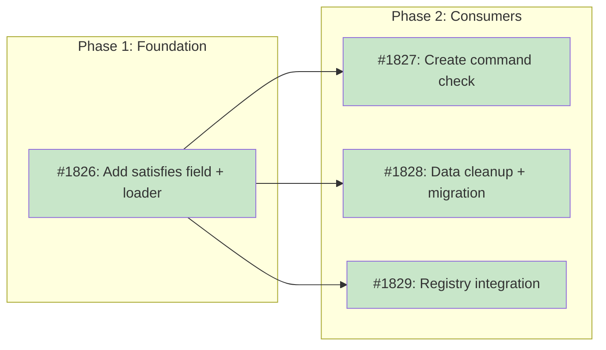

# DESIGN: Ecosystem Name Resolution

## Status

Current

## Implementation Issues

### Milestone: [ecosystem-name-resolution](https://github.com/tsukumogami/tsuku/milestone/93)

| Issue | Dependencies | Tier |
|-------|--------------|------|
| ~~[#1826: feat(recipe): add satisfies metadata field and loader fallback](https://github.com/tsukumogami/tsuku/issues/1826)~~ | None | testable |
| ~~_Adds the `Satisfies` field to the recipe metadata struct and a lazy-built index in the loader. When exact name lookup fails, the loader falls back to this index to resolve ecosystem names like `openssl@3` to their canonical recipe. Includes validation and the first `satisfies` entry on the embedded `openssl` recipe._~~ | | |
| ~~[#1827: feat(cli): check satisfies index before generating recipes in tsuku create](https://github.com/tsukumogami/tsuku/issues/1827)~~ | [#1826](https://github.com/tsukumogami/tsuku/issues/1826) | testable |
| ~~_With the loader fallback in place, `tsuku create` checks for existing recipes via the satisfies index before generating. Users running `tsuku create openssl@3 --from homebrew` see a clear message that `openssl` already covers that name, with `--force` to override._~~ | | |
| ~~[#1828: fix(recipes): clean up ecosystem name mismatches and migrate dep-mapping](https://github.com/tsukumogami/tsuku/issues/1828)~~ | [#1826](https://github.com/tsukumogami/tsuku/issues/1826) | testable |
| ~~_Deletes the duplicate `openssl@3.toml`, fixes `apr-util`'s dependency reference, and migrates the 5 non-trivial entries from `dep-mapping.json` to `satisfies` fields on their respective embedded recipes. Deprecates the dead mapping file._~~ | | |
| ~~[#1829: feat(registry): include satisfies data in registry manifest](https://github.com/tsukumogami/tsuku/issues/1829)~~ | [#1826](https://github.com/tsukumogami/tsuku/issues/1826) | testable |
| ~~_Extends the registry generation script to emit `satisfies` data in the manifest JSON and wires the loader to populate its index from that data. Adds cross-recipe duplicate detection at CI time so conflicting `satisfies` claims are caught before merge._~~ | | |

### Dependency Graph



**Legend**: Green = done, Blue = ready, Yellow = blocked, Purple = needs-design, Orange = tracks-design

## Context and Problem Statement

Tsuku recipes are identified by a single canonical name (e.g., `openssl`), but package ecosystems use their own naming conventions. Homebrew calls it `openssl@3`, other ecosystems might call it `libssl` or `openssl3`. When a recipe depends on an ecosystem-specific name, tsuku needs to resolve that name to the correct recipe.

Today, no resolution mechanism exists. The recipe loader, dependency resolver, batch pipeline, and `tsuku create` command all use names as-is with zero normalization. This creates three concrete problems:

1. **Duplicate recipes**: The batch pipeline generated `recipes/o/openssl@3.toml` (binary-only, no shared libs) without realizing the embedded `openssl` recipe already installs the same Homebrew formula with full library outputs. Users running `tsuku create openssl@3 --from homebrew` would do the same.

2. **False blockers on the pipeline dashboard**: `afflib` is listed as blocked by `openssl@3` because the error extraction records the raw Homebrew formula name. The recipe exists under a different name, but nothing translates between them.

3. **Incorrect dependency references**: `apr-util.toml` declares `runtime_dependencies = ["openssl@3"]`. The dependency resolver's `parseDependency()` splits on `@`, producing name=`openssl`, version=`3`. This accidentally works for install, but it's fragile -- the recipe author intended `openssl@3` as a package name, not a version constraint.

`data/dep-mapping.json` was created (#1200) to map ecosystem names to recipe names, but no code consumes it. The static mapping approach also fails to scale: every new Homebrew formula with a different naming convention requires manual maintenance.

### Scope

**In scope:**
- A mechanism for recipes to declare which ecosystem package names they satisfy
- Integration with the recipe loader so lookups resolve ecosystem names to recipes
- Integration with `tsuku create` so it detects existing recipes before generating duplicates
- Integration with the batch pipeline's blocker tracking
- Cleanup of the duplicate `openssl@3` registry recipe and `apr-util` dependency reference
- Removal or deprecation of `data/dep-mapping.json`

**Out of scope:**
- The `provides` field for sonames and CLI commands (#969) -- adjacent concept, different use case
- Cross-ecosystem name resolution (e.g., mapping npm package names to Homebrew formula names)
- Version constraint resolution (handled separately by `parseDependency()`)
- `tsuku search` integration with the satisfies index (natural follow-up, but not blocking)

## Decision Drivers

- **Must work for `tsuku create`, not just the batch pipeline.** A user running `tsuku create openssl@3 --from homebrew` should discover the existing embedded recipe and skip generation.
- **Must scale without manual maintenance.** Adding a new recipe shouldn't require updating a separate mapping file.
- **Must be integral to the CLI's recipe resolution system.** The loader should resolve ecosystem names anywhere recipes are looked up -- install, create, dependency resolution, batch pipeline.
- **Should follow existing patterns.** The recipe TOML format already has metadata fields; adding a new one is a natural extension.
- **Must be auditable.** Mappings live in recipe files (committed, reviewed) rather than runtime inference.
- **Backward compatible.** Existing recipes without the new field must continue to work unchanged.

## Implementation Context

### Existing Patterns

**Recipe loader chain** (`internal/recipe/loader.go:84-131`): 4-tier priority: in-memory cache → local recipes → embedded recipes → remote registry. All lookups use exact name match.

**Embedded registry keying** (`internal/recipe/embedded.go:44`): Keyed by filename basename (e.g., `openssl.toml` → key `"openssl"`).

**`tsuku create` duplicate check** (`cmd/tsuku/create.go:737`): Only checks `os.Stat()` on the local recipes directory. Doesn't check embedded recipes at all.

**Dependency parsing** (`internal/actions/resolver.go:262-272`): Splits on first `@` to separate name from version. `"openssl@3"` → name=`"openssl"`, version=`"3"`. This means the satisfies fallback is never triggered for `metadata.runtime_dependencies` entries containing `@` -- the `@`-split produces the correct recipe name by coincidence. This invariant should be preserved; if the `@` splitting behavior changes, dependencies like `apr-util`'s `"openssl@3"` would need the satisfies fallback to still work.

**Batch orchestrator** (`internal/batch/orchestrator.go:515-540`): Extracts blocked-by names from error messages using regex. Records raw strings with no normalization.

### Applicable Conventions

- Homebrew uses versioned formula names: `openssl@3`, `python@3.14`, `node@22`
- These names use `@` as a version separator within the formula name (not a constraint)
- Tsuku uses `@` as a version constraint separator in `tsuku install` (e.g., `kubectl@v1.29.0`)
- This semantic conflict means `openssl@3` is ambiguous: is it a recipe name or `openssl` at version `3`?

## Considered Options

### Decision 1: How recipes declare ecosystem name mappings

Recipes need a way to declare which ecosystem-specific package names they satisfy. This is central to the design because it determines where the mapping data lives, how it's maintained, and how it's consumed.

The key constraint is scalability: the mapping shouldn't require maintaining a separate file. It should live with the recipe so that adding or modifying a recipe automatically updates the mapping.

#### Chosen: `satisfies` metadata field

Add an optional `satisfies` map field to recipe metadata that declares which ecosystem package names this recipe fulfills:

```toml
[metadata]
name = "openssl"
type = "library"

[metadata.satisfies]
homebrew = ["openssl@3"]
```

Each key is an ecosystem name, each value is a list of package names in that ecosystem that this recipe satisfies. When the loader fails to find a recipe by exact name, it falls back to checking `satisfies` entries across all loaded recipes.

This field is optional and backward compatible. Recipes without it work exactly as they do today. The mapping is version-controlled alongside the recipe, so it's reviewed as part of normal PR review.

For embedded recipes, the `satisfies` field is parsed from the TOML metadata just like any other field. For registry recipes, the `generate-registry.py` script includes it in the registry JSON so the loader can check it without downloading every recipe.

#### Alternatives Considered

**Static mapping file (`data/dep-mapping.json`)**: Maintain a separate JSON file mapping ecosystem names to recipe names.
Rejected because it requires manual maintenance separate from the recipe, doesn't scale, and the existing implementation proved this -- `dep-mapping.json` was created but never wired in because the indirection was too much friction.

**Convention-based stripping (strip `@N` suffix)**: When lookup fails, automatically try stripping the `@` suffix (e.g., `openssl@3` → `openssl`).
Rejected because it assumes Homebrew's `@` convention applies universally, would silently resolve to wrong recipes if names happen to collide after stripping, and doesn't work for cases where the ecosystem name is completely different (e.g., `sqlite3` → `sqlite`, `gcc` → `gcc-libs`).

**Reverse index from step formulas**: Build a map from `formula = "openssl@3"` in steps back to the recipe name.
Rejected because it only works for Homebrew, doesn't cover non-formula ecosystems, and creates an implicit contract where step parameters become part of the public API. It's also fragile -- a recipe that changes its formula would silently break the index.

### Decision 2: Where name resolution happens

The resolution must be integral to the CLI, not pipeline-specific. Multiple code paths need it: `tsuku install` (dependency resolution), `tsuku create` (duplicate detection), and the batch pipeline (blocker tracking). The question is where exactly in the call chain to add it.

#### Chosen: Recipe loader fallback

Add the `satisfies` lookup as a fallback in the recipe loader (`internal/recipe/loader.go`), after the existing 4-tier chain fails. When `GetWithContext()` doesn't find a recipe by exact name, it searches the `satisfies` index for a match and returns the satisfying recipe.

This means every code path that loads recipes -- install, create, dependency resolution, batch pipeline -- automatically benefits from ecosystem name resolution without any changes to those callers.

The index is built lazily on first fallback lookup: scan all embedded recipes and (if available) the registry manifest for `satisfies` entries. Cache the resulting map for subsequent lookups.

#### Alternatives Considered

**Per-caller resolution**: Add mapping logic individually to each caller (create command, batch orchestrator, dashboard generator).
Rejected because it duplicates logic across 4+ call sites, makes it easy to miss a path, and requires each caller to know about ecosystem naming -- a concern that belongs in the recipe layer.

**Pre-resolution normalization**: Normalize names before they reach the loader (e.g., in argument parsing).
Rejected because it changes the semantics of user input. If a user asks for `openssl@3`, they might mean the specific formula, not a normalized form. Resolution should happen at the recipe layer where the intent is clearer.

### Decision 3: What to do with the duplicate `openssl@3.toml` registry recipe

The batch pipeline generated `recipes/o/openssl@3.toml` as a standalone recipe. Now that the embedded `openssl` recipe will declare `satisfies.homebrew = ["openssl@3"]`, the duplicate is unnecessary and inferior (missing shared libs).

#### Chosen: Delete and prevent re-generation

Delete `recipes/o/openssl@3.toml`. Update the `tsuku create` command to check the `satisfies` index before generating a recipe, so it won't re-create it. Fix `apr-util.toml` to reference `openssl` directly instead of `openssl@3`.

#### Alternatives Considered

**Keep as redirect**: Convert `openssl@3.toml` to a thin recipe that just declares a dependency on `openssl`.
Rejected because it adds indirection for something the `satisfies` field handles natively, and maintaining redirect recipes is additional overhead.

### Uncertainties

- **Registry manifest format**: The `satisfies` field needs to be included in the registry manifest (`generate-registry.py` output) so the loader can build its index from cached data. The exact format of this inclusion hasn't been designed.
- **Performance of lazy index build**: Scanning all embedded recipes on first fallback lookup should be fast (tens of recipes), but scanning the full registry manifest could be slower. May need benchmarking.
- **Collision handling**: What if two recipes both declare `satisfies.homebrew = ["openssl@3"]`? Recipe validation (CI) should hard-error on duplicate `satisfies` entries to catch the problem at PR time. At runtime, the loader should warn and prefer the first match found (embedded over registry), since hard-erroring at runtime punishes users for a data quality issue.
- **Canonical name collision**: A `satisfies` entry that matches another recipe's canonical name (e.g., recipe `foo` declares `satisfies.homebrew = ["sqlite"]` where `sqlite` is already a recipe) should be rejected by validation. This can't cause resolution issues at runtime (exact match takes priority), but it's confusing and likely an error.

## Decision Outcome

**Chosen option: `satisfies` metadata field with loader fallback**

### Summary

Recipes declare which ecosystem package names they fulfill using a new optional `satisfies` map in their metadata. The recipe loader adds a fallback step after its existing 4-tier lookup chain: when exact name lookup fails, it searches a cached `satisfies` index built from embedded recipes and the registry manifest. This gives every code path in tsuku -- `install`, `create`, dependency resolution, and the batch pipeline -- automatic ecosystem name resolution without per-caller changes.

The embedded `openssl` recipe gains `[metadata.satisfies] homebrew = ["openssl@3"]`. The loader, when asked for a recipe named `openssl@3`, first fails the exact lookup, then checks the `satisfies` index and returns the `openssl` recipe. The `tsuku create` command uses the same lookup before generating a recipe, preventing duplicates. The batch pipeline's blocker extraction records raw names as before, but downstream resolution through the loader now finds the correct recipe.

The duplicate `recipes/o/openssl@3.toml` is deleted. `apr-util.toml`'s dependency is fixed to reference `openssl` directly. `data/dep-mapping.json` is deprecated in favor of the per-recipe `satisfies` declarations. Entries from the mapping file that aren't `"pending"` are migrated to `satisfies` fields on the corresponding recipes.

### Rationale

Putting the mapping data in the recipe itself means adding or modifying a recipe automatically updates the mapping. No separate file to maintain, no indirection to forget. The loader fallback means every code path benefits without changes to callers. And because `satisfies` is a structured TOML field, it's version-controlled, reviewed in PRs, and auditable.

The convention-based approach (stripping `@N`) was tempting for its simplicity, but it only handles one naming convention (Homebrew's versioned formulas) and fails for cases like `sqlite3` → `sqlite` or `gcc` → `gcc-libs`. The `satisfies` field handles all of these uniformly.

### Trade-offs Accepted

By choosing this option, we accept:
- **Recipe authors must declare `satisfies` entries.** This is manual work, but it's one-time per recipe and co-located with the recipe itself, which makes it low-friction.
- **The registry manifest grows slightly.** Each recipe with `satisfies` entries adds a few bytes to the manifest. For the current 6 known mappings, this is negligible.
- **Lazy index build adds latency on first fallback.** This only happens when a recipe isn't found by exact name, which is the uncommon path. Subsequent lookups hit the cache.

These are acceptable because the alternative (no resolution) produces false blockers, duplicate recipes, and confusing user experiences -- all of which are worse than a small amount of per-recipe declaration work.

## Solution Architecture

### Overview

The design adds three components: (1) a `satisfies` field in recipe metadata, (2) a satisfies index in the recipe loader, and (3) a pre-generation check in the `tsuku create` command.

### Components

```
Recipe TOML files          Recipe Loader               Callers
┌─────────────────┐       ┌─────────────────────┐     ┌──────────┐
│ [metadata]       │       │ 1. Cache lookup      │     │ install  │
│ name = "openssl" │       │ 2. Local recipe      │     │ create   │
│ satisfies:       │──────>│ 3. Embedded recipe   │<────│ resolver │
│   homebrew:      │       │ 4. Remote registry   │     │ batch    │
│   - "openssl@3"  │       │ 5. Satisfies fallback│     └──────────┘
└─────────────────┘       └─────────────────────┘
                                    │
                          ┌─────────────────────┐
                          │ Satisfies Index      │
                          │ (lazy, cached)       │
                          │                      │
                          │ "openssl@3" →openssl │
                          │ "sqlite3"   →sqlite  │
                          │ "gcc"       →gcc-libs│
                          └─────────────────────┘
```

### Key Interfaces

**Recipe metadata** (add to existing `Metadata` struct in `internal/recipe/recipe.go`):

```go
type Metadata struct {
    // ... existing fields ...
    Satisfies map[string][]string `toml:"satisfies,omitempty"` // ecosystem -> []package_names
}
```

**Loader satisfies index** (add to `Loader` in `internal/recipe/loader.go`):

```go
type Loader struct {
    // ... existing fields ...
    satisfiesIndex map[string]string // package_name -> recipe_name (ecosystem-agnostic)
    satisfiesOnce  sync.Once
}

// buildSatisfiesIndex scans embedded recipes and registry manifest
// for satisfies entries. Called lazily on first fallback lookup.
// The index is keyed by bare package name (not prefixed by ecosystem),
// because callers don't know which ecosystem a dependency comes from.
// If two recipes claim the same package name across different ecosystems,
// validation catches it at CI time.
func (l *Loader) buildSatisfiesIndex() { ... }

// lookupSatisfies checks if a name is satisfied by another recipe.
// Searches across all ecosystems. Returns the satisfying recipe name
// and true, or "" and false.
func (l *Loader) lookupSatisfies(name string) (string, bool) { ... }
```

### Data Flow

1. User runs `tsuku install afflib`
2. Loader finds `afflib` recipe, which declares `runtime_dependencies = ["openssl@3"]`
3. Dependency resolver calls `parseDependency("openssl@3")` → name=`openssl`, version=`3`
4. Loader looks up `openssl` → found (embedded). Works as before.

But for the batch pipeline path:
1. Batch runs `tsuku create afflib --from homebrew:afflib`
2. Homebrew builder generates recipe with `dependencies = ["openssl@3"]` in steps
3. `tsuku install` of the generated recipe triggers dependency resolution
4. If "openssl@3" isn't split by `@` in the step-level dependency context (steps use dependencies differently than metadata), the loader lookup for `"openssl@3"` fails the exact match
5. Loader falls back to satisfies index → finds `openssl@3` → `openssl`. Returns the openssl recipe.

For `tsuku create openssl@3 --from homebrew:openssl@3`:
1. Before generating, `create` calls loader to check if recipe exists
2. Exact lookup for `openssl@3` fails
3. Satisfies fallback finds `openssl@3` → `openssl`
4. Prints message: "Recipe 'openssl' already satisfies 'openssl@3'. Use --force to create anyway."
5. Exits without generating a duplicate

## Implementation Approach

### Phase 1: Schema and Loader

1. Add `Satisfies` field to `Metadata` struct in `internal/recipe/recipe.go`
2. Add `satisfiesIndex` and `buildSatisfiesIndex()` to `Loader` in `internal/recipe/loader.go`
3. Add fallback lookup in `GetWithContext()` after the 4-tier chain
4. Add `satisfies` field to the embedded `openssl.toml`: `[metadata.satisfies] homebrew = ["openssl@3"]`
5. Add validation for the `satisfies` field: well-formed ecosystem names, no self-referential entries, no entries that collide with existing recipe canonical names
6. Add tests for the new lookup path

Note: The satisfies fallback is effectively dormant for `openssl@3` until Phase 3 deletes `recipes/o/openssl@3.toml`, since exact-name match finds that file first. Phase 1 tests should use a test-only satisfies entry to validate the fallback path independently.

### Phase 2: Create Command Integration

1. Update `tsuku create` to check loader (including satisfies) before generating
2. Print a clear message when an existing recipe already satisfies the requested name
3. Add `--force` override for cases where the user explicitly wants a separate recipe
4. Add tests for the duplicate detection path

### Phase 3: Data Cleanup

1. Delete `recipes/o/openssl@3.toml`
2. Fix `recipes/a/apr-util.toml` to reference `openssl` instead of `openssl@3`
3. Migrate non-pending entries from `data/dep-mapping.json` to `satisfies` fields on the corresponding recipes (gcc-libs, python-standalone, sqlite, libcurl, libnghttp2)
4. Deprecate `data/dep-mapping.json` (leave the file with a note pointing to the `satisfies` field)
5. Regenerate the pipeline dashboard

### Phase 4: Registry Integration

1. Update `scripts/generate-registry.py` to include `satisfies` data in the registry manifest
2. Update the loader's `fetchFromRegistry` path to populate the satisfies index from manifest data
3. Update recipe validation to warn on duplicate `satisfies` entries across recipes

## Security Considerations

### Download Verification

**Not applicable.** This feature changes how recipe names are resolved, not how binaries are downloaded or verified. The download and verification chain remains unchanged -- once a recipe is resolved by name, all existing checksum and signature verification applies.

### Execution Isolation

**Not applicable.** No changes to file system access, network access, or privilege requirements. The `satisfies` field is read-only metadata parsed from TOML files. It doesn't grant additional permissions or change execution context.

### Supply Chain Risks

**Low risk, mitigated by review.** The `satisfies` field creates a mapping from ecosystem names to recipes. A malicious recipe could claim to satisfy a common dependency name (e.g., `satisfies.homebrew = ["openssl@3"]`) to intercept installations. This is mitigated by:

- Recipe files are committed to the repository and reviewed in PRs
- The embedded recipes (which satisfy most library dependencies) are compiled into the binary
- Collision detection in the loader: if two recipes claim the same `satisfies` entry, the loader errors rather than silently picking one
- The `satisfies` field only affects name resolution, not the installation content

| Risk | Mitigation | Residual Risk |
|------|------------|---------------|
| Malicious recipe claims `satisfies` for common dependency | PR review, collision detection | A compromised registry could inject entries |
| Typosquatting via `satisfies` (e.g., `openss1@3`) | Same risk as recipe name typosquatting; mitigated by review | Low -- attacker gains nothing from claiming wrong name |

### User Data Exposure

**Not applicable.** This feature doesn't access or transmit user data. It's purely a name resolution mechanism within the recipe system.

## Consequences

### Positive

- Eliminates false blockers on the pipeline dashboard without manual intervention
- Prevents `tsuku create` from generating duplicate recipes for packages that already have recipes under different names
- Replaces the dead `dep-mapping.json` approach with something that scales
- Works for all callers (install, create, batch pipeline) through a single integration point
- Mapping data is co-located with recipes, making it reviewable and maintainable

### Negative

- Recipe authors need to know about `satisfies` and add entries when their recipe covers ecosystem-specific names
- Adds complexity to the recipe loader (one more fallback step)
- The lazy index build adds a one-time latency cost on the uncommon path (name not found)

### Mitigations

- Recipe validation can warn when a recipe uses `formula = "foo@3"` in steps but doesn't declare a corresponding `satisfies` entry, catching omissions early
- The index build scans embedded recipes (fast, tens of files) separately from registry manifest (larger but still a single file read)
- The loader fallback is only reached when exact name lookup fails, so the common case (correct name) has zero overhead
