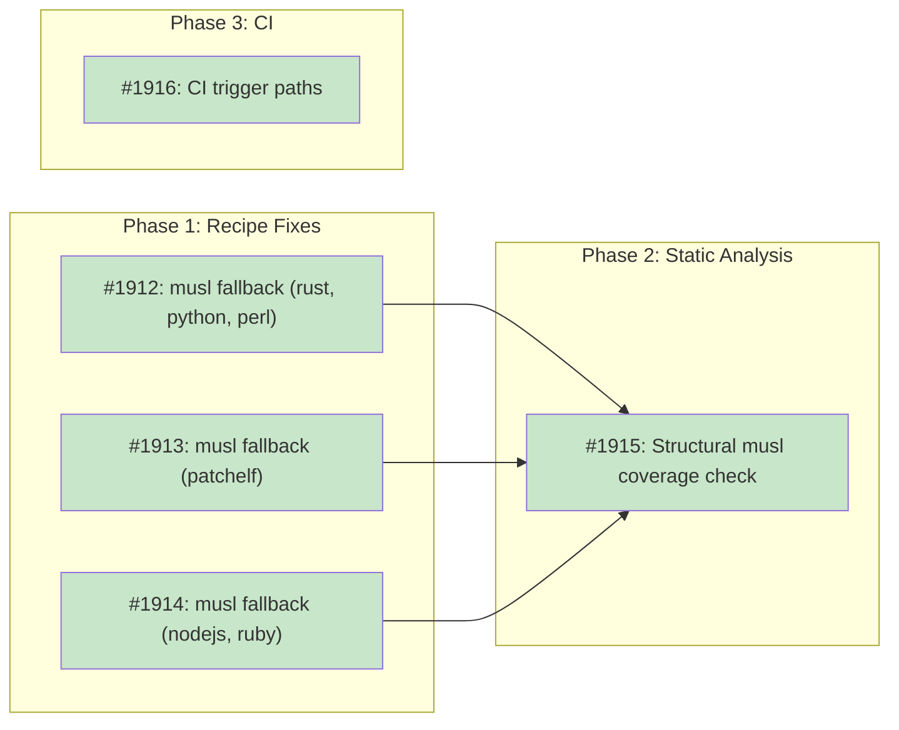

# DESIGN: Embedded Recipe musl Coverage

## Status

**Planned**

## Implementation Issues

### Milestone: [embedded-recipe-musl-coverage](https://github.com/tsukumogami/tsuku/milestone/101)

| Issue | Dependencies | Tier |
|-------|--------------|------|
| ~~[#1912: fix(recipes): add musl fallback to rust, python-standalone, and perl embedded recipes](https://github.com/tsukumogami/tsuku/issues/1912)~~ | ~~None~~ | ~~testable~~ |
| ~~_Adds `apk_install` musl paths and glibc `when` clause guards to the three straightforward embedded recipes. Establishes the pattern that the remaining recipes follow._~~ | | |
| ~~[#1913: fix(recipes): add musl fallback to patchelf embedded recipe](https://github.com/tsukumogami/tsuku/issues/1913)~~ | ~~None~~ | ~~testable~~ |
| ~~_Restructures patchelf from a single unconditional `homebrew` step into three platform paths (glibc, musl, darwin). Patchelf won't be invoked on musl, but must install successfully as a declared dependency._~~ | | |
| ~~[#1914: fix(recipes): add musl fallback to nodejs and ruby embedded recipes](https://github.com/tsukumogami/tsuku/issues/1914)~~ | ~~None~~ | ~~testable~~ |
| ~~_The most involved recipe fixes. Both have `link_dependencies` and wrapper scripts that filter on `os = ["linux"]` but need `libc = ["glibc"]` guards to avoid running after `apk_install`._~~ | | |
| ~~[#1915: feat(recipe): add structural musl coverage check to AnalyzeRecipeCoverage](https://github.com/tsukumogami/tsuku/issues/1915)~~ | ~~[#1912](https://github.com/tsukumogami/tsuku/issues/1912), [#1913](https://github.com/tsukumogami/tsuku/issues/1913), [#1914](https://github.com/tsukumogami/tsuku/issues/1914)~~ | ~~critical~~ |
| ~~_Adds the static analysis guard that prevents this class of bug from recurring. Flags embedded recipes using `download`, `github_archive`, or `homebrew` without libc `when` clauses and no `apk_install` fallback. Also adds `supported_libc` metadata to `go.toml` and `zig.toml`._~~ | | |
| ~~[#1916: fix(ci): add embedded recipe paths to CI triggers](https://github.com/tsukumogami/tsuku/issues/1916)~~ | ~~None~~ | ~~simple~~ |
| ~~_Adds `internal/recipe/recipes/**/*.toml` to `test-recipe.yml` trigger paths so embedded recipe changes get PR-time Alpine testing. Removes the outdated commented-out `rust-test-musl` job from `test.yml`._~~ | | |

### Dependency Graph



**Legend**: Green = done, Blue = ready, Yellow = blocked, Purple = needs-design, Orange = tracks-design

## Context and Problem Statement

Tsuku's embedded recipes provide toolchain dependencies (Rust, Python, Node.js, etc.) that other recipes need at build or eval time. These are bundled into the binary at `internal/recipe/recipes/` and must work on all supported platforms, including Alpine Linux (musl libc).

Six embedded recipes download pre-built binaries that are linked against glibc. On Alpine, these binaries fail with `not found` because the glibc dynamic linker (`ld-linux-x86-64.so.2`) doesn't exist on musl systems. The binary is physically present on disk, but the kernel can't execute it.

This was partially addressed in #1092 for library recipes (zlib, libyaml, openssl, gcc-libs), which now use `when` clauses with `apk_install` fallbacks for musl. But six non-library embedded recipes were never updated.

The gap has persisted because of blind spots in both CI and static analysis:

- `TestTransitiveDepsHavePlatformCoverage` treats unconditional steps (no `when` clause) as universally compatible. It doesn't understand that `os_mapping = { linux = "unknown-linux-gnu" }` produces glibc-only binaries.
- `test-recipe.yml` triggers on `recipes/**/*.toml` but not `internal/recipe/recipes/**`, so embedded recipe changes bypass PR-time Alpine testing.
- The weekly `recipe-validation-core.yml` does test on Alpine, but it's informational only.

### Scope

**In scope:**
- Adding musl fallback paths to the six broken embedded recipes
- Fixing the static analysis to detect glibc-only download URLs without libc when clauses
- Adding embedded recipe paths to CI triggers for PR-time Alpine testing
- Removing the outdated `test.yml` comment referencing #1092

**Out of scope:**
- Changing the musl detection mechanism (DetectLibc works correctly)
- Adding new actions or infrastructure (apk_install already exists)
- Registry recipe musl support (only embedded recipes are in scope)

## Decision Drivers

- All six tools have Alpine packages available (`rustup`, `python3`, `nodejs`, `ruby`, `perl`, `patchelf`), so `apk_install` is viable for all of them.
- Eight embedded recipes already demonstrate the libc-aware pattern with `when` clauses. The fix follows an established convention, not a new one.
- The `WhenClause.Libc` field, `DetectLibc()`, and `apk_install` action all exist and work. No new infrastructure is needed.
- On musl, `apk_install` handles transitive dependencies automatically, so recipes don't need to declare library dependencies in the musl path.
- The static analysis gap means this class of bug can recur whenever someone adds a new embedded recipe with unconditional download steps.

## Considered Options

### Decision 1: How to Provide musl Support

The six broken recipes need to install their tools on musl systems. The question is what mechanism to use for the musl path.

#### Chosen: apk_install with Alpine System Packages

Add `apk_install` steps with `when = { os = ["linux"], libc = ["musl"] }` to each recipe, using the corresponding Alpine packages. Wrap existing download/extract steps with `when = { os = ["linux"], libc = ["glibc"] }` to prevent them from running on musl.

This matches the pattern used by cmake, openssl, zlib, and five other embedded recipes. Each recipe gets two Linux paths: glibc uses the existing download approach, musl uses Alpine's package manager.

Specific packages per recipe:
- **rust**: `apk_install` with `rust` and `cargo` (provides the toolchain directly, no version management needed since Rust is an eval-time dependency, not a user-facing tool)
- **python-standalone**: `apk_install` with `python3`
- **nodejs**: `apk_install` with `nodejs` and `npm`
- **ruby**: `apk_install` with `ruby`
- **perl**: `apk_install` with `perl`
- **patchelf**: `apk_install` with `patchelf`

#### Alternatives Considered

**Download musl-specific binaries**: Some upstreams provide musl builds (Rust has `x86_64-unknown-linux-musl` tarballs, python-build-standalone has musl variants). This would preserve version pinning but requires per-tool research into musl binary availability, URL patterns, and whether the binaries actually work. Alpine packages are tested by the distro and guaranteed to work on musl.

Rejected because it's more work per recipe with no clear benefit. These are embedded toolchain recipes, not user-facing tools. The Alpine package version is good enough for building other crates or running scripts.

**Skip musl entirely with supported_libc constraint**: Mark these recipes as `supported_libc = ["glibc"]` and let them fail gracefully on musl. Recipes that depend on them (like any `cargo_install` recipe) would be excluded from musl testing.

Rejected because it gives up on musl support for all Rust, Python, Node, Ruby, and Perl recipes. That's a large fraction of the registry. Alpine users would lose the ability to install most tools.

### Decision 2: How to Prevent Recurrence

The static analysis didn't catch this because `AnalyzeRecipeCoverage` treats unconditional steps as universally compatible. New embedded recipes with glibc-only downloads but no `when` clauses would slip through.

#### Chosen: Structural Check on Action Types

Instead of parsing URL templates or `os_mapping` values, use a structural check: an embedded recipe has musl coverage if it has at least one `apk_install` step, or if all its platform-specific steps have `when` clauses with `libc` filtering. Recipes that use `download`, `download_archive`, `github_archive`, or `homebrew` actions without libc-scoped `when` clauses are flagged as potentially missing musl support.

This approach catches all six broken recipes regardless of their `os_mapping` values. nodejs and perl use `os_mapping = { linux = "linux" }` which contains no glibc-specific strings, and patchelf has no `os_mapping` at all (it uses `homebrew`). A string-matching heuristic on `os_mapping` values would miss these.

Recipes that legitimately work on musl without `apk_install` (like `go.toml` and `zig.toml`, which download statically-linked binaries) can be marked with `supported_libc = ["glibc", "musl"]` in their metadata to suppress the warning.

#### Alternatives Considered

**String-match on os_mapping values**: Inspect `os_mapping` for glibc indicators like `gnu`, `ubuntu`, `debian`. Flag recipes whose mappings contain these strings without libc `when` clauses.

Rejected because it only catches 3 of 6 broken recipes. nodejs (`linux`), perl (`linux`), and patchelf (no `os_mapping`) don't contain glibc-specific strings. The heuristic would need a growing deny-list that still can't catch action types like `homebrew` that are inherently glibc-only.

**Manual review only**: Rely on PR review to catch new embedded recipes missing musl support.

Rejected because the current bug proves that manual review misses this. The six recipes have been broken since they were created.

### Decision 3: CI Trigger Paths

`test-recipe.yml` doesn't trigger when embedded recipes change because its path filter only includes `recipes/**/*.toml`. This means changes to `internal/recipe/recipes/` bypass PR-time Alpine testing.

#### Chosen: Add Embedded Paths to test-recipe-changes.yml Trigger

The `test-recipe-changes.yml` workflow already includes `internal/recipe/recipes/**/*.toml` in its trigger paths and tests across Alpine containers. Verify this works correctly and ensure it's not filtering out the affected recipes. If `test-recipe.yml` also needs the path, add it there too.

#### Alternatives Considered

**Create a dedicated embedded recipe Alpine test workflow**: Build a new workflow specifically for embedded recipes on musl.

Rejected because the existing workflows already have the infrastructure. Adding a path filter is simpler than creating and maintaining a new workflow.

## Decision Outcome

**Chosen: 1A + 2A + 3A**

### Summary

Each of the six broken recipes gets a musl fallback path using `apk_install` with Alpine system packages. The existing download/extract steps get `when = { os = ["linux"], libc = ["glibc"] }` guards to prevent them from running on musl. The musl steps use `when = { os = ["linux"], libc = ["musl"] }` and declare the appropriate Alpine packages. macOS steps (where they exist) keep `when = { os = ["darwin"] }`.

The recipes aren't all equally simple to fix. Three are straightforward (rust, python-standalone, perl — just add `when` clauses and an `apk_install` step). Three need more care:

- **patchelf**: Currently uses `homebrew` unconditionally with no OS distinction. Needs to be split into three platform paths (glibc homebrew, musl apk_install, darwin homebrew), not just decorated with a `when` clause.
- **nodejs**: Has `link_dependencies` and a wrapper `run_command` with `when = { os = ["linux"] }` that will execute on both glibc and musl. These need `libc = ["glibc"]` guards, otherwise they'll run after `apk add nodejs` and break things.
- **ruby**: Has a 70-line wrapper script and `link_dependencies` with no `when` clause. Same glibc-guard issue as nodejs.

The `AnalyzeRecipeCoverage` function gets a structural check: any embedded recipe that uses `download`, `download_archive`, `github_archive`, or `homebrew` steps without libc-scoped `when` clauses, and has no `apk_install` step, is flagged as missing musl coverage. Recipes with statically-linked downloads (like `go.toml` and `zig.toml`) can suppress the warning with `supported_libc = ["glibc", "musl"]` in their metadata.

For CI, the `test-recipe-changes.yml` trigger already includes `internal/recipe/recipes/**/*.toml`. We verify this path works and, if `test-recipe.yml` is missing it, add it there. The outdated comment at `test.yml:201` referencing #1092 gets removed.

Verify commands need attention on the musl path. Five of six recipes use `{install_dir}/bin/<tool>` patterns. After `apk_install`, binaries live in system paths (`/usr/bin`), not `{install_dir}/bin/`. The verify command needs to work on both paths. The simplest approach: use the bare executable name (e.g., `cargo --version` instead of `{install_dir}/bin/cargo --version`). The `apk_install` action already adds system paths, so the bare name resolves correctly on both glibc and musl.

Additional edge cases:
- **patchelf on musl**: patchelf exists to patch ELF binaries for Homebrew bottle relocation. On musl, there are no Homebrew bottles to patch. But patchelf is still a declared dependency of other recipes, so it needs to install successfully even if it won't be used.
- **Rust version pinning**: On musl, `apk add rust cargo` installs whatever version Alpine provides. Since Rust is an eval-time dependency, the Alpine version is acceptable.
- **go.toml and zig.toml**: These download binaries without libc `when` clauses, but they work on musl because Go and Zig produce statically-linked binaries. They should get `supported_libc = ["glibc", "musl"]` metadata to document this and suppress the new static analysis warning.

### Rationale

Using `apk_install` for all six recipes is consistent with the eight already-fixed recipes and requires zero new infrastructure. The static analysis fix catches this class of bug at unit test time, which is much faster than discovering it through CI failures or weekly validation runs. Together, the recipe fixes, static analysis, and CI trigger changes address all three layers of the problem identified in #1907.

The trade-off of using system packages instead of version-pinned downloads is acceptable for toolchain dependencies. These recipes exist to provide build tools for other recipes, not as user-facing installations. If a user wants a specific Rust or Python version on Alpine, they can install it through other means.

## Solution Architecture

### Overview

Three changes across three layers:

1. **Recipe layer**: Six TOML files in `internal/recipe/recipes/` get musl-aware `when` clauses
2. **Analysis layer**: `internal/recipe/coverage.go` gets a new detection check
3. **CI layer**: Workflow trigger paths and comment cleanup

### Component 1: Recipe Changes

Each recipe follows the same pattern. Taking rust.toml as the example:

```toml
# Existing download step gets a glibc guard
[[steps]]
action = "download"
url = "https://static.rust-lang.org/dist/rust-{version}-{arch}-{os}.tar.gz"
os_mapping = { linux = "unknown-linux-gnu", darwin = "apple-darwin" }
arch_mapping = { amd64 = "x86_64", arm64 = "aarch64" }
when = { os = ["linux"], libc = ["glibc"] }

# ... extract and install steps also get when = { os = ["linux"], libc = ["glibc"] }

# New musl path
[[steps]]
action = "apk_install"
packages = ["rust", "cargo"]
when = { os = ["linux"], libc = ["musl"] }

# macOS steps get explicit darwin guard
[[steps]]
action = "download"
# ... same URL pattern
when = { os = ["darwin"] }
```

### Component 2: Coverage Analysis Enhancement

In `AnalyzeRecipeCoverage`, after the existing `when` clause analysis, add a structural check. The logic: certain action types produce platform-specific binaries that won't work on musl. If an embedded recipe uses any of these actions without a libc-scoped `when` clause and has no `apk_install` step, it's flagged.

```go
// Actions that produce platform-specific binaries
glibcActions := map[string]bool{
    "download": true, "download_archive": true,
    "github_archive": true, "homebrew": true,
}

hasApkInstall := false
hasUnguardedGlibcAction := false
for _, step := range r.Steps {
    if step.Action == "apk_install" {
        hasApkInstall = true
    }
    if glibcActions[step.Action] && !hasLibcWhenClause(step) {
        hasUnguardedGlibcAction = true
    }
}

// If the recipe has supported_libc metadata declaring musl support, skip
if r.Metadata.SupportedLibc contains "musl" {
    // Explicitly declared as musl-safe (e.g., statically-linked Go/Zig)
} else if hasUnguardedGlibcAction && !hasApkInstall {
    report.Warnings = append(report.Warnings,
        "recipe has platform-specific actions without libc when clauses and no apk_install fallback")
}
```

This catches all six broken recipes and future ones with the same pattern, while allowing statically-linked tools (go, zig) to opt out via metadata.

### Component 3: CI Changes

1. Verify `test-recipe-changes.yml` trigger includes `internal/recipe/recipes/**/*.toml`
2. Add the same path to `test-recipe.yml` if missing
3. Remove the outdated comment at `test.yml:201`

### Data Flow

1. At build time, `AnalyzeRecipeCoverage` runs as a unit test
2. It loads all embedded recipes and checks for musl coverage
3. If a recipe has platform-specific actions without libc `when` clauses and no `apk_install` step, the test fails
4. At runtime on musl systems, `DetectLibc()` returns `"musl"`
5. The step evaluator skips steps with `when = { libc = ["glibc"] }`
6. The `apk_install` step runs, installing the system package
7. Downstream recipes (e.g., `cargo_install`) find the toolchain in the system PATH

## Implementation Approach

### Phase 1: Recipe Fixes

Update the six embedded recipes with musl fallback paths. The three simple recipes (rust, python-standalone, perl) follow the same pattern:
1. Add `when = { os = ["linux"], libc = ["glibc"] }` to existing download/extract/install steps
2. Add `when = { os = ["darwin"] }` to macOS steps (where not already present)
3. Add `apk_install` step with `when = { os = ["linux"], libc = ["musl"] }` and appropriate packages
4. Update verify commands to use bare executable names instead of `{install_dir}/bin/` paths

The three complex recipes need additional work:
- **patchelf**: Restructure from a single unconditional `homebrew` step into three platform paths
- **nodejs**: Add `libc = ["glibc"]` guards to `link_dependencies` and the wrapper `run_command` step that currently only filters on `os = ["linux"]`
- **ruby**: Same as nodejs — guard the wrapper script and `link_dependencies` steps with `libc = ["glibc"]`

Also add `supported_libc = ["glibc", "musl"]` metadata to `go.toml` and `zig.toml` to document that their statically-linked downloads work on musl.

Files: `internal/recipe/recipes/rust.toml`, `python-standalone.toml`, `nodejs.toml`, `ruby.toml`, `perl.toml`, `patchelf.toml`, `go.toml`, `zig.toml`

### Phase 2: Static Analysis

Add the structural check to `AnalyzeRecipeCoverage` in `internal/recipe/coverage.go`. The check flags embedded recipes that have platform-specific actions (download, homebrew, etc.) without libc `when` clauses and no `apk_install` fallback. Recipes with `supported_libc` metadata declaring musl support are exempt.

Update `TestTransitiveDepsHavePlatformCoverage` to promote the new warnings to errors for embedded recipes, matching the existing behavior for library recipes.

Files: `internal/recipe/coverage.go`, `internal/recipe/coverage_test.go`

### Phase 3: CI Cleanup

1. Add `internal/recipe/recipes/**/*.toml` to `test-recipe.yml` trigger paths if missing
2. Remove the outdated `# NOTE: musl tests disabled` comment from `test.yml`

Files: `.github/workflows/test-recipe.yml`, `.github/workflows/test.yml`

### Phase 4: Validation

Verify the fixes work end-to-end and can't drift:

1. **Unit tests pass**: `go test ./internal/recipe/...` exercises `AnalyzeRecipeCoverage` against all embedded recipes. The new structural check should pass for the fixed recipes and for go/zig (via metadata). It should fail if the `when` clauses or `apk_install` steps are removed.

2. **Alpine smoke test**: Run each fixed recipe in an Alpine container locally using the sandbox executor. This confirms the `apk_install` path works and the verify command succeeds. For recipes that are eval-time dependencies (rust, python-standalone, nodejs), also run a downstream recipe that depends on them (e.g., `cargo_install` a simple crate to prove Rust works).

3. **CI validates on merge**: The `test-recipe-changes.yml` workflow runs against Alpine on every PR that touches embedded recipes. This is the ongoing regression gate. After this PR, every future embedded recipe change gets Alpine testing automatically.

4. **Drift prevention**: The static analysis is the primary drift guard. If someone adds a new embedded recipe with an unconditional `download` action and no `apk_install` fallback, `TestTransitiveDepsHavePlatformCoverage` fails the build. The only way to bypass it is adding `supported_libc` metadata, which requires a conscious decision.

## Security Considerations

### Download Verification

On the musl path, packages are installed via `apk add` from Alpine's official repositories. Alpine signs its package index with RSA keys, and `apk` verifies signatures automatically. This is equivalent to or better than the current glibc path, which downloads tarballs with checksum verification but no signature checking (for rust, nodejs, etc.).

### Execution Isolation

No change to execution isolation. The `apk_install` action runs `apk add` which requires root in a container context (sandbox testing) but runs in the same isolation as today. During real user installations, `apk_install` runs with the user's current privileges.

### Supply Chain Risks

The musl path introduces a dependency on Alpine's package repositories. These are maintained by the Alpine Linux project and widely trusted. The glibc path trusts upstream project release infrastructure (e.g., `static.rust-lang.org`, `nodejs.org`). Both are reasonable trust anchors. The main difference: Alpine packages may lag behind upstream releases. For toolchain dependencies, this is acceptable.

### User Data Exposure

No change. `apk add` doesn't transmit user data beyond the package download request. The privacy profile is identical to the existing `download` action.

## Consequences

### Positive

- All embedded recipes work on Alpine/musl, enabling cargo, pip, npm, gem, and cpan recipes to build on musl systems
- Future embedded recipes with glibc-specific downloads get caught by the static analysis
- PR-time CI catches Alpine regressions before merge instead of waiting for weekly runs
- Follows the established pattern from #1092, so the codebase becomes more consistent

### Negative

- On musl, toolchain versions are pinned to what Alpine provides rather than what the recipe specifies. An Alpine system might have Rust 1.82 when the recipe expects 1.93.
- The `apk_install` action requires a working Alpine package manager, which only exists on Alpine. Other musl distributions (like Void Linux musl) won't benefit from this fix.

### Mitigations

- Version pinning matters less for toolchain dependencies. They're used to build other tools, not as user-facing installations. If a crate requires Rust 1.90+ and Alpine has 1.82, the build fails with a clear error from cargo, not a cryptic "not found" from the dynamic linker.
- Alpine is the primary musl distribution tested in CI. Supporting other musl distributions is out of scope and can be addressed if demand appears.
