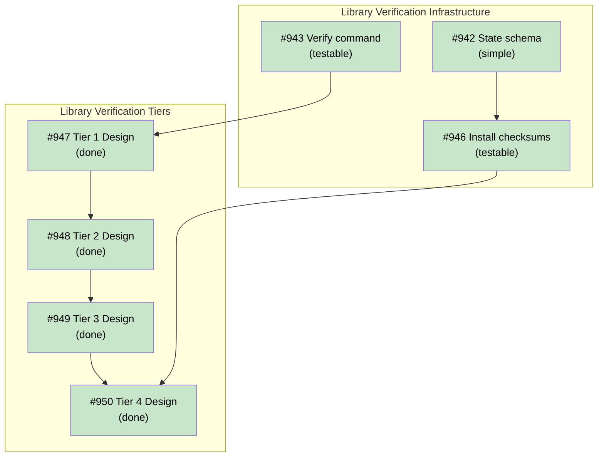

# DESIGN: Library Verification for tsuku verify Command

## Status

Current

## Implementation Issues

| Issue | Title | Dependencies | Tier |
|-------|-------|--------------|------|
| ~~[#942](https://github.com/tsukumogami/tsuku/issues/942)~~ | ~~feat(state): add checksums field to library version state~~ | ~~None~~ | ~~simple~~ |
| ~~[#943](https://github.com/tsukumogami/tsuku/issues/943)~~ | ~~feat(verify): add library type detection and flag routing~~ | ~~None~~ | ~~testable~~ |
| ~~[#946](https://github.com/tsukumogami/tsuku/issues/946)~~ | ~~feat(install): compute and store library checksums at install time~~ | ~~[#942](https://github.com/tsukumogami/tsuku/issues/942)~~ | ~~testable~~ |
| ~~[#947](https://github.com/tsukumogami/tsuku/issues/947)~~ | ~~docs: design header validation for library verification (Tier 1)~~ | ~~[#943](https://github.com/tsukumogami/tsuku/issues/943)~~ | ~~critical~~ |
| ~~[#948](https://github.com/tsukumogami/tsuku/issues/948)~~ | ~~docs: design dependency resolution for library verification (Tier 2)~~ | ~~[#947](https://github.com/tsukumogami/tsuku/issues/947)~~ | ~~critical~~ |
| ~~[M38](https://github.com/tsukumogami/tsuku/milestone/38)~~ | ~~Tier 2 Dependency Validation (12 issues)~~ | ~~[#948](https://github.com/tsukumogami/tsuku/issues/948)~~ | ~~milestone~~ |
| ~~[#949](https://github.com/tsukumogami/tsuku/issues/949)~~ | ~~docs: design dlopen load testing for library verification (Tier 3)~~ | ~~[M38](https://github.com/tsukumogami/tsuku/milestone/38)~~ | ~~critical~~ |
| ~~[M39](https://github.com/tsukumogami/tsuku/milestone/39)~~ | ~~Tier 3 dlopen Verification (7 issues)~~ | ~~[#949](https://github.com/tsukumogami/tsuku/issues/949)~~ | ~~milestone~~ |
| ~~[#950](https://github.com/tsukumogami/tsuku/issues/950)~~ | ~~docs: design integrity verification for library verification (Tier 4)~~ | ~~[#946](https://github.com/tsukumogami/tsuku/issues/946)~~, ~~[M39](https://github.com/tsukumogami/tsuku/milestone/39)~~ | ~~testable~~ |
| ~~[M49](https://github.com/tsukumogami/tsuku/milestone/49)~~ | ~~Tier 4 Implementation (3 issues)~~ | ~~[#950](https://github.com/tsukumogami/tsuku/issues/950)~~ | ~~milestone~~ |



**Legend**: Green = done, Blue = ready, Yellow = blocked, Purple = needs-design

## Context and Problem Statement

Tsuku now supports library recipes (`type = "library"`) for installing shared libraries that tools depend on at runtime. For example, `gcc-libs` provides `libstdc++` and `libgcc_s` for binaries compiled with GCC. Libraries are installed to `$TSUKU_HOME/libs/{name}-{version}/` and are linked at runtime by dependent tools.

However, the `tsuku verify` command does not support libraries. When users run `tsuku verify gcc-libs`, the command fails with "Recipe for 'gcc-libs' does not define verification" because:

1. Libraries have no executables to run for verification
2. Library recipes have no `[verify]` section (the validator explicitly skips this check for libraries)
3. The verify command's design assumes all tools produce an executable output

This creates a gap in the user experience: users can install libraries but have no way to verify they're working correctly before encountering runtime link errors.

## Decision Drivers

- **Practical verification**: Answer "will this library work?" rather than just "does this file exist?"
- **Fast by default**: Quick validation (header check) that can be extended with flags
- **Cross-platform**: Work on both Linux (ELF) and macOS (Mach-O)
- **Graceful degradation**: Work even if optional components (dlopen helper) aren't available
- **Security awareness**: Optional integrity checking for security-conscious users
- **Minimal dependencies**: Use Go standard library where possible

## Considered Options

### Option 1: Checksum-Only Verification

Verify libraries by comparing file checksums against stored values from installation.

**Pros:**
- Simple to implement
- Fast execution
- Detects tampering and corruption

**Cons:**
- Only answers "is this the same file?" not "does this work?"
- Doesn't catch missing dependencies or ABI issues
- False confidence: matching checksum doesn't mean library loads

### Option 2: Tiered Verification with Optional Integrity

Implement verification in levels, with each level providing deeper validation:

1. **Level 1 - Header Validation**: Check ELF/Mach-O headers for format and architecture
2. **Level 2 - Dependency Check**: Verify required libraries are available
3. **Level 3 - Load Test**: Actually dlopen() the library to prove it loads
4. **Level 4 - Integrity**: Optional checksum comparison (--integrity flag)

**Pros:**
- Answers "will this work?" not just "does this exist?"
- Fast default (Levels 1-2) with optional depth
- Catches real issues: wrong architecture, missing deps, ABI mismatches
- Load test proves library actually loads (catches issues headers miss)
- Graceful degradation if dlopen helper unavailable

**Cons:**
- More complex implementation
- Requires cgo helper for dlopen (separate binary)
- Load test executes .init sections (security consideration)

### Option 3: External Tool Delegation

Use external tools (ldd, otool, file) for verification.

**Pros:**
- Leverages existing, well-tested tools
- No need to parse binary formats ourselves

**Cons:**
- Different tools per platform
- Output parsing is fragile
- Adds external dependencies
- Some tools may not be installed

## Decision Outcome

**Chosen: Option 2 - Tiered Verification with Optional Integrity**

This approach provides meaningful verification while keeping the default fast. Users get confidence their libraries will work, not just that files exist. The tiered approach lets users choose their depth:

- Quick check: `tsuku verify gcc-libs` (Levels 1-3, sub-second)
- Full check: `tsuku verify gcc-libs --integrity` (adds Level 4 checksum)

The cgo helper for dlopen is acceptable because:
1. It's a separate binary (main tsuku stays pure Go)
2. Auto-installed on first use (transparent to users)
3. Optional (verification gracefully skips if unavailable)

## Solution Architecture

### Verification Levels

```
┌─────────────────────────────────────────────────────────────────┐
│                     Library Verification                         │
├─────────────────────────────────────────────────────────────────┤
│ Level 1: Header Validation                                       │
│   ├── Parse ELF/Mach-O headers (Go stdlib: debug/elf, debug/macho)│
│   ├── Verify: magic bytes, class (32/64-bit), endianness         │
│   ├── Check: architecture matches current platform               │
│   └── Extract: dependency list (DT_NEEDED / LC_LOAD_DYLIB)       │
├─────────────────────────────────────────────────────────────────┤
│ Level 2: Dependency Resolution                                   │
│   ├── For each dependency from Level 1:                          │
│   │   ├── Check tsuku-managed libraries first ($TSUKU_HOME/libs) │
│   │   ├── Check system library paths (/lib, /usr/lib, etc.)     │
│   │   └── Handle platform-specific paths (rpath, @loader_path)  │
│   └── Report: missing deps, available deps, resolution path      │
├─────────────────────────────────────────────────────────────────┤
│ Level 3: Load Test (tsuku-dltest helper)                        │
│   ├── Invoke helper binary with library paths                    │
│   ├── Helper calls dlopen(RTLD_LAZY) on each library            │
│   ├── Reports success/failure per library                        │
│   └── Catches: version mismatches, missing symbols, .init errors │
├─────────────────────────────────────────────────────────────────┤
│ Level 4: Integrity Verification (--integrity flag)              │
│   ├── Load stored checksums from state.json                      │
│   ├── Compute current SHA256 of library files                    │
│   ├── Compare: detect modifications since installation           │
│   └── Report: matching, modified, or missing checksums           │
└─────────────────────────────────────────────────────────────────┘
```

### Output Format

```
$ tsuku verify gcc-libs
Verifying gcc-libs (version 15.2.0)...

  lib/libstdc++.so.6.0.33
    Format: ELF shared object (x86_64) ✓
    Dependencies: libm.so.6, libc.so.6, libgcc_s.so.1 ✓
    Loadable: yes ✓

  lib/libgcc_s.so.1
    Format: ELF shared object (x86_64) ✓
    Dependencies: libc.so.6 ✓
    Loadable: yes ✓

gcc-libs is working correctly (2 libraries verified)
```

## Implementation Approach

Implementation is split across multiple milestones:

1. **Infrastructure** (Issues #942, #943, #946): State schema, command routing, checksum storage
2. **Tier 1** (Issue #947 → Design): Header validation using Go stdlib
3. **Tier 2** (Issue #948 → Design → Milestone M38): Dependency resolution
4. **Tier 3** (Issue #949 → Design → Milestone M39): dlopen load testing with helper binary
5. **Tier 4** (Issue #950 → Design → Milestone M49): Integrity verification with checksums

Each tier has a design doc that details implementation specifics. See the linked issues above.

## Security Considerations

### Download Verification

**Not applicable at this layer.** Download verification happens during installation via recipe checksums. This design focuses on post-installation verification.

### Execution Isolation

**Level 3 consideration.** The dlopen helper executes library initialization code (.init sections). This is mitigated by:
- Running as separate process (crashes don't affect tsuku)
- Only loading libraries from `$TSUKU_HOME/libs` (user-installed)
- Optional `--skip-dlopen` flag for paranoid users
- 5-second timeout prevents hangs

### Supply Chain Risks

**Limited scope.** This verification doesn't protect against:
- Compromised downloads (handled by installation-time checksums)
- Malicious code in libraries (out of scope - we verify structure, not intent)

Level 4 integrity checking detects post-installation tampering but cannot prevent it.

### User Data Exposure

**Not applicable.** Verification only reads library files and state.json. No network access, no telemetry, no user data transmitted.

## Consequences

### Positive

- Users can verify libraries before encountering runtime errors
- Fast default verification (Levels 1-3) catches most issues
- Optional integrity check for security-conscious users
- Cross-platform: works on Linux and macOS
- Graceful degradation if dlopen helper unavailable

### Negative

- Separate cgo binary required for full verification
- Level 3 executes .init sections (security consideration)
- More complex than simple checksum verification

### Neutral

- Implementation split across multiple milestones
- Each tier has separate design doc for detailed specification
