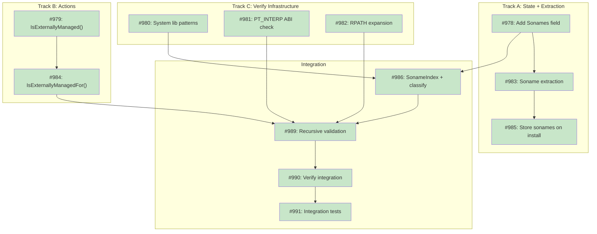

# Dependency Resolution for Library Verification (Tier 2)

**Status:** Current

## Implementation Issues

### Milestone: [Tier 2 Dependency Validation](https://github.com/tsukumogami/tsuku/milestone/38)

| Issue | Title | Dependencies | Tier |
|-------|-------|--------------|------|
| [#978](https://github.com/tsukumogami/tsuku/issues/978) | Add Sonames field to LibraryVersionState | None | simple |
| [#979](https://github.com/tsukumogami/tsuku/issues/979) | Add IsExternallyManaged() to SystemAction | None | testable |
| [#980](https://github.com/tsukumogami/tsuku/issues/980) | Implement system library pattern matching | None | testable |
| [#981](https://github.com/tsukumogami/tsuku/issues/981) | Implement PT_INTERP ABI validation | None | testable |
| [#982](https://github.com/tsukumogami/tsuku/issues/982) | Implement RPATH and path variable expansion | None | critical |
| [#983](https://github.com/tsukumogami/tsuku/issues/983) | Implement soname extraction for ELF/Mach-O | [#978](https://github.com/tsukumogami/tsuku/issues/978) | testable |
| [#984](https://github.com/tsukumogami/tsuku/issues/984) | Add IsExternallyManagedFor() method | [#979](https://github.com/tsukumogami/tsuku/issues/979) | testable |
| [#985](https://github.com/tsukumogami/tsuku/issues/985) | Extract and store sonames during install | [#983](https://github.com/tsukumogami/tsuku/issues/983) | testable |
| [#986](https://github.com/tsukumogami/tsuku/issues/986) | Implement SonameIndex and classification | [#978](https://github.com/tsukumogami/tsuku/issues/978), [#980](https://github.com/tsukumogami/tsuku/issues/980) | testable |
| [#989](https://github.com/tsukumogami/tsuku/issues/989) | Implement recursive dependency validation | [#981](https://github.com/tsukumogami/tsuku/issues/981), [#982](https://github.com/tsukumogami/tsuku/issues/982), [#984](https://github.com/tsukumogami/tsuku/issues/984), [#986](https://github.com/tsukumogami/tsuku/issues/986) | critical |
| [#990](https://github.com/tsukumogami/tsuku/issues/990) | Integrate Tier 2 dependency validation | [#989](https://github.com/tsukumogami/tsuku/issues/989) | testable |
| [#991](https://github.com/tsukumogami/tsuku/issues/991) | Add Tier 2 integration tests | [#990](https://github.com/tsukumogami/tsuku/issues/990) | testable |

### Dependency Graph



**Legend**: Green = done, Blue = ready, Yellow = blocked, Purple = needs-design

**Upstream Design Reference:** This design implements Tier 2 of [DESIGN-library-verification.md](./DESIGN-library-verification.md).

## Context and Problem Statement

Tsuku's `verify` command performs post-installation validation to ensure tools and libraries were installed correctly. Tier 1 (header validation) confirms that binary files have valid ELF or Mach-O headers. However, a binary can have valid headers yet still fail at runtime if its dependencies are missing or unresolvable.

When tsuku installs a tool like `ruby`, that tool links against libraries (e.g., `libyaml-0.so.2`, `libssl.so.3`). If a required dependency is missing, the tool fails at runtime with errors like "cannot open shared object file" or "library not loaded". Without dependency validation, `tsuku verify` cannot detect these issues proactively.

### The Three Categories

Dependencies fall into three categories based on their inherent nature:

| Category | Definition | Example | Action |
|----------|------------|---------|--------|
| **PURE SYSTEM** | Inherently OS-provided | `libc.so.6`, `libSystem.B.dylib` | Verify accessible, skip recursion |
| **TSUKU-MANAGED** | Built/managed by tsuku | `libyaml` built from source | Verify provides expected soname, recurse |
| **EXTERNALLY-MANAGED** | Tsuku recipe delegating to pkg manager | `openssl` via `apt_install` | Verify provides expected soname, skip recursion |

**Critical insight:** PURE SYSTEM is defined by the library's inherent nature (OS-provided), not by the absence of a tsuku recipe. The absence of a recipe is a *consequence* of being OS-provided, not the *definition*.

### Scope

**In scope:**
- Extracting dependency lists from ELF (`DT_NEEDED`) and Mach-O (`LC_LOAD_DYLIB`) binaries
- Resolving path variables (`$ORIGIN`, `@rpath`, `@loader_path`)
- Classifying dependencies into three categories
- Verifying tsuku-managed dependencies provide expected sonames
- Validating ABI compatibility (PT_INTERP check)
- Recursive validation of tsuku-managed dependencies
- Handling macOS dyld shared cache (system libraries not on disk)

**Out of scope:**
- Symbol-level verification (Tier 3: dlopen test)
- Checksum/integrity verification (Tier 4)
- Version compatibility checking beyond soname matching
- Runtime-loaded dependencies (dlopen)
- `provides` field validation (pending issue #969)

## Decision Drivers

- **Cross-platform**: Must work on Linux (ELF, glibc/musl) and macOS (Mach-O)
- **No false positives**: System libraries must not trigger verification failures
- **No external tools**: Use Go's `debug/elf` and `debug/macho` packages
- **Unified scope**: Same validation logic for tools and libraries
- **Recursive by default**: Validate entire dependency tree
- **Fail on undeclared deps**: Pre-GA, failures help identify corner cases

## Complete Validation Model

The `tsuku verify <target>` command executes the following flow:

```
tsuku verify <target>

1. LOAD target from state.json
   → FAIL if not installed

2. VALIDATE target itself:

   a. ABI compatible?
      - Linux: PT_INTERP interpreter exists (catches glibc/musl mismatch)
      - macOS: Architecture matches (arm64/x86_64)
      → FAIL if not

   b. 🔮 Do I provide what my recipe declares?
      - Compare actual sonames against declared `provides`
      → FAIL if not
      → PENDING: requires `provides` field (issue #969)

   c. 🔮 Do I provide more than declared?
      - Undeclared sonames suggest incomplete recipe
      → WARN
      → PENDING: requires `provides` field (issue #969)

3. AM I TSUKU-MANAGED?
   - Check via IsExternallyManaged() on recipe actions
   → If externally-managed: STOP here (steps 2a-2c validated me, done)

4. VALIDATE my dependencies:

   a. Resolve path variables in DT_NEEDED
      - Expand $ORIGIN, @rpath, @loader_path

   b. For each DT_NEEDED entry, classify:
      - In soname index → TSUKU dep (managed or external)
      - System pattern match → PURE SYSTEM
      - Neither → UNKNOWN → FAIL

   c. For each dependency:
      - PURE SYSTEM: verify accessible (file exists, or pattern-trusted on macOS)
      - TSUKU: verify provides what I expect (soname in their auto-discovered sonames)
      → FAIL if not

5. RECURSE into TSUKU-MANAGED dependencies
   - Run steps 1-5 on each
   - Skip EXTERNALLY-MANAGED (validated in 4c, but don't recurse - pkg manager owns internals)
   - Skip PURE SYSTEM (no recipe)
   - Track visited nodes (cycle detection via existing MaxTransitiveDepth=10)
```

### Implementation Status

| Step | Status | Notes |
|------|--------|-------|
| 1. Load target | ✅ Implement now | Uses existing state.json |
| 2a. ABI check | ✅ Implement now | PT_INTERP validation |
| 2b. Provides match | 🔮 Pending #969 | Skip until `provides` field exists |
| 2c. Extra provides | 🔮 Pending #969 | Skip until `provides` field exists |
| 3. Management check | ✅ Implement now | IsExternallyManaged() pattern |
| 4a. Path resolution | ✅ Implement now | Expand $ORIGIN, @rpath |
| 4b. Classification | ✅ Implement now | Soname index + system patterns |
| 4c. Dep validation | ✅ Implement now | Uses auto-discovered sonames |
| 5. Recursion | ✅ Implement now | Cycle detection exists |

### Static Binary Handling

Static binaries (common in Go/Rust) are detected and handled specially:
- Check PT_INTERP segment - if absent, binary is statically linked
- Steps 4-5 have nothing to validate (no dependencies)
- Result: "No dynamic dependencies (statically linked)" - PASS

## Considered Options

### Option 1: Pattern-Based System Library Detection

Classify dependencies as "system" or "tsuku-managed" using pattern matching on library names and paths.

**Pros:**
- Simple, fast (no file I/O for system library checks)
- Works when system libraries aren't on disk (macOS dyld cache)
- Pattern lists maintainable

**Cons:**
- Patterns may become stale
- May miss edge cases

### Option 2: Pure Path Resolution (Not Viable)

Check if resolved paths exist on disk.

**Why this fails:**
- **macOS dyld cache**: System libraries don't exist as files since macOS 11
- **Cross-distribution variance**: Path layouts differ across Linux distributions

### Option 3: Hybrid Approach (Chosen)

Combine pattern-based detection for system libraries with RPATH-aware resolution for tsuku-managed dependencies, plus recursive validation.

**Pros:**
- Handles macOS dyld cache correctly
- Verifies tsuku-managed libraries exist and provide expected sonames
- Recursive validation catches transitive issues
- RPATH-aware resolution is principled

**Cons:**
- More complex (multi-phase)
- Still requires pattern list maintenance

## Decision Outcome

**Chosen option: Option 3 - Hybrid Approach with Recursive Validation**

### Key Decisions Made

| # | Decision | Rationale |
|---|----------|-----------|
| 1 | Hybrid system library detection | Pattern-based + RPATH-aware resolution |
| 2 | Error constants 10, 11, 12 | Explicit values, not iota |
| 3 | RPATH via Go stdlib | `debug/elf.DynString(DT_RUNPATH)`, `debug/macho.Rpath` |
| 4 | Symlink handling | `filepath.EvalSymlinks()` consistent with PR #963 |
| 5 | Burden distribution acceptable | ~20% of recipes need attention (core maintainers) |
| 6 | PT_INTERP validation | Catches glibc/musl mismatch before other validation |
| 7 | Unified scope | Same `ValidateDependencies()` for tools and libraries |
| 8 | Always recursive | No user-facing `--deep` flag; code supports internal flag |
| 9 | Fail on undeclared deps | Pre-GA, failures surface corner cases |

### Trade-offs Accepted

- **Pattern list maintenance**: System library patterns must be updated as OS versions evolve
- **Implementation complexity**: Multi-phase validation with recursion
- **No `provides` validation yet**: Deferred to issue #969

## Solution Architecture

### Soname Auto-Discovery

At library install time, tsuku extracts sonames and stores them in state.json:

```go
type LibraryVersionState struct {
    UsedBy    []string          `json:"used_by"`
    Checksums map[string]string `json:"checksums,omitempty"`
    Sonames   []string          `json:"sonames,omitempty"` // Auto-discovered
}
```

At verification time, build a reverse index for O(1) lookups:

```go
type SonameIndex struct {
    SonameToRecipe  map[string]string // "libssl.so.3" → "openssl"
    SonameToVersion map[string]string
}
```

### Externally-Managed Detection

Add `IsExternallyManaged()` to `SystemAction` interface:

```go
type SystemAction interface {
    Action
    Validate(params map[string]interface{}) error
    ImplicitConstraint() *Constraint
    Describe(params map[string]interface{}) string
    IsExternallyManaged() bool // NEW
}

// Package manager actions return true
func (a *AptInstallAction) IsExternallyManaged() bool { return true }
func (a *BrewInstallAction) IsExternallyManaged() bool { return true }

// Other actions return false
func (a *DownloadAction) IsExternallyManaged() bool { return false }
func (a *GroupAddAction) IsExternallyManaged() bool { return false }
```

Recipe-level query:

```go
func (r *Recipe) IsExternallyManagedFor(target Target) bool {
    steps := FilterStepsByTarget(r.Steps, target)
    for _, step := range steps {
        if !step.Action.IsExternallyManaged() {
            return false
        }
    }
    return true
}
```

### System Library Registry

47 patterns total, organized by platform:

```go
var linuxSystemPatterns = []string{
    "linux-vdso.so", "linux-gate.so",
    "ld-linux", "ld-musl",
    "libc.so", "libm.so", "libdl.so", "libpthread.so", "librt.so",
    "libresolv.so", "libnsl.so", "libcrypt.so", "libutil.so",
    "libgcc_s.so", "libstdc++.so", "libatomic.so", "libgomp.so",
}

var darwinSystemPatterns = []string{
    "/usr/lib/libSystem", "/usr/lib/libc++", "/usr/lib/libobjc",
    "/System/Library/",
}

var pathVariablePrefixes = []string{
    "$ORIGIN", "${ORIGIN}",
    "@rpath", "@loader_path", "@executable_path",
}
```

### Classification Flow

```
For each DT_NEEDED entry:

1. Is soname in our index?
   → YES → TSUKU dep (validate, maybe recurse)
   → NO  → Continue

2. Matches system pattern?
   → YES → PURE SYSTEM (verify accessible, no recurse)
   → NO  → UNKNOWN → FAIL
```

**Order matters:** Check soname index FIRST. A soname like `libssl.so.3` should be identified as TSUKU-managed when we have an installed recipe, not matched against system patterns.

### Component Diagram

```
┌─────────────────────────────────────────────────────────────────┐
│                    cmd/tsuku/verify.go                          │
│                    verifyTool() / verifyLibrary()               │
└───────────────────────────┬─────────────────────────────────────┘
                            │ calls
                            ▼
┌─────────────────────────────────────────────────────────────────┐
│                  internal/verify/deps.go                        │
│                                                                 │
│  ValidateDependencies(target, state, visited) []DepResult       │
│                                                                 │
│  ┌─────────────────┐    ┌─────────────────┐    ┌─────────────┐ │
│  │ CheckABI()      │    │ ClassifyDep()   │    │ Recurse()   │ │
│  │ (PT_INTERP)     │    │ (3 categories)  │    │ (cycle-safe)│ │
│  └─────────────────┘    └─────────────────┘    └─────────────┘ │
│           │                      │                      │       │
│           ▼                      ▼                      ▼       │
│  ┌─────────────────┐    ┌─────────────────┐    ┌─────────────┐ │
│  │ interpreters    │    │ SonameIndex     │    │ visited set │ │
│  │ (glibc/musl)    │    │ + systemPatterns│    │ (cycle det) │ │
│  └─────────────────┘    └─────────────────┘    └─────────────┘ │
└─────────────────────────────────────────────────────────────────┘
```

## Implementation Approach

### Step 1: Add soname extraction at install time

Extend `InstallLibrary()` to extract DT_SONAME/LC_ID_DYLIB and store in state.json.

**Files:** `internal/install/library.go`, `internal/install/state.go`

### Step 2: Add IsExternallyManaged() to actions

Implement the interface method on all SystemAction implementations.

**Files:** `internal/actions/system_action.go`, `internal/actions/*_actions.go`

### Step 3: Implement ABI validation

Add PT_INTERP checking for Linux (catches glibc/musl mismatch).

**Files:** `internal/verify/abi.go`

### Step 4: Implement dependency classification

Create classification logic with soname index lookup and system pattern matching.

**Files:** `internal/verify/deps.go`, `internal/verify/system_libs.go`

### Step 5: Implement path variable expansion

Handle `$ORIGIN`, `@rpath`, `@loader_path`, `@executable_path`.

**Files:** `internal/verify/deps.go`

### Step 6: Implement recursive validation

Add cycle-safe recursion using visited set and existing MaxTransitiveDepth.

**Files:** `internal/verify/deps.go`

### Step 7: Integrate with verify command

Update `verifyTool()` and `verifyLibrary()` to call unified validation.

**Files:** `cmd/tsuku/verify.go`

### Step 8: Add tests

Unit tests for classification, path expansion, and integration scenarios.

**Files:** `internal/verify/deps_test.go`

## Security Considerations

### Download Verification

**Not applicable** - This feature operates on already-installed binaries. No downloads occur.

### Execution Isolation

- Reads binary headers using `debug/elf` and `debug/macho` (no code execution)
- No writes; purely read-only validation
- No network access
- Runs with user privileges (no escalation)

### Supply Chain Risks

- Pattern lists compiled into binary, not fetched externally
- Tier 2 validates dependency presence, not integrity (that's Tier 4)
- Cannot detect compromised libraries (explicit non-goal)

### User Data Exposure

- Accesses only library file paths and dependency metadata
- No user documents, credentials, or personal data
- No data sent externally

### Security Mitigations

| Risk | Mitigation |
|------|------------|
| Path traversal via symlinks | `filepath.EvalSymlinks()` before validation |
| Path normalization tricks | `filepath.Clean()` on all paths |
| Parser vulnerabilities | Go stdlib with panic recovery |
| Dependency count exhaustion | Limit 1000 deps per binary |
| ABI mismatch at runtime | PT_INTERP validation catches glibc/musl mismatch |

## Consequences

### Positive

- Catches missing dependencies before runtime failures
- Catches ABI mismatches (glibc binary on musl system)
- Cross-platform support (Linux glibc/musl, macOS)
- Recursive validation catches transitive issues
- Unified logic for tools and libraries

### Negative

- Pattern list maintenance as OS versions evolve
- RPATH parsing complexity
- No symbol validation (deferred to Tier 3)
- No `provides` validation yet (deferred to issue #969)

## Related Issues

| Issue | Title | Relationship |
|-------|-------|--------------|
| #948 | Tier 2 dependency resolution design | This design |
| #969 | Optional `provides` field | Enables steps 2b/2c |
| #970 | SystemAction interface refactoring | May simplify IsExternallyManaged |
| #972 | Comprehensive ABI validation | Future enhancement beyond PT_INTERP |
