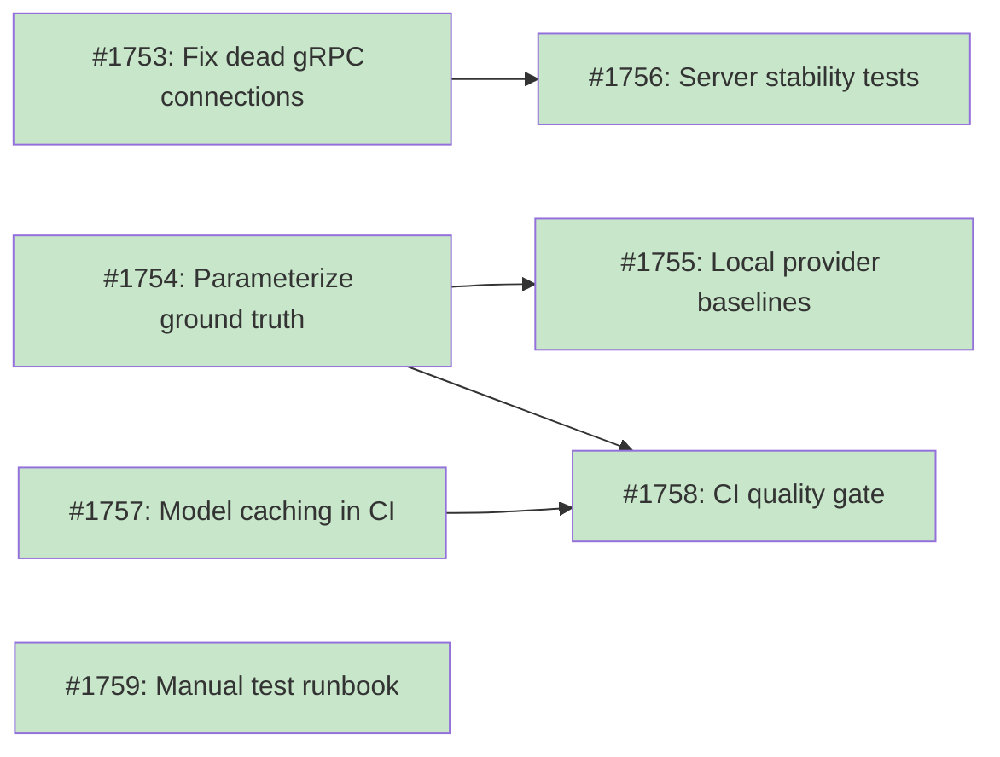

# Design Document: LLM Testing Strategy

## Status

Current

**Source Issue**: [#1738 - Local LLM: server crashes and model quality gaps on complex naming patterns](https://github.com/tsukumogami/tsuku/issues/1738)

## Implementation Issues

### Milestone: [llm-testing-strategy](https://github.com/tsukumogami/tsuku/milestone/88)

| Issue | Dependencies | Tier |
|-------|--------------|------|
| ~~[#1753: fix(llm): invalidate dead gRPC connections on server crash](https://github.com/tsukumogami/tsuku/issues/1753)~~ | ~~None~~ | ~~testable~~ |
| ~~_Fix the `LocalProvider.Complete` error path to close and nil out the cached gRPC connection. Without this, the client caches a dead connection after a server crash and all subsequent requests fail._~~ | | |
| ~~[#1754: test(builders): parameterize ground truth suite for multi-provider support](https://github.com/tsukumogami/tsuku/issues/1754)~~ | ~~None~~ | ~~testable~~ |
| ~~_Refactor `TestLLMGroundTruth` to detect the active provider from env vars, inject via `WithFactory`/`WithHomebrewFactory`, and compare results against per-provider JSON baselines. Adds `-update-baseline` flag and commits the initial Claude baseline._~~ | | |
| ~~[#1755: test(builders): create local provider quality baselines](https://github.com/tsukumogami/tsuku/issues/1755)~~ | ~~[#1754](https://github.com/tsukumogami/tsuku/issues/1754)~~ | ~~simple~~ |
| ~~_Run the parameterized suite from #1754 against the local Qwen model and commit the results as `testdata/llm-quality-baselines/local.json`. Documents known failures like the ast-grep Rust triple case._~~ | | |
| ~~[#1756: test(llm): add server stability tests](https://github.com/tsukumogami/tsuku/issues/1756)~~ | ~~[#1753](https://github.com/tsukumogami/tsuku/issues/1753)~~ | ~~testable~~ |
| ~~_Add `TestSequentialInference` (3-5 requests through a single server) and `TestCrashRecovery` (SIGKILL + reconnection) to exercise workload patterns that short lifecycle tests miss. Depends on the connection fix from #1753._~~ | | |
| ~~[#1757: ci(llm): add model caching for integration tests](https://github.com/tsukumogami/tsuku/issues/1757)~~ | ~~None~~ | ~~testable~~ |
| ~~_Add `actions/cache` for the ~500MB model file across CI runs and a `sharedModelDir(t)` helper to share the model across test functions within a single run. Fixes the pre-existing problem of re-downloading per test function._~~ | | |
| ~~[#1758: ci(llm): add quality gate for prompt and test matrix changes](https://github.com/tsukumogami/tsuku/issues/1758)~~ | ~~[#1754](https://github.com/tsukumogami/tsuku/issues/1754), [#1757](https://github.com/tsukumogami/tsuku/issues/1757)~~ | ~~testable~~ |
| ~~_Add a separate `llm-quality` CI job that runs `TestLLMGroundTruth` with the local provider. Triggers only on changes to prompt templates, test matrix, or baseline files -- keeping routine LLM PRs fast._~~ | | |
| ~~[#1759: docs(llm): write manual test runbook](https://github.com/tsukumogami/tsuku/issues/1759)~~ | ~~None~~ | ~~simple~~ |
| ~~_Write `docs/llm-testing.md` with three procedures: full 10-case benchmark with server restarts, soak test for memory leak detection, and new model validation workflow. Includes results recording templates._~~ | | |

### Dependency Graph



**Legend**: Green = done, Blue = ready, Yellow = blocked, Purple = needs-design, Orange = tracks-design

## Upstream Design Reference

This design builds on [DESIGN-local-llm-runtime.md](DESIGN-local-llm-runtime.md), specifically Phase 5 (Testing and Quality Validation) and the "Production Ready" milestone issues #1641 (quality benchmark suite) and #1644 (E2E integration test).

**Relevant sections:**
- Implementation Approach Phase 5: Testing and Quality Validation
- Milestone 3: Production Ready (issues #1641-#1645)
- Uncertainties: "Quality parity" and "Inference speed" unknowns

## Context and Problem Statement

The local LLM runtime shipped its core functionality through two milestones (Local LLM Foundation and Inference Runtime), covering lifecycle management, hardware detection, model selection, and inference wiring. QA testing with a fresh server restart between each case revealed two categories of failure affecting 2 out of 10 test cases (80% pass rate):

**Server stability failures**: The Rust addon crashes with gRPC transport errors during inference on certain test cases (`fly` at ~589s, `trivy` at ~990s). Both involve extended generation periods before the server process dies, even with clean restarts and 60-second cooldowns between cases. Possible causes include memory growth during long inference (KV cache accumulation), llama.cpp assertion failures, or unhandled context window overflow.

**Model quality regression**: The `ast-grep` test case (Rust-style target triples like `x86_64-unknown-linux-gnu`) previously passed but now consistently times out after the prompt was updated to include pre-inspected archive listings. The 3B Qwen model appears to struggle with the combination of complex triple naming patterns and extra archive context. This case passes with cloud providers.

The existing test infrastructure has solid coverage for unit tests and lifecycle management but critical gaps in two areas:

1. **No local model quality testing.** The ground truth test suite (`TestLLMGroundTruth`) only runs against Claude via `ANTHROPIC_API_KEY`. There's no way to validate that local models produce correct recipes or to detect quality regressions when prompts change.

2. **No server stability testing under realistic workloads.** The integration tests (`lifecycle_integration_test.go`) verify that inference works (returns non-empty content) but don't exercise long-running sessions, sequential multi-case runs, or memory accumulation patterns.

Without testing that catches these failures, changes to prompts, models, or inference parameters can ship regressions that only surface during manual QA. The 20% failure rate on a 10-case benchmark indicates this isn't an edge case.

### Scope

**In scope:**
- Provider-agnostic quality test suite (local, Claude, Gemini)
- Server stability tests for long inference and sequential workloads
- Manual test procedures for validating LLM changes
- Quality regression baselines and detection
- CI integration for tests that can run without GPU hardware

**Out of scope:**
- Fixing the specific crashes from #1738 (separate issue)
- Fixing the ast-grep quality regression (separate issue)
- Connection recovery fix for `LocalProvider` (separate prerequisite issue -- the crash-recovery test depends on this fix but it's a production code change, not test infrastructure)
- GPU-specific testing infrastructure
- Performance optimization
- New model evaluation or selection

## Decision Drivers

- **Catch known failures**: Tests must detect the two failure modes from #1738 (server crashes during long inference, quality regression on complex patterns)
- **Extend existing infrastructure**: The codebase already has mock providers, ground truth recipes, benchmark tooling, and integration test patterns. Build on these rather than creating parallel systems.
- **CI-feasible**: CPU-only inference takes 5-30 seconds per turn. Tests that need the addon must work within CI time budgets (~15 minutes total for LLM tests).
- **Provider-agnostic**: Quality tests should validate any provider, not just local. The ground truth suite should work for Claude, Gemini, and local with the same test cases.
- **Full-stack validation**: Tests should exercise the complete flow (Go -> gRPC -> Rust -> llama.cpp -> response parsing) since the server crashes and quality issues emerge only under end-to-end conditions.
- **Manual testing support**: Some validation (particularly quality assessment on new models or hardware) can't be fully automated. The design should include clear manual test procedures.
- **Regression baselines**: Quality results should be stored as baselines so regressions are detectable across releases, not just within a single test run.

## Considered Options

### Decision 1: Quality Test Architecture

The ground truth test suite (`TestLLMGroundTruth` in `internal/builders/llm_integration_test.go`) validates LLM-generated recipes against hand-authored reference recipes. It currently has 21 test cases covering diverse patterns (Rust triples, capitalized OS names, zip formats, binary renames, multi-binary, Homebrew source builds). But it only works with Claude via `ANTHROPIC_API_KEY`. The coupling is at the factory level -- the test skips when `ANTHROPIC_API_KEY` is unset, and the factory auto-detects providers from environment variables. The builders already support factory injection options -- `WithFactory` for `GitHubReleaseBuilder` and `WithHomebrewFactory` for `HomebrewBuilder` (used in `repair_loop_test.go`). The parameterization path is through constructing a factory with the desired provider and injecting it into both builders.

The question is how to make these tests work across providers (local, Claude, Gemini) without duplicating the test matrix. Related: should quality expectations differ per provider (local models are less capable than Claude on certain patterns), and how should results be tracked for regression detection?

#### Chosen: Provider-Parameterized Ground Truth Suite

Extend `TestLLMGroundTruth` to accept a provider parameter. The test matrix stays the same -- 21 test cases defined in `llm-test-matrix.json` -- but tests run against whichever provider is configured. Provider selection uses environment variables (`ANTHROPIC_API_KEY`, `GOOGLE_API_KEY`, or `TSUKU_LLM_BINARY` for local), matching the existing convention.

Each provider gets its own expected-pass set stored in `testdata/llm-quality-baselines/`. For example, local might be expected to pass 16/18 GitHub cases (allowing `ast-grep` and `liberica` to fail), while Claude is expected to pass 18/18. When a test that was previously passing starts failing, the test reports a regression. When a previously-failing test starts passing, the baseline can be updated.

The baseline format is a JSON file per provider:
```json
{
  "provider": "local",
  "model": "qwen2.5-3b-instruct-q4",
  "baselines": {
    "llm_github_stern_baseline": "pass",
    "llm_github_ast-grep_rust_triple": "fail",
    ...
  }
}
```

Provider detection uses the existing env-var skip pattern: the test checks for `TSUKU_LLM_BINARY`, `ANTHROPIC_API_KEY`, or `GOOGLE_API_KEY` in priority order, and skips if none are set. No new build tags are needed -- the `integration` tag already gates tests requiring the addon binary, and the env-var check handles provider selection. Cloud provider tests run on-demand when the relevant API key is set.

#### Alternatives Considered

**Separate test suites per provider**: Create independent `TestLocalGroundTruth`, `TestClaudeGroundTruth`, `TestGeminiGroundTruth` functions with potentially different test cases. Rejected because it duplicates the matrix, makes it hard to compare providers, and means adding a new test case requires updating three places.

**Single pass/fail threshold**: Rather than per-test baselines, set a percentage threshold (e.g., "local must pass 80%"). Rejected because it hides which specific tests regressed. A 5% drop could mean one hard case broke (acceptable) or five easy cases broke (serious problem).

**Snapshot-based output comparison**: Store full recipe output as golden files and diff against them. Rejected because LLM output is non-deterministic -- the exact text varies between runs even at temperature 0, and minor formatting differences would cause false failures.

### Decision 2: Server Stability Testing

The existing integration tests start the addon, send one or two inference requests, and verify the server responds correctly. The crashes from #1738 only appear after extended generation (589-990 seconds). This suggests memory growth, context window overflow, or resource exhaustion that short tests don't trigger.

The challenge is that reproducing these failures requires running inference long enough for them to manifest, which conflicts with CI time budgets. A single test case that takes 10 minutes is impractical in a CI pipeline, but running only short tests misses the exact class of bugs that shipped.

#### Chosen: Layered Stability Tests (Short CI + Long Manual)

Split stability testing into two categories:

**CI stability tests** (build tag `integration`, ~5 minutes): Run a sequence of 3-5 short inference requests through a single server instance without restarting between them. This catches connection state accumulation, memory leaks in the gRPC layer, and KV cache growth across requests. Each request uses a different test case from the ground truth matrix. The server starts once and stays alive for the full sequence.

Add a specific test for connection recovery: start the server, send a request, kill the server process (SIGKILL, not SIGTERM -- simulating a crash), verify the Go client detects the failure, and verify a subsequent `Complete()` call restarts the server and succeeds. This catches the "no reconnection logic" gap where `LocalProvider` caches a dead `p.client`.

**Manual stability tests** (documented procedure, ~30-60 minutes): A runbook in `docs/llm-testing.md` for running the full 10-case benchmark with fresh server restarts between cases, matching the QA conditions that found #1738. This includes specific steps for monitoring memory usage, checking for gRPC errors, and recording results in a structured format.

The manual test also covers a "soak test" scenario: run 20+ sequential inference requests through a single warm server (simulating batch usage) while monitoring memory via `/proc/<pid>/status` (VmRSS) or `ps`. If memory grows linearly with request count, there's a leak.

#### Alternatives Considered

**Full-length crash reproduction in CI**: Run the exact scenarios that triggered crashes (fly, trivy) in CI with 10+ minute timeouts. Rejected because CI time budgets can't accommodate 20+ minutes per test, and the crashes may be hardware-dependent (CPU-only on 33.5GB RAM).

**Rust-side stress tests**: Add `cargo test` integration tests that exercise llama.cpp directly in long-running scenarios, bypassing gRPC. Rejected because the crashes in #1738 happen through the full stack (Go -> gRPC -> Rust -> llama.cpp), and Rust-only tests would miss gRPC transport issues. Also, there are currently zero Rust integration tests, and the infrastructure cost of adding them is high.

**Memory limit enforcement**: Use cgroups or ulimit to cap the server's memory and detect OOM conditions. Rejected as too environment-specific for CI and doesn't help diagnose the root cause. Better as a manual investigation technique documented in the runbook.

**Timeout-bounded crash detection in CI**: Run the crash-prone test cases (fly, trivy) with shorter timeouts (e.g., 120 seconds) to catch crashes that happen early in generation. This wouldn't catch the 589s/990s crashes but might catch crashes at shorter time horizons. Rejected because it's speculative -- we don't know if the crashes have a shorter-timeout analog, and adding 4+ minutes of "maybe-crash" tests to CI isn't a good trade-off. If future investigation reveals shorter reproduction conditions, this could be revisited.

**Automated memory monitoring**: Instrument the CI stability tests to read `/proc/<pid>/status` (VmRSS) before and after each inference request and fail if memory growth exceeds a threshold. Rejected for CI because VmRSS behavior is environment-dependent (kernel memory management, model mmap usage) and thresholds would be fragile. Included in the manual runbook instead where a human can interpret the growth pattern.

### Decision 3: CI Integration Strategy

The existing CI runs LLM integration tests only when `tsuku-llm/**` or `internal/llm/**` files change, using `dorny/paths-filter` change detection. These tests build the Rust addon and run `go test -tags=integration`. The addon build takes 3-5 minutes, and the current integration tests add another 2-3 minutes.

Adding quality tests that run actual inference in CI increases both time and flakiness risk. CPU-only inference is 5-30 seconds per turn, and a 5-case quality test could take 5-10 minutes. Combined with the addon build, the full LLM CI job could reach 15-20 minutes.

#### Chosen: Tiered CI with Separate Quality Gate

Keep the existing `llm-integration` CI job fast (addon build + lifecycle tests, ~8 minutes total). Add a separate `llm-quality` CI job that runs the provider-parameterized ground truth suite with the local provider. The job sets `TSUKU_LLM_BINARY` to enable local provider detection and only triggers when prompt templates, model manifest, or ground truth recipes change -- not on every LLM code change.

The quality job is opt-in for PRs that don't touch inference code. It's mandatory for PRs that modify:
- `internal/builders/prompts/` (prompt templates)
- `tsuku-llm/src/main.rs` (prompt building, tool call parsing)
- `internal/builders/llm-test-matrix.json` (test matrix)
- `testdata/llm-quality-baselines/` (baseline files)

This separation means routine Rust addon changes (hardware detection, model download) still get fast CI, while prompt or quality-affecting changes get the full quality gate.

#### Alternatives Considered

**Run quality tests in every LLM CI job**: Always run the ground truth suite as part of the integration test job. Rejected because it would add 10+ minutes to every LLM PR, even those that only touch lifecycle code or hardware detection.

**Nightly quality runs only**: Run quality tests on a nightly schedule rather than per-PR. Rejected because it delays regression detection -- a broken prompt would merge to main and only be caught overnight. The whole point is catching regressions before merge.

**Mock-based quality approximation**: Use recorded LLM responses (golden files) in CI instead of running real inference. Rejected because it doesn't test the actual model -- a prompt change that breaks real inference would pass with recorded responses. This defeats the purpose of quality testing.

### Uncertainties

- **CI inference time stability**: CPU-only inference time varies by hardware. CI runners may have different performance characteristics than development machines. The 5-30 second range per turn is based on dev hardware.
- **Model download in CI**: The quality tests require the 0.5B model (~500MB). CI runners may have bandwidth constraints or HuggingFace rate limits. Model caching mitigates repeat downloads, and the existing `skipIfModelCDNUnavailable` pattern handles unreachable CDN gracefully.
- **Non-determinism**: Even at temperature 0 with greedy sampling, llama.cpp inference can produce slightly different outputs across platforms due to floating-point precision differences. Baseline expectations may need platform-specific adjustments.
- **Crash root cause**: The stability tests are designed to detect crashes, not diagnose them. The root cause of the fly/trivy crashes may be in llama.cpp (upstream), the Rust wrapper, or the gRPC layer. The tests tell us *if* something breaks, not *why*.

## Decision Outcome

**Chosen: Provider-Parameterized Quality Suite + Layered Stability Tests + Tiered CI**

### Summary

The test strategy has three layers. First, the existing ground truth suite (`TestLLMGroundTruth`) gets extended to accept a provider parameter so the same 21 test cases run against local, Claude, or Gemini. Each provider has its own baseline expectations stored as JSON in `testdata/llm-quality-baselines/` -- local is expected to fail on a few hard patterns (Rust triples, multi-binary), while Claude should pass all. Regressions are detected when a previously-passing test starts failing. The test reports both pass/fail results and regression status against the baseline.

Second, stability testing splits into CI-feasible and manual categories. CI gets a sequential inference test that sends 3-5 requests through a single server instance (catching memory accumulation and connection state issues) plus a crash-recovery test that kills the server and verifies the Go client reconnects. Manual testing follows a documented runbook for the full 10-case benchmark with server restarts and memory monitoring -- this catches the long-running inference crashes from #1738.

Third, CI jobs split into two: the existing fast `llm-integration` job (~8 minutes, lifecycle tests) and a new `llm-quality` job that runs the ground truth suite with the local provider. The quality job only triggers when prompt templates, model manifest, or test baselines change, keeping routine LLM PRs fast. Both jobs require the Rust addon build.

The crash-recovery stability test depends on a prerequisite fix to `LocalProvider` (invalidate dead gRPC connections on error). This fix should be a separate issue since it's a production code change, not test infrastructure.

### Rationale

Provider-parameterized tests avoid duplication while respecting capability differences between providers. Per-test baselines give precise regression visibility rather than hiding failures behind aggregate thresholds. Layered stability testing acknowledges that some failures only manifest under conditions too expensive for CI, while still catching a useful subset automatically. The tiered CI keeps fast feedback for most changes while adding a quality gate for prompt changes that could break inference. Together, these decisions create a test infrastructure that would have caught both failure categories from #1738: the quality regression (baseline comparison) and the server crashes (sequential inference + manual soak testing).

### Trade-offs Accepted

- **Per-provider baselines require maintenance.** When test cases are added or models change, baselines need updating. Acceptable because baseline updates are explicit -- you have to acknowledge that a test's expected behavior changed.
- **Manual stability testing has no enforcement.** The runbook exists but nothing forces it to run before releases. Acceptable because automating 30-minute tests isn't practical, and documenting the procedure is better than ad-hoc QA.
- **CI quality tests use the smallest model (0.5B) as a canary, not a full quality check.** To keep CI time reasonable, quality tests use the 0.5B model, not 3B. A prompt change that causes a subtle regression on 3B (like the ast-grep case) may cause an entirely different failure mode on 0.5B, or not fail at all. CI catches gross prompt breakage; model-size-specific quality issues require manual testing with the target model.
- **Prerequisite dependency on connection recovery fix.** The `TestCrashRecovery` stability test can't work until a separate issue fixes `LocalProvider` to invalidate dead gRPC connections on error. This creates a dependency between this design and a production code fix.

## Solution Architecture

### Overview

The test infrastructure adds three components to the existing test system: a provider-parameterized quality test runner, stability test scenarios, and a tiered CI configuration. All three build on existing patterns -- the ground truth test matrix, the integration test framework with build tags, and the change-detection CI pipeline.

```
Existing                              New
┌───────────────────────┐             ┌───────────────────────┐
│ TestLLMGroundTruth    │             │ TestLLMGroundTruth    │
│ (Claude only)         │  ───────>   │ (any provider)        │
│ 21 test cases         │             │ + baseline comparison │
│ llm-test-matrix.json  │             │ + regression reports  │
└───────────────────────┘             └───────────────────────┘

┌───────────────────────┐             ┌───────────────────────┐
│ lifecycle_integration │             │ stability_test.go     │
│ (start, health, stop) │  ───────>   │ (sequential inference │
│                       │             │  + crash recovery)    │
└───────────────────────┘             └───────────────────────┘

┌───────────────────────┐             ┌───────────────────────┐
│ CI: llm-integration   │             │ CI: llm-integration   │
│ (lifecycle tests)     │  ───────>   │ + llm-quality         │
│                       │             │   (ground truth suite) │
└───────────────────────┘             └───────────────────────┘
```

### Components

**Provider-Parameterized Quality Test** (`internal/builders/llm_integration_test.go`):

The existing `TestLLMGroundTruth` function gets refactored to determine the active provider from environment variables and inject it via the builder factory options (`WithFactory` for GitHub, `WithHomebrewFactory` for Homebrew). The provider is detected by checking env vars in priority order: `TSUKU_LLM_BINARY` (local), `ANTHROPIC_API_KEY` (Claude), `GOOGLE_API_KEY` (Gemini). The detected provider is wrapped in a `Factory` via `NewFactoryWithProviders` before injection.

The test matrix (`llm-test-matrix.json`) stays unchanged. After all tests run, results are compared against the baseline for the active provider, and regressions (previously-passing tests that now fail) are reported. A minimum pass-rate sanity check (e.g., >50% for any provider) rejects baseline files where nearly everything is marked as expected failure, preventing baseline poisoning via PR.

**Quality Baselines** (`testdata/llm-quality-baselines/`):

One JSON file per provider. Created by running the test suite with `-update-baseline` flag (following Go's golden file convention) and recording results. Updated by re-running with the flag when expectations change (new model, improved prompt, known regression accepted).

```
testdata/llm-quality-baselines/
├── local.json         # Expected results for local/Qwen models
├── claude.json        # Expected results for Claude
└── gemini.json        # Expected results for Gemini
```

**Model Caching** (CI workflow + test helper):

The existing `llm-integration` CI job and each individual test function download the 0.5B model (~500MB) from scratch every time -- there's no caching at either level. This is wasteful and slow.

Two fixes: (1) an `actions/cache` step in the CI workflow caches the model directory keyed by the model's SHA256 checksum from the addon manifest, eliminating repeat downloads across CI runs; (2) a `sharedModelDir(t)` test helper provides a single model directory shared across test functions within a run, with each test symlinking `$TSUKU_HOME/models/` to it. Tests keep isolated `TSUKU_HOME` directories for sockets and lock files, but share the model to avoid downloading it per-test-function. Both the existing `llm-integration` job and the new `llm-quality` job use this caching.

**Stability Tests** (`internal/llm/stability_test.go`, build tag `integration`):

Two test functions:

1. `TestSequentialInference`: Start server once, send 3-5 complete inference requests sequentially (using different ground truth test cases), verify each succeeds. This exercises KV cache reuse, memory accumulation, and connection state across requests.

2. `TestCrashRecovery`: Start server, send one successful request, kill the server with SIGKILL, attempt another request (expect transient failure), wait for auto-recovery, verify the next request succeeds. This validates that `LocalProvider` invalidates dead connections and `ServerLifecycle` restarts the daemon.

**Manual Test Runbook** (`docs/llm-testing.md`):

A structured document with three test procedures:

1. *Full benchmark*: Run the 10-case benchmark from #1738 with fresh server restarts, record results in a table.
2. *Soak test*: Run 20+ sequential requests through a warm server, monitor memory growth.
3. *New model validation*: Procedure for evaluating a model change (run full ground truth suite, compare against previous baselines, document quality differences).

**Prerequisites**:

The crash-recovery stability test (`TestCrashRecovery`) depends on a fix to `LocalProvider` that invalidates `p.conn` and `p.client` on gRPC errors. This is a production code change that should be filed as a separate issue and merged before the stability tests can work. Without it, the Go client caches a dead connection after a server crash and all subsequent requests fail.

### Key Interfaces

No new public interfaces are introduced. The test infrastructure uses existing interfaces:

- `Provider` interface (unchanged) -- used by the factory to route to local/Claude/Gemini
- `WithFactory` / `WithHomebrewFactory` builder options (existing) -- used to inject the test provider
- `NewFactoryWithProviders` (existing) -- wraps a detected provider into a Factory for builder injection
- `integration` build tag (existing) -- gates tests requiring the addon binary

The test decomposes into provider detection, baseline loading, and regression reporting, but these are internal test helpers whose signatures are implementation details.

### Data Flow

**CI quality test flow:**

1. CI detects changes in prompt templates or test matrix
2. `llm-quality` job triggers: build Rust addon, restore model cache, set `TSUKU_LLM_BINARY` env var
3. `go test -tags=integration ./internal/builders/...` runs (model cache hit skips ~500MB download)
4. `TestLLMGroundTruth` detects `TSUKU_LLM_BINARY` env var, uses local provider
5. Each test case generates a recipe and compares against ground truth
6. After all cases: load `testdata/llm-quality-baselines/local.json`
7. Report regressions (previously-passing tests that now fail)
8. Test fails if any regressions are detected

**Manual stability test flow:**

1. Developer builds addon: `cd tsuku-llm && cargo build --release`
2. Runs benchmark: `go run ./cmd/benchmark --corpus testdata/benchmark-repos.txt --limit 10`
3. Between each case, monitors server process for memory growth
4. Records results in `docs/llm-testing.md` results table
5. Compares against previous results for regression detection

## Implementation Approach

**Prerequisite**: The `TestCrashRecovery` stability test depends on a connection recovery fix in `LocalProvider` (invalidate dead gRPC connections on error). This should be filed and merged as a separate issue before Phase 3.

### Phase 1: Provider-Parameterized Ground Truth Suite

Refactor `TestLLMGroundTruth` to detect the active provider from environment variables (priority: `TSUKU_LLM_BINARY` > `ANTHROPIC_API_KEY` > `GOOGLE_API_KEY`), wrap it in a Factory via `NewFactoryWithProviders`, and inject via `WithFactory`/`WithHomebrewFactory`. Add baseline loading and regression reporting. Add `-update-baseline` flag for creating/updating baseline files. Create initial baseline for Claude (run full suite once, record results).

Files: `internal/builders/llm_integration_test.go`, `testdata/llm-quality-baselines/claude.json`

### Phase 2: Local Provider Quality Baselines

Run the provider-parameterized suite with the local provider on dev hardware (requires `integration` build tag for addon binary access). Record results as `testdata/llm-quality-baselines/local.json` using `-update-baseline`. Document known failures (ast-grep Rust triples, any other failing cases).

Files: `testdata/llm-quality-baselines/local.json`

### Phase 3: Stability Tests

Add `TestSequentialInference` and `TestCrashRecovery` to `internal/llm/stability_test.go` with the `integration` build tag. These use the existing daemon management patterns from `lifecycle_integration_test.go`. `TestCrashRecovery` is gated on the prerequisite connection recovery fix.

Files: `internal/llm/stability_test.go`

### Phase 4: Model Caching in CI

The existing `llm-integration` job downloads the 0.5B model (~500MB) from HuggingFace on every run with no caching. Worse, each test function in `lifecycle_integration_test.go` uses a fresh `t.TempDir()` for `TSUKU_HOME`, so the model downloads multiple times within a single CI run.

Fix both issues:

1. **CI workflow**: Add an `actions/cache` step for the model file, keyed by the SHA256 checksum from the addon manifest. The cache path is a shared directory that tests can symlink or copy from. This eliminates repeat downloads across CI runs.

2. **Test helper**: Add a `sharedModelDir(t)` helper that returns a shared directory for model storage across test functions within a single run. Each test still gets its own `TSUKU_HOME` (for socket/lock isolation), but the `models/` subdirectory is symlinked to the shared location. This prevents re-downloading the model for every test function.

Apply this to both the existing `llm-integration` job and the new `llm-quality` job.

Files: `.github/workflows/test.yml`, `internal/llm/lifecycle_integration_test.go`

### Phase 5: CI Quality Gate

Add `llm-quality` job to `.github/workflows/test.yml` with change-detection triggers for prompt templates, test matrix, and baseline files. The job builds the addon, sets `TSUKU_LLM_BINARY`, and runs `go test -tags=integration ./internal/builders/...` with a generous timeout. Uses the same model caching from Phase 4.

Files: `.github/workflows/test.yml`

### Phase 6: Manual Test Runbook

Write `docs/llm-testing.md` with procedures for full benchmark, soak test, and new model validation. Include result recording templates and memory monitoring instructions.

Files: `docs/llm-testing.md`

## Security Considerations

### Download Verification

The quality and stability tests download the 0.5B Qwen model from HuggingFace in CI. This uses the same SHA256 checksum verification as production downloads -- the model manifest embedded in the addon binary contains the expected checksum. No new download paths are introduced.

The `skipIfModelCDNUnavailable` pattern (already used in `lifecycle_integration_test.go`) gracefully handles environments where HuggingFace is unreachable, preventing CI from failing due to network issues.

### Execution Isolation

Tests run with the same isolation as production: the addon communicates via Unix domain socket with 0600 permissions, runs as the CI user, and has no elevated privileges. The SIGKILL crash-recovery test kills the addon process, which leaves a stale socket file. The existing stale-socket cleanup in `ServerLifecycle.EnsureRunning()` handles this case -- it's already tested in `lifecycle_integration_test.go`.

No new filesystem paths or permissions are introduced. Test artifacts (baseline files, runbook) are read-only static files.

### Supply Chain Risks

The test infrastructure doesn't introduce new supply chain dependencies. It uses the same model files, the same addon binary, and the same gRPC protocol as production. The baseline files in `testdata/llm-quality-baselines/` are JSON data files with no executable content.

The CI quality job downloads a model during the test run. If CI is compromised and serves a malicious model, the SHA256 verification (which checks against the manifest embedded in the addon binary, not a remote manifest) would reject it. This is the same trust model as production.

### User Data Exposure

Tests use public GitHub repositories (the test matrix references `stern/stern`, `ast-grep/ast-grep`, etc.) and ground truth recipes already committed to the repository. No user data, API keys, or private repository information is used in the test infrastructure.

CI environment variables (`ANTHROPIC_API_KEY`, `GOOGLE_API_KEY`) are handled as GitHub Actions secrets, matching existing practice. The local provider tests use `TSUKU_LLM_BINARY` which points to a local file path, not a secret.

### Mitigations Summary

| Risk | Mitigation | Residual Risk |
|------|------------|---------------|
| Malicious model in CI | SHA256 verification against embedded manifest | None (same as production) |
| Stale socket from SIGKILL test | Existing stale-socket cleanup in ServerLifecycle | None (already tested) |
| API key exposure in CI logs | GitHub Actions secret masking (existing practice) | None |
| Test flakiness from non-determinism | Per-provider baselines allow known failures; `skipIfModelCDNUnavailable` for network issues | Platform-specific floating-point differences may cause intermittent failures |
| Baseline poisoning via PR | Minimum pass-rate sanity check (>50%) rejects baselines where most tests are marked as expected failures; code review on baseline changes | Social engineering bypassing both checks |

## Consequences

### Positive

- **Catches quality regressions before merge**: Prompt changes that break local inference are caught by the CI quality gate, preventing regressions like the ast-grep case from shipping.
- **Provider comparison**: Running the same test matrix against multiple providers makes quality differences visible and measurable, directly addressing the "quality parity" uncertainty from the upstream design.
- **Regression precision**: Per-test baselines show exactly which cases regressed, not just an aggregate pass rate. This makes triage faster.
- **Structured manual testing**: The runbook replaces ad-hoc QA with a repeatable procedure, making it possible for anyone to run the stability tests that found #1738.
- **Extends existing infrastructure**: No new test frameworks, no new CI providers, no new dependencies. The quality tests are an extension of `TestLLMGroundTruth`, the stability tests follow `lifecycle_integration_test.go` patterns, and the CI job reuses the existing addon build step.
- **Faster existing CI**: Model caching fixes a pre-existing problem where the `llm-integration` job downloads the 0.5B model (~500MB) from scratch on every run and even re-downloads within a single run across test functions. Cached runs save minutes of download time.

### Negative

- **CI time increase**: The `llm-quality` job adds ~10-15 minutes when triggered. Combined with the addon build, prompt-affecting PRs face ~20 minutes of CI. Model caching reduces this on repeat runs (cache hit avoids ~500MB download).
- **Baseline maintenance**: Provider baselines need updating when models change, prompts improve, or test cases are added. Each update requires a deliberate decision about expected behavior.
- **Manual test gap**: The long-running stability tests that would catch the fly/trivy crashes require manual execution. There's no CI enforcement.
- **0.5B canary limitation**: CI quality tests use the smallest model, which may not reproduce issues specific to 3B inference (different context window usage, different token generation patterns).

### Mitigations

- **CI time**: The quality job only triggers on prompt/matrix changes, not all LLM PRs. Most LLM PRs keep the fast ~8-minute CI.
- **Baseline maintenance**: The `reportRegressions` function outputs clear diffs so baseline updates are straightforward. Improvements (previously-failing tests that now pass) are also flagged.
- **Manual test gap**: The runbook includes a results template so previous run results are preserved and comparable across releases.
- **0.5B canary**: The manual runbook includes 3B testing procedures for pre-release validation.
