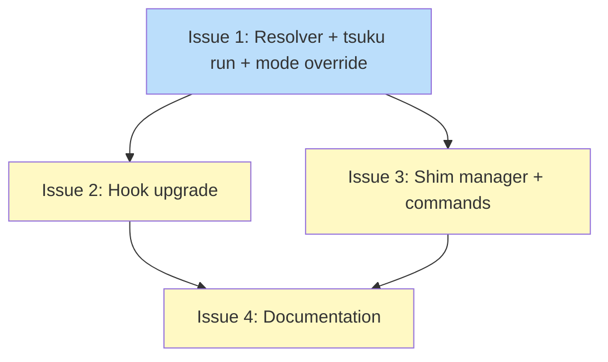

# DESIGN: Project-Aware Exec Wrapper

## Status

Current

## Implementation Issues

Implementation tracked in [PLAN: Project-Aware Exec](../plans/PLAN-project-aware-exec.md).

### Dependency Graph



**Legend**: Green = done, Blue = ready, Yellow = blocked

## Upstream Design Reference

Parent: [DESIGN: Shell Integration Building Blocks](DESIGN-shell-integration-building-blocks.md)
Block 6 -- convergence point between Track A (auto-install) and Track B (project config). Depends on Block 3 (#1679, auto-install, implemented), Block 4 (#1680, project config, implemented), and uses the binary index from Block 1 (#1677, implemented).

## Context and Problem Statement

The vision from the parent design is: a developer types `rg .foo data.json` in a project directory. They don't have `rg` installed. The project's `.tsuku.toml` declares `ripgrep = "14.1.0"`. Tsuku intercepts the failed command, sees the project pin, installs ripgrep 14.1.0 silently, and runs the command. No `tsuku run` prefix, no confirmation prompt.

Today the pieces exist but aren't connected:

- The **command-not-found hook** (Block 2) catches `rg` and calls `tsuku suggest rg` -- but it only suggests, it doesn't auto-install with the project version
- The **binary index** (Block 1) maps `rg` -> recipe `ripgrep` -- but the auto-install flow doesn't check project config
- **`tsuku run`** (Block 3) installs and execs -- but passes `nil` for the `ProjectVersionResolver`, ignoring `.tsuku.toml`
- **`.tsuku.toml`** (Block 4) declares `ripgrep = "14.1.0"` -- but nothing reads it at command invocation time

The auto-install flow (`autoinstall.Runner.Run`) already accepts a `ProjectVersionResolver` interface designed for this integration. The command-not-found hook already calls `tsuku suggest`, which could call `tsuku run` instead when a project config declares the tool. Block 6 connects these pieces.

### The Consent Model

The key insight: `.tsuku.toml` IS the consent. When a team checks in a project config declaring their tools, they're saying "these tools should be available in this project." That's sufficient authorization to install them without prompting. The confirmation prompt that `tsuku run` uses for ad-hoc installs is unnecessary when the project config explicitly declares the tool.

This means:
- **Command in `.tsuku.toml`**: install the pinned version silently, then exec
- **Command NOT in `.tsuku.toml`**: fall back to normal behavior (suggest or confirm, depending on mode)

### Scope

**In scope:**
- `ProjectVersionResolver` implementation using `LoadProjectConfig` + binary index
- Wiring the resolver into `tsuku run` and the command-not-found path
- Auto-install without confirmation when `.tsuku.toml` declares the tool
- Optional shim generation for CI/scripts without hooks
- CI usage patterns

**Out of scope:**
- Changes to the binary index (Block 1)
- LLM recipe discovery

## Decision Drivers

- **Seamless experience**: Users type commands, they work. No tsuku prefix, no prompts for project-declared tools.
- **Project config is consent**: `.tsuku.toml` is deliberate -- no additional confirmation needed for declared tools
- **Works everywhere**: Interactive shells (via hooks), scripts (via shims), CI (via shims or `tsuku run`)
- **Performance**: Cached tool lookup must complete in under 50ms
- **Composability**: Leverage existing `ProjectVersionResolver`, `LoadProjectConfig`, binary index, and consent model
- **Fallback safety**: Tools NOT in `.tsuku.toml` still go through the normal consent flow

## Considered Options

### Decision 1: How to Wire Project Awareness into the Auto-Install Flow

The `autoinstall.Runner.Run` method accepts a `ProjectVersionResolver` interface. Today `tsuku run` passes `nil`. The command-not-found hook calls `tsuku suggest` (print-only). Block 6 needs to connect `.tsuku.toml` to both paths.

A complication: `.tsuku.toml` declares tools by recipe name (`ripgrep = "14.1.0"`), but users type command names (`rg`). The binary index bridges this gap.

Key assumptions:
- `.tsuku.toml` declaring a tool is sufficient consent for auto-install
- The binary index maps command -> recipe reliably
- `tsuku run` has no established user base (Block 3 was recently built)

#### Chosen: Resolver + Auto Mode Override for Project-Declared Tools

Wire a `ProjectVersionResolver` into `tsuku run` using `LoadProjectConfig` + binary index `LookupFunc`. When the resolver finds a project-pinned version, `Runner.Run` uses it. The critical addition: when the resolver returns a version (tool is in `.tsuku.toml`), the consent mode is overridden to `auto` regardless of the user's configured mode. The project config is the consent.

For the command-not-found path: change the hook behavior so that when `.tsuku.toml` declares the tool, the hook calls `tsuku run <command> [args]` instead of `tsuku suggest <command>`. Since `tsuku run` now has the resolver and auto-mode override, this installs the pinned version silently and execs the command.

The flow for a project-declared tool:
1. User types `rg .foo data.json`
2. Shell's command-not-found hook fires
3. Hook calls `tsuku run rg .foo data.json` (instead of `tsuku suggest rg`)
4. `tsuku run` loads `.tsuku.toml`, constructs resolver
5. Resolver maps `rg` -> `ripgrep` (via index) -> `14.1.0` (via config)
6. Runner.Run gets version from resolver, overrides mode to `auto`
7. Installs ripgrep 14.1.0 silently, execs `rg .foo data.json`

The flow for a tool NOT in `.tsuku.toml`:
1. User types `jq .foo data.json`
2. Hook fires, calls `tsuku run jq .foo data.json`
3. Resolver returns `!ok` (jq not in project config)
4. Runner.Run falls back to normal mode (suggest/confirm/auto per user setting)
5. Behavior identical to today

#### Alternatives Considered

**New `tsuku exec` command**: Separate command for project-aware execution. Rejected because `tsuku run` was built as Block 3 specifically for auto-install and has no established user base. A separate command adds cognitive overhead without protecting anyone.

**Always auto-install on command-not-found**: Skip the resolver check and auto-install any missing command. Rejected because installing arbitrary tools without consent is dangerous. The `.tsuku.toml` check provides a trust boundary.

**Project awareness without hook changes**: Only wire the resolver into `tsuku run`, don't change command-not-found behavior. Rejected because it doesn't deliver the seamless experience -- users would still need the `tsuku run` prefix.

### Decision 2: Shim Architecture

Shims provide the seamless experience in contexts without shell hooks: CI pipelines, Makefiles, shell scripts. A shim for `go` in `$TSUKU_HOME/bin/` means `go build` triggers the same project-aware flow.

#### Chosen: Explicit Per-Tool Shell Script Shims

Users create shims via `tsuku shim install <tool>`. Each shim is a static script:

```sh
#!/bin/sh
exec tsuku run "$(basename "$0")" -- "$@"
```

Commands:
- `tsuku shim install <tool>` -- creates shims for all binaries the recipe provides
- `tsuku shim uninstall <tool>` -- removes shims (content-based identification)
- `tsuku shim list` -- lists installed shims

Shims are static -- version resolution happens at runtime in `tsuku run`. No regeneration needed.

PATH precedence:
1. Project-specific tool bins (shell activation) -- real binaries win
2. `$TSUKU_HOME/bin/` (shims) -- fire when activation isn't available
3. `$TSUKU_HOME/tools/current/` (global symlinks)
4. System PATH

When shell activation is active, real binaries take precedence and shims never fire. When activation isn't available (CI), shims fire and `tsuku run` handles everything.

#### Alternatives Considered

**Auto-shim all installed tools**: Rejected -- conflicts with `tools/current/` and intercepts commands the user didn't ask to shim.

**Project-scoped auto-shims**: Rejected -- lifecycle tracking complexity, race conditions between projects, doesn't help CI.

**Compiled multi-call binary**: Rejected for now -- saves ~10ms but adds build complexity. Can optimize later.

## Decision Outcome

**Chosen: Project-config-as-consent auto-install via resolver + command-not-found hook upgrade + explicit shims**

### Summary

When a developer types `rg .foo data.json` in a project with `.tsuku.toml` declaring `ripgrep = "14.1.0"`, the command just works. The command-not-found hook calls `tsuku run`, which uses the new `ProjectVersionResolver` to find the project pin, overrides the consent mode to `auto` (project config IS consent), installs ripgrep 14.1.0 silently, and execs the command.

The resolver is a thin struct (~30-50 lines) connecting `LoadProjectConfig` and the binary index's `LookupFunc`. It maps command -> recipe (via index) -> version (via project config). When the tool isn't in `.tsuku.toml`, the resolver returns `!ok` and the normal consent flow applies.

The command-not-found hook changes from calling `tsuku suggest` to calling `tsuku run` -- but only when `.tsuku.toml` declares the tool. For undeclared tools, the hook behavior depends on the user's configured auto-install mode (suggest/confirm/auto).

Optional shims (`tsuku shim install <tool>`) provide the same experience in CI and scripts. A shim is `exec tsuku run "$(basename "$0")" -- "$@"` -- static, no regeneration.

Three contexts, one experience:
- **Interactive shell with hooks**: command-not-found -> `tsuku run` -> resolver -> auto-install
- **Interactive shell without hooks**: `tsuku run go build` -> resolver -> auto-install
- **CI/scripts with shims**: `go build` -> shim -> `tsuku run` -> resolver -> auto-install

### Rationale

The project config is the consent mechanism. When a team checks `.tsuku.toml` into their repo declaring `ripgrep = "14.1.0"`, they're authorizing that tool at that version. Prompting the developer for confirmation on top of that is friction without value -- the decision was already made.

The hook upgrade (suggest -> run) is what delivers the seamless experience. Without it, users would need the `tsuku run` prefix, which defeats the purpose of shell integration.

Shims extend the same experience to hook-free contexts. Static shims keep the system simple -- all intelligence lives in `tsuku run` at runtime.

### Trade-offs Accepted

- **Auto-install in cloned repos**: Cloning a repo with `.tsuku.toml` and typing a declared command auto-installs it. This is intentional -- the project config is consent. Users concerned about untrusted repos can set `auto_install_mode = suggest` which the resolver won't override (only project-declared tools get the override).
- **Binary index dependency**: The resolver needs the index built. Clear error message on cold start.
- **Command-not-found hook change**: Existing hook users get upgraded behavior. This is additive (run instead of suggest for project tools) not breaking.

## Solution Architecture

### Overview

Block 6 adds a `ProjectVersionResolver` implementation, modifies `tsuku run` to use it, upgrades the command-not-found hooks to call `tsuku run` for project-declared tools, and adds a shim manager.

### Components

```
┌────────────────────────────────────────────────────────────────┐
│                       User Shell                               │
│                                                                │
│  User types: rg .foo data.json                                 │
│       │                                                        │
│       ▼                                                        │
│  command_not_found_handle                                      │
│       │                                                        │
│       ├─ .tsuku.toml declares rg's recipe? ──yes──┐            │
│       │                                           ▼            │
│       │                                   tsuku run rg ...     │
│       │                                   (auto-install)       │
│       │                                                        │
│       └─ no ──────────────────────────────┐                    │
│                                           ▼                    │
│                                   tsuku suggest rg             │
│                                   (existing behavior)          │
└────────────────────────────────────────────────────────────────┘
            │
            ▼
┌────────────────────────────────────────────────────────────────┐
│  tsuku run (cmd_run.go, modified)                              │
│    │                                                           │
│    ├─ LoadProjectConfig(cwd) -> ConfigResult                   │
│    ├─ NewResolver(config, index.Lookup) -> resolver            │
│    ├─ Runner.Run(ctx, cmd, args, mode, resolver)               │
│    │    │                                                      │
│    │    ├─ resolver.ProjectVersionFor("rg")                    │
│    │    │    ├─ index.Lookup("rg") -> recipe "ripgrep"         │
│    │    │    └─ config.Tools["ripgrep"] -> "14.1.0"            │
│    │    │                                                      │
│    │    ├─ version found in project config -> mode = auto      │
│    │    ├─ install ripgrep@14.1.0 if needed                    │
│    │    └─ syscall.Exec rg .foo data.json                      │
│    │                                                           │
└────────────────────────────────────────────────────────────────┘
```

### Key Interfaces

```go
// internal/project/resolver.go

type Resolver struct {
    config *ConfigResult
    lookup autoinstall.LookupFunc
}

func NewResolver(config *ConfigResult, lookup autoinstall.LookupFunc) autoinstall.ProjectVersionResolver

// ProjectVersionFor maps command -> recipe (via index) -> version (via config).
// Returns (version, true, nil) when the tool is project-declared.
// Returns ("", false, nil) when not in project config (falls through).
func (r *Resolver) ProjectVersionFor(ctx context.Context, command string) (string, bool, error)
```

```go
// internal/shim/manager.go

type Manager struct {
    binDir string
    cfg    *config.Config
}

func NewManager(cfg *config.Config) *Manager
func (m *Manager) Install(recipeName string) ([]string, error)
func (m *Manager) Uninstall(recipeName string) error
func (m *Manager) List() ([]ShimEntry, error)
func IsShim(path string) bool
```

### Changes to Existing Code

**`cmd/tsuku/cmd_run.go`**: Load project config, construct resolver, pass to `Runner.Run` where `nil` was.

**`autoinstall.Runner.Run`**: When the resolver returns a version (tool is project-declared), override the consent mode to `auto`. This is a small change in the existing Runner -- check if the version came from the resolver and if so, skip the consent prompt.

**Command-not-found hook scripts** (`internal/hooks/tsuku.{bash,zsh,fish}`): Add a check before calling `tsuku suggest`. If `.tsuku.toml` exists and declares the tool (via a quick `tsuku run --check <command>` or by having the hook call `tsuku run` directly and letting the Runner handle the suggest/run distinction), call `tsuku run <command> [args]` instead.

### Data Flow

**Flow 1: Interactive shell, project-declared tool**

```
1. User types: rg .foo data.json
2. Shell can't find rg -> command_not_found_handle fires
3. Hook calls: tsuku run rg .foo data.json
4. tsuku run loads .tsuku.toml: ripgrep = "14.1.0"
5. Resolver: rg -> ripgrep (index) -> 14.1.0 (config)
6. Runner: version from resolver -> mode = auto (project is consent)
7. Install ripgrep@14.1.0 if needed (no prompt)
8. exec rg .foo data.json
```

**Flow 2: Interactive shell, tool NOT in project config**

```
1. User types: jq .foo data.json
2. command_not_found_handle fires
3. Hook calls: tsuku run jq .foo data.json
4. tsuku run loads .tsuku.toml: jq not declared
5. Resolver returns (!ok)
6. Runner: normal consent mode (confirm by default)
7. Prompts: "jq is provided by recipe 'jq'. Install? [Y/n]"
```

**Flow 3: CI with shims**

```
1. CI runs: go build (shim at $TSUKU_HOME/bin/go)
2. Shim: exec tsuku run go -- build
3. Same as Flow 1 from step 4
```

**Flow 4: No .tsuku.toml at all**

```
1. User types: rg .foo data.json
2. command_not_found_handle fires
3. Hook calls: tsuku run rg .foo data.json
4. tsuku run: LoadProjectConfig -> nil
5. Resolver: NewResolver(nil, ...) -> all lookups return !ok
6. Runner: normal consent mode
7. Same behavior as today
```

## Implementation Approach

### Phase 1: Resolver (`internal/project/resolver.go`)

Build the `ProjectVersionResolver` implementation.

Deliverables:
- `internal/project/resolver.go`: `NewResolver`, `ProjectVersionFor`
- `internal/project/resolver_test.go`: Tests

### Phase 2: Wire Resolver into `tsuku run` + Auto Mode Override

Modify `cmd_run.go` to construct resolver. Modify `Runner.Run` to override mode to `auto` when resolver returns a version.

Deliverables:
- Modified `cmd/tsuku/cmd_run.go`
- Modified `internal/autoinstall/run.go` (mode override logic)
- Tests

### Phase 3: Upgrade Command-Not-Found Hooks

Change hooks to call `tsuku run` instead of `tsuku suggest` when `.tsuku.toml` declares the tool.

Deliverables:
- Modified `internal/hooks/tsuku.bash`, `tsuku.zsh`, `tsuku.fish`
- Tests for hook behavior

### Phase 4: Shim Manager (`internal/shim`)

Build shim creation, removal, and listing.

Deliverables:
- `internal/shim/manager.go`
- `internal/shim/manager_test.go`
- `cmd/tsuku/cmd_shim.go`

### Phase 5: Documentation

Update CLI help and CI usage examples.

## Security Considerations

### Project Config as Consent

The core security decision: `.tsuku.toml` declaring a tool authorizes its installation without prompting. This is safe because:

1. **Deliberate action**: Someone (the project maintainer) explicitly added the tool to `.tsuku.toml` and committed it
2. **Curated recipes only**: The binary index limits resolution to the curated registry
3. **Checksum verification**: All installs go through the existing verification pipeline
4. **Version-pinned**: Project configs typically pin specific versions, not "latest"

**Risk**: Cloning an untrusted repo and typing a declared command auto-installs it. This is the intended behavior -- but users who want protection can:
- Not install shell hooks (command-not-found won't fire)
- Set `auto_install_mode = suggest` globally (overrides the project-consent mechanism)
- Use `TSUKU_CEILING_PATHS` to prevent config discovery in untrusted directories

### Shim Safety

Same consent model as hooks. Shims call `tsuku run`, which uses the resolver and mode override. Creating shims is an explicit user action (`tsuku shim install`).

### Mitigations Summary

| Risk | Severity | Mitigation | Residual Risk |
|------|----------|------------|---------------|
| Untrusted repo auto-installs via hook | Medium | Curated registry, checksums, hooks are opt-in, global mode override | User with hooks in untrusted repo gets auto-install |
| Untrusted repo auto-installs via shim | Medium | Same as above plus shims are explicit user action | Same |
| Malicious .tsuku.toml declares many tools | Low | MaxTools cap (256), curated registry | Registry compromise |

## Consequences

### Positive

- **Seamless experience**: `rg .foo data.json` just works in a project that declares ripgrep
- **Complete vision**: The shell integration building blocks are fully connected
- **Minimal new code**: Resolver ~30-50 lines, hook change ~10 lines per shell, mode override ~5 lines in Runner
- **Three contexts, one experience**: Hooks, tsuku run, and shims all produce the same behavior

### Negative

- **Auto-install in untrusted repos**: Deliberate trade-off. Project config is consent.
- **Binary index dependency**: Resolver needs the index built
- **Hook behavior change**: command-not-found goes from suggest to run for project tools

### Mitigations

- **Untrusted repos**: Document the escape hatches (global mode override, no hooks, ceiling paths)
- **Index dependency**: Clear error message directing to `tsuku update-registry`
- **Hook change**: Additive -- undeclared tools still get suggest/confirm behavior
