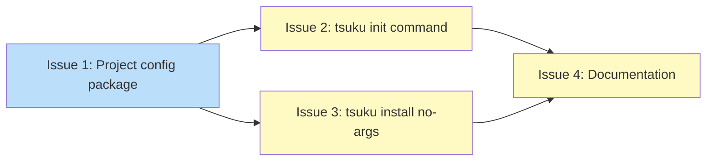

# DESIGN: Project Configuration

## Status

Current

## Implementation Issues

Implementation tracked in [PLAN: Project Configuration](../plans/PLAN-project-configuration.md).

### Dependency Graph



**Legend**: Green = done, Blue = ready, Yellow = blocked

## Upstream Design Reference

Parent: [DESIGN: Shell Integration Building Blocks](DESIGN-shell-integration-building-blocks.md)
Block 4 in the six-block architecture. This design specifies the project configuration file format and loading behavior that enables reproducible tool environments. Downstream consumers: #1681 (shell environment activation), #2168 (project-aware exec wrapper).

## Context and Problem Statement

Tsuku installs tools globally. When a developer clones a project that needs specific tools at specific versions, there's no way to declare those requirements in the repository. Each team member manually discovers and installs the right tools -- or gets bitten by version mismatches.

A project configuration file solves this by declaring tool requirements in a single, version-controlled location. Running `tsuku install` in that directory installs everything the project needs. Downstream building blocks (#1681, #2168) consume this configuration to activate the right versions automatically.

The design must specify:
- File naming and discovery (where tsuku looks for configuration)
- TOML schema (what the file contains)
- Version constraint syntax (how projects pin or constrain tool versions)
- The `ProjectConfig` Go interface consumed by downstream blocks
- CLI integration (`tsuku init`, `tsuku install` with no args)

### Scope

**In scope:**
- File name, discovery algorithm, and directory traversal behavior
- TOML schema for declaring tool requirements with version constraints
- `ProjectConfig` and `LoadProjectConfig` Go interface specification
- `tsuku init` and `tsuku install` (no args) command behavior
- Error handling for missing configs, invalid syntax, and unavailable tools

**Out of scope:**
- Shell environment activation (Block 5, #1681)
- Project-aware exec wrapper (Block 6, #2168)
- `.tool-versions` runtime compatibility (intended for future, deferred to keep this design focused)
- Environment variable declarations or scripts in the config file
- Lock files for pinning resolved versions

## Decision Drivers

- **Discoverability**: New contributors should find and understand the config file without documentation
- **Simplicity**: The common case (pin a tool to a version) should be one line
- **Compatibility with tsuku conventions**: Use TOML (already used for recipes and user config), `$TSUKU_HOME` paths
- **Downstream interface stability**: `ProjectConfig` and `LoadProjectConfig` are consumed by #1681 and #2168; the interface must be complete and stable
- **Performance**: Loading and parsing must complete well within the 50ms shell integration budget
- **Monorepo support**: Must handle projects within larger repositories (parent directory traversal)
- **Ecosystem awareness**: Learn from mise, asdf, devbox, and volta, but don't cargo-cult their choices

## Considered Options

### Decision 1: File Naming and Discovery Strategy

The config file name and discovery strategy affect discoverability for new contributors, monorepo usability, and debugging experience. The decision covers three axes: file name (dotfile vs. visible), directory search strategy (current-only vs. parent traversal), and multi-file behavior (first-match vs. merge vs. explicit extends).

Tsuku's existing files are all non-dotfiles: `$TSUKU_HOME/config.toml`, `recipes/<name>.toml`, `state.json`. Competitive tools split roughly evenly: mise supports both names with merging, asdf uses dotfiles with first-match traversal, devbox uses a visible name with no traversal.

Performance is not a differentiator. TOML parsing takes ~0.1ms for small files, and even worst-case parent traversal (20 stat calls) adds only ~0.2ms -- well within the 50ms budget regardless of approach.

Key assumptions:
- Most projects will have a single config file at the repository root
- The dominant monorepo use case is "shared tools at repo root, individual projects inherit"
- Per-project tool config files are a different category from tsuku's internal files (`$TSUKU_HOME/config.toml`, `state.json`); industry convention for this category is dotfiles

#### Chosen: `.tsuku.toml` with Parent Traversal (First-Match, No Merge)

Use `.tsuku.toml` as the single accepted file name. When loading project configuration, walk up from the working directory checking each directory for `.tsuku.toml`. Stop at the first match. Do not merge multiple configs. Stop traversal at `$HOME` by default; allow `TSUKU_CEILING_PATHS` environment variable (colon-separated list of directories) to customize the ceiling.

The discovery algorithm:

1. Start at the current working directory.
2. Check if `.tsuku.toml` exists in this directory.
3. If found, parse and return it. Done.
4. If not found, move to the parent directory.
5. If the parent is `$HOME` or matches a `TSUKU_CEILING_PATHS` entry, stop. Return no config.
6. Repeat from step 2.

Dotfile follows industry convention for per-project tool configuration. The ecosystem overwhelmingly uses dotfiles for this purpose: `.envrc` (direnv), `.nvmrc` (nvm), `.ruby-version` (rbenv), `.python-version` (pyenv), `.tool-versions` (asdf), `.editorconfig`. While tsuku's internal files (`$TSUKU_HOME/config.toml`, `state.json`) are non-dotfiles, those serve a different purpose -- they're user-level config in a dedicated directory, not per-project markers in a repository root.

Single name eliminates ambiguity. Supporting both `.tsuku.toml` and `tsuku.toml` means every project team must decide which to use, every doc must mention both, and tsuku must define precedence rules for when both exist.

First-match (no merge) keeps behavior predictable. When a `.tsuku.toml` exists in the current directory, it completely defines the tools for that directory. No need to reason about which parent directories might contribute additional tools or override versions. A developer can read one file and know exactly what tools apply.

Future extensibility is preserved. If demand for per-directory layering emerges, an `extends` field can be added to `.tsuku.toml` without breaking backward compatibility.

#### Alternatives Considered

**`tsuku.toml` (non-dotfile)**: More visible in `ls` output and file browsers. Matches mise's recent default change. Rejected because per-project tool config files are conventionally dotfiles across the ecosystem (`.envrc`, `.nvmrc`, `.tool-versions`, `.editorconfig`). The non-dotfile tsuku files (`config.toml`, `state.json`) live in `$TSUKU_HOME` and serve a different purpose. mise's move to `mise.toml` is the outlier, not the trend.

**Both `.tsuku.toml` and `tsuku.toml`**: Maximum flexibility. Rejected because two names create ambiguity ("which should I use?"), double the test and documentation surface, and require precedence rules. The flexibility doesn't justify the complexity for a new tool without an existing user base to migrate.

**`.tsuku.toml` with no traversal**: Simplest possible approach, matches devbox. Rejected because it forces tool declaration duplication in monorepos. Traversal adds minimal complexity (well-understood algorithm, negligible performance cost) for significant monorepo usability.

**Parent traversal with merging**: Most powerful monorepo support, matches mise. Rejected because merging makes it hard to answer "what tools does this directory get?" without mentally combining multiple files. Debugging version conflicts across merged configs is painful. The power-to-complexity ratio doesn't justify it at launch.

### Decision 2: TOML Schema and Version Constraint Syntax

The schema must produce a stable `ProjectConfig` Go interface consumed by #1681 and #2168. The project already uses TOML throughout and `BurntSushi/toml` for parsing. Version providers already support exact matching and prefix/fuzzy resolution (e.g., "1.22" resolves to "1.22.5").

Four tools in the same space were examined. None use semver range expressions. Most support exact versions and some form of prefix or "latest" keyword.

Key assumptions:
- Semver range constraints (">= 1.0, < 2.0") are not needed initially; prefix matching covers the practical use case
- The `[tools]` section is the only required section for v1; additional sections can be added later
- Per-tool extended options (registry source overrides, post-install hooks) will be needed eventually

#### Chosen: Mixed Map with String Shorthand

The `[tools]` section maps recipe names to either a version string (shorthand) or an inline table with a `version` field (extended form):

```toml
[tools]
node = "20.16.0"                          # version string passed to provider
go = "1.22"                               # provider resolves to latest matching version
ripgrep = "latest"                        # resolves to latest stable
jq = ""                                   # same as "latest"
python = { version = "3.12" }             # inline table (extensible)
```

Version strings are passed to the tool's version provider for resolution. The provider determines how to interpret the string -- whether `"1.22"` matches exactly or resolves to the latest `1.22.x` depends on the provider's behavior and the tool's release versioning scheme.

Special values:
- `"latest"` or `""` -- triggers `ResolveLatest` to fetch the newest stable version
- **No semver ranges** in v1 -- not implemented by providers, not used by comparable tools

All other strings are passed through to `ResolveVersion`, which delegates to the tool's configured version provider.

The common case (pin to a version) is `tool = "version"` -- one line, no braces. The inline table form provides extensibility: when per-tool options are needed (registry source overrides, post-install commands), they slot into the table without migration. Users who only need version pinning never see the table syntax.

A custom `UnmarshalTOML` method (~20 lines) on `ToolRequirement` accepts either a string (converted to `ToolRequirement{Version: s}`) or a table (decoded normally). This is a well-established pattern in Go TOML libraries and in TOML-based tools like Cargo.

#### Alternatives Considered

**Flat String Map** (`map[string]string`): Simplest possible schema. Rejected because it can't be extended with per-tool metadata without a breaking schema change. When per-tool options are needed, every existing `.tsuku.toml` would need migration.

**All Inline Tables** (`tool = { version = "..." }`): Uniform structure, no custom unmarshaling. Rejected because the common case becomes verbose -- `{ version = "20.16.0" }` vs `"20.16.0"` -- violating the simplicity driver.

**TOML Sub-Tables** (`[tools.node]\nversion = "20.16.0"`): Most structured, best for many per-tool options. Rejected because it takes 3 lines per tool minimum, making the tool list hard to scan.

**Semver Range Syntax**: Considered adding ">= 1.0, < 2.0" style constraints. Rejected because no comparable tool uses ranges, the version provider infrastructure doesn't support range filtering, and prefix matching covers the practical use case. Can be added later behind the same `Version` field.

### Decision 3: `.tool-versions` Compatibility

The `.tool-versions` format originated with asdf and is also supported by mise. It's a plain text file with `tool_name version` on each line. Many projects already have one checked in. The impedance mismatch between the two ecosystems is significant: asdf uses plugin names ("nodejs", "python") that don't correspond to tsuku recipe names, and version syntax specifiers like "ref:", "path:", and "system" have no tsuku equivalent.

Key assumptions:
- Tsuku's recipe naming won't converge with asdf plugin naming
- Migration from asdf/mise to tsuku will be a deliberate team decision
- Demand for automated migration tooling is currently speculative

#### Chosen: `.tool-versions` Deferred (Native TOML Only for Now)

Tsuku reads only `.tsuku.toml` for project configuration in this initial design. `.tool-versions` support is intended for the future but out of scope here -- the priority is getting the core `ProjectConfig` interface right first.

To ensure future `.tool-versions` support remains feasible, this design constrains itself in two ways:

1. **Version strings are opaque to the schema.** The `Version` field is a plain string passed through to the version provider. This means `.tool-versions` version values (`latest`, `latest:prefix`, exact versions) can flow through `ProjectConfig` without schema changes. Only `ref:` and `path:` specifiers would need special handling or rejection.

2. **`LoadProjectConfig` is the single entry point.** Future `.tool-versions` support adds a fallback parser behind `LoadProjectConfig` -- the interface downstream consumers (#1681, #2168) depend on doesn't change. The fallback would check for `.tool-versions` only when no `.tsuku.toml` is found, with a name-mapping table translating asdf plugin names to tsuku recipe names.

The name-mapping table is the main cost of future support. Tsuku uses its own recipe names (kebab-case, curated) while asdf uses plugin names that don't correspond 1:1. A mapping table covering common tools (50-100 entries) would need ongoing maintenance. This cost is real but bounded, and deferring it lets us measure demand before committing.

#### Alternatives Considered

**Full runtime `.tool-versions` support now**: Read `.tool-versions` as a fallback with a name-mapping table in this initial design. Deferred (not rejected) because the mapping table adds complexity before we've validated the core `ProjectConfig` interface. Adding it later behind `LoadProjectConfig` is straightforward.

**One-time `tsuku migrate` command only**: Best-effort import from `.tool-versions` to `.tsuku.toml` without runtime fallback. This may be a useful companion feature but doesn't replace runtime support for teams that want to use both tsuku and mise/asdf concurrently during migration.

### Decision 4: CLI Integration (`tsuku init` and `tsuku install` No Args)

Two new CLI behaviors are needed: `tsuku init` to create a config file, and `tsuku install` (no arguments) to batch-install all declared tools. Today, `tsuku install` requires at least one tool name argument and exits with a usage error when called with none. There is no `tsuku init` command.

A key implementation constraint: the current multi-arg install loop calls `handleInstallError`, which terminates the process on first failure via `exitWithCode`. Batch project installs need error aggregation.

Key assumptions:
- Most users run init once and install repeatedly
- Individual recipe dependency resolution (`installWithDependencies`) is sufficient for correctness
- Cross-tool topological ordering at the project level is not needed initially

#### Chosen: Minimal Non-Interactive Init + Lenient Batch Install

**`tsuku init`** creates a minimal config file non-interactively:
- Writes `.tsuku.toml` with an empty `[tools]` section and a brief comment explaining the format
- Errors if the file already exists; `--force` overwrites
- Does not prompt, does not add tools, does not run install

**`tsuku install`** (no arguments) reads the project config and installs all declared tools:
- Discovers the config file using Decision 1's traversal algorithm
- No config found: prints an error suggesting `tsuku init`, exits with `ExitUsage` (2)
- Config found, no tools: prints "No tools declared in \<path\>", exits `ExitSuccess` (0)
- Config found with tools: iterates tools, calling `runInstallWithTelemetry` for each, collecting errors instead of exiting on first failure
- Prints a summary: installed count, already-current count, failed count with tool names and error messages
- Exit codes: 0 if all succeeded, new `ExitPartialFailure` (15) if some failed, `ExitInstallFailed` (6) if all failed
- Invalid config syntax (TOML parse error) is a hard failure before attempting installs

Flag compatibility:
- `--dry-run`, `--force`, `--fresh`, `--yes`/`-y`: supported in no-arg mode
- `--yes`/`-y`: skip interactive confirmation (for CI and scripting)
- `--plan`, `--recipe`, `--from`, `--sandbox`: incompatible (error if combined with no-arg mode)

#### Alternatives Considered

**Interactive Init + Strict Install**: Init runs a wizard asking for tool names; install stops on first failure. Rejected because interactive wizards add friction for a simple TOML file, and strict-failure is hostile to batch operations where partial success is the norm.

**Smart Init with Detection + Topological Install**: Init auto-detects tools from project files (Makefile, go.mod); install resolves cross-tool dependencies and parallelizes. Rejected because detection heuristics are fragile, topological ordering adds complexity not needed when individual tools handle their own dependencies, and parallelism introduces output interleaving. All three can be added incrementally later.

**No Init Command (Install Creates Config)**: `tsuku install` (no args) creates a config if none found. Rejected because an install command shouldn't create config files as a side effect -- it muddles the mental model and reduces discoverability.

## Decision Outcome

**Chosen: `.tsuku.toml` (dotfile) with mixed-map schema, parent traversal, native TOML only, lenient batch install**

### Summary

Projects declare their tool requirements in a `.tsuku.toml` file checked into version control. The file uses a `[tools]` section where each tool maps to either a version string (`node = "20.16.0"`) or an inline table for extensibility (`python = { version = "3.12" }`). Version constraints support exact versions, prefix matching (e.g., "1.22" resolves to the latest 1.22.x), and "latest". No semver ranges, no `.tool-versions` compatibility.

Tsuku discovers project config by walking up from the current working directory until it finds a `.tsuku.toml`, stopping at `$HOME` or any directory listed in `TSUKU_CEILING_PATHS`. First match wins -- no merging across directories. This gives monorepos a natural inheritance model (tools at the root apply to all subdirectories) while keeping behavior predictable: one file governs each directory's tools.

`tsuku init` creates a minimal `.tsuku.toml` with an empty `[tools]` section. `tsuku install` with no arguments reads the discovered config and installs all declared tools, collecting errors instead of stopping on first failure. A summary reports what installed, what was already current, and what failed. Exit code 15 (`ExitPartialFailure`) distinguishes partial success from full success (0) or total failure (6), giving CI scripts actionable signal.

The `ProjectConfig` Go interface is minimal: a struct with a `Tools` map from recipe name to `ToolRequirement`, where `ToolRequirement` has a `Version` string field. A custom `UnmarshalTOML` method handles the string-or-table duality in ~20 lines. `LoadProjectConfig(startDir string)` returns the parsed config from the nearest `.tsuku.toml` or nil if none found. This interface is consumed directly by #1681 and #2168 without additional abstraction.

### Rationale

The four decisions reinforce each other toward a consistent design philosophy: start simple, stay predictable, extend later.

The dotfile name (`.tsuku.toml`) follows industry convention for per-project config while the single-name policy eliminates ambiguity. Parent traversal without merging gives monorepos a free inheritance model without the debugging pain of config composition. The mixed-map schema delivers one-line simplicity for the common case while preserving an extension path for per-tool options. TOML-only means one parser, one format, one code path through `ProjectConfig` -- downstream consumers (#1681, #2168) get a stable interface that won't sprout format-specific branches.

Lenient batch install is the right default because project configs typically declare 5-15 tools, and a single transient failure shouldn't block the rest. The new `ExitPartialFailure` exit code gives CI exactly the signal it needs without overloading existing error codes.

### Trade-offs Accepted

- Projects that need different tool sets in monorepo subdirectories must duplicate the parent's declarations in a subdirectory `.tsuku.toml` or wait for `extends` support.
- Teams migrating from asdf/mise must manually create `.tsuku.toml`. Documentation should include a "migrating from asdf" section with common name mappings.
- No semver ranges means projects that need "any 1.x" must use prefix matching ("1"), which resolves to the latest 1.x rather than constraining to a range. If providers add range support later, the `Version` field can accommodate it without schema changes.

## Solution Architecture

### Overview

Project configuration adds a new `internal/project` package that handles file discovery, TOML parsing, and the `ProjectConfig` interface. Two new CLI commands (`init`, `install` no-args) integrate this package into the existing command tree. The package is designed as a read-only data loader -- it finds and parses `.tsuku.toml` but does not install tools or modify state. Installation logic stays in the existing `install` package.

### Components

```
┌─────────────────────────────────────────────────────────┐
│                     CLI Layer                           │
│                                                         │
│  ┌─────────────┐     ┌──────────────────────────────┐  │
│  │ tsuku init  │     │ tsuku install (no args)       │  │
│  │  cmd/tsuku/ │     │  cmd/tsuku/install.go         │  │
│  │  init.go    │     │  (new branch in Run func)     │  │
│  └──────┬──────┘     └──────────┬───────────────────┘  │
│         │                       │                       │
└─────────┼───────────────────────┼───────────────────────┘
          │                       │
          ▼                       ▼
┌─────────────────────────────────────────────────────────┐
│              internal/project/config.go                  │
│                                                         │
│  ProjectConfig     ToolRequirement     LoadProjectConfig │
│  FindProjectDir    ConfigFileName                        │
└─────────────────────────────────────────────────────────┘
          │                       │
          │                       ▼
          │            ┌──────────────────────┐
          │            │  internal/install/    │
          │            │  (existing)           │
          │            │  runInstallWithTelemetry │
          │            └──────────────────────┘
          ▼
┌──────────────────────┐
│  .tsuku.toml          │
│  (project root)      │
└──────────────────────┘
```

### Key Interfaces

```go
package project

// ConfigFileName is the project configuration file name.
const ConfigFileName = ".tsuku.toml"

// MaxTools is the upper bound on tools in a single config file.
// Prevents resource exhaustion from maliciously large configs.
const MaxTools = 256

// ProjectConfig represents per-directory tool requirements.
type ProjectConfig struct {
    Tools map[string]ToolRequirement `toml:"tools"`
}

// ToolRequirement specifies a tool and optional version constraint.
// Implements toml.Unmarshaler to accept both string and table forms.
type ToolRequirement struct {
    Version string `toml:"version"`
}

// UnmarshalTOML handles the string-or-table duality:
//   node = "20.16.0"          -> ToolRequirement{Version: "20.16.0"}
//   python = {version="3.12"} -> ToolRequirement{Version: "3.12"}
//
// Uses the BurntSushi/toml Unmarshaler interface:
//   func (t *ToolRequirement) UnmarshalTOML(decode func(interface{}) error) error
func (t *ToolRequirement) UnmarshalTOML(decode func(interface{}) error) error

// ConfigResult holds a parsed config and the path where it was found.
type ConfigResult struct {
    Config *ProjectConfig
    Path   string // absolute path to the .tsuku.toml file
    Dir    string // directory containing the config file
}

// LoadProjectConfig finds the nearest .tsuku.toml by walking up from
// startDir. Returns nil if no config file is found. Returns an error
// only if a config file exists but can't be parsed or exceeds MaxTools.
//
// startDir is resolved via filepath.EvalSymlinks before traversal to
// prevent symlink-based misdirection. Traversal stops at $HOME or any
// directory in $TSUKU_CEILING_PATHS (colon-separated). The $HOME
// ceiling is unconditional -- TSUKU_CEILING_PATHS can only add
// additional ceilings, never remove the $HOME boundary.
func LoadProjectConfig(startDir string) (*ConfigResult, error)

// FindProjectDir returns the directory containing the nearest
// .tsuku.toml, or "" if none found. Implemented as a thin wrapper
// around LoadProjectConfig that discards the parsed config.
func FindProjectDir(startDir string) string
```

**Exit codes** (added to `cmd/tsuku/exitcodes.go`):

```go
const ExitPartialFailure = 15  // some tools failed, others succeeded
```

### Data Flow

**Flow 1: `tsuku init`**

```
1. User runs `tsuku init` in project directory
2. Check if .tsuku.toml exists in current directory
3. If exists and no --force: error ".tsuku.toml already exists"
4. Write .tsuku.toml with template:
   # Project tools managed by tsuku.
   # See: https://tsuku.dev/docs/project-config
   [tools]
5. Print: "Created .tsuku.toml"
```

**Flow 2: `tsuku install` (no args)**

```
1. User runs `tsuku install` with no tool name argument
2. Call LoadProjectConfig(cwd)
3. If nil: print error "No project configuration found. Run 'tsuku init' to
   create one.", exit ExitUsage (2)
4. If config.Tools is empty: print "No tools declared in <path>", exit 0
5. Print the config file path and tool list:
   Using: /path/to/.tsuku.toml
   Tools: node@20.16.0, go@1.22, ripgrep@latest, jq, python@3.12
6. If "latest" or empty versions found, warn:
   Warning: 2 tools use unpinned versions (ripgrep, jq). Pin for reproducibility.
7. If interactive (TTY) and no --yes flag: prompt for confirmation.
   Proceed? [Y/n]
   If declined, exit ExitUserDeclined (13).
8. For each tool in config.Tools (sorted alphabetically):
   a. Resolve version (exact, prefix, or latest)
   b. Call runInstallWithTelemetry(tool, resolvedVersion, flags)
   c. On success: increment installed/already-current counter
   d. On failure: append to errors list, continue
9. Print summary:
   Installed: 3 tools (go, node, ripgrep)
   Already current: 1 tool (jq)
   Failed: 1 tool
     python: version 3.12 not found for linux/amd64
10. Exit with appropriate code (0, 6, or 15)
```

**Flow 3: Downstream consumption (#1681, #2168)**

```
1. Shell activation or exec wrapper starts
2. Call LoadProjectConfig(cwd)
3. If nil: no project context, use global tools
4. If config found: iterate config.Tools for version constraints
5. Use constraints to select installed version or trigger install
```

## Implementation Approach

### Phase 1: Core Package (`internal/project`)

Build the data types and file discovery logic. This phase has no CLI integration -- it's a library consumed by tests.

Deliverables:
- `internal/project/config.go`: `ProjectConfig`, `ToolRequirement`, `LoadProjectConfig`, `FindProjectDir`
- `internal/project/config_test.go`: Unit tests for parsing (string shorthand, inline table, empty version, missing file, invalid TOML, traversal, ceiling paths)

### Phase 2: `tsuku init` Command

Add the init subcommand to the CLI.

Deliverables:
- `cmd/tsuku/init.go`: Cobra command, template writer, `--force` flag
- `cmd/tsuku/init_test.go`: Tests for create, already-exists error, force overwrite

### Phase 3: `tsuku install` No-Args Mode

Modify the install command to detect no-args mode and batch-install from project config.

Deliverables:
- Modified `cmd/tsuku/install.go`: No-args branch, error aggregation, summary output, `ExitPartialFailure`
- `cmd/tsuku/install_project_test.go`: Tests for no-config error, empty-tools, partial failure, all-success, flag incompatibility

### Phase 4: Documentation

Update user-facing docs.

Deliverables:
- Update CLI help text for `tsuku init` and `tsuku install`
- Add `.tsuku.toml` reference to relevant documentation

## Security Considerations

### Untrusted Repository Config

The primary security concern is that `.tsuku.toml` is an external artifact when it lives inside a cloned repository. Running `tsuku install` in a cloned repo parses that file and triggers tool downloads. Before this design, users explicitly chose which tools to install. With project config, the repo author effectively chooses.

**Risks:**
- A malicious or compromised repo could declare unwanted tools, expanding the user's attack surface
- A `.tsuku.toml` could pin to a known-vulnerable version of a tool
- Recipe name confusion: names that sound benign but install unexpected software (limited by tsuku's curated registry)

**Mitigations:**
- `tsuku install` requires explicit invocation -- no auto-install on clone or directory entry
- Batch install prints the config file path and full tool list, then prompts for interactive confirmation before proceeding. The `--yes`/`-y` flag skips the prompt for CI contexts where interaction would block
- Config files declaring more than 256 tools are rejected at parse time (resource exhaustion defense)
- All installs go through the existing verification pipeline (checksum verification, curated registry)
- `--dry-run` flag lets users preview what would be installed without any side effects

### Parent Traversal Trust Boundary

The traversal walks up from the working directory to `$HOME`. In shared hosting or multi-user environments, a `.tsuku.toml` placed in a shared parent directory could influence installs for users working in subdirectories.

**Mitigations:**
- `$HOME` is an unconditional ceiling -- traversal never crosses it, regardless of `TSUKU_CEILING_PATHS`
- `TSUKU_CEILING_PATHS` adds additional ceilings (restricts further) but cannot override the `$HOME` boundary
- Resolve symlinks before traversal (`filepath.EvalSymlinks` on the start directory) to prevent symlink-based misdirection
- When the discovered config is not in the current directory, print its full path so the user knows which file governs their install

### Version Reproducibility

Using `"latest"` or `""` as a version constraint means the resolved version depends on when `tsuku install` runs. Two developers installing at different times may get different tool versions, undermining the reproducibility goal. If the registry is compromised, "latest" resolution pulls the compromised version immediately.

**Mitigations:**
- Emit a warning when `.tsuku.toml` uses "latest" or empty version strings, encouraging exact or prefix version pinning for reproducibility
- A future lock file mechanism (out of scope for this design) can record resolved versions for deterministic installs. The schema accommodates this without breaking changes

### Mitigations Summary

| Risk | Severity | Mitigation | Residual Risk |
|------|----------|------------|---------------|
| Untrusted repo installs unwanted tools | Medium | Explicit invocation, interactive confirmation prompt, tool count cap (256), existing verification | User may confirm without reading the tool list |
| Recipe name confusion | Low | Curated registry limits available names | Registry expansion could weaken this over time |
| Parent traversal crosses trust boundary | Medium | $HOME ceiling, TSUKU_CEILING_PATHS, symlink resolution | Shared directories between project and $HOME are in scope |
| "latest" undermines reproducibility | Low-Medium | Warning on non-pinned versions | Users may ignore warnings |
| Pinning to vulnerable version | Low | Existing verification, curated registry | No vulnerability database check at install time |

## Consequences

### Positive

- **Reproducible environments**: Teams share tool requirements in version control. A new contributor runs `tsuku install` and gets the exact tools the project needs.
- **Incremental value**: Project config is useful immediately -- `tsuku install` with no args works without any shell integration. Downstream blocks (#1681, #2168) build on it but aren't required.
- **Stable downstream interface**: `ProjectConfig` and `LoadProjectConfig` are simple, well-defined types. #1681 and #2168 can design against them with confidence.
- **Extension path**: The mixed-map schema allows per-tool options to be added later without migration. The `extends` keyword can enable config inheritance when needed.

### Negative

- **No monorepo layering**: Subdirectories can't inherit-and-extend a parent `.tsuku.toml`. They must either rely on the parent's config entirely or duplicate+extend it in their own file.
- **Manual migration from asdf/mise**: No automated tooling for converting `.tool-versions` files. Early adopters migrating existing projects pay a one-time manual cost.
- **New exit code**: `ExitPartialFailure` (15) is a new convention that CI scripts must learn. Existing scripts that check only for 0/non-0 will treat partial failure as full failure.
- **Error aggregation refactor**: The install command's error handling changes from fail-fast to collect-and-report. This touches the existing `handleInstallError` code path.

### Mitigations

- **No monorepo layering**: Document the pattern of subdirectory-level `.tsuku.toml` files. Track demand for `extends` and add it if the pattern proves painful.
- **Manual migration**: Include a "migrating from asdf" documentation section with common tool name mappings. Track demand for a `tsuku migrate` command.
- **New exit code**: Document the exit code table in CLI help. The 0/non-0 interpretation remains correct (partial failure is still non-zero).
- **Error aggregation**: The refactor is localized to the install command's Run function. Existing single-tool installs continue using the current fail-fast path.
