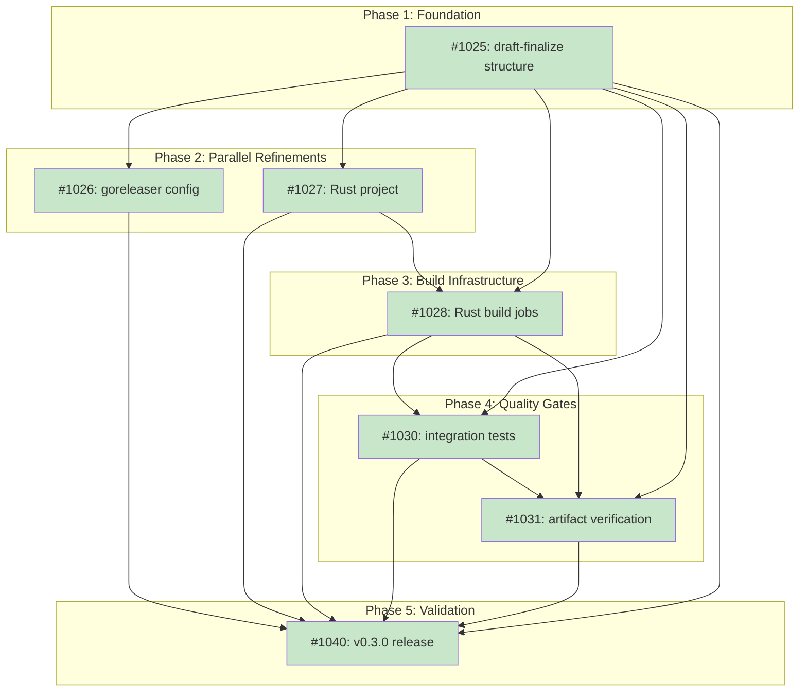

# DESIGN: Native Binary Release Workflow

**Status:** Current

## Implementation Issues

### Milestone: [Native Binary Release Workflow](https://github.com/tsukumogami/tsuku/milestone/43)

| Issue | Title | Dependencies | Tier |
|-------|-------|--------------|------|
| [#1025](https://github.com/tsukumogami/tsuku/issues/1025) | add draft-finalize workflow structure | None | testable |
| [#1026](https://github.com/tsukumogami/tsuku/issues/1026) | update goreleaser configuration | [#1025](https://github.com/tsukumogami/tsuku/issues/1025) | testable |
| [#1027](https://github.com/tsukumogami/tsuku/issues/1027) | add minimal tsuku-dltest Rust project | [#1025](https://github.com/tsukumogami/tsuku/issues/1025) | testable |
| [#1028](https://github.com/tsukumogami/tsuku/issues/1028) | add Rust build jobs with native runners | [#1025](https://github.com/tsukumogami/tsuku/issues/1025), [#1027](https://github.com/tsukumogami/tsuku/issues/1027) | testable |
| [#1030](https://github.com/tsukumogami/tsuku/issues/1030) | add integration test job | [#1025](https://github.com/tsukumogami/tsuku/issues/1025), [#1028](https://github.com/tsukumogami/tsuku/issues/1028) | testable |
| [#1031](https://github.com/tsukumogami/tsuku/issues/1031) | add artifact verification and checksums | [#1025](https://github.com/tsukumogami/tsuku/issues/1025), [#1028](https://github.com/tsukumogami/tsuku/issues/1028), [#1030](https://github.com/tsukumogami/tsuku/issues/1030) | critical |
| [#1040](https://github.com/tsukumogami/tsuku/issues/1040) | validate workflow with v0.3.0 release | All previous | testable |

### Dependency Graph



**Legend**: Green = done, Blue = ready, Yellow = blocked, Purple = needs-design

## Context and Problem Statement

Tsuku's current release workflow uses goreleaser with `CGO_ENABLED=0`, cross-compiling all four platform binaries (linux-amd64, linux-arm64, darwin-amd64, darwin-arm64) from a single ubuntu-latest runner. This works because pure Go binaries are fully portable when cgo is disabled.

Adding native binaries breaks this model. The upcoming tsuku-dltest Rust helper (for Level 3 library verification) and any future native components can't be cross-compiled:

1. **macOS SDK licensing**: Building macOS binaries requires the macOS SDK, legally available only on macOS hardware. Neither osxcross nor Rust's cross-rs can work around this.
2. **glibc binding**: Linux binaries link against the build system's glibc. A binary built on Ubuntu 24.04 (glibc 2.39) won't run on Ubuntu 20.04 (glibc 2.31).
3. **ARM64 testing**: Cross-compiled ARM64 binaries can't be tested on x86_64 runners without QEMU emulation (slow and unreliable).

The dlopen verification design (DESIGN-library-verify-dlopen.md, issue #1020) explicitly blocks on this: "A separate design document is required to define the multi-runner release workflow."

### Scope

**In scope:**
- Multi-runner CI matrix for native builds (Go + Rust)
- Artifact aggregation from parallel build jobs
- Draft release pattern (all-or-nothing publishing)
- Version pin injection (ldflags for Go, Cargo env for Rust)
- Integration test gate before release finalization
- glibc compatibility strategy
- macOS ad-hoc code signing

**Out of scope:**
- Apple Developer Program enrollment (costs $99/year)
- macOS notarization (requires Apple Developer account)
- Windows support (tsuku doesn't target Windows)
- Linux package formats (deb, rpm) - stay with plain binaries
- Docker image publishing

## Upstream Design Reference

This design supports [DESIGN-library-verify-dlopen.md](DESIGN-library-verify-dlopen.md).

**Relevant sections:**
- Blocking Dependencies: "Cannot be fully implemented until release workflow design is complete"
- Step 5: Build Infrastructure: "Requires native matrix runners"

## Decision Drivers

- **All-or-nothing releases**: Never publish a release with missing platform binaries
- **Native testing**: Test each binary on its target platform, not via emulation
- **glibc compatibility**: Support older Linux distributions (Ubuntu 20.04 era)
- **Cost awareness**: Use free GitHub runners where possible
- **Maintainability**: Keep the workflow debuggable (avoid clever tricks)
- **Version coherence**: Go and Rust binaries share the same version at build time
- **Minimal friction**: Current Go-only releases should continue working with minimal changes

## Considered Options

### Decision 1: Workflow Architecture

#### Option 1A: Unified Split-Merge Workflow

A single workflow file using goreleaser's split/merge feature. Each platform runs `goreleaser release --split`, then a final job runs `goreleaser continue --merge` to aggregate artifacts and publish.

**Pros:**
- goreleaser handles complexity (checksums, changelog, release notes)
- Single configuration file (.goreleaser.yaml)
- Well-documented pattern with community support

**Cons:**
- goreleaser's Rust support is newer and less battle-tested
- Split/merge adds complexity to debugging (shared state via cache)
- Requires goreleaser Pro features for some use cases

#### Option 1B: Staged Build-Then-Release

Three separate workflow jobs: (1) build Go binaries with goreleaser, (2) build Rust binaries with cargo, (3) aggregate and publish. Uses GitHub's native artifact upload/download.

**Pros:**
- Clear separation of concerns (Go team, Rust team, release team)
- Uses simple, well-understood GitHub Actions patterns
- Easier to debug (each stage is independent)
- No goreleaser Rust support needed

**Cons:**
- Manual checksum aggregation
- More YAML to maintain
- Release note generation needs separate handling

#### Option 1C: Parallel Matrix with Draft Release

Create a draft release first, then parallel matrix jobs upload their artifacts directly to the draft. A final job verifies completeness and publishes.

**Pros:**
- Maximum parallelism (all builds start immediately)
- Draft release provides atomic all-or-nothing semantics
- Simple artifact handling (direct upload to release)

**Cons:**
- Draft release is visible in GitHub API before completion
- Checksum file must be generated from draft contents
- Requires careful error handling for partial uploads

### Decision 2: glibc Compatibility Strategy

#### Option 2A: Build on Ubuntu 20.04

Use ubuntu-20.04 runners for Linux builds, providing glibc 2.31 compatibility.

**Pros:**
- Broadest compatibility (supports most current systems)
- Simple configuration change

**Cons:**
- ubuntu-20.04 is EOL April 2025
- May lack newer toolchain features
- Fewer runner resources

#### Option 2B: Build on Ubuntu 22.04

Use ubuntu-22.04 runners for Linux builds, providing glibc 2.35 compatibility.

**Pros:**
- Longer support window (EOL 2027)
- Modern toolchain
- Good balance of compatibility and support

**Cons:**
- Won't run on RHEL 8, older Ubuntu (20.04 LTS still in extended support)

#### Option 2C: musl Static Linking

Use Alpine-based containers or musl-cross toolchain for fully static binaries.

**Pros:**
- Zero glibc dependency
- Maximum portability
- Works on any Linux

**Cons:**
- More complex build setup
- Potential compatibility issues with some libraries
- Larger binary size for Rust (static linking entire libc)

### Decision 3: macOS Code Signing

#### Option 3A: Ad-hoc Signing

Sign binaries with `codesign -s -` (ad-hoc signature). This creates a valid code signature without certificates.

**Pros:**
- No Apple Developer account needed
- Avoids "app is damaged" errors from quarantine
- Users can bypass Gatekeeper with right-click → Open

**Cons:**
- Gatekeeper still warns about "unidentified developer"
- No notarization (can't remove warning without Apple account)
- Some enterprise environments block unsigned apps

#### Option 3B: No Signing

Skip code signing entirely, relying on users to handle quarantine flags.

**Pros:**
- Simplest implementation
- Works fine if users know to use `xattr -d com.apple.quarantine`

**Cons:**
- macOS shows "app is damaged" error by default
- Poor first-run experience
- Users must google the workaround

#### Option 3C: Defer to Future

Document code signing as future work, implement Option 3B now.

**Pros:**
- Ships faster
- Can evaluate Apple Developer account later
- Collects real user feedback first

**Cons:**
- Known poor UX for macOS users
- Technical debt

### Evaluation Against Decision Drivers

| Option | All-or-Nothing | Native Testing | glibc Compat | Cost | Maintainability |
|--------|----------------|----------------|--------------|------|-----------------|
| **1A: Split-Merge** | Good | Good | N/A | Free | Fair |
| **1B: Staged** | Good | Good | N/A | Free | Good |
| **1C: Parallel Draft** | Good | Good | N/A | Free | Good |
| **2A: Ubuntu 20.04** | N/A | N/A | Excellent | Free | Good |
| **2B: Ubuntu 22.04** | N/A | N/A | Good | Free | Good |
| **2C: musl** | N/A | N/A | Excellent | Free | Fair |
| **3A: Ad-hoc** | N/A | N/A | N/A | Free | Good |
| **3B: No Signing** | N/A | N/A | N/A | Free | Excellent |
| **3C: Defer** | N/A | N/A | N/A | Free | Fair |

### Uncertainties

- **goreleaser Rust stability**: The Rust support in goreleaser (v2.5+, Dec 2024) is relatively new. May need fallback to Option 1B if issues arise.
- **ubuntu-20.04 deprecation timeline**: GitHub hasn't announced runner removal. Should monitor announcements.
- **Gatekeeper behavior changes**: Apple frequently tightens macOS security. Ad-hoc signing may become insufficient.
- **ARM64 runner availability**: ubuntu-24.04-arm is in public preview (free for public repos as of Jan 2025). May have capacity limits during high-demand periods.
- **RHEL 8 exclusion**: RHEL 8 ships glibc 2.28 and has support until 2029. The glibc 2.35 choice intentionally excludes enterprise users on RHEL 8.
- **musl trade-offs if reconsidered**: Beyond build complexity, musl has DNS resolution differences and smaller default thread stack sizes (128KB vs glibc's 2-10MB).

## Decision Outcome

**Chosen: 1C (Parallel Draft) + 2B+2C (Ubuntu 22.04 + musl) + 3A (Ad-hoc Signing)**

### Summary

The release workflow creates a draft GitHub release, then builds all binaries in parallel on native runners, uploading artifacts to the draft. After all builds pass integration tests, a final job publishes the release. Linux builds include both glibc (ubuntu-22.04) and musl variants for broad compatibility. macOS binaries receive ad-hoc code signatures.

### Rationale

**Parallel Draft (1C) chosen because:**
- Maximum parallelism minimizes release time
- Draft release provides atomic semantics without complex state management
- GitHub's release API handles artifact aggregation natively
- Easier to debug than goreleaser split/merge (no shared cache)

**Ubuntu 22.04 (2B) chosen because:**
- Longer support window than 20.04 (critical for CI stability)
- glibc 2.35 covers most current systems (Ubuntu 22.04+, RHEL 9+, Fedora 36+)
- Users on older systems likely have other compatibility issues anyway
- Clear error message ("GLIBC_2.35 not found") if incompatible

**Ad-hoc signing (3A) chosen because:**
- Eliminates "app is damaged" errors (common friction point)
- No cost (Apple Developer account is $99/year)
- Users who encounter Gatekeeper warning can bypass with right-click → Open
- Leaves door open for full notarization later

**Staged builds (1B) rejected because:**
- Goreleaser already handles changelog, checksums, and release notes well
- Would require reimplementing these features

**musl (2C) added as supplementary:**
- Provides Alpine/musl distribution support
- Uses Alpine Docker containers for consistent musl toolchain
- Distributed as separate `-musl` variants (users choose)

### Trade-offs Accepted

- **glibc 2.35 minimum for glibc variant**: Users on Ubuntu 20.04 or RHEL 8 should use the musl variant or build from source.
- **musl behavioral differences**: The `-musl` variants may have subtle differences in DNS resolution and thread stack behavior. Users should test on their target systems.
- **More release artifacts**: Adding musl variants increases Linux binaries from 4 to 8 (glibc + musl for amd64 and arm64, for both tsuku and tsuku-dltest).
- **Gatekeeper warning**: macOS users will see "unidentified developer" warning on first run. Acceptable because tsuku targets developers who understand this.
- **Draft release visibility**: The draft is visible in GitHub API during build. "Atomic" means the release fails cleanly at publish time, not that the draft is invisible during build.
- **Ad-hoc signing limitations**: Ad-hoc signed binaries are machine-specific; users who redistribute the binary will need to re-sign or remove quarantine.

## Solution Architecture

### Overview

```
                                     ┌─────────────────────────────────┐
                                     │     Tag Push (e.g., v0.3.0)     │
                                     └─────────────────────────────────┘
                                                      │
                                                      ▼
                                     ┌─────────────────────────────────┐
                                     │   create-draft-release          │
                                     │   (Creates draft, outputs ID)    │
                                     └─────────────────────────────────┘
                                                      │
                     ┌────────────────────────────────┼────────────────────────────────┐
                     │                                │                                │
                     ▼                                ▼                                ▼
    ┌────────────────────────────┐  ┌────────────────────────────┐  ┌────────────────────────────┐
    │     build-go               │  │     build-rust             │  │     build-rust             │
    │  (goreleaser, parallel)    │  │   (linux-amd64, arm64)     │  │   (darwin-amd64, arm64)    │
    │                            │  │                            │  │                            │
    │  • linux-amd64             │  │  • ubuntu-22.04            │  │  • macos-13, macos-latest  │
    │  • linux-arm64             │  │  • ubuntu-24.04-arm        │  │  • Ad-hoc code signing     │
    │  • darwin-amd64            │  │                            │  │                            │
    │  • darwin-arm64            │  │                            │  │                            │
    │                            │  │                            │  │                            │
    │  Upload to draft release   │  │  Upload to draft release   │  │  Upload to draft release   │
    └────────────────────────────┘  └────────────────────────────┘  └────────────────────────────┘
                     │                                │                                │
                     └────────────────────────────────┼────────────────────────────────┘
                                                      │
                                                      ▼
                                     ┌─────────────────────────────────┐
                                     │     integration-test            │
                                     │   (Download from draft, test)    │
                                     └─────────────────────────────────┘
                                                      │
                                                      ▼
                                     ┌─────────────────────────────────┐
                                     │     finalize-release            │
                                     │   (Generate checksums, publish)  │
                                     └─────────────────────────────────┘
```

### Components

**1. create-draft-release job**
- Runs on ubuntu-latest
- Creates a draft GitHub release for the tag
- Outputs the release ID for artifact uploads
- Extracts release notes from the annotated tag message (falls back to auto-generated notes if no annotation)

**2. build-go job (matrix)**
- Uses goreleaser with `use_existing_draft: true` to upload to the draft created by job 1
- Goreleaser configured with `mode: keep-existing` to preserve release notes from the draft
- Runs on appropriate native runner per platform:
  - linux-amd64: ubuntu-22.04
  - linux-arm64: ubuntu-24.04-arm
  - darwin-amd64: macos-13
  - darwin-arm64: macos-latest

**3. build-rust job (matrix)**
- Builds tsuku-dltest for each platform
- Uses cargo with release profile
- Injects version via CARGO_PKG_VERSION environment
- macOS: Signs with `codesign -s -`
- Uploads to draft release

**4. integration-test job**
- Downloads artifacts from draft release
- Runs basic smoke tests (version check, help output)
- Verifies tsuku can invoke tsuku-dltest
- Runs on each platform in parallel

**5. finalize-release job**
- Verifies all expected artifacts are present (see Artifact Verification below)
- Downloads all artifacts from draft
- Generates checksums.txt (SHA256)
- Uploads checksums.txt
- Publishes the release (removes draft status)

**Artifact Verification:**
Before publishing, finalize-release checks that all expected binaries exist:
```bash
EXPECTED=(
  # glibc variants
  tsuku-linux-amd64
  tsuku-linux-arm64
  tsuku-darwin-amd64
  tsuku-darwin-arm64
  tsuku-dltest-linux-amd64
  tsuku-dltest-linux-arm64
  tsuku-dltest-darwin-amd64
  tsuku-dltest-darwin-arm64
  # musl variants
  tsuku-linux-amd64-musl
  tsuku-linux-arm64-musl
  tsuku-dltest-linux-amd64-musl
  tsuku-dltest-linux-arm64-musl
)
for binary in "${EXPECTED[@]}"; do
  if ! gh release view "$TAG" --json assets -q ".assets[].name" | grep -q "^${binary}$"; then
    echo "ERROR: Missing artifact: $binary"
    exit 1
  fi
done
```
This prevents partial releases if a build job uploaded some artifacts but failed before completing.

### Job Dependency Chain

All jobs use explicit dependencies to ensure correct sequencing and failure propagation:

```
create-draft-release (always runs)
  │
  ├─► build-go (needs: create-draft-release)
  │     └─ if: needs.create-draft-release.result == 'success'
  │
  ├─► build-rust-linux (needs: create-draft-release)
  │     └─ if: needs.create-draft-release.result == 'success'
  │
  └─► build-rust-macos (needs: create-draft-release)
        └─ if: needs.create-draft-release.result == 'success'
              │
              └─────────────────┬────────────────────────────────┐
                                │                                │
                                ▼                                ▼
                  integration-test (needs: build-*)   finalize-release
                    └─ if: all build jobs succeed       (needs: integration-test)
                                                          └─ if: success()
```

If any build job fails, integration-test and finalize-release are skipped. The draft remains unpublished.

### Key Interfaces

**Release ID passing:**
```yaml
create-draft-release:
  outputs:
    release_id: ${{ steps.create.outputs.release_id }}
    upload_url: ${{ steps.create.outputs.upload_url }}

build-go:
  needs: create-draft-release
  if: needs.create-draft-release.result == 'success'
  env:
    RELEASE_ID: ${{ needs.create-draft-release.outputs.release_id }}
```

**Release notes from annotated tag:**
```bash
# Creating a release with custom notes:
git tag -a v0.3.0 -m "## What's New

- Feature A
- Feature B

## Bug Fixes

- Fixed issue X"

git push origin v0.3.0  # Triggers release workflow
```

The `create-draft-release` job extracts the tag annotation and uses it as release notes. If no annotation exists (lightweight tag), it falls back to auto-generated notes.

**Version injection:**
```yaml
# Go (via goreleaser ldflags - already in .goreleaser.yaml)
-X github.com/tsukumogami/tsuku/internal/buildinfo.version={{.Version}}
-X github.com/tsukumogami/tsuku/internal/verify.pinnedDltestVersion={{.Version}}

# Rust: Update Cargo.toml version before build
- name: Set Rust version
  run: |
    VERSION="${GITHUB_REF_NAME#v}"
    sed -i "s/^version = .*/version = \"$VERSION\"/" cmd/tsuku-dltest/Cargo.toml
```

The Rust binary reads its version from Cargo.toml at build time via `env!("CARGO_PKG_VERSION")`.

### Platform Matrix

| Platform | Go Runner | Rust Runner | Signing | Libc |
|----------|-----------|-------------|---------|------|
| linux-amd64 | ubuntu-22.04 | ubuntu-22.04 | None | glibc 2.35 |
| linux-amd64-musl | ubuntu-22.04 + Alpine container | ubuntu-22.04 + Alpine container | None | musl |
| linux-arm64 | ubuntu-24.04-arm | ubuntu-24.04-arm | None | glibc 2.39 |
| linux-arm64-musl | ubuntu-24.04-arm + Alpine container | ubuntu-24.04-arm + Alpine container | None | musl |
| darwin-amd64 | macos-13 | macos-13 | Ad-hoc | libSystem |
| darwin-arm64 | macos-latest | macos-latest | Ad-hoc | libSystem |

**musl builds use Docker:**
```yaml
- name: Build musl variant
  run: |
    docker run --rm -v "$PWD:/workspace" -w /workspace alpine:3.19 sh -c '
      apk add --no-cache go rust cargo
      CGO_ENABLED=0 go build -o tsuku-linux-amd64-musl ./cmd/tsuku
      cargo build --release --manifest-path cmd/tsuku-dltest/Cargo.toml
      mv target/release/tsuku-dltest tsuku-dltest-linux-amd64-musl
    '
```

### Version Pin Injection

The tsuku-dltest version pin must match the tsuku version at build time:

```go
// internal/verify/dltest.go
var pinnedDltestVersion = "dev"  // Injected via ldflags
```

```yaml
ldflags:
  - -X github.com/tsukumogami/tsuku/internal/verify.pinnedDltestVersion=${{ github.ref_name }}
```

This ensures that when tsuku v0.3.0 is released, it expects tsuku-dltest v0.3.0.

## Implementation Approach

### Step 1: Create Draft-Finalize Structure

Restructure release.yml:
- Add create-draft-release job at start (creates draft, outputs release_id)
- Add finalize-release job at end (verifies artifacts, publishes)
- Thread release_id through all jobs via `needs:` outputs

This is the foundational change that other steps build on.

### Step 2: Update goreleaser Configuration

Modify `.goreleaser.yaml`:
- Add `use_existing_draft: true` to upload artifacts to the draft created by create-draft-release job
- Add `mode: keep-existing` to preserve release notes from the annotated tag
- Change `draft: true` so goreleaser doesn't publish (finalize-release handles that)
- Add ldflags for pinnedDltestVersion: `-X .../verify.pinnedDltestVersion={{.Version}}`
- Keep existing platform matrix

```yaml
release:
  github:
    owner: tsukumogami
    name: tsuku
  draft: true
  use_existing_draft: true  # Find draft by tag name, don't create new
  mode: keep-existing       # Preserve release notes from draft
  prerelease: auto
```

### Step 3: Create Rust Project Structure

Create `cmd/tsuku-dltest/`:
- `Cargo.toml` with release profile (LTO, strip, panic=abort)
- `rust-toolchain.toml` pinning stable Rust version
- `src/main.rs` implementing minimal version-printing CLI

**Minimal implementation for workflow validation:**
```rust
// src/main.rs
use std::env;

// Version injected via Cargo.toml at build time
const VERSION: &str = env!("CARGO_PKG_VERSION");

fn main() {
    let args: Vec<String> = env::args().collect();

    if args.len() == 2 && args[1] == "--version" {
        eprintln!("tsuku-dltest v{}", VERSION);
        std::process::exit(0);
    }

    // Placeholder: actual dlopen logic added by issue #1014
    eprintln!("tsuku-dltest v{}", VERSION);
    eprintln!("dlopen functionality not yet implemented");
    eprintln!("usage: tsuku-dltest <path>...");
    std::process::exit(2);
}
```

This minimal implementation validates:
- Rust project builds on all platforms
- Version injection works correctly
- Release workflow produces valid binaries

The actual dlopen logic is implemented by issue #1014.

### Step 4: Create Rust Build Jobs

Add workflow sections for building tsuku-dltest:
- Set up Rust toolchain via `dtolnay/rust-toolchain@stable`
- Version injection via sed on Cargo.toml
- Build with `cargo build --release`
- Sign on macOS with `codesign -s -`
- Upload to draft release

### Step 5: Add Integration Test Job

Create integration-test job:
- Download artifacts from draft release
- Run version checks on each binary (same version format for Go and Rust CLIs)
- Runs on each platform in parallel matrix

**Version validation:**
```bash
# Both CLIs use same version format: "vX.Y.Z"
EXPECTED_VERSION="v${GITHUB_REF_NAME#v}"
./tsuku version | grep "$EXPECTED_VERSION"
./tsuku-dltest --version 2>&1 | grep "$EXPECTED_VERSION"
```

Note: `tsuku-dltest` outputs to stderr (like `tsuku version`), ensuring consistent behavior.

**dlopen integration testing deferred**: Testing `tsuku verify` with the dltest helper is deferred to issue #1014 when the dlopen logic is implemented.

### Step 6: Add Artifact Verification and Checksums

In finalize-release job:
- Verify all expected artifacts present (fail if any missing)
- Download all artifacts
- Generate SHA256 checksums.txt
- Upload checksums.txt
- Publish release

### Step 7: Validate with Release 0.3.0

Use the new workflow for the 0.3.0 release to validate:
- All platforms build successfully
- Integration tests pass
- Checksums are correct
- Release publishes atomically
- Document any issues for future releases

## Security Considerations

### Download Verification

**For released binaries:**
Checksums.txt is generated after all builds complete and uploaded to the release. Users can verify downloads:
```bash
shasum -a 256 -c checksums.txt
```

**For CI artifacts:**
Artifacts are uploaded directly to a draft release created in the same workflow run. The draft ID is passed between jobs, not stored externally.

### Execution Isolation

**Release workflow:**
The workflow runs in GitHub Actions with standard runner permissions. It has:
- Write access to releases (via GITHUB_TOKEN)
- No access to user systems

**Built binaries:**
No change from current behavior. Binaries are downloaded and executed with user permissions.

### Supply Chain Risks

**Build provenance:**
- All builds happen in GitHub Actions (auditable)
- No external build systems or caches
- Goreleaser and Cargo are installed fresh per run from official sources

**Dependency risks:**
- Actions use pinned versions (e.g., `actions/checkout@v4`)
- Rust dependencies locked via Cargo.lock
- Go dependencies locked via go.sum
- Rust toolchain pinned via `rust-toolchain.toml` (prevents pulling compromised nightly)

**Toolchain version pinning:**
```toml
# cmd/tsuku-dltest/rust-toolchain.toml
[toolchain]
channel = "1.75"  # Pin to specific stable version
```

**Mitigation for compromised actions:**
- Pin to commit SHAs for critical actions (checkout, setup-go)
- Review action updates before upgrading
- goreleaser-action uses official goreleaser releases from GitHub

### User Data Exposure

**Release process:**
The workflow accesses only repository contents and GitHub API. No user data is processed.

**Released binaries:**
Same as current tsuku releases. Telemetry (if enabled) is covered by existing telemetry design.

### Mitigations Summary

| Risk | Mitigation | Residual Risk |
|------|------------|---------------|
| Corrupted download | SHA256 checksums in release | User must manually verify |
| Compromised runner | GitHub's runner security | Shared with all GitHub users |
| Malicious action | Pin action versions to SHAs | Must review updates |
| Partial release | Artifact verification + draft pattern | None (fails before publish) |
| Version mismatch | Ldflags injection + version check in integration tests | Build failure if misconfigured |
| Unpinned toolchains | rust-toolchain.toml, goreleaser version in action | Drift if not maintained |
| Job failure mid-upload | Explicit if: conditions, artifact verification | Draft remains unpublished |

## Consequences

### Positive

- **Native testing**: Each binary is tested on its target platform before release
- **All-or-nothing**: Failed builds don't result in incomplete releases
- **Future-ready**: Adding more native components (e.g., platform-specific helpers) is straightforward
- **Clear errors**: glibc version mismatch produces clear error message for users
- **Better macOS UX**: Ad-hoc signing eliminates "app is damaged" errors

### Negative

- **Longer release time**: Parallel jobs still require waiting for slowest platform
- **More workflow complexity**: Single release.yml becomes ~200 lines
- **glibc 2.35 minimum**: Drops support for Ubuntu 20.04, RHEL 8
- **Runner capacity**: ARM64 Linux runners are in preview, may have limits

### Mitigations

| Negative | Mitigation |
|----------|------------|
| Longer release time | Parallelization minimizes impact; typical release ~5 minutes |
| Workflow complexity | Clear job separation, documented architecture |
| glibc minimum | Document in installation requirements |
| Runner capacity | Monitor GitHub announcements, have fallback to QEMU if needed |
