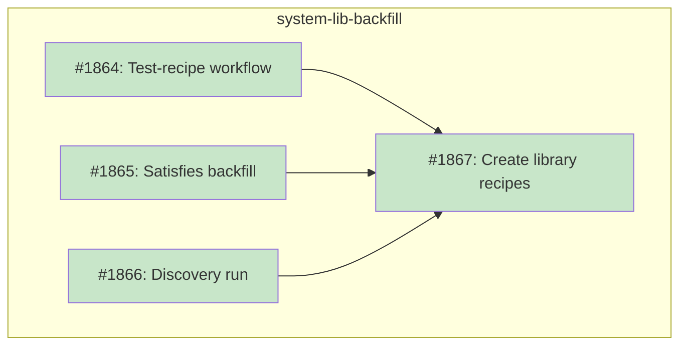

# DESIGN: System Library Backfill Strategy

## Status

Current

## Implementation Issues

### Milestone: [system-lib-backfill](https://github.com/tsukumogami/tsuku/milestone/97)

| Issue | Dependencies | Tier |
|-------|--------------|------|
| ~~[#1864: ci(recipes): create test-recipe workflow for cross-platform validation](https://github.com/tsukumogami/tsuku/issues/1864)~~ | ~~None~~ | ~~testable~~ |
| ~~_New `test-recipe.yml` GHA workflow with `workflow_dispatch` that tests a recipe across the full platform matrix (linux x86_64/arm64, macOS). Blocking prerequisite for all library recipe work._~~ | | |
| ~~[#1865: fix(recipes): backfill satisfies metadata on existing library recipes](https://github.com/tsukumogami/tsuku/issues/1865)~~ | ~~None~~ | ~~simple~~ |
| ~~_Add `[metadata.satisfies]` entries to ~19 existing library recipes that lack ecosystem name aliases, enabling the pipeline to resolve names correctly._~~ | | |
| ~~[#1866: feat(batch): run discovery to identify missing library dependencies](https://github.com/tsukumogami/tsuku/issues/1866)~~ | ~~None~~ | ~~simple~~ |
| ~~_Run the batch orchestrator against pending entries and produce a ranked list of missing library dependencies ordered by block count._~~ | | |
| ~~[#1867: feat(recipes): create library recipes for priority blockers](https://github.com/tsukumogami/tsuku/issues/1867)~~ | ~~[#1864](https://github.com/tsukumogami/tsuku/issues/1864), [#1865](https://github.com/tsukumogami/tsuku/issues/1865), [#1866](https://github.com/tsukumogami/tsuku/issues/1866)~~ | ~~critical~~ |
| ~~_Create library recipes for the 14+ priority blockers using standard tooling with manual fixes documented in a friction log. Each merge auto-requeues blocked packages._~~ | | |

### Dependency Graph



**Legend**: Green = done, Blue = ready, Yellow = blocked, Purple = needs-design

## Upstream Design Reference

This design implements part of [DESIGN-registry-scale-strategy.md](DESIGN-registry-scale-strategy.md).

**Relevant sections:**
- Decision 3: Chose Option 3B (skip tools requiring missing deps initially)
- Library backfill described as a parallel workstream

## Context and Problem Statement

Tsuku's batch generation pipeline queues tools from package ecosystems (Homebrew, PyPI, crates.io, etc.) and generates recipes for them deterministically. When a tool depends on a system library that tsuku doesn't provide, the pipeline records a `missing_dep` failure and marks the queue entry as `blocked`.

Recent infrastructure work has closed most of the operational gaps:

- **Satisfies metadata** (PR #1824) lets recipes declare ecosystem name aliases, replacing the static dep-mapping.json file. When `openssl` declares `satisfies = { homebrew = ["openssl@3"] }`, the recipe loader resolves `openssl@3` to the existing recipe automatically.
- **Requeue-on-recipe-merge** (PR #1830) runs `queue-maintain` on every recipe merge via CI, automatically flipping blocked entries back to pending when their dependencies are resolved.
- **Structured error subcategories** (PR #1854) provide finer-grained failure classification so `missing_dep` failures are distinguished from other error types.

As of now, the queue has **0 blocked entries** and **0 active blockers**. But 2,830 entries remain pending and haven't been attempted yet. As the pipeline processes them at ~25 entries per hourly batch, some will hit missing library dependencies. Without proactive library creation, each missing library means:

1. A batch run fails the tool (exit code 8) and marks it blocked
2. The dashboard surfaces the blocker via failure record analysis
3. Someone notices, creates the library recipe, and adds `satisfies` metadata
4. The next `queue-maintain` run requeues the tool
5. The next batch run retries it

This round trip works but creates unnecessary delay. At 25 entries/hour, the 2,830 pending entries take ~5 days to process, but each missing library adds at least one extra batch cycle of delay per blocked tool.

Additionally, library recipes created on a linux-amd64 dev host need cross-platform validation before merging. The current CI doesn't have a lightweight way to test an individual recipe across all platforms (darwin, arm64, linux families). The batch-generate workflow tests on all platforms but is designed for batch operations, not single-recipe validation from a PR.

### Known Missing Libraries

Historical failure data identifies these libraries as blockers. Some already have recipes but lack `satisfies` metadata; others don't have recipes at all.

| Library | Historical Block Count | Status | Category |
|---------|----------------------|--------|----------|
| gmp | 5 | Recipe exists, needs satisfies | Math |
| libgit2 | 2 | No recipe | Version control |
| openssl@3 | 2 | Has satisfies (-> openssl) | Crypto |
| bdw-gc | 1 | No recipe | Memory |
| pcre2 | 1 | No recipe | Text processing |
| oniguruma | 1 | No recipe | Text processing |
| dav1d | 1 | No recipe | Media |
| tree-sitter@0.25 | 1 | No recipe | Parsing |
| libevent | 1 | No recipe | Networking |
| libidn2 | 1 | No recipe | Networking |
| glib | 1 | No recipe | Core |
| gettext | 1 | Recipe exists, needs satisfies | Internationalization |
| ada-url | 1 | No recipe | Networking |
| notmuch | 1 | No recipe | Mail |

This list is a starting point. The proactive discovery phase will surface more as the pipeline processes pending entries.

### Scope

**In scope:**
- Strategy for proactively discovering which library recipes are needed
- Process for creating library recipes using existing tooling
- Cross-platform testing workflow for validating library recipes before merge
- Integration with the reactive loop (failure analysis, dashboard, requeue)
- Success metrics for tracking backfill progress
- Handling of transitive library dependencies

**Out of scope:**
- Changes to the reactive loop itself (already working)
- Library verification beyond existing recipe validation (covered by separate DESIGN-library-verification.md)
- Platform-specific toolchain recipes (covered by embedded recipe list)
- Changes to the `satisfies` metadata system

## Decision Drivers

- Maximize tools unblocked per library added
- Use existing infrastructure rather than building new tooling
- Keep library recipe creation consistent with how all recipes are created
- Ensure the proactive approach feeds improvements back into the pipeline
- Cover all ecosystems, not just Homebrew (though Homebrew is 98%+ of the queue)
- Platform gaps should surface naturally through the reactive loop
- Library recipes must be validated on darwin and arm64 before merge

## Considered Options

### Decision 1: Proactive vs. Reactive Library Creation

The reactive loop handles missing libraries eventually, but each one adds unnecessary delay. With 2,830 pending entries, we need to decide whether to wait for failures to discover needed libraries or predict them ahead of time.

#### Chosen: Proactive Discovery + Reactive Safety Net

Run the batch pipeline against pending entries to discover which libraries will be needed before the real pipeline hits them. Create recipes for discovered libraries proactively. The reactive loop remains the safety net for anything the proactive pass misses or for libraries needed by entries added to the queue later.

#### Alternatives Considered

**Reactive only**: Let the batch pipeline discover missing deps organically.
Rejected because each library gap adds at least one extra batch cycle per blocked tool, and the infrastructure for proactive discovery already exists.

**Homebrew API analysis**: Query formulae.brew.sh for dependency metadata on pending entries to predict needed libraries without running the pipeline.
Rejected because it only covers Homebrew and doesn't exercise the actual resolution path. Predictions from API data may not match what the pipeline actually needs on our target platforms.

### Decision 2: Discovery Method

We need to identify which libraries are missing before creating them. The discovery must exercise the same code path that production uses.

#### Chosen: Batch Pipeline Execution

Run the batch orchestrator (`cmd/batch-orchestrator/`) against pending entries to discover which dependencies fail to resolve. The orchestrator already captures exit code 8 (`missing_dep`) failures and extracts `blocked_by` fields from the output via the `extractBlockedByFromOutput()` regex. Process the failure JSONL output to build a ranked list of needed libraries.

This can be done as a targeted batch run (e.g., `--batch-size 100 --tier 3`) against the full queue. The orchestrator writes failure records with `category: "missing_dep"` and `blocked_by` arrays for each missing library dependency.

#### Alternatives Considered

**Static analysis of existing recipes**: Analyze what libraries successful recipes depend on and extrapolate to pending entries.
Rejected because it has limited predictive power -- pending entries may need different libraries than what's already built.

### Decision 3: Recipe Creation Method

Once we know which libraries are needed, we need to create their recipes. The method should use existing tooling and generate improvement feedback.

#### Chosen: Standard Pipeline + Friction Log

Create library recipes using `tsuku create --from homebrew <library>` (or the appropriate ecosystem source), just as the pipeline would. When a library fails deterministic generation, fix it manually and record the failure in a friction log. Each friction log entry becomes an enhancement issue for the pipeline, so similar libraries succeed automatically in the future.

Only 3 of 22 existing library recipes currently declare `satisfies` metadata. New library recipes should include `satisfies` entries from the start. Existing libraries that block packages due to ecosystem name mismatches should get `satisfies` entries backfilled.

#### Alternatives Considered

**Dedicated library generator**: Build a specialized tool for library recipe generation with library-specific templates.
Rejected because the standard pipeline already handles most of the work, and a separate generator would diverge from the main creation path over time. Fixes to the main pipeline benefit all recipe types.

### Decision 4: Dependency Depth Strategy

Some libraries depend on other libraries. Cairo depends on fontconfig, glib, and pixman. Glib depends on pcre2, gettext, and libffi. Creating one library may require creating several others first.

#### Chosen: Follow the Chain, Leaf-First

When a library needs other libraries, create those too. Process them leaf-first (deepest dependencies first, working up to the library that was originally needed). The discovery phase naturally reveals the full dependency tree because each missing transitive dependency appears in the failure output.

#### Alternatives Considered

**Depth ceiling**: Only create library recipes up to N dependency hops deep.
Rejected because it leaves tools permanently blocked behind arbitrary depth limits. The pipeline already handles dependency ordering.

**Skip complex libraries**: Mark libraries with more than N dependencies as `requires_manual`.
Rejected because some important tools (imagemagick, neovim) depend on complex library trees. The friction log approach handles complexity better -- each difficult library teaches us something about the pipeline.

### Decision 5: Platform Coverage per Library

Library recipes need platform-specific steps (homebrew for glibc/darwin, apk for musl). We need to decide how much platform coverage a library recipe needs before it can unblock packages.

#### Chosen: Match the Blocking Platform

Create the library recipe for the platform where blocking was observed. If gmp blocks packages on linux-glibc, the glibc step is required but musl and darwin steps aren't. The reactive loop acts as the feedback mechanism: when the library is needed on another platform, tools on that platform will get blocked, the dashboard will surface it, and the missing platform step gets added.

Before merging, the new test-recipe workflow (Decision 7) runs on all platforms. Platform failures lead to `when` filters in the recipe rather than blocking the PR. This means each library recipe ships with accurate platform constraints from day one.

#### Alternatives Considered

**All platforms required**: Every library recipe must cover linux-glibc, linux-musl, and darwin before merging.
Rejected because it significantly slows library creation and some libraries may never be needed on all platforms. The reactive loop already handles platform gap discovery.

### Decision 6: Success Metrics

We need to track whether the backfill effort is actually unblocking tools.

#### Chosen: Queue Progression Metrics

Track three metrics derived from existing dashboard and failure data:

1. **Blocked-to-total ratio**: Percentage of queue entries in `blocked` state over time. Should trend toward zero as libraries are added.
2. **Time-to-unblock**: How long entries spend in `blocked` state before being requeued. Should decrease as the proactive pass catches more libraries upfront.
3. **New missing_dep count**: Number of new `missing_dep` failures per batch run. Should decrease as library coverage improves.

All three are computable from the existing queue and failure JSONL files without new instrumentation.

#### Alternatives Considered

**Library coverage ratio**: Track what percentage of Homebrew dependency trees are covered by tsuku library recipes.
Rejected because it requires building a full dependency graph upfront and doesn't measure the outcome we care about (tools unblocked).

### Decision 7: Cross-Platform Testing Workflow

Library recipes are initially created and tested on a linux-amd64 dev host using `tsuku create` with sandbox validation. But they need testing on darwin, arm64, and multiple linux families before merging. The batch-generate workflow has the right platform matrix but is designed for batch operations.

#### Chosen: New test-recipe Workflow

Create a new `test-recipe.yml` GHA workflow with `workflow_dispatch` that accepts a recipe name (or detects changed recipes in the PR). It runs `tsuku install --recipe <path>` on the full platform matrix:

- Linux x86_64: 5 families (debian, rhel, arch, alpine, suse) via Docker
- Linux arm64: 4 families (debian, rhel, suse, alpine) via arm64 runners
- macOS arm64: macos-14
- macOS x86_64: macos-15-intel

When a platform fails, the recipe is updated with appropriate `when` filters (e.g., `when = { os = ["linux"], libc = ["glibc"] }`) rather than blocking the entire PR. The workflow reports pass/fail per platform so the developer knows which filters to add.

#### Alternatives Considered

**Adapt batch-generate.yml**: Add a single-recipe mode to the existing batch workflow.
Rejected because batch-generate is optimized for batch operations (queue management, batch selection, PR creation). Bolting on single-recipe mode would add complexity to an already complex workflow.

**Use validate-golden-execution.yml**: Extend golden execution to test actual installation.
Rejected because golden file validation serves a different function (plan comparison, not installation testing). Changing its purpose would break the existing CI contract.

## Decision Outcome

**Chosen: Proactive discovery + standard creation + friction log + cross-platform CI**

### Summary

The backfill starts with a discovery run of the batch orchestrator against pending queue entries. The orchestrator's existing failure extraction captures `missing_dep` failures and their `blocked_by` fields, producing a ranked list of missing libraries.

Library recipes are then created using `tsuku create --from homebrew <library>`. On the dev host, the developer uses `tsuku install --recipe <path> --sandbox` with `--target-family` overrides to test across available linux environments before opening a PR. Once the PR is open, the new `test-recipe.yml` workflow is triggered to validate on darwin, arm64, and all linux families. Platforms that fail get `when` filters added to the recipe so it ships with accurate constraints.

Recipes that fail deterministic generation get manual fixes, and each fix is documented in a friction log. The friction log entry becomes a pipeline enhancement issue. New recipes include `satisfies` metadata from the start. Dependencies are processed leaf-first.

After merge, `queue-maintain` automatically requeues any blocked packages that depended on the new library. The dashboard's blocker rankings update on the next pipeline run.

Three metrics track progress: blocked-to-total ratio in the queue, time-to-unblock for blocked entries, and new `missing_dep` failures per batch run.

### Rationale

The proactive approach avoids the per-library round trip through failure, blocking, and human intervention. Using the actual batch orchestrator for discovery exercises the same extraction logic (`extractBlockedByFromOutput()`) that production uses, so the ranked library list reflects real pipeline behavior.

The friction log is the key feedback mechanism. Each manual fix teaches us where the standard pipeline falls short. Over time, the pipeline gets better at handling library recipes automatically.

The cross-platform testing workflow fills a real gap: library recipes created on linux-amd64 may not work on darwin or arm64, but there was no lightweight way to test individual recipes from a PR branch. The new workflow reuses the same platform matrix as batch-generate but without the queue management overhead.

### Trade-offs Accepted

- **Discovery compute cost**: Running the orchestrator against hundreds of entries takes CI time. Acceptable because the alternative (discovering dependencies one batch cycle at a time) is slower overall.
- **Incomplete proactive coverage**: The discovery run may not find all needed libraries, especially for entries not yet queued. The reactive loop handles these.
- **Manual fixes required**: Some library recipes will fail deterministic generation. Acceptable because the friction log turns each failure into a pipeline improvement.
- **Partial platform coverage**: Library recipes may ship without support for all platforms. Acceptable because the reactive loop discovers platform gaps when they're actually needed.

## Solution Architecture

### Overview

The backfill process sits alongside the existing batch pipeline and uses the same infrastructure. One new workflow (`test-recipe.yml`) is added for cross-platform validation. Everything else uses existing tools.

### Process Flow

```
Discovery Phase:
  batch-orchestrator --batch-size 100 --tier 3
  → failure JSONL with category "missing_dep" and blocked_by arrays
  → aggregate blocked_by across all failures
  → rank by frequency → library creation list

Creation Phase (per library, leaf-first):
  1. tsuku create --from homebrew <library>
  2. Add [metadata.satisfies] for ecosystem aliases
  3. Test locally: tsuku install --recipe <path> --sandbox --target-family debian
                   tsuku install --recipe <path> --sandbox --target-family alpine
                   (repeat for available families)
  4. Open PR with recipe
  5. Trigger test-recipe workflow → validates darwin, arm64, all linux families
  6. If platform fails: add when filters to recipe, re-trigger workflow
  7. If deterministic generation failed: record in friction log, file issue
  8. Merge PR → queue-maintain auto-requeues blocked packages

Monitoring Phase:
  Dashboard shows blocked ratio and missing_dep count per batch run
  New blockers trigger next creation round
```

### Key Interfaces

**Existing interfaces used (no changes needed):**

- `cmd/batch-orchestrator/`: Runs `tsuku create` against queue entries. Exit code 8 indicates missing dependencies. Writes failure JSONL with `category`, `blocked_by`, and `subcategory` fields.
- `tsuku create --from homebrew <name>`: Creates a recipe from a Homebrew formula.
- `tsuku install --recipe <path> --sandbox`: Tests a recipe in an isolated container with `--target-family` for linux family overrides.
- `cmd/queue-maintain/`: Runs requeue + reorder on recipe merge. Already integrated into `update-queue-status.yml`.
- `[metadata.satisfies]`: Recipe field declaring ecosystem name aliases.
- `data/failures/*.jsonl`: Structured failure records.
- `website/pipeline/dashboard.json`: Generated dashboard with blocker rankings.

**New: test-recipe.yml workflow**

A `workflow_dispatch` GHA workflow that tests a specific recipe across all platforms. Accepts a recipe name input, runs `tsuku install --recipe <path> --force` on each platform in the matrix, and reports pass/fail per platform. Can also detect changed recipes when triggered on a PR branch.

**New: friction log**

A markdown file (`docs/friction-log-library-recipes.md`) tracking library recipes that failed deterministic generation. Each entry records what failed, why, and what pipeline enhancement would fix it.

### Data Flow

1. **Input**: `data/queues/priority-queue.json` entries with `status: "pending"`
2. **Discovery output**: Failure JSONL with `category: "missing_dep"` and `blocked_by` arrays
3. **Ordering input**: Aggregated `blocked_by` frequency from failure records
4. **Creation output**: New recipe TOML files in `recipes/` with `type = "library"` and `satisfies` metadata
5. **Validation**: `test-recipe.yml` pass/fail per platform → `when` filters in recipe
6. **Feedback**: `queue-maintain` auto-requeues after recipe merge, dashboard updates

## Implementation Approach

### Phase 1: Test-Recipe Workflow (Prerequisite)

Create `test-recipe.yml` with the full platform matrix. This must be merged to `main` in a separate PR before any library recipe work begins, since all library recipe PRs will trigger it. It's a blocking prerequisite for all subsequent phases.

### Phase 2: Discovery Run

Run the batch orchestrator against a large batch of pending entries (e.g., `--batch-size 200 --tier 3`). Collect failure JSONL and aggregate `blocked_by` fields. Produce the initial ranked library list.

### Phase 3: Proactive Library Creation

Work through the ranked library list, starting with the known blockers from the table above:
1. For each library, check if its own dependencies are satisfied (leaf-first ordering)
2. Run `tsuku create --from homebrew <library>`
3. Add `satisfies` metadata for ecosystem aliases
4. Test locally with sandbox + target-family overrides
5. Open PR and run `test-recipe.yml`
6. Add `when` filters for failing platforms
7. If deterministic generation failed: fix manually, record in friction log, file enhancement issue
8. Merge PR

### Phase 4: Satisfies Backfill

Add `satisfies` metadata to the 19 existing library recipes that don't have it. This ensures ecosystem name resolution covers the full library catalog.

### Phase 5: Steady State

The reactive loop handles ongoing library needs. Track the three progression metrics to measure whether backfill effort keeps pace with queue growth.

## Security Considerations

### Download Verification

Library recipes use the same download and verification mechanisms as tool recipes. The `homebrew` action downloads pre-built bottles from Homebrew's GHCR with SHA256 verification: the blob SHA from the OCI manifest annotation is compared against the downloaded file's hash (`verifySHA256()` in `homebrew.go`). The trust anchor is Homebrew's GHCR infrastructure -- the SHA is fetched at download time, not pre-committed in the recipe TOML. This is the same trust model used by all homebrew-based recipes. No new download paths are introduced.

### Execution Isolation

Library recipes install shared objects (`.so`, `.dylib`) and headers into `$TSUKU_HOME/libs/`. These aren't standalone executables, but shared libraries do execute code when loaded by tools (constructor functions, exported symbols). The practical isolation boundary is RPATH validation (`set_rpath.go`) which constrains library paths to `$TSUKU_HOME/libs/`, preventing a library from redirecting loads to attacker-controlled directories. The `install_binaries` action with `install_mode = "directory"` restricts output to the declared file list. No new permissions are needed beyond what the existing `homebrew` action requires.

### Supply Chain Risks

Library binaries come from the same Homebrew bottle infrastructure as tool binaries. The `satisfies` metadata is declared in recipe TOML files reviewed via PR, not derived automatically. CI validates satisfies entries with cross-recipe duplicate detection and collision checks against canonical recipe names (`generate-registry.py`). This prevents an attacker from claiming to satisfy a popular library name without review.

The requeue-on-recipe-merge design (DESIGN-requeue-on-recipe-merge.md) checks recipe existence via queue status entries marked "success", not filesystem lookups. A library recipe must have been successfully installed before it can unblock other packages.

### User Data Exposure

Library recipes don't access or transmit user data. They install binary artifacts (shared libraries, headers, pkg-config files) into `$TSUKU_HOME/libs/`. Local state tracking in `state.json` records `used_by` relationships but this stays on disk. No telemetry or network activity occurs after installation.

### Mitigations

| Risk | Mitigation | Residual Risk |
|------|------------|---------------|
| Malicious library recipe via PR | Standard PR review process, same as all recipes | Reviewer must verify formula name and satisfies entries match intent |
| Satisfies metadata claiming wrong name | CI validates against duplicates and canonical name collisions | Correctly-named but malicious library content |
| Requeue triggers retry of poisoned recipe | Requeue only flips status to pending; recipe goes through full pipeline validation on retry | None beyond standard recipe validation |
| Review fatigue at scale | Deterministic-generated recipes need lighter review; manual fixes tagged for extra scrutiny in friction log | Volume may still reduce review thoroughness |

## Consequences

### Positive

- Tools blocked by missing libraries get unblocked faster (proactive vs. waiting for failure)
- The friction log creates a feedback loop that improves the pipeline over time
- Using the standard pipeline for library creation keeps library recipes consistent with tool recipes
- Cross-platform CI catches darwin/arm64 issues before merge, not after
- Platform gaps in existing library recipes surface naturally through the reactive loop
- Only one new workflow to build (`test-recipe.yml`); everything else uses existing infrastructure

### Negative

- Discovery phase uses compute time for a large batch run focused on finding gaps rather than generating recipes
- Some libraries will require manual fixes that take developer time
- Proactive analysis may predict libraries that aren't actually needed on our target platforms
- The test-recipe workflow consumes macOS runner minutes per recipe tested

### Mitigations

- Run discovery as part of a regular batch run or during off-peak hours
- The friction log converts each manual fix into a pipeline improvement, reducing future manual effort
- Blocker-count ordering ensures effort goes to the highest-impact libraries first
- Test-recipe workflow can be limited to one macOS runner to manage costs
