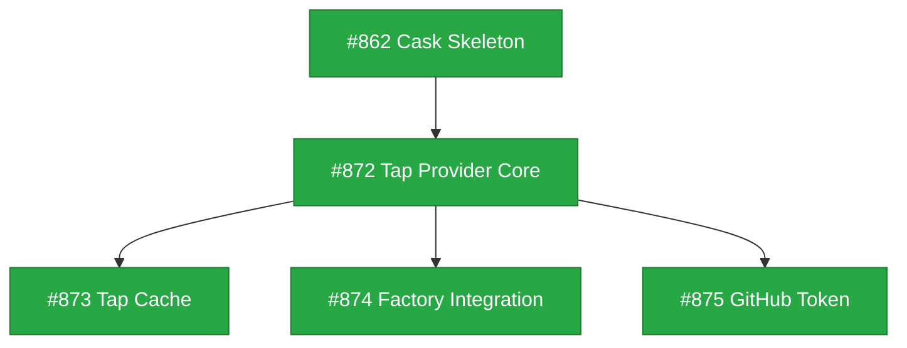

# Design: Homebrew Tap Support

**Status**: Current

## Implementation Issues

| Issue | Title | Dependencies | Tier |
|-------|-------|--------------|------|
| [#872](https://github.com/tsukumogami/tsuku/issues/872) | feat(version): implement tap version provider core | #862 | testable |
| [#873](https://github.com/tsukumogami/tsuku/issues/873) | feat(version): add tap metadata cache | #872 | testable |
| [#874](https://github.com/tsukumogami/tsuku/issues/874) | feat(version): integrate tap provider with factory | #872, #862 | testable |
| [#875](https://github.com/tsukumogami/tsuku/issues/875) | feat(version): add GitHub token support for tap provider | #872 | testable |



## Upstream Design Reference

This design extends:
- [DESIGN-homebrew.md](current/DESIGN-homebrew.md) - Core formula bottle support
- [DESIGN-cask-support.md](current/DESIGN-cask-support.md) - Cask support

**Relevant patterns:**
- Cask design's hybrid approach (version provider + generic action)
- Homebrew action's GHCR bottle downloading
- Version provider factory for source selection

## Context and Problem Statement

Homebrew taps are third-party repositories that extend Homebrew with additional formulas and casks beyond the official homebrew/core and homebrew/cask collections. Many developer tools are distributed exclusively through third-party taps:

| Tap | Tools |
|-----|-------|
| `hashicorp/tap` | Terraform, Vault, Consul, Packer |
| `homebrew/cask-versions` | VS Code Insiders, Firefox Beta |
| `homebrew/cask-fonts` | Developer fonts |
| `github/gh` | GitHub CLI (alternative distribution) |
| Private company taps | Internal tooling |

Currently, tsuku's Homebrew integration only supports the official repositories via the `formulae.brew.sh` API. Users who need tools from third-party taps must either:
- Install them manually outside tsuku's management
- Use Homebrew directly, defeating tsuku's self-contained philosophy
- Create custom recipes with manual URL/checksum maintenance

This creates a gap for users who want unified tool management but depend on third-party tap distributions.

### Why Taps Differ from Core Homebrew

| Aspect | homebrew/core | Third-party Taps |
|--------|---------------|------------------|
| **Metadata API** | `formulae.brew.sh` JSON API | No centralized API |
| **Bottle hosting** | GHCR (`ghcr.io/homebrew/core`) | Varies (GitHub Releases, S3, none) |
| **Curation** | Homebrew maintainers | Tap maintainers (varying quality) |
| **Trust level** | High (official) | Variable (third-party) |
| **Rate limiting** | None documented | GitHub API limits apply |

### Scope

**In scope:**
- Fetching formula metadata from third-party taps via GitHub API
- Downloading bottles from tap-specified URLs (when available)
- Supporting source-only formulas (no bottles) with clear error messages
- Recipe syntax for specifying tap-based tools
- Caching tap metadata to minimize API calls

**Out of scope:**
- Private tap authentication (future enhancement)
- Building from source (tsuku downloads pre-built binaries)
- Tap discovery or search functionality
- Automatic tap updates/syncing

## Decision Drivers

- **API limitations**: `formulae.brew.sh` does not support third-party taps; GitHub API has rate limits (60/hr unauth, 5,000/hr auth)
- **Bottle availability**: Many third-party taps are source-only; bottles may be hosted on various platforms
- **Security model**: Third-party taps have varying trust levels; checksum verification remains essential
- **Consistency with cask design**: The cask design uses a version provider + generic action pattern; tap support should follow similar principles
- **Ruby parsing complexity**: Formula files are Ruby code; full parsing is complex but regex extraction may suffice for metadata
- **Caching requirements**: GitHub API rate limits necessitate local caching of tap metadata

## Considered Options

### Option 1: Dedicated `tap` Version Provider with GitHub API and Caching

Create a `tap` version provider that queries GitHub API to fetch formula metadata from third-party tap repositories, with local caching to minimize API calls.

```toml
[version]
source = "tap"
tap = "hashicorp/tap"
formula = "terraform"
```

The provider would:
1. Check local cache for formula metadata
2. If stale/missing, fetch formula file from GitHub raw content
3. Parse Ruby file to extract version, bottle URLs, checksums
4. Cache results locally and return metadata

**Pros:**
- Clean separation from core homebrew provider
- Follows cask design pattern (dedicated provider)
- Caching mitigates rate limiting

**Cons:**
- GitHub API rate limiting (60/hr unauth, mitigated by caching)
- Ruby parsing complexity
- Cache staleness vs freshness trade-off

### Option 2: Extend Existing `homebrew` Provider with Tap Parameter

Extend the current `homebrew` version provider to accept an optional `tap` parameter.

```toml
[version]
source = "homebrew"
formula = "terraform"
tap = "hashicorp/tap"  # Optional, defaults to homebrew/core
```

When `tap` is specified:
- Skip `formulae.brew.sh` API
- Fetch from GitHub instead
- Parse formula file for metadata

**Pros:**
- Single provider for all Homebrew formulas
- Simpler mental model for users
- Code reuse for bottle downloading

**Cons:**
- Conflates two different data sources (API vs GitHub)
- More complex provider implementation
- Tap-specific edge cases pollute core logic

### Option 3: Local Tap Cache with Periodic Sync

Clone tap repositories locally and maintain a cache of formula metadata.

```toml
[version]
source = "tap"
tap = "hashicorp/tap"
formula = "terraform"
```

The provider would:
1. Check local cache for tap data
2. If stale or missing, clone/pull tap repository
3. Parse formula files and cache metadata
4. Return cached metadata

**Pros:**
- No rate limiting concerns
- Full access to all tap data
- Can work offline

**Cons:**
- Disk space requirements
- Cache staleness issues
- Complexity of cache management
- Git dependency for syncing

### Option 4: Hybrid Approach with Smart Fallback

Support multiple data sources with automatic fallback:

```toml
[version]
source = "homebrew"
formula = "terraform"
tap = "hashicorp/tap"
```

Resolution order:
1. Check `formulae.brew.sh` API (works for homebrew-maintained taps like cask-versions)
2. Fall back to GitHub API for third-party taps
3. Cache results locally to reduce API calls

**Pros:**
- Best of both worlds
- Graceful degradation
- Maximizes API coverage

**Cons:**
- Complex fallback logic
- Inconsistent behavior between taps
- Harder to debug failures

## Decision Outcome

**Chosen option: Option 1 (Dedicated `tap` Version Provider)** for consistency with the cask design pattern.

### Rationale

Following the principle established in the cask design, tap support should use a dedicated version provider that cleanly separates concerns:

1. **Cask design alignment**: The cask design rejected extending the `homebrew` action in favor of a dedicated `cask` version provider. The same reasoning applies here - tap metadata access is fundamentally different from `formulae.brew.sh` API access.

2. **Clear user intent**: `source = "tap"` explicitly signals that GitHub API will be used, with its rate limits and parsing requirements. Users know what to expect.

3. **Maintainability**: A dedicated provider can evolve independently without affecting core Homebrew support.

4. **Security boundaries**: Third-party taps have different trust characteristics than homebrew/core. A separate provider makes this distinction clear.

### Trade-offs Accepted

- **Rate limiting**: GitHub API limits (60/hr unauth) may be restrictive. Mitigation: local caching and optional auth token support.
- **Ruby parsing**: Must parse `.rb` files for metadata. Mitigation: targeted regex extraction for specific fields (version, bottle URLs, checksums).
- **Bottle variability**: Bottles may be missing or hosted elsewhere. Mitigation: clear error messages and recipe-level URL override support.

## Solution Architecture

### Overview

The solution mirrors the cask design's hybrid approach:

1. **`tap` Version Provider**: Fetches formula metadata from GitHub, parses Ruby files
2. **Existing `homebrew` Action**: Downloads and installs bottles (already supports custom URLs)

```
┌─────────────────────────────────────────────────────────────────┐
│                        Recipe (TOML)                            │
│                                                                 │
│  [version]                                                      │
│  source = "tap"                                                 │
│  tap = "hashicorp/tap"                                          │
│  formula = "terraform"                                          │
│                                                                 │
│  [[steps]]                                                      │
│  action = "homebrew"                                            │
│  formula = "{{version.formula}}"                                │
│  bottle_url = "{{version.bottle_url}}"                          │
│  checksum = "{{version.checksum}}"                              │
└─────────────────────────────────────────────────────────────────┘
                              │
                              ▼
┌─────────────────────────────────────────────────────────────────┐
│                    tap Version Provider                         │
├─────────────────────────────────────────────────────────────────┤
│  1. Fetch formula from GitHub:                                  │
│     GET github.com/hashicorp/homebrew-tap/Formula/terraform.rb  │
│                                                                 │
│  2. Parse Ruby file for:                                        │
│     - version (from `version` or URL pattern)                   │
│     - bottle URLs (from `bottle do` block)                      │
│     - checksums (sha256 per platform)                           │
│                                                                 │
│  3. Return TapVersionInfo with template variables               │
└─────────────────────────────────────────────────────────────────┘
                              │
                              ▼
┌─────────────────────────────────────────────────────────────────┐
│                    homebrew Action                              │
├─────────────────────────────────────────────────────────────────┤
│  1. Download bottle from provided URL                           │
│  2. Verify checksum                                             │
│  3. Extract and relocate                                        │
│  4. Install binaries                                            │
└─────────────────────────────────────────────────────────────────┘
```

### Components

#### Tap Version Provider

**File:** `internal/version/tap.go`

```go
type TapProvider struct {
    httpClient *http.Client
    cache      *TapCache
}

func (p *TapProvider) Name() string { return "tap" }

type TapVersionInfo struct {
    Version   string            // e.g., "1.7.0"
    Formula   string            // Full formula name
    BottleURL string            // Platform-specific bottle URL
    Checksum  string            // SHA256 checksum
    Extra     map[string]string // Additional metadata
}

func (p *TapProvider) Resolve(ctx context.Context, tap, formula string) (*TapVersionInfo, error) {
    // 1. Check cache
    if cached := p.cache.Get(tap, formula); cached != nil && !cached.Stale() {
        return cached, nil
    }

    // 2. Fetch from GitHub
    url := fmt.Sprintf("https://raw.githubusercontent.com/%s/homebrew-%s/HEAD/Formula/%s.rb",
        owner, repo, formula)
    content, err := p.fetchWithRateLimit(ctx, url)

    // 3. Parse Ruby formula
    info, err := parseFormulaFile(content)

    // 4. Cache and return
    p.cache.Set(tap, formula, info)
    return info, nil
}
```

#### Ruby Formula Parser

**File:** `internal/version/tap_parser.go`

Targeted regex extraction for specific Homebrew formula patterns:

```go
var (
    // Match: version "1.7.0" (explicit version)
    versionRegex = regexp.MustCompile(`(?m)^\s*version\s+"([^"]+)"`)

    // Match: bottle do ... end block (multiline)
    bottleBlockRegex = regexp.MustCompile(`(?s)bottle\s+do\s+(.*?)\s+end`)

    // Match: root_url "https://..." (inside bottle block)
    rootURLRegex = regexp.MustCompile(`root_url\s+"([^"]+)"`)

    // Match: sha256 "abc123" => :arm64_sonoma
    // Also handles: sha256 arm64_sonoma: "abc123"
    sha256Regex = regexp.MustCompile(`sha256\s+(?:"([a-f0-9]{64})"\s*=>\s*:(\w+)|(\w+):\s*"([a-f0-9]{64})")`)
)

func parseFormulaFile(content string) (*TapVersionInfo, error) {
    info := &TapVersionInfo{}

    // 1. Extract version (required)
    if match := versionRegex.FindStringSubmatch(content); len(match) > 1 {
        info.Version = match[1]
    } else {
        return nil, fmt.Errorf("no version found in formula")
    }

    // 2. Extract bottle block (required for tsuku)
    bottleMatch := bottleBlockRegex.FindStringSubmatch(content)
    if len(bottleMatch) < 2 {
        return nil, fmt.Errorf("no bottle block found; source-only formulas not supported")
    }
    bottleBlock := bottleMatch[1]

    // 3. Extract root_url (optional, defaults to GHCR-style)
    if rootMatch := rootURLRegex.FindStringSubmatch(bottleBlock); len(rootMatch) > 1 {
        info.RootURL = rootMatch[1]
    }

    // 4. Extract checksums per platform
    info.Checksums = make(map[string]string)
    for _, match := range sha256Regex.FindAllStringSubmatch(bottleBlock, -1) {
        // Handle both patterns: "hash" => :platform and platform: "hash"
        if match[1] != "" {
            info.Checksums[match[2]] = match[1]
        } else {
            info.Checksums[match[3]] = match[4]
        }
    }

    if len(info.Checksums) == 0 {
        return nil, fmt.Errorf("no bottle checksums found")
    }

    return info, nil
}
```

**Supported formula patterns:**

| Pattern | Example | Supported |
|---------|---------|-----------|
| Explicit version | `version "1.7.0"` | Yes |
| Version from URL | Inferred from `url` pattern | No (too fragile) |
| `:head` version | `version :head` | No |
| Version from `stable` block | Nested in `stable do` | No |

**Edge cases and error handling:**

- **No version found**: Error "no version found in formula"
- **No bottle block**: Error "no bottle block found; source-only formulas not supported"
- **No matching platform**: Error "no bottle available for platform {platform}"
- **Ruby metaprogramming**: Not supported; will fail to parse (acceptable limitation)

#### Bottle URL Construction

Homebrew bottles follow a standard naming convention. The `root_url` specifies the base, and the bottle filename is constructed from formula metadata.

**URL Format:**
```
{root_url}/{formula}--{version}.{platform}.bottle.tar.gz
```

**Examples:**

| Tap | root_url | Full Bottle URL |
|-----|----------|-----------------|
| hashicorp/tap | `https://github.com/hashicorp/homebrew-tap/releases/download/v1.7.0` | `.../terraform--1.7.0.arm64_sonoma.bottle.tar.gz` |
| homebrew/core | (GHCR, handled separately) | `ghcr.io/homebrew/core/curl:1.0.0` |
| Custom S3 | `https://mybucket.s3.amazonaws.com/bottles` | `.../myformula--2.0.0.sonoma.bottle.tar.gz` |

**URL Resolution Logic:**

```go
func (info *TapVersionInfo) GetBottleURL(platform string) (string, error) {
    checksum, ok := info.Checksums[platform]
    if !ok {
        return "", fmt.Errorf("no bottle for platform %s", platform)
    }

    if info.RootURL == "" {
        // No custom root_url means source-only or GHCR default
        return "", fmt.Errorf("no root_url specified; cannot construct bottle URL")
    }

    filename := fmt.Sprintf("%s--%s.%s.bottle.tar.gz",
        info.Formula, info.Version, platform)
    return fmt.Sprintf("%s/%s", info.RootURL, filename), nil
}
```

#### Platform Tag Mapping

Homebrew uses platform-specific tags for bottle selection. The tap provider maps Go runtime values to Homebrew tags.

| runtime.GOOS | runtime.GOARCH | macOS Version | Homebrew Platform Tag |
|--------------|----------------|---------------|-----------------------|
| darwin | arm64 | 14.x | `arm64_sonoma` |
| darwin | arm64 | 13.x | `arm64_ventura` |
| darwin | arm64 | 12.x | `arm64_monterey` |
| darwin | amd64 | 14.x | `sonoma` |
| darwin | amd64 | 13.x | `ventura` |
| darwin | amd64 | 12.x | `monterey` |
| linux | amd64 | - | `x86_64_linux` |
| linux | arm64 | - | `arm64_linux` |

**Resolution logic:**

```go
func getPlatformTag() string {
    if runtime.GOOS == "linux" {
        if runtime.GOARCH == "arm64" {
            return "arm64_linux"
        }
        return "x86_64_linux"
    }

    // macOS: detect version
    macOSVersion := getMacOSMajorVersion() // e.g., 14 for Sonoma
    codename := macOSCodename(macOSVersion) // e.g., "sonoma"

    if runtime.GOARCH == "arm64" {
        return "arm64_" + codename
    }
    return codename
}
```

**Fallback chain:** If the exact platform tag isn't available, try older versions:
1. `arm64_sonoma` (exact match)
2. `arm64_ventura` (one version older)
3. `all` (universal, rare)
4. Error: no compatible bottle

#### Tap Cache

**File:** `internal/version/tap_cache.go`

Local cache to minimize GitHub API calls:

```go
type TapCache struct {
    dir string // $TSUKU_HOME/cache/taps/
    ttl time.Duration
}

func (c *TapCache) Get(tap, formula string) *TapVersionInfo {
    path := filepath.Join(c.dir, tap, formula+".json")
    // Read and unmarshal if not stale
}

func (c *TapCache) Set(tap, formula string, info *TapVersionInfo) {
    // Marshal and write to cache file
}
```

### Recipe Syntax

Two supported patterns:

**Pattern A: Explicit tap provider (recommended)**
```toml
[metadata]
name = "terraform"

[version]
source = "tap"
tap = "hashicorp/tap"
formula = "terraform"

[[steps]]
action = "homebrew"
formula = "{{version.formula}}"
bottle_url = "{{version.bottle_url}}"
checksum = "{{version.checksum}}"
```

**Pattern B: Short form with inference**
```toml
[metadata]
name = "terraform"

[version]
source = "tap:hashicorp/tap/terraform"

[[steps]]
action = "homebrew"
formula = "{{version.formula}}"
bottle_url = "{{version.bottle_url}}"
checksum = "{{version.checksum}}"
```

**Short form parsing rules:**

The short form `tap:{owner}/{repo}/{formula}` is parsed as:
- `owner` = GitHub organization or user (e.g., `hashicorp`)
- `repo` = Tap name without `homebrew-` prefix (e.g., `tap` → `homebrew-tap`)
- `formula` = Formula name (e.g., `terraform`)

The full GitHub repository path becomes: `github.com/{owner}/homebrew-{repo}`

Examples:
| Short Form | Owner | Repo | Formula | GitHub Path |
|------------|-------|------|---------|-------------|
| `tap:hashicorp/tap/terraform` | hashicorp | homebrew-tap | terraform | `github.com/hashicorp/homebrew-tap` |
| `tap:github/gh/gh` | github | homebrew-gh | gh | `github.com/github/homebrew-gh` |

### Template Variables

| Variable | Description | Example |
|----------|-------------|---------|
| `{{version}}` | Resolved version string | `1.7.0` |
| `{{version.formula}}` | Full formula identifier | `terraform` |
| `{{version.bottle_url}}` | Platform-specific bottle URL | `https://github.com/hashicorp/...` |
| `{{version.checksum}}` | SHA256 checksum | `sha256:abc123...` |
| `{{version.tap}}` | Tap identifier | `hashicorp/tap` |

### Error Handling

| Scenario | Behavior |
|----------|----------|
| Tap not found | Error: "tap 'foo/bar' not found on GitHub" |
| Formula not found | Error: "formula 'baz' not found in tap 'foo/bar'" |
| No bottles available | Error: "formula 'baz' has no bottles; source-only formulas not supported" |
| GitHub rate limited | Error: "GitHub API rate limited; try again later or set GITHUB_TOKEN" |
| Parse failure | Error: "failed to parse formula file: <details>" |

## Implementation Approach

### Slice 1: Tap Version Provider Core

- Implement `TapProvider` in `internal/version/tap.go`
- GitHub raw content fetching with rate limit awareness
- Ruby formula parsing with regex (version, root_url, checksums)
- Platform tag mapping for bottle selection
- Formula file discovery (check `Formula/`, `HomebrewFormula/`, root)
- Unit tests with mocked GitHub responses and real formula fixtures

**Dependencies:** None

### Slice 2: Tap Cache

- Implement `TapCache` for local metadata caching
- Cache directory at `$TSUKU_HOME/cache/taps/`
- Cache TTL configuration (default: 1 hour)
- Cache invalidation on version mismatch

**Dependencies:** Slice 1

### Slice 3: Template Integration

- Register `TapSourceStrategy` in provider factory
- Template variable support (`{{version.bottle_url}}`, etc.)
- Integration with existing `homebrew` action for bottle downloading

**Dependencies:** Slice 1. Note: Template infrastructure for dotted-path substitution (`{{version.url}}`) is being added as part of cask support (#862). This slice can proceed in parallel but integration testing requires that template infrastructure to land first.

### Slice 4: GitHub Token Support

- Optional `GITHUB_TOKEN` environment variable for higher rate limits
- Clear documentation on token setup
- Rate limit status reporting in error messages
- Secure token handling (no logging)

**Dependencies:** Slice 1

## Consequences

### Positive

- **Extended ecosystem access**: Users can install tools from any public Homebrew tap
- **Consistent pattern**: Follows the cask design's provider + action separation
- **Self-contained**: No Homebrew installation required on user's machine
- **Cacheable**: Local caching reduces API calls and improves performance

### Negative

- **Rate limiting**: GitHub API limits may affect users with many tap-based tools (mitigated by caching and optional auth)
- **Parse fragility**: Ruby formula parsing via regex is brittle (mitigated by targeting stable patterns)
- **No source builds**: Source-only formulas cannot be installed (explicit limitation)
- **Bottle URL variability**: Different taps host bottles differently (mitigated by clear error messages)

### Mitigations

- **Rate limiting**: Aggressive caching, optional GitHub token support, clear error messages
- **Parse fragility**: Target only stable Homebrew formula patterns, comprehensive test suite
- **Source-only formulas**: Clear documentation that tsuku requires pre-built bottles
- **Bottle variability**: Recipe-level URL override support for non-standard hosting

## Security Considerations

### Download Verification

**How are downloaded artifacts validated?**

Same as core Homebrew support:
1. **Checksum source**: Extracted from formula file's `bottle` block (SHA256 per platform)
2. **Verification process**: `homebrew` action verifies downloaded bottle matches expected checksum
3. **Failure handling**: Installation aborts with clear error if verification fails

**Third-party trust**:
- Checksums come from tap maintainers, not Homebrew central
- Users implicitly trust the tap they configure
- No additional verification beyond what the tap provides

### Execution Isolation

**What permissions does this feature require?**

Same as core Homebrew support:
- File system access: Write to `$TSUKU_HOME/tools`
- Network access: GitHub API (metadata), bottle hosting (download)
- No privilege escalation

**Network access:**
- Fetch formula metadata from GitHub (read-only)
- Download bottles from tap-specified URLs
- Optional: GitHub token for API authentication

### Supply Chain Risks

**Where do artifacts come from?**

```
┌─────────────────┐
│   Tap Maintainer│
│  (Third-party)  │
└────────┬────────┘
         │ maintains
         ▼
┌─────────────────┐
│   GitHub Repo   │
│ homebrew-{tap}  │
└────────┬────────┘
         │ formula + bottle URLs
         ▼
┌─────────────────┐    ┌─────────────────┐
│   tsuku tap     │───▶│  Bottle Host    │
│   provider      │    │ (GitHub/S3/etc) │
└─────────────────┘    └─────────────────┘
```

**Trust model differences from core Homebrew:**

| Aspect | homebrew/core | Third-party Taps |
|--------|---------------|------------------|
| Maintainer vetting | Homebrew team | Unknown |
| Code review | Required | Variable |
| Bottle signing | Homebrew CI | Tap-specific |
| Checksum updates | Automated | Manual |

**Mitigations:**
- **Recipe review**: Tap recipes should be reviewed before adding to tsuku registry
- **Checksum requirement**: Bottles without checksums are rejected
- **User acknowledgment**: Using `source = "tap"` explicitly signals third-party trust
- **No automatic tap discovery**: Users must explicitly configure tap recipes

### User Data Exposure

**What user data does this feature access?**

- **GitHub API**: Formula name, tap name. No user-identifying information unless using auth token.
- **Bottle download**: Standard HTTP request to tap-specified URL.
- **No telemetry**: The tap provider does not send any data beyond necessary requests.

**Privacy implications:**
- If using `GITHUB_TOKEN`, GitHub can correlate requests to user identity
- Bottle hosts may log IP addresses (same as any download)
- No additional exposure compared to using `brew tap` directly

### Security Recommendations

1. **Review tap sources**: Only add tap-based recipes after reviewing the tap's reputation and maintenance
2. **Prefer official taps**: When available, use homebrew-maintained taps (cask-versions, cask-fonts)
3. **Monitor for tampering**: Checksums from third-party sources may be compromised; consider pinning versions
4. **GitHub token**: Use fine-grained tokens with minimal permissions if rate limits are an issue
