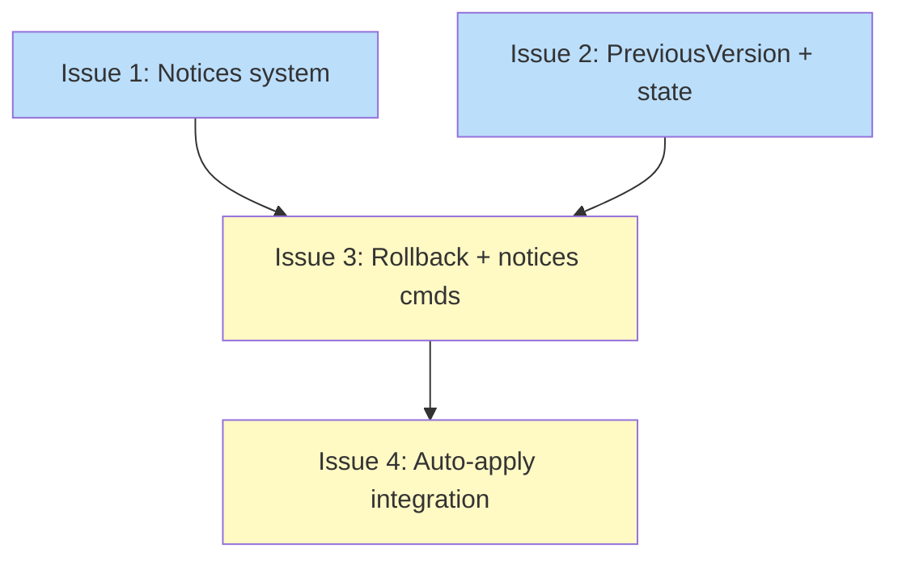

# PLAN: Auto-apply with rollback

## Status

Draft

## Scope Summary

Implement auto-apply (reads Feature 2 cache, installs pending updates via existing install flow with TryLock concurrency gate), manual rollback via PreviousVersion tracking, auto-rollback on failure, per-tool failure notices, and two new commands (`tsuku rollback`, `tsuku notices`).

## Decomposition Strategy

Horizontal. Four components with stable interfaces: the notices package is standalone, state changes (PreviousVersion + WithoutLock) are consumed by both commands and auto-apply, CLI commands depend on notices + state, and auto-apply orchestrates everything. Issues 1 and 2 are independent and can be parallelized.

## Issue Outlines

### Issue 1: feat(notices): add failure notice system

**Goal:** Add the `internal/notices/` package with the `Notice` struct and per-tool JSON file operations for persisting failure records at `$TSUKU_HOME/notices/`.

**Acceptance Criteria:**
- [ ] `internal/notices/notices.go` with `Notice` struct: Tool, AttemptedVersion, Error, Timestamp, Shown
- [ ] `WriteNotice(noticesDir, notice)` -- atomic write (tmp + rename), creates dir if missing
- [ ] `ReadAllNotices(noticesDir)` -- directory scan, skips corrupt/non-JSON/dotfiles, returns nil for missing dir
- [ ] `ReadUnshownNotices(noticesDir)` -- filters for `Shown == false`
- [ ] `MarkShown(noticesDir, toolName)` -- reads, sets `Shown = true`, rewrites
- [ ] `RemoveNotice(noticesDir, toolName)` -- deletes file, nil for non-existent
- [ ] `NoticesDir(homeDir)` -- returns `filepath.Join(homeDir, "notices")`
- [ ] Unit tests: round-trip, corrupt file skip, unshown filter, MarkShown persistence, overwrite, missing dir

**Dependencies:** None

### Issue 2: feat(install): add PreviousVersion tracking and WithoutLock state methods

**Goal:** Add `PreviousVersion` to `ToolState` and `UpdateToolWithoutLock`/`GetToolStateWithoutLock` to `StateManager`, enabling rollback and auto-apply within externally held lock scopes.

**Acceptance Criteria:**
- [ ] `PreviousVersion string` field on `ToolState` with JSON tag `"previous_version,omitempty"`
- [ ] `InstallWithOptions` snapshots `PreviousVersion = old ActiveVersion` when versions differ
- [ ] `Activate` sets `PreviousVersion` when switching versions
- [ ] Explicit install with pinned version clears `PreviousVersion`
- [ ] `UpdateToolWithoutLock` uses `loadWithoutLock`/`saveWithoutLock` (caller holds file lock)
- [ ] `GetToolStateWithoutLock` reads state via `loadWithoutLock`
- [ ] Both methods have doc comments stating locking obligations
- [ ] Unit tests: install v1->v2 sets PreviousVersion, reinstall same version is no-op, WithoutLock methods work under external lock

**Dependencies:** None

### Issue 3: feat(cli): add rollback and notices commands

**Goal:** Add `tsuku rollback <tool>` using PreviousVersion + Activate(), and `tsuku notices` displaying all failure notice files.

**Acceptance Criteria:**
- [ ] `cmd/tsuku/cmd_rollback.go` with `cobra.ExactArgs(1)`
- [ ] Reads `PreviousVersion` from state, errors if empty ("no previous version to roll back to")
- [ ] Verifies previous version directory exists, errors if missing
- [ ] Calls `mgr.Activate(tool, previousVersion)` to switch symlinks
- [ ] Does not modify `Requested` field
- [ ] Prints confirmation message on success
- [ ] `cmd/tsuku/cmd_notices.go` with `cobra.NoArgs`
- [ ] Reads all notices via `ReadAllNotices`, displays sorted by timestamp
- [ ] Shows tool name, attempted version, error, timestamp for each
- [ ] Prints "no notices" when empty
- [ ] Both registered via `rootCmd.AddCommand` in `init()`
- [ ] Unit tests: rollback success, empty PreviousVersion error, missing directory error, notices display, empty notices

**Dependencies:** Issue 1, Issue 2

### Issue 4: feat(updates): add auto-apply with rollback integration

**Goal:** Implement `MaybeAutoApply` with TryLock gate, callback injection, auto-rollback on failure, notice writing, and PersistentPreRun wiring.

**Acceptance Criteria:**
- [ ] `InstallFunc func(toolName, version, constraint string) error` callback type in `apply.go`
- [ ] `MaybeAutoApply(cfg, userCfg, installFn)` -- TryLock on state.json.lock, read cache entries, install pending updates
- [ ] Returns early if auto-apply disabled or lock held
- [ ] Filters entries: `LatestWithinPin` non-empty, `Error` empty, differs from `ActiveVersion`
- [ ] Calls `installFn(tool, latestWithinPin, requested)` for each
- [ ] On success: removes consumed cache entry via `RemoveEntry`
- [ ] On failure: auto-rollback via `Activate(tool, previousVersion)`, write notice, remove cache entry
- [ ] Lock released (deferred) before user's command
- [ ] After apply cycle: display unshown notices on stderr, mark shown
- [ ] `main.go` wires `MaybeAutoApply` after `CheckAndSpawnUpdateCheck` with same skip list
- [ ] `main.go` provides `InstallFunc` wrapping `runInstallWithTelemetry`
- [ ] Unit tests: successful apply, failed apply + rollback + notice, TryLock contention skip, disabled, no pending entries, error entries skipped

**Dependencies:** Issue 1, Issue 2, Issue 3

## Dependency Graph

**Legend**: Blue = ready, Yellow = blocked

## Implementation Sequence

**Critical path:** Issue 1 or 2 (parallel) -> Issue 3 -> Issue 4

Issues 1 and 2 are independent foundations that can be implemented in parallel. Issue 3 builds the CLI commands on top of both. Issue 4 orchestrates auto-apply using all prior components. The diamond dependency pattern means the critical path length is 3 (not 4).
