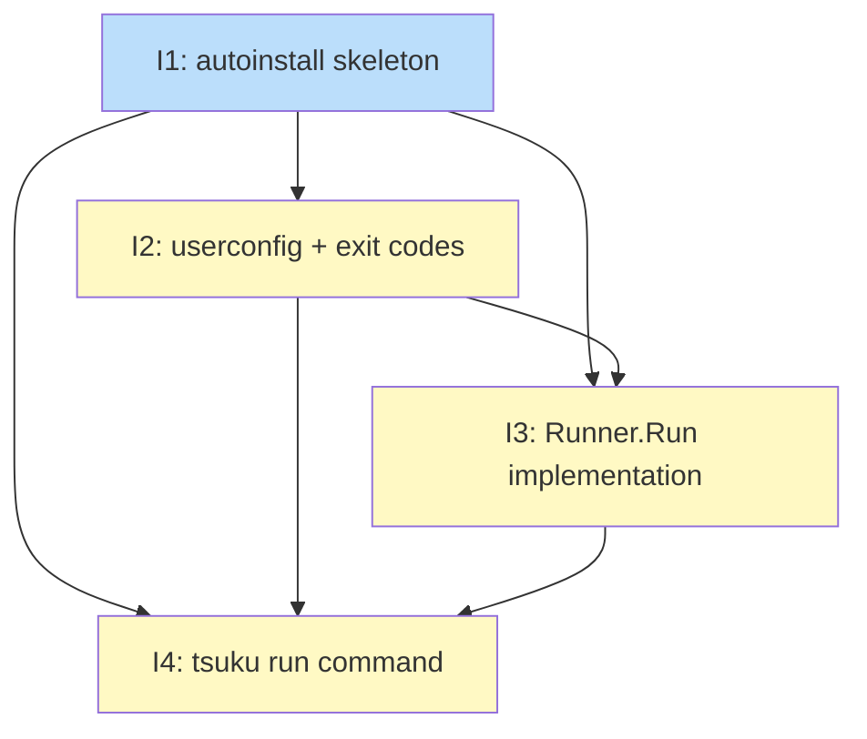

# PLAN: Auto-Install Flow

## Status

Draft

## Scope Summary

Implements `tsuku run <command> [args...]` backed by a new `internal/autoinstall/` library
that owns the install-then-exec flow. Covers three consent modes (suggest, confirm, auto),
four-step mode resolution with env-var escalation restriction, four security gates, NDJSON
audit logging, and `syscall.Exec` exit code fidelity.

## Decomposition Strategy

**Horizontal decomposition.** Each issue delivers one complete layer that the next depends
on: exported type surface before config extension, config extension before core flow, core
flow before CLI surface. The design's own four implementation phases map directly to four
issues in sequence. No integration risk between layers makes walking skeleton unnecessary —
each layer has a clear, stable interface before the next begins.

## Issue Outlines

### Issue 1: feat(autoinstall): add internal/autoinstall package skeleton

**Goal**: Create the `internal/autoinstall/` package skeleton with exported types,
interfaces, and a stub `Runner.Run` so downstream issues have a stable import target
from day one.

**Acceptance Criteria**:
- [ ] `internal/autoinstall/autoinstall.go` exists and compiles: contains `Mode` type, `ModeConfirm`/`ModeSuggest`/`ModeAuto` constants, `ProjectVersionResolver` interface, `Runner` struct, and `NewRunner` constructor
- [ ] `internal/autoinstall/run.go` exists and compiles: `Runner.Run(ctx context.Context, command string, args []string, mode Mode, resolver ProjectVersionResolver) error` returns a sentinel `ErrNotImplemented` error
- [ ] `internal/autoinstall/autoinstall_test.go` exists with test infrastructure: a mock `ProjectVersionResolver` implementation and injectable `io.Writer` helpers used in at least one passing test
- [ ] `go build ./...` passes with no errors
- [ ] `go test ./internal/autoinstall/...` passes
- [ ] Must deliver: `Mode` type with `ModeConfirm`, `ModeSuggest`, `ModeAuto` constants exported from `internal/autoinstall/` (required by Issue 2)
- [ ] Must deliver: `Runner` struct exported from `internal/autoinstall/` with `NewRunner` constructor so `resolveMode` in `cmd_run.go` can return the correct type (required by Issue 2)
- [ ] Must deliver: `Runner.Run` stub with the full final signature so `cmd_run.go` can call it without future signature changes (required by Issue 3)
- [ ] Must deliver: `autoinstall.NewRunner` and `Runner.Run` with stable signatures so `cmd_run.go` wiring in the `tsuku run` command compiles (required by Issue 4)

**Dependencies**: None

---

### Issue 2: feat(userconfig): add auto_install_mode key, resolveMode, and new exit codes

**Goal**: Add `AutoInstallMode` to `userconfig.Config`, register its config key, define
three new exit codes in `exitcodes.go`, and implement `resolveMode` with the four-step
priority chain including the env-var escalation restriction.

**Acceptance Criteria**:
- [ ] `internal/userconfig/userconfig.go`: `Config` struct gains `AutoInstallMode string` with TOML tag `auto_install_mode,omitempty`
- [ ] `AvailableKeys()` or equivalent key registry includes `auto_install_mode` with a description so `tsuku config set auto_install_mode auto` is discoverable
- [ ] `cmd/tsuku/exitcodes.go`: defines `ExitNotInteractive = 12`, `ExitUserDeclined = 13`, and `ExitForbidden = 14`
- [ ] `cmd/tsuku/cmd_run.go`: implements `resolveMode(flagMode string, cfg *userconfig.Config) (autoinstall.Mode, error)` with priority order: `--mode` flag > `TSUKU_AUTO_INSTALL_MODE` env var > `cfg.AutoInstallMode` > `ModeConfirm`
- [ ] Escalation restriction enforced: `TSUKU_AUTO_INSTALL_MODE=auto` is only honoured when `cfg.AutoInstallMode == "auto"`; env var alone cannot escalate to `auto` (it can downgrade from `auto` to `confirm` or `suggest`)
- [ ] Invalid mode strings (flag, env var, or config) return a descriptive error from `resolveMode`
- [ ] Unit tests cover all four priority steps: flag wins over env, env wins over config, config wins over default, default is `ModeConfirm`
- [ ] Unit tests cover the escalation restriction: `TSUKU_AUTO_INSTALL_MODE=auto` without matching config value resolves to `ModeConfirm`, not `ModeAuto`
- [ ] Unit tests cover env-var downgrade: `cfg.AutoInstallMode=auto` + `TSUKU_AUTO_INSTALL_MODE=confirm` resolves to `ModeConfirm`
- [ ] `go test ./...` passes
- [ ] Must deliver: `ExitNotInteractive = 12`, `ExitUserDeclined = 13`, `ExitForbidden = 14` constants in `exitcodes.go` (required by Issue 3)
- [ ] Must deliver: `resolveMode` implemented and covered by unit tests (required by Issue 3)
- [ ] Must deliver: `resolveMode` and the new exit codes present and importable (required by Issue 4)

**Dependencies**: Blocked by Issue 1

---

### Issue 3: feat(autoinstall): implement Runner.Run — lookup, mode dispatch, install, exec

**Goal**: Implement the full body of `Runner.Run` in `internal/autoinstall/`, including
binary index lookup, mode dispatch for all three consent modes, all four security gates,
syscall.Exec process replacement, and NDJSON audit logging.

**Acceptance Criteria**:
- [ ] `Runner.Run` calls `lookupBinaryCommand(command)` against the local binary index; if the index is not built, returns an error equivalent to `ExitIndexNotBuilt` (exit code 11) with a diagnostic message
- [ ] If the command is already installed, `Runner.Run` calls `syscall.Exec` immediately — no prompt, no install
- [ ] Security gate 1 (root guard): if `os.Geteuid() == 0`, `Runner.Run` returns an error wrapping `ExitForbidden` (14) before any install or exec
- [ ] Security gate 2 (config permission check): before honouring `auto_install_mode` from config, the implementation checks that `$TSUKU_HOME/config.toml` is mode 0600 and owned by the current user; if either check fails, a warning is logged to stderr and the effective mode treats `auto_install_mode` as unset (falling back to `confirm`)
- [ ] `ModeSuggest`: prints `Install with: tsuku install <recipe>` to stdout and returns an error that causes exit code 1; no install is attempted
- [ ] `ModeConfirm`: uses an injectable consent reader; on 'y' proceeds to install; on 'n' returns an error wrapping `ExitUserDeclined` (13); prompt text includes the recipe name and resolved version
- [ ] Security gate 3 (verification gate, auto mode only): if the matched recipe has neither `checksum_url` nor `signature_url`, `Runner.Run` falls back to `ModeConfirm` for this install rather than proceeding silently
- [ ] Security gate 4 (conflict gate, auto mode only): if the binary index returns more than one recipe for the command, `Runner.Run` falls back to `ModeConfirm` for this install
- [ ] `ModeAuto` (after passing gates 3 and 4): installs silently, then appends one NDJSON line to `$TSUKU_HOME/audit.log`; the file is created on first write with mode 0600; the line has fields `ts` (RFC-3339), `action` (`"auto-install"`), `recipe`, `version`, `mode` (`"auto"`)
- [ ] After any successful install, `syscall.Exec` replaces the tsuku process with the installed binary; all cleanup (temp files, deferred work) completes before `syscall.Exec` is called
- [ ] The consent reader is injectable (via a field or constructor parameter) so unit tests can supply a reader without spawning a TTY
- [ ] Unit tests cover: `ModeSuggest`, `ModeConfirm` with 'y', `ModeConfirm` with 'n', `ModeAuto` happy path, root guard (gate 1), config permission failure (gate 2), verification gate fallback (gate 3), conflict gate fallback (gate 4), install failure, index-not-built
- [ ] Must deliver: a fully implemented `Runner.Run` with the stable signature `Run(ctx context.Context, command string, args []string, mode Mode, resolver ProjectVersionResolver) error` (required by Issue 4)
- [ ] `go test ./internal/autoinstall/...` passes

**Dependencies**: Blocked by Issue 1, Issue 2

---

### Issue 4: feat(cmd): add tsuku run command with TTY gating and integration tests

**Goal**: Register `tsuku run` as a cobra subcommand, wire TTY gating for confirm mode,
and validate the end-to-end flow with integration tests.

**Acceptance Criteria**:
- [ ] `cmd/tsuku/cmd_run.go` defines a cobra command that registers `tsuku run <command> [args...]` as a subcommand in `cmd/tsuku/main.go`
- [ ] `--mode=<suggest|confirm|auto>` flag is bound to the `tsuku run` command and passed to `resolveMode`
- [ ] `--` separator is documented in `--help` output with an example: `tsuku run jq -- --arg foo bar`
- [ ] After `resolveMode` returns, if mode is `ModeConfirm` and `!term.IsTerminal(int(os.Stdin.Fd()))`, the command prints `tsuku: confirm mode requires a TTY; set TSUKU_AUTO_INSTALL_MODE=auto or use --mode=auto for non-interactive use` to stderr and exits with `ExitNotInteractive` (12); `Runner.Run` is not called
- [ ] When mode is not `ModeConfirm`, or when stdin is a TTY, the command delegates to `autoinstall.Runner.Run` with a `nil` `ProjectVersionResolver` (meaning latest version)
- [ ] `auto_install_mode` is registered in the tsuku config key registry with description `"Default install consent mode for tsuku run (suggest/confirm/auto)"`
- [ ] `tsuku run --help` documents all three modes (`suggest`, `confirm`, `auto`), the `TSUKU_AUTO_INSTALL_MODE` environment variable, and the `auto_install_mode` config key
- [ ] Integration test (subprocess): invokes `tsuku run` in `suggest` mode against a tool present in the binary index; asserts exit code 1 and stdout contains `tsuku install`
- [ ] Integration test (subprocess): invokes `tsuku run` in `confirm` mode with stdin redirected to a non-TTY (e.g., `/dev/null`); asserts exit code `ExitNotInteractive` (12)
- [ ] `go test ./...` passes
- [ ] `go vet ./...` passes

**Dependencies**: Blocked by Issue 1, Issue 2, Issue 3

## Dependency Graph

**Legend**: Green = done, Blue = ready, Yellow = blocked, Purple = needs-design, Orange = tracks-design/tracks-plan

## Implementation Sequence

**Critical path**: Issue 1 → Issue 2 → Issue 3 → Issue 4 (all 4 issues, strictly serial)

**Parallelization**: None. Each issue depends on all preceding issues. This is by design — the library surface (I1) must exist before the config can use its types (I2), the config types must exist before the core flow can use the exit codes (I3), and the full core must be implemented before the command can delegate to it (I4).

**Recommended order**:
1. **Issue 1** (ready): Create `internal/autoinstall/` package skeleton. Unblocks everything.
2. **Issue 2** (after I1): Extend `internal/userconfig/`, define exit codes, implement `resolveMode` with escalation restriction. Security-critical — the env-var escalation rule prevents `.envrc` injection.
3. **Issue 3** (after I1, I2): Implement `Runner.Run` with all four security gates. Security-critical — the verification gate and conflict gate must be correct before any integration.
4. **Issue 4** (after I1, I2, I3): Wire the cobra command, TTY gating, and integration tests. User-visible delivery.
