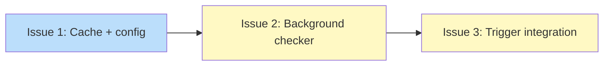

# PLAN: Background update check infrastructure

## Status

Draft

## Scope Summary

Implement the background update check infrastructure from DESIGN-background-update-checks.md: per-tool cache files with sentinel-based staleness, an `[updates]` config section, a background checker process, and a layered trigger system wired into hook-env, tsuku run, and PersistentPreRun.

## Decomposition Strategy

Horizontal. The design's three implementation phases have stable interfaces between them: the cache layer is consumed by the checker, which is spawned by the trigger. Each issue builds one component fully before the next begins. No walking skeleton needed because the component boundaries and interfaces are well-defined in the design doc.

## Issue Outlines

### Issue 1: feat(updates): add update check cache and config surface

**Goal:** Add the update check cache layer (`internal/updates/cache.go`) and the `[updates]` config surface (`internal/userconfig/userconfig.go`) that downstream update infrastructure depends on.

**Acceptance Criteria:**
- [ ] `internal/updates/cache.go` defines `UpdateCheckEntry` struct with fields: `Tool`, `ActiveVersion`, `Requested`, `LatestWithinPin`, `LatestOverall`, `Source`, `CheckedAt`, `ExpiresAt`, `Error`
- [ ] `ReadEntry(cacheDir, toolName)` reads and unmarshals `<toolname>.json`, returning `nil, nil` when file does not exist
- [ ] `ReadAllEntries(cacheDir)` scans directory, returns valid entries, skips non-JSON and dotfiles
- [ ] `WriteEntry(cacheDir, entry)` writes atomically via temp+rename, creating directory with `os.MkdirAll` if missing
- [ ] `RemoveEntry(cacheDir, toolName)` deletes the tool's cache file, returns nil if not found
- [ ] `TouchSentinel(cacheDir)` creates or updates mtime of `.last-check`
- [ ] `UpdatesConfig` struct in userconfig with 5 pointer fields: `Enabled`, `AutoApply`, `CheckInterval`, `NotifyOutOfChannel`, `SelfUpdate`
- [ ] 5 getter methods with env var precedence: `UpdatesEnabled()`, `UpdatesAutoApplyEnabled()`, `UpdatesCheckInterval()`, `UpdatesNotifyOutOfChannel()`, `UpdatesSelfUpdate()`
- [ ] `Get`/`Set`/`AvailableKeys` extended for `updates.*` keys
- [ ] Unit tests cover cache round-trip, atomic write, missing directory creation, sentinel touch, corrupt file handling, config getter precedence chains

**Dependencies:** None

### Issue 2: feat(updates): add background update checker

**Goal:** Implement the background checker process that iterates installed tools, resolves version availability via existing provider APIs, and writes per-tool cache files atomically.

**Acceptance Criteria:**
- [ ] `internal/updates/checker.go` with `RunUpdateCheck(ctx, cfg)` that acquires exclusive flock on `.lock`
- [ ] Double-check pattern: re-check sentinel freshness after lock acquisition
- [ ] Loads state.json, iterates installed tools, calls `ResolveWithinBoundary` and `ResolveLatest` via ProviderFactory
- [ ] Writes `UpdateCheckEntry` per tool via `WriteEntry`, populates `Error` field on failures
- [ ] Touches sentinel after all tools processed, releases flock
- [ ] `cmd/tsuku/cmd_check_updates.go` registers hidden `check-updates` subcommand with 10s context timeout
- [ ] Subcommand suppresses stdout/stderr, respects `UpdatesEnabled()`, exits early if disabled
- [ ] Tests: happy path with mock providers, error path (provider failure), double-check optimization

**Dependencies:** Issue 1

### Issue 3: feat(updates): add layered trigger integration

**Goal:** Wire the background update check trigger into all three entry points (shell hook, shim invocation, direct commands) using a non-blocking flock protocol that keeps prompt latency under 2ms.

**Acceptance Criteria:**
- [ ] `TryLockExclusive() (bool, error)` added to `FileLock` in `filelock.go` with `filelock_unix.go` (LOCK_EX|LOCK_NB) and `filelock_windows.go` (LOCKFILE_FAIL_IMMEDIATELY)
- [ ] `internal/updates/trigger.go` with `CheckAndSpawnUpdateCheck(cfg, userCfg)`: stat sentinel, check config, attempt flock, spawn detached process
- [ ] Returns immediately when updates disabled, sentinel fresh, or lock held
- [ ] `hook_env.go` calls trigger after `ComputeActivation()`, loading userconfig
- [ ] `cmd_run.go` calls trigger after config load, before `runner.Run()`
- [ ] `main.go` PersistentPreRun calls trigger with skip list (check-updates, hook-env, run, help, version, completion)
- [ ] Spawned process is fully detached, stdout/stderr redirected
- [ ] All trigger errors logged at debug level and swallowed
- [ ] Tests: fresh sentinel (no spawn), stale (spawn), missing (spawn), lock held (no spawn), disabled via config/env

**Dependencies:** Issue 1, Issue 2

## Dependency Graph

**Legend**: Blue = ready, Yellow = blocked

## Implementation Sequence

**Critical path:** Issue 1 -> Issue 2 -> Issue 3 (linear, no parallelization)

All three issues are on the critical path. The sequence follows the design's implementation phases: foundation (cache + config), then the consumer (checker), then the wiring (trigger). Each issue can be implemented and tested in isolation before the next begins.
