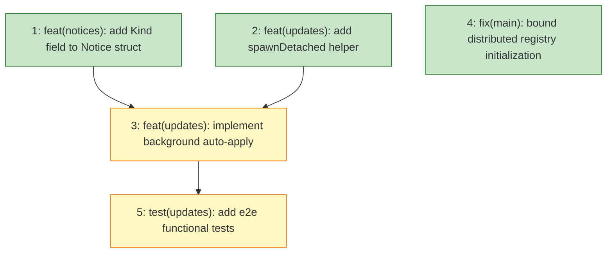

# Plan: Background Updates

## Status

Draft — ready for implementation.

## Scope Summary

Replace the synchronous `MaybeAutoApply` call in `PersistentPreRun` with a detached `apply-updates` subprocess, ensuring every tsuku command returns immediately regardless of pending tool updates. Includes notice schema extension, process-group isolation, registry timeout safety, and e2e functional test coverage.

## Decomposition Strategy

**Horizontal.** The design defines four prerequisite-ordered implementation phases with stable interfaces between them. Issue 1 (notice schema) and Issue 2 (spawn helper) are independent prerequisites for Issue 3 (core feature). Issue 5 (e2e tests) requires the complete feature from Issue 3. Issue 4 (registry timeout) is fully independent and can land at any point.

Walking skeleton was considered but rejected: the components interact through well-defined interfaces (a `Kind` constant, a `spawnDetached` function), and horizontal decomposition surfaces integration risk at each merge rather than in one large skeleton issue.

## Issue Outlines

### Issue 1: feat(notices): add Kind field to Notice struct

**Goal**

Add a `Kind string \`json:"kind,omitempty"\`` field to the `Notice` struct in `internal/notices/notices.go` with `KindUpdateResult` and `KindAutoApplyResult` constants. The `omitempty` tag ensures existing notice files on disk (which have no `kind` key) deserialize as `Kind == ""` and that writing with `Kind == ""` produces no `kind` key in the output — preserving full backward compatibility without migration.

**Acceptance Criteria**

- [ ] `Notice` struct in `internal/notices/notices.go` gains a `Kind string` field with tag `json:"kind,omitempty"`.
- [ ] Two exported constants declared in the same package:
  - `KindUpdateResult = ""` (zero value; represents all existing notices)
  - `KindAutoApplyResult = "auto_apply_result"`
- [ ] Deserializing a JSON object with no `kind` key produces a `Notice` where `Kind == ""`.
- [ ] Round-trip test: marshal a `Notice` with `Kind = KindAutoApplyResult`, unmarshal the result, assert `Kind == "auto_apply_result"` is preserved.
- [ ] omitempty test: marshal a `Notice` with `Kind == ""` and assert the JSON output does not contain the string `"kind"`, confirming backward compatibility for existing notice files on disk.
- [ ] All existing tests in `internal/notices/` pass without modification.
- [ ] `go vet ./internal/notices/...` passes.

**Dependencies**

None.

---

### Issue 2: feat(updates): add spawnDetached helper with process group isolation

**Goal**

Add a `spawnDetached(cmd *exec.Cmd) error` helper in `internal/updates/trigger.go` that places background subprocesses in their own process group on Unix, preventing SIGHUP propagation when the parent terminal closes. The helper uses build-tagged files: `spawn_unix.go` sets `SysProcAttr{Setpgid: true}`; `spawn_windows.go` is a no-op stub. Update `spawnChecker` to call `spawnDetached` instead of managing stdio and calling `cmd.Start()` directly.

**Acceptance Criteria**

- [ ] `internal/updates/spawn_unix.go` exists with build tag `//go:build !windows` and contains `func setSysProcAttr(cmd *exec.Cmd)` that sets `cmd.SysProcAttr = &syscall.SysProcAttr{Setpgid: true}`.
- [ ] `internal/updates/spawn_windows.go` exists with build tag `//go:build windows` and contains a no-op `func setSysProcAttr(cmd *exec.Cmd)` stub.
- [ ] `internal/updates/trigger.go` contains `func spawnDetached(cmd *exec.Cmd) error` that calls `setSysProcAttr`, sets `cmd.Stdin`, `cmd.Stdout`, and `cmd.Stderr` to `nil`, calls `cmd.Start()`, and returns the error from `cmd.Start()` without swallowing it.
- [ ] `spawnDetached` returns a non-nil error when `cmd.Start()` fails (e.g., nonexistent binary path); the error is not swallowed inside `spawnDetached`.
- [ ] `spawnChecker` is updated to call `spawnDetached`; its observable behavior is unchanged.
- [ ] `internal/updates/spawn_unix_test.go` with build tag `//go:build !windows` asserts `cmd.SysProcAttr != nil` and `cmd.SysProcAttr.Setpgid == true` after calling `setSysProcAttr` — no subprocess spawned.
- [ ] A unit test asserts `spawnDetached` returns a non-nil error when given an `exec.Cmd` pointing at a nonexistent binary path.
- [ ] `go build ./...` succeeds on Linux and macOS.
- [ ] `GOOS=windows go build ./...` succeeds.
- [ ] `go vet ./...` passes.
- [ ] All existing tests in `internal/updates/trigger_test.go` pass without modification.

**Dependencies**

None.

---

### Issue 3: feat(updates): implement background auto-apply

**Goal**

Add the `apply-updates` hidden subcommand and `MaybeSpawnAutoApply` function, then replace the synchronous `MaybeAutoApply` call in `PersistentPreRun` with the new spawn call so that auto-apply runs in the background and never blocks foreground commands.

**Acceptance Criteria**

- [ ] `cmd/tsuku/cmd_apply_updates.go` exists as a hidden subcommand (`Hidden: true`, `Use: "apply-updates"`) with `SilenceUsage` and `SilenceErrors` both set to `true`.
- [ ] The subcommand sets a 5-minute top-level `context.WithTimeout` at entry to prevent indefinite hangs from stalled network connections.
- [ ] The subcommand redirects `os.Stdout` and `os.Stderr` to `os.DevNull` for silent background operation.
- [ ] The subcommand calls `TryLockExclusive` on `state.json.lock`; exits silently (returns `nil`) if the lock is not acquired.
- [ ] For each pending cache entry (same filtering logic as `MaybeAutoApply`: `LatestWithinPin != ""`, `Error == ""`, `LatestWithinPin != ActiveVersion`, skipping self-updates), the subcommand:
  - Calls the install flow via `runInstallWithTelemetry`
  - Writes a `Notice` with `Kind: notices.KindAutoApplyResult` and `Shown: false` via `notices.WriteNotice`
  - Calls `updates.RemoveEntry` to consume the cache entry regardless of success or failure
- [ ] `internal/updates/trigger.go` contains `MaybeSpawnAutoApply(cfg *config.Config, userCfg *userconfig.Config) error` that:
  - Returns immediately if `userCfg == nil` or auto-apply is not enabled
  - Returns immediately if no pending entries exist
  - Uses a dedicated probe lock file (e.g., `.apply-lock`) to deduplicate spawns — acquires non-blocking, releases immediately, exits if not acquired
  - Calls `spawnDetached` with an `exec.Cmd` for `tsuku apply-updates`
  - Swallows all errors at debug log level (trigger failures must never block command execution)
- [ ] `PersistentPreRun` in `cmd/tsuku/main.go` replaces the `MaybeAutoApply` call with `updates.MaybeSpawnAutoApply(cfg, userCfg)`.
- [ ] `apply-updates` is registered in `rootCmd.AddCommand` in `cmd/tsuku/main.go`.
- [ ] `go build ./cmd/tsuku` succeeds.
- [ ] `go vet ./...` passes with no new errors.
- [ ] Existing tests in `internal/updates/trigger_test.go` and `internal/updates/apply_test.go` pass without modification (or updated only where the synchronous `MaybeAutoApply` call site changed).

**Dependencies**

- Issue 1 — `notices.KindAutoApplyResult` must exist before `cmd_apply_updates.go` can compile.
- Issue 2 — `spawnDetached` must exist before `MaybeSpawnAutoApply` can call it.

---

### Issue 4: fix(main): bound distributed registry initialization to 3-second timeout

**Goal**

Add a 3-second shared deadline to all `distributed.NewDistributedRegistryProvider` calls in `main.go init()` so startup never hangs on slow or unreachable registry sources. The existing warning-and-skip path handles timeouts; only the context binding is missing.

**Acceptance Criteria**

- [ ] `cmd/tsuku/main.go init()` creates a context with a 3-second deadline before the distributed registry loop: `initCtx, cancel := context.WithTimeout(context.Background(), 3*time.Second)` with `defer cancel()`.
- [ ] The same `initCtx` is passed to every `distributed.NewDistributedRegistryProvider` call inside the loop (replacing `context.Background()`).
- [ ] When a source times out, the existing warning-and-skip path handles it without any additional error-handling code.
- [ ] `go vet ./...` passes with no new warnings.
- [ ] `go test ./...` passes.

**Dependencies**

None.

---

### Issue 5: test(updates): add e2e functional tests for background auto-apply

**Goal**

Add end-to-end functional tests that verify the background auto-apply subprocess returns control to the foreground immediately, writes notice files across process boundaries, displays those notices on the next command invocation, and writes notices even when an install fails.

**Acceptance Criteria**

**Test infrastructure**

- [ ] All test functions and helpers live in `internal/updates/e2e_test.go` with build tag `//go:build e2e`.
- [ ] `runTsuku(t, tsukuHome, args...)` helper spawns the real tsuku binary (located via `TSUKU_TEST_BINARY` env var or path resolution), sets `TSUKU_HOME=tsukuHome` and `TSUKU_TELEMETRY=0`, captures combined stdout/stderr, returns output and exit code.
- [ ] If the tsuku binary cannot be located, the helper calls `t.Skip("tsuku binary not found; set TSUKU_TEST_BINARY to run e2e tests")`.
- [ ] `injectCacheEntry(t, cacheDir string, entry updates.UpdateCheckEntry)` marshals the entry to JSON and writes it to `filepath.Join(cacheDir, entry.Tool+".json")`, creating the directory with `os.MkdirAll` if absent.
- [ ] `waitForNotice(t, noticesDir, toolName string, timeout time.Duration)` polls for `filepath.Join(noticesDir, toolName+".json")` at 50ms intervals; calls `t.Fatalf` if the file does not appear within the timeout.
- [ ] Each test uses an isolated `t.TempDir()` as `TSUKU_HOME`.

**TestE2E_BackgroundApplyReturnsImmediately**

- [ ] Injects a valid cache entry (real tool, `LatestWithinPin` different from `ActiveVersion`, `Error: ""`).
- [ ] Runs `tsuku list` with a 2-second deadline around the `runTsuku` call.
- [ ] Asserts `runTsuku` returns within the 2-second deadline — the foreground command must not block.
- [ ] Does not assert on notice file presence (background timing not guaranteed within 2 seconds).

**TestE2E_BackgroundApplyWritesNotices**

- [ ] Injects a valid cache entry for a real tool.
- [ ] Runs `tsuku list` to trigger `MaybeSpawnAutoApply`.
- [ ] Calls `waitForNotice(t, noticesDir, toolName, 10*time.Second)` to block until the notice file appears.
- [ ] Reads the notice file and unmarshals it into a `notices.Notice` struct.
- [ ] Asserts `notice.Kind == notices.KindAutoApplyResult` (exactly `"auto_apply_result"`).
- [ ] Asserts `notice.Tool == toolName`.

**TestE2E_BackgroundApplyNoticesDisplayed**

- [ ] Injects a valid cache entry for a real tool.
- [ ] Runs `tsuku list` to trigger the background subprocess.
- [ ] Calls `waitForNotice` to wait for the notice file.
- [ ] Runs a second `tsuku list` (any command through `PersistentPreRun`).
- [ ] Asserts the second command's combined output contains the tool name, confirming the notice was rendered to stderr.
- [ ] Reads the notice file after the second command and asserts `notice.Shown == true`.

**TestE2E_BackgroundApplyWritesNoticeOnInstallFailure**

- [ ] Injects a cache entry where `LatestWithinPin` is set to a version that cannot exist (e.g., `"99999.0.0-nonexistent"`), ensuring the install will fail.
- [ ] Runs `tsuku list` to trigger `MaybeSpawnAutoApply`.
- [ ] Calls `waitForNotice(t, noticesDir, toolName, 10*time.Second)` to block until the notice file appears.
- [ ] Reads the notice file and asserts `notice.Kind == notices.KindAutoApplyResult`, confirming the notice was written despite the failed install.
- [ ] Asserts the cache entry file at `filepath.Join(cacheDir, toolName+".json")` is absent after `waitForNotice` returns, confirming `RemoveEntry` was called on failure.

**Build and vet**

- [ ] `go vet ./...` passes with no new errors.
- [ ] `go test -tags=e2e ./internal/updates/ -run TestE2E_` runs without compilation errors (tests may skip if binary is absent).

**Dependencies**

- Issue 3 — `apply-updates` subcommand must be registered and reachable; `MaybeSpawnAutoApply` must be wired into `PersistentPreRun`; notice files must be written with `Kind: "auto_apply_result"`; `RemoveEntry` must be called on both success and failure paths.

---

## Dependency Graph

## Implementation Sequence

**Immediate (no blockers):** Issues 1, 2, and 4 can all start in parallel.

**After Issues 1 and 2 complete:** Issue 3 can start. Both must be merged first — Issue 3 imports the `KindAutoApplyResult` constant from Issue 1 and calls `spawnDetached` from Issue 2.

**After Issue 3 completes:** Issue 5 can start. The e2e tests spawn real `tsuku` processes and require the `apply-updates` subcommand to be registered and functional.

**Critical path:** Issue 1 (or 2) → Issue 3 → Issue 5, depth 3.

Issue 4 is fully independent and can be merged at any point without affecting the critical path.
