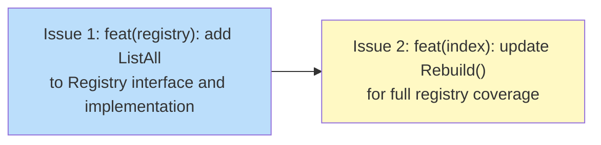

# PLAN: Binary Index — Full Registry Coverage

## Status

Draft

## Scope Summary

Extend the binary index to cover all registry recipes, not just locally-cached ones.
After this plan is implemented, `tsuku which <command>` returns results for any
installable command following a single `tsuku update-registry`, even on a clean machine.

## Decomposition Strategy

**Horizontal decomposition.** The interface extension (`internal/registry`) is a
hard compile-time prerequisite for the `Rebuild()` update (`internal/index`). Each
issue fully completes one layer before the next begins. No end-to-end flow needs
early integration feedback — the two packages have a clear, stable boundary.

## Issue Outlines

### Issue 1: feat(registry): add ListAll to Registry interface and implementation

**Goal**

Extend the `index.Registry` interface with `ListAll`, `FetchRecipe`, and `CacheRecipe`
methods, and implement `ListAll` on `*registry.Registry` using the cached manifest.

**Acceptance Criteria**

- [ ] `index.Registry` in `internal/index/binary_index.go` declares `ListAll(ctx context.Context) ([]string, error)`
- [ ] `index.Registry` in `internal/index/binary_index.go` declares `FetchRecipe(ctx context.Context, name string) ([]byte, error)`
- [ ] `index.Registry` in `internal/index/binary_index.go` declares `CacheRecipe(name string, data []byte) error`
- [ ] A doc comment on `ListAll` in the interface notes that `ListCached` is retained on `*registry.Registry` for the fallback path and must not be removed
- [ ] `(*registry.Registry).ListAll` is implemented in `internal/registry/registry.go`: reads names from `GetCachedManifest()`; falls back to `ListCached()` when the manifest is unavailable or returns an error
- [ ] When `GetCachedManifest()` returns a non-nil manifest, `ListAll` returns exactly the names in `manifest.Recipes` and does not call `ListCached()`
- [ ] Test stubs in `internal/index/rebuild_test.go` implement all three new interface methods (`ListAll`, `FetchRecipe`, `CacheRecipe`) with fixed return values sufficient to satisfy the compiler
- [ ] `go build ./cmd/tsuku` passes
- [ ] `go test ./internal/index/... ./internal/registry/...` passes

**Dependencies**

None

---

### Issue 2: feat(index): update Rebuild() for full registry coverage

**Goal**

Update `Rebuild()` in `internal/index/rebuild.go` to enumerate all registry recipes
via `ListAll()` and fetch uncached recipes with bounded concurrency, replacing the
`ListCached()`-only path that leaves the index empty on a clean machine.

**Acceptance Criteria**

- [ ] `Rebuild()` against a mock registry with an empty cache but a populated manifest produces index rows for all manifest recipes
- [ ] `Rebuild()` against a mock where some recipes return fetch errors skips those recipes and continues indexing the rest
- [ ] `Rebuild()` on a fully-cached registry (warm machine) uses only `GetCached()`, never `FetchRecipe()`
- [ ] `Rebuild()` calls `CacheRecipe()` after each successful `FetchRecipe()` call; a subsequent `Rebuild()` call with the same mock produces no `FetchRecipe()` calls
- [ ] `TestRebuild_Transactional` is replaced with two tests: one verifying that a fetch error on one recipe does not prevent other recipes from being indexed, and one verifying that DB write errors during the insert phase roll back all inserts atomically
- [ ] Recipe names containing `/`, `..`, or null bytes are rejected with `slog.Warn` and skipped before being passed to any URL or path construction
- [ ] `fetchRemoteRecipe` wraps `resp.Body` with `io.LimitReader(resp.Body, 1<<20)` before `io.ReadAll`
- [ ] `go test ./internal/index/... ./internal/registry/...` passes
- [ ] `go build ./cmd/tsuku` passes

**Dependencies**

Blocked by Issue 1

---

## Dependency Graph

Legend: Blue = ready, Yellow = blocked

## Implementation Sequence

**Critical path**: Issue 1 → Issue 2 (2 issues, no parallelization possible)

**Recommended order:**

1. **Issue 1** — interface extension is purely additive and carries no behavioral
   risk. Once it passes `go build` and `go test`, Issue 2 can begin.

2. **Issue 2** — all behavioral changes live here. Implements bounded concurrency,
   name validation, response size cap, and test replacements. The security-sensitive
   ACs (path traversal, memory exhaustion) should be verified before marking complete.
