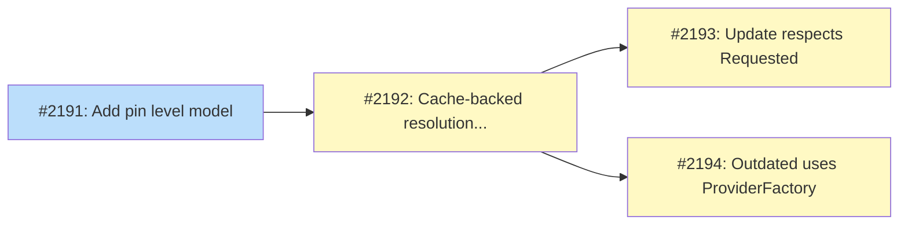

# PLAN: Channel-aware version resolution

## Status

Active

## Scope summary

Establish version channel pinning so `tsuku update` respects install-time constraints, fix `tsuku outdated` to check all provider types, and cache ResolveLatest through the existing ListVersions cache. This is Feature 1 of the auto-update roadmap and the foundation for all downstream auto-update features.

## Decomposition strategy

**Horizontal.** The design describes a linear dependency chain with well-defined interfaces between layers: pin model (pure functions) -> resolution helper (composes pin model with cache) -> command integration (wires helper into existing commands). Each layer is independently testable and reviewable. Walking skeleton doesn't apply since there's no end-to-end flow to slice through -- the layers build bottom-up.

## Issue Outlines

### Issue 1: feat(install): add pin level model
- **Complexity**: testable
- **Goal**: Add PinLevel type and derivation functions that compute pin level from the Requested field
- **Acceptance Criteria**:
  - [ ] PinLevel type with PinLatest, PinMajor, PinMinor, PinExact, PinChannel values
  - [ ] PinLevelFromRequested derives pin level from component count
  - [ ] VersionMatchesPin uses dot-boundary matching
  - [ ] ValidateRequested rejects path traversal and unexpected characters
  - [ ] Unit tests cover all pin levels and edge cases
- **Dependencies**: None

### Issue 2: feat(version): add cache-backed pin-aware resolution helper
- **Complexity**: testable
- **Goal**: Add ResolveWithinBoundary helper and modify CachedVersionLister.ResolveLatest to derive from cached ListVersions
- **Acceptance Criteria**:
  - [ ] ResolveWithinBoundary routes through cached list for VersionLister providers
  - [ ] Falls back to ResolveVersion for VersionResolver-only providers
  - [ ] CachedVersionLister.ResolveLatest derives from cached version list
  - [ ] Unit tests with mock providers covering all paths
- **Dependencies**: Issue 1

### Issue 3: fix(update): respect Requested field version constraint
- **Complexity**: testable
- **Goal**: Wire ResolveWithinBoundary into the update command so it resolves within the pin boundary
- **Acceptance Criteria**:
  - [ ] update.go reads Requested from state.Installed[tool].Versions[active].Requested
  - [ ] Passes Requested as version constraint to runInstallWithTelemetry
  - [ ] tsuku update node after install node@18 stays within 18.x.y
- **Dependencies**: Issue 2

### Issue 4: fix(outdated): use ProviderFactory for all version providers
- **Complexity**: testable
- **Goal**: Replace hard-coded GitHub resolution with ProviderFactory + ResolveWithinBoundary
- **Acceptance Criteria**:
  - [ ] outdated uses ProviderFactory.ProviderFromRecipe for all tools
  - [ ] PinExact tools excluded from outdated output
  - [ ] All provider types covered, not just GitHub
- **Dependencies**: Issue 2

## Implementation Issues

### Milestone: [Channel-aware version resolution](https://github.com/tsukumogami/tsuku/milestone/110)

| Issue | Dependencies | Complexity |
|-------|--------------|------------|
| [#2191: add pin level model](https://github.com/tsukumogami/tsuku/issues/2191) | None | testable |
| _Add PinLevel type and derivation functions (PinLevelFromRequested, VersionMatchesPin with dot-boundary matching, ValidateRequested). Pure functions with no external dependencies -- the foundation everything else builds on._ | | |
| [#2192: add cache-backed pin-aware resolution helper](https://github.com/tsukumogami/tsuku/issues/2192) | [#2191](https://github.com/tsukumogami/tsuku/issues/2191) | testable |
| _With the pin model in place, add ResolveWithinBoundary() that routes pin-aware queries through the cached ListVersions for VersionLister providers, falling back to ResolveVersion for resolver-only providers. Modifies CachedVersionLister.ResolveLatest() to derive from the cache._ | | |
| [#2193: respect Requested field version constraint](https://github.com/tsukumogami/tsuku/issues/2193) | [#2192](https://github.com/tsukumogami/tsuku/issues/2192) | testable |
| _Wire ResolveWithinBoundary into the update command. Reads Requested from state and passes it as the version constraint so `tsuku update node` after `install node@18` stays within 18.x.y._ | | |
| [#2194: use ProviderFactory for all version providers](https://github.com/tsukumogami/tsuku/issues/2194) | [#2192](https://github.com/tsukumogami/tsuku/issues/2192) | testable |
| _Replace hard-coded GitHub resolution in outdated with ProviderFactory + ResolveWithinBoundary. Covers all provider types. Excludes PinExact tools from output. Can parallelize with #2193._ | | |

## Dependency graph

**Legend**: Green = done, Blue = ready, Yellow = blocked

## Implementation sequence

**Critical path**: #2191 -> #2192 -> #2193 (or #2194). Three steps deep, each independently shippable.

**Parallelization**: #2193 (update fix) and #2194 (outdated fix) are independent of each other and can be worked on simultaneously after #2192 completes. Both consume ResolveWithinBoundary but touch different command files.

**Suggested order**: Start with #2191 (no blockers, pure functions, fast to implement and review). Then #2192 (the core logic). Then #2193 and #2194 in either order or in parallel.
