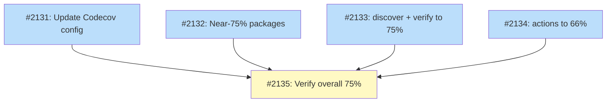

# PLAN: Code Coverage 75%

## Status

Active

## Scope Summary

Raise Codecov-reported code coverage from ~70.7% to above 75% by adding unit tests to under-covered packages and updating the Codecov configuration to reflect the new target.

## Decomposition Strategy

**Horizontal decomposition.** Each issue targets a distinct set of packages grouped by current coverage level. The packages don't share test infrastructure or fixtures, so issues can proceed independently. The final verification issue depends on all others to confirm the aggregate number.

## Issue Outlines

_(omitted in multi-pr mode -- see Implementation Issues below)_

## Implementation Issues

### Milestone: [Code Coverage 75%](https://github.com/tsukumogami/tsuku/milestone/108)

| Issue | Dependencies | Complexity |
|-------|--------------|------------|
| [#2131: chore: update Codecov configuration for 75% target](https://github.com/tsukumogami/tsuku/issues/2131) | None | testable |
| _Update `codecov.yml` to set the project target to 75% and add a color range so the badge shows green once we hit our target. Quick config change that aligns reporting with goals._ | | |
| [#2132: test: cover near-75% packages (executor, validate, builders, userconfig)](https://github.com/tsukumogami/tsuku/issues/2132) | None | testable |
| _Add tests to four packages already within a few statements of 75%: executor (72.7%), validate (73.2%), builders (74.8%), userconfig (74.0%). Roughly 42 statements total, the easiest coverage wins._ | | |
| [#2133: test: cover internal/discover and internal/verify to 75%](https://github.com/tsukumogami/tsuku/issues/2133) | None | testable |
| _Bring `internal/discover` from 67.3% and `internal/verify` from 57.0% to 75% each. About 247 statements to cover, with gaps in discovery chain logic, ecosystem probing, dependency checking, and download verification._ | | |
| [#2134: test: cover internal/actions to 66%](https://github.com/tsukumogami/tsuku/issues/2134) | None | testable |
| _The largest package at 7681 statements and 57.9% coverage. Getting it to 66% covers ~620 more statements. Focus on actions testable without network access (extract, chmod, install_binaries, cargo_install stubs)._ | | |
| [#2135: test: verify overall coverage exceeds 75%](https://github.com/tsukumogami/tsuku/issues/2135) | [#2131](https://github.com/tsukumogami/tsuku/issues/2131), [#2132](https://github.com/tsukumogami/tsuku/issues/2132), [#2133](https://github.com/tsukumogami/tsuku/issues/2133), [#2134](https://github.com/tsukumogami/tsuku/issues/2134) | testable |
| _Final checkpoint: run the full suite, confirm Codecov reports 75%+, and patch any remaining gaps if the math didn't work out or something regressed._ | | |

### Dependency Graph

**Legend**: Green = done, Blue = ready, Yellow = blocked

## Implementation Sequence

**Critical path:** Any of issues 2131-2134 -> Issue 2135 (2 levels deep)

**Recommended order:**
1. Issues 2131, 2132, 2133, 2134 -- all independent, start in parallel
2. Issue 2135 -- verification checkpoint after all test work lands

**Parallelization:** 4 of 5 issues can proceed simultaneously. The only sequencing constraint is that #2135 runs last.
