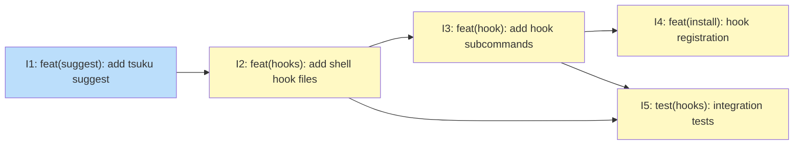

# PLAN: Command-Not-Found Handler

## Status

Draft

## Scope Summary

Wire the shell's command-not-found hook to the binary index so users see install
suggestions when they type an unknown command. Delivers `tsuku suggest`, shell hook
files for bash/zsh/fish, `tsuku hook install/uninstall/status`, install script
integration, and container-based shell integration tests.

## Decomposition Strategy

**Horizontal decomposition.** The design defines a clear linear phase sequence with
stable interfaces between layers: `tsuku suggest` is a subprocess to the hook files,
hook files are file inputs to the hook install command, and `tsuku hook install` is a
CLI target called by the install script. Each phase's output is well-defined before
the next phase begins. No complex cross-coupling requires a walking skeleton.

## Issue Outlines

### Issue 1: feat(suggest): add tsuku suggest command

**Goal**: Add `tsuku suggest <command>` to look up the binary index and print human-readable (and optionally JSON) installation suggestions when a command is not found.

**Acceptance Criteria**:
- [ ] `cmd/tsuku/lookup.go` exports `lookupBinaryCommand(cfg, command string) ([]index.BinaryMatch, error)` used by both `tsuku which` and `tsuku suggest`
- [ ] `cmd/tsuku/cmd_suggest.go` implements the `suggest` subcommand
- [ ] Single match prints: `Command 'jq' not found. Install with: tsuku install jq`
- [ ] Multiple matches print a list with installed status
- [ ] No match produces no output and exits 1
- [ ] Index not built exits 11 (`ExitIndexNotBuilt`)
- [ ] `--json` flag outputs machine-readable JSON
- [ ] `ExitIndexNotBuilt = 11` added to `cmd/tsuku/exitcodes.go`
- [ ] `cmd/tsuku/cmd_suggest_test.go` covers: single match, multiple matches, no match (exit 1), index not built (exit 11)
- [ ] `tsuku suggest` registered as a subcommand and appears in `tsuku --help`
- [ ] `tsuku which` refactored to use `lookupBinaryCommand` (no behavior change)

**Dependencies**: None

---

### Issue 2: feat(hooks): add shell hook files for bash, zsh, and fish

**Goal**: Add shell hook files for bash, zsh, and fish that intercept command-not-found events and call `tsuku suggest`, chaining to any existing handler.

**Acceptance Criteria**:
- [ ] `internal/hooks/tsuku.bash` with detect-and-wrap using `declare -f` + `eval`
- [ ] `internal/hooks/tsuku.zsh` with detect-and-wrap using `functions -c`
- [ ] `internal/hooks/tsuku.fish` with detect-and-wrap using `functions --copy`
- [ ] Each hook guards against recursion with `command -v tsuku` (bash/zsh) or `command -q tsuku` (fish)
- [ ] Each hook falls through unconditionally after calling `tsuku suggest "$1"`
- [ ] Bash hook includes comment explaining `eval` is bounded to `declare -f` output, not user input
- [ ] `internal/hooks/embed.go` declares an `embed.FS` including all three hook files
- [ ] Hook files written to `$TSUKU_HOME/share/hooks/` with `0644` permissions
- [ ] Sourcing `tsuku.bash` with no pre-existing handler defines the function and returns 127 for unknown commands
- [ ] Sourcing `tsuku.bash` with a pre-existing handler wraps it and calls both in order

**Dependencies**: Blocked by Issue 1

---

### Issue 3: feat(hook): add tsuku hook install, uninstall, and status commands

**Goal**: Implement `tsuku hook install`, `tsuku hook uninstall`, and `tsuku hook status` subcommands to register, remove, and report shell hook state for bash, zsh, and fish.

**Acceptance Criteria**:
- [ ] `internal/config/config.go` adds `ShareDir string` field set to `$TSUKU_HOME/share/`
- [ ] `EnsureDirectories()` creates `ShareDir` and `ShareDir/hooks/` if they don't exist
- [ ] `cmd/tsuku/cmd_hook.go` routes `hook install/uninstall/status`; derives config, passes paths to `internal/hook/` as parameters
- [ ] `internal/hook/install.go` handles bash (`~/.bashrc`), zsh (`~/.zshrc`), and fish (`~/.config/fish/conf.d/tsuku.fish`)
- [ ] `hook install` writes hook files from embedded FS to `$TSUKU_HOME/share/hooks/` with `0644` permissions
- [ ] `hook install` is idempotent — running twice does not produce duplicate marker blocks
- [ ] `hook install --shell=<shell>` restricts to the named shell; omitting uses `$SHELL`
- [ ] rc file writes are atomic: write to temp file, rename into place
- [ ] `internal/hook/uninstall.go` removes the two-line marker block from bash/zsh and `~/.config/fish/conf.d/tsuku.fish` for fish
- [ ] `hook uninstall` is idempotent and removes only the known marker block
- [ ] `internal/hook/status.go` reports `installed` or `not installed` per shell
- [ ] `internal/hook/install_test.go` covers: marker insertion, idempotency guard, atomic write, uninstall removes exactly the two-line block, status detection

**Dependencies**: Blocked by Issue 2

---

### Issue 4: feat(install): add hook registration to install script

**Goal**: Update `website/install.sh` to call `tsuku hook install` for the detected shell as the final setup step, with a `--no-hooks` flag for users who prefer manual registration.

**Acceptance Criteria**:
- [ ] `website/install.sh` reads `$SHELL` to detect the shell at install time
- [ ] After all other setup steps, the script calls `tsuku hook install` for the detected shell
- [ ] `--no-hooks` flag added; passing it skips the `tsuku hook install` call
- [ ] Install output prints which shell was configured (e.g., `Registered command-not-found hook for bash.`)
- [ ] When `--no-hooks` is passed, output notes registration was skipped with manual command
- [ ] If `$SHELL` is unset or unrecognized, script warns and skips without failing
- [ ] `--no-hooks` documented in installer usage alongside `--no-modify-path`
- [ ] Existing `--no-modify-path` behavior is unchanged

**Dependencies**: Blocked by Issue 3

---

### Issue 5: test(hooks): add container shell integration tests

**Goal**: Add container-based shell integration tests that verify the command-not-found hook behaves correctly across bash, zsh, and fish for all critical scenarios.

**Acceptance Criteria**:
- [ ] `internal/hooks/testdata/mock_tsuku` minimal executable that records invocations for assertions
- [ ] `internal/hook/integration_test.go` launches containers via `os/exec` (`docker run`) with the pinned `debian` image from `container-images.json`
- [ ] Container setup installs zsh and fish via apt
- [ ] Tests call `t.Skipf("docker not available: %v", err)` if Docker is absent; no `//go:build` tag used
- [ ] `.github/workflows/container-tests.yml` adds `hook-integration-tests` job
- [ ] **Bash**: no pre-existing handler, detect-and-wrap, recursion guard, double-source, uninstall — all pass
- [ ] **Zsh**: same five scenarios pass under zsh
- [ ] **Fish**: same five scenarios pass under fish
- [ ] Hook files written during tests have `0644` permissions; test environment has no group/world write on hook directories

**Dependencies**: Blocked by Issue 2, Issue 3

---

## Dependency Graph

**Legend**: Green = done, Blue = ready, Yellow = blocked, Purple = needs-design, Orange = tracks-design/tracks-plan

## Implementation Sequence

**Critical path**: Issue 1 → Issue 2 → Issue 3 → Issue 4 (4 of 5 issues in series)

**Parallelization opportunity**: After Issue 3, Issues 4 and 5 can be worked in parallel. Issue 5 (container tests) can be developed concurrently with Issue 4 (install script) since both only require Issues 2 and 3.

**Recommended order**:
1. **Issue 1** (no dependencies): implement `tsuku suggest` and extract the shared `lookupBinaryCommand()` helper
2. **Issue 2** (blocked by 1): write the three hook files with detect-and-wrap logic
3. **Issue 3** (blocked by 2): add `ShareDir` to Config and implement `hook install/uninstall/status`
4. **Issues 4 and 5 in parallel** (both blocked by 3): update install script and write container tests simultaneously

The container tests (Issue 5) are the safety gate — merge only after they pass in CI.
