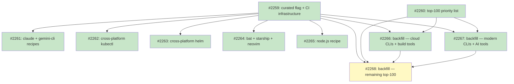

## Status

Active

## Scope Summary

Introduce a `curated = true` flag for handcrafted recipes, nightly cross-platform install verification via a `ci.curated` array and `curated-nightly.yml` workflow, and an initial and expanded batch of high-priority handcrafted recipes for the top-100 most-used developer tools.

## Decomposition Strategy

**Horizontal decomposition.** Foundation infrastructure ships first in Issue 1 (the curated flag, CI array, nightly workflow, and lint check). All subsequent recipe issues depend only on that foundation — they add files to a stable schema with no runtime coupling between batches. The top-100 research (Issue 2) runs in parallel with Issue 1 and gates only the backfill batches (Issues 8–10) that need its prioritized list to guide recipe selection.

## Implementation Issues

### Milestone: [Curated Recipe System](https://github.com/tsukumogami/tsuku/milestone/113)

| Issue | Dependencies | Complexity |
|-------|--------------|------------|
| ~~[#2259: feat(recipe): add curated flag to recipe metadata and CI infrastructure](https://github.com/tsukumogami/tsuku/issues/2259)~~ | ~~None~~ | ~~testable~~ |
| ~~_Adds `Curated bool` to `MetadataSection` in `internal/recipe/types.go`, a `ci.curated` recipe-path array to `test-matrix.json`, a new `curated-nightly.yml` workflow calling `recipe-validation-core.yml` on a nightly schedule, and a lint step that enforces the flag is present for every listed recipe._~~ | | |
| ~~[#2260: docs(recipes): produce top-100 developer tool priority list](https://github.com/tsukumogami/tsuku/issues/2260)~~ | ~~None~~ | ~~simple~~ |
| ~~_Research and publish a prioritized list of the 100 most-used developer tools with current tsuku coverage status, to guide the recipe authoring order in backfill batches._~~ | | |
| ~~[#2261: feat(recipes): add handcrafted recipes for claude and gemini-cli](https://github.com/tsukumogami/tsuku/issues/2261)~~ | ~~[#2259](https://github.com/tsukumogami/tsuku/issues/2259)~~ | ~~testable~~ |
| ~~_Ships `recipes/c/claude.toml` using `npm_install` with `@anthropic-ai/claude-code` and `recipes/g/gemini.toml` with `@google/gemini-cli`, each with a companion discovery entry that prevents the batch pipeline from resolving the wrong scoped package._~~ | | |
| ~~[#2262: feat(recipes): add cross-platform kubectl recipe](https://github.com/tsukumogami/tsuku/issues/2262)~~ | ~~[#2259](https://github.com/tsukumogami/tsuku/issues/2259)~~ | ~~testable~~ |
| ~~_Adds `recipes/k/kubectl.toml` using direct binary download from `dl.k8s.io` for linux/amd64, linux/arm64, darwin/amd64, and darwin/arm64 — additive alongside the existing Linux-only `kubernetes-cli.toml`._~~ | | |
| ~~[#2263: feat(recipes): replace Linux-only helm recipe with cross-platform version](https://github.com/tsukumogami/tsuku/issues/2263)~~ | ~~[#2259](https://github.com/tsukumogami/tsuku/issues/2259)~~ | ~~testable~~ |
| ~~_Replaces the batch-generated `recipes/h/helm.toml` (Homebrew-only, Linux-only) with a handcrafted recipe using `get.helm.sh` tarballs for all four supported platform-arch combinations._~~ | | |
| ~~[#2264: feat(recipes): add handcrafted recipes for bat, starship, and neovim](https://github.com/tsukumogami/tsuku/issues/2264)~~ | ~~[#2259](https://github.com/tsukumogami/tsuku/issues/2259)~~ | ~~testable~~ |
| ~~_Ships `recipes/b/bat.toml`, `recipes/s/starship.toml`, and `recipes/n/neovim.toml` using `github_archive` action, converting three discovery-only tools into fully installable curated recipes._~~ | | |
| ~~[#2265: feat(recipes): add handcrafted node.js recipe](https://github.com/tsukumogami/tsuku/issues/2265)~~ | ~~[#2259](https://github.com/tsukumogami/tsuku/issues/2259)~~ | ~~testable~~ |
| ~~_Adds `recipes/n/node.toml` using direct download from `nodejs.org` with platform-specific tarballs, making the Node.js runtime (a prerequisite for npm-based tools) installable via tsuku._~~ | | |
| ~~[#2266: feat(recipes): backfill curated recipes — cloud CLIs and build tools](https://github.com/tsukumogami/tsuku/issues/2266)~~ | ~~[#2259](https://github.com/tsukumogami/tsuku/issues/2259), [#2260](https://github.com/tsukumogami/tsuku/issues/2260)~~ | ~~testable~~ |
| ~~_Ships `recipes/a/awscli.toml` (PGP-verified zip download with PyInstaller bundle install) and `recipes/c/cmake.toml` (download+extract with SHA-256.txt from GitHub)._~~ | | |
| ~~[#2267: feat(recipes): backfill curated recipes — modern CLI tools and AI assistants](https://github.com/tsukumogami/tsuku/issues/2267)~~ | ~~[#2259](https://github.com/tsukumogami/tsuku/issues/2259), [#2260](https://github.com/tsukumogami/tsuku/issues/2260)~~ | ~~testable~~ |
| ~~_Replaces batch-generated recipes for ripgrep, fd, eza, zoxide, and delta with handcrafted `github_archive` versions, and adds missing AI tool recipes (aider, ollama) identified in the priority list._~~ | | |
| [#2268: feat(recipes): backfill curated recipes — remaining top-100 gaps](https://github.com/tsukumogami/tsuku/issues/2268) | [#2259](https://github.com/tsukumogami/tsuku/issues/2259), [#2260](https://github.com/tsukumogami/tsuku/issues/2260), [#2266](https://github.com/tsukumogami/tsuku/issues/2266), [#2267](https://github.com/tsukumogami/tsuku/issues/2267) | testable |
| _Authors handcrafted recipes for all remaining tools in the top-100 priority list not covered by earlier issues, reaching the target of 100 tools with handcrafted curated coverage._ | | |

## Dependency Graph

**Legend**: Green = done, Blue = ready, Yellow = blocked, Purple = needs-design, Orange = tracks-design/tracks-plan

## Implementation Sequence

**Critical path**: #2259 → #2260 → #2266/#2267 → #2268

| Wave | Issues | Start condition |
|------|--------|----------------|
| Wave 0 | #2259, #2260 | Immediately — no prerequisites |
| Wave 1 | #2261, #2262, #2263, #2264, #2265 | After #2259 merges |
| Wave 2 | #2266, #2267 | After both #2259 and #2260 merge |
| Wave 3 | #2268 | After #2259, #2260, #2266, #2267 all merge |

Start with #2259 and #2260 in parallel. Wave 1 contains five independent leaf issues that can be worked concurrently — assign to different contributors or work sequentially by priority. Wave 2 issues are independent of each other. Wave 3 is the final backfill gate.

**Priority within Wave 1**: #2261 (claude + gemini) addresses the primary motivation for this design; #2262 and #2263 (kubectl, helm) are highest-traffic tools; #2264 and #2265 (bat/starship/neovim, node.js) can follow.
