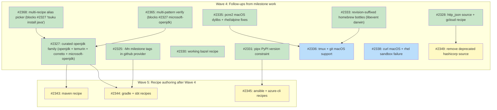

## Status

Active

## Scope Summary

Introduce a `curated = true` flag for handcrafted recipes, nightly cross-platform install verification via a `ci.curated` array and `curated-nightly.yml` workflow, and an initial and expanded batch of high-priority handcrafted recipes for the top-100 most-used developer tools.

## Decomposition Strategy

**Horizontal decomposition.** Foundation infrastructure ships first in Issue 1 (the curated flag, CI array, nightly workflow, and lint check). All subsequent recipe issues depend only on that foundation — they add files to a stable schema with no runtime coupling between batches. The top-100 research (Issue 2) runs in parallel with Issue 1 and gates only the backfill batches (Issues 8–10) that need its prioritized list to guide recipe selection.

## Implementation Issues

### Milestone: [Curated Recipe System](https://github.com/tsukumogami/tsuku/milestone/113)

| Issue | Dependencies | Complexity |
|-------|--------------|------------|
| ~~[#2259: feat(recipe): add curated flag to recipe metadata and CI infrastructure](https://github.com/tsukumogami/tsuku/issues/2259)~~ | ~~None~~ | ~~testable~~ |
| ~~_Adds `Curated bool` to `MetadataSection` in `internal/recipe/types.go`, a `ci.curated` recipe-path array to `test-matrix.json`, a new `curated-nightly.yml` workflow calling `recipe-validation-core.yml` on a nightly schedule, and a lint step that enforces the flag is present for every listed recipe._~~ | | |
| ~~[#2260: docs(recipes): produce top-100 developer tool priority list](https://github.com/tsukumogami/tsuku/issues/2260)~~ | ~~None~~ | ~~simple~~ |
| ~~_Research and publish a prioritized list of the 100 most-used developer tools with current tsuku coverage status, to guide the recipe authoring order in backfill batches._~~ | | |
| ~~[#2261: feat(recipes): add handcrafted recipes for claude and gemini-cli](https://github.com/tsukumogami/tsuku/issues/2261)~~ | ~~[#2259](https://github.com/tsukumogami/tsuku/issues/2259)~~ | ~~testable~~ |
| ~~_Ships `recipes/c/claude.toml` using `npm_install` with `@anthropic-ai/claude-code` and `recipes/g/gemini.toml` with `@google/gemini-cli`, each with a companion discovery entry that prevents the batch pipeline from resolving the wrong scoped package._~~ | | |
| ~~[#2262: feat(recipes): add cross-platform kubectl recipe](https://github.com/tsukumogami/tsuku/issues/2262)~~ | ~~[#2259](https://github.com/tsukumogami/tsuku/issues/2259)~~ | ~~testable~~ |
| ~~_Adds `recipes/k/kubectl.toml` using direct binary download from `dl.k8s.io` for linux/amd64, linux/arm64, darwin/amd64, and darwin/arm64 — additive alongside the existing Linux-only `kubernetes-cli.toml`._~~ | | |
| ~~[#2263: feat(recipes): replace Linux-only helm recipe with cross-platform version](https://github.com/tsukumogami/tsuku/issues/2263)~~ | ~~[#2259](https://github.com/tsukumogami/tsuku/issues/2259)~~ | ~~testable~~ |
| ~~_Replaces the batch-generated `recipes/h/helm.toml` (Homebrew-only, Linux-only) with a handcrafted recipe using `get.helm.sh` tarballs for all four supported platform-arch combinations._~~ | | |
| ~~[#2264: feat(recipes): add handcrafted recipes for bat, starship, and neovim](https://github.com/tsukumogami/tsuku/issues/2264)~~ | ~~[#2259](https://github.com/tsukumogami/tsuku/issues/2259)~~ | ~~testable~~ |
| ~~_Ships `recipes/b/bat.toml`, `recipes/s/starship.toml`, and `recipes/n/neovim.toml` using `github_archive` action, converting three discovery-only tools into fully installable curated recipes._~~ | | |
| ~~[#2265: feat(recipes): add handcrafted node.js recipe](https://github.com/tsukumogami/tsuku/issues/2265)~~ | ~~[#2259](https://github.com/tsukumogami/tsuku/issues/2259)~~ | ~~testable~~ |
| ~~_Adds `recipes/n/node.toml` using direct download from `nodejs.org` with platform-specific tarballs, making the Node.js runtime (a prerequisite for npm-based tools) installable via tsuku._~~ | | |
| ~~[#2266: feat(recipes): backfill curated recipes — cloud CLIs and build tools](https://github.com/tsukumogami/tsuku/issues/2266)~~ | ~~[#2259](https://github.com/tsukumogami/tsuku/issues/2259), [#2260](https://github.com/tsukumogami/tsuku/issues/2260)~~ | ~~testable~~ |
| ~~_Ships `recipes/a/awscli.toml` (PGP-verified zip download with PyInstaller bundle install) and `recipes/c/cmake.toml` (download+extract with SHA-256.txt from GitHub)._~~ | | |
| ~~[#2267: feat(recipes): backfill curated recipes — modern CLI tools and AI assistants](https://github.com/tsukumogami/tsuku/issues/2267)~~ | ~~[#2259](https://github.com/tsukumogami/tsuku/issues/2259), [#2260](https://github.com/tsukumogami/tsuku/issues/2260)~~ | ~~testable~~ |
| ~~_Replaces batch-generated recipes for ripgrep, fd, eza, zoxide, and delta with handcrafted `github_archive` versions, and adds missing AI tool recipes (aider, ollama) identified in the priority list._~~ | | |
| ~~[#2268: feat(recipes): backfill curated recipes — remaining top-100 gaps](https://github.com/tsukumogami/tsuku/issues/2268)~~ | ~~[#2259](https://github.com/tsukumogami/tsuku/issues/2259), [#2260](https://github.com/tsukumogami/tsuku/issues/2260), [#2266](https://github.com/tsukumogami/tsuku/issues/2266), [#2267](https://github.com/tsukumogami/tsuku/issues/2267)~~ | ~~testable~~ |
| ~~_Superseded by #2281–#2297, which decompose the remaining top-100 gap into 17 category-sized batches so each PR has a reviewable surface._~~ | | |
| ~~[#2281: feat(recipes): backfill curated recipes — security scanners](https://github.com/tsukumogami/tsuku/issues/2281)~~ | ~~[#2259](https://github.com/tsukumogami/tsuku/issues/2259), [#2260](https://github.com/tsukumogami/tsuku/issues/2260)~~ | ~~testable~~ |
| ~~_Adds `curated = true` to the existing handcrafted recipes for trivy, grype, cosign, syft, and tflint after verifying each against its latest upstream release._~~ | | |
| ~~[#2282: feat(recipes): backfill curated recipes — Kubernetes core CLIs](https://github.com/tsukumogami/tsuku/issues/2282)~~ | ~~[#2259](https://github.com/tsukumogami/tsuku/issues/2259), [#2260](https://github.com/tsukumogami/tsuku/issues/2260)~~ | ~~testable~~ |
| ~~_Adds `curated = true` to the existing handcrafted recipes for k9s, flux, stern, kubectx, and kustomize after upstream asset re-verification._~~ | | |
| ~~[#2283: feat(recipes): backfill curated recipes — Kubernetes ecosystem tools](https://github.com/tsukumogami/tsuku/issues/2283)~~ | ~~[#2259](https://github.com/tsukumogami/tsuku/issues/2259), [#2260](https://github.com/tsukumogami/tsuku/issues/2260)~~ | ~~testable~~ |
| ~~_Curates eksctl, skaffold, and velero, and replaces the batch-generated recipes for cilium-cli and istioctl with handcrafted `github_archive` versions._~~ | | |
| ~~[#2284: feat(recipes): backfill curated recipes — HashiCorp and infra tools](https://github.com/tsukumogami/tsuku/issues/2284)~~ | ~~[#2259](https://github.com/tsukumogami/tsuku/issues/2259), [#2260](https://github.com/tsukumogami/tsuku/issues/2260)~~ | ~~testable~~ |
| ~~_Curates terraform, vault, packer, and pulumi, and adds new handcrafted recipes for consul and vagrant using the HashiCorp releases pattern._~~ | | |
| ~~[#2285: feat(recipes): backfill curated recipes — terminal UI and TUI tools](https://github.com/tsukumogami/tsuku/issues/2285)~~ | ~~[#2259](https://github.com/tsukumogami/tsuku/issues/2259), [#2260](https://github.com/tsukumogami/tsuku/issues/2260)~~ | ~~testable~~ |
| ~~_Curates fzf, lazygit, and btop, and replaces the batch-generated recipes for lazydocker and htop with handcrafted cross-platform versions._~~ | | |
| ~~[#2286: feat(recipes): backfill curated recipes — shell utilities](https://github.com/tsukumogami/tsuku/issues/2286)~~ | ~~[#2259](https://github.com/tsukumogami/tsuku/issues/2259), [#2260](https://github.com/tsukumogami/tsuku/issues/2260)~~ | ~~testable~~ |
| ~~_Curates git, curl, and httpie; rewrites the batch recipes for wget and jq; and authors a new recipe for tmux. Several tools here may require source build fallbacks on some platforms._~~ | | |
| ~~[#2287: feat(recipes): backfill curated recipes — environment and version managers](https://github.com/tsukumogami/tsuku/issues/2287)~~ | ~~[#2259](https://github.com/tsukumogami/tsuku/issues/2259), [#2260](https://github.com/tsukumogami/tsuku/issues/2260)~~ | ~~testable~~ |
| ~~_Curates direnv and mise, rewrites the batch recipe for asdf, and authors new recipes for pyenv and rbenv following the shell-based clone-and-install pattern._~~ | | |
| ~~[#2288: feat(recipes): backfill curated recipes — JS and Node.js ecosystem](https://github.com/tsukumogami/tsuku/issues/2288)~~ | ~~[#2259](https://github.com/tsukumogami/tsuku/issues/2259), [#2260](https://github.com/tsukumogami/tsuku/issues/2260)~~ | ~~testable~~ |
| ~~_Curates bun, rewrites the batch recipe for yarn, and authors new recipes for deno, pnpm, and nvm._~~ | | |
| ~~[#2289: feat(recipes): backfill curated recipes — Go and shell linters](https://github.com/tsukumogami/tsuku/issues/2289)~~ | ~~[#2259](https://github.com/tsukumogami/tsuku/issues/2259), [#2260](https://github.com/tsukumogami/tsuku/issues/2260)~~ | ~~testable~~ |
| ~~_Curates actionlint and golangci-lint, and replaces the batch-generated recipes for shellcheck and shfmt._~~ | | |
| ~~[#2290: feat(recipes): backfill curated recipes — Python and JS linters and formatters](https://github.com/tsukumogami/tsuku/issues/2290)~~ | ~~[#2259](https://github.com/tsukumogami/tsuku/issues/2259), [#2260](https://github.com/tsukumogami/tsuku/issues/2260)~~ | ~~testable~~ |
| ~~_Curates ruff and black, rewrites the batch recipe for prettier, and authors a new `npm_install` recipe for eslint._~~ | | |
| ~~[#2291: feat(recipes): backfill curated recipes — crypto, secrets, and certificate tools](https://github.com/tsukumogami/tsuku/issues/2291)~~ | ~~[#2259](https://github.com/tsukumogami/tsuku/issues/2259), [#2260](https://github.com/tsukumogami/tsuku/issues/2260)~~ | ~~testable~~ |
| ~~_Curates caddy and age, rewrites the batch recipe for mkcert, and authors new recipes for sops and step._~~ | | |
| ~~[#2292: feat(recipes): backfill curated recipes — CI/CD automation tools](https://github.com/tsukumogami/tsuku/issues/2292)~~ | ~~[#2259](https://github.com/tsukumogami/tsuku/issues/2259), [#2260](https://github.com/tsukumogami/tsuku/issues/2260)~~ | ~~testable~~ |
| ~~_Rewrites the batch recipes for act, earthly, and goreleaser. Copilot skipped: the gh-copilot extension was deprecated upstream in September 2025._~~ | | |
| ~~[#2293: feat(recipes): backfill curated recipes — container and image tools](https://github.com/tsukumogami/tsuku/issues/2293)~~ | ~~[#2259](https://github.com/tsukumogami/tsuku/issues/2259), [#2260](https://github.com/tsukumogami/tsuku/issues/2260)~~ | ~~testable~~ |
| ~~_Curates the docker CLI recipe and authors new recipes for ko, dive, and hadolint._~~ | | |
| ~~[#2294: feat(recipes): backfill curated recipes — language runtimes](https://github.com/tsukumogami/tsuku/issues/2294)~~ | ~~[#2259](https://github.com/tsukumogami/tsuku/issues/2259), [#2260](https://github.com/tsukumogami/tsuku/issues/2260)~~ | ~~testable~~ |
| ~~_Curates the golang toolchain recipe and authors new recipes for python, rust, and ruby._~~ | | |
| ~~[#2295: feat(recipes): backfill curated recipes — C++ and JVM build tools](https://github.com/tsukumogami/tsuku/issues/2295)~~ | ~~[#2259](https://github.com/tsukumogami/tsuku/issues/2259), [#2260](https://github.com/tsukumogami/tsuku/issues/2260)~~ | ~~testable~~ |
| ~~_Curates the embedded recipes for make, ninja, and meson. Gradle, maven, and sbt deferred to follow-ups: #2325 (gradle and sbt resolve to milestone-tag pre-releases) and #2327 (the JVM tools cannot be verified without an `openjdk` recipe to declare as a runtime dependency)._~~ | | |
| ~~[#2296: feat(recipes): backfill curated recipes — cloud CLIs and orchestration](https://github.com/tsukumogami/tsuku/issues/2296)~~ | ~~[#2259](https://github.com/tsukumogami/tsuku/issues/2259), [#2260](https://github.com/tsukumogami/tsuku/issues/2260)~~ | ~~testable~~ |
| ~~_Authors a new curated recipe for argocd. Other tools deferred: gcloud to #2328 (no version source for Google's distribution channel), bazel to #2330 (single-binary self-extraction fails in the test-recipe sandbox), and ansible plus azure-cli to #2331 (the bundled python-standalone is 3.10 and pipx_install picks the latest pypi version, which has dropped 3.10 support; needs version-constraint support)._~~ | | |
| ~~[#2297: feat(recipes): backfill curated recipes — IaC quality and policy tools](https://github.com/tsukumogami/tsuku/issues/2297)~~ | ~~[#2259](https://github.com/tsukumogami/tsuku/issues/2259), [#2260](https://github.com/tsukumogami/tsuku/issues/2260)~~ | ~~testable~~ |
| ~~_Rewrites the batch recipes for terragrunt and infracost, and authors new recipes for pre-commit, lefthook, and checkov._~~ | | |
| ~~[#2312: feat(recipes): fix macOS library dependencies needed for curl, wget, tmux, and git](https://github.com/tsukumogami/tsuku/issues/2312)~~ | ~~None~~ | ~~testable~~ |
| ~~_Curates the existing `libnghttp3` recipe (the homebrew formula is `libnghttp3`, not `nghttp3`) and exposes `libnghttp3.9.dylib` for curl, and rewrites `utf8proc` from batch garbage (tmux). libevent is deferred to #2333 (the homebrew bottle resolver does not yet understand revision-suffixed manifests), and pcre2 is deferred to #2335 (touching the recipe surfaced pre-existing rhel and alpine sandbox failures that need investigation alongside the macOS dylib expansion). Both deferred recipes keep their existing `unsupported_platforms` and uncurated state._~~ | | |
| ~~[#2313: feat(recipes): add macOS support to curl, wget, tmux, and git recipes](https://github.com/tsukumogami/tsuku/issues/2313)~~ | ~~[#2312](https://github.com/tsukumogami/tsuku/issues/2312)~~ | ~~testable~~ |
| ~~_Adds a darwin homebrew step to `wget` and extends `gettext` to install `libintl.8.dylib` so the wget bottle's `@rpath` resolves. curl, tmux, and git are deferred: curl to #2338 (a rhel-only sandbox verify failure surfaces when the recipe is touched, similar in shape to the pcre2 rhel issue from #2335), tmux to #2336 against #2333 (libevent macOS), and git to #2336 against #2335 (pcre2 macOS)._~~ | | |
| ~~[#2315: feat(recipes): curate rbenv recipe with working cross-platform installation](https://github.com/tsukumogami/tsuku/issues/2315)~~ | ~~[#2259](https://github.com/tsukumogami/tsuku/issues/2259), [#2260](https://github.com/tsukumogami/tsuku/issues/2260)~~ | ~~testable~~ |
| ~~_Authors `recipes/r/rbenv.toml` from scratch using `download` + `extract` + `install_binaries` against the GitHub source tarball. Upstream publishes only source archives (no release assets) and the homebrew bottle is tagged `all` (a single platform-agnostic blob), neither of which the existing `github_archive` or `homebrew` actions handle. Scoped to glibc only via `supported_libc` because Alpine does not ship bash by default._~~ | | |

### Wave 4: Follow-ups from milestone work

These issues capture infrastructure and recipe gaps surfaced while authoring the Wave 3 backfill batches. They were not part of the original plan but are the natural next steps to land the deferred recipes (libevent darwin, pcre2 macOS dylibs, gcloud, gradle, sbt, maven, ansible, azure-cli, bazel, curl macOS, tmux macOS, git macOS).

| Issue | Dependencies | Complexity |
|-------|--------------|------------|
| ~~[#2325: fix(version): treat -Mn milestone tags as pre-releases in GitHub provider](https://github.com/tsukumogami/tsuku/issues/2325)~~ | ~~None~~ | ~~testable~~ |
| ~~_Replaces the substring-keyword `isStableVersion` filter with a SemVer-aware predicate (any non-empty prerelease component is unstable unless it matches a stable qualifier), plus a non-SemVer fallback to catch markers spliced into the version without a hyphen (e.g., jq's `1.8.2rc1`). Default stable qualifiers `["release", "final", "lts", "ga", "stable"]` admit the common JVM RELEASE/FINAL conventions; the `[version] stable_qualifiers` recipe field overrides for exotic upstreams. Designed in `docs/designs/DESIGN-prerelease-detection.md`._~~ | | |
| ~~[#2327: feat(recipes): add curated openjdk family (openjdk, temurin, corretto, microsoft-openjdk)](https://github.com/tsukumogami/tsuku/issues/2327)~~ | ~~tsuku release containing [#2368](https://github.com/tsukumogami/tsuku/issues/2368)~~ | ~~testable~~ |
| ~~_Scope expanded from a single openjdk recipe to four cross-platform JDK distribution recipes. `openjdk` is the Homebrew + apk fallback; `temurin`, `corretto`, and `microsoft-openjdk` are vendor-specific recipes that pull from each project's own infrastructure (Adoptium API, corretto.aws, aka.ms). All share Adoptium's `most_recent_lts` integer as the LTS-major source. Both prerequisite blockers shipped — #2365 (multi-pattern verify) in v0.11.3 and #2368 (multi-recipe alias picker) in v0.11.4 — and this PR ships the four recipes plus `aliases = ["java"]` declarations on each, fulfilling R12 of `PRD-multi-satisfier-picker.md`. `tsuku install java` now presents the four-vendor picker on a TTY (or the structured ambiguous-alias error under `-y`/non-TTY)._~~ |
| ~~[#2365: feat(recipe): support multi-pattern verify checks](https://github.com/tsukumogami/tsuku/issues/2365)~~ | ~~None~~ | ~~testable~~ |
| ~~_Extends `[verify]` to accept a `patterns = [...]` array (mutually exclusive with the existing `pattern` field) so recipes can bind multiple independent facts (vendor + version) when those facts appear in non-adjacent positions in the verify command's output. Surfaced by `microsoft-openjdk` in #2327, which prints `Microsoft-{internal-build-hash}` rather than `Microsoft-{version}` and so can't be checked against both vendor and version with a single substring. Shipped in v0.11.3._~~ | | |
| ~~[#2368: feat(install): present a picker when multiple recipes satisfy an alias](https://github.com/tsukumogami/tsuku/issues/2368)~~ | ~~None~~ | ~~testable~~ |
| ~~_The OpenJDK family in #2327 ships four valid answers to "give me Java." Today's satisfies index is 1-to-many at the type level (`map[string]satisfiesEntry`), so a virtual alias like `java` can map to at most one recipe and `tsuku install java` either silently picks one or errors. Extends the schema to support multi-satisfier aliases and adds an interactive picker (with non-TTY error+`--from` fallback) so users see and choose among all eligible recipes. Shipped in v0.11.4 via PR #2369._~~ | | |
| ~~[#2328: feat(version): add a version source for Google Cloud SDK to enable gcloud recipe](https://github.com/tsukumogami/tsuku/issues/2328)~~ | ~~None~~ | ~~testable~~ |
| ~~_Expanded scope from "gcloud_dist custom source" to a generic `http_json` version source per `docs/designs/DESIGN-http-json-version-source.md`. Adds `[version] source = "http_json"` with `url` and `version_path` fields supporting dotted access plus `[N]` array indexing. Authors `recipes/g/gcloud.toml` as the first consumer in the same PR. Deprecates `source = "hashicorp"` (kept for one release window with a runtime warning); removal tracked in #2349. Unblocks Adoptium-based openjdk in #2327 and HashiCorp checkpoint adoption in #2350-style follow-ups when needed._~~ | | |
| ~~[#2330: feat(recipes): author a working curated bazel recipe](https://github.com/tsukumogami/tsuku/issues/2330)~~ | ~~None~~ | ~~testable~~ |
| ~~_The bare `bazel-{version}-{os}-{arch}` binary self-extracts an embedded JDK and spawns a long-lived server on first run; the prior bare-binary attempt (commit dcb34719, deferred in ed8fc646) failed across the matrix. Resolved by routing through the Homebrew bottle on both linux+glibc and darwin (mirrors the openjdk recipe shape from #2327); Alpine documented as unsupported via `supported_libc = ["glibc"]` because the embedded JDK is glibc-linked._~~ | | |
| ~~[#2331: feat(recipes): allow pipx_install recipes to pin a PyPI version constraint](https://github.com/tsukumogami/tsuku/issues/2331)~~ | ~~None~~ | ~~testable~~ |
| ~~_Resolved with a different mechanism than the title suggests. Recipes do not declare PyPI version constraints; instead, `PyPIProvider.ResolveLatest` filters by per-release `requires_python` against the bundled `python-standalone` major.minor. Auto-resolution picks the newest stable, non-yanked, Python-compatible release. Lands `recipes/a/ansible.toml` as the proof point. azure-cli is deferred — its eval already succeeds and its post-install failure is a separate transitive C-extension ABI issue. See `docs/designs/current/DESIGN-pipx-pypi-version-pinning.md`._~~ | | |
| ~~[#2333: fix(homebrew): resolve revision-suffixed bottles so libevent darwin can be installed](https://github.com/tsukumogami/tsuku/issues/2333)~~ | ~~None~~ | ~~testable~~ |
| ~~_The homebrew action now fetches `revision` from formulae.brew.sh and constructs `<version>_<revision>` for both the manifest URL and the ref-name match when revision >= 1; the shared matcher accepts both unrevised and revision-suffixed entry forms within a single manifest. `recipes/l/libevent.toml` ships with darwin support and the macOS dylib outputs (`libevent-2.1.7.dylib` and the static archives) so tmux's @rpath resolves at runtime._~~ | | |
| ~~[#2335: fix(recipes): curate pcre2 with macOS dylib outputs and fix rhel + alpine sandbox failures](https://github.com/tsukumogami/tsuku/issues/2335)~~ | ~~None~~ | ~~testable~~ |
| ~~_Resolved by switching all glibc + musl Linux to a uniform source build with `--disable-bzip2 --disable-readline --disable-shared --enable-static`. Static linking sidesteps the Linuxbrew bottle's hard-coded `libbz2.so.1.0` (RHEL ships only `libbz2.so.1`), the Alpine musl loader's missing search of `install_dir/lib`, and a Fedora-only segfault during dynamic-linker startup. macOS keeps the homebrew bottle and `install_mode = "directory"` publishes the full bottle layout (dylibs, .a, headers, pkg-config) so the homebrew git bottle's @rpath resolves `libpcre2-8.0.dylib`. Recipe marked `curated = true`._~~ | | |
| [#2336: feat(recipes): add macOS support to tmux and git recipes](https://github.com/tsukumogami/tsuku/issues/2336) | [#2333](https://github.com/tsukumogami/tsuku/issues/2333), [#2335](https://github.com/tsukumogami/tsuku/issues/2335) | testable |
| _Once libevent and pcre2 macOS support land, drop `supported_os = ["linux"]` from `recipes/t/tmux.toml` and `recipes/g/git.toml` and add darwin homebrew steps wired to the right `runtime_dependencies`. Same shape as the curl and wget changes in #2337._ | | |
| [#2338: fix(recipes): add macOS support to curl and resolve rhel sandbox verify failure](https://github.com/tsukumogami/tsuku/issues/2338) | None | testable |
| _A first attempt at the curl darwin step (subsequently reverted) cleared eval and macOS install but surfaced a rhel-only sandbox verify failure on Linux: install completes (`install_exit_code = 0`) but `passed = false`. Same shape as the pcre2 rhel issue. Needs local reproduction since the workflow does not upload `.log-*.txt` artifacts._ | | |
| [#2349: chore(version): remove deprecated source = "hashicorp" after release](https://github.com/tsukumogami/tsuku/issues/2349) | tsuku release containing [#2328](https://github.com/tsukumogami/tsuku/issues/2328) | testable |
| _Second half of the deprecation introduced in #2328. Removes `(r *Resolver) ResolveHashiCorp`, the `"hashicorp"` source-name allowlist entries, and the deprecation warnings, after the next tsuku release ships and any external recipes have had a chance to migrate._ | | |

### Wave 5: Recipe authoring after Wave 4 lands

These recipes were attempted in Wave 3 batches and reverted because their Wave 4 prereqs were not yet available. They ship as small, focused PRs once each prereq lands. The four entries below cover every Wave 3 recipe that was deferred due to a Wave 4 blocker; the other deferred items (libevent darwin, pcre2 macOS, tmux/git darwin, curl darwin, bazel) include the recipe update inside their Wave 4 issue scope and don't need separate authoring tickets.

Recipes that depend on a Wave 4 *code change* require a tsuku release containing that change, since the recipe behavior they rely on lives in the tsuku binary, not in the recipe registry.

| Issue | Dependencies | Complexity |
|-------|--------------|------------|
| [#2343: feat(recipes): author maven recipe](https://github.com/tsukumogami/tsuku/issues/2343) | [#2327](https://github.com/tsukumogami/tsuku/issues/2327) | testable |
| _Recipe-only change. Maven ships a single platform-agnostic Apache distribution; the recipe needs an openjdk runtime dependency so `mvn --version` can verify._ | | |
| [#2344: feat(recipes): author gradle and sbt recipes](https://github.com/tsukumogami/tsuku/issues/2344) | [#2327](https://github.com/tsukumogami/tsuku/issues/2327), tsuku release containing [#2325](https://github.com/tsukumogami/tsuku/issues/2325) | testable |
| _Both upstreams use `-Mn` milestone tags that #2325 now filters as prereleases (released in the binary), and both need the openjdk runtime dependency from #2327 for verify._ | | |
| [#2345: feat(recipes): author ansible and azure-cli recipes](https://github.com/tsukumogami/tsuku/issues/2345) | tsuku release containing [#2331](https://github.com/tsukumogami/tsuku/issues/2331) | testable |
| _Both pin to a python-3.10-compatible pypi release using the new pipx version-constraint feature in #2331. Recipe authors using the new constraint syntax need a tsuku binary that knows about it._ | | |
| ~~[#2346: feat(recipes): author gcloud recipe](https://github.com/tsukumogami/tsuku/issues/2346)~~ | ~~tsuku release containing [#2328](https://github.com/tsukumogami/tsuku/issues/2328)~~ | ~~testable~~ |
| ~~_Bundled into #2328: the gcloud recipe ships in the same PR as the `http_json` mechanism, so there is no release gap to bridge. The recipe references `[version] source = "http_json"` which the same tsuku binary introduces._~~ | | |

## Dependency Graph

Waves 0–3 are fully complete and have been removed from the diagram for
clarity. Their ticket histories live in this document's tables above.
The diagram tracks active work: Wave 4 follow-ups and the Wave 5 recipe
authoring they unblock.

**Legend**: Green = done, Blue = ready, Yellow = blocked, Purple = needs-design, Orange = tracks-design/tracks-plan

## Implementation Sequence

**Critical path**: #2259 → #2260 → Wave 3 backfill batches → Wave 4 follow-ups → tsuku release containing the Wave 4 code changes → Wave 5 recipe authoring.

| Wave | Issues | Start condition |
|------|--------|----------------|
| Wave 0 | #2259, #2260 | Immediately — no prerequisites |
| Wave 1 | #2261, #2262, #2263, #2264, #2265 | After #2259 merges |
| Wave 2 | #2266, #2267 | After both #2259 and #2260 merge |
| Wave 3 | #2281–#2297, #2312, #2313, #2315 (20 backfill batches) | After #2259 and #2260 merge |
| Wave 4 | #2325, #2327, #2328, #2330, #2331, #2333, #2335, #2336, #2338, #2365, #2368 | After Wave 3 surfaces the gap each issue captures |
| Wave 5 | #2343, #2344, #2345, #2346 | After the Wave 4 prereq for each lands and (if a code change) is included in a tsuku release |

Wave 3 issues were fully independent of each other; each batch was scoped to a coherent tool category and shipped as a single PR.

**Wave 4 priority**: most issues are independent and can be worked in parallel. The exceptions:

- **#2336 (tmux + git macOS)** is hard-blocked by #2333 (libevent darwin) and #2335 (pcre2 macOS dylibs).
- **#2335 and #2338** share the same RHEL sandbox failure shape (install completes with `exit 0`, verify exits non-zero with no log artifact). Investigating one will likely produce the diagnostic capability needed for the other; consider taking them together.
- **#2325, #2327, #2331** unblock Wave 5 recipe authoring rather than fixing existing recipes. After each lands (and is released for the code-change ones), the corresponding Wave 5 ticket can ship.
- **#2330 (bazel)** depends on #2327 if the chosen approach uses the `bazel_nojdk-*` asset; otherwise independent.

**Wave 5 priority**: every Wave 5 ticket is small (one or two recipes per ticket), independent of the other Wave 5 tickets, and gated only by its own Wave 4 prereqs. Order is determined by which Wave 4 prereq lands first:

- **#2343 (maven)** ships as soon as #2327 (openjdk recipe) lands. No tsuku release dependency since #2327 is recipe-only.
- **#2344 (gradle, sbt)** needs #2327 *and* a tsuku release containing #2325. Among Wave 5, this is the one that can be cut as soon as #2325 ships in a tagged release and #2327 lands.
- **#2345 (ansible, azure-cli)** is gated by a release containing #2331.
- **#2346 (gcloud)** is gated by a release containing #2328.

The "tsuku release" gate exists because recipes that use new tsuku features (custom version sources, recipe-level constraint syntax) need a tsuku binary that knows about those features. Recipes that only depend on bug-fix behavior changes (like #2325's stricter prerelease filter) don't strictly need a release, but in practice we prefer one so the recipe doesn't have to work around stale tsuku binaries in users' caches.
