## Status

Active

## Scope Summary

Introduce a `curated = true` flag for handcrafted recipes, nightly cross-platform install verification via a `ci.curated` array and `curated-nightly.yml` workflow, and an initial and expanded batch of high-priority handcrafted recipes for the top-100 most-used developer tools.

## Decomposition Strategy

**Horizontal decomposition.** Foundation infrastructure ships first in Issue 1 (the curated flag, CI array, nightly workflow, and lint check). All subsequent recipe issues depend only on that foundation — they add files to a stable schema with no runtime coupling between batches. The top-100 research (Issue 2) runs in parallel with Issue 1 and gates only the backfill batches (Issues 8–10) that need its prioritized list to guide recipe selection.

## Implementation Issues

### Milestone: [Curated Recipe System](https://github.com/tsukumogami/tsuku/milestone/113)

| Issue | Dependencies | Complexity |
|-------|--------------|------------|
| ~~[#2259: feat(recipe): add curated flag to recipe metadata and CI infrastructure](https://github.com/tsukumogami/tsuku/issues/2259)~~ | ~~None~~ | ~~testable~~ |
| ~~_Adds `Curated bool` to `MetadataSection` in `internal/recipe/types.go`, a `ci.curated` recipe-path array to `test-matrix.json`, a new `curated-nightly.yml` workflow calling `recipe-validation-core.yml` on a nightly schedule, and a lint step that enforces the flag is present for every listed recipe._~~ | | |
| ~~[#2260: docs(recipes): produce top-100 developer tool priority list](https://github.com/tsukumogami/tsuku/issues/2260)~~ | ~~None~~ | ~~simple~~ |
| ~~_Research and publish a prioritized list of the 100 most-used developer tools with current tsuku coverage status, to guide the recipe authoring order in backfill batches._~~ | | |
| ~~[#2261: feat(recipes): add handcrafted recipes for claude and gemini-cli](https://github.com/tsukumogami/tsuku/issues/2261)~~ | ~~[#2259](https://github.com/tsukumogami/tsuku/issues/2259)~~ | ~~testable~~ |
| ~~_Ships `recipes/c/claude.toml` using `npm_install` with `@anthropic-ai/claude-code` and `recipes/g/gemini.toml` with `@google/gemini-cli`, each with a companion discovery entry that prevents the batch pipeline from resolving the wrong scoped package._~~ | | |
| ~~[#2262: feat(recipes): add cross-platform kubectl recipe](https://github.com/tsukumogami/tsuku/issues/2262)~~ | ~~[#2259](https://github.com/tsukumogami/tsuku/issues/2259)~~ | ~~testable~~ |
| ~~_Adds `recipes/k/kubectl.toml` using direct binary download from `dl.k8s.io` for linux/amd64, linux/arm64, darwin/amd64, and darwin/arm64 — additive alongside the existing Linux-only `kubernetes-cli.toml`._~~ | | |
| ~~[#2263: feat(recipes): replace Linux-only helm recipe with cross-platform version](https://github.com/tsukumogami/tsuku/issues/2263)~~ | ~~[#2259](https://github.com/tsukumogami/tsuku/issues/2259)~~ | ~~testable~~ |
| ~~_Replaces the batch-generated `recipes/h/helm.toml` (Homebrew-only, Linux-only) with a handcrafted recipe using `get.helm.sh` tarballs for all four supported platform-arch combinations._~~ | | |
| ~~[#2264: feat(recipes): add handcrafted recipes for bat, starship, and neovim](https://github.com/tsukumogami/tsuku/issues/2264)~~ | ~~[#2259](https://github.com/tsukumogami/tsuku/issues/2259)~~ | ~~testable~~ |
| ~~_Ships `recipes/b/bat.toml`, `recipes/s/starship.toml`, and `recipes/n/neovim.toml` using `github_archive` action, converting three discovery-only tools into fully installable curated recipes._~~ | | |
| ~~[#2265: feat(recipes): add handcrafted node.js recipe](https://github.com/tsukumogami/tsuku/issues/2265)~~ | ~~[#2259](https://github.com/tsukumogami/tsuku/issues/2259)~~ | ~~testable~~ |
| ~~_Adds `recipes/n/node.toml` using direct download from `nodejs.org` with platform-specific tarballs, making the Node.js runtime (a prerequisite for npm-based tools) installable via tsuku._~~ | | |
| ~~[#2266: feat(recipes): backfill curated recipes — cloud CLIs and build tools](https://github.com/tsukumogami/tsuku/issues/2266)~~ | ~~[#2259](https://github.com/tsukumogami/tsuku/issues/2259), [#2260](https://github.com/tsukumogami/tsuku/issues/2260)~~ | ~~testable~~ |
| ~~_Ships `recipes/a/awscli.toml` (PGP-verified zip download with PyInstaller bundle install) and `recipes/c/cmake.toml` (download+extract with SHA-256.txt from GitHub)._~~ | | |
| ~~[#2267: feat(recipes): backfill curated recipes — modern CLI tools and AI assistants](https://github.com/tsukumogami/tsuku/issues/2267)~~ | ~~[#2259](https://github.com/tsukumogami/tsuku/issues/2259), [#2260](https://github.com/tsukumogami/tsuku/issues/2260)~~ | ~~testable~~ |
| ~~_Replaces batch-generated recipes for ripgrep, fd, eza, zoxide, and delta with handcrafted `github_archive` versions, and adds missing AI tool recipes (aider, ollama) identified in the priority list._~~ | | |
| ~~[#2268: feat(recipes): backfill curated recipes — remaining top-100 gaps](https://github.com/tsukumogami/tsuku/issues/2268)~~ | ~~[#2259](https://github.com/tsukumogami/tsuku/issues/2259), [#2260](https://github.com/tsukumogami/tsuku/issues/2260), [#2266](https://github.com/tsukumogami/tsuku/issues/2266), [#2267](https://github.com/tsukumogami/tsuku/issues/2267)~~ | ~~testable~~ |
| ~~_Superseded by #2281–#2297, which decompose the remaining top-100 gap into 17 category-sized batches so each PR has a reviewable surface._~~ | | |
| ~~[#2281: feat(recipes): backfill curated recipes — security scanners](https://github.com/tsukumogami/tsuku/issues/2281)~~ | ~~[#2259](https://github.com/tsukumogami/tsuku/issues/2259), [#2260](https://github.com/tsukumogami/tsuku/issues/2260)~~ | ~~testable~~ |
| ~~_Adds `curated = true` to the existing handcrafted recipes for trivy, grype, cosign, syft, and tflint after verifying each against its latest upstream release._~~ | | |
| ~~[#2282: feat(recipes): backfill curated recipes — Kubernetes core CLIs](https://github.com/tsukumogami/tsuku/issues/2282)~~ | ~~[#2259](https://github.com/tsukumogami/tsuku/issues/2259), [#2260](https://github.com/tsukumogami/tsuku/issues/2260)~~ | ~~testable~~ |
| ~~_Adds `curated = true` to the existing handcrafted recipes for k9s, flux, stern, kubectx, and kustomize after upstream asset re-verification._~~ | | |
| ~~[#2283: feat(recipes): backfill curated recipes — Kubernetes ecosystem tools](https://github.com/tsukumogami/tsuku/issues/2283)~~ | ~~[#2259](https://github.com/tsukumogami/tsuku/issues/2259), [#2260](https://github.com/tsukumogami/tsuku/issues/2260)~~ | ~~testable~~ |
| ~~_Curates eksctl, skaffold, and velero, and replaces the batch-generated recipes for cilium-cli and istioctl with handcrafted `github_archive` versions._~~ | | |
| ~~[#2284: feat(recipes): backfill curated recipes — HashiCorp and infra tools](https://github.com/tsukumogami/tsuku/issues/2284)~~ | ~~[#2259](https://github.com/tsukumogami/tsuku/issues/2259), [#2260](https://github.com/tsukumogami/tsuku/issues/2260)~~ | ~~testable~~ |
| ~~_Curates terraform, vault, packer, and pulumi, and adds new handcrafted recipes for consul and vagrant using the HashiCorp releases pattern._~~ | | |
| ~~[#2285: feat(recipes): backfill curated recipes — terminal UI and TUI tools](https://github.com/tsukumogami/tsuku/issues/2285)~~ | ~~[#2259](https://github.com/tsukumogami/tsuku/issues/2259), [#2260](https://github.com/tsukumogami/tsuku/issues/2260)~~ | ~~testable~~ |
| ~~_Curates fzf, lazygit, and btop, and replaces the batch-generated recipes for lazydocker and htop with handcrafted cross-platform versions._~~ | | |
| ~~[#2286: feat(recipes): backfill curated recipes — shell utilities](https://github.com/tsukumogami/tsuku/issues/2286)~~ | ~~[#2259](https://github.com/tsukumogami/tsuku/issues/2259), [#2260](https://github.com/tsukumogami/tsuku/issues/2260)~~ | ~~testable~~ |
| ~~_Curates git, curl, and httpie; rewrites the batch recipes for wget and jq; and authors a new recipe for tmux. Several tools here may require source build fallbacks on some platforms._~~ | | |
| ~~[#2287: feat(recipes): backfill curated recipes — environment and version managers](https://github.com/tsukumogami/tsuku/issues/2287)~~ | ~~[#2259](https://github.com/tsukumogami/tsuku/issues/2259), [#2260](https://github.com/tsukumogami/tsuku/issues/2260)~~ | ~~testable~~ |
| ~~_Curates direnv and mise, rewrites the batch recipe for asdf, and authors new recipes for pyenv and rbenv following the shell-based clone-and-install pattern._~~ | | |
| ~~[#2288: feat(recipes): backfill curated recipes — JS and Node.js ecosystem](https://github.com/tsukumogami/tsuku/issues/2288)~~ | ~~[#2259](https://github.com/tsukumogami/tsuku/issues/2259), [#2260](https://github.com/tsukumogami/tsuku/issues/2260)~~ | ~~testable~~ |
| ~~_Curates bun, rewrites the batch recipe for yarn, and authors new recipes for deno, pnpm, and nvm._~~ | | |
| ~~[#2289: feat(recipes): backfill curated recipes — Go and shell linters](https://github.com/tsukumogami/tsuku/issues/2289)~~ | ~~[#2259](https://github.com/tsukumogami/tsuku/issues/2259), [#2260](https://github.com/tsukumogami/tsuku/issues/2260)~~ | ~~testable~~ |
| ~~_Curates actionlint and golangci-lint, and replaces the batch-generated recipes for shellcheck and shfmt._~~ | | |
| ~~[#2290: feat(recipes): backfill curated recipes — Python and JS linters and formatters](https://github.com/tsukumogami/tsuku/issues/2290)~~ | ~~[#2259](https://github.com/tsukumogami/tsuku/issues/2259), [#2260](https://github.com/tsukumogami/tsuku/issues/2260)~~ | ~~testable~~ |
| ~~_Curates ruff and black, rewrites the batch recipe for prettier, and authors a new `npm_install` recipe for eslint._~~ | | |
| ~~[#2291: feat(recipes): backfill curated recipes — crypto, secrets, and certificate tools](https://github.com/tsukumogami/tsuku/issues/2291)~~ | ~~[#2259](https://github.com/tsukumogami/tsuku/issues/2259), [#2260](https://github.com/tsukumogami/tsuku/issues/2260)~~ | ~~testable~~ |
| ~~_Curates caddy and age, rewrites the batch recipe for mkcert, and authors new recipes for sops and step._~~ | | |
| ~~[#2292: feat(recipes): backfill curated recipes — CI/CD automation tools](https://github.com/tsukumogami/tsuku/issues/2292)~~ | ~~[#2259](https://github.com/tsukumogami/tsuku/issues/2259), [#2260](https://github.com/tsukumogami/tsuku/issues/2260)~~ | ~~testable~~ |
| ~~_Rewrites the batch recipes for act, earthly, and goreleaser. Copilot skipped: the gh-copilot extension was deprecated upstream in September 2025._~~ | | |
| ~~[#2293: feat(recipes): backfill curated recipes — container and image tools](https://github.com/tsukumogami/tsuku/issues/2293)~~ | ~~[#2259](https://github.com/tsukumogami/tsuku/issues/2259), [#2260](https://github.com/tsukumogami/tsuku/issues/2260)~~ | ~~testable~~ |
| ~~_Curates the docker CLI recipe and authors new recipes for ko, dive, and hadolint._~~ | | |
| [#2294: feat(recipes): backfill curated recipes — language runtimes](https://github.com/tsukumogami/tsuku/issues/2294) | [#2259](https://github.com/tsukumogami/tsuku/issues/2259), [#2260](https://github.com/tsukumogami/tsuku/issues/2260) | testable |
| _Curates the golang toolchain recipe and authors new recipes for python, rust, and ruby._ | | |
| [#2295: feat(recipes): backfill curated recipes — C++ and JVM build tools](https://github.com/tsukumogami/tsuku/issues/2295) | [#2259](https://github.com/tsukumogami/tsuku/issues/2259), [#2260](https://github.com/tsukumogami/tsuku/issues/2260) | testable |
| _Authors new recipes for make, ninja-build, meson, gradle, maven, and sbt._ | | |
| [#2296: feat(recipes): backfill curated recipes — cloud CLIs and orchestration](https://github.com/tsukumogami/tsuku/issues/2296) | [#2259](https://github.com/tsukumogami/tsuku/issues/2259), [#2260](https://github.com/tsukumogami/tsuku/issues/2260) | testable |
| _Authors new recipes for gcloud, azure-cli, ansible, and argocd, and replaces the batch-generated recipe for bazel._ | | |
| [#2297: feat(recipes): backfill curated recipes — IaC quality and policy tools](https://github.com/tsukumogami/tsuku/issues/2297) | [#2259](https://github.com/tsukumogami/tsuku/issues/2259), [#2260](https://github.com/tsukumogami/tsuku/issues/2260) | testable |
| _Rewrites the batch recipes for terragrunt and infracost, and authors new recipes for pre-commit, lefthook, and checkov._ | | |
| [#2312: feat(recipes): fix macOS library dependencies needed for curl, wget, tmux, and git](https://github.com/tsukumogami/tsuku/issues/2312) | None | testable |
| _Adds the `nghttp3` recipe (curl), fixes the macOS path for `libevent` (tmux), rewrites `utf8proc` from batch garbage (tmux), and updates `pcre2` to install its dylib on macOS (git). Unblocks darwin coverage for all four tools._ | | |
| [#2313: feat(recipes): add macOS support to curl, wget, tmux, and git recipes](https://github.com/tsukumogami/tsuku/issues/2313) | [#2312](https://github.com/tsukumogami/tsuku/issues/2312) | testable |
| _Removes the `supported_os = ["linux"]` restriction from curl, wget, tmux, and git by adding macOS Homebrew steps wired to the runtime dependencies fixed in #2312. All four recipes gain darwin/amd64 and darwin/arm64 coverage._ | | |
| [#2315: feat(recipes): curate rbenv recipe with working cross-platform installation](https://github.com/tsukumogami/tsuku/issues/2315) | [#2259](https://github.com/tsukumogami/tsuku/issues/2259), [#2260](https://github.com/tsukumogami/tsuku/issues/2260) | testable |
| _Promotes `recipes/r/rbenv.toml` to `curated = true`. The recipe was authored in #2287 but could not be curated because Homebrew bottles for rbenv 1.3.2 are unavailable on Sonoma and Linux. Needs a working installation path for all declared platforms._ | | |

## Dependency Graph

```mermaid
graph TD
    I2259["#2259: curated flag + CI infrastructure"]
    I2260["#2260: top-100 priority list"]
    I2261["#2261: claude + gemini-cli recipes"]
    I2262["#2262: cross-platform kubectl"]
    I2263["#2263: cross-platform helm"]
    I2264["#2264: bat + starship + neovim"]
    I2265["#2265: node.js recipe"]
    I2266["#2266: backfill — cloud CLIs + build tools"]
    I2267["#2267: backfill — modern CLIs + AI tools"]
    I2268["#2268: superseded by #2281–#2297"]
    I2281["#2281: security scanners"]
    I2282["#2282: K8s core CLIs"]
    I2283["#2283: K8s ecosystem"]
    I2284["#2284: HashiCorp + infra"]
    I2285["#2285: terminal UI / TUI"]
    I2286["#2286: shell utilities"]
    I2287["#2287: env/version managers"]
    I2288["#2288: JS/Node ecosystem"]
    I2289["#2289: Go/shell linters"]
    I2290["#2290: Python/JS formatters"]
    I2291["#2291: crypto + certs"]
    I2292["#2292: CI/CD automation"]
    I2293["#2293: container + image tools"]
    I2294["#2294: language runtimes"]
    I2295["#2295: C++/JVM build tools"]
    I2296["#2296: cloud CLIs + orchestration"]
    I2297["#2297: IaC quality + policy"]
    I2312["#2312: macOS dylib deps (nghttp3, libevent, utf8proc, pcre2)"]
    I2313["#2313: macOS support for curl, wget, tmux, git"]
    I2315["#2315: curate rbenv recipe"]

    I2259 --> I2261
    I2259 --> I2262
    I2259 --> I2263
    I2259 --> I2264
    I2259 --> I2265
    I2259 --> I2266
    I2259 --> I2267
    I2260 --> I2266
    I2260 --> I2267
    I2259 --> I2281
    I2259 --> I2282
    I2259 --> I2283
    I2259 --> I2284
    I2259 --> I2285
    I2259 --> I2286
    I2259 --> I2287
    I2259 --> I2288
    I2259 --> I2289
    I2259 --> I2290
    I2259 --> I2291
    I2259 --> I2292
    I2259 --> I2293
    I2259 --> I2294
    I2259 --> I2295
    I2259 --> I2296
    I2259 --> I2297
    I2260 --> I2281
    I2260 --> I2282
    I2260 --> I2283
    I2260 --> I2284
    I2260 --> I2285
    I2260 --> I2286
    I2260 --> I2287
    I2260 --> I2288
    I2260 --> I2289
    I2260 --> I2290
    I2260 --> I2291
    I2260 --> I2292
    I2260 --> I2293
    I2260 --> I2294
    I2260 --> I2295
    I2260 --> I2296
    I2260 --> I2297
    I2312 --> I2313
    I2259 --> I2315
    I2260 --> I2315

    classDef done fill:#c8e6c9
    classDef ready fill:#bbdefb
    classDef blocked fill:#fff9c4
    classDef needsDesign fill:#e1bee7
    classDef needsPrd fill:#b3e5fc
    classDef needsSpike fill:#ffcdd2
    classDef needsDecision fill:#d1c4e9
    classDef tracksDesign fill:#FFE0B2,stroke:#F57C00,color:#000
    classDef tracksPlan fill:#FFE0B2,stroke:#F57C00,color:#000

    class I2259,I2260,I2261,I2262,I2263,I2264,I2265,I2266,I2267,I2268,I2281,I2282,I2283,I2284,I2285,I2286,I2287,I2288,I2289,I2290,I2291,I2292,I2293 done
    class I2294,I2295,I2296,I2297,I2312,I2315 ready
    class I2313 blocked
```

**Legend**: Green = done, Blue = ready, Yellow = blocked, Purple = needs-design, Orange = tracks-design/tracks-plan

## Implementation Sequence

**Critical path**: #2259 → #2260 → Wave 3 backfill batches (#2281–#2297)

| Wave | Issues | Start condition |
|------|--------|----------------|
| Wave 0 | #2259, #2260 | Immediately — no prerequisites |
| Wave 1 | #2261, #2262, #2263, #2264, #2265 | After #2259 merges |
| Wave 2 | #2266, #2267 | After both #2259 and #2260 merge |
| Wave 3 | #2281–#2297 (17 backfill batches) | After #2259 and #2260 merge |

Wave 3 issues are fully independent of each other; any can be picked up in any order and worked in parallel. Each batch is scoped to a coherent tool category and ships as a single PR.

**Priority within Wave 3**: lead with the "handcrafted-only" batches (#2281 security scanners, #2282 K8s CLIs) since those are low-risk validation plus flag additions. The "new recipe" heavy batches (#2294 language runtimes, #2295 build tools, #2296 cloud CLIs) require more research time per tool.
