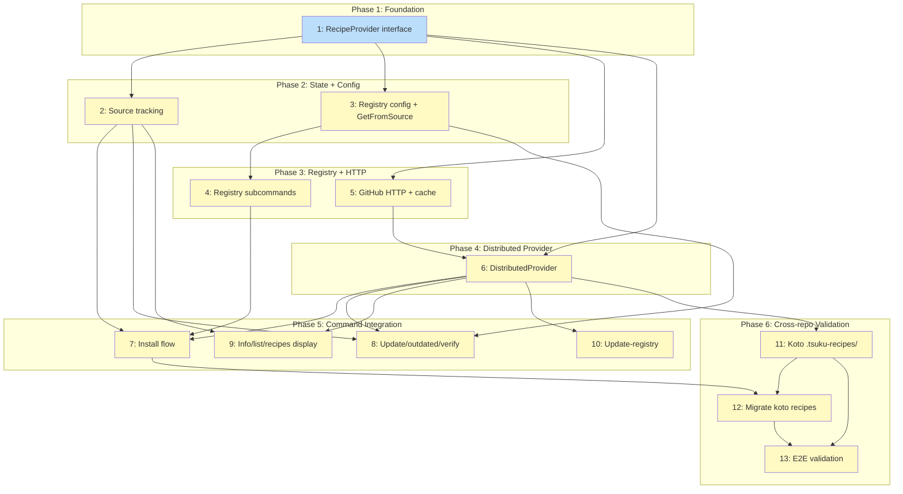

# PLAN: Distributed Recipes

## Status

Draft

## Scope Summary

Extract a RecipeProvider interface that all recipe sources implement, add source tracking to installed tool state, and build a distributed provider that fetches recipes from GitHub repositories via HTTP. This enables third-party repositories to host their own tsuku recipes without centralizing everything in the main registry.

## Decomposition Strategy

**Horizontal decomposition.** The design's 5 phases form a natural dependency chain where each phase produces a stable interface that the next phase builds on. The Loader refactor (Phase 1) is a pure refactor with no behavior change, making it safe to land first. Each subsequent layer adds capability incrementally: source tracking, registry configuration, distributed HTTP fetching, then command integration. Walking skeleton was not appropriate because the provider interface is a prerequisite for all other components -- there's no meaningful vertical slice without it.

## Issue Outlines

### Issue 1: refactor(recipe): extract RecipeProvider interface and refactor Loader

**Complexity:** critical

**Goal:** Extract a `RecipeProvider` interface and refactor the Loader from a hardcoded four-source priority chain into an ordered `[]RecipeProvider` slice, with no behavior change.

**Acceptance Criteria:**

- [ ] `RecipeProvider` interface defined in `internal/recipe/provider.go` with `Get(ctx, name) ([]byte, error)`, `List(ctx) ([]RecipeInfo, error)`, and `Source() RecipeSource` methods
- [ ] `SatisfiesProvider` optional interface defined with `SatisfiesEntries(ctx) (map[string]string, error)`
- [ ] `RefreshableProvider` optional interface defined with `Refresh(ctx) error`
- [ ] `LocalProvider` adapter wrapping the existing `recipesDir` filesystem logic, implementing `RecipeProvider` and `SatisfiesProvider`
- [ ] `EmbeddedProvider` adapter wrapping `EmbeddedRegistry`, implementing `RecipeProvider` and `SatisfiesProvider`
- [ ] `CentralRegistryProvider` adapter wrapping `*Registry`, implementing `RecipeProvider`, `SatisfiesProvider` (via manifest), and `RefreshableProvider`
- [ ] Loader struct holds `providers []RecipeProvider` instead of separate `registry`, `embedded`, and `recipesDir` fields
- [ ] Four chain methods (`GetWithContext`, `loadDirect`, `getEmbeddedOnly`, `loadEmbeddedDirect`) collapsed into a single `resolveFromChain(ctx, providers, name, trySatisfies)` method
- [ ] `RequireEmbedded` works by filtering the provider list to `Source() == SourceEmbedded` before calling `resolveFromChain`
- [ ] Satisfies index built from providers implementing `SatisfiesProvider`, with entries tagged by source for filtering
- [ ] `satisfiesIndex` entries use `satisfiesEntry{recipeName, source}` struct (not bare string) to support source-filtered lookups
- [ ] Three Loader constructors (`New`, `NewWithLocalRecipes`, `NewWithoutEmbedded`) replaced by a single `NewLoader(providers ...RecipeProvider)` constructor
- [ ] All existing call sites updated to build provider slices and pass to `NewLoader`
- [ ] `warnIfShadows` refactored to detect shadowing across providers instead of hardcoding `l.registry.GetCached()`
- [ ] In-memory parsed cache (`recipes map[string]*Recipe`) stays in the Loader, above the provider layer -- providers return `[]byte`, Loader parses
- [ ] `update-registry` uses `ProviderBySource()` + type-assertion to access `CentralRegistryProvider` internals (documented escape hatch)
- [ ] `go test ./...` passes with no behavior changes
- [ ] `go vet ./...` and `golangci-lint run` pass
- [ ] Consumer-side interfaces (`RecipeLoader` in `internal/actions/resolver.go` and `internal/verify/deps.go`) remain unchanged -- the Loader still satisfies them

**Dependencies:** None

---

### Issue 2: feat(state): add source tracking to ToolState

**Complexity:** testable

**Goal:** Add a top-level `Source` field to `ToolState` that records where each installed tool's recipe came from, with lazy migration for existing state files.

**Acceptance Criteria:**

- [ ] `ToolState` in `internal/install/state.go` has a `Source string` field with `json:"source,omitempty"` tag
- [ ] Lazy migration runs in `Load()` alongside `migrateToMultiVersion()`: entries with empty `Source` get `"central"` by default; if `Plan.RecipeSource` is available on the active version, use it to infer a more specific value (e.g., `"embedded"`, `"local"`)
- [ ] Migration is idempotent -- running `Load()` twice produces identical results
- [ ] New installs populate `Source` during plan generation in `cmd/tsuku/helpers.go` based on the provider that resolved the recipe (values: `"central"`, `"embedded"`, `"local"`)
- [ ] Existing state.json files without `Source` fields load without errors
- [ ] `Source` field is persisted to state.json on next `Save()` after migration
- [ ] Unit tests cover: migration from empty source, migration inferring from Plan.RecipeSource, new install populating source, round-trip serialization with source field present and absent
- [ ] `go test ./...` passes
- [ ] `go vet ./...` passes

**Dependencies:** Issue 1

---

### Issue 3: feat(config): add registry configuration and GetFromSource

**Complexity:** testable

**Goal:** Add registry configuration to `config.toml` and implement `Loader.GetFromSource()` so that source-directed operations (update, verify, outdated) can load recipes from a specific provider rather than walking the full priority chain.

**Acceptance Criteria:**

Registry configuration:

- [ ] `RegistryEntry` struct added to `internal/userconfig/userconfig.go` with `URL string` and `AutoRegistered bool` fields, TOML-tagged appropriately
- [ ] `Config` struct gains `StrictRegistries bool` (`toml:"strict_registries,omitempty"`) and `Registries map[string]RegistryEntry` (`toml:"registries,omitempty"`)
- [ ] Existing `Load()` and `Save()` round-trip the new fields correctly (empty registries map does not produce spurious TOML output)
- [ ] Unit tests: load config with registries, save and reload, verify equality; load config without registries section (backward compat)

GetFromSource:

- [ ] `Loader.GetFromSource(ctx context.Context, name string, source string) ([]byte, error)` added to the Loader
- [ ] When `source` matches a provider's `Source().String()` (e.g., `"central"` for the central registry provider), delegates to that provider's `Get()` method
- [ ] When `source` is an `"owner/repo"` string, delegates to the distributed provider for that repo (returns an error if no matching provider is registered -- the distributed provider itself comes in a later issue)
- [ ] Returns a clear error when no provider matches the given source
- [ ] Does NOT read from or write to the Loader's in-memory `recipes` cache
- [ ] Unit tests with mock providers: verify correct provider is selected, verify cache is bypassed, verify error on unknown source

**Dependencies:** Issue 1

---

### Issue 4: feat(cli): implement tsuku registry subcommands

**Complexity:** testable

**Goal:** Implement `tsuku registry` subcommands (`list`, `add`, `remove`) that let users manage distributed recipe sources stored in `config.toml`.

**Acceptance Criteria:**

- [ ] `tsuku registry list` displays each registered source with its URL, `(auto-registered)` annotation where applicable, and `strict_registries` status
- [ ] `tsuku registry add <owner/repo>` validates format using `ValidateGitHubURL()`, adds entry to `config.Registries`, sets `AutoRegistered = false`, saves config; idempotent for already-registered sources
- [ ] `tsuku registry remove <owner/repo>` removes entry, does NOT remove installed tools from that source (R13), prints informational message listing tools still installed from the removed source, handles non-existent registry gracefully
- [ ] `tsuku registry` with no subcommand prints help
- [ ] Subcommands registered in the main command tree with consistent exit codes and error formatting
- [ ] Clean output when no registries are configured

**Dependencies:** Issue 3

---

### Issue 5: feat(distributed): implement GitHub HTTP fetching and cache

**Complexity:** critical

**Goal:** Build the two-tier HTTP client (Contents API + raw content) with hostname validation, separate auth/unauth clients, and per-source cache management under `$TSUKU_HOME/cache/distributed/`.

**Acceptance Criteria:**

HTTP Client Setup:
- [ ] Two separate HTTP client instances via `httputil.NewSecureClient` (SSRF protection, DNS rebinding guards, HTTPS-only redirects)
- [ ] Authenticated client carries `GITHUB_TOKEN` (via `secrets` package) in `Authorization` header, used only for `api.github.com`
- [ ] Unauthenticated client has no auth headers, used for `raw.githubusercontent.com` fetches
- [ ] Token never sent to any host other than `api.github.com`

Contents API Integration:
- [ ] `GET /repos/{owner}/{repo}/contents/.tsuku-recipes` lists available TOML files
- [ ] Parse response to extract file names and `download_url` values
- [ ] Auto-resolve default branch; cache resolved branch name in `_source.json`
- [ ] When Contents API is rate-limited on cold cache, fall back to trying `main` then `master` branch with raw content URLs
- [ ] Clear error message when rate-limited, guiding user to set `GITHUB_TOKEN`

Download URL Validation:
- [ ] Validate every `download_url` uses HTTPS
- [ ] Hostname allowlist: `raw.githubusercontent.com`, `objects.githubusercontent.com`
- [ ] Reject non-allowlisted hostnames with a clear error

Cache Layer:
- [ ] Cache directory: `$TSUKU_HOME/cache/distributed/{owner}/{repo}/`
- [ ] Store fetched recipe TOML files as `{recipe}.toml`, metadata sidecars as `{recipe}.meta.json`
- [ ] `_source.json` per repo: branch name, directory listing, fetch timestamp
- [ ] Separate `CacheManager` instance with independent size limits from central registry cache
- [ ] Cache lookup before HTTP fetch; return cached data when fresh

Input Validation:
- [ ] Reuse `ValidateGitHubURL()` from `internal/discover/sanitize.go`
- [ ] Reject path traversal attempts, credentials in input, and invalid owner/repo patterns

Error Handling:
- [ ] Distinguish "repo not found", "no `.tsuku-recipes/`", "rate limited", and network errors
- [ ] Rate limit errors include remaining/reset information from response headers

**Dependencies:** Issue 1

---

### Issue 6: feat(distributed): implement DistributedProvider

**Complexity:** testable

**Goal:** Wire the GitHub HTTP client and cache into a `DistributedProvider` that implements `RecipeProvider` and `RefreshableProvider`, and register it in the Loader chain.

**Acceptance Criteria:**

Provider implementation:
- [ ] `DistributedProvider` implements `RecipeProvider` interface (`Get`, `List`, `Source`)
- [ ] `DistributedProvider` implements `RefreshableProvider` interface (`Refresh`)
- [ ] `Source()` returns `SourceDistributed`
- [ ] `Get(ctx, name)` fetches a single recipe TOML from the target repo's `.tsuku-recipes/`
- [ ] `List(ctx)` returns all recipes available from the cached directory listing

Loader registration:
- [ ] `DistributedProvider` registered in Loader as lowest-priority provider
- [ ] Provider only consulted for qualified names containing `/`
- [ ] Loader strips qualifier prefix when calling `Get()`, preserves full qualifier as in-memory cache key
- [ ] In-memory cache key `"owner/repo:foo"` is distinct from bare key `"foo"` -- no collision between distributed and central registry recipes with the same name

Tests:
- [ ] Unit tests for `Get()` with mocked HTTP responses
- [ ] Unit tests for `List()` using cached directory listing
- [ ] Unit tests for `download_url` hostname validation
- [ ] Unit tests for rate limit error handling and fallback behavior
- [ ] Unit tests for cache hit/miss/expiry scenarios
- [ ] Unit test for Loader integration: qualified name routing to DistributedProvider

**Dependencies:** Issue 1, Issue 5

---

### Issue 7: feat(install): integrate distributed sources into install flow

**Complexity:** testable

**Goal:** Add name parsing (owner/repo detection), confirmation prompt on first install from new source, auto-registration, source collision detection, and `-y` flag support to the install command.

**Acceptance Criteria:**

Name parsing:
- [ ] Detect `/` in tool name to identify distributed source requests
- [ ] Parse formats: `owner/repo`, `owner/repo:recipe`, `owner/repo@version`, `owner/repo:recipe@version`
- [ ] Reuse `ValidateGitHubURL()` for owner/repo validation

Trust and registration:
- [ ] Unregistered source with `strict_registries = false`: show confirmation prompt, `-y` skips it, auto-register on confirmation
- [ ] Unregistered source with `strict_registries = true`: error suggesting `tsuku registry add`
- [ ] Already-registered sources skip the confirmation prompt

Source collision detection:
- [ ] Same-name tool from different source: prompt before replacing
- [ ] `--force` flag skips the collision prompt; same-source reinstalls don't trigger it

State recording:
- [ ] Record `Source: "owner/repo"` on `ToolState` after successful install
- [ ] Record `sha256(recipe_toml_bytes)` in state.json (audit trail)

Telemetry:
- [ ] Distributed installs use opaque `"distributed"` tag, not the full `owner/repo`

**Dependencies:** Issue 2, Issue 4, Issue 6

---

### Issue 8: feat(cli): add source-directed loading to update, outdated, and verify

**Complexity:** testable

**Goal:** Make `update`, `outdated`, and `verify` read `ToolState.Source` and use `GetFromSource` to fetch recipes from the recorded provider.

**Acceptance Criteria:**

- [ ] `update`: reads `ToolState.Source`, calls `GetFromSource` for fresh recipe from the recorded source; central/embedded sources use existing chain; falls back gracefully if source is unreachable
- [ ] `outdated`: iterates installed tools checking each against its recorded source; empty/missing source defaults to `"central"`; unreachable sources produce warnings, not fatal errors
- [ ] `verify`: uses cached recipe from the recorded source for verification
- [ ] Unit tests for each command covering central, embedded, and distributed source paths
- [ ] Unit tests for fallback behavior when source is empty (migration path)
- [ ] No changes to CLI output format or exit codes for existing tools

**Dependencies:** Issue 2, Issue 3, Issue 6

---

### Issue 9: feat(cli): add source display to info, list, and recipes commands

**Complexity:** simple

**Goal:** Show source information in `info`, `list`, and `recipes` output for both human-readable and `--json` formats.

**Acceptance Criteria:**

- [ ] `list`: human-readable output shows source suffix for distributed tools (e.g., `ripgrep 14.1.1 [alice/tools]`); `--json` includes `"source"` field
- [ ] `info`: human-readable output includes `Source:` line; `--json` includes `"source"` field; shown for both installed and uninstalled tools
- [ ] `recipes`: recipes from all registered distributed sources appear alongside central recipes; each entry shows its source; `--local` flag continues to show only local recipes

**Dependencies:** Issue 2, Issue 6

---

### Issue 10: feat(cli): extend update-registry for distributed sources

**Complexity:** simple

**Goal:** Make `update-registry` refresh distributed source caches alongside the central registry using `RefreshableProvider`.

**Acceptance Criteria:**

- [ ] `tsuku update-registry` refreshes central registry cache (existing behavior, unchanged)
- [ ] Iterates Loader providers and calls `Refresh()` on those implementing `RefreshableProvider`
- [ ] Distributed providers re-fetch directory listings and stale cached recipes
- [ ] Errors from individual distributed sources are reported but don't block refresh of other sources
- [ ] Output indicates which distributed sources were refreshed and any errors
- [ ] Unit tests cover iteration logic and error-handling behavior
- [ ] Existing `update-registry` tests continue to pass

**Dependencies:** Issue 6

---

### Issue 11: feat(koto): create .tsuku-recipes/ directory in koto repo

**Complexity:** simple

**Note:** Separate PR in `tsukumogami/koto` repository, not part of the main implementation PR.

**Goal:** Add a `.tsuku-recipes/` directory to the koto repo with recipe TOML files for koto's tools, validating the distributed recipe format with a real repository.

**Acceptance Criteria:**

- [ ] `.tsuku-recipes/` directory exists at the root of the koto repository
- [ ] At least one valid recipe TOML file is present for a koto tool
- [ ] Recipe TOML files use the same schema as central registry recipes
- [ ] Recipe files follow naming conventions: kebab-case filename matching the recipe name
- [ ] Each recipe has a valid `[version]` section with an appropriate version provider
- [ ] No manifest file or additional configuration required
- [ ] PR submitted to `tsukumogami/koto`

**Dependencies:** Issue 6

---

### Issue 12: chore(recipes): migrate koto recipes from central registry to distributed

**Complexity:** simple

**Note:** Separate PR in tsuku repo after distributed install flow is working.

**Goal:** Remove koto tool recipes from the central `recipes/` directory, completing the migration to distributed recipes hosted in the koto repository.

**Acceptance Criteria:**

- [ ] All koto-related recipe TOML files removed from `recipes/` in this repo
- [ ] Central registry manifest no longer includes koto recipe entries
- [ ] CI passes with the recipes removed
- [ ] Migration note in PR description explaining that koto tools should now be installed via `tsuku install <owner>/<repo>` syntax

**Dependencies:** Issue 7, Issue 11

---

### Issue 13: test(distributed): end-to-end validation with released binary

**Complexity:** testable

**Note:** Post-release validation, requires a tagged release with distributed recipe support.

**Goal:** Validate that `tsuku install tsukumogami/koto` works end-to-end after release: confirmation prompt, auto-registration, install, update, outdated, verify all function correctly against a real distributed source.

**Acceptance Criteria:**

- [ ] `tsuku install tsukumogami/koto` works end-to-end with a released binary
- [ ] First install shows confirmation prompt, accepting auto-registers in `$TSUKU_HOME/config.toml`
- [ ] Subsequent installs skip the prompt (source already registered)
- [ ] `tsuku list`, `info`, `update`, `outdated`, `verify` all work correctly for the distributed tool
- [ ] `tsuku registry list` includes `tsukumogami/koto`
- [ ] `tsuku recipes` includes recipes from the distributed source
- [ ] `tsuku remove <tool>` cleanly removes the distributed tool
- [ ] `-y` flag skips confirmation; `strict_registries = true` blocks unregistered sources

**Dependencies:** Issue 11, Issue 12

## Dependency Graph

**Legend**: Green = done, Blue = ready, Yellow = blocked

## Implementation Sequence

**Critical path:** Issue 1 -> Issue 5 -> Issue 6 -> Issue 7 -> Issue 12 -> Issue 13 (6 issues)

**Recommended order:**

1. **Issue 1** -- RecipeProvider interface refactor (everything depends on this)
2. **Issues 2, 3** in parallel -- source tracking + registry config
3. **Issues 4, 5** in parallel -- registry CLI + GitHub HTTP client
4. **Issue 6** -- DistributedProvider (depends on 1 + 5)
5. **Issues 7, 8, 9, 10** in parallel -- install flow, command updates, display changes, update-registry
6. **Issue 11** -- koto `.tsuku-recipes/` directory (separate PR in koto repo)
7. **Issue 12** -- koto recipe migration (separate PR, after install flow works)
8. **Issue 13** -- end-to-end validation (after tagged release)

**Parallelization opportunities:**
- After Issue 1: Issues 2 and 3 can proceed concurrently
- After Issue 3: Issues 4 and 5 can proceed concurrently
- After Issue 6: Issues 7, 8, 9, 10, and 11 can all proceed concurrently (5 parallel issues)
