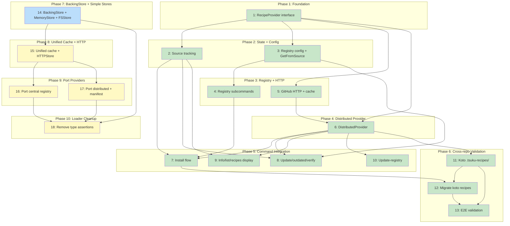

# PLAN: Distributed Recipes

## Status

Done

## Scope Summary

Extract a RecipeProvider interface that all recipe sources implement, add source tracking to installed tool state, and build a distributed provider that fetches recipes from GitHub repositories via HTTP (Issues 1-13, complete). Then unify all four provider implementations behind a single RegistryProvider type configured by a manifest and BackingStore interface, eliminating duplicated cache systems, type assertions, and per-source switch logic (Issues 14-18, Decision 8).

## Decomposition Strategy

**Horizontal decomposition.** The design's 5 phases form a natural dependency chain where each phase produces a stable interface that the next phase builds on. The Loader refactor (Phase 1) is a pure refactor with no behavior change, making it safe to land first. Each subsequent layer adds capability incrementally: source tracking, registry configuration, distributed HTTP fetching, then command integration. Walking skeleton was not appropriate because the provider interface is a prerequisite for all other components -- there's no meaningful vertical slice without it.

## Issue Outlines

### Issue 1: refactor(recipe): extract RecipeProvider interface and refactor Loader

**Complexity:** critical

**Goal:** Extract a `RecipeProvider` interface and refactor the Loader from a hardcoded four-source priority chain into an ordered `[]RecipeProvider` slice, with no behavior change.

**Acceptance Criteria:**

- [x] `RecipeProvider` interface defined in `internal/recipe/provider.go` with `Get(ctx, name) ([]byte, error)`, `List(ctx) ([]RecipeInfo, error)`, and `Source() RecipeSource` methods
- [x] `SatisfiesProvider` optional interface defined with `SatisfiesEntries(ctx) (map[string]string, error)`
- [x] `RefreshableProvider` optional interface defined with `Refresh(ctx) error`
- [x] `LocalProvider` adapter wrapping the existing `recipesDir` filesystem logic, implementing `RecipeProvider` and `SatisfiesProvider`
- [x] `EmbeddedProvider` adapter wrapping `EmbeddedRegistry`, implementing `RecipeProvider` and `SatisfiesProvider`
- [x] `CentralRegistryProvider` adapter wrapping `*Registry`, implementing `RecipeProvider`, `SatisfiesProvider` (via manifest), and `RefreshableProvider`
- [x] Loader struct holds `providers []RecipeProvider` instead of separate `registry`, `embedded`, and `recipesDir` fields
- [x] Four chain methods (`GetWithContext`, `loadDirect`, `getEmbeddedOnly`, `loadEmbeddedDirect`) collapsed into a single `resolveFromChain(ctx, providers, name, trySatisfies)` method
- [x] `RequireEmbedded` works by filtering the provider list to `Source() == SourceEmbedded` before calling `resolveFromChain`
- [x] Satisfies index built from providers implementing `SatisfiesProvider`, with entries tagged by source for filtering
- [x] `satisfiesIndex` entries use `satisfiesEntry{recipeName, source}` struct (not bare string) to support source-filtered lookups
- [x] Three Loader constructors (`New`, `NewWithLocalRecipes`, `NewWithoutEmbedded`) replaced by a single `NewLoader(providers ...RecipeProvider)` constructor
- [x] All existing call sites updated to build provider slices and pass to `NewLoader`
- [x] `warnIfShadows` refactored to detect shadowing across providers instead of hardcoding `l.registry.GetCached()`
- [x] In-memory parsed cache (`recipes map[string]*Recipe`) stays in the Loader, above the provider layer -- providers return `[]byte`, Loader parses
- [x] `update-registry` uses `ProviderBySource()` + type-assertion to access `CentralRegistryProvider` internals (documented escape hatch)
- [x] `go test ./...` passes with no behavior changes
- [x] `go vet ./...` and `golangci-lint run` pass
- [x] Consumer-side interfaces (`RecipeLoader` in `internal/actions/resolver.go` and `internal/verify/deps.go`) remain unchanged -- the Loader still satisfies them

**Dependencies:** None

---

### Issue 2: feat(state): add source tracking to ToolState

**Complexity:** testable

**Goal:** Add a top-level `Source` field to `ToolState` that records where each installed tool's recipe came from, with lazy migration for existing state files.

**Acceptance Criteria:**

- [x] `ToolState` in `internal/install/state.go` has a `Source string` field with `json:"source,omitempty"` tag
- [x] Lazy migration runs in `Load()` alongside `migrateToMultiVersion()`: entries with empty `Source` get `"central"` by default; if `Plan.RecipeSource` is available on the active version, use it to infer a more specific value (e.g., `"embedded"`, `"local"`)
- [x] Migration is idempotent -- running `Load()` twice produces identical results
- [x] New installs populate `Source` during plan generation in `cmd/tsuku/helpers.go` based on the provider that resolved the recipe (values: `"central"`, `"embedded"`, `"local"`)
- [x] Existing state.json files without `Source` fields load without errors
- [x] `Source` field is persisted to state.json on next `Save()` after migration
- [x] Unit tests cover: migration from empty source, migration inferring from Plan.RecipeSource, new install populating source, round-trip serialization with source field present and absent
- [x] `go test ./...` passes
- [x] `go vet ./...` passes

**Dependencies:** Issue 1

---

### Issue 3: feat(config): add registry configuration and GetFromSource

**Complexity:** testable

**Goal:** Add registry configuration to `config.toml` and implement `Loader.GetFromSource()` so that source-directed operations (update, verify, outdated) can load recipes from a specific provider rather than walking the full priority chain.

**Acceptance Criteria:**

Registry configuration:

- [x] `RegistryEntry` struct added to `internal/userconfig/userconfig.go` with `URL string` and `AutoRegistered bool` fields, TOML-tagged appropriately
- [x] `Config` struct gains `StrictRegistries bool` (`toml:"strict_registries,omitempty"`) and `Registries map[string]RegistryEntry` (`toml:"registries,omitempty"`)
- [x] Existing `Load()` and `Save()` round-trip the new fields correctly (empty registries map does not produce spurious TOML output)
- [x] Unit tests: load config with registries, save and reload, verify equality; load config without registries section (backward compat)

GetFromSource:

- [x] `Loader.GetFromSource(ctx context.Context, name string, source string) ([]byte, error)` added to the Loader
- [x] When `source` matches a provider's `Source().String()` (e.g., `"central"` for the central registry provider), delegates to that provider's `Get()` method
- [x] When `source` is an `"owner/repo"` string, delegates to the distributed provider for that repo (returns an error if no matching provider is registered -- the distributed provider itself comes in a later issue)
- [x] Returns a clear error when no provider matches the given source
- [x] Does NOT read from or write to the Loader's in-memory `recipes` cache
- [x] Unit tests with mock providers: verify correct provider is selected, verify cache is bypassed, verify error on unknown source

**Dependencies:** Issue 1

---

### Issue 4: feat(cli): implement tsuku registry subcommands

**Complexity:** testable

**Goal:** Implement `tsuku registry` subcommands (`list`, `add`, `remove`) that let users manage distributed recipe sources stored in `config.toml`.

**Acceptance Criteria:**

- [x] `tsuku registry list` displays each registered source with its URL, `(auto-registered)` annotation where applicable, and `strict_registries` status
- [x] `tsuku registry add <owner/repo>` validates format using `ValidateGitHubURL()`, adds entry to `config.Registries`, sets `AutoRegistered = false`, saves config; idempotent for already-registered sources
- [x] `tsuku registry remove <owner/repo>` removes entry, does NOT remove installed tools from that source (R13), prints informational message listing tools still installed from the removed source, handles non-existent registry gracefully
- [x] `tsuku registry` with no subcommand prints help
- [x] Subcommands registered in the main command tree with consistent exit codes and error formatting
- [x] Clean output when no registries are configured

**Dependencies:** Issue 3

---

### Issue 5: feat(distributed): implement GitHub HTTP fetching and cache

**Complexity:** critical

**Goal:** Build the two-tier HTTP client (Contents API + raw content) with hostname validation, separate auth/unauth clients, and per-source cache management under `$TSUKU_HOME/cache/distributed/`.

**Acceptance Criteria:**

HTTP Client Setup:
- [x] Two separate HTTP client instances via `httputil.NewSecureClient` (SSRF protection, DNS rebinding guards, HTTPS-only redirects)
- [x] Authenticated client carries `GITHUB_TOKEN` (via `secrets` package) in `Authorization` header, used only for `api.github.com`
- [x] Unauthenticated client has no auth headers, used for `raw.githubusercontent.com` fetches
- [x] Token never sent to any host other than `api.github.com`

Contents API Integration:
- [x] `GET /repos/{owner}/{repo}/contents/.tsuku-recipes` lists available TOML files
- [x] Parse response to extract file names and `download_url` values
- [x] Auto-resolve default branch; cache resolved branch name in `_source.json`
- [x] When Contents API is rate-limited on cold cache, fall back to trying `main` then `master` branch with raw content URLs
- [x] Clear error message when rate-limited, guiding user to set `GITHUB_TOKEN`

Download URL Validation:
- [x] Validate every `download_url` uses HTTPS
- [x] Hostname allowlist: `raw.githubusercontent.com`, `objects.githubusercontent.com`
- [x] Reject non-allowlisted hostnames with a clear error

Cache Layer:
- [x] Cache directory: `$TSUKU_HOME/cache/distributed/{owner}/{repo}/`
- [x] Store fetched recipe TOML files as `{recipe}.toml`, metadata sidecars as `{recipe}.meta.json`
- [x] `_source.json` per repo: branch name, directory listing, fetch timestamp
- [x] Separate `CacheManager` instance with independent size limits from central registry cache
- [x] Cache lookup before HTTP fetch; return cached data when fresh

Input Validation:
- [x] Reuse `ValidateGitHubURL()` from `internal/discover/sanitize.go`
- [x] Reject path traversal attempts, credentials in input, and invalid owner/repo patterns

Error Handling:
- [x] Distinguish "repo not found", "no `.tsuku-recipes/`", "rate limited", and network errors
- [x] Rate limit errors include remaining/reset information from response headers

**Dependencies:** Issue 1

---

### Issue 6: feat(distributed): implement DistributedProvider

**Complexity:** testable

**Goal:** Wire the GitHub HTTP client and cache into a `DistributedProvider` that implements `RecipeProvider` and `RefreshableProvider`, and register it in the Loader chain.

**Acceptance Criteria:**

Provider implementation:
- [x] `DistributedProvider` implements `RecipeProvider` interface (`Get`, `List`, `Source`)
- [x] `DistributedProvider` implements `RefreshableProvider` interface (`Refresh`)
- [x] `Source()` returns `SourceDistributed`
- [x] `Get(ctx, name)` fetches a single recipe TOML from the target repo's `.tsuku-recipes/`
- [x] `List(ctx)` returns all recipes available from the cached directory listing

Loader registration:
- [x] `DistributedProvider` registered in Loader as lowest-priority provider
- [x] Provider only consulted for qualified names containing `/`
- [x] Loader strips qualifier prefix when calling `Get()`, preserves full qualifier as in-memory cache key
- [x] In-memory cache key `"owner/repo:foo"` is distinct from bare key `"foo"` -- no collision between distributed and central registry recipes with the same name

Tests:
- [x] Unit tests for `Get()` with mocked HTTP responses
- [x] Unit tests for `List()` using cached directory listing
- [x] Unit tests for `download_url` hostname validation
- [x] Unit tests for rate limit error handling and fallback behavior
- [x] Unit tests for cache hit/miss/expiry scenarios
- [x] Unit test for Loader integration: qualified name routing to DistributedProvider

**Dependencies:** Issue 1, Issue 5

---

### Issue 7: feat(install): integrate distributed sources into install flow

**Complexity:** testable

**Goal:** Add name parsing (owner/repo detection), confirmation prompt on first install from new source, auto-registration, source collision detection, and `-y` flag support to the install command.

**Acceptance Criteria:**

Name parsing:
- [x] Detect `/` in tool name to identify distributed source requests
- [x] Parse formats: `owner/repo`, `owner/repo:recipe`, `owner/repo@version`, `owner/repo:recipe@version`
- [x] Reuse `ValidateGitHubURL()` for owner/repo validation

Trust and registration:
- [x] Unregistered source with `strict_registries = false`: show confirmation prompt, `-y` skips it, auto-register on confirmation
- [x] Unregistered source with `strict_registries = true`: error suggesting `tsuku registry add`
- [x] Already-registered sources skip the confirmation prompt

Source collision detection:
- [x] Same-name tool from different source: prompt before replacing
- [x] `--force` flag skips the collision prompt; same-source reinstalls don't trigger it

State recording:
- [x] Record `Source: "owner/repo"` on `ToolState` after successful install
- [x] Record `sha256(recipe_toml_bytes)` in state.json (audit trail)

Telemetry:
- [x] Distributed installs use opaque `"distributed"` tag, not the full `owner/repo`

**Dependencies:** Issue 2, Issue 4, Issue 6

---

### Issue 8: feat(cli): add source-directed loading to update, outdated, and verify

**Complexity:** testable

**Goal:** Make `update`, `outdated`, and `verify` read `ToolState.Source` and use `GetFromSource` to fetch recipes from the recorded provider.

**Acceptance Criteria:**

- [x] `update`: reads `ToolState.Source`, calls `GetFromSource` for fresh recipe from the recorded source; central/embedded sources use existing chain; falls back gracefully if source is unreachable
- [x] `outdated`: iterates installed tools checking each against its recorded source; empty/missing source defaults to `"central"`; unreachable sources produce warnings, not fatal errors
- [x] `verify`: uses cached recipe from the recorded source for verification
- [x] Unit tests for each command covering central, embedded, and distributed source paths
- [x] Unit tests for fallback behavior when source is empty (migration path)
- [x] No changes to CLI output format or exit codes for existing tools

**Dependencies:** Issue 2, Issue 3, Issue 6

---

### Issue 9: feat(cli): add source display to info, list, and recipes commands

**Complexity:** simple

**Goal:** Show source information in `info`, `list`, and `recipes` output for both human-readable and `--json` formats.

**Acceptance Criteria:**

- [x] `list`: human-readable output shows source suffix for distributed tools (e.g., `ripgrep 14.1.1 [alice/tools]`); `--json` includes `"source"` field
- [x] `info`: human-readable output includes `Source:` line; `--json` includes `"source"` field; shown for both installed and uninstalled tools
- [x] `recipes`: recipes from all registered distributed sources appear alongside central recipes; each entry shows its source; `--local` flag continues to show only local recipes

**Dependencies:** Issue 2, Issue 6

---

### Issue 10: feat(cli): extend update-registry for distributed sources

**Complexity:** simple

**Goal:** Make `update-registry` refresh distributed source caches alongside the central registry using `RefreshableProvider`.

**Acceptance Criteria:**

- [x] `tsuku update-registry` refreshes central registry cache (existing behavior, unchanged)
- [x] Iterates Loader providers and calls `Refresh()` on those implementing `RefreshableProvider`
- [x] Distributed providers re-fetch directory listings and stale cached recipes
- [x] Errors from individual distributed sources are reported but don't block refresh of other sources
- [x] Output indicates which distributed sources were refreshed and any errors
- [x] Unit tests cover iteration logic and error-handling behavior
- [x] Existing `update-registry` tests continue to pass

**Dependencies:** Issue 6

---

### Issue 11: feat(koto): create .tsuku-recipes/ directory in koto repo

**Complexity:** simple

**Note:** Separate PR in `tsukumogami/koto` repository, not part of the main implementation PR.

**Goal:** Add a `.tsuku-recipes/` directory to the koto repo with recipe TOML files for koto's tools, validating the distributed recipe format with a real repository.

**Acceptance Criteria:**

- [x] `.tsuku-recipes/` directory exists at the root of the koto repository
- [x] At least one valid recipe TOML file is present for a koto tool
- [x] Recipe TOML files use the same schema as central registry recipes
- [x] Recipe files follow naming conventions: kebab-case filename matching the recipe name
- [x] Each recipe has a valid `[version]` section with an appropriate version provider
- [x] No manifest file or additional configuration required
- [x] PR submitted to `tsukumogami/koto`

**Dependencies:** Issue 6

---

### Issue 12: chore(recipes): migrate koto recipes from central registry to distributed

**Complexity:** simple

**Note:** Separate PR in tsuku repo after distributed install flow is working.

**Goal:** Remove koto tool recipes from the central `recipes/` directory, completing the migration to distributed recipes hosted in the koto repository.

**Acceptance Criteria:**

- [x] All koto-related recipe TOML files removed from `recipes/` in this repo
- [x] Central registry manifest no longer includes koto recipe entries
- [x] CI passes with the recipes removed
- [x] Migration note in PR description explaining that koto tools should now be installed via `tsuku install <owner>/<repo>` syntax

**Dependencies:** Issue 7, Issue 11

---

### Issue 13: test(distributed): end-to-end validation with released binary

**Complexity:** testable

**Note:** Post-release validation, requires a tagged release with distributed recipe support.

**Goal:** Validate that `tsuku install tsukumogami/koto` works end-to-end after release: confirmation prompt, auto-registration, install, update, outdated, verify all function correctly against a real distributed source.

**Acceptance Criteria:**

- [x] `tsuku install tsukumogami/koto` works end-to-end with a released binary
- [x] First install shows confirmation prompt, accepting auto-registers in `$TSUKU_HOME/config.toml`
- [x] Subsequent installs skip the prompt (source already registered)
- [x] `tsuku list`, `info`, `update`, `outdated`, `verify` all work correctly for the distributed tool
- [x] `tsuku registry list` includes `tsukumogami/koto`
- [x] `tsuku recipes` includes recipes from the distributed source
- [x] `tsuku remove <tool>` cleanly removes the distributed tool
- [x] `-y` flag skips confirmation; `strict_registries = true` blocks unregistered sources

**Dependencies:** Issue 11, Issue 12

---

### Issue 14: refactor(recipe): define BackingStore interface and port simple providers

**Complexity:** critical

**Goal:** Define the `BackingStore` interface and implement `MemoryStore` and `FSStore`. Create the `RegistryProvider` struct. Port `EmbeddedProvider` and `LocalProvider` to `RegistryProvider` instances using these stores.

**Acceptance Criteria:**

BackingStore interface:
- [x] `BackingStore` interface defined with `Get(ctx, path string) ([]byte, error)` and `List(ctx) ([]string, error)`
- [x]Interface lives in `internal/recipe/` (alongside existing provider code)

MemoryStore:
- [x]`MemoryStore` implements `BackingStore` backed by a `map[string][]byte`
- [x]Constructor accepts the existing `go:embed` data from `internal/recipe/embedded.go`
- [x]`Get` returns bytes for the given path, `ErrNotFound` if absent
- [x]`List` returns all available recipe names (without `.toml` extension)

FSStore:
- [x]`FSStore` implements `BackingStore` backed by a filesystem directory path
- [x]`Get` reads `{dir}/{path}` from disk
- [x]`List` scans the directory for `.toml` files and returns recipe names
- [x]Handles missing directory gracefully (returns empty list, not error)

RegistryProvider:
- [x]`RegistryProvider` struct with `name`, `source RecipeSource`, `manifest Manifest`, and `store BackingStore` fields
- [x]Implements `RecipeProvider` interface (`Get`, `List`, `Source`)
- [x]`Get(ctx, name)` computes path from manifest layout: flat -> `name.toml`, grouped -> `firstLetter(name)/name.toml`
- [x]Implements `SatisfiesProvider`: reads from manifest index if available, falls back to parsing all recipes
- [x]Single `SatisfiesEntries` implementation replaces the three duplicated versions

Provider porting:
- [x]`EmbeddedProvider` replaced by `RegistryProvider` with `MemoryStore` and baked-in manifest (layout: flat)
- [x]`LocalProvider` replaced by `RegistryProvider` with `FSStore` and default manifest (layout: flat)
- [x]All call sites constructing `EmbeddedProvider` or `LocalProvider` updated
- [x]`provider_embedded.go` and `provider_local.go` can be deleted or reduced to factory functions
- [x]`go test ./...` passes with no behavior changes
- [x]`go vet ./...` and `golangci-lint run` pass

**Dependencies:** None (builds on top of completed Issue 1 infrastructure)

---

### Issue 15: refactor(cache): unify disk cache and implement HTTPStore

**Complexity:** critical

**Goal:** Merge the two cache implementations (`internal/registry/cache*.go` and `internal/distributed/cache.go`) into a single parameterized cache, and build `HTTPStore` using it.

**Acceptance Criteria:**

Unified cache:
- [x]Single disk cache implementation replacing both `registry.CacheManager` and `distributed.CacheManager`
- [x]Parameterized by: cache directory path, TTL, max size, eviction strategy
- [x]Supports both LRU eviction (central registry pattern) and oldest-bucket eviction (distributed pattern) via configuration
- [x]Metadata sidecar format covers both existing schemas: TTL, content hash, ETag, Last-Modified
- [x]Stale-if-error fallback with configurable max stale duration
- [x]High-water/low-water eviction thresholds (from existing central cache)
- [x]`CacheIntrospectable` optional interface for `update-registry` to inspect cache stats (replaces type-assertion to `*CentralRegistryProvider`)

HTTPStore:
- [x]`HTTPStore` implements `BackingStore` with built-in disk cache
- [x]Constructor accepts: base URL pattern, cache directory, TTL, size limit, HTTP client(s)
- [x]`Get` checks cache freshness, fetches via HTTP on miss/expiry, updates cache
- [x]`List` returns recipe names from cached directory listing
- [x]Handles conditional requests (ETag/If-Modified-Since) internally
- [x]Rate limit errors produce clear messages with reset time

Tests:
- [x]Unit tests for unified cache: TTL expiry, eviction, stale-if-error, metadata round-trip
- [x]Unit tests for HTTPStore: cache hit, cache miss, conditional request, rate limit
- [x]`go test ./...` passes
- [x]Existing central registry cache tests adapted to unified cache

**Dependencies:** Issue 14

---

### Issue 16: refactor(registry): port central registry to RegistryProvider

**Complexity:** testable

**Goal:** Replace `CentralRegistryProvider` with a `RegistryProvider` instance using `HTTPStore` and a baked-in manifest (layout: grouped, index_url: tsuku.dev/recipes.json).

**Acceptance Criteria:**

- [x]Central registry becomes a `RegistryProvider` with baked-in manifest: `{layout: "grouped", index_url: "https://tsuku.dev/recipes.json"}`
- [x]`HTTPStore` configured with: 24h TTL, 50MB cache limit, LRU eviction, cache dir `$TSUKU_HOME/registry/`
- [x]`SatisfiesEntries` reads from the index URL (existing manifest-based path) through the generic `RegistryProvider` implementation
- [x]`RefreshableProvider` implemented on `RegistryProvider` (delegates to `HTTPStore` cache refresh)
- [x]`update-registry` command uses `CacheIntrospectable` interface assertion instead of `*CentralRegistryProvider` cast
- [x]`provider_registry.go` can be deleted or reduced to a factory function
- [x]Cache directory layout unchanged (`$TSUKU_HOME/registry/{letter}/{name}.toml`) for backward compatibility
- [x]`go test ./...` passes with no behavior changes
- [x]`go vet ./...` and `golangci-lint run` pass

**Dependencies:** Issue 15

---

### Issue 17: refactor(distributed): port distributed provider and add manifest discovery

**Complexity:** testable

**Goal:** Replace `DistributedProvider` with a `RegistryProvider` instance using `HTTPStore`, and add manifest fetching with directory probing.

**Acceptance Criteria:**

Manifest discovery:
- [x]When registering a new distributed source, tsuku probes for `.tsuku-recipes/manifest.json` via Contents API
- [x]Falls back to `recipes/manifest.json` if `.tsuku-recipes/` not found
- [x]Falls back to no manifest (flat layout, no index) if neither exists
- [x]Manifest schema: `{"layout": "flat|grouped", "index_url": "..."}`
- [x]Both fields optional, defaults to flat layout

Provider porting:
- [x]Distributed registries become `RegistryProvider` instances with discovered manifest and `HTTPStore`
- [x]`HTTPStore` configured with: 1h TTL, 20MB cache limit, cache dir `$TSUKU_HOME/cache/distributed/{owner}/{repo}/`
- [x]GitHub Contents API client logic moves into or wraps `HTTPStore`
- [x]`internal/distributed/provider.go` can be deleted or reduced to a factory function
- [x]Dynamic provider registration (`addDistributedProvider`) creates `RegistryProvider` instances

Tests:
- [x]Unit tests for manifest discovery (found, not found, fallback)
- [x]Unit tests for directory probing order (`.tsuku-recipes/` first, then `recipes/`)
- [x]Existing distributed provider tests adapted
- [x]`go test ./...` passes

**Dependencies:** Issue 15

---

### Issue 18: refactor(loader): remove type assertions and collapse GetFromSource

**Complexity:** testable

**Goal:** Clean up the Loader now that all providers are `RegistryProvider` instances. Remove concrete type assertions, collapse `GetFromSource`, and simplify `install_distributed.go`.

**Acceptance Criteria:**

Loader cleanup:
- [x]All 5 type assertions to concrete provider types removed from `loader.go`
- [x]`warnIfShadows` uses `BackingStore` interface methods instead of casting to `*EmbeddedProvider` or `*CentralRegistryProvider`
- [x]`RecipesDir()` and `SetRecipesDir()` use interface methods or `RegistryProvider` directly instead of `*LocalProvider` cast
- [x]`GetFromSource()` collapsed from ~60 lines to ~5: find provider by source, call Get
- [x]No per-source-type switch logic remains

install_distributed.go simplification:
- [x]`addDistributedProvider()` creates a `RegistryProvider` (not `DistributedProvider`)
- [x]Provider-specific logic moved behind the `RegistryProvider` / `BackingStore` interface
- [x]Net reduction in `install_distributed.go` line count

Source tracking:
- [x]`SourceCentral` / `SourceRegistry` / `SourceEmbedded` distinction simplified where possible
- [x]Source matching in `GetFromSource` is uniform across all provider types

Tests:
- [x]`go test ./...` passes with no behavior changes
- [x]`go vet ./...` and `golangci-lint run` pass
- [x]No new type assertions introduced

**Dependencies:** Issue 14, Issue 16, Issue 17

## Dependency Graph

**Legend**: Green = done, Blue = ready, Yellow = blocked

## Implementation Sequence

### Issues 1-13 (Complete)

**Critical path:** Issue 1 -> Issue 5 -> Issue 6 -> Issue 7 -> Issue 12 -> Issue 13 (6 issues)

**Recommended order:**

1. **Issue 1** -- RecipeProvider interface refactor (everything depends on this)
2. **Issues 2, 3** in parallel -- source tracking + registry config
3. **Issues 4, 5** in parallel -- registry CLI + GitHub HTTP client
4. **Issue 6** -- DistributedProvider (depends on 1 + 5)
5. **Issues 7, 8, 9, 10** in parallel -- install flow, command updates, display changes, update-registry
6. **Issue 11** -- koto `.tsuku-recipes/` directory (separate PR in koto repo)
7. **Issue 12** -- koto recipe migration (separate PR, after install flow works)
8. **Issue 13** -- end-to-end validation (after tagged release)

### Issues 14-18 (Registry Unification)

**Critical path:** Issue 14 -> Issue 15 -> Issue 16 or 17 -> Issue 18 (4 issues)

**Recommended order:**

1. **Issue 14** -- BackingStore interface + MemoryStore + FSStore + port embedded/local (entry point)
2. **Issue 15** -- Unified disk cache + HTTPStore (depends on 14)
3. **Issues 16, 17** in parallel -- port central registry + port distributed with manifest discovery (both depend on 15)
4. **Issue 18** -- Loader cleanup (depends on 14, 16, 17)

**Parallelization opportunities:**
- After Issue 15: Issues 16 and 17 can proceed concurrently (porting central and distributed are independent)
