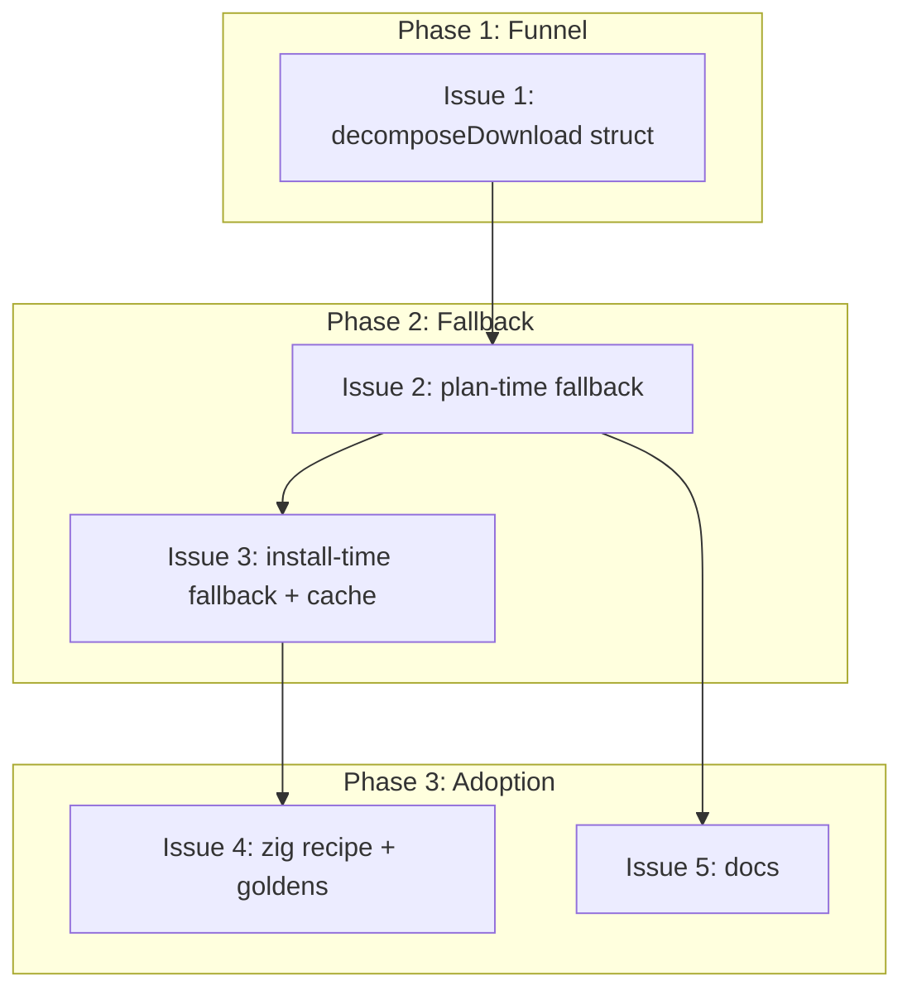

# PLAN: Multi-source fallback for archive downloads

## Status

Active

## Scope Summary

Give `download_archive` and the three sibling actions that share its download
funnel an optional ordered `fallback_urls` list, carry that list into the
generated plan so install-time fallback survives publication, and convert
`internal/recipe/recipes/zig.toml` to use it. Single-source recipes keep
producing byte-identical plans.

## Decomposition Strategy

**Horizontal.** The design's five layers have a strict prerequisite ordering
and clean interfaces between them, so there is no vertical slice worth cutting
first: the funnel refactor has to land before the new field has anywhere to go,
plan-time emission has to land before install-time consumption has anything to
read, and the zig conversion has to land after both or its goldens cannot be
generated. A walking skeleton would mean writing the funnel change twice.

The sequencing also does the reviewability work. Issue 1 is a pure refactor
with no behaviour change and no golden movement, which keeps the parameter
plumbing out of the diffs that are actually about fallback. Issue 4 is the only
one that touches golden files, so a reviewer can check the "nothing else moved"
claim by looking at exactly one commit.

Single-pr because the five units are not independently useful: a recipe schema
that accepts `fallback_urls` with no plan-time walk behind it delivers nothing,
and plan-time fallback without install-time fallback ships the published-plan
journey half-built. The value confirmation guard records this as a mis-split if
forced apart, so the units land together and the PR is the unit of value.

## Issue Outlines

### Issue 1: refactor(actions): convert decomposeDownload to a parameter struct

**Complexity**: simple

**Goal**: Replace `decomposeDownload`'s six positional parameters with a
`downloadSpec` struct in `internal/actions/composites.go`, and update all four
call sites (`download_archive` at composites.go:319, `github_archive` at
composites.go:658, `github_file` at composites.go:1072, `fossil_archive` at
fossil_archive.go:142). No new field, no behaviour change, no golden movement.

**Acceptance Criteria**:
- `downloadSpec` struct exists with `URL`, `FallbackURLs`, `Dest`,
  `OSMapping`, `ArchMapping`, `ChecksumURL` fields
- `decomposeDownload(ctx *EvalContext, spec downloadSpec) (Step, error)` is the
  only signature; no positional variant remains
- All four call sites are converted and pass their existing values by field name
- The doc comment explains why the funnel takes a struct (four shared callers)
- `go build ./...` and `go vet ./...` pass
- `go test ./...` passes with no test changes required
- `git diff --stat testdata/golden/` is empty

**Dependencies**: None

---

### Issue 2: feat(actions): plan-time fallback across an ordered source list

**Complexity**: testable

**Goal**: Add the `fallback_urls` recipe parameter and make plan generation walk
it. `DownloadArchiveAction.Decompose` reads the list and passes it through the
`downloadSpec`; `DownloadAction.Decompose` expands each entry with the same
`vars` map used for `url` (so `os_mapping` / `arch_mapping` apply identically),
walks `[url, ...fallback]` through `ctx.Downloader.Download` until one answers,
and writes the expanded alternates into the emitted `download_file` step's
params — only when the list is non-empty. Extend `Preflight` on both actions and
`validatePathParams` in `internal/recipe/validator.go` to validate every entry,
and add `fallback_urls` to `actionVersionRules` in
`internal/recipe/hardcoded.go` for `download` and `download_archive`.

**Acceptance Criteria**:
- A recipe step can declare `fallback_urls = ["https://...", ...]` and the
  recipe validator accepts it
- Placeholder expansion (`{version}`, `{os}`, `{arch}`) and `os_mapping` /
  `arch_mapping` apply to every entry exactly as they do to `url`
- Plan generation succeeds when `url` is unreachable and a `fallback_urls` entry
  is reachable, and the emitted step is identical to the one generated when
  `url` is reachable, apart from nothing — the checksum, size, dest and hoisted
  `url` are the same
- `ResolvedStep.URL` always holds the primary and is never rewritten to the
  source that served
- Plan generation fails only when every source fails, and the error names each
  source tried and the reason each one failed
- `params["fallback_urls"]` is present only when the recipe declared a
  non-empty list; a single-source recipe's params map is unchanged
- Every `fallback_urls` entry is validated for HTTPS scheme and URL
  well-formedness, and the `{version}`-placeholder expectation that applies to
  `url` applies to each entry
- A recipe declaring `fallback_urls` with no `checksum_url` produces a preflight
  warning naming the widened plan-time trust set
- Tests cover: fallback to a later source, exhaustion with a per-source error,
  single-source behaviour unchanged, placeholder expansion on alternates,
  validator rejection of a non-HTTPS alternate
- `go test ./...` passes

**Dependencies**: Issue 1

---

### Issue 3: feat(actions): install-time fallback and cache reachability

**Complexity**: testable

**Goal**: Make install fall back the same way. Add
`downloadFileHTTPWithFallback` to `internal/actions/download_file.go`, wrapping
the existing per-source retry loop so each source gets its full three attempts
and backoff before the next is tried. `DownloadFileAction.Execute` reads
`fallback_urls` from the step params and uses the list for both the download and
the cache probe. Add `DownloadCache.CheckAny`, which walks the candidate URL
keys in order and returns the first hit, with the existing checksum verification
unchanged.

**Acceptance Criteria**:
- `downloadFileHTTPWithFallback` tries sources in declaration order; each source
  runs the existing retry loop before the next source is attempted
- A non-retryable status (404) ends attempts against that source and moves to
  the next, rather than aborting the whole download
- The error when every source fails names each source and its failure reason
- `VerifyChecksum` runs on the downloaded bytes on every path out of `Execute`;
  no fallback path skips or defers it
- A source serving bytes that do not match the pinned checksum fails the
  install; fallback does not mask it
- HTTPS enforcement applies per source
- `DownloadCache.CheckAny(urls, destPath, checksum, algo)` returns on the first
  candidate key that hits, and the existing checksum verification gates use of
  the cached file
- A cache entry saved while one source served is a hit when a later run resolves
  to a different source in the same list
- A `download_file` step with no `fallback_urls` behaves exactly as it does
  today, including a single cache probe against `url`
- Tests cover: install falls through to a later source, exhaustion, checksum
  mismatch on an alternate, no-fallback plan unchanged, cache hit across sources
- `go test ./...` passes

**Dependencies**: Issue 2

---

### Issue 4: fix(recipes): give zig a fallback source list and regenerate its goldens

**Complexity**: critical

**Goal**: Convert `internal/recipe/recipes/zig.toml` to declare
`ziglang.freetls.fastly.net` first with alternates behind it, update the recipe's
source-history comment so the "this is still one URL" note does not go stale, and
move the nine affected goldens. Regenerate the three zig goldens under
`testdata/golden/plans/embedded/zig/`; apply the URL-only edit to the six ninja
goldens under `testdata/golden/plans/embedded/ninja/`, because ninja sits on the
#988 code-validation exclusion list and a full regeneration would sweep in
unrelated format drift. Confirm nothing else moved.

**Acceptance Criteria**:
- `zig.toml` declares `https://ziglang.freetls.fastly.net/...` as `url` and at
  least one alternate in `fallback_urls`
- The recipe comment block is updated: the "still one URL / #2443 tracks
  giving download_archive a fallback list" paragraph is replaced with what the
  list now is, why those hosts, and what independence still requires
- The three zig goldens contain `fallback_urls` in the zig `download_file` step
  and are otherwise unchanged from a regeneration
- The six ninja goldens carry the same `fallback_urls` addition inside their
  embedded zig dependency step, with no other field touched
- `scripts/validate-all-golden.sh` passes
- `git diff --name-only testdata/golden/` lists exactly those nine files
- No golden's `format_version` changes
- `Validate Embedded Dependencies` passes on the pull request
- `go test ./...` passes

**Dependencies**: Issue 3

---

### Issue 5: docs: document fallback_urls and its golden-handling rule

**Complexity**: simple

**Goal**: Document the parameter, the conditional-emission rule, and the
consequence for anyone regenerating a golden, in `docs/EMBEDDED_RECIPES.md`.

**Acceptance Criteria**:
- `fallback_urls` is documented for `download_archive` and its siblings, with a
  worked TOML example
- The ordering contract is stated: `url` first, alternates in declaration order,
  nothing probes or reorders
- The emission rule is documented — the field appears in a generated plan only
  when the recipe declares a non-empty list, which is why some goldens carry it
  and most do not
- The trust-model note is documented: every source must serve byte-identical
  content for the one pinned checksum
- `shirabe validate` passes on the changed docs

**Dependencies**: Issue 2

---

## Dependency Graph

## Implementation Sequence

**Critical path:** Issue 1 → Issue 2 → Issue 3 → Issue 4. Every step is a hard
prerequisite for the next: the funnel has to take a struct before the new field
has anywhere to live, the plan has to record the list before install can read
it, and zig's goldens cannot be generated until both halves work.

**Parallelizable:** Issue 5 (docs) unblocks as soon as Issue 2 fixes the
parameter name and the emission rule; it does not need install-time fallback or
the zig conversion.

**The step to watch:** Issue 4. It is the only one that touches golden files, so
it is where the byte-identical claim in the design either holds or does not.
Check `git diff --name-only testdata/golden/` there specifically — the design
predicts exactly nine files, and any tenth means the conditional-emission rule
in Issue 2 leaked.

**Definition of green.** `Build Essentials` currently fails two jobs on `main`
for unrelated reasons (`No-GCC Container: gdbm-source`, #2447; `Linux x86_64:
git-source`, #2449). Compare job-by-job against a current `main` baseline rather
than reading workflow-level red as this work's failure. The checks that matter
here are `Validate Embedded Dependencies` and, because Issue 2 changes what a
generated plan can contain, `Validate Golden Files (Execution)`.
