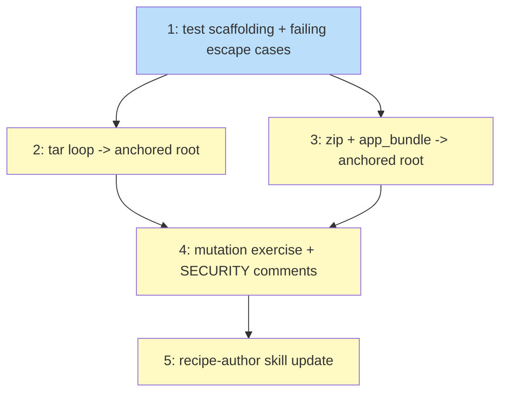

# PLAN: Kernel-enforced containment for archive extraction

## Status

Active

## Scope Summary

Close tsukumogami/tsuku#2473 by routing every archive-controlled write through a
kernel-enforced directory handle, in all three extraction loops, with a regression suite
that proves each guard is load-bearing and a skill update documenting the symlink contract
for recipe authors.

## Decomposition Strategy

**Horizontal**, with the shared test scaffolding first.

Walking skeleton does not apply: there is no pipeline to thread end to end. The work is one
mechanism applied to three loops that already exist and already have well-defined
boundaries. The one genuine ordering constraint is that the test scaffolding must exist
before the conversions, because the scaffolding is what demonstrates the conversions work
-- and, per the mutation exercise, a suite written after the fix tends to be a suite shaped
to pass it.

Issue 1 (scaffolding plus the failing escape cases) therefore comes first and is expected
to be **red on `main`**. That ordering is the plan's main deliberate choice: it makes the
vulnerability reproducible in CI before anything claims to fix it.

## Issue Outlines

### Issue 1: Add the extraction escape test scaffolding and failing regression cases

**Goal**: Establish the shared test harness and the escape cases that fail on current
`main`, so the vulnerability is demonstrated before it is fixed.

**Acceptance Criteria**:
- [ ] `fingerprintOutside`, `assertNothingEscaped`, `newSandbox` and `runExtractCase`
      helpers exist in `internal/actions`, with the two-level `t.TempDir()/sandbox/dest`
      layout so the escape target is disposable
- [ ] The canonical #2473 three-entry archive drives through the real `extractTarGz` and
      asserts nothing outside `dest` changed -- not that a helper returned an error
- [ ] The chain-lengthening variant reaching an arbitrary absolute path is covered
- [ ] Directory-entry and symlink-entry escapes are covered, not only regular files
- [ ] The overwrite-an-existing-outside-file case is covered via a canary
- [ ] Final-component-symlink escape cases are covered (these are the ones that catch
      defects the staged-symlink cases mask)
- [ ] Deep-nesting case covers parent directories created outside before the write
- [ ] Tests are NOT gated behind `testing.Short()`; CI always passes `-short`
- [ ] `git status --porcelain` is empty after the run
- [ ] Running against unmodified `main` shows these cases failing

**Dependencies**: None

**Type**: code
**Files**: `internal/actions/extract_escape_test.go`

### Issue 2: Route tar extraction through a work-directory-anchored root

**Goal**: Make containment kernel-enforced in `extractTarReader`, which all six tar
compression formats share.

**Acceptance Criteria**:
- [ ] `extractTarReader` derives its destination handle through a root anchored on the work
      directory (`workRoot.OpenRoot(dest)`), not `os.OpenRoot` on a lexically joined path
- [ ] `MkdirAll`, `OpenFile` and `Symlink` all run against the destination root using the
      entry's relative path
- [ ] The empty relative path produced by `strip_dirs` on a top-level entry is normalized
      to `"."` after the `files` filter
- [ ] Every mode passed to a `Root` method uses `.Perm()`
- [ ] `atomicSymlinkAt` added for root-relative symlink creation; existing `atomicSymlink`
      retained for the absolute-path call sites in `app_bundle.go`
- [ ] Errors are wrapped with the archive entry name
- [ ] All Issue 1 tar escape cases pass; all tar compatibility cases still pass
- [ ] Existing `extract_test.go` and `extract_formats_test.go` still pass

**Dependencies**: Blocked by <<ISSUE:1>>

**Type**: code
**Files**: `internal/actions/extract.go`

### Issue 3: Route zip extraction through the same anchored root

**Goal**: Apply the mechanism to `extractZip` in `extract.go` and `extractZIP` in
`app_bundle.go`, the latter of which also creates symlinks from zip entries.

**Acceptance Criteria**:
- [ ] `extractZip` and `app_bundle.go`'s `extractZIP` both use the anchored-root pattern
- [ ] `app_bundle.go`'s symlink creation goes through the root
- [ ] `.Perm()` applied -- without it, zip directory entries fail because `f.Mode()` carries
      `ModeDir`
- [ ] Zip and app-bundle escape cases from Issue 1 pass, including writing through a
      pre-existing in-destination symlink
- [ ] The macOS framework-bundle compatibility case (`Versions/Current` symlink chains)
      still extracts correctly
- [ ] `copyDir` deliberately unchanged; the reason is recorded in the PR body

**Dependencies**: Blocked by <<ISSUE:1>>

**Type**: code
**Files**: `internal/actions/extract.go`, `internal/actions/app_bundle.go`

### Issue 4: Run the mutation exercise and correct the `SECURITY:` comments

**Goal**: Demonstrate every guard is load-bearing, and make the comments describe what the
code actually guarantees -- the issue's fourth acceptance criterion.

**Acceptance Criteria**:
- [ ] Each of the 12 defects is injected individually, the named test confirmed to fail,
      and the defect reverted
- [ ] The two guards that cannot produce an escape given `symlink(2)`/`rename(2)` semantics
      are recorded as expected survivors with the reason, not hidden
- [ ] Results recorded in the PR body as a table
- [ ] `isPathWithinDirectory`'s comment states it is a lexical pre-filter for diagnostics
      and explicitly not the security boundary
- [ ] `validateSymlinkTarget`'s comment states it is packaging policy about where links may
      point, not a traversal guard
- [ ] A comment at the root-anchoring site explains why the destination is resolved through
      the work-directory root rather than joined

**Dependencies**: Blocked by <<ISSUE:2>>, <<ISSUE:3>>

**Type**: code
**Files**: `internal/actions/extract.go`

### Issue 5: Document the extraction symlink contract for recipe authors

**Goal**: Satisfy the repo's plugin-maintenance rule, which requires assessing
`plugins/tsuku-recipes/` skills in the same PR as an `internal/actions/` change.

**Acceptance Criteria**:
- [ ] `plugins/tsuku-recipes/skills/recipe-author/` documents what `extract` accepts:
      symlinks may point anywhere, but no entry may be written through a path that leaves
      the destination
- [ ] The zip-flattens-symlinks inconsistency is noted so authors are not surprised
- [ ] The honest framing is used -- this surface was always undocumented, so the answer to
      "does this add behavior no skill mentions" is yes, and this is where it gets written
      down
- [ ] No recipe changes; no behavior claimed that the code does not implement

**Dependencies**: Blocked by <<ISSUE:4>>

**Type**: docs
**Files**: `plugins/tsuku-recipes/skills/recipe-author/SKILL.md`

## Implementation Issues

Not applicable in single-pr mode. The outlines above are the decomposition; no GitHub
issues are created.

## Dependency Graph

Legend: blue = ready, yellow = blocked, green = done.

## Implementation Sequence

**Critical path**: 1 -> 2 -> 4 -> 5. Issue 3 runs parallel to 2 and joins at 4.

**Parallelization**: Issues 2 and 3 are independent once the scaffolding lands -- they
touch different functions, and `extract.go`'s tar and zip loops do not share code beyond
the helpers. In a single session they are naturally sequential; the graph records that
neither blocks the other.

**Why Issue 1 comes first**: it must be red on `main`. A regression suite for a security
bug that is written after the fix tends to be shaped to pass the fix. The mutation exercise
in Issue 4 is the check on that, and the first draft of the suite failed it -- ten of twelve
injected defects survived a suite built only from the issue's reproducer, because the guards
mask each other. The deep-nesting and final-component cases in Issue 1 exist specifically to
break that masking, and they are the reason Issue 4 can make a credible claim.

**Verification gate before the PR flips to ready**: `go test ./...`, `go vet ./...`,
`gofmt -l` clean, and the mutation table filled in with real results.
