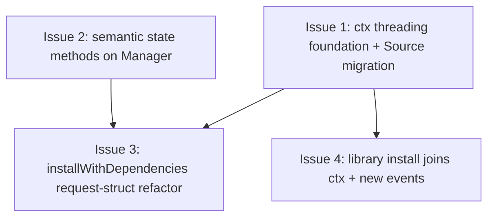

# PLAN: Install State Abstraction

## Status

Draft

## Scope Summary

Implementation plan for the install state abstraction design
(`docs/designs/DESIGN-install-state-abstraction.md`, status: Accepted).
Lands Candidate C: thread `context.Context` through `install.Manager`,
store `Source` via `installevents.WithSource`, collapse
`installWithDependencies`'s trailing-arg recursion, add semantic state
methods on Manager, and bring `InstallLibrary` onto the bus with four
new library event types. Cancellation lands as a free bonus.

Single-pr execution: all work lands in `explore/install-state-abstraction`
(PR #2414, now repurposed from design-only to design+implementation).
No GitHub issues created.

## Decomposition Strategy

**Horizontal decomposition.** The work refactors existing code rather
than building new functionality end-to-end, so the walking-skeleton
shape doesn't apply. Each work item is a coherent layer change that
leaves the binary in a working state. Items 1 and 2 are independent
foundations; item 3 builds on both; item 4 builds on item 1.

The design's six implementation phases consolidate to four work items
here because (a) Phases 1 and 2 share a commit per the design's
mandatory-coupling note (`InstallOptions.Source` removal must land
with ctx threading), and (b) Phase 6 (cancellation hooks) is folded
into Phase 1 and Phase 4 since `ctx.Err()` checks live next to the
code that performs the work being interrupted.

## Issue Outlines

### Issue 1: ctx threading foundation + Source migration

**Type**: code

**Goal**: Thread `context.Context` through `install.Manager`'s public
methods. Migrate `Source` from a positional parameter and
`InstallOptions.Source` field to ctx-based storage via
`installevents.WithSource(ctx, src)` and `SourceFromContext(ctx)`
helpers using a typed `srcKey struct{}`. Land SIGINT-aware
cancellation as a free bonus.

**Acceptance criteria**:

- [ ] `installevents.WithSource(ctx, src)` and
  `installevents.SourceFromContext(ctx)` helpers added with a typed
  unexported `srcKey struct{}`. Code comment on `WithSource`
  documents the request-scoped-metadata rationale for overriding the
  "context-is-not-config" guideline.
- [ ] All public Manager lifecycle methods accept `ctx context.Context`
  as the first parameter: `Install`, `InstallWithOptions`, `Rollback`,
  `Remove`, `RemoveVersion`, `RemoveAllVersions`, `Activate`,
  `InstallLibrary`. Internal helpers (`createSymlink`,
  `createBinarySymlink`, `createSymlinksForBinaries`,
  `createBinaryWrapper`, `createWrappersForBinaries`,
  `collectLibraryPaths`, `executeCleanupActions`) accept ctx too so
  future cancellation hooks can be added incrementally.
- [ ] `InstallOptions.Source` field removed. `src installevents.Source`
  positional parameter removed from every public Manager method.
- [ ] At publish callsites (`publishInstallOutcome`,
  `publishRemoveOutcome`, library publish points): `Source` is
  extracted via `installevents.SourceFromContext(ctx)` instead of
  read from method arguments.
- [ ] Every CLI entry point wraps `globalCtx` with `WithSource` once
  and threads the resulting ctx through subsequent calls. Six call
  sites: `cmd/tsuku/install.go`, `cmd/tsuku/update.go`,
  `cmd/tsuku/remove.go`, `cmd/tsuku/cmd_rollback.go`,
  `cmd/tsuku/cmd_apply_updates.go`, `cmd/tsuku/cmd_run.go`.
- [ ] `internal/updates/apply.go`, `internal/updates/self.go`, and
  `internal/updates/trigger.go` construct ctx with `SourceAuto` where
  appropriate.
- [ ] `ctx.Err()` check at the top of every public Manager lifecycle
  method that performs a state mutation. Additional `ctx.Err()` check
  immediately before the atomic-rename window in `Manager.Install`.
- [ ] Unit tests:
  - `installevents.WithSource` / `SourceFromContext` round-trip;
    empty ctx returns `""`; typed key prevents collision (compile-time
    test).
  - Cancellation behavior: cancel-before-state-write returns
    `context.Canceled` without mutating `state.json`; cancel-after-
    state-write-before-publish still publishes the post-write state.
  - The bus's existing empty-Source-drops-with-log behavior catches
    a "forgot to call `WithSource`" call site.
- [ ] All existing tests pass (most need only mechanical updates:
  `installevents.WithSource(context.Background(), SourceManual)` in
  place of the `src` arg). Test helper
  `internal/installevents/eventtest.WithSourceManual(t)` (or similar)
  encapsulates the common case.
- [ ] `gofmt`, `go vet`, and `golangci-lint run --timeout=5m ./...`
  pass clean.

**Dependencies**: None. This is the foundation.

**Downstream**: Issues 3 and 4 depend on this.

**Notes for implementer**:
- Phase 1 (ctx threading) and Phase 2 (Source migration) in the
  design's Implementation Approach must land in the same commit;
  removing `InstallOptions.Source` without ctx threading breaks
  callers. Do not split.
- Library install (`Manager.InstallLibrary`) gets ctx in this issue
  but does not yet publish library events — that's Issue 4. The
  `src installevents.Source` parameter currently passed to
  `installLibrary` (the CLI wrapper) is removed in this issue.
- Touch as few non-Manager files as the mechanical update requires;
  resist scope creep into recipe loader or executor ctx work (the
  executor already takes ctx).

---

### Issue 2: Semantic state methods on Manager

**Type**: code

**Goal**: Replace the
`mgr.GetState().UpdateTool(name, func(ts *install.ToolState){...})`
lambda pattern in `cmd/tsuku/install_deps.go` with three named
semantic methods on Manager: `MarkExplicit`, `RecordDependency`, and
`RecordCleanup`. Restrict `Manager.GetState()` to read-only or remove
it from CLI callers entirely.

**Acceptance criteria**:

- [ ] Three new methods on Manager (in `internal/install/manager.go`
  or a new `internal/install/state_ops.go`):
  - `Manager.MarkExplicit(name, parent string) error` — marks the
    tool as explicitly requested by the user; appends `parent` to
    `RequiredBy` if non-empty and not already present.
  - `Manager.RecordDependency(name, dep string) error` — appends
    `dep` to the tool's `InstallDependencies` slice.
  - `Manager.RecordCleanup(name string, actions []CleanupAction) error`
    — stores the cleanup-action list on the tool's state.
- [ ] The three lambda blocks at `cmd/tsuku/install_deps.go:223`,
  `cmd/tsuku/install_deps.go:475`, and `cmd/tsuku/install_deps.go:584`
  are replaced with calls to these methods. Each block shrinks from
  ~17 lines to ~3 lines.
- [ ] `Manager.GetState()` write access is removed from CLI callers.
  Two narrower read accessors remain (or are added if not already
  present): `Manager.GetToolState(name string) (*ToolState, error)`
  and `Manager.LoadState() (*State, error)`. Non-CLI uses of
  `GetState()` (if any) are migrated.
- [ ] Unit tests in `internal/install/manager_test.go` (or a new
  `state_ops_test.go`) cover:
  - Each method on a fresh tool (creates the relevant state field).
  - Each method on an existing tool (idempotent or appends as
    appropriate; `RequiredBy` and `InstallDependencies` dedupe).
  - Empty `parent` or empty `dep` are no-ops (or return a clean
    error — match the existing lambda behavior).
- [ ] `gofmt`, `go vet`, `golangci-lint` pass clean.

**Dependencies**: None. Independent of Issue 1 — can run in parallel
with it, but in single-pr mode commits sequentially after Issue 1.

**Downstream**: Issue 3 calls these methods from the new request-
struct shape.

**Notes for implementer**:
- The lambda blocks at the three call sites duplicate similar
  `IsExplicit`/`RequiredBy` logic — read all three before writing
  the methods to ensure the consolidated logic matches every site.
- Manager already has `m.state.UpdateTool(...)` internally; these
  methods are thin wrappers that take a name and call
  `m.state.UpdateTool` with the appropriate closure. They do not
  need to publish events (state-fragment writes are not lifecycle
  events).
- If a future Candidate B (Service layer) lands, these methods
  migrate cleanly to `installops.Service` (rename receiver, update
  call sites). Plan for it: the method bodies should be small enough
  to relocate without semantic surgery.

---

### Issue 3: installWithDependencies request-struct refactor

**Type**: code

**Goal**: Collapse the trailing-arg recursion in
`cmd/tsuku/install_deps.go` into a request-struct shape. Replace the
10-positional-parameter signature of `installWithDependencies` (and
the matching `runInstall`/`runInstallWithReporter` wrappers) with
`(ctx context.Context, args installArgs)`. The recursive call
constructs a sub-args by copy with overrides. Add cancellation check
between dependency-recording iterations.

**Acceptance criteria**:

- [ ] New local type `installArgs` in `cmd/tsuku/install_deps.go`
  carrying: `Tool`, `ReqVersion`, `VersionConstraint`, `IsExplicit`,
  `Parent`, `Reporter`, `TelemetryClient`. Other fields (`visited`)
  remain method-local; `visited` is initialized at the entry-point
  and passed alongside `args`.
- [ ] `runInstall(ctx context.Context, args installArgs) error` and
  `runInstallWithReporter(ctx context.Context, args installArgs) error`
  replace the existing positional signatures.
- [ ] `installWithDependencies(ctx context.Context, args installArgs, visited map[string]bool) error`
  replaces the existing positional signature. Body unchanged except
  for parameter sourcing.
- [ ] The recursive call constructs `sub := args` and sets overrides
  (`sub.Tool = dep; sub.IsExplicit = false; sub.Parent = args.Tool;
  sub.ReqVersion = ""; sub.VersionConstraint = ""`) rather than
  threading 10 positional parameters.
- [ ] A `ctx.Err()` check sits between dependency-recording
  iterations in `installWithDependencies` (after each recursive call
  returns, before the next dep is processed) so cancellation during
  a long dependency walk stops at the next safe point without
  partial state.
- [ ] All callers updated: `cmd/tsuku/install.go`,
  `cmd/tsuku/update.go`, `cmd/tsuku/install_project.go`,
  `cmd/tsuku/create.go`, `cmd/tsuku/eval.go`, `cmd/tsuku/cmd_run.go`,
  `cmd/tsuku/cmd_apply_updates.go` — wherever `runInstall*` is
  called.
- [ ] New test: `TestCancelDuringDepWalk` — start a multi-dep install,
  cancel after the first dep finishes, assert the second dep is
  never installed and the returned error wraps `context.Canceled`.
- [ ] `gofmt`, `go vet`, `golangci-lint` pass clean.

**Dependencies**:
- **Issue 1** (ctx threading foundation). `installArgs` does not
  include `Source` — that flows via `ctx`.
- **Issue 2** (semantic state methods). The refactored body calls
  `mgr.MarkExplicit`, `mgr.RecordDependency`, `mgr.RecordCleanup`
  instead of the lambda blocks.

**Notes for implementer**:
- Order matters: land Issues 1 and 2 first (in either order). Issue
  3 builds on both.
- Don't widen the refactor to other wrappers in `cmd/tsuku/` — only
  `runInstall`, `runInstallWithReporter`, and
  `installWithDependencies` are in scope. `installLibrary` is
  touched in Issue 4 (it has a different recursion shape because of
  library semantics).
- The `installFn` callback indirection in `internal/updates/apply.go`
  may need a signature update too if it forwards into `runInstall*`.
  Verify.

---

### Issue 4: Library install joins ctx + new library event types

**Type**: code

**Goal**: Bring `InstallLibrary` onto the lifecycle event bus with
four new typed events (`LibraryInstalled`, `LibraryRemoved`,
`LibraryInstallFailed`, `LibraryRemoveFailed`). Notices and telemetry
subscribers handle library events. Library notice files use the
`lib--<library>.json` prefix to avoid tool/library name collision.

**Acceptance criteria**:

- [ ] Four new event types in `internal/installevents/events.go`,
  each implementing the sealed `Event` interface and the
  `GetSource()` accessor:
  - `LibraryInstalled{Library, Version string, Source Source, Timestamp time.Time}`
  - `LibraryRemoved{Library, Version, ActiveAfter string, Source Source, Timestamp time.Time}`
  - `LibraryInstallFailed{Library, AttemptedVersion string, Err error, Source Source, Timestamp time.Time}`
  - `LibraryRemoveFailed{Library, AttemptedVersion string, Err error, Source Source, Timestamp time.Time}`
- [ ] `Manager.InstallLibrary` publishes `LibraryInstalled` on
  success or `LibraryInstallFailed` on failure. Source extracted
  via `installevents.SourceFromContext(ctx)` (Issue 1 dependency).
  Publish-after-state invariant preserved via a `defer` closure
  reading the named return error.
- [ ] If the library state model has a remove path that mutates
  `State.Libs`, publish `LibraryRemoved` / `LibraryRemoveFailed`
  there too. If no such path exists today, this AC item is moot —
  document the deferral in a comment, do not add a removal API
  speculatively.
- [ ] `internal/notices/subscriber.go` adds type-switch arms for the
  four new events:
  - `LibraryInstalled` and `LibraryRemoved` → notice writes to
    `$TSUKU_HOME/notices/lib--<library>.json` (or remove for
    `LibraryRemoved`).
  - `*Failed` variants → failure notice with sanitized error,
    `ConsecutiveFailures` increment.
- [ ] `internal/notices/notices.go`: `WriteNotice` and `RemoveNotice`
  validation accepts the `lib--<library>.json` filename pattern;
  reject any filename containing `--` outside the leading-prefix
  position. (Tool name validation already rejects `--`; this is the
  defense-in-depth extension.)
- [ ] `internal/telemetry/subscriber.go` adds type-switch arms for
  the four new events emitting corresponding telemetry outcomes.
  Use existing `InstallOutcome*` constructors with a `kind: library`
  tag, or add new `LibraryInstallOutcome*` constructors — pick the
  shape that minimizes telemetry-schema churn.
- [ ] The renderer (`internal/updates/notify.go`) reads library
  notices and formats per-verb messages. The existing `Verb` field
  on `Notice` extends naturally; library notices use
  `Verb: install` / `Verb: remove` plus a new field or convention
  to render as `<library> library has been installed (version X)`.
  Don't break tool-notice rendering.
- [ ] End-to-end integration test: install a library, assert
  - the on-disk notice file at `notices/lib--<library>.json` exists
    with `Verb: install`, the right `AttemptedVersion`, and
    `Shown: false`
  - the telemetry subscriber emitted a library-install outcome
    event with `trigger: <source>`
- [ ] `gofmt`, `go vet`, `golangci-lint` pass clean.

**Dependencies**:
- **Issue 1** (ctx threading foundation). `InstallLibrary` extracts
  Source from ctx; library publish callsites need the
  `SourceFromContext` helper.

**Notes for implementer**:
- The bus design's verb-per-event vocabulary is the convention; four
  new typed events match it. Do NOT add a string `Kind`
  discriminator to existing tool events — that's the rejected
  alternative documented in the design.
- The `lib--` prefix is a structural collision defense. Tool names
  already cannot contain `--` (existing `WriteNotice` validation
  matches a kebab-case-ish pattern). Don't loosen the tool-name
  validation; tighten the library-name validation symmetrically.
- The library `State.Libs` schema stays as-is. This issue is bus
  integration, not state model rework.
- If the existing `installLibrary` (CLI wrapper) was previously
  passing `src installevents.Source` only to forward to
  `installWithDependencies` calls (per Lead 2's observation about
  PR #2412), that parameter was removed in Issue 1. Verify the
  removal didn't drop Source forwarding for the bus path — the
  `Source` flows via ctx now, so the wrapper just propagates ctx.

## Dependency Graph

## Implementation Sequence

**Critical path**: Issue 1 → Issue 3.

**Parallelizable**: Issue 2 has no upstream dependencies; can land
before, after, or alongside Issue 1. Issue 4 depends only on Issue 1
and is otherwise independent of Issues 2 and 3.

**Suggested commit order** (single-pr, on `explore/install-state-abstraction`):

1. Issue 1 (ctx threading + Source migration). Foundation; biggest
   diff. Land first so subsequent issues build on stable ground.
2. Issue 2 (semantic state methods). Mechanical refactor; localized
   to `cmd/tsuku/install_deps.go` plus the new Manager methods.
3. Issue 3 (request-struct refactor). Depends on both 1 and 2 — the
   refactored body calls the new methods from Issue 2 and uses the
   ctx threading from Issue 1.
4. Issue 4 (library events). Depends on Issue 1's ctx threading;
   independent of Issues 2 and 3.

**Cancellation tests** (a free bonus from Issue 1's ctx threading):
- `TestCancelBeforeStateWrite` lands with Issue 1.
- `TestCancelAfterStateWriteBeforePublish` lands with Issue 1.
- `TestCancelDuringDepWalk` lands with Issue 3.

**Charter for Candidate B follow-up**: After this PR ships, file a
`needs-design` issue with trigger conditions: revisit the
`installops` Service layer once 1-2 additional cross-cutting
concerns have landed or 3-4 months have elapsed. The semantic state
methods from Issue 2 migrate cleanly to a Service layer if Candidate
B is later adopted.

**Out of scope for this PR**:
- The Service-layer restructure (Candidate B). Preserved as charter
  follow-up.
- Library state model rework (`State.Libs` schema).
- Recipe loader or executor ctx work (executor already takes ctx;
  recipe loader is out of scope per design).
- Cancellation hooks in long-running actions inside the executor
  (existing ctx threading already covers it).
