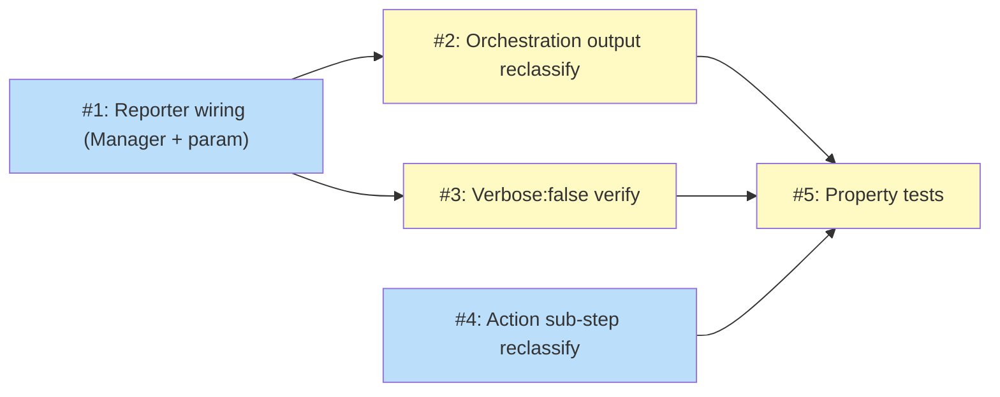

# PLAN: Install UX v2

## Status

Draft

## Scope Summary

Wire `progress.Reporter` through all layers of `tsuku install`/`tsuku update` so a single spinner owns the terminal for the full install duration, including recursive dependency installs. Non-TTY output is reduced to 4–6 permanent lines per tool.

## Decomposition Strategy

**Horizontal.** Each implementation phase from the design maps to one issue. The layers have a clear prerequisite ordering — Manager wiring first, command layer next, action files independently — with tests as the final gate. Issues 2, 3, and 4 can be worked in parallel after issue 1 lands.

## Issue Outlines

### Issue 1: refactor(install): add Reporter to Manager and thread through install call chain

**Complexity:** testable

**Goal:** Add `SetReporter()`/`getReporter()` to `internal/install/Manager`; replace fmt.Printf in manager.go/library.go/bootstrap.go with Status/silence; move reporter creation to `runInstallWithTelemetry`; add reporter as parameter to `installWithDependencies`; call `mgr.SetReporter(reporter)` and `exec.SetReporter(reporter)` in each invocation; move `defer reporter.Stop()` to top level.

**Acceptance Criteria:**
- `Manager` has a `reporter progress.Reporter` field
- `SetReporter(r progress.Reporter)` stores the reporter on the struct
- `getReporter()` returns `progress.NoopReporter{}` when nil, stored reporter otherwise
- All `fmt.Printf` calls in manager.go, library.go, bootstrap.go are removed or replaced — none write to stdout
- `installWithDependencies` accepts `reporter progress.Reporter` as its last parameter
- `runInstallWithTelemetry` creates the reporter, passes it to `installWithDependencies`, defers `reporter.Stop()`
- Each `installWithDependencies` invocation calls `mgr.SetReporter(reporter)` and `exec.SetReporter(reporter)` with the shared instance
- `go test ./...` passes

**Dependencies:** None

---

### Issue 2: refactor(install): reclassify orchestration output to Reporter channels

**Complexity:** testable

**Goal:** Replace all `printInfof`/`fmt.Printf` progress calls in `install_deps.go` and `install_lib.go` with Reporter calls per the Decision 2 classification: `Log()` for start/done, `Status()` for intermediates, `DeferWarn()` for PATH guidance. Remove emoji completion lines.

**Acceptance Criteria:**
- No `printInfof` or `fmt.Printf` progress output remains in install_deps.go or install_lib.go (stderr warnings via `fmt.Fprintf(os.Stderr, ...)` are acceptable)
- "Installing X@Y..." uses `reporter.Log()`
- "X@Y installed" uses `reporter.Log()`
- Intermediate labels (dep-checking, plan generation, already-installed) use `reporter.Status()`
- PATH guidance uses `reporter.DeferWarn()`
- Emoji `📍`/`🔗` completion lines are removed
- `go test ./...` passes

**Dependencies:** <<ISSUE:1>>

---

### Issue 3: refactor(install): suppress verify sub-steps during post-install check

**Complexity:** simple

**Goal:** Change the `RunToolVerification` call in `install_deps.go` from `Verbose: true` to `Verbose: false`. The `tsuku verify` command's call site is unchanged.

**Acceptance Criteria:**
- `install_deps.go` passes `Verbose: false` to `RunToolVerification`
- `tsuku verify <tool>` still prints full sub-step output
- `go test ./...` passes

**Dependencies:** <<ISSUE:1>>

---

### Issue 4: refactor(actions): reclassify sub-step Log calls to Status or silence

**Complexity:** testable

**Goal:** Convert ~20 `reporter.Log()` calls across extract.go, run_command.go, install_binaries.go, install_libraries.go, link_dependencies.go to `reporter.Status(fmt.Sprintf(...))` or remove them per the Decision 4 classification table. Bulk-count milestones, command output, retry notices, and skip notices remain as `Log()`.

**Acceptance Criteria:**
- extract.go: "Extracting:" → Status; "Format:", "Strip dirs:" → removed
- run_command.go: "Running:" → Status; "Description:", "Working dir:", "Command executed successfully" → removed; "Output:", "Skipping (requires sudo):" → remain as Log
- install_binaries.go: "Installing directory tree to:", "Copying directory tree..." → Status; per-file "Installed" lines → removed; bulk count remains as Log
- install_libraries.go: per-file "Installed symlink:", "Installed:" → removed; bulk count remains as Log
- link_dependencies.go: per-file "Linked:", "Linked (symlink):", "Already linked:" → removed; bulk count "Linking N library file(s)" remains as Log
- `go test ./...` passes

**Dependencies:** None

---

### Issue 5: test(install): verify Reporter output classification and single-spinner invariant

**Complexity:** testable

**Goal:** Add property tests covering three correctness properties: Manager stdout escape, action sub-step Log/Status/silence classification, and single-Stop invariant across recursive install calls.

**Acceptance Criteria:**
- `internal/install/manager_test.go`:
  - `TestManagerGetReporter_NilReturnsNoop` — getReporter() returns NoopReporter{} when nil
  - `TestManagerInstallWithOptions_NoStdoutEscape` — 0 bytes on os.Stdout when reporter is set; Logs is empty
- `internal/executor/install_output_test.go`:
  - `TestExtractActionReporterClassification` — hasStatus("Extracting:"); !hasLog("Extracting:"), !hasLog("Format:"), !hasLog("Strip dirs:")
  - `TestRunCommandReporterClassification` — hasStatus("Running:"); !hasLog("Running:"); !hasLog("Description:"); !hasLog("Command executed successfully"); hasLog("Output:")
  - `TestInstallBinariesReporterClassification` — no per-file "Installed" lines in Logs
  - `TestLinkDependenciesReporterClassification` — per-file lines absent from Logs; bulk count present in Logs
  - `TestNonTTYInstallLogLines` updated to not assert on lines now classified as Status
- `cmd/tsuku/install_deps_test.go`:
  - `TestInstallWithDependencies_SingleReporterStop` — StopCount == 0 after return (Stop is caller's responsibility)
  - `TestInstallWithDependencies_NoStdoutEscape` — 0 bytes on os.Stdout
- `go test ./...` passes

**Dependencies:** <<ISSUE:1>>, <<ISSUE:2>>, <<ISSUE:3>>, <<ISSUE:4>>

---

## Dependency Graph

**Legend**: Green = done, Blue = ready, Yellow = blocked

## Implementation Sequence

**Critical path:** Issue 1 → Issues 2 + 3 (parallel) → Issue 5

Issue 4 is independent and can be worked in parallel with any other issue. Issues 2 and 3 can be worked in parallel after issue 1 merges. Issue 5 is the final gate requiring all four prior issues.

**Parallelization opportunity:** After issue 1 is complete, issues 2, 3, and 4 can all proceed simultaneously.
